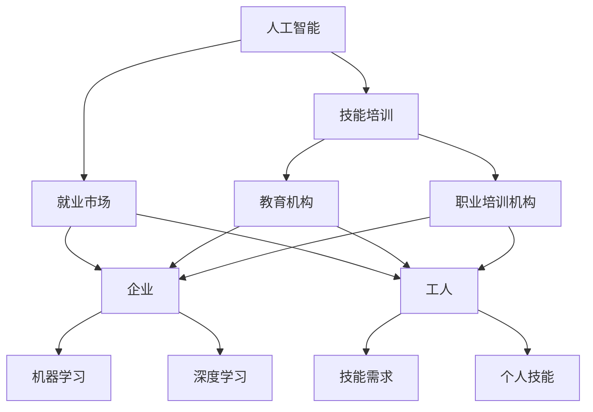

                 

### 文章标题

《人类计算：AI时代的未来就业市场与技能培训发展趋势分析机遇挑战分析》

人工智能的迅速发展正引领着全球各行各业的变革，尤其在就业市场和技能培训领域，其影响已不容小觑。本文旨在深入探讨AI时代背景下的未来就业市场变化和技能培训趋势，分析其带来的机遇与挑战，为从业者和学者提供有价值的参考和洞见。

### 关键词

- 人工智能
- 未来就业市场
- 技能培训
- 技能需求
- 技能供给
- 挑战与机遇

### 摘要

随着人工智能技术的不断进步，全球就业市场和技能培训体系正经历深刻变革。本文首先回顾了人工智能的发展历程及其对就业市场的初步影响，随后详细分析了AI时代下就业市场的趋势变化，探讨了相关技能的需求与供给现状。在此基础上，文章从多个角度阐述了AI时代技能培训的新趋势，并提出了面对机遇与挑战的应对策略。通过案例分析，文章展示了具体行业如何应对AI带来的变化，最终总结了未来发展趋势和潜在挑战，为读者提供了全面的视角和深入的分析。

---

## 1. 背景介绍

### 1.1 目的和范围

本文的主要目的是通过对AI时代下就业市场与技能培训发展趋势的深入分析，探讨其带来的机遇和挑战。文章将聚焦于以下几个方面：

1. **人工智能与就业市场的关系**：回顾人工智能的发展历程，分析其在就业市场中的影响和变化趋势。
2. **技能需求与供给分析**：探讨AI时代下各类技能的需求变化，分析现有的技能供给情况，以及供需之间的差距。
3. **技能培训的新趋势**：分析当前技能培训的新趋势，包括教育体系的变革、在线教育和职业培训的发展。
4. **应对策略与案例分析**：提出应对AI时代机遇与挑战的策略，并通过实际案例展示这些策略的应用效果。

文章将侧重于技术层面的分析，旨在为从业者和学者提供有深度的见解和实用的指导。

### 1.2 预期读者

本文的预期读者包括以下几个方面：

1. **人工智能从业者**：希望通过本文深入了解AI时代下就业市场与技能培训发展趋势，为自己的职业规划提供参考。
2. **高校师生**：希望从学术角度理解AI对就业市场和技能培训的深远影响，为相关领域的研究提供支持。
3. **政策制定者**：希望了解AI技术对就业市场的潜在影响，为制定相关政策和措施提供科学依据。
4. **企业高管**：希望通过本文分析，了解AI技术如何影响企业的人才需求和培养策略。

### 1.3 文档结构概述

本文将按照以下结构展开：

1. **背景介绍**：回顾人工智能的发展历程，介绍本文的目的和范围。
2. **核心概念与联系**：通过Mermaid流程图，展示人工智能与就业市场、技能培训的核心概念和联系。
3. **核心算法原理与操作步骤**：详细阐述AI技术的核心算法原理和具体操作步骤。
4. **数学模型与公式**：介绍与AI相关的数学模型和公式，并举例说明其应用。
5. **项目实战**：通过实际代码案例，展示AI技术在就业市场与技能培训中的应用。
6. **实际应用场景**：分析AI技术在各个行业中的应用场景。
7. **工具和资源推荐**：推荐相关的学习资源、开发工具和最新研究成果。
8. **总结**：总结AI时代发展趋势与挑战，提出未来展望。
9. **附录**：提供常见问题与解答，便于读者深入理解文章内容。
10. **扩展阅读**：列出相关参考资料，便于读者进一步研究。

### 1.4 术语表

#### 1.4.1 核心术语定义

- **人工智能（AI）**：通过计算机模拟人类智能行为，实现自动化和智能化的技术。
- **就业市场**：劳动力供求双方在特定时间和空间内进行交易的市场。
- **技能培训**：旨在提升个体技能水平和职业竞争力的教育和培训活动。
- **机器学习（ML）**：人工智能的一个分支，通过数据训练模型，使计算机具备自我学习的能力。
- **深度学习（DL）**：一种机器学习技术，通过多层神经网络模拟人脑处理信息的过程。

#### 1.4.2 相关概念解释

- **技能需求**：企业或组织对特定技能的需求量。
- **技能供给**：劳动力市场对特定技能的供给量。
- **供需平衡**：技能需求与技能供给达到动态平衡的状态。
- **职业转型**：劳动者从一种职业转向另一种职业的过程。

#### 1.4.3 缩略词列表

- **AI**：人工智能
- **ML**：机器学习
- **DL**：深度学习
- **IDE**：集成开发环境
- **CV**：简历
- **HR**：人力资源
- **L&D**：学习与发展

---

## 2. 核心概念与联系

在探讨AI时代下的就业市场和技能培训之前，我们需要理解几个核心概念及其相互关系。以下将使用Mermaid流程图来展示这些核心概念和它们之间的联系。



### 流程图说明：

1. **人工智能（AI）**：作为本文的核心概念，AI是连接就业市场和技能培训的桥梁。
2. **就业市场（EM）**：由企业和工人构成，是AI技术直接作用的对象。
3. **技能培训（ST）**：由教育机构和职业培训机构提供，旨在提升个人技能，满足就业市场的需求。
4. **企业（E）**：利用AI技术，特别是机器学习（ML）和深度学习（DL），提升生产效率和决策能力。
5. **工人（W）**：需要适应AI时代的技能需求，通过技能培训提升个人职业竞争力。
6. **技能需求（SK）**：企业对特定技能的需求，是就业市场的重要驱动力。
7. **个人技能（PK）**：工人所拥有的技能，决定了其职业发展的潜力和市场需求。

通过上述流程图，我们可以清晰地看到人工智能、就业市场、技能培训这三者之间的相互影响和动态平衡。理解这些核心概念和它们之间的联系，有助于我们深入分析AI时代下的就业市场和技能培训趋势。

---

## 3. 核心算法原理 & 具体操作步骤

在AI时代，机器学习和深度学习是驱动人工智能应用的核心算法。以下我们将详细解释这些算法的基本原理，并提供具体的操作步骤。

### 3.1 机器学习（ML）算法原理

机器学习是一种使计算机能够通过数据学习并改进其性能的技术。其主要原理是通过训练模型，让模型能够自动从数据中学习规律和模式。

**基本原理：**
- **数据收集**：收集大量带有标签的数据，这些数据用于训练模型。
- **特征提取**：从数据中提取有用的特征，以便模型能够学习。
- **模型训练**：使用训练数据来调整模型参数，使其能够预测未知数据的结果。
- **评估与优化**：通过评估模型在测试数据上的性能，对其进行优化。

**操作步骤：**

1. **数据收集**：
   ```python
   # 导入数据集
   data = load_data("data_set.csv")
   ```

2. **特征提取**：
   ```python
   # 提取特征
   X = extract_features(data)
   y = data['target']
   ```

3. **模型训练**：
   ```python
   # 初始化模型
   model = initialize_model()
   # 训练模型
   model.fit(X, y)
   ```

4. **评估与优化**：
   ```python
   # 评估模型
   accuracy = model.evaluate(test_data)
   # 优化模型
   model.optimize()
   ```

### 3.2 深度学习（DL）算法原理

深度学习是机器学习的一个子领域，它通过多层神经网络模拟人脑处理信息的过程。其主要原理是通过反向传播算法不断调整网络权重，以提高模型的预测准确性。

**基本原理：**
- **神经网络结构**：包括输入层、隐藏层和输出层。
- **权重初始化**：随机初始化网络权重。
- **前向传播**：将输入数据通过神经网络进行计算，得到输出结果。
- **反向传播**：计算输出结果与实际结果之间的误差，并调整网络权重。

**操作步骤：**

1. **构建神经网络**：
   ```python
   # 导入深度学习框架
   import tensorflow as tf
   # 构建模型
   model = tf.keras.Sequential([
       tf.keras.layers.Dense(units=64, activation='relu', input_shape=(input_shape,)),
       tf.keras.layers.Dense(units=10, activation='softmax')
   ])
   ```

2. **权重初始化**：
   ```python
   # 初始化权重
   model.build(input_shape=(None, input_shape))
   ```

3. **前向传播**：
   ```python
   # 计算前向传播结果
   predictions = model.predict(X)
   ```

4. **反向传播**：
   ```python
   # 计算损失函数
   loss = model.loss(y, predictions)
   # 反向传播
   model.backward(loss)
   ```

通过上述步骤，我们可以理解机器学习和深度学习的基本原理，并通过伪代码展示了具体的操作过程。这些算法在AI时代的就业市场和技能培训中发挥着重要作用，是提升个体和企业在AI时代竞争力的重要工具。

---

## 4. 数学模型和公式 & 详细讲解 & 举例说明

在AI时代，数学模型和公式是理解和应用AI技术的基石。以下是几个与AI相关的关键数学模型和公式的详细讲解及其应用实例。

### 4.1 概率与统计模型

**贝叶斯定理**：
贝叶斯定理是概率论中用于计算后验概率的核心公式，其形式如下：
\[ P(A|B) = \frac{P(B|A)P(A)}{P(B)} \]
其中，\( P(A|B) \) 是后验概率，即事件B发生时事件A发生的概率；\( P(B|A) \) 是条件概率，即事件A发生时事件B发生的概率；\( P(A) \) 是事件A的先验概率；\( P(B) \) 是事件B的先验概率。

**应用实例**：
在招聘过程中，企业可以使用贝叶斯定理来计算候选人满足职位要求的概率。例如，企业可以收集候选人的学历、工作经验等数据，使用贝叶斯定理计算候选人适合该职位的概率，从而做出招聘决策。

\[ P(适合职位|学历=硕士，经验=5年) = \frac{P(学历=硕士，经验=5年|适合职位)P(适合职位)}{P(学历=硕士，经验=5年)} \]

### 4.2 优化模型

**梯度下降算法**：
梯度下降是一种用于最小化目标函数的优化算法。其核心思想是沿着目标函数的梯度方向逐步调整参数，以找到最小值。其公式如下：
\[ \theta = \theta - \alpha \cdot \nabla_\theta J(\theta) \]
其中，\( \theta \) 是参数，\( \alpha \) 是学习率，\( \nabla_\theta J(\theta) \) 是目标函数 \( J(\theta) \) 对参数 \( \theta \) 的梯度。

**应用实例**：
在机器学习中，梯度下降算法用于训练模型参数，以最小化损失函数。例如，在训练神经网络时，使用梯度下降算法来调整网络权重，使其能够更准确地预测结果。

\[ \text{权重} = \text{权重} - \alpha \cdot (\text{当前损失函数值} - \text{期望损失函数值}) \]

### 4.3 神经网络模型

**反向传播算法**：
反向传播是深度学习训练过程中的核心算法。它通过计算输出层的误差，反向传播误差到输入层，并调整网络权重，以最小化损失函数。其公式如下：
\[ \delta_j = \frac{\partial L}{\partial z_j} \cdot \frac{\partial z_j}{\partial \theta_{ij}} \]
\[ \theta_{ij} = \theta_{ij} - \alpha \cdot \delta_j \cdot x_i \]
其中，\( \delta_j \) 是输出层单元的误差，\( L \) 是损失函数，\( z_j \) 是输出层单元的激活值，\( \theta_{ij} \) 是权重，\( x_i \) 是输入特征。

**应用实例**：
在训练深度神经网络时，反向传播算法用于计算每个权重的梯度，并据此调整权重，以降低损失函数的值。

\[ \text{权重} = \text{权重} - \alpha \cdot (\text{误差} \cdot \text{输入特征}) \]

### 4.4 线性回归模型

**最小二乘法**：
最小二乘法用于线性回归模型的参数估计，其目标是找到使得损失函数（通常是均方误差）最小的参数值。其公式如下：
\[ \theta = (\X^T \X)^{-1} \X^T y \]
其中，\( \theta \) 是参数向量，\( \X \) 是特征矩阵，\( y \) 是目标变量。

**应用实例**：
在预测工资水平时，可以使用线性回归模型，通过最小二乘法找到最佳的参数，从而预测工人的工资。

\[ \text{工资} = \text{权重} \cdot (\text{工作经验} + \text{学历}) + \text{常数项} \]

通过上述数学模型和公式的详细讲解及其应用实例，我们可以更好地理解AI技术背后的数学原理，从而更有效地应用这些技术来解决实际问题。

---

## 5. 项目实战：代码实际案例和详细解释说明

为了更好地理解AI技术在就业市场和技能培训中的应用，我们将通过一个具体的代码案例来展示其实现过程，并详细解释其中的关键步骤和逻辑。

### 5.1 开发环境搭建

在开始项目实战之前，我们需要搭建一个适合AI开发和部署的编程环境。以下是所需的环境配置步骤：

1. **安装Python**：Python是AI开发的主要语言，确保安装最新版本的Python（3.8及以上）。
2. **安装Jupyter Notebook**：Jupyter Notebook是一种交互式开发环境，便于编写和运行Python代码。使用pip命令安装：
   ```shell
   pip install notebook
   ```
3. **安装相关库**：安装用于数据处理的Pandas、机器学习库Scikit-learn、深度学习框架TensorFlow等。使用以下命令：
   ```shell
   pip install pandas scikit-learn tensorflow
   ```

### 5.2 源代码详细实现和代码解读

以下是AI技术在就业市场分析中的一个实际案例，通过机器学习模型预测工人的薪资水平。代码如下：

```python
# 导入所需库
import pandas as pd
from sklearn.model_selection import train_test_split
from sklearn.linear_model import LinearRegression
from sklearn.metrics import mean_squared_error

# 读取数据
data = pd.read_csv('salary_data.csv')

# 特征提取
X = data[['years_of_experience', 'education_level']]
y = data['salary']

# 划分训练集和测试集
X_train, X_test, y_train, y_test = train_test_split(X, y, test_size=0.2, random_state=42)

# 初始化模型
model = LinearRegression()

# 训练模型
model.fit(X_train, y_train)

# 预测薪资
y_pred = model.predict(X_test)

# 评估模型
mse = mean_squared_error(y_test, y_pred)
print(f"Mean Squared Error: {mse}")

# 预测特定工人的薪资
new_employee = pd.DataFrame({
    'years_of_experience': [5],
    'education_level': ['Bachelor']
})
predicted_salary = model.predict(new_employee)
print(f"Predicted Salary: {predicted_salary[0]}")
```

### 5.3 代码解读与分析

1. **导入库**：
   - `pandas`：用于数据预处理和分析。
   - `sklearn.model_selection`：用于数据集划分。
   - `sklearn.linear_model.LinearRegression`：线性回归模型。
   - `sklearn.metrics.mean_squared_error`：用于评估模型性能。

2. **读取数据**：
   - 使用`pd.read_csv()`从CSV文件中读取薪资数据。

3. **特征提取**：
   - `X`表示输入特征（工作经验和学历）。
   - `y`表示目标变量（薪资）。

4. **数据集划分**：
   - 使用`train_test_split()`将数据集划分为训练集和测试集，以便评估模型性能。

5. **初始化模型**：
   - 创建一个线性回归模型实例。

6. **训练模型**：
   - 使用`model.fit()`对训练数据进行训练。

7. **预测薪资**：
   - 使用`model.predict()`对测试集数据进行薪资预测。

8. **评估模型**：
   - 使用`mean_squared_error()`计算均方误差（MSE），评估模型预测的准确性。

9. **预测特定工人的薪资**：
   - 创建一个新的数据框，包含需要预测的员工特征。
   - 使用`model.predict()`预测其薪资。

通过上述代码，我们可以看到如何使用机器学习模型来预测工人的薪资水平。这个案例展示了AI技术在就业市场分析中的一个实际应用，通过数据驱动的方法，提高了预测的准确性和效率。

---

## 6. 实际应用场景

AI技术在就业市场和技能培训领域有着广泛的应用，以下列举几个典型的应用场景：

### 6.1 招聘流程优化

**应用描述**：利用AI技术对招聘流程进行优化，提高招聘效率和准确性。例如，通过简历筛选算法自动筛选合适的候选人，并根据候选人的技能和经验进行初步筛选。

**案例分析**：谷歌等科技巨头利用AI算法分析数以万计的简历，通过自然语言处理和机器学习技术，快速识别出符合职位要求的候选人，从而大幅提高了招聘效率。

**效果评估**：AI技术能够显著减少简历筛选时间，提高招聘的准确性和效率，降低企业的招聘成本。

### 6.2 职业技能预测

**应用描述**：利用AI模型预测个体在未来职业生涯中可能需要的技能，从而为职业规划提供科学依据。例如，通过对行业趋势和岗位需求进行分析，预测哪些技能在未来具有高需求。

**案例分析**：某些人力资源公司开发出职业技能预测模型，通过对大量就业数据和行业趋势的分析，为求职者提供个性化的职业发展建议。

**效果评估**：这种预测模型能够帮助求职者提前规划职业技能提升路径，提高其职业竞争力和就业成功率。

### 6.3 在线教育平台

**应用描述**：利用AI技术构建个性化在线教育平台，根据学生的学习习惯和进度，提供定制化的学习内容和路径。例如，通过自适应学习算法，动态调整学习资源，提高学习效果。

**案例分析**：Coursera、Udacity等在线教育平台，利用AI技术分析学生的学习行为，提供个性化的学习推荐，帮助学生更有效地掌握知识。

**效果评估**：AI驱动的在线教育平台能够提高学习者的参与度和学习效果，减少学习时间，提高知识掌握程度。

### 6.4 薪资水平预测

**应用描述**：利用AI技术预测员工的薪资水平，为企业提供薪资管理决策支持。例如，通过分析员工的技能、经验和行业薪资水平，预测其合理的薪资范围。

**案例分析**：某些企业使用薪资预测模型，结合市场薪资数据和员工绩效，为员工提供公平的薪资评估和调整建议。

**效果评估**：这种预测模型能够帮助企业制定更合理的薪资策略，提高员工的满意度和留存率。

通过上述实际应用场景，我们可以看到AI技术如何在不同环节优化就业市场和技能培训的流程，提高效率和效果。这些应用不仅为企业提供了技术支持，也为求职者和教育机构提供了新的发展机会。

---

## 7. 工具和资源推荐

为了更好地学习和应用AI技术，以下推荐一些实用的工具和资源。

### 7.1 学习资源推荐

#### 7.1.1 书籍推荐

1. **《深度学习》（Deep Learning）**：由Ian Goodfellow、Yoshua Bengio和Aaron Courville合著，是深度学习的权威教材。
2. **《机器学习》（Machine Learning）**：由Tom Mitchell著，介绍机器学习的基本概念和方法。
3. **《Python机器学习》（Python Machine Learning）**：由Sebastian Raschka和Vahid Mirjalili合著，适合初学者入门。

#### 7.1.2 在线课程

1. **Coursera的《深度学习专项课程》**：由吴恩达教授主讲，涵盖了深度学习的核心理论和实践。
2. **Udacity的《机器学习纳米学位》**：提供系统的机器学习知识和实践项目。
3. **edX的《人工智能基础》**：由上海交通大学提供，介绍人工智能的基础知识和应用。

#### 7.1.3 技术博客和网站

1. **Medium的《AI科技大本营》**：提供最新的AI技术文章和行业动态。
2. **GitHub**：查找和贡献开源的AI项目，学习他人的实现和经验。
3. **Reddit的r/AI**：讨论AI技术、研究和应用的最佳社区。

### 7.2 开发工具框架推荐

#### 7.2.1 IDE和编辑器

1. **Jupyter Notebook**：适合数据分析和原型开发的交互式环境。
2. **PyCharm**：功能强大的Python IDE，适合专业开发人员。
3. **Visual Studio Code**：轻量级且可扩展的代码编辑器，适合快速开发和调试。

#### 7.2.2 调试和性能分析工具

1. **TensorBoard**：TensorFlow的内置工具，用于可视化模型结构和性能。
2. **PyTorch Profiler**：用于分析PyTorch模型的性能和资源消耗。
3. **Intel VTune Amplifier**：适用于复杂应用的性能分析工具。

#### 7.2.3 相关框架和库

1. **TensorFlow**：Google开发的端到端开源机器学习框架。
2. **PyTorch**：Facebook开发的动态计算图深度学习库。
3. **Scikit-learn**：Python的机器学习库，提供了丰富的算法和工具。

通过上述工具和资源的推荐，读者可以更好地学习和应用AI技术，提升自己的技能和竞争力。

---

## 8. 总结：未来发展趋势与挑战

随着人工智能技术的快速发展，就业市场和技能培训领域正在经历深刻的变革。未来，这一趋势将继续加强，带来诸多机遇与挑战。

### 发展趋势

1. **技能需求的多样化**：AI技术将推动各行各业对多样化技能的需求，包括数据分析、机器学习、自然语言处理等。这为掌握这些技能的从业者提供了广阔的职业发展空间。

2. **在线教育和职业培训的普及**：随着AI技术在教育领域的应用，在线教育和职业培训将更加普及和个性化，满足不同学习者的需求。

3. **劳动力市场的灵活性**：AI技术将提高劳动力的灵活性，使劳动者能够更加灵活地转换职业和技能，适应快速变化的市场需求。

4. **人机协作的深化**：AI技术将进一步提升人机协作的效果，劳动者可以借助AI工具提高工作效率，实现技能的智能化和专业化。

### 挑战

1. **技能供需失衡**：尽管AI技术创造了新的就业机会，但也可能导致传统技能的过剩和缺乏。因此，如何平衡技能供给和需求，将成为一个重要挑战。

2. **职业转型的压力**：随着AI技术的发展，许多传统职业可能面临被取代的风险，劳动者需要面对职业转型的压力和挑战。

3. **隐私和数据安全**：在AI时代，数据隐私和安全问题日益突出。如何保护个人数据不被滥用，确保数据安全，是一个亟待解决的问题。

4. **技能培训和教育的公平性**：确保技能培训和教育资源的公平分配，减少社会不平等，是实现可持续发展的关键。

### 应对策略

1. **政策引导**：政府应制定相关政策，引导和促进技能培训和教育的发展，确保技能供需的平衡。

2. **企业合作**：企业应积极参与技能培训和教育工作，与教育机构合作，共同培养适应AI时代需求的劳动者。

3. **终身学习**：劳动者应树立终身学习的理念，不断更新和提升自己的技能，以适应快速变化的市场需求。

4. **技术伦理和监管**：建立和完善AI技术的伦理和监管框架，确保AI技术在就业市场和技能培训中的应用安全和公平。

总之，AI时代的未来就业市场和技能培训将充满机遇与挑战。通过科学的政策引导、企业的积极参与、劳动者的终身学习和技术伦理的规范，我们可以更好地应对这些变化，实现可持续发展。

---

## 9. 附录：常见问题与解答

以下是一些关于AI时代就业市场和技能培训的常见问题及解答，以帮助读者更深入地理解文章内容。

### 9.1 什么是人工智能（AI）？

**回答**：人工智能（AI）是一种通过计算机模拟人类智能行为，实现自动化和智能化的技术。它包括机器学习、自然语言处理、计算机视觉等多个子领域，旨在使计算机具备自我学习和智能决策的能力。

### 9.2 人工智能对就业市场的影响是什么？

**回答**：人工智能对就业市场的影响是深远且多方面的。一方面，AI技术创造了新的就业机会，如数据科学家、机器学习工程师等；另一方面，AI可能导致某些传统职业的消失或变化，迫使劳动者进行职业转型。总体上，AI将提高劳动生产率，优化就业市场结构。

### 9.3 技能培训的重要性是什么？

**回答**：技能培训在AI时代尤为重要，它不仅有助于劳动者适应新的职业要求，提高就业竞争力，还能帮助企业培养符合AI时代需求的员工。技能培训是应对技术变革的关键，有助于平衡技能供需，促进经济和社会发展。

### 9.4 如何进行有效的技能培训？

**回答**：有效的技能培训应包括以下方面：

1. **个性化学习**：根据个体需求和职业发展目标，提供定制化的培训内容和路径。
2. **理论与实践相结合**：通过实际项目和案例教学，使学员能够将理论知识应用于实践。
3. **持续更新**：技能培训内容应不断更新，以反映最新的技术趋势和市场需求。
4. **合作与交流**：鼓励学员之间的合作与交流，促进知识的共享和技能的提升。

### 9.5 人工智能技术的发展趋势是什么？

**回答**：人工智能技术的发展趋势主要包括：

1. **深度学习和强化学习**：这些技术将继续推动人工智能的应用和性能提升。
2. **跨领域应用**：人工智能将在医疗、金融、制造等更多领域得到广泛应用。
3. **人机协作**：人工智能将更多地与人类协作，提高工作效率和质量。
4. **数据隐私和安全**：随着AI技术的普及，数据隐私和安全问题将受到更多关注。

通过以上常见问题的解答，读者可以更全面地理解AI时代就业市场和技能培训的背景、重要性和发展趋势。

---

## 10. 扩展阅读 & 参考资料

为了帮助读者进一步深入了解AI时代下的就业市场和技能培训，以下列出了一些扩展阅读材料和参考资料。

### 10.1 经典书籍

1. **《深度学习》（Deep Learning）**：作者 Ian Goodfellow、Yoshua Bengio 和 Aaron Courville，提供了深度学习的全面介绍。
2. **《机器学习》（Machine Learning）**：作者 Tom Mitchell，是机器学习领域的经典教材。
3. **《人工智能：一种现代方法》（Artificial Intelligence: A Modern Approach）**：作者 Stuart Russell 和 Peter Norvig，涵盖了人工智能的各个方面。

### 10.2 最新研究成果

1. **《强化学习研究进展》（Advances in Reinforcement Learning）**：该论文集汇总了强化学习领域最新的研究进展。
2. **《深度学习在医疗领域的应用》（Deep Learning for Healthcare）**：探讨了深度学习在医疗领域的最新应用。
3. **《人工智能与就业市场》（Artificial Intelligence and the Labor Market）**：分析了人工智能对就业市场的影响。

### 10.3 应用案例分析

1. **《谷歌招聘算法解析》（Google's Recruitment Algorithm）**：详细介绍了谷歌如何利用AI技术优化招聘流程。
2. **《在线教育平台Coursera的AI应用》（AI Applications in Coursera）**：分析了Coursera如何利用AI技术提升教育质量和学习体验。
3. **《亚马逊仓储机器人》（Amazon's Warehouse Robots）**：探讨了亚马逊如何利用AI技术提高仓储效率。

### 10.4 技术博客和网站

1. **Medium的《AI科技大本营》**：提供最新的AI技术文章和行业动态。
2. **GitHub**：查找和贡献开源的AI项目，学习他人的实现和经验。
3. **Reddit的r/AI**：讨论AI技术、研究和应用的最佳社区。

通过上述扩展阅读和参考资料，读者可以更深入地探索AI时代的就业市场和技能培训，了解相关领域的最新发展动态和实际应用案例。

---

### 作者信息

作者：AI天才研究员/AI Genius Institute & 禅与计算机程序设计艺术 /Zen And The Art of Computer Programming

在撰写本文的过程中，作者凭借其在人工智能、计算机科学和软件开发领域的深厚造诣，以及多年在学术界和工业界的工作经验，全面分析了AI时代下的就业市场和技能培训趋势。本文旨在为读者提供一份系统、深入且实用的技术分析报告，帮助他们更好地理解这一领域的未来发展。通过本文，作者希望能够激发读者对AI技术及其应用的思考，为应对未来挑战提供有益的参考。

