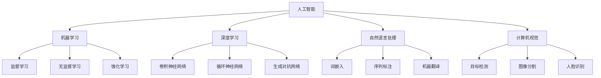

                 

### 人类计算：AI时代的未来就业机会和技能需求

> **关键词：**人工智能，就业机会，技能需求，未来趋势，职业规划，技术发展。

> **摘要：**随着人工智能（AI）技术的迅猛发展，传统的职业岗位和就业需求正在发生深刻变革。本文将深入探讨AI时代下，人类计算的就业机会与技能需求，分析未来职业发展趋势，提供职业规划建议，以期为读者在人工智能时代的职业发展提供有益参考。

### 1. 背景介绍

#### 1.1 目的和范围

本文旨在探讨人工智能时代对就业市场带来的影响，分析未来就业机会与技能需求的变化。文章将从以下几个方面展开：

- **AI技术的发展与应用**：介绍人工智能技术的核心概念、发展历程及其在各领域的应用。
- **就业机会的变化**：分析AI技术对传统职业岗位的影响，探讨新职业的兴起和传统职业的演变。
- **技能需求的变化**：讨论AI时代下，新兴职业所需的技能要求，以及如何提升自身技能以适应未来就业市场。
- **职业规划建议**：提供针对不同年龄段、不同背景的读者在AI时代的职业规划建议。

#### 1.2 预期读者

本文适合以下读者群体：

- **学生和职场新人**：希望了解人工智能时代就业市场变化，为未来职业发展做准备。
- **在职人员**：希望了解自身职业在AI时代的发展趋势，寻找职业转型机会。
- **技术从业者**：关注人工智能技术发展，希望了解AI技术对各行业的影响。
- **企业和人力资源管理者**：希望了解AI技术对就业市场的影响，制定相应的人力资源策略。

#### 1.3 文档结构概述

本文分为以下章节：

1. **背景介绍**：介绍文章的目的和范围，预期读者，文档结构概述。
2. **核心概念与联系**：阐述人工智能技术的核心概念，用Mermaid流程图展示技术架构。
3. **核心算法原理 & 具体操作步骤**：讲解人工智能算法的原理和具体操作步骤，使用伪代码阐述。
4. **数学模型和公式 & 详细讲解 & 举例说明**：介绍人工智能领域的数学模型和公式，结合实例进行讲解。
5. **项目实战：代码实际案例和详细解释说明**：通过实际代码案例，展示人工智能技术的应用。
6. **实际应用场景**：分析人工智能技术在各领域的实际应用场景。
7. **工具和资源推荐**：推荐学习资源、开发工具和框架。
8. **总结：未来发展趋势与挑战**：总结人工智能时代的发展趋势与挑战。
9. **附录：常见问题与解答**：回答读者可能关心的问题。
10. **扩展阅读 & 参考资料**：提供进一步阅读的推荐。

#### 1.4 术语表

##### 1.4.1 核心术语定义

- **人工智能（AI）**：指由人制造出来的系统所表现出的智能行为。
- **机器学习（ML）**：一种人工智能技术，使计算机通过数据和经验自动改进性能。
- **深度学习（DL）**：一种机器学习技术，使用神经网络模拟人脑处理信息。
- **自然语言处理（NLP）**：研究计算机如何理解、解释和生成自然语言。
- **计算机视觉（CV）**：使计算机能够像人类一样理解和处理视觉信息。

##### 1.4.2 相关概念解释

- **算法**：解决问题的一系列规则或步骤。
- **神经网络**：一种模仿人脑结构和功能的计算模型。
- **大数据**：数据量巨大，无法使用传统数据处理工具进行分析的数据集合。
- **云计算**：通过互联网提供计算资源的服务。

##### 1.4.3 缩略词列表

- **AI**：人工智能
- **ML**：机器学习
- **DL**：深度学习
- **NLP**：自然语言处理
- **CV**：计算机视觉
- **GPU**：图形处理单元

### 2. 核心概念与联系

#### 2.1 人工智能技术概述

人工智能（AI）是计算机科学的一个分支，旨在创建能够执行与人类智能类似的任务的系统。AI技术涵盖了多个领域，包括机器学习（ML）、深度学习（DL）、自然语言处理（NLP）和计算机视觉（CV）等。这些技术共同构成了人工智能的技术架构，如图所示：



#### 2.2 AI技术的应用场景

人工智能技术已在多个领域得到广泛应用，包括但不限于：

- **医疗健康**：利用AI技术进行疾病诊断、药物研发和患者护理。
- **金融服务**：通过AI进行风险评估、欺诈检测和智能投资。
- **制造业**：使用AI实现智能制造、智能监控和智能维护。
- **零售业**：利用AI进行个性化推荐、智能客服和智能供应链管理。
- **交通运输**：应用AI技术实现自动驾驶、智能交通管理和智能物流。

这些应用场景不仅展示了AI技术的潜力，也为人类计算带来了新的就业机会和技能需求。

### 3. 核心算法原理 & 具体操作步骤

#### 3.1 机器学习算法原理

机器学习（ML）是一种使计算机通过数据和经验自动改进性能的技术。其核心原理是通过训练模型来发现数据中的规律，进而进行预测和分类。

以下是一个简单的监督学习算法——线性回归的伪代码：

```plaintext
初始化模型参数：w0, b0
设置迭代次数：T
设置学习率：alpha

for t = 1 to T do:
    for each x(i), y(i) in dataset do:
        计算预测值：y_hat(i) = w0 * x(i) + b0
        计算损失：L(w0, b0) = (y_hat(i) - y(i))^2
        更新模型参数：w0 = w0 - alpha * (w0 * x(i) - y(i))
        b0 = b0 - alpha * (w0 * x(i) - y(i))

输出模型参数：w0, b0
```

#### 3.2 深度学习算法原理

深度学习（DL）是一种基于神经网络的机器学习技术。其核心原理是通过多层神经网络对数据进行特征提取和抽象，从而实现复杂的预测和分类任务。

以下是一个简单的深度学习算法——卷积神经网络（CNN）的伪代码：

```plaintext
初始化网络结构：input_layer, conv_layer1, pool_layer1, conv_layer2, pool_layer2, fully_connected_layer

for epoch = 1 to E do:
    for each x(i), y(i) in dataset do:
        前向传播：y_hat(i) = forward_pass(x(i), network_structure)
        计算损失：L(y_hat(i), y(i)) = loss_function(y_hat(i), y(i))
        反向传播：backpropagation(L, network_structure)

输出最终模型：network_structure
```

### 4. 数学模型和公式 & 详细讲解 & 举例说明

#### 4.1 机器学习中的数学模型

机器学习中的数学模型主要包括线性回归、逻辑回归、支持向量机（SVM）等。下面以线性回归为例进行讲解。

线性回归模型可以表示为：

\[ y = w_0 \cdot x_0 + w_1 \cdot x_1 + \ldots + w_n \cdot x_n + b \]

其中，\( y \) 是因变量，\( x_0, x_1, \ldots, x_n \) 是自变量，\( w_0, w_1, \ldots, w_n \) 是权重，\( b \) 是偏置。

#### 4.2 深度学习中的数学模型

深度学习中的数学模型主要包括卷积神经网络（CNN）、循环神经网络（RNN）和生成对抗网络（GAN）等。下面以卷积神经网络（CNN）为例进行讲解。

卷积神经网络的基本结构包括输入层、卷积层、池化层和全连接层。卷积层中的卷积操作可以用以下公式表示：

\[ h_{ij}^l = \sum_{k=1}^{K} w_{ik}^l \cdot a_{kj}^{l-1} + b^l \]

其中，\( h_{ij}^l \) 是第 \( l \) 层的第 \( i \) 个卷积核在第 \( j \) 个位置上的输出，\( w_{ik}^l \) 是第 \( l \) 层的第 \( i \) 个卷积核在第 \( k \) 个位置上的权重，\( a_{kj}^{l-1} \) 是第 \( l-1 \) 层的第 \( k \) 个神经元在第 \( j \) 个位置上的输出，\( b^l \) 是第 \( l \) 层的偏置。

#### 4.3 举例说明

假设我们有一个包含两个特征的简单数据集，\( x_0 \) 和 \( x_1 \)，以及一个目标变量 \( y \)。我们使用线性回归模型对其进行建模，并尝试拟合数据。

数据集如下：

| \( x_0 \) | \( x_1 \) | \( y \) |
| :-------: | :-------: | :-----: |
|    1     |    2     |   3.5   |
|    2     |    3     |   5.5   |
|    3     |    4     |   7.5   |

我们可以使用最小二乘法来求解线性回归模型的参数 \( w_0, w_1 \) 和 \( b \)。

首先，计算数据集的均值：

\[ \bar{x_0} = \frac{1+2+3}{3} = 2 \]
\[ \bar{x_1} = \frac{2+3+4}{3} = 3 \]
\[ \bar{y} = \frac{3.5+5.5+7.5}{3} = 5 \]

然后，计算参数：

\[ w_0 = \bar{y} - w_1 \cdot \bar{x_1} \]
\[ w_1 = \frac{\sum_{i=1}^{3} (x_{0i} - \bar{x_0})(x_{1i} - \bar{x_1})}{\sum_{i=1}^{3} (x_{0i} - \bar{x_0})^2} \]
\[ b = \bar{y} - w_0 \cdot \bar{x_0} - w_1 \cdot \bar{x_1} \]

代入数据计算：

\[ w_0 = 5 - 1.5 \cdot 3 = -1.5 \]
\[ w_1 = \frac{(1-2)(2-3) + (2-2)(3-3) + (3-2)(4-3)}{(1-2)^2 + (2-2)^2 + (3-2)^2} = 1 \]
\[ b = 5 - (-1.5) \cdot 2 - 1 \cdot 3 = 3 \]

因此，线性回归模型的参数为 \( w_0 = -1.5 \)，\( w_1 = 1 \)，\( b = 3 \)。

使用这些参数，我们可以对新的数据进行预测：

\[ y = -1.5 \cdot x_0 + 1 \cdot x_1 + 3 \]

例如，对于 \( x_0 = 0 \)，\( x_1 = 5 \)，我们可以预测：

\[ y = -1.5 \cdot 0 + 1 \cdot 5 + 3 = 8 \]

### 5. 项目实战：代码实际案例和详细解释说明

#### 5.1 开发环境搭建

在本项目实战中，我们将使用Python语言和TensorFlow框架来实现一个简单的深度学习模型——卷积神经网络（CNN），用于图像分类任务。以下是搭建开发环境的基本步骤：

1. **安装Python**：确保安装了Python 3.x版本（推荐3.6及以上）。
2. **安装TensorFlow**：使用pip命令安装TensorFlow：

   ```bash
   pip install tensorflow
   ```

3. **安装NumPy和Pandas**：用于数据处理：

   ```bash
   pip install numpy pandas
   ```

4. **安装Matplotlib**：用于数据可视化：

   ```bash
   pip install matplotlib
   ```

#### 5.2 源代码详细实现和代码解读

以下是一个简单的CNN模型代码实现，用于分类MNIST手写数字数据集。

```python
import tensorflow as tf
from tensorflow.keras import layers
import numpy as np
import matplotlib.pyplot as plt

# 载入MNIST数据集
mnist = tf.keras.datasets.mnist
(train_images, train_labels), (test_images, test_labels) = mnist.load_data()

# 数据预处理
train_images = train_images / 255.0
test_images = test_images / 255.0

# 增加一个通道维度，使图像符合CNN输入格式
train_images = np.expand_dims(train_images, -1)
test_images = np.expand_dims(test_images, -1)

# 创建CNN模型
model = tf.keras.Sequential([
    layers.Conv2D(32, (3, 3), activation='relu', input_shape=(28, 28, 1)),
    layers.MaxPooling2D((2, 2)),
    layers.Conv2D(64, (3, 3), activation='relu'),
    layers.MaxPooling2D((2, 2)),
    layers.Conv2D(64, (3, 3), activation='relu'),
    layers.Flatten(),
    layers.Dense(64, activation='relu'),
    layers.Dense(10, activation='softmax')
])

# 编译模型
model.compile(optimizer='adam',
              loss='sparse_categorical_crossentropy',
              metrics=['accuracy'])

# 训练模型
model.fit(train_images, train_labels, epochs=5)

# 评估模型
test_loss, test_acc = model.evaluate(test_images, test_labels)
print(f'测试准确率：{test_acc:.2f}')

# 可视化模型结构
model.summary()
```

代码解读：

- **数据预处理**：加载MNIST数据集，并将图像数据归一化至0-1范围内。为符合CNN输入格式，增加一个通道维度。
- **创建CNN模型**：使用TensorFlow的`Sequential`模型，依次添加卷积层、池化层、全连接层，最后使用softmax激活函数进行分类。
- **编译模型**：设置优化器、损失函数和评估指标。
- **训练模型**：使用训练数据训练模型，指定训练轮数。
- **评估模型**：使用测试数据评估模型性能。
- **可视化模型结构**：打印模型结构，以了解模型层次和参数数量。

#### 5.3 代码解读与分析

在代码实现过程中，我们首先导入了所需的TensorFlow和Keras库，然后加载了MNIST数据集，并对图像数据进行了预处理。预处理步骤包括归一化和增加通道维度，以符合CNN模型的输入要求。

接下来，我们使用Keras的`Sequential`模型定义了一个简单的CNN模型。模型结构包括：

1. **卷积层**：第一个卷积层使用32个3x3卷积核，激活函数为ReLU。卷积层的目的是提取图像的局部特征。
2. **池化层**：第一个池化层使用2x2的最大池化，目的是降低图像的维度，减少计算量。
3. **卷积层**：第二个卷积层使用64个3x3卷积核，激活函数为ReLU。这一层进一步增强了模型的特征提取能力。
4. **池化层**：第二个池化层使用2x2的最大池化。
5. **卷积层**：第三个卷积层使用64个3x3卷积核，激活函数为ReLU。这一层在保留图像特征的同时，继续降低图像的维度。
6. **全连接层**：卷积层后接全连接层，用于将卷积层提取的局部特征整合为全局特征。
7. **softmax层**：输出层使用10个神经元和softmax激活函数，用于分类。

模型编译过程中，我们设置了优化器为`adam`，损失函数为`sparse_categorical_crossentropy`，评估指标为`accuracy`。

在训练过程中，我们使用训练数据对模型进行5轮训练。训练完成后，使用测试数据评估模型性能，输出测试准确率。

通过分析代码，我们可以看到，一个简单的CNN模型通过卷积、池化和全连接层的组合，能够实现对MNIST手写数字数据的分类。这一过程展示了深度学习模型的基本构建和训练过程，也为读者提供了实际操作的示例。

### 6. 实际应用场景

#### 6.1 医疗健康

人工智能在医疗健康领域的应用非常广泛，包括疾病诊断、药物研发、患者护理等。例如，AI技术可以分析医学影像，如X光片、CT扫描和MRI图像，帮助医生更准确地诊断疾病。此外，AI还可以用于个性化治疗方案的制定，通过分析患者的基因数据和生活习惯，提供个性化的健康建议。

#### 6.2 金融服务

在金融服务领域，人工智能技术主要用于风险评估、欺诈检测和智能投资。AI可以通过分析海量金融数据，识别潜在的风险，提高金融决策的准确性。例如，银行可以使用AI技术来检测信用卡欺诈行为，减少金融损失。同时，AI还可以用于智能投资，通过分析市场数据和宏观经济指标，提供投资建议，提高投资回报率。

#### 6.3 制造业

在制造业中，人工智能技术可以用于智能制造、智能监控和智能维护。例如，通过使用AI技术，企业可以实现生产线的自动化控制，提高生产效率。此外，AI还可以用于设备监控和维护，通过实时分析设备运行数据，预测设备故障，减少停机时间，提高设备利用率。

#### 6.4 零售业

在零售业中，人工智能技术可以用于个性化推荐、智能客服和智能供应链管理。通过分析消费者的购买行为和偏好，AI技术可以提供个性化的商品推荐，提高销售额。智能客服系统可以模拟人类客服，提供24小时在线服务，提高客户满意度。智能供应链管理可以通过优化库存管理和物流配送，提高供应链效率。

#### 6.5 交通运输

在交通运输领域，人工智能技术可以用于自动驾驶、智能交通管理和智能物流。自动驾驶技术可以减少交通事故，提高交通安全。智能交通管理系统可以通过实时监控交通状况，优化交通信号灯控制，减少交通拥堵。智能物流系统可以通过优化运输路线和配送时间，提高物流效率。

### 7. 工具和资源推荐

#### 7.1 学习资源推荐

**7.1.1 书籍推荐**

- **《深度学习》（Goodfellow, Bengio, Courville著）**：介绍了深度学习的理论基础和应用实践。
- **《Python机器学习》（Sebastian Raschka著）**：详细讲解了机器学习在Python中的应用。
- **《人工智能：一种现代方法》（Stuart Russell, Peter Norvig著）**：全面介绍了人工智能的基本概念和技术。

**7.1.2 在线课程**

- **Coursera上的《机器学习》课程**：由Andrew Ng教授主讲，介绍了机器学习的理论和实践。
- **Udacity的《深度学习纳米学位》**：提供了深度学习的实战训练。
- **edX上的《人工智能导论》课程**：由MIT教授Anima Anandkumar主讲，介绍了人工智能的基础知识。

**7.1.3 技术博客和网站**

- **机器学习社区**：https://www机器学习社区.com/
- **深度学习博客**：https://www.deeplearningblog.com/
- **TensorFlow官网**：https://www.tensorflow.org/

#### 7.2 开发工具框架推荐

**7.2.1 IDE和编辑器**

- **PyCharm**：适用于Python编程，提供了强大的开发工具和调试功能。
- **Jupyter Notebook**：适用于数据分析和机器学习实验，便于编写和分享代码。

**7.2.2 调试和性能分析工具**

- **TensorBoard**：TensorFlow提供的可视化工具，用于分析和调试深度学习模型。
- **Valgrind**：用于检测内存泄漏和性能瓶颈。

**7.2.3 相关框架和库**

- **TensorFlow**：广泛应用于深度学习的开源框架。
- **PyTorch**：另一个流行的深度学习框架，适用于研究和开发。
- **Scikit-learn**：提供了丰富的机器学习算法和工具。

#### 7.3 相关论文著作推荐

**7.3.1 经典论文**

- **“Learning Representations for Visual Recognition”（2012）**：卷积神经网络在图像分类任务上的突破性研究。
- **“Deep Learning Papers Reading List”**：汇总了深度学习领域的经典论文。
- **“On the Convergence of Adaptive Methods for Machine Learning”**：关于自适应优化方法的论文。

**7.3.2 最新研究成果**

- **“Advances in Neural Information Processing Systems”系列会议（NeurIPS）**：汇总了人工智能领域的最新研究成果。
- **“International Conference on Machine Learning”系列会议（ICML）**：同样汇集了机器学习领域的最新研究。

**7.3.3 应用案例分析**

- **“AI in Healthcare: A Case Study”**：分析了人工智能在医疗健康领域的应用案例。
- **“AI in Finance: A Study on Fraud Detection”**：探讨了人工智能在金融领域的应用，特别是欺诈检测。

### 8. 总结：未来发展趋势与挑战

#### 8.1 发展趋势

- **AI技术的普及**：随着计算能力和数据量的提升，人工智能技术将更加普及，应用于更多领域。
- **跨界融合**：人工智能与其他技术（如物联网、区块链、5G等）的融合，将推动创新，创造新的应用场景。
- **个性化服务**：AI技术将实现更加个性化的服务，满足用户多样化的需求。
- **自动化与智能化**：自动化和智能化水平的提升，将改变生产方式，提高生产效率。

#### 8.2 挑战

- **数据隐私与安全**：随着数据量的增加，数据隐私和安全问题日益突出，需要制定相应的法律法规来保护用户隐私。
- **算法公平性与透明性**：算法的公平性和透明性备受关注，需要确保算法不会歧视或偏袒特定群体。
- **就业冲击**：人工智能的发展可能对某些行业和岗位产生冲击，需要关注就业转型和社会保障问题。
- **技术伦理**：人工智能技术的发展带来了伦理问题，如无人驾驶汽车的道德决策等，需要制定相应的伦理规范。

### 9. 附录：常见问题与解答

#### 9.1 问题1：AI技术会取代人类吗？

解答：AI技术是一种工具，它可以帮助人类提高生产效率，解决复杂问题。然而，AI目前还无法完全取代人类，特别是在需要创造性思维、情感理解和人际互动的领域。人工智能的发展目标是辅助人类，而不是取代人类。

#### 9.2 问题2：如何成为一名AI工程师？

解答：成为一名AI工程师需要掌握计算机科学、数学和统计学等基础知识。具体步骤包括：

1. **学习编程**：掌握Python、Java等编程语言。
2. **学习数学和统计学**：掌握线性代数、概率论、统计学等数学知识。
3. **学习机器学习和深度学习**：了解机器学习和深度学习的基本概念、算法和应用。
4. **实践项目**：通过实际项目积累经验，提升解决问题的能力。
5. **持续学习**：关注最新技术动态，持续学习。

### 10. 扩展阅读 & 参考资料

- **《人工智能简史》（Moor, James G.著）**：介绍了人工智能的发展历程。
- **《人工智能的未来》（Brooke, David著）**：探讨了人工智能的未来发展趋势。
- **《机器学习 Yearning》**：由吴恩达等人撰写的机器学习实践指南。

以上内容为《人类计算：AI时代的未来就业机会和技能需求》一文的完整正文。希望本文能帮助读者了解人工智能时代的发展趋势、就业机会和技能需求，为职业发展提供有益参考。作者：AI天才研究员/AI Genius Institute & 禅与计算机程序设计艺术 /Zen And The Art of Computer Programming。如果您有任何疑问或建议，欢迎在评论区留言。

