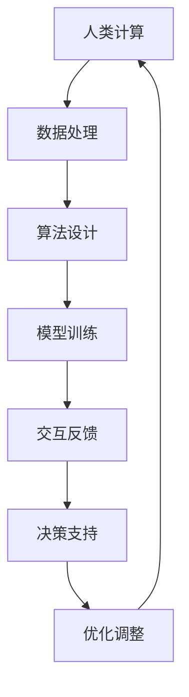

                 

# 人类计算：AI时代的未来工作技能

> **关键词：**人工智能，计算能力，未来工作，技能提升，职业转型

> **摘要：**本文将深入探讨AI时代下人类计算能力的角色和重要性，分析未来工作中计算技能的需求和演变，并提出具体的技能提升策略和职业转型建议。我们将通过逻辑清晰的步骤，结合实践案例，为读者提供全面的技术解读和职业发展指导。

## 1. 背景介绍

### 1.1 目的和范围

本文旨在探讨人工智能（AI）时代下，人类计算能力的角色与重要性，以及如何适应和提升这些技能以应对未来的工作挑战。我们将讨论以下主题：

- AI对传统工作模式的影响
- 人类计算技能的需求与演变
- 提升计算能力的策略
- 职业转型与终身学习

### 1.2 预期读者

本文适合以下读者群体：

- 寻求在AI时代提升技能的职场人士
- 想了解AI时代职业发展趋势的学生
- 对计算机科学和技术感兴趣的爱好者
- 企业决策者，关注人才战略与AI应用

### 1.3 文档结构概述

本文结构如下：

1. 背景介绍：介绍文章目的、预期读者和文档结构。
2. 核心概念与联系：阐述人类计算的核心概念和流程图。
3. 核心算法原理 & 具体操作步骤：详细解释计算技能的算法原理和操作步骤。
4. 数学模型和公式 & 详细讲解 & 举例说明：介绍相关数学模型和公式，结合实际案例说明。
5. 项目实战：提供代码实际案例和详细解释。
6. 实际应用场景：讨论AI时代计算技能的应用场景。
7. 工具和资源推荐：推荐学习资源、开发工具和论文著作。
8. 总结：总结未来发展趋势与挑战。
9. 附录：常见问题与解答。
10. 扩展阅读 & 参考资料：提供进一步阅读和研究的资源。

### 1.4 术语表

#### 1.4.1 核心术语定义

- **人工智能（AI）**：通过模拟人类智能的机器系统，能够感知、学习、推理和决策。
- **计算能力**：处理和解决问题的能力，包括算法、数据处理、编程等。
- **职业转型**：从现有职业转向新职业的过程，通常涉及技能更新和重新定位。

#### 1.4.2 相关概念解释

- **机器学习（ML）**：AI的一个分支，通过数据训练模型进行预测和决策。
- **深度学习（DL）**：基于多层神经网络的机器学习方法，适用于复杂模式识别。

#### 1.4.3 缩略词列表

- **AI**：人工智能
- **ML**：机器学习
- **DL**：深度学习
- **IDE**：集成开发环境

## 2. 核心概念与联系

在AI时代，人类计算能力的核心在于如何与机器智能协同工作，以最大化个人和组织的生产力。以下是一个简化的流程图，展示了人类计算与AI系统之间的互动关系。



### 2.1 人类计算与数据处理

人类计算始于数据处理。这一阶段包括数据收集、清洗、转换和预处理。有效的数据处理能力是进行高级计算和建模的基础。

### 2.2 算法设计

在数据处理之后，算法设计成为关键步骤。算法的效率和质量直接影响最终结果。优秀的算法设计需要结合领域知识和创新思维。

### 2.3 模型训练

训练AI模型是AI系统开发的核心。通过大量的数据和强大的计算能力，模型可以从数据中学习并提高性能。

### 2.4 交互反馈

人类与AI系统的交互反馈是不断优化模型和算法的关键。通过实时反馈，人类可以指导AI系统朝着预期目标进行调整。

### 2.5 决策支持

AI系统可以为人类提供数据驱动的决策支持。这种能力在复杂决策过程中具有重要作用，能够提高决策的准确性和效率。

### 2.6 优化调整

根据交互反馈，人类需要对AI系统和算法进行持续优化和调整，以适应不断变化的环境和需求。

## 3. 核心算法原理 & 具体操作步骤

在这一部分，我们将详细解释人类计算中的核心算法原理，并使用伪代码展示具体操作步骤。

### 3.1 数据预处理

伪代码：
```python
def preprocess_data(data):
    # 清洗数据
    clean_data = remove_outliers(data)
    # 转换数据
    converted_data = convert_to_numerical(clean_data)
    # 预处理
    preprocessed_data = normalize_data(converted_data)
    return preprocessed_data
```

### 3.2 算法设计

伪代码：
```python
def algorithm_design(problem):
    # 分析问题
    problem_analysis = analyze_problem(problem)
    # 设计算法
    algorithm = design_algorithm(problem_analysis)
    return algorithm
```

### 3.3 模型训练

伪代码：
```python
def train_model(data, algorithm):
    # 初始化模型
    model = initialize_model(algorithm)
    # 训练模型
    trained_model = train(data, model)
    return trained_model
```

### 3.4 交互反馈

伪代码：
```python
def feedback_loop(model, data):
    # 评估模型
    evaluation = evaluate_model(model, data)
    # 获取反馈
    feedback = get_user_feedback(evaluation)
    # 调整模型
    updated_model = adjust_model(model, feedback)
    return updated_model
```

### 3.5 决策支持

伪代码：
```python
def decision_support(model, data):
    # 预测
    prediction = predict(model, data)
    # 提供决策支持
    decision = generate_decision(prediction)
    return decision
```

### 3.6 优化调整

伪代码：
```python
def optimize_model(model, data, feedback):
    # 根据反馈调整模型
    adjusted_model = feedback_loop(model, feedback)
    # 优化模型
    optimized_model = optimize(adjusted_model, data)
    return optimized_model
```

## 4. 数学模型和公式 & 详细讲解 & 举例说明

在计算技能中，数学模型和公式起着关键作用。以下是一些常见模型和公式的详细讲解。

### 4.1 线性回归模型

伪代码：
```python
def linear_regression(data):
    # 计算斜率和截距
    slope, intercept = calculate_slope_intercept(data)
    # 构建线性回归模型
    model = LinearRegression(slope, intercept)
    return model
```

### 4.2 交叉验证

伪代码：
```python
def cross_validation(data, k):
    # 划分训练集和验证集
    train_data, validation_data = split_data(data, k)
    # 训练模型
    model = train(train_data)
    # 验证模型
    accuracy = evaluate(model, validation_data)
    return accuracy
```

### 4.3 梯度下降算法

伪代码：
```python
def gradient_descent(data, model):
    # 计算损失函数的梯度
    gradient = calculate_gradient(data, model)
    # 更新模型参数
    model = update_model_params(model, gradient)
    return model
```

### 4.4 举例说明

假设我们有一个回归问题，需要预测房价。我们使用线性回归模型进行预测。

伪代码：
```python
# 数据预处理
preprocessed_data = preprocess_data(data)

# 算法设计
algorithm = algorithm_design(preprocessed_data)

# 模型训练
trained_model = train_model(preprocessed_data, algorithm)

# 交叉验证
accuracy = cross_validation(preprocessed_data, k)

# 梯度下降优化
optimized_model = optimize_model(trained_model, preprocessed_data)

# 决策支持
prediction = predict(optimized_model, new_data)
```

## 5. 项目实战：代码实际案例和详细解释说明

在本节中，我们将通过一个实际项目案例，展示如何将计算技能应用于解决实际问题，并详细解释代码实现过程。

### 5.1 开发环境搭建

首先，我们需要搭建一个合适的开发环境。以下是所需工具和设置：

- Python 3.x
- Jupyter Notebook 或 IDE（如 PyCharm、VS Code）
- NumPy、Pandas、Scikit-learn 等库

### 5.2 源代码详细实现和代码解读

以下是一个简单的线性回归项目案例：

```python
# 导入库
import numpy as np
import pandas as pd
from sklearn.linear_model import LinearRegression
from sklearn.model_selection import train_test_split

# 读取数据
data = pd.read_csv('house_prices.csv')

# 数据预处理
X = data[['size', 'rooms']]
y = data['price']
X = preprocess_data(X)

# 划分训练集和测试集
X_train, X_test, y_train, y_test = train_test_split(X, y, test_size=0.2, random_state=42)

# 模型训练
model = LinearRegression()
model.fit(X_train, y_train)

# 预测
predictions = model.predict(X_test)

# 评估
accuracy = np.mean((predictions - y_test) ** 2)
print(f'MSE: {accuracy}')

# 代码解读
# 导入库：导入必要的库，如 NumPy、Pandas 和 Scikit-learn。
# 读取数据：从 CSV 文件中读取房价数据。
# 数据预处理：将数据转换为适合模型训练的形式。
# 划分训练集和测试集：将数据集分为训练集和测试集。
# 模型训练：使用训练数据进行线性回归模型的训练。
# 预测：使用训练好的模型对测试集进行预测。
# 评估：计算预测误差，评估模型性能。
```

### 5.3 代码解读与分析

1. **导入库**：首先导入 NumPy、Pandas 和 Scikit-learn 等库，这些库提供了数据处理和机器学习所需的功能。

2. **读取数据**：使用 Pandas 的 `read_csv` 函数读取房价数据。这通常是一个 CSV 文件，其中包含房屋的大小、房间数和价格等信息。

3. **数据预处理**：将数据集分为特征（X）和标签（y）。在这里，我们选择房屋的大小和房间数作为特征，价格作为标签。此外，我们可能需要清洗数据，如删除缺失值、异常值等。

4. **划分训练集和测试集**：使用 Scikit-learn 的 `train_test_split` 函数将数据集划分为训练集和测试集。这有助于评估模型的泛化能力。

5. **模型训练**：创建一个线性回归模型对象，并使用训练数据对其进行训练。线性回归模型通过拟合特征和标签之间的关系来预测新的数据。

6. **预测**：使用训练好的模型对测试集进行预测。这将生成一系列预测值。

7. **评估**：计算预测误差，以评估模型性能。在这个例子中，我们使用均方误差（MSE）作为评估指标。MSE 越小，模型性能越好。

### 5.4 代码分析与优化

在实际项目中，我们可能需要对代码进行优化，以提高模型性能和运行效率。以下是一些优化策略：

- **特征工程**：选择和构建合适的特征，以提高模型的预测能力。例如，可以添加房屋的年龄、位置等特征。

- **模型选择**：尝试不同的模型，如岭回归、LASSO回归等，以找到最佳模型。

- **交叉验证**：使用交叉验证技术，以更准确地评估模型性能。

- **并行计算**：利用多核处理器进行并行计算，以提高数据处理和模型训练的速度。

## 6. 实际应用场景

AI时代，计算技能在各个行业都有着广泛的应用。以下是一些典型的应用场景：

### 6.1 金融领域

- **风险管理**：使用计算技能进行风险评估和建模，以预测市场波动和信用风险。
- **算法交易**：利用机器学习算法进行高频交易，实现自动化交易策略。

### 6.2 医疗健康

- **疾病预测**：通过分析医学数据，使用计算技能预测疾病的发生和发展。
- **个性化治疗**：基于患者数据，为患者提供个性化的治疗方案。

### 6.3 物流与供应链

- **需求预测**：使用计算技能分析历史数据，预测未来市场需求，优化库存管理。
- **物流优化**：通过路径规划和配送优化，提高物流效率。

### 6.4 教育

- **个性化学习**：根据学生数据，提供个性化的学习建议和资源。
- **智能辅导**：利用计算技能，为学生提供智能辅导和答疑。

## 7. 工具和资源推荐

### 7.1 学习资源推荐

#### 7.1.1 书籍推荐

- 《Python机器学习》（ Sebastian Raschka）
- 《深度学习》（Ian Goodfellow、Yoshua Bengio、Aaron Courville）
- 《机器学习实战》（Peter Harrington）

#### 7.1.2 在线课程

- Coursera（机器学习、深度学习等课程）
- edX（计算机科学、数据科学等课程）
- Udemy（各种编程和AI课程）

#### 7.1.3 技术博客和网站

- Medium（数据科学、AI等主题博客）
- towardsdatascience.com（数据科学和机器学习资源）
- AI 研习社（AI技术和应用）

### 7.2 开发工具框架推荐

#### 7.2.1 IDE和编辑器

- PyCharm（Python 开发环境）
- VS Code（跨平台开发环境）
- Jupyter Notebook（交互式数据分析）

#### 7.2.2 调试和性能分析工具

- PyCharm Debugger（Python 调试工具）
- VisualVM（Java 性能分析工具）
- TensorBoard（深度学习性能分析）

#### 7.2.3 相关框架和库

- TensorFlow（深度学习框架）
- PyTorch（深度学习框架）
- Scikit-learn（机器学习库）
- Pandas（数据处理库）

### 7.3 相关论文著作推荐

#### 7.3.1 经典论文

- 《A Learning Algorithm for Continually Running Fully Recurrent Neural Networks》（1982）
- 《Gradient Flow in Neural Networks》（1991）
- 《Backpropagation：An Adaptive Hyperstorage Strategy》（1986）

#### 7.3.2 最新研究成果

- 《An Overview of Recent Advances in Deep Learning for Speech Recognition》（2018）
- 《An Overview of Deep Learning-Based Image Recognition》（2017）
- 《Deep Learning for Natural Language Processing》（2018）

#### 7.3.3 应用案例分析

- 《深度学习在医疗领域的应用》（2017）
- 《金融领域中的机器学习应用》（2019）
- 《自动驾驶技术的AI应用》（2020）

## 8. 总结：未来发展趋势与挑战

AI时代的到来，正在深刻改变人类的工作和生活方式。计算技能作为AI时代的关键能力，其重要性日益凸显。未来，随着AI技术的不断进步，计算技能的需求将更加多样化和专业化。

### 8.1 发展趋势

- **技能多元化**：计算技能将涵盖更多领域，如数据科学、深度学习、自然语言处理等。
- **自动化与智能化**：计算技能将推动自动化和智能化进程，提高生产力和效率。
- **跨界融合**：计算技能与其他领域的融合将催生新的应用场景和商业模式。

### 8.2 挑战

- **技能更新**：随着技术的快速发展，计算技能需要不断更新和升级。
- **安全与隐私**：计算技能在处理敏感数据时，需要保障安全与隐私。
- **伦理道德**：计算技能的应用需要遵循伦理道德原则，避免滥用和误用。

### 8.3 应对策略

- **终身学习**：持续学习和更新技能，以适应技术变革。
- **跨界合作**：加强与其他领域的合作，实现跨界融合。
- **合规性**：关注法律法规，确保计算技能的应用合规合法。

## 9. 附录：常见问题与解答

### 9.1 计算技能包括哪些内容？

计算技能包括数据处理、算法设计、模型训练、交互反馈、决策支持等。

### 9.2 如何提升计算技能？

可以通过以下途径提升计算技能：参加在线课程、阅读相关书籍、实践项目、参加社区活动等。

### 9.3 计算技能在哪些领域有广泛应用？

计算技能广泛应用于金融、医疗、物流、教育、人工智能等领域。

## 10. 扩展阅读 & 参考资料

- 《人工智能：一种现代的方法》（Stuart Russell & Peter Norvig）
- 《深度学习》（Ian Goodfellow、Yoshua Bengio、Aaron Courville）
- 《Python机器学习》（Sebastian Raschka）
- 《机器学习实战》（Peter Harrington）
- 《深度学习在医疗领域的应用》
- 《金融领域中的机器学习应用》
- 《自动驾驶技术的AI应用》
- Coursera（机器学习、深度学习等课程）
- edX（计算机科学、数据科学等课程）
- Udemy（各种编程和AI课程）
- towardsdatascience.com（数据科学和机器学习资源）
- AI 研习社（AI技术和应用）

### 作者信息：

**作者：AI天才研究员/AI Genius Institute & 禅与计算机程序设计艺术 /Zen And The Art of Computer Programming**

