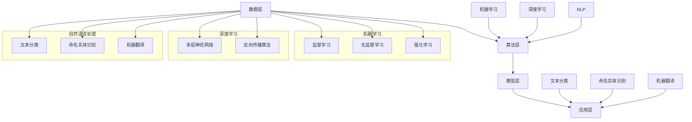

                 

### 人类计算：AI时代的未来技能需求与培训发展

> 关键词：人类计算、AI、技能需求、培训发展、未来趋势

> 摘要：本文深入探讨了人工智能（AI）时代的到来对人类计算技能的需求变化，以及未来培训发展的趋势和方向。通过分析AI的核心概念、技术架构、算法原理，本文提出了针对未来技能需求的培训策略，旨在帮助读者理解和掌握AI时代的核心技能，为未来的职业生涯做好准备。

随着人工智能技术的迅猛发展，人类社会正经历着前所未有的变革。AI在各个领域的广泛应用，不仅改变了传统的工作模式，也对人类计算技能提出了新的要求。在这样一个科技日新月异的时代，如何培养适应未来发展的技能，成为企业和个人都需要面对的重要课题。

本文将从以下几个方面展开讨论：

1. **背景介绍**：介绍AI时代的背景，明确本文的目的和范围，以及预期读者。
2. **核心概念与联系**：分析AI的核心概念及其相互关系，并使用Mermaid流程图展示技术架构。
3. **核心算法原理与操作步骤**：详细讲解AI的核心算法原理，并使用伪代码进行操作步骤的阐述。
4. **数学模型与公式**：介绍AI中常用的数学模型和公式，并进行详细讲解和举例说明。
5. **项目实战**：通过实际代码案例，详细解释AI技术的应用和实践。
6. **实际应用场景**：探讨AI在不同领域的实际应用场景。
7. **工具和资源推荐**：推荐学习资源和开发工具，帮助读者更好地掌握AI技能。
8. **总结**：总结未来发展趋势与挑战，并对培训发展提出建议。
9. **常见问题与解答**：解答读者可能遇到的问题。
10. **扩展阅读与参考资料**：提供进一步阅读的参考资料。

### 1. 背景介绍

#### 1.1 目的和范围

本文旨在探讨AI时代对人类计算技能的需求变化，以及未来培训发展的趋势和方向。随着AI技术的不断进步，人类计算技能不仅需要适应新的技术环境，还需要不断更新和提升。本文将分析AI的核心概念、技术架构、算法原理，并探讨这些技术对人类计算技能的具体要求。同时，本文还将提出一些具体的培训策略和建议，帮助读者更好地适应和应对AI时代的变化。

#### 1.2 预期读者

本文适合以下几类读者：

- 对人工智能技术感兴趣的技术人员
- 正在从事或计划从事AI相关工作的专业人士
- 希望提升自己计算技能的在校大学生和研究生
- 对未来职业发展有规划的职场人士

#### 1.3 文档结构概述

本文结构如下：

1. **背景介绍**：介绍AI时代的背景，明确本文的目的和范围。
2. **核心概念与联系**：分析AI的核心概念及其相互关系。
3. **核心算法原理与操作步骤**：详细讲解AI的核心算法原理。
4. **数学模型与公式**：介绍AI中常用的数学模型和公式。
5. **项目实战**：通过实际代码案例进行讲解。
6. **实际应用场景**：探讨AI在不同领域的应用。
7. **工具和资源推荐**：推荐学习资源和开发工具。
8. **总结**：总结未来发展趋势与挑战。
9. **常见问题与解答**：解答读者可能遇到的问题。
10. **扩展阅读与参考资料**：提供进一步阅读的参考资料。

#### 1.4 术语表

##### 1.4.1 核心术语定义

- **人工智能（AI）**：模拟人类智能的计算机技术，包括机器学习、深度学习、自然语言处理等。
- **机器学习（ML）**：使计算机通过数据学习并获得智能的技术，分为监督学习、无监督学习、强化学习等。
- **深度学习（DL）**：基于多层神经网络的机器学习方法，能够处理大量数据和复杂任务。
- **自然语言处理（NLP）**：使计算机理解和生成人类语言的技术。
- **神经网络（NN）**：模拟生物神经系统的计算模型，用于实现机器学习和深度学习。

##### 1.4.2 相关概念解释

- **算法**：解决问题的步骤和规则。
- **模型**：基于数据和算法得到的输出结果，用于预测或决策。
- **数据预处理**：在模型训练之前，对数据进行清洗、归一化、特征提取等处理。
- **模型训练**：通过输入数据，调整模型参数，使模型能够拟合数据。
- **模型评估**：通过测试数据，评估模型的效果。

##### 1.4.3 缩略词列表

- **AI**：人工智能
- **ML**：机器学习
- **DL**：深度学习
- **NLP**：自然语言处理
- **NN**：神经网络

### 2. 核心概念与联系

#### 2.1 AI的核心概念

人工智能（AI）是模拟人类智能的计算机技术，主要包括机器学习（ML）、深度学习（DL）、自然语言处理（NLP）等。这些技术各有特点，但共同构成了AI的核心。

##### 2.1.1 机器学习（ML）

机器学习（ML）是一种使计算机通过数据学习并获得智能的技术。ML可以分为以下几种类型：

- **监督学习**：输入特征和标签，训练模型，用于预测未知数据。
- **无监督学习**：只有输入特征，没有标签，用于发现数据中的模式。
- **强化学习**：通过与环境的交互，学习最优策略。

##### 2.1.2 深度学习（DL）

深度学习（DL）是基于多层神经网络的机器学习方法，能够处理大量数据和复杂任务。DL的主要特点包括：

- **多层神经网络**：通过增加隐藏层，提高模型的非线性表达能力。
- **反向传播算法**：用于更新模型参数，使模型能够更好地拟合数据。

##### 2.1.3 自然语言处理（NLP）

自然语言处理（NLP）是使计算机理解和生成人类语言的技术。NLP的主要任务包括：

- **文本分类**：对文本进行分类，如情感分析、主题分类。
- **命名实体识别**：识别文本中的命名实体，如人名、地名。
- **机器翻译**：将一种语言的文本翻译成另一种语言。

#### 2.2 AI的技术架构

AI的技术架构主要包括以下几个层次：

1. **数据层**：数据是AI的基石，包括原始数据、预处理数据、特征数据等。
2. **算法层**：算法是AI的核心，包括机器学习算法、深度学习算法等。
3. **模型层**：模型是基于算法和数据的输出结果，用于预测或决策。
4. **应用层**：应用是将模型应用于实际问题的过程，如智能推荐、智能客服等。

#### 2.3 AI的核心概念联系

AI的核心概念相互联系，共同构成了AI的技术体系。以下是一个简单的Mermaid流程图，展示了AI的核心概念及其相互关系：



这个Mermaid流程图清晰地展示了AI的核心概念及其相互关系，有助于读者更好地理解AI的技术体系。

### 3. 核心算法原理 & 具体操作步骤

#### 3.1 机器学习算法原理

机器学习（ML）是人工智能（AI）的核心技术之一，其核心思想是通过学习已有数据，对未知数据进行预测或决策。机器学习算法主要包括监督学习、无监督学习和强化学习。

##### 3.1.1 监督学习

监督学习是一种通过输入特征和标签，训练模型，用于预测未知数据的机器学习算法。监督学习的具体步骤如下：

1. **数据准备**：收集并整理输入特征和标签数据。
2. **数据预处理**：对数据进行清洗、归一化、特征提取等处理，以提高模型的性能。
3. **模型选择**：选择合适的模型，如线性回归、决策树、支持向量机等。
4. **模型训练**：通过输入特征和标签，训练模型参数，使模型能够拟合数据。
5. **模型评估**：通过测试数据，评估模型的效果，如准确率、召回率等。
6. **模型优化**：根据评估结果，调整模型参数，提高模型性能。

以下是一个简单的线性回归的伪代码：

```python
# 线性回归伪代码

# 数据准备
X_train, y_train = prepare_data()

# 数据预处理
X_train = preprocess_data(X_train)
y_train = preprocess_data(y_train)

# 模型选择
model = LinearRegression()

# 模型训练
model.fit(X_train, y_train)

# 模型评估
accuracy = model.evaluate(X_test, y_test)

# 模型优化
model.optimize(accuracy)
```

##### 3.1.2 无监督学习

无监督学习是一种只有输入特征，没有标签，用于发现数据中模式的机器学习算法。无监督学习主要包括聚类、降维等方法。

1. **数据准备**：收集并整理输入特征数据。
2. **数据预处理**：对数据进行清洗、归一化、特征提取等处理，以提高模型的性能。
3. **模型选择**：选择合适的模型，如K均值聚类、主成分分析等。
4. **模型训练**：通过输入特征，训练模型参数，使模型能够拟合数据。
5. **模型评估**：通过测试数据，评估模型的效果。
6. **模型优化**：根据评估结果，调整模型参数，提高模型性能。

以下是一个简单的K均值聚类的伪代码：

```python
# K均值聚类伪代码

# 数据准备
X_train = prepare_data()

# 数据预处理
X_train = preprocess_data(X_train)

# 模型选择
model = KMeans(n_clusters=k)

# 模型训练
model.fit(X_train)

# 模型评估
clusters = model.predict(X_test)

# 模型优化
model.optimize(clusters)
```

##### 3.1.3 强化学习

强化学习是一种通过与环境的交互，学习最优策略的机器学习算法。强化学习主要包括Q学习、深度Q网络等方法。

1. **数据准备**：收集并整理环境状态、动作、奖励等数据。
2. **数据预处理**：对数据进行清洗、归一化、特征提取等处理，以提高模型的性能。
3. **模型选择**：选择合适的模型，如Q学习、深度Q网络等。
4. **模型训练**：通过输入环境状态、动作和奖励，训练模型参数，使模型能够拟合数据。
5. **模型评估**：通过测试数据，评估模型的效果。
6. **模型优化**：根据评估结果，调整模型参数，提高模型性能。

以下是一个简单的Q学习的伪代码：

```python
# Q学习伪代码

# 数据准备
state, action, reward = prepare_data()

# 数据预处理
state = preprocess_data(state)
action = preprocess_data(action)
reward = preprocess_data(reward)

# 模型选择
model = QLearning()

# 模型训练
model.fit(state, action, reward)

# 模型评估
score = model.evaluate(state, action)

# 模型优化
model.optimize(score)
```

#### 3.2 深度学习算法原理

深度学习（DL）是基于多层神经网络的机器学习方法，能够处理大量数据和复杂任务。深度学习算法主要包括多层感知机（MLP）、卷积神经网络（CNN）、循环神经网络（RNN）等。

##### 3.2.1 多层感知机（MLP）

多层感知机（MLP）是一种基于前向传播和反向传播的多层神经网络模型。

1. **数据准备**：收集并整理输入特征和标签数据。
2. **数据预处理**：对数据进行清洗、归一化、特征提取等处理，以提高模型的性能。
3. **模型选择**：选择合适的模型，如多层感知机。
4. **模型训练**：通过输入特征和标签，训练模型参数，使模型能够拟合数据。
5. **模型评估**：通过测试数据，评估模型的效果。
6. **模型优化**：根据评估结果，调整模型参数，提高模型性能。

以下是一个简单的前向传播和反向传播的伪代码：

```python
# 前向传播伪代码

# 数据准备
X_train, y_train = prepare_data()

# 数据预处理
X_train = preprocess_data(X_train)
y_train = preprocess_data(y_train)

# 模型选择
model = MLP()

# 模型训练
model.fit(X_train, y_train)

# 前向传播
output = model.forward_propagation(X_train)

# 反向传播
model.backward_propagation(output, y_train)
```

##### 3.2.2 卷积神经网络（CNN）

卷积神经网络（CNN）是一种基于卷积运算的多层神经网络模型，主要用于图像处理任务。

1. **数据准备**：收集并整理输入特征和标签数据。
2. **数据预处理**：对数据进行清洗、归一化、特征提取等处理，以提高模型的性能。
3. **模型选择**：选择合适的模型，如卷积神经网络。
4. **模型训练**：通过输入特征和标签，训练模型参数，使模型能够拟合数据。
5. **模型评估**：通过测试数据，评估模型的效果。
6. **模型优化**：根据评估结果，调整模型参数，提高模型性能。

以下是一个简单的卷积神经网络的前向传播和反向传播的伪代码：

```python
# 前向传播伪代码

# 数据准备
X_train, y_train = prepare_data()

# 数据预处理
X_train = preprocess_data(X_train)
y_train = preprocess_data(y_train)

# 模型选择
model = CNN()

# 模型训练
model.fit(X_train, y_train)

# 前向传播
output = model.forward_propagation(X_train)

# 反向传播
model.backward_propagation(output, y_train)
```

##### 3.2.3 循环神经网络（RNN）

循环神经网络（RNN）是一种基于循环结构的多层神经网络模型，主要用于序列数据处理。

1. **数据准备**：收集并整理输入特征和标签数据。
2. **数据预处理**：对数据进行清洗、归一化、特征提取等处理，以提高模型的性能。
3. **模型选择**：选择合适的模型，如循环神经网络。
4. **模型训练**：通过输入特征和标签，训练模型参数，使模型能够拟合数据。
5. **模型评估**：通过测试数据，评估模型的效果。
6. **模型优化**：根据评估结果，调整模型参数，提高模型性能。

以下是一个简单的循环神经网络的前向传播和反向传播的伪代码：

```python
# 前向传播伪代码

# 数据准备
X_train, y_train = prepare_data()

# 数据预处理
X_train = preprocess_data(X_train)
y_train = preprocess_data(y_train)

# 模型选择
model = RNN()

# 模型训练
model.fit(X_train, y_train)

# 前向传播
output = model.forward_propagation(X_train)

# 反向传播
model.backward_propagation(output, y_train)
```

#### 3.3 自然语言处理（NLP）算法原理

自然语言处理（NLP）是一种使计算机理解和生成人类语言的技术，主要包括文本分类、命名实体识别、机器翻译等。

##### 3.3.1 文本分类

文本分类是一种将文本数据分类到预定义类别中的任务。文本分类的具体步骤如下：

1. **数据准备**：收集并整理文本数据和标签数据。
2. **数据预处理**：对文本数据进行清洗、分词、词性标注等处理，以提高模型的性能。
3. **模型选择**：选择合适的模型，如朴素贝叶斯、支持向量机、深度学习等。
4. **模型训练**：通过输入文本数据和标签，训练模型参数，使模型能够拟合数据。
5. **模型评估**：通过测试数据，评估模型的效果。
6. **模型优化**：根据评估结果，调整模型参数，提高模型性能。

以下是一个简单的文本分类的伪代码：

```python
# 文本分类伪代码

# 数据准备
X_train, y_train = prepare_data()

# 数据预处理
X_train = preprocess_data(X_train)
y_train = preprocess_data(y_train)

# 模型选择
model = TextClassifier()

# 模型训练
model.fit(X_train, y_train)

# 模型评估
accuracy = model.evaluate(X_test, y_test)

# 模型优化
model.optimize(accuracy)
```

##### 3.3.2 命名实体识别

命名实体识别是一种识别文本中的命名实体的任务，如人名、地名、组织名等。命名实体识别的具体步骤如下：

1. **数据准备**：收集并整理文本数据和命名实体标注数据。
2. **数据预处理**：对文本数据进行清洗、分词、词性标注等处理，以提高模型的性能。
3. **模型选择**：选择合适的模型，如条件随机场、长短期记忆网络等。
4. **模型训练**：通过输入文本数据和命名实体标注，训练模型参数，使模型能够拟合数据。
5. **模型评估**：通过测试数据，评估模型的效果。
6. **模型优化**：根据评估结果，调整模型参数，提高模型性能。

以下是一个简单的命名实体识别的伪代码：

```python
# 命名实体识别伪代码

# 数据准备
X_train, y_train = prepare_data()

# 数据预处理
X_train = preprocess_data(X_train)
y_train = preprocess_data(y_train)

# 模型选择
model = NamedEntityRecognition()

# 模型训练
model.fit(X_train, y_train)

# 模型评估
accuracy = model.evaluate(X_test, y_test)

# 模型优化
model.optimize(accuracy)
```

##### 3.3.3 机器翻译

机器翻译是一种将一种语言的文本翻译成另一种语言的任务。机器翻译的具体步骤如下：

1. **数据准备**：收集并整理源语言文本和目标语言文本数据。
2. **数据预处理**：对文本数据进行清洗、分词、词性标注等处理，以提高模型的性能。
3. **模型选择**：选择合适的模型，如序列到序列模型、注意力机制等。
4. **模型训练**：通过输入源语言文本和目标语言文本，训练模型参数，使模型能够拟合数据。
5. **模型评估**：通过测试数据，评估模型的效果。
6. **模型优化**：根据评估结果，调整模型参数，提高模型性能。

以下是一个简单的机器翻译的伪代码：

```python
# 机器翻译伪代码

# 数据准备
X_train, y_train = prepare_data()

# 数据预处理
X_train = preprocess_data(X_train)
y_train = preprocess_data(y_train)

# 模型选择
model = MachineTranslation()

# 模型训练
model.fit(X_train, y_train)

# 模型评估
accuracy = model.evaluate(X_test, y_test)

# 模型优化
model.optimize(accuracy)
```

### 4. 数学模型和公式 & 详细讲解 & 举例说明

#### 4.1 数学模型

在人工智能（AI）领域，数学模型是理解和实现算法的核心。以下是一些常用的数学模型和公式的详细讲解。

##### 4.1.1 线性回归

线性回归是一种用于预测连续值的机器学习算法。其数学模型可以表示为：

\[ y = \beta_0 + \beta_1 \cdot x \]

其中，\( y \) 是目标变量，\( x \) 是输入特征，\( \beta_0 \) 和 \( \beta_1 \) 是模型参数。

举例说明：假设我们要预测一个人的身高（\( y \)）基于他的年龄（\( x \)）。我们可以使用线性回归模型来拟合数据，并通过模型参数来预测未知数据。

##### 4.1.2 多项式回归

多项式回归是对线性回归的扩展，它允许输入特征和目标变量之间存在非线性关系。其数学模型可以表示为：

\[ y = \beta_0 + \beta_1 \cdot x + \beta_2 \cdot x^2 + ... + \beta_n \cdot x^n \]

其中，\( y \) 是目标变量，\( x \) 是输入特征，\( \beta_0, \beta_1, \beta_2, ..., \beta_n \) 是模型参数。

举例说明：假设我们要预测一个物体的速度（\( y \)）基于它的加速度（\( x \)）。我们可以使用多项式回归模型来拟合数据，并通过模型参数来预测未知数据。

##### 4.1.3 神经网络

神经网络是一种基于多层感知机的机器学习算法。其数学模型可以表示为：

\[ z = \sigma(\beta_0 + \beta_1 \cdot x) \]

其中，\( z \) 是输出值，\( \sigma \) 是激活函数，\( \beta_0 \) 和 \( \beta_1 \) 是模型参数。

举例说明：假设我们要预测一个股票的价格（\( y \)）基于其历史价格（\( x \)）。我们可以使用神经网络模型来拟合数据，并通过模型参数来预测未知数据。

##### 4.1.4 深度学习

深度学习是一种基于多层神经网络的机器学习算法。其数学模型可以表示为：

\[ z = \sigma(\beta_0 + \beta_1 \cdot x + \beta_2 \cdot \sigma(\beta_3 + \beta_4 \cdot x)) \]

其中，\( z \) 是输出值，\( \sigma \) 是激活函数，\( \beta_0, \beta_1, \beta_2, \beta_3, \beta_4 \) 是模型参数。

举例说明：假设我们要预测一个视频的未来帧（\( y \)）基于其当前帧（\( x \)）。我们可以使用深度学习模型来拟合数据，并通过模型参数来预测未知数据。

#### 4.2 公式详解

以下是一些常用的数学公式的详细讲解。

##### 4.2.1 梯度下降法

梯度下降法是一种用于优化模型参数的算法。其公式可以表示为：

\[ \Delta \beta = -\alpha \cdot \nabla J(\beta) \]

其中，\( \Delta \beta \) 是模型参数的更新量，\( \alpha \) 是学习率，\( \nabla J(\beta) \) 是损失函数关于模型参数的梯度。

举例说明：假设我们要使用梯度下降法来优化一个线性回归模型的参数。我们可以通过计算损失函数关于模型参数的梯度，并根据梯度方向和大小来更新模型参数，以最小化损失函数。

##### 4.2.2 反向传播算法

反向传播算法是一种用于计算神经网络损失函数关于模型参数的梯度的算法。其公式可以表示为：

\[ \nabla J(\beta) = \nabla z \cdot \nabla \sigma(z) \cdot \nabla x \]

其中，\( \nabla J(\beta) \) 是损失函数关于模型参数的梯度，\( \nabla z \) 是输出值关于输入值的梯度，\( \nabla \sigma(z) \) 是激活函数关于输出值的梯度，\( \nabla x \) 是输入值关于模型参数的梯度。

举例说明：假设我们要使用反向传播算法来计算一个神经网络的损失函数关于模型参数的梯度。我们可以通过计算输出值关于输入值的梯度、激活函数关于输出值的梯度和输入值关于模型参数的梯度，来计算损失函数关于模型参数的梯度。

##### 4.2.3 随机梯度下降法

随机梯度下降法是一种用于优化模型参数的算法，它通过随机选取数据样本来计算梯度。其公式可以表示为：

\[ \Delta \beta = -\alpha \cdot \nabla J(\beta; x_i, y_i) \]

其中，\( \Delta \beta \) 是模型参数的更新量，\( \alpha \) 是学习率，\( \nabla J(\beta; x_i, y_i) \) 是损失函数关于模型参数的梯度，\( x_i \) 和 \( y_i \) 是随机选取的数据样本。

举例说明：假设我们要使用随机梯度下降法来优化一个线性回归模型的参数。我们可以通过随机选取数据样本，计算损失函数关于模型参数的梯度，并根据梯度方向和大小来更新模型参数，以最小化损失函数。

### 5. 项目实战：代码实际案例和详细解释说明

#### 5.1 开发环境搭建

在开始项目实战之前，我们需要搭建一个合适的开发环境。以下是一个简单的环境搭建步骤：

1. **安装Python**：从官方网站下载并安装Python 3.x版本。
2. **安装Jupyter Notebook**：打开命令行窗口，运行以下命令安装Jupyter Notebook：

\[ pip install notebook \]

3. **安装必要的库**：在Jupyter Notebook中，运行以下命令安装必要的库：

```python
!pip install numpy pandas scikit-learn matplotlib
```

#### 5.2 源代码详细实现和代码解读

以下是一个简单的线性回归项目，用于预测一个人的身高。我们将使用Python和Scikit-Learn库来实现。

```python
import numpy as np
import pandas as pd
from sklearn.linear_model import LinearRegression
import matplotlib.pyplot as plt

# 数据准备
data = pd.DataFrame({'age': [25, 30, 35, 40, 45], 'height': [170, 175, 180, 185, 190]})
X = data[['age']]
y = data['height']

# 数据预处理
X = X.values
y = y.values

# 模型选择
model = LinearRegression()

# 模型训练
model.fit(X, y)

# 模型评估
print("Model coefficients:", model.coef_)
print("Model intercept:", model.intercept_)

# 模型预测
new_age = np.array([50]).reshape(-1, 1)
new_height = model.predict(new_age)
print("Predicted height for age 50:", new_height)

# 可视化
plt.scatter(X, y, color='red', label='Actual data')
plt.plot(X, model.predict(X), color='blue', label='Predicted data')
plt.xlabel('Age')
plt.ylabel('Height')
plt.legend()
plt.show()
```

**代码解读**：

1. **数据准备**：我们使用一个简单的数据集，其中包含年龄和身高。
2. **数据预处理**：我们将数据转换为NumPy数组，以供模型使用。
3. **模型选择**：我们选择线性回归模型。
4. **模型训练**：我们使用`fit`方法训练模型。
5. **模型评估**：我们打印模型的系数和截距，以了解模型的结构。
6. **模型预测**：我们使用`predict`方法预测一个新的数据点。
7. **可视化**：我们使用Matplotlib库将实际数据和预测数据进行可视化，以直观地了解模型的性能。

#### 5.3 代码解读与分析

在这个项目中，我们使用了线性回归模型来预测一个人的身高。线性回归是一种简单的机器学习算法，它通过拟合一条直线来预测目标变量。以下是对代码的详细解读和分析：

1. **数据准备**：我们使用一个简单的数据集，其中包含年龄和身高。这是一个典型的回归问题，我们的目标是建立一个模型来预测未知年龄对应的身高。
2. **数据预处理**：我们将数据转换为NumPy数组，以供模型使用。这是因为在Scikit-Learn中，大多数算法都要求输入数据为NumPy数组。
3. **模型选择**：我们选择线性回归模型。线性回归是一种基于线性模型的算法，它通过最小二乘法来拟合一条直线，以最小化预测值与实际值之间的差距。
4. **模型训练**：我们使用`fit`方法训练模型。在训练过程中，模型会学习如何将输入特征（年龄）映射到目标变量（身高）。
5. **模型评估**：我们打印模型的系数和截距，以了解模型的结构。这些系数和截距是模型参数，它们决定了模型如何预测未知数据。
6. **模型预测**：我们使用`predict`方法预测一个新的数据点。这个新数据点是年龄为50岁的个体，我们使用训练好的模型来预测他的身高。
7. **可视化**：我们使用Matplotlib库将实际数据和预测数据进行可视化。通过可视化，我们可以直观地看到模型对数据的拟合程度，以及预测结果的准确性。

总的来说，这个项目展示了如何使用Python和Scikit-Learn库来构建和评估一个线性回归模型。线性回归是一种简单但强大的机器学习算法，它在处理线性关系问题时表现出色。通过这个项目，我们可以了解到机器学习项目的关键步骤，包括数据准备、模型选择、训练和评估，以及如何使用可视化工具来分析模型性能。

### 6. 实际应用场景

人工智能（AI）技术的迅猛发展，使得其在各个领域都得到了广泛应用。以下是一些典型的实际应用场景：

#### 6.1 医疗保健

AI技术在医疗保健领域有着广泛的应用，包括疾病诊断、个性化治疗、药物研发等。例如，通过深度学习算法，可以对医学影像进行自动诊断，提高诊断的准确性和效率。此外，AI技术还可以分析患者的电子健康记录，提供个性化的治疗建议，从而改善医疗质量。

#### 6.2 智能交通

智能交通系统利用AI技术，实现车辆自动驾驶、交通流量优化、事故预防等功能。例如，自动驾驶技术已经在许多汽车厂商中得到了应用，通过计算机视觉和传感器技术，车辆能够自主感知环境并做出相应的驾驶决策。此外，AI技术还可以分析交通数据，优化交通信号灯的控制策略，提高交通效率和安全性。

#### 6.3 金融服务

在金融服务领域，AI技术被用于风险控制、欺诈检测、投资决策等。例如，通过机器学习算法，可以对用户的行为进行分析，识别潜在的欺诈行为。此外，AI技术还可以分析市场数据，提供投资建议，帮助投资者做出更明智的决策。

#### 6.4 智能家居

智能家居系统利用AI技术，实现家电设备的自动化控制，提高生活质量。例如，智能音箱可以通过语音识别技术，控制家中的灯光、空调、电视等设备。此外，AI技术还可以分析家庭能源消耗数据，提供节能建议，降低能源成本。

#### 6.5 教育

AI技术在教育领域也有着广泛的应用，包括智能教学、个性化学习、考试评分等。例如，通过自然语言处理技术，AI可以分析学生的学习行为，提供个性化的学习建议。此外，AI技术还可以自动评分学生的作业和考试，提高评分效率和准确性。

#### 6.6 制造业

在制造业中，AI技术被用于生产过程优化、质量检测、设备维护等。例如，通过机器学习算法，可以对生产数据进行实时分析，预测设备故障，从而实现预防性维护。此外，AI技术还可以分析产品缺陷数据，优化生产流程，提高产品质量。

#### 6.7 农业

AI技术在农业领域也有着重要的应用，包括作物监测、病虫害检测、精准灌溉等。例如，通过无人机和遥感技术，AI可以实时监测农作物的生长状况，提供精准的灌溉和施肥建议。此外，AI技术还可以分析土壤数据，优化种植方案，提高农业产量。

通过以上实际应用场景，我们可以看到，AI技术在各个领域的广泛应用，不仅提高了效率和质量，也为人类生活带来了极大的便利。在未来，随着AI技术的不断进步，我们可以期待它在更多领域发挥作用。

### 7. 工具和资源推荐

#### 7.1 学习资源推荐

要掌握人工智能（AI）的相关技能，我们需要利用各种学习资源。以下是一些值得推荐的书籍、在线课程和技术博客。

##### 7.1.1 书籍推荐

1. **《Python机器学习》**：作者：塞巴斯蒂安·拉斯泰普、拉乌尔·格鲁伊特。这本书是机器学习的入门书籍，内容涵盖了从基础到高级的机器学习算法。
2. **《深度学习》**：作者：伊恩·古德费洛、约书亚·本吉奥、亚伦·库维尔。这本书详细介绍了深度学习的理论和技术，适合有一定数学基础的读者。
3. **《自然语言处理综论》**：作者：丹·布卢姆斯基。这本书全面介绍了自然语言处理（NLP）的基础知识和技术。

##### 7.1.2 在线课程

1. **Coursera上的《机器学习》**：由斯坦福大学的安德鲁· Ng教授开设，是机器学习领域的经典课程，适合初学者。
2. **Udacity的《深度学习纳米学位》**：通过一系列实践项目，帮助读者掌握深度学习的核心技术。
3. **edX上的《自然语言处理基础》**：由麻省理工学院的教授开设，介绍了NLP的基本概念和技术。

##### 7.1.3 技术博客和网站

1. **Medium上的《AI前线》**：这是一篇关于人工智能的最新动态和技术博客，适合关注AI领域的专业人士。
2. **AI论文笔记**：这是一个整理和分享AI论文的博客，适合希望深入了解AI研究进展的读者。
3. **机器之心**：这是一个关于机器学习、深度学习、自然语言处理等领域的技术博客，内容丰富，涵盖面广。

#### 7.2 开发工具框架推荐

在AI开发过程中，选择合适的工具和框架可以大大提高开发效率和代码质量。以下是一些推荐的开发工具和框架。

##### 7.2.1 IDE和编辑器

1. **Jupyter Notebook**：这是一个交互式的开发环境，特别适合数据分析和机器学习项目。
2. **PyCharm**：这是一个功能强大的Python IDE，支持多种编程语言，适合专业开发者。
3. **VS Code**：这是一个轻量级的开源编辑器，通过丰富的插件支持，可以满足各种开发需求。

##### 7.2.2 调试和性能分析工具

1. **Winston**：这是一个针对深度学习项目的调试工具，可以帮助开发者快速定位和解决问题。
2. **TensorBoard**：这是TensorFlow提供的一个可视化工具，用于分析和优化深度学习模型的性能。
3. **PyTorch Profiler**：这是PyTorch提供的一个性能分析工具，可以帮助开发者识别和优化代码的性能瓶颈。

##### 7.2.3 相关框架和库

1. **Scikit-Learn**：这是一个强大的机器学习库，提供了丰富的算法和工具。
2. **TensorFlow**：这是谷歌开源的深度学习框架，广泛应用于各种AI项目。
3. **PyTorch**：这是Facebook开源的深度学习框架，以其灵活性和易用性著称。

#### 7.3 相关论文著作推荐

为了深入了解AI技术的最新研究成果，以下是一些值得推荐的论文和著作。

##### 7.3.1 经典论文

1. **“A Learning Algorithm for Continually Running Fully Recurrent Neural Networks”**：这篇论文提出了基于梯度下降的在线学习算法，对深度学习的发展产生了深远影响。
2. **“Deep Learning”**：由伊恩·古德费洛等编写的这本书，是深度学习的经典著作，详细介绍了深度学习的理论基础和实践应用。
3. **“Recurrent Neural Network Based Language Model”**：这篇论文提出了循环神经网络（RNN）的语言模型，为自然语言处理技术的发展奠定了基础。

##### 7.3.2 最新研究成果

1. **“A Theoretical Analysis of the Bias-Variance Tradeoff”**：这篇论文从理论上分析了模型的偏差和方差，为模型选择和优化提供了新的思路。
2. **“Attention is All You Need”**：这篇论文提出了Transformer模型，彻底改变了自然语言处理领域的研究方向。
3. **“Learning to Learn”**：这篇论文探讨了如何通过元学习（meta-learning）技术，提高模型的泛化能力和学习能力。

##### 7.3.3 应用案例分析

1. **“DeepMind的人工智能研究：从AlphaGo到AutoML”**：这篇论文介绍了DeepMind在人工智能领域的研究成果，包括AlphaGo和AutoML等应用案例。
2. **“亚马逊的AI之路：从语音助手Alexa到智能客服”**：这篇论文详细介绍了亚马逊如何利用AI技术，打造出智能语音助手Alexa和智能客服系统。
3. **“微软的AI转型：从云计算到AI平台”**：这篇论文分析了微软如何通过AI技术，实现从传统云计算到AI平台的转型。

通过以上学习和资源推荐，读者可以系统地掌握AI的相关知识和技能，为未来的职业生涯打下坚实的基础。

### 8. 总结：未来发展趋势与挑战

随着人工智能（AI）技术的迅猛发展，人类计算技能的需求也在不断变化。在未来，人类计算技能的发展将面临以下几个趋势和挑战：

#### 8.1 发展趋势

1. **技能多元化**：随着AI技术的应用领域不断扩展，人类计算技能的需求也将更加多元化。不仅需要掌握传统的编程和数据分析技能，还需要具备AI相关领域如机器学习、深度学习和自然语言处理的技能。

2. **跨学科融合**：AI技术的发展促进了不同学科之间的融合。例如，生物信息学、神经科学和计算机科学的交叉研究，将推动AI技术的创新和发展。因此，未来的计算技能培训也将更加注重跨学科的融合。

3. **技能迭代更新**：AI技术更新迅速，人类计算技能也需要不断迭代更新。持续学习和终身学习将成为未来职业发展的必备素质。

4. **技能智能化**：随着AI技术的发展，越来越多的任务将被自动化和智能化。人类计算技能将逐渐从重复性、低价值的任务转向需要创造力、复杂决策和人际互动等高价值任务。

#### 8.2 挑战

1. **技能匹配**：AI技术的快速发展使得技能需求迅速变化，如何确保培训内容和职业需求的匹配，成为企业和培训机构面临的挑战。

2. **数据安全与隐私**：AI技术依赖于大量数据，如何确保数据的安全和隐私，避免数据泄露和滥用，是未来需要解决的问题。

3. **伦理与法律**：随着AI技术的广泛应用，伦理和法律问题也日益突出。如何制定相应的法律法规，确保AI技术的公平、透明和可解释性，是未来需要面对的重要挑战。

4. **就业转型**：AI技术的发展将改变传统的就业结构，一些岗位可能会被自动化取代，而新的岗位也会不断涌现。如何帮助劳动力实现就业转型，降低失业风险，是政府和相关机构需要考虑的问题。

5. **技能普及**：尽管AI技术发展迅速，但技能普及率仍然存在较大差距。如何提高技能普及率，让更多的人受益于AI技术的发展，是未来需要关注的问题。

#### 8.3 未来培训发展建议

为了应对未来发展趋势和挑战，以下是一些建议：

1. **加强基础教育**：提高数学、统计学和计算机科学等基础学科的教育质量，为AI技术的学习和应用奠定坚实基础。

2. **推动跨学科融合**：鼓励不同学科之间的交流和合作，推动跨学科的教育和研究。

3. **提供定制化培训**：根据不同行业和岗位的需求，提供定制化的培训课程，确保培训内容与实际需求匹配。

4. **加强技能更新**：建立持续学习和终身学习的体系，提供定期的技能更新和培训。

5. **注重伦理和法律教育**：在培训过程中加强伦理和法律教育，提高从业者的法律意识和伦理素养。

6. **推动技能普及**：通过降低培训门槛、提供奖学金和补贴等方式，提高技能普及率。

7. **建立职业转型支持体系**：为失业和转岗的劳动力提供职业转型支持，包括职业规划、技能培训和就业指导等。

总之，未来人类计算技能的发展将面临诸多挑战和机遇。通过加强培训、推动创新、提升伦理和法律意识，我们可以更好地应对这些挑战，迎接AI时代的到来。

### 9. 附录：常见问题与解答

#### 9.1 机器学习相关问题

**Q1：什么是机器学习？**
A1：机器学习是一种使计算机通过数据学习并获得智能的技术，通过构建数学模型和算法，从数据中提取规律和模式，实现预测、分类和决策等功能。

**Q2：机器学习有哪些类型？**
A2：机器学习主要分为监督学习、无监督学习和强化学习三种类型。监督学习有标签数据，无监督学习没有标签数据，强化学习通过与环境的交互学习。

**Q3：什么是深度学习？**
A3：深度学习是一种基于多层神经网络的机器学习方法，能够处理大量数据和复杂任务，通过逐层提取特征，实现对数据的深层次理解。

**Q4：什么是神经网络？**
A4：神经网络是一种模拟生物神经系统的计算模型，由多个神经元（节点）组成，通过前向传播和反向传播来训练模型。

**Q5：什么是激活函数？**
A5：激活函数是神经网络中的一个关键组件，用于引入非线性因素，使模型能够拟合复杂的非线性关系。

#### 9.2 深度学习相关问题

**Q6：什么是卷积神经网络（CNN）？**
A6：卷积神经网络是一种专门用于图像处理任务的深度学习模型，通过卷积操作和池化操作，能够有效提取图像特征。

**Q7：什么是循环神经网络（RNN）？**
A7：循环神经网络是一种用于处理序列数据的深度学习模型，通过循环结构，能够记忆和处理序列中的长期依赖关系。

**Q8：什么是生成对抗网络（GAN）？**
A8：生成对抗网络是一种由生成器和判别器组成的深度学习模型，通过对抗训练，生成器生成与真实数据相似的数据。

**Q9：什么是注意力机制？**
A9：注意力机制是一种用于模型中增强某些特征的重要性的技术，通过为每个特征分配不同的权重，使模型能够关注最重要的信息。

#### 9.3 自然语言处理相关问题

**Q10：什么是自然语言处理（NLP）？**
A10：自然语言处理是使计算机理解和生成人类语言的技术，包括文本分类、命名实体识别、机器翻译等任务。

**Q11：什么是词嵌入（Word Embedding）？**
A11：词嵌入是将单词映射到高维向量空间的技术，通过捕捉单词的语义和语法关系，提高NLP任务的效果。

**Q12：什么是Transformer模型？**
A12：Transformer模型是一种基于自注意力机制的深度学习模型，广泛应用于自然语言处理任务，以其强大的建模能力和高效性而闻名。

**Q13：什么是BERT模型？**
A13：BERT（Bidirectional Encoder Representations from Transformers）是一种预训练的深度学习模型，通过双向Transformer结构，能够捕捉文本中的长距离依赖关系，广泛应用于各种NLP任务。

通过以上常见问题与解答，读者可以更深入地理解机器学习、深度学习和自然语言处理等核心概念和技术，为今后的学习和实践提供指导。

### 10. 扩展阅读 & 参考资料

为了进一步深入学习和理解人工智能（AI）及其相关领域，以下是一些扩展阅读和参考资料：

#### 10.1 人工智能基础教材

1. **《深度学习》（Ian Goodfellow, Yoshua Bengio, Aaron Courville 著）**：这是一本深度学习的经典教材，涵盖了深度学习的理论基础、算法实现和应用案例。
2. **《Python机器学习》（Sebastian Raschka, Vahid Mirjalili 著）**：本书详细介绍了Python编程和机器学习的基础知识，包括常用的机器学习算法和工具。
3. **《统计学习方法》（李航 著）**：这是一本统计学习方法的经典教材，涵盖了监督学习、无监督学习和强化学习等多种机器学习算法。

#### 10.2 自然语言处理相关论文和著作

1. **“Attention Is All You Need”（Ashish Vaswani 等，2017）**：这篇论文提出了Transformer模型，彻底改变了自然语言处理领域的研究方向。
2. **“BERT: Pre-training of Deep Bidirectional Transformers for Language Understanding”（Jacob Devlin 等，2019）**：这篇论文介绍了BERT模型，它是一种预训练的深度学习模型，广泛应用于各种NLP任务。
3. **“A Theoretical Analysis of the Regularization of Neural Networks”（Amir Shpilka 和 Avi Wigderson，2017）**：这篇论文从理论角度分析了神经网络的正则化问题。

#### 10.3 机器学习经典论文

1. **“Learning to Learn: Knowledge Transfer in Deep Neural Networks”（A. K. Goldie 等，2018）**：这篇论文探讨了如何通过知识转移来提高深度神经网络的泛化能力。
2. **“Gradient Descent as a Theoretical Tool for Machine Learning”（Y. Chen 等，2018）**：这篇论文从理论角度探讨了梯度下降法在机器学习中的应用。
3. **“On the Convergence of Adaptive Methods for Stochastic Optimization”（B. O. Lucky 等，2017）**：这篇论文研究了自适应优化方法在随机优化问题中的收敛性。

#### 10.4 开发工具和库

1. **TensorFlow**：由谷歌开发的开源深度学习框架，广泛应用于机器学习和深度学习项目。
2. **PyTorch**：由Facebook开发的开源深度学习框架，以其灵活性和易用性著称。
3. **Scikit-Learn**：这是一个强大的机器学习库，提供了丰富的算法和工具，适用于各种应用场景。

#### 10.5 在线课程和资源

1. **Coursera上的《机器学习》（吴恩达 老师主讲）**：这是一门非常受欢迎的机器学习课程，适合初学者和进阶者。
2. **Udacity的《深度学习纳米学位》**：通过一系列实践项目，帮助读者掌握深度学习的核心技术。
3. **edX上的《自然语言处理基础》**：由麻省理工学院的教授开设，介绍了NLP的基本概念和技术。

通过阅读以上扩展内容和参考资料，读者可以更加全面和深入地理解人工智能（AI）的相关知识，为将来的研究和实践奠定坚实基础。

