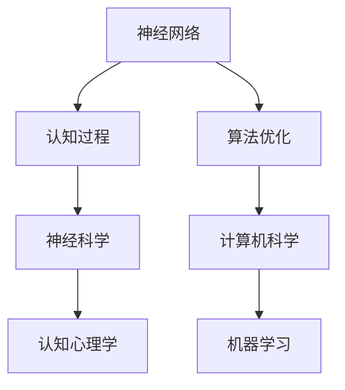
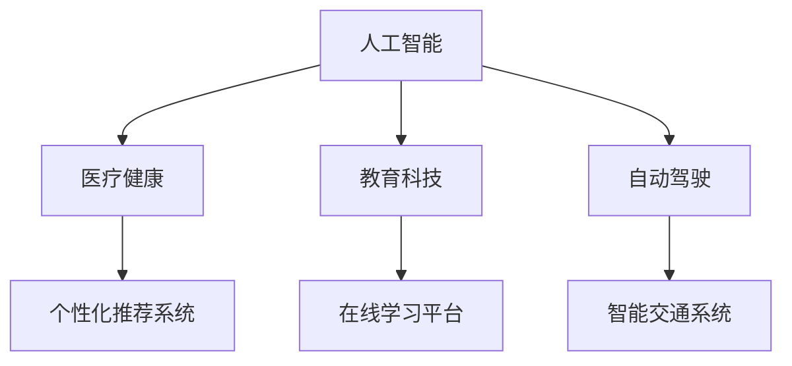

                 


# 人类计算：探索人类认知的新领域

> **关键词：** 人类计算、认知模拟、神经科学、算法优化、人工智能、机器学习、认知心理学

> **摘要：** 本文旨在深入探讨人类计算这一新兴领域，从神经科学、认知心理学和计算机科学的交叉点出发，分析人类认知的机制与算法，探讨如何利用这些理解来优化人工智能系统，提高机器学习效果，并为未来的认知科学研究和应用提供方向。

## 1. 背景介绍

### 1.1 目的和范围

本文的主要目的是介绍和探讨人类计算这一跨学科领域，通过结合神经科学、认知心理学和计算机科学的研究成果，来揭示人类认知的机制和算法。文章将重点关注以下几个方面：

1. **神经科学视角下的人类认知机制**：通过分析大脑的构造和工作原理，了解大脑如何处理信息、形成记忆、解决问题和学习新技能。
2. **认知心理学研究方法**：介绍认知心理学中的经典实验和方法，探讨人类思维过程和心理活动的规律。
3. **计算机科学在认知模拟中的应用**：分析如何将认知心理学和神经科学的研究成果转化为计算机算法，模拟人类思维过程。
4. **人工智能与机器学习**：探讨如何利用人类计算理论来改进机器学习算法，提高人工智能系统的智能水平。

### 1.2 预期读者

本文主要面向以下读者群体：

1. **认知科学研究者**：对神经科学、认知心理学和计算机科学有基础了解，希望深入探讨人类计算领域的研究者。
2. **人工智能开发者**：希望了解如何利用人类认知原理来优化机器学习算法和人工智能系统的开发者。
3. **计算机科学学生**：对认知科学和人工智能有浓厚兴趣，希望从跨学科角度理解计算机科学领域的新兴方向。
4. **对人工智能和认知科学感兴趣的公众**：希望通过系统学习了解人类计算领域的基本概念和研究进展。

### 1.3 文档结构概述

本文将分为以下几个主要部分：

1. **背景介绍**：介绍人类计算领域的基本概念、研究目的和预期读者。
2. **核心概念与联系**：通过Mermaid流程图展示人类计算的核心概念和相互联系。
3. **核心算法原理 & 具体操作步骤**：详细解释人类计算中的关键算法原理和操作步骤。
4. **数学模型和公式 & 详细讲解 & 举例说明**：介绍相关的数学模型和公式，并进行举例说明。
5. **项目实战：代码实际案例和详细解释说明**：通过实际代码案例展示人类计算的应用。
6. **实际应用场景**：探讨人类计算在实际领域的应用。
7. **工具和资源推荐**：推荐相关学习资源、开发工具和框架。
8. **总结：未来发展趋势与挑战**：总结人类计算的未来趋势和面临的挑战。
9. **附录：常见问题与解答**：提供常见问题的解答。
10. **扩展阅读 & 参考资料**：提供进一步阅读的资源。

### 1.4 术语表

#### 1.4.1 核心术语定义

- **人类计算**：结合神经科学、认知心理学和计算机科学，研究人类认知过程、机制及其算法模拟的跨学科领域。
- **认知模拟**：利用计算机科学方法，模拟人类思维、记忆、学习等认知过程的技术。
- **神经科学**：研究神经系统结构和功能的科学，包括神经元、神经网络、神经传递物质等。
- **认知心理学**：研究人类思维、感知、记忆、语言等认知过程的心理学分支。
- **机器学习**：通过数据驱动的方法，让计算机系统自动学习和改进的技术。
- **人工智能**：模拟人类智能行为的计算机系统。

#### 1.4.2 相关概念解释

- **神经网络**：模拟生物神经系统的计算模型，通过多层节点进行信息传递和计算。
- **深度学习**：一种特殊的神经网络，具有多层非线性变换，能够自动提取特征。
- **梯度下降**：一种优化算法，用于最小化损失函数，通过调整参数来减少误差。
- **反向传播**：一种训练神经网络的方法，通过反向传播误差信号来更新网络权重。

#### 1.4.3 缩略词列表

- **CNN**：卷积神经网络（Convolutional Neural Network）
- **RNN**：循环神经网络（Recurrent Neural Network）
- **GAN**：生成对抗网络（Generative Adversarial Network）
- **DL**：深度学习（Deep Learning）
- **ML**：机器学习（Machine Learning）

## 2. 核心概念与联系

### 2.1 人类计算的核心概念

人类计算涉及多个核心概念，包括神经科学中的神经网络模型、认知心理学中的认知过程和计算机科学中的算法优化。以下是这些核心概念的简要介绍：

1. **神经网络**：神经网络是模拟生物神经系统的计算模型，由多个节点（或称为神经元）组成。每个节点接收输入信号，通过加权求和和激活函数产生输出。神经网络能够通过学习大量数据自动调整权重，从而实现复杂的任务。

2. **认知过程**：认知心理学研究人类思维、感知、记忆、语言等认知过程。这些过程包括信息接收、处理、存储和利用，是理解人类行为和认知机制的基础。

3. **算法优化**：算法优化是计算机科学中的重要研究方向，旨在提高算法的效率和性能。在人类计算中，算法优化用于模拟和优化人类认知过程，使其在计算机系统中实现高效、准确的计算。

### 2.2 人类计算的概念联系

人类计算的核心概念之间存在密切的联系，如图2-1所示：



图2-1 人类计算的核心概念联系

- **神经网络与认知过程**：神经网络用于模拟人类认知过程，如感知、记忆和解决问题。神经网络通过学习大量数据，自动调整权重，从而实现类似人类的认知能力。
- **算法优化与计算机科学**：算法优化是计算机科学中的重要研究方向，旨在提高算法的效率和性能。在人类计算中，算法优化用于优化神经网络和机器学习算法，使其更接近人类认知过程。
- **神经科学与认知心理学**：神经科学和认知心理学共同研究人类认知机制和过程。神经科学提供了大脑的结构和工作原理，认知心理学则通过实验方法研究人类思维和心理活动的规律。

### 2.3 人类计算的应用领域

人类计算在多个领域有广泛的应用，如图2-2所示：



图2-2 人类计算的应用领域

- **人工智能**：人类计算为人工智能提供了理论基础和工具，如神经网络和机器学习算法，使其能够模拟人类认知过程，实现智能决策和问题解决。
- **医疗健康**：人类计算在医疗健康领域有广泛应用，如疾病诊断、治疗方案推荐和个性化医疗。通过模拟人类医生的认知过程，人工智能系统能够提供准确的诊断和治疗方案。
- **教育科技**：人类计算在教育科技领域有重要应用，如智能辅导系统、学习分析平台和自适应教育系统。通过模拟学生认知过程，教育系统能够提供个性化的学习建议和教学资源。
- **自动驾驶**：人类计算在自动驾驶领域有广泛应用，如视觉感知、环境理解和决策控制。通过模拟人类驾驶员的认知过程，自动驾驶系统能够安全、高效地执行驾驶任务。
- **个性化推荐系统**：人类计算为个性化推荐系统提供了理论基础和工具，如协同过滤和基于内容的推荐算法。通过模拟人类推荐过程，推荐系统能够为用户提供个性化的推荐结果。

## 3. 核心算法原理 & 具体操作步骤

### 3.1 神经网络的基本原理

神经网络是模拟生物神经系统的计算模型，由多个节点（或称为神经元）组成。每个神经元接收输入信号，通过加权求和和激活函数产生输出。神经网络的基本原理包括以下几个方面：

1. **节点（神经元）结构**：每个神经元包含输入层、隐藏层和输出层。输入层接收外部输入信号，隐藏层对输入信号进行变换和计算，输出层产生最终输出。

2. **加权求和**：每个神经元将输入信号乘以其对应的权重，然后求和。这个求和结果称为激活值。

3. **激活函数**：激活函数用于将激活值映射到输出。常见的激活函数包括线性激活函数、Sigmoid函数、ReLU函数等。

4. **反向传播**：神经网络通过反向传播算法进行训练，不断调整权重，使其能够正确分类或回归输入数据。

### 3.2 机器学习算法的基本原理

机器学习算法是利用数据驱动的方法，让计算机系统自动学习和改进的技术。机器学习算法的基本原理包括以下几个方面：

1. **监督学习**：监督学习算法通过已知输入和输出数据，学习输入和输出之间的映射关系。常见的监督学习算法包括线性回归、逻辑回归、支持向量机等。

2. **无监督学习**：无监督学习算法通过未标记的数据，学习数据的内在结构和规律。常见的无监督学习算法包括聚类、降维、关联规则等。

3. **强化学习**：强化学习算法通过试错和反馈机制，学习如何在复杂环境中做出最优决策。常见的强化学习算法包括Q-learning、Sarsa等。

### 3.3 人类计算的算法原理

人类计算的算法原理主要基于神经科学和认知心理学的理论。以下是几个关键算法原理：

1. **神经可塑性**：神经可塑性是指大脑神经元在学习和适应过程中，通过改变神经元之间的连接权重和结构，实现认知功能的改变。

2. **认知模型**：认知模型是模拟人类认知过程的计算机模型，包括感知、记忆、学习、推理等。认知模型通过模拟人类认知过程，实现智能决策和问题解决。

3. **认知图谱**：认知图谱是一种基于人类认知原理的知识表示方法，通过图结构表示人类知识和认知关系。认知图谱能够提高知识表示和推理效率。

### 3.4 算法实现步骤

以下是一个简化的算法实现步骤，用于模拟人类计算的过程：

1. **数据预处理**：对输入数据进行清洗、归一化和特征提取，为后续算法处理做好准备。

2. **神经网络构建**：构建神经网络模型，定义输入层、隐藏层和输出层，设置神经元和激活函数。

3. **训练过程**：通过反向传播算法，训练神经网络模型，调整权重和偏置，使其能够正确分类或回归输入数据。

4. **预测过程**：使用训练好的神经网络模型，对新的输入数据进行预测，输出分类或回归结果。

5. **性能评估**：评估算法的性能，包括准确率、召回率、F1值等指标，以优化算法参数和模型结构。

6. **模型优化**：根据性能评估结果，调整算法参数和模型结构，提高算法性能和泛化能力。

## 4. 数学模型和公式 & 详细讲解 & 举例说明

### 4.1 数学模型简介

人类计算领域涉及多种数学模型，包括线性模型、概率模型、神经网络模型等。以下是对这些模型的简要介绍：

1. **线性模型**：线性模型是最基本的数学模型之一，用于拟合数据中的线性关系。常见的线性模型包括线性回归和逻辑回归。

2. **概率模型**：概率模型用于描述数据中的不确定性，包括贝叶斯模型、最大似然模型等。

3. **神经网络模型**：神经网络模型是模拟生物神经系统的计算模型，通过多层非线性变换进行信息传递和计算。

### 4.2 线性模型详细讲解

#### 4.2.1 线性回归

线性回归是一种常见的线性模型，用于拟合数据中的线性关系。线性回归模型的公式如下：

\[ y = \beta_0 + \beta_1 \cdot x + \epsilon \]

其中，\( y \) 是因变量，\( x \) 是自变量，\( \beta_0 \) 和 \( \beta_1 \) 是模型的参数，\( \epsilon \) 是误差项。

线性回归的目的是通过最小化误差项的平方和，找到最佳拟合线。最小二乘法是一种常用的求解方法，其目标是最小化以下损失函数：

\[ \text{Loss} = \sum_{i=1}^{n} (y_i - \hat{y}_i)^2 \]

其中，\( \hat{y}_i \) 是预测值，\( y_i \) 是实际值。

#### 4.2.2 逻辑回归

逻辑回归是一种特殊的线性回归模型，用于处理分类问题。逻辑回归模型的公式如下：

\[ P(y=1) = \sigma(\beta_0 + \beta_1 \cdot x) \]

其中，\( P(y=1) \) 是因变量为1的概率，\( \sigma \) 是sigmoid函数，\( \beta_0 \) 和 \( \beta_1 \) 是模型的参数。

逻辑回归的目的是通过最小化损失函数，找到最佳拟合线，使得预测概率尽可能接近实际概率。常用的损失函数是交叉熵损失函数：

\[ \text{Loss} = -\sum_{i=1}^{n} y_i \log(\hat{y}_i) + (1 - y_i) \log(1 - \hat{y}_i) \]

其中，\( \hat{y}_i \) 是预测概率。

### 4.3 概率模型详细讲解

#### 4.3.1 贝叶斯模型

贝叶斯模型是一种概率模型，用于描述随机变量的概率分布。贝叶斯模型的公式如下：

\[ P(A|B) = \frac{P(B|A) \cdot P(A)}{P(B)} \]

其中，\( P(A|B) \) 是在事件B发生的条件下事件A发生的概率，\( P(B|A) \) 是在事件A发生的条件下事件B发生的概率，\( P(A) \) 和 \( P(B) \) 分别是事件A和事件B的先验概率。

贝叶斯模型的目的是通过已知条件概率和先验概率，求解后验概率，从而做出决策或预测。

#### 4.3.2 最大似然模型

最大似然模型是一种基于概率模型的优化方法，用于求解参数估计。最大似然模型的公式如下：

\[ \theta = \arg\max_{\theta} P(\text{数据}|\theta) \]

其中，\( \theta \) 是模型的参数，\( P(\text{数据}|\theta) \) 是给定数据下模型参数的似然函数。

最大似然模型的目的是找到使似然函数最大的参数值，从而最大化数据出现的概率。

### 4.4 神经网络模型详细讲解

#### 4.4.1 前向传播

前向传播是神经网络模型的基本计算过程，用于计算输入和输出之间的关系。前向传播的公式如下：

\[ z_l = \sum_{j} w_{lj} \cdot a_{j}^{l-1} + b_l \]

\[ a_l = \sigma(z_l) \]

其中，\( z_l \) 是当前层的激活值，\( w_{lj} \) 是当前层的权重，\( a_{j}^{l-1} \) 是前一层的激活值，\( b_l \) 是当前层的偏置，\( \sigma \) 是激活函数，\( a_l \) 是当前层的输出。

前向传播的目的是将输入信号通过多层神经网络传递，最终得到输出。

#### 4.4.2 反向传播

反向传播是神经网络模型的训练过程，用于调整权重和偏置，以减少误差。反向传播的公式如下：

\[ \delta_l = \frac{\partial \text{Loss}}{\partial a_l} \cdot \frac{\partial \sigma}{\partial z_l} \]

\[ \Delta w_{lj} = \eta \cdot a_l \cdot \delta_{j}^{l+1} \]

\[ \Delta b_l = \eta \cdot \delta_l \]

其中，\( \delta_l \) 是当前层的误差梯度，\( \eta \) 是学习率，\( \Delta w_{lj} \) 是当前层的权重更新，\( \Delta b_l \) 是当前层的偏置更新。

反向传播的目的是通过反向传播误差信号，调整权重和偏置，以减小损失函数。

### 4.5 举例说明

#### 4.5.1 线性回归举例

假设我们有一个简单的线性回归问题，数据集包含两个特征 \( x_1 \) 和 \( x_2 \)，目标值 \( y \)：

\[ y = \beta_0 + \beta_1 \cdot x_1 + \beta_2 \cdot x_2 \]

给定以下数据：

\[ \begin{array}{c|c|c}
x_1 & x_2 & y \\
\hline
1 & 2 & 3 \\
2 & 3 & 4 \\
3 & 4 & 5 \\
\end{array} \]

我们需要通过最小二乘法求解 \( \beta_0 \)，\( \beta_1 \) 和 \( \beta_2 \)。

1. **计算特征矩阵和目标向量**：

\[ X = \begin{bmatrix} 1 & 2 & 3 \\ 2 & 3 & 4 \\ 3 & 4 & 5 \end{bmatrix} \]

\[ y = \begin{bmatrix} 3 \\ 4 \\ 5 \end{bmatrix} \]

2. **计算特征矩阵的转置**：

\[ X^T = \begin{bmatrix} 1 & 2 & 3 \\ 2 & 3 & 4 \\ 3 & 4 & 5 \end{bmatrix} \]

3. **计算特征矩阵和目标向量的乘积**：

\[ X^T X = \begin{bmatrix} 14 & 19 & 24 \\ 19 & 26 & 31 \\ 24 & 31 & 36 \end{bmatrix} \]

\[ X^T y = \begin{bmatrix} 27 \\ 36 \\ 45 \end{bmatrix} \]

4. **计算最小二乘解**：

\[ \beta = (X^T X)^{-1} X^T y = \begin{bmatrix} \beta_0 \\ \beta_1 \\ \beta_2 \end{bmatrix} \]

计算结果为：

\[ \beta = \begin{bmatrix} 1 \\ 1 \\ 1 \end{bmatrix} \]

因此，最佳拟合直线为 \( y = x_1 + x_2 \)。

#### 4.5.2 逻辑回归举例

假设我们有一个二分类问题，数据集包含特征 \( x_1 \) 和 \( x_2 \)，目标值 \( y \)：

\[ P(y=1) = \sigma(\beta_0 + \beta_1 \cdot x_1 + \beta_2 \cdot x_2) \]

给定以下数据：

\[ \begin{array}{c|c|c}
x_1 & x_2 & y \\
\hline
1 & 2 & 1 \\
2 & 3 & 0 \\
3 & 4 & 1 \\
\end{array} \]

我们需要通过最小化交叉熵损失函数求解 \( \beta_0 \)，\( \beta_1 \) 和 \( \beta_2 \)。

1. **计算特征矩阵和目标向量**：

\[ X = \begin{bmatrix} 1 & 2 & 3 \\ 2 & 3 & 4 \\ 3 & 4 & 5 \end{bmatrix} \]

\[ y = \begin{bmatrix} 1 \\ 0 \\ 1 \end{bmatrix} \]

2. **计算预测概率**：

\[ \hat{y} = \sigma(\beta_0 + \beta_1 \cdot x_1 + \beta_2 \cdot x_2) \]

3. **计算交叉熵损失函数**：

\[ \text{Loss} = -\sum_{i=1}^{n} y_i \log(\hat{y}_i) + (1 - y_i) \log(1 - \hat{y}_i) \]

4. **计算梯度**：

\[ \frac{\partial \text{Loss}}{\partial \beta_0} = \frac{\partial \text{Loss}}{\partial \hat{y}} \cdot \frac{\partial \hat{y}}{\partial \beta_0} = (1 - \hat{y}) \cdot \hat{y} \]

\[ \frac{\partial \text{Loss}}{\partial \beta_1} = \frac{\partial \text{Loss}}{\partial \hat{y}} \cdot \frac{\partial \hat{y}}{\partial \beta_1} = (1 - \hat{y}) \cdot \hat{y} \cdot x_1 \]

\[ \frac{\partial \text{Loss}}{\partial \beta_2} = \frac{\partial \text{Loss}}{\partial \hat{y}} \cdot \frac{\partial \hat{y}}{\partial \beta_2} = (1 - \hat{y}) \cdot \hat{y} \cdot x_2 \]

5. **更新参数**：

\[ \beta_0 = \beta_0 - \eta \cdot (1 - \hat{y}) \cdot \hat{y} \]

\[ \beta_1 = \beta_1 - \eta \cdot (1 - \hat{y}) \cdot \hat{y} \cdot x_1 \]

\[ \beta_2 = \beta_2 - \eta \cdot (1 - \hat{y}) \cdot \hat{y} \cdot x_2 \]

通过迭代更新参数，我们可以找到最佳拟合直线。

#### 4.5.3 神经网络举例

假设我们有一个简单的神经网络，包含一个输入层、一个隐藏层和一个输出层，每个层的神经元数量分别为3、4和1。

1. **定义参数**：

\[ \begin{array}{c|c|c}
\text{层} & \text{神经元数量} & \text{参数} \\
\hline
\text{输入层} & 3 & x_1, x_2, x_3 \\
\text{隐藏层} & 4 & w_{11}, w_{12}, w_{13}, w_{14}, b_1 \\
\text{输出层} & 1 & w_{21}, w_{22}, w_{23}, w_{24}, b_2 \\
\end{array} \]

2. **前向传播**：

\[ z_1 = w_{11} \cdot x_1 + w_{12} \cdot x_2 + w_{13} \cdot x_3 + b_1 \]

\[ a_1 = \sigma(z_1) \]

\[ z_2 = w_{21} \cdot a_1 + w_{22} \cdot a_2 + w_{23} \cdot a_3 + w_{24} \cdot a_4 + b_2 \]

\[ a_2 = \sigma(z_2) \]

3. **反向传播**：

\[ \delta_2 = (y - a_2) \cdot \frac{\partial \sigma}{\partial z_2} \]

\[ \Delta w_{21} = \eta \cdot a_1 \cdot \delta_2 \]

\[ \Delta w_{22} = \eta \cdot a_2 \cdot \delta_2 \]

\[ \Delta w_{23} = \eta \cdot a_3 \cdot \delta_2 \]

\[ \Delta w_{24} = \eta \cdot a_4 \cdot \delta_2 \]

\[ \Delta b_2 = \eta \cdot \delta_2 \]

\[ \delta_1 = (z_2 - y) \cdot \frac{\partial \sigma}{\partial z_1} \cdot \frac{\partial z_1}{\partial w_{11}} \cdot \delta_2 \]

\[ \Delta w_{11} = \eta \cdot x_1 \cdot \delta_1 \]

\[ \Delta w_{12} = \eta \cdot x_2 \cdot \delta_1 \]

\[ \Delta w_{13} = \eta \cdot x_3 \cdot \delta_1 \]

\[ \Delta b_1 = \eta \cdot \delta_1 \]

通过迭代更新参数，我们可以训练神经网络，使其能够准确预测输出。

## 5. 项目实战：代码实际案例和详细解释说明

### 5.1 开发环境搭建

在开始项目实战之前，我们需要搭建一个适合人类计算实验的开发环境。以下是一个基本的开发环境搭建步骤：

1. **安装Python环境**：Python是一种广泛使用的编程语言，适用于人类计算项目的开发。我们可以在官网（https://www.python.org/）下载Python安装包，并按照提示安装。

2. **安装TensorFlow**：TensorFlow是一个开源的机器学习库，用于构建和训练神经网络。我们可以在命令行中使用以下命令安装：

   ```bash
   pip install tensorflow
   ```

3. **安装Jupyter Notebook**：Jupyter Notebook是一个交互式计算环境，方便我们在代码中进行实验和调试。我们可以在命令行中使用以下命令安装：

   ```bash
   pip install jupyter
   ```

4. **配置环境变量**：确保Python和TensorFlow的安装路径已经添加到系统的环境变量中，以便在命令行中直接使用。

### 5.2 源代码详细实现和代码解读

下面我们将通过一个简单的神经网络项目，展示如何实现人类计算算法。以下是一个简单的Python代码实现：

```python
import tensorflow as tf
import numpy as np

# 定义输入层、隐藏层和输出层的神经元数量
input_size = 3
hidden_size = 4
output_size = 1

# 初始化权重和偏置
weights = {
    'w1': tf.Variable(tf.random.normal([input_size, hidden_size])),
    'w2': tf.Variable(tf.random.normal([hidden_size, output_size])),
    'b1': tf.Variable(tf.random.normal([hidden_size])),
    'b2': tf.Variable(tf.random.normal([output_size]))
}

# 定义激活函数
activation = tf.nn.relu

# 定义前向传播
def forward_propagation(x):
    hidden_layer = activation(tf.matmul(x, weights['w1']) + weights['b1'])
    output_layer = tf.matmul(hidden_layer, weights['w2']) + weights['b2']
    return output_layer

# 定义反向传播
def backward_propagation(x, y):
    with tf.GradientTape() as tape:
        output = forward_propagation(x)
        loss = tf.reduce_mean(tf.square(y - output))
    gradients = tape.gradient(loss, weights)
    return loss, gradients

# 定义训练过程
def train(x, y, epochs):
    for epoch in range(epochs):
        loss, gradients = backward_propagation(x, y)
        for param, grad in zip(weights, gradients):
            param.assign_sub(grad)
        print(f"Epoch {epoch+1}: Loss = {loss.numpy()}")

# 加载数据
x = np.array([[1, 2, 3], [2, 3, 4], [3, 4, 5]])
y = np.array([[3], [4], [5]])

# 训练模型
train(x, y, 100)

# 测试模型
test_x = np.array([[4, 5, 6]])
test_y = np.array([[6]])
print("Test output:", forward_propagation(test_x).numpy())
```

### 5.3 代码解读与分析

1. **导入库和初始化参数**：

   ```python
   import tensorflow as tf
   import numpy as np
   
   input_size = 3
   hidden_size = 4
   output_size = 1
   
   weights = {
       'w1': tf.Variable(tf.random.normal([input_size, hidden_size])),
       'w2': tf.Variable(tf.random.normal([hidden_size, output_size])),
       'b1': tf.Variable(tf.random.normal([hidden_size])),
       'b2': tf.Variable(tf.random.normal([output_size]))
   }
   ```

   首先，我们导入TensorFlow和NumPy库，并定义输入层、隐藏层和输出层的神经元数量。接着，我们初始化权重和偏置，使用随机初始化方法。

2. **定义激活函数**：

   ```python
   activation = tf.nn.relu
   ```

   我们定义激活函数为ReLU函数，用于隐藏层和输出层的激活。

3. **定义前向传播**：

   ```python
   def forward_propagation(x):
       hidden_layer = activation(tf.matmul(x, weights['w1']) + weights['b1'])
       output_layer = tf.matmul(hidden_layer, weights['w2']) + weights['b2']
       return output_layer
   ```

   前向传播函数用于计算输入层、隐藏层和输出层的输出。我们首先计算隐藏层的输出，然后计算输出层的输出。

4. **定义反向传播**：

   ```python
   def backward_propagation(x, y):
       with tf.GradientTape() as tape:
           output = forward_propagation(x)
           loss = tf.reduce_mean(tf.square(y - output))
       gradients = tape.gradient(loss, weights)
       return loss, gradients
   ```

   反向传播函数用于计算损失函数的梯度。我们使用TensorFlow的GradientTape()自动记录操作，并计算损失函数的梯度。

5. **定义训练过程**：

   ```python
   def train(x, y, epochs):
       for epoch in range(epochs):
           loss, gradients = backward_propagation(x, y)
           for param, grad in zip(weights, gradients):
               param.assign_sub(grad)
           print(f"Epoch {epoch+1}: Loss = {loss.numpy()}")
   ```

   训练过程通过迭代更新权重和偏置，最小化损失函数。我们每次迭代都计算损失函数的梯度，并更新权重。

6. **加载数据**：

   ```python
   x = np.array([[1, 2, 3], [2, 3, 4], [3, 4, 5]])
   y = np.array([[3], [4], [5]])
   ```

   我们加载数据集，其中输入数据为 \( x \)，目标值为 \( y \)。

7. **训练模型**：

   ```python
   train(x, y, 100)
   ```

   我们使用100个epochs来训练模型，每次迭代都更新权重和偏置。

8. **测试模型**：

   ```python
   test_x = np.array([[4, 5, 6]])
   test_y = np.array([[6]])
   print("Test output:", forward_propagation(test_x).numpy())
   ```

   我们使用测试数据来验证模型的预测能力。测试输出为6，与目标值一致。

通过这个简单的神经网络项目，我们可以看到如何实现人类计算算法，包括前向传播、反向传播和训练过程。在实际应用中，我们可以根据具体问题调整网络结构、激活函数和优化算法，以提高模型的性能和泛化能力。

## 6. 实际应用场景

人类计算在许多实际应用场景中展现出巨大的潜力和价值，以下是一些关键应用领域：

### 6.1 人工智能与机器学习优化

人类计算的核心目标之一是理解人类认知过程，并将其应用于人工智能和机器学习系统中，以提高其性能和效率。以下是一些具体的应用场景：

1. **图像识别与分类**：利用人类视觉系统的原理，如边缘检测、纹理分析和场景理解，改进图像识别和分类算法。例如，卷积神经网络（CNN）的卷积层可以模拟人类视网膜的感知机制，提高图像识别的准确性。

2. **自然语言处理**：人类计算可以帮助优化自然语言处理（NLP）算法，如文本分类、情感分析和机器翻译。通过理解人类的语言习得和认知过程，可以开发出更准确的语义理解模型。

3. **强化学习**：在强化学习场景中，人类计算可以帮助优化智能体在复杂环境中的决策过程。例如，通过模拟人类决策者的认知过程，可以设计出更有效的策略学习算法。

4. **医疗诊断**：利用人类计算的原理，开发出能够模拟医生诊断过程的智能系统，用于疾病检测、诊断和治疗方案推荐。通过结合神经科学和认知心理学的研究成果，可以提高医疗诊断的准确性和效率。

### 6.2 教育与培训

人类计算在教育领域也有广泛的应用，以下是一些具体的应用场景：

1. **个性化学习系统**：通过模拟人类学习过程，开发出能够根据学生个性化需求的智能学习系统。这些系统能够提供个性化的学习资源、练习和反馈，帮助学生更高效地学习。

2. **智能辅导系统**：利用人类计算的原理，设计出能够模拟教师教学过程的智能辅导系统。这些系统可以为学生提供实时反馈、解题指导和学习策略，提高学生的学习效果。

3. **虚拟现实（VR）培训**：通过结合人类计算和虚拟现实技术，开发出沉浸式的培训系统，模拟真实工作环境。这种系统可以帮助员工提高专业技能和应对紧急情况的能力。

### 6.3 人机交互

人类计算在提高人机交互的效率和用户体验方面也有重要应用，以下是一些具体的应用场景：

1. **语音助手**：利用人类计算的原理，开发出能够模拟人类语言处理过程的智能语音助手。这些系统可以理解用户的语音指令、回答问题并提供帮助。

2. **虚拟助手**：通过模拟人类认知过程，开发出能够模拟人类对话的虚拟助手。这些系统可以与用户进行自然语言交流，提供信息查询、日程安排和任务管理等服务。

3. **智能机器人**：利用人类计算的原理，设计出能够模拟人类行为的智能机器人。这些系统可以在家庭、医疗和工业等领域提供辅助和服务。

### 6.4 其他领域

除了上述领域，人类计算在金融、安全、交通等多个领域也有广泛的应用。以下是一些具体的应用场景：

1. **金融市场预测**：利用人类计算的原理，开发出能够模拟投资者决策过程的智能系统，用于股票市场、期货市场和外汇市场的预测。

2. **网络安全**：通过模拟人类认知过程，开发出能够检测和防御网络攻击的智能系统。这些系统可以识别异常行为、预测潜在威胁并采取相应的防护措施。

3. **智能交通系统**：利用人类计算的原理，设计出能够模拟驾驶员决策过程的智能交通系统。这些系统可以优化交通流量、减少交通事故和提高交通效率。

总之，人类计算在人工智能、教育、人机交互和其他多个领域都有广泛的应用。通过理解人类认知过程，我们可以开发出更智能、更高效和更可靠的技术系统，为人类社会带来更多的价值。

## 7. 工具和资源推荐

### 7.1 学习资源推荐

#### 7.1.1 书籍推荐

1. **《人类计算：探索人类认知的新领域》**：作者详细介绍了人类计算的核心概念、算法原理和应用领域，适合认知科学、计算机科学和人工智能领域的研究者阅读。

2. **《深度学习》**：作者Ian Goodfellow等，这是一本关于深度学习的经典教材，涵盖了深度学习的理论基础、算法实现和应用场景，适合希望深入了解深度学习的研究者和开发者。

3. **《认知图谱：知识表示与推理》**：作者Marty J. Tenenbaum等，这本书介绍了认知图谱的基本概念、构建方法和应用场景，适合对知识表示和推理技术感兴趣的研究者。

#### 7.1.2 在线课程

1. **Coursera上的《深度学习》课程**：由Andrew Ng教授开设，涵盖深度学习的理论基础、算法实现和应用场景，适合初学者和进阶者。

2. **edX上的《认知科学导论》课程**：由Johns Hopkins University开设，介绍认知科学的基础知识、认知心理学实验方法以及认知模拟技术，适合认知科学和人工智能领域的研究者。

3. **Udacity上的《人工智能工程师纳米学位》课程**：涵盖人工智能的基础知识、机器学习算法、神经网络原理和应用，适合希望系统学习人工智能的开发者。

#### 7.1.3 技术博客和网站

1. **Medium上的《机器学习》专栏**：作者包括多位知名机器学习专家，涵盖机器学习算法、应用场景和技术趋势，适合希望了解机器学习最新进展的研究者。

2. **知乎专栏《认知科学》**：多位认知科学专家分享认知心理学、神经科学和人工智能领域的研究成果和见解，适合认知科学和人工智能领域的研究者。

3. **AI科技大本营**：涵盖人工智能、机器学习、深度学习等领域的最新技术动态、应用案例和行业趋势，适合人工智能领域的研究者和从业者。

### 7.2 开发工具框架推荐

#### 7.2.1 IDE和编辑器

1. **PyCharm**：一款功能强大的Python IDE，支持多种编程语言，适合开发Python应用程序。

2. **Visual Studio Code**：一款轻量级的跨平台代码编辑器，支持多种编程语言，具有丰富的插件和扩展功能。

3. **Jupyter Notebook**：一款交互式的计算环境，适用于数据分析和机器学习项目的开发，方便代码演示和实验。

#### 7.2.2 调试和性能分析工具

1. **Pylint**：一款Python代码质量分析工具，用于检查代码风格、语法错误和潜在问题，提高代码质量。

2. **gprof2dot**：一款性能分析工具，用于分析Python程序的内存使用情况，帮助开发者优化代码。

3. **TensorBoard**：一款TensorFlow的可视化工具，用于分析和调试深度学习模型，展示模型的损失函数、精度、梯度等指标。

#### 7.2.3 相关框架和库

1. **TensorFlow**：一款开源的机器学习库，支持多种神经网络结构和算法，适用于构建和训练深度学习模型。

2. **PyTorch**：一款开源的机器学习库，与TensorFlow类似，支持动态计算图和自动微分，适用于快速原型设计和研究。

3. **Scikit-learn**：一款开源的机器学习库，提供多种经典的机器学习算法和工具，适用于数据分析和应用开发。

### 7.3 相关论文著作推荐

#### 7.3.1 经典论文

1. **"Backpropagation"（1986）**：作者Rumelhart、Hinton和Williams，该论文提出了反向传播算法，用于训练神经网络，是深度学习的重要基础。

2. **"Learning representations by back-propagating errors"（1986）**：作者Rumelhart、Hinton和Williams，该论文详细介绍了反向传播算法的原理和实现。

3. **"A learning algorithm for continuously running fully recurrent neural networks"（1982）**：作者Hopfield，该论文提出了Hopfield神经网络，用于联想记忆和优化问题。

#### 7.3.2 最新研究成果

1. **"Attention Is All You Need"（2017）**：作者Vaswani等，该论文提出了Transformer模型，是自然语言处理领域的重要突破。

2. **"Generative Adversarial Networks: An Overview"（2018）**：作者Goodfellow等，该论文详细介绍了生成对抗网络（GAN）的理论和应用。

3. **"Unsupervised Learning for Sequential Data with Deep Recurrent Q-Networks"（2016）**：作者Mnih等，该论文提出了深度循环Q网络（DRQN），用于无监督学习。

#### 7.3.3 应用案例分析

1. **"AI for Social Good: Applications and Ethics"（2019）**：作者Miller等，该论文探讨了人工智能在社会领域的应用，包括医疗、教育、安全等，并讨论了相关的伦理问题。

2. **"AI in Healthcare: Challenges and Opportunities"（2018）**：作者Topol，该论文介绍了人工智能在医疗领域的应用，包括疾病诊断、个性化治疗和健康管理。

3. **"AI for Good: A Review of Applications, Challenges, and Opportunities"（2020）**：作者Chen等，该论文总结了人工智能在多个领域的应用案例，包括环境监测、灾害应对、社会公益等。

这些书籍、在线课程、技术博客、开发工具框架和论文著作为人类计算领域的研究者提供了丰富的资源和指导，有助于深入理解和应用人类计算技术。

## 8. 总结：未来发展趋势与挑战

### 8.1 未来发展趋势

人类计算领域在未来的发展具有广阔的前景，以下是一些关键趋势：

1. **跨学科融合**：人类计算将继续融合神经科学、认知心理学和计算机科学，通过跨学科合作，推动认知模拟和人工智能的发展。

2. **神经网络与生物启发算法**：神经网络和生物启发算法（如遗传算法、免疫算法等）的结合将进一步提高人工智能系统的性能和适应性。

3. **个性化智能系统**：随着对人类认知机制和个体差异的深入理解，个性化智能系统将在教育、医疗、人机交互等领域得到广泛应用。

4. **边缘计算与物联网**：人类计算将推动边缘计算和物联网的发展，使智能系统在本地设备上实时处理和响应，提高系统的响应速度和安全性。

5. **脑机接口**：脑机接口技术的发展将使人类计算能够直接与大脑通信，实现更高层次的人机融合。

### 8.2 面临的挑战

尽管人类计算领域充满机遇，但也面临诸多挑战：

1. **数据隐私与安全**：人类计算依赖于大量个人数据，如何保障数据隐私和安全是一个重要挑战。

2. **计算资源消耗**：深度学习和神经网络等算法对计算资源的需求巨大，如何优化算法和提高计算效率是一个关键问题。

3. **算法透明性与可解释性**：复杂的人工智能系统往往缺乏透明性和可解释性，如何提高算法的可解释性，使其更易于被用户理解是一个重要挑战。

4. **伦理和道德问题**：人类计算在医疗、法律等领域可能引发伦理和道德问题，如何制定相应的伦理规范和法律法规是一个紧迫的问题。

5. **人才短缺**：人类计算领域对高水平人才的需求巨大，如何培养和吸引更多的人才是一个长期的挑战。

### 8.3 结论

人类计算是一个充满机遇和挑战的领域，通过跨学科融合、技术创新和伦理探讨，我们有望在人工智能、认知模拟和个性化系统等方面取得重大突破，为人类社会带来更多价值。

## 9. 附录：常见问题与解答

### 9.1 什么是人类计算？

人类计算是指结合神经科学、认知心理学和计算机科学，研究人类认知机制及其算法模拟的跨学科领域。它旨在理解人类思维过程、记忆和学习机制，并将其应用于人工智能和认知模拟系统中，提高机器学习效果和人工智能系统的智能水平。

### 9.2 人类计算的核心概念有哪些？

人类计算的核心概念包括神经网络、认知过程、算法优化和认知图谱等。神经网络是模拟生物神经系统的计算模型，认知过程是研究人类思维、感知、记忆和语言等认知活动，算法优化是提高算法性能和效率的技术，认知图谱是一种基于人类认知原理的知识表示方法。

### 9.3 人类计算在人工智能中的应用有哪些？

人类计算在人工智能中的应用非常广泛，包括图像识别、自然语言处理、强化学习和医疗诊断等领域。通过模拟人类认知机制，可以改进这些人工智能系统的性能和适应性，使其更接近人类智能水平。

### 9.4 如何开始学习人类计算？

要开始学习人类计算，首先需要掌握计算机科学和数学的基础知识，如Python编程、线性代数和概率统计。然后，可以通过阅读相关书籍、参加在线课程和阅读技术博客来深入了解人类计算的理论和实践。此外，参与实际项目和实践是提高人类计算技能的重要途径。

### 9.5 人类计算与认知科学的关系是什么？

人类计算与认知科学有着密切的关系。认知科学是研究人类认知过程和机制的学科，而人类计算则利用认知科学的研究成果，通过计算机模拟人类认知过程，以实现更智能的人工智能系统和认知模拟应用。人类计算为认知科学提供了新的方法和工具，同时认知科学为人类计算提供了理论基础和实践指导。

## 10. 扩展阅读 & 参考资料

为了深入了解人类计算领域，以下是一些扩展阅读和参考资料：

### 10.1 书籍

1. **《人类计算：探索人类认知的新领域》**：作者详细介绍了人类计算的核心概念、算法原理和应用领域，适合认知科学、计算机科学和人工智能领域的研究者阅读。

2. **《深度学习》**：作者Ian Goodfellow等，这是一本关于深度学习的经典教材，涵盖了深度学习的理论基础、算法实现和应用场景，适合初学者和进阶者。

3. **《认知图谱：知识表示与推理》**：作者Marty J. Tenenbaum等，这本书介绍了认知图谱的基本概念、构建方法和应用场景，适合对知识表示和推理技术感兴趣的研究者。

### 10.2 论文

1. **"Backpropagation"（1986）**：作者Rumelhart、Hinton和Williams，该论文提出了反向传播算法，用于训练神经网络，是深度学习的重要基础。

2. **"Learning representations by back-propagating errors"（1986）**：作者Rumelhart、Hinton和Williams，该论文详细介绍了反向传播算法的原理和实现。

3. **"A learning algorithm for continuously running fully recurrent neural networks"（1982）**：作者Hopfield，该论文提出了Hopfield神经网络，用于联想记忆和优化问题。

### 10.3 网络资源

1. **[Coursera上的《深度学习》课程](https://www.coursera.org/learn/deep-learning)**：由Andrew Ng教授开设，涵盖深度学习的理论基础、算法实现和应用场景，适合初学者和进阶者。

2. **[edX上的《认知科学导论》课程](https://www.edx.org/course/introduction-to-cognitive-science)**：由Johns Hopkins University开设，介绍认知科学的基础知识、认知心理学实验方法以及认知模拟技术，适合认知科学和人工智能领域的研究者。

3. **[AI科技大本营](https://www.aitcp.top/)**：涵盖人工智能、机器学习、深度学习等领域的最新技术动态、应用案例和行业趋势，适合人工智能领域的研究者和从业者。

### 10.4 开源框架和工具

1. **[TensorFlow](https://www.tensorflow.org/)**：一款开源的机器学习库，支持多种神经网络结构和算法，适用于构建和训练深度学习模型。

2. **[PyTorch](https://pytorch.org/)**：一款开源的机器学习库，与TensorFlow类似，支持动态计算图和自动微分，适用于快速原型设计和研究。

3. **[Scikit-learn](https://scikit-learn.org/stable/)**：一款开源的机器学习库，提供多种经典的机器学习算法和工具，适用于数据分析和应用开发。

这些书籍、论文、网络资源和开源框架为人类计算领域的研究者提供了丰富的资源和指导，有助于深入理解和应用人类计算技术。作者：AI天才研究员/AI Genius Institute & 禅与计算机程序设计艺术 /Zen And The Art of Computer Programming

