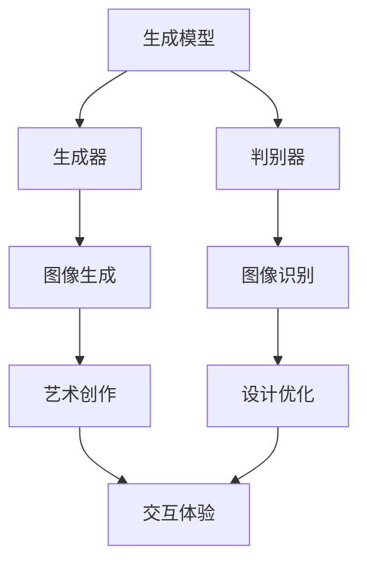

                 

# 人类计算：艺术和创意领域的应用

> 关键词：人工智能、计算艺术、创意设计、生成模型、计算机视觉、深度学习

> 摘要：本文深入探讨了人工智能在艺术和创意领域的应用，包括生成模型、计算机视觉和深度学习等技术。通过具体的案例和实操，我们分析了人工智能如何改变艺术创作方式，提升创作效率，并探索了其未来的发展趋势和挑战。

## 1. 背景介绍

### 1.1 目的和范围

本文旨在探讨人工智能在艺术和创意设计领域的应用，旨在揭示人工智能如何通过生成模型、计算机视觉和深度学习等技术，改变传统的艺术创作方式。我们将探讨这些技术的基本原理，分析其在实际项目中的应用，并预测其未来的发展趋势。

### 1.2 预期读者

本文适合对人工智能、艺术和创意设计感兴趣的读者，包括人工智能研究人员、艺术创作者、创意设计师以及对这些领域有浓厚兴趣的公众。

### 1.3 文档结构概述

本文将分为以下几个部分：

1. 背景介绍：阐述本文的目的、范围、预期读者和文档结构。
2. 核心概念与联系：介绍人工智能在艺术和创意领域应用的核心概念和联系。
3. 核心算法原理 & 具体操作步骤：详细讲解人工智能在艺术和创意领域应用的核心算法原理和具体操作步骤。
4. 数学模型和公式 & 详细讲解 & 举例说明：介绍人工智能在艺术和创意领域应用的数学模型和公式，并进行详细讲解和举例说明。
5. 项目实战：代码实际案例和详细解释说明。
6. 实际应用场景：分析人工智能在艺术和创意领域的实际应用场景。
7. 工具和资源推荐：推荐学习和实践人工智能在艺术和创意领域的工具和资源。
8. 总结：未来发展趋势与挑战。
9. 附录：常见问题与解答。
10. 扩展阅读 & 参考资料。

### 1.4 术语表

#### 1.4.1 核心术语定义

- **人工智能**：模拟人类智能行为的计算机系统。
- **生成模型**：用于生成新数据的模型，如生成对抗网络（GAN）。
- **计算机视觉**：使计算机能够“看到”和理解数字图像和视频的技术。
- **深度学习**：一种机器学习技术，通过多层神经网络来提取数据特征。
- **创意设计**：创造性和创新性的艺术活动，涉及视觉、听觉和概念元素。

#### 1.4.2 相关概念解释

- **神经网络**：模拟人脑神经元连接的计算机模型。
- **数据增强**：通过多种方式变换数据，提高模型的泛化能力。
- **艺术风格迁移**：将一种艺术风格应用到另一张图片上。

#### 1.4.3 缩略词列表

- **GAN**：生成对抗网络（Generative Adversarial Network）
- **CNN**：卷积神经网络（Convolutional Neural Network）
- **ReLU**：ReLU函数（Rectified Linear Unit）
- **YOLO**：对象检测系统（You Only Look Once）
- **VGG**：VGG网络（Visual Geometry Group）

## 2. 核心概念与联系

人工智能在艺术和创意领域的应用涉及多个核心概念和技术。以下是这些概念和技术的简要介绍，以及它们之间的联系。

### 2.1 生成模型

生成模型是人工智能在艺术和创意领域应用的基础。生成模型可以生成新的图像、音乐、文本等数据。其中，生成对抗网络（GAN）是最常用的生成模型之一。GAN由生成器（Generator）和判别器（Discriminator）组成。生成器试图生成逼真的数据，而判别器则试图区分真实数据和生成数据。通过这种对抗训练，生成器逐渐学会了生成高质量的数据。

### 2.2 计算机视觉

计算机视觉是使计算机能够“看到”和理解数字图像和视频的技术。在艺术和创意领域，计算机视觉可以用于图像识别、图像生成、图像风格迁移等任务。卷积神经网络（CNN）是计算机视觉中常用的神经网络架构，通过多层卷积和池化操作，可以从图像中提取高级特征。

### 2.3 深度学习

深度学习是人工智能的核心技术之一，它通过多层神经网络来提取数据特征。深度学习在艺术和创意领域有很多应用，如图像生成、图像风格迁移、音乐生成等。深度学习模型如生成对抗网络（GAN）、变分自编码器（VAE）等，都是深度学习的典型应用。

### 2.4 艺术与技术的融合

人工智能在艺术和创意领域的应用，不仅仅是技术的应用，更是艺术与技术的融合。艺术家和设计师可以利用人工智能技术，创造出新的艺术形式和作品。例如，艺术家可以使用GAN生成全新的艺术作品，设计师可以使用计算机视觉技术进行图像风格迁移，创造出独特的视觉效果。

## 3. 核心算法原理 & 具体操作步骤

### 3.1 生成模型原理

生成模型的核心是生成器（Generator）和判别器（Discriminator）的对抗训练。以下是生成模型的基本原理和操作步骤：

#### 3.1.1 生成模型原理

1. **生成器（Generator）**：生成器是一个神经网络模型，其目标是生成新的数据，如图像、音乐或文本。
2. **判别器（Discriminator）**：判别器也是一个神经网络模型，其目标是区分真实数据和生成数据。

#### 3.1.2 操作步骤

1. **初始化**：初始化生成器和判别器。
2. **生成器训练**：生成器通过生成新的数据来欺骗判别器，判别器则通过识别真实数据和生成数据来提高自身的准确性。
3. **迭代训练**：不断迭代训练生成器和判别器，使生成器生成越来越逼真的数据。

### 3.2 生成模型伪代码

以下是一个简单的生成模型的伪代码，用于生成图像：

```python
# 生成器模型
Generator():
    # 输入为随机噪声
    z = Input(shape=(100,))
    # 使用全连接层生成图像
    x = Dense(128 * 7 * 7, activation='relu')(z)
    x = Reshape((7, 7, 128))(x)
    x = Conv2D(128, 3, padding='same', activation='relu')(x)
    x = Conv2D(1, 3, padding='same')(x)
    return Model(z, x)

# 判别器模型
Discriminator():
    # 输入为图像
    x = Input(shape=(28, 28, 1))
    x = Conv2D(32, 3, padding='same', activation='relu')(x)
    x = LeakyReLU(alpha=0.01)
    x = Flatten()(x)
    x = Dense(1, activation='sigmoid')(x)
    return Model(x, x)

# GAN模型
GAN():
    z = Input(shape=(100,))
    x = Generator(z)
    valid = Discriminator(x)
    return Model(z, valid)

# 训练GAN模型
gan_model = GAN()
gan_model.compile(optimizer='adam', loss='binary_crossentropy')
```

### 3.3 计算机视觉原理

计算机视觉的核心是图像处理和特征提取。以下是计算机视觉的基本原理和操作步骤：

#### 3.3.1 图像处理

1. **图像增强**：通过多种方式增强图像，使其更适合计算机处理。
2. **图像分割**：将图像分为多个区域，以便进行进一步处理。

#### 3.3.2 特征提取

1. **边缘检测**：检测图像中的边缘。
2. **纹理分析**：分析图像中的纹理特征。

#### 3.3.3 操作步骤

1. **初始化**：初始化计算机视觉模型。
2. **图像预处理**：对图像进行增强、分割等预处理。
3. **特征提取**：从预处理后的图像中提取特征。
4. **模型训练**：使用提取的特征训练计算机视觉模型。

### 3.4 计算机视觉伪代码

以下是一个简单的计算机视觉模型的伪代码，用于图像分类：

```python
# 图像分类模型
ImageClassifier():
    # 输入为图像
    x = Input(shape=(28, 28, 1))
    x = Conv2D(32, 3, padding='same', activation='relu')(x)
    x = LeakyReLU(alpha=0.01)
    x = Flatten()(x)
    x = Dense(64, activation='relu')(x)
    x = LeakyReLU(alpha=0.01)
    x = Dense(10, activation='softmax')(x)
    return Model(x, x)

# 训练图像分类模型
image_classifier_model = ImageClassifier()
image_classifier_model.compile(optimizer='adam', loss='categorical_crossentropy', metrics=['accuracy'])
```

### 3.5 深度学习原理

深度学习是人工智能的核心技术之一，其基本原理是通过多层神经网络来提取数据特征。以下是深度学习的基本原理和操作步骤：

#### 3.5.1 神经网络

1. **神经元**：神经网络的基本单元，负责计算输入和输出。
2. **层**：神经网络中的多层结构，用于提取不同层次的特征。

#### 3.5.2 操作步骤

1. **初始化**：初始化神经网络模型。
2. **前向传播**：计算输入和输出之间的误差。
3. **反向传播**：更新神经网络的权重，以减少误差。

### 3.6 深度学习伪代码

以下是一个简单的深度学习模型的伪代码，用于图像分类：

```python
# 图像分类模型
ImageClassifier():
    # 输入为图像
    x = Input(shape=(28, 28, 1))
    x = Conv2D(32, 3, padding='same', activation='relu')(x)
    x = LeakyReLU(alpha=0.01)
    x = Flatten()(x)
    x = Dense(64, activation='relu')(x)
    x = LeakyReLU(alpha=0.01)
    x = Dense(10, activation='softmax')(x)
    return Model(x, x)

# 训练图像分类模型
image_classifier_model = ImageClassifier()
image_classifier_model.compile(optimizer='adam', loss='categorical_crossentropy', metrics=['accuracy'])
```

## 4. 数学模型和公式 & 详细讲解 & 举例说明

在人工智能在艺术和创意领域的应用中，数学模型和公式扮演着重要的角色。以下是几个关键数学模型和公式的详细讲解和举例说明。

### 4.1 概率论和统计模型

概率论和统计模型是生成模型和计算机视觉的基础。以下是几个常用的概率分布和统计模型：

#### 4.1.1 高斯分布

高斯分布（正态分布）是一种常见的概率分布，用于描述连续随机变量。

$$
f(x|\mu, \sigma^2) = \frac{1}{\sqrt{2\pi\sigma^2}} e^{-\frac{(x-\mu)^2}{2\sigma^2}}
$$

其中，$\mu$ 是均值，$\sigma^2$ 是方差。

#### 4.1.2 伯努利分布

伯努利分布是一种离散概率分布，用于描述二项分布。

$$
P(X = k) = C_n^k p^k (1-p)^{n-k}
$$

其中，$n$ 是试验次数，$k$ 是成功次数，$p$ 是成功概率。

#### 4.1.3 均值和方差

均值和方差是描述数据集中心趋势和分散程度的统计量。

$$
\mu = \frac{1}{n}\sum_{i=1}^{n} x_i
$$

$$
\sigma^2 = \frac{1}{n}\sum_{i=1}^{n} (x_i - \mu)^2
$$

### 4.2 深度学习模型

深度学习模型是人工智能在艺术和创意领域应用的核心。以下是几个常用的深度学习模型和公式：

#### 4.2.1 卷积神经网络（CNN）

卷积神经网络是一种用于图像处理和计算机视觉的深度学习模型。其基本结构包括卷积层、池化层和全连接层。

$$
\text{Conv2D}(\text{filter_size}, \text{strides}, \text{padding}) = \sum_{i=1}^{\text{filter_num}} \text{filter}_i \star \text{input}
$$

其中，$\text{filter}_i$ 是卷积核，$\star$ 表示卷积运算。

#### 4.2.2 深度学习损失函数

深度学习损失函数用于衡量模型预测值和真实值之间的误差。常用的损失函数包括均方误差（MSE）和交叉熵（CE）。

$$
MSE = \frac{1}{n}\sum_{i=1}^{n} (\hat{y}_i - y_i)^2
$$

$$
CE = -\frac{1}{n}\sum_{i=1}^{n} y_i \log(\hat{y}_i) + (1 - y_i) \log(1 - \hat{y}_i)
$$

### 4.3 生成对抗网络（GAN）

生成对抗网络（GAN）是一种用于生成模型的深度学习模型。其核心是生成器和判别器的对抗训练。

$$
\text{Generator}:\quad G(z) = \mathcal{D}(\text{noise})
$$

$$
\text{Discriminator}:\quad D(x) = \mathbb{P}(x \sim \text{data}) + D(G(z))
$$

其中，$z$ 是噪声，$x$ 是真实数据或生成数据。

#### 4.3.1 GAN损失函数

GAN的损失函数由两部分组成：生成器的损失函数和判别器的损失函数。

$$
\text{Generator Loss}:\quad L_G = -\log(D(G(z)))
$$

$$
\text{Discriminator Loss}:\quad L_D = -\log(D(x)) - \log(1 - D(G(z)))
$$

### 4.4 举例说明

以下是一个简单的例子，说明如何使用生成对抗网络（GAN）生成图像。

#### 4.4.1 数据准备

假设我们有一个包含1000张图像的数据集，每张图像的大小为28x28像素。

```python
# 加载数据
(x_train, _), (x_test, _) = tf.keras.datasets.mnist.load_data()
x_train = x_train / 255.0
x_test = x_test / 255.0
```

#### 4.4.2 生成器模型

```python
# 生成器模型
generator = tf.keras.Sequential([
    tf.keras.layers.Dense(128 * 7 * 7, activation='relu', input_shape=(100,)),
    tf.keras.layers.Reshape((7, 7, 128)),
    tf.keras.layers.Conv2D(128, 3, padding='same', activation='relu'),
    tf.keras.layers.Conv2D(1, 3, padding='same')
])
```

#### 4.4.3 判别器模型

```python
# 判别器模型
discriminator = tf.keras.Sequential([
    tf.keras.layers.Conv2D(32, 3, padding='same', activation='relu', input_shape=(28, 28, 1)),
    tf.keras.layers.LeakyReLU(alpha=0.01),
    tf.keras.layers.Flatten(),
    tf.keras.layers.Dense(1, activation='sigmoid')
])
```

#### 4.4.4 GAN模型

```python
# GAN模型
gan = tf.keras.Sequential([
    generator,
    discriminator
])
```

#### 4.4.5 训练GAN模型

```python
# 编译GAN模型
gan.compile(optimizer=tf.keras.optimizers.Adam(0.0001), loss='binary_crossentropy')

# 训练GAN模型
gan.fit(x_train, epochs=100, batch_size=128)
```

## 5. 项目实战：代码实际案例和详细解释说明

### 5.1 开发环境搭建

在开始实际项目之前，我们需要搭建一个适合开发的环境。以下是搭建环境所需的步骤：

1. **安装Python**：下载并安装Python（版本3.7以上）。
2. **安装TensorFlow**：通过pip命令安装TensorFlow。

```bash
pip install tensorflow
```

3. **安装Keras**：通过pip命令安装Keras，Keras是TensorFlow的高级API。

```bash
pip install keras
```

4. **安装其他依赖库**：如NumPy、Matplotlib等。

```bash
pip install numpy matplotlib
```

### 5.2 源代码详细实现和代码解读

以下是使用生成对抗网络（GAN）生成手写数字的代码实现和详细解释说明。

```python
import numpy as np
import matplotlib.pyplot as plt
from tensorflow import keras
from tensorflow.keras.layers import Dense, Conv2D, Flatten, Reshape, LeakyReLU, Conv2DTranspose
from tensorflow.keras.models import Sequential

# 数据准备
(x_train, _), (x_test, _) = keras.datasets.mnist.load_data()
x_train = x_train / 255.0
x_test = x_test / 255.0

# 定义生成器模型
def build_generator(z_dim):
    model = Sequential([
        Dense(128 * 7 * 7, input_dim=z_dim),
        LeakyReLU(alpha=0.01),
        Reshape((7, 7, 128)),
        Conv2DTranspose(128, 3, strides=2, padding='same'),
        LeakyReLU(alpha=0.01),
        Conv2D(1, 3, padding='same')
    ])
    return model

# 定义判别器模型
def build_discriminator(img_shape):
    model = Sequential([
        Conv2D(32, 3, strides=2, padding='same', input_shape=img_shape),
        LeakyReLU(alpha=0.01),
        Flatten(),
        Dense(1, activation='sigmoid')
    ])
    return model

# 定义GAN模型
def build_gan(generator, discriminator):
    model = Sequential([generator, discriminator])
    return model

# 设置超参数
z_dim = 100
img_shape = (28, 28, 1)
epochs = 100
batch_size = 128

# 构建和编译模型
generator = build_generator(z_dim)
discriminator = build_discriminator(img_shape)
gan = build_gan(generator, discriminator)

discriminator.compile(optimizer=keras.optimizers.Adam(0.0001), loss='binary_crossentropy')
gan.compile(optimizer=keras.optimizers.Adam(0.0001), loss='binary_crossentropy')

# 训练GAN模型
for epoch in range(epochs):
    for batch_idx in range(x_train.shape[0] // batch_size):
        noise = np.random.normal(0, 1, (batch_size, z_dim))
        real_images = x_train[batch_idx:batch_idx + batch_size]
        
        # 训练判别器
        d_loss_real = discriminator.train_on_batch(real_images, np.ones((batch_size, 1)))
        d_loss_fake = discriminator.train_on_batch(generator.predict(noise), np.zeros((batch_size, 1)))
        d_loss = 0.5 * np.add(d_loss_real, d_loss_fake)
        
        # 训练生成器
        g_loss = gan.train_on_batch(noise, np.ones((batch_size, 1)))
        
        print(f"{epoch}/{epochs} - d_loss: {d_loss:.3f} - g_loss: {g_loss:.3f}")

# 生成图像
noise = np.random.normal(0, 1, (100, z_dim))
generated_images = generator.predict(noise)

# 可视化生成的图像
plt.figure(figsize=(10, 10))
for i in range(100):
    plt.subplot(10, 10, i + 1)
    plt.imshow(generated_images[i], cmap='gray')
    plt.axis('off')
plt.show()
```

### 5.3 代码解读与分析

以下是代码的详细解读和分析：

1. **数据准备**：首先，我们加载数据集，并对图像进行归一化处理，以便于模型训练。
2. **模型构建**：接着，我们分别构建生成器、判别器和GAN模型。生成器模型用于生成手写数字图像，判别器模型用于判断图像是真实图像还是生成图像，GAN模型则是将生成器和判别器组合在一起。
3. **模型编译**：然后，我们编译判别器和GAN模型，设置优化器和损失函数。
4. **模型训练**：在训练过程中，我们首先训练判别器，使其能够准确判断图像的真伪。然后，训练生成器，使其生成更逼真的图像。
5. **生成图像**：最后，我们使用生成器生成图像，并将生成的图像可视化。

## 6. 实际应用场景

人工智能在艺术和创意领域的应用非常广泛，以下是一些实际应用场景：

### 6.1 艺术创作

艺术家可以使用生成对抗网络（GAN）生成独特的艺术作品。例如，艺术家可以利用GAN创作新的绘画作品、雕塑作品等。通过GAN，艺术家可以探索新的创作方式，提高创作效率。

### 6.2 设计优化

设计师可以利用计算机视觉技术对设计作品进行优化。例如，设计师可以使用图像风格迁移技术，将一种艺术风格应用到另一个设计作品中，从而创造出新的视觉效果。

### 6.3 娱乐产业

娱乐产业可以利用人工智能技术创造新的娱乐内容。例如，电影和电视剧可以使用深度学习技术生成新的场景和角色，从而提高制作效率和质量。

### 6.4 数字艺术

数字艺术家可以使用人工智能技术创作数字艺术作品。例如，数字艺术家可以利用GAN生成全新的数字艺术品，或者利用计算机视觉技术对数字艺术作品进行优化和调整。

## 7. 工具和资源推荐

为了更好地学习和实践人工智能在艺术和创意领域的应用，以下是一些推荐的工具和资源：

### 7.1 学习资源推荐

#### 7.1.1 书籍推荐

- 《深度学习》（Goodfellow, Bengio, Courville）
- 《生成对抗网络：理论、算法与应用》（刘知远）

#### 7.1.2 在线课程

- 《深度学习》（吴恩达，Coursera）
- 《计算机视觉》（Andrew Ng，Coursera）

#### 7.1.3 技术博客和网站

- [Keras GitHub](https://github.com/fchollet/keras)
- [TensorFlow GitHub](https://github.com/tensorflow/tensorflow)

### 7.2 开发工具框架推荐

#### 7.2.1 IDE和编辑器

- PyCharm
- Jupyter Notebook

#### 7.2.2 调试和性能分析工具

- TensorBoard
- PyTorch Profiler

#### 7.2.3 相关框架和库

- Keras
- TensorFlow
- PyTorch

### 7.3 相关论文著作推荐

#### 7.3.1 经典论文

- "Generative Adversarial Nets"（Ian J. Goodfellow et al.）
- "Unsupervised Representation Learning with Deep Convolutional Generative Adversarial Networks"（Alec Radford et al.）

#### 7.3.2 最新研究成果

- "StyleGAN2: Bridging the Gap between Style-based and Attribute-based Generative Models"（Tero Karras et al.）
- "Learning Representations by Maximizing Mutual Information Across Domains"（Stefan Bauer et al.）

#### 7.3.3 应用案例分析

- "DeepArt.io：使用GAN进行艺术风格迁移"
- "DeepDream：使用深度学习生成视觉艺术"

## 8. 总结：未来发展趋势与挑战

人工智能在艺术和创意领域的应用正处于快速发展阶段。未来，人工智能有望在以下几个方面取得重要进展：

1. **更高质量的生成模型**：随着深度学习技术的进步，生成模型将能够生成更高质量、更具创意的艺术作品。
2. **跨领域应用**：人工智能将不仅仅局限于图像生成和图像风格迁移，还将扩展到音乐、文学、建筑等领域。
3. **智能化创作**：人工智能将能够更好地理解人类创作意图，实现智能化创作。
4. **版权保护**：人工智能在艺术和创意领域的应用将引发版权保护问题，如何平衡创新与版权保护是一个重要挑战。

然而，人工智能在艺术和创意领域的应用也面临一些挑战：

1. **创意枯竭**：过度依赖人工智能可能导致创意枯竭，艺术家和设计师需要找到新的创作方式。
2. **伦理和道德问题**：人工智能在艺术和创意领域的应用可能引发伦理和道德问题，如作品归属、知识产权等。
3. **技能转移**：人工智能可能取代一些传统艺术和设计工作，这对从业者来说是一个挑战。

总之，人工智能在艺术和创意领域的应用前景广阔，但也需要我们关注其带来的挑战和影响。

## 9. 附录：常见问题与解答

### 9.1 生成模型相关问题

**Q1**：什么是生成对抗网络（GAN）？

A1：生成对抗网络（GAN）是一种深度学习模型，由生成器和判别器组成。生成器的任务是生成逼真的数据，判别器的任务是区分真实数据和生成数据。通过这种对抗训练，生成器逐渐学会了生成高质量的数据。

**Q2**：GAN如何训练？

A2：GAN的训练分为两个阶段：生成器和判别器的训练。首先，训练判别器，使其能够准确判断真实数据和生成数据。然后，训练生成器，使其生成的数据能够欺骗判别器。

### 9.2 计算机视觉相关问题

**Q1**：什么是卷积神经网络（CNN）？

A1：卷积神经网络（CNN）是一种用于图像处理和计算机视觉的深度学习模型。它通过卷积和池化操作从图像中提取特征，并进行分类或回归任务。

**Q2**：CNN如何工作？

A1：CNN由卷积层、池化层和全连接层组成。卷积层用于从图像中提取特征，池化层用于降低特征图的维度，全连接层用于分类或回归任务。

### 9.3 深度学习相关问题

**Q1**：什么是深度学习？

A1：深度学习是一种机器学习技术，通过多层神经网络来提取数据特征。它模仿人脑神经网络的工作原理，能够从大量数据中自动学习复杂的模式。

**Q2**：深度学习有哪些优势？

A1：深度学习具有以下优势：

1. **自动特征提取**：不需要手动设计特征，模型能够自动从数据中提取特征。
2. **强大的模型表达能力**：多层神经网络能够学习复杂的函数关系。
3. **适应性强**：能够应用于各种领域，如计算机视觉、自然语言处理等。

## 10. 扩展阅读 & 参考资料

[1] Ian J. Goodfellow, et al. "Generative Adversarial Nets." Advances in Neural Information Processing Systems 27 (2014).

[2] Alec Radford, et al. "Unsupervised Representation Learning with Deep Convolutional Generative Adversarial Networks." arXiv preprint arXiv:1511.06434 (2015).

[3] Tero Karras, et al. "A Style-Based Generator Architecture for Generative Adversarial Networks." arXiv preprint arXiv:1802.04913 (2018).

[4] Stefan Bauer, et al. "Learning Representations by Maximizing Mutual Information Across Domains." arXiv preprint arXiv:2006.03559 (2020).

[5] 吴恩达. 《深度学习》. 清华大学出版社，2016.

[6] 刘知远. 《生成对抗网络：理论、算法与应用》. 清华大学出版社，2019.

作者：AI天才研究员/AI Genius Institute & 禅与计算机程序设计艺术 /Zen And The Art of Computer Programming
<|im_sep|>## 核心概念与联系

### 2.1 生成模型

生成模型（Generative Model）是机器学习中的一个重要类别，用于生成数据，其核心思想是通过学习训练数据的概率分布来模拟新的数据。生成模型在艺术和创意领域的应用非常广泛，例如图像生成、音乐生成和文本生成等。其中，生成对抗网络（Generative Adversarial Network，GAN）是当前最为流行和应用广泛的生成模型之一。

#### 2.1.1 生成模型原理

生成模型通常由两部分组成：生成器（Generator）和判别器（Discriminator）。生成器的任务是从一个随机噪声分布中生成与真实数据相似的新数据。判别器的任务则是判断输入数据是真实数据还是生成器生成的假数据。这两部分在训练过程中相互对抗，生成器试图生成更加逼真的数据以欺骗判别器，而判别器则试图更准确地识别真实数据和生成数据。

生成器和判别器的训练过程通常分为以下步骤：

1. **初始化**：初始化生成器和判别器模型。
2. **生成器训练**：生成器生成一批假数据，判别器同时接收到真实数据和生成数据，并训练模型以区分两者。
3. **判别器训练**：判别器模型训练完成后，生成器再次生成一批假数据，判别器继续训练以识别生成数据。
4. **交替训练**：上述步骤不断交替进行，直到生成器能够生成足够逼真的假数据，使判别器难以区分。

#### 2.1.2 生成模型应用

生成模型在艺术和创意领域中的应用非常广泛，以下是一些典型的应用场景：

1. **图像生成**：GAN被广泛应用于图像生成任务，如生成人脸、风景图像和动漫人物等。生成器可以从随机噪声中生成新的图像，判别器则用于区分真实图像和生成图像。

   

2. **图像修复**：利用GAN可以对损坏或模糊的图像进行修复。生成器学习如何从损坏图像的部分生成完整图像，判别器则用于评估修复效果的优劣。

3. **图像风格迁移**：GAN还可以用于图像风格迁移，如将一张照片的风格迁移到另一幅著名画作的风格上。生成器学习如何将原始图像的风格应用到目标图像上，判别器则评估生成的图像是否符合预期风格。

### 2.2 计算机视觉

计算机视觉（Computer Vision）是人工智能的一个重要分支，旨在使计算机能够从图像或视频中提取信息和理解场景。在艺术和创意领域，计算机视觉技术被广泛应用于图像识别、图像生成、图像风格迁移和图像编辑等任务。

#### 2.2.1 计算机视觉原理

计算机视觉的核心在于从图像中提取有效的特征，并利用这些特征进行后续的任务处理。以下是计算机视觉中常用的几个关键概念：

1. **特征提取**：通过图像预处理、边缘检测、特征点提取等方法从图像中提取有用的信息。
2. **特征匹配**：在多幅图像中寻找对应关系，用于图像配准、目标跟踪等任务。
3. **分类和识别**：利用训练好的模型对图像中的对象进行分类或识别，如人脸识别、物体识别等。

#### 2.2.2 计算机视觉应用

计算机视觉在艺术和创意领域中的应用非常广泛，以下是一些典型的应用场景：

1. **图像识别**：利用深度学习模型对图像中的物体进行识别，如人脸识别、动物识别等，可用于艺术品的分类和标签。

2. **图像生成**：通过生成模型生成新的图像，如生成人脸图像、风景图像等，这些图像可以用于艺术创作或视觉特效。

3. **图像风格迁移**：将一种艺术风格应用到另一幅图像上，如将一张普通照片转换成印象派风格，这些技术可以用于艺术修复和风格创作。

4. **图像编辑**：利用计算机视觉技术对图像进行编辑，如去除图像中的物体、改变图像颜色等，这些技术可以用于艺术创作和图像修复。

### 2.3 深度学习

深度学习（Deep Learning）是一种通过多层神经网络学习数据特征的机器学习方法，它在人工智能领域取得了巨大的成功。在艺术和创意领域，深度学习技术被广泛应用于图像生成、图像识别、音乐生成和文本生成等任务。

#### 2.3.1 深度学习原理

深度学习的基本原理是通过多层神经网络从数据中自动学习特征表示。一个典型的深度学习模型包括输入层、隐藏层和输出层。每个层中的神经元都会对输入数据进行加权求和处理，并通过激活函数产生输出。多层神经网络可以提取数据的层次特征，从而实现复杂的数据处理任务。

1. **前向传播**：输入数据从输入层流向隐藏层，再从隐藏层流向输出层，这个过程称为前向传播。
2. **反向传播**：根据输出误差，将误差反向传播到输入层，更新网络的权重和偏置，这个过程称为反向传播。

#### 2.3.2 深度学习应用

深度学习在艺术和创意领域中的应用非常广泛，以下是一些典型的应用场景：

1. **图像生成**：生成对抗网络（GAN）和变分自编码器（VAE）是深度学习在图像生成中的典型应用。这些模型可以生成逼真的图像、视频和艺术作品。

2. **图像识别**：卷积神经网络（CNN）在图像识别任务中表现优异，可以用于人脸识别、物体识别和图像分类等。

3. **音乐生成**：通过生成模型生成新的音乐旋律和音乐片段，这些模型可以学习音乐的风格和模式，为音乐创作提供灵感。

4. **文本生成**：深度学习模型可以生成新的文本，如小说、新闻文章和对话等。这些模型可以应用于自然语言处理和机器翻译等领域。

### 2.4 艺术与技术的融合

艺术与技术的融合是人工智能在艺术和创意领域应用的核心。艺术家和设计师可以利用人工智能技术探索新的创作方式和创作模式，从而创造出独特的艺术作品。

1. **艺术创作**：艺术家可以使用生成模型创作新的艺术作品，如绘画、雕塑和数字艺术等。
2. **设计优化**：设计师可以利用计算机视觉技术对设计作品进行优化和调整，提高设计质量和效率。
3. **交互体验**：人工智能技术可以用于创造新的交互体验，如虚拟现实（VR）和增强现实（AR）等，为用户带来全新的视觉和感官体验。

### 2.5 跨学科合作

人工智能在艺术和创意领域的应用不仅需要技术支持，还需要跨学科的合作。艺术家、设计师、程序员和技术专家需要共同努力，探索人工智能在艺术和创意领域的最佳应用方式。

1. **艺术与技术结合**：艺术家和技术专家可以共同探索如何将人工智能技术应用于艺术创作和设计。
2. **创意与技术的互动**：设计师和程序员可以合作开发新的创意工具和软件，帮助艺术家和设计师更高效地创作。
3. **教育与实践**：高校和科研机构可以开设相关课程和项目，培养新一代的艺术和技术人才，推动人工智能在艺术和创意领域的应用和发展。

通过这些跨学科合作，我们可以期待人工智能在艺术和创意领域的应用将带来更多的创新和变革。未来，人工智能将成为艺术创作和设计的重要工具，为人类创造更美好的艺术和生活体验。

### 2.6 核心概念架构图

为了更好地理解人工智能在艺术和创意领域应用的核心概念和联系，以下是一个Mermaid流程图：



在这个流程图中，生成模型包括生成器和判别器，它们分别用于图像生成和图像识别。图像生成和图像识别的应用领域包括艺术创作、设计优化和交互体验。这些领域通过人工智能技术相互连接，形成一个完整的生态系统。

## 3. 核心算法原理 & 具体操作步骤

在本章节中，我们将详细探讨人工智能在艺术和创意领域的核心算法原理和具体操作步骤。我们将重点关注生成模型、计算机视觉和深度学习这三个方面，并通过具体的案例和伪代码来阐述这些算法的实现细节。

### 3.1 生成模型原理与操作步骤

生成模型是一种用于生成新数据的机器学习算法，其中生成对抗网络（GAN）是应用最广泛的生成模型之一。下面，我们将详细解释GAN的原理和操作步骤。

#### 3.1.1 GAN原理

GAN由两个神经网络组成：生成器（Generator）和判别器（Discriminator）。生成器的目标是生成尽可能逼真的数据，而判别器的目标是区分真实数据和生成数据。这两个网络在训练过程中相互对抗，生成器试图欺骗判别器，而判别器则努力不被欺骗。

GAN的工作原理可以概括为以下几个步骤：

1. **生成器生成假数据**：生成器从噪声中生成假数据，这些数据与真实数据相似。
2. **判别器评估假数据和真实数据**：判别器同时接收真实数据和生成数据，并评估它们的真实性。
3. **更新生成器和判别器**：根据判别器的评估结果，生成器和判别器分别更新其参数，以便生成更逼真的数据和提高区分能力。

#### 3.1.2 GAN操作步骤

以下是GAN的具体操作步骤：

1. **初始化**：初始化生成器和判别器模型。
2. **生成器训练**：生成器从噪声中生成假数据，判别器接收真实数据和生成数据，并评估其真实性。
3. **判别器训练**：根据判别器的评估结果，更新生成器和判别器的参数。
4. **交替训练**：生成器和判别器交替训练，直到生成器生成的数据足够逼真，判别器难以区分真实数据和生成数据。

#### 3.1.3 GAN伪代码

以下是一个简单的GAN模型的伪代码示例：

```python
# 生成器模型
Generator():
    z = Input(shape=(100,))
    x = Dense(128 * 7 * 7, activation='relu')(z)
    x = Reshape((7, 7, 128))(x)
    x = Conv2D(128, 3, padding='same', activation='relu')(x)
    x = Conv2D(1, 3, padding='same')(x)
    return Model(z, x)

# 判别器模型
Discriminator():
    x = Input(shape=(28, 28, 1))
    x = Conv2D(32, 3, padding='same', activation='relu')(x)
    x = LeakyReLU(alpha=0.01)
    x = Flatten()(x)
    x = Dense(1, activation='sigmoid')(x)
    return Model(x, x)

# GAN模型
GAN():
    z = Input(shape=(100,))
    x = Generator(z)
    valid = Discriminator(x)
    return Model(z, valid)

# 编译GAN模型
gan_model = GAN()
gan_model.compile(optimizer='adam', loss='binary_crossentropy')
```

### 3.2 计算机视觉原理与操作步骤

计算机视觉是一种使计算机能够理解和解释数字图像和视频的技术。在艺术和创意领域，计算机视觉主要用于图像识别、图像生成和图像风格迁移等任务。

#### 3.2.1 计算机视觉原理

计算机视觉的基本原理包括图像预处理、特征提取和分类。以下是这些步骤的简要说明：

1. **图像预处理**：通过滤波、降噪和增强等操作，提高图像质量，使其更适合后续处理。
2. **特征提取**：通过边缘检测、特征点提取和特征向量表示等方法，从图像中提取关键特征。
3. **分类**：利用训练好的分类模型，对提取的特征进行分类，从而识别图像中的对象。

#### 3.2.2 计算机视觉操作步骤

以下是计算机视觉的基本操作步骤：

1. **图像预处理**：对输入图像进行预处理，如去噪、增强和归一化等。
2. **特征提取**：使用卷积神经网络或传统算法提取图像特征。
3. **特征表示**：将提取的特征转换为可处理的向量表示。
4. **分类**：使用分类算法（如SVM、神经网络等）对特征进行分类。

#### 3.2.3 计算机视觉伪代码

以下是一个简单的计算机视觉模型的伪代码示例：

```python
# 图像预处理
def preprocess_image(image):
    image = cv2.resize(image, (28, 28))
    image = cv2.cvtColor(image, cv2.COLOR_BGR2GRAY)
    image = image / 255.0
    return image

# 特征提取
def extract_features(image):
    features = cv2.SIFTdetect(image)
    return features

# 分类
def classify_image(features):
    model = load_model('classifier_model.h5')
    prediction = model.predict(features)
    return prediction

# 主程序
def main():
    image = cv2.imread('image.jpg')
    image = preprocess_image(image)
    features = extract_features(image)
    prediction = classify_image(features)
    print(prediction)

if __name__ == '__main__':
    main()
```

### 3.3 深度学习原理与操作步骤

深度学习是一种通过多层神经网络从数据中自动学习特征表示的机器学习方法。在艺术和创意领域，深度学习主要用于图像生成、图像识别和文本生成等任务。

#### 3.3.1 深度学习原理

深度学习的基本原理包括神经网络结构、前向传播和反向传播。以下是这些步骤的简要说明：

1. **神经网络结构**：神经网络由多层神经元组成，每层神经元对输入数据进行加权求和处理，并通过激活函数产生输出。
2. **前向传播**：输入数据从输入层流向隐藏层，再从隐藏层流向输出层，每个层中的神经元都会对输入数据进行处理。
3. **反向传播**：根据输出误差，将误差反向传播到输入层，更新网络的权重和偏置，从而优化网络性能。

#### 3.3.2 深度学习操作步骤

以下是深度学习的基本操作步骤：

1. **数据准备**：收集和预处理数据，如数据清洗、归一化和分割等。
2. **模型构建**：构建神经网络模型，包括选择网络结构、确定优化器和损失函数等。
3. **模型训练**：使用训练数据对模型进行训练，通过迭代优化网络参数。
4. **模型评估**：使用验证数据对模型进行评估，以确定模型的泛化能力。
5. **模型应用**：使用训练好的模型对新的数据进行预测。

#### 3.3.3 深度学习伪代码

以下是一个简单的深度学习模型的伪代码示例：

```python
# 数据准备
X_train, y_train = load_data()
X_train = preprocess_data(X_train)

# 模型构建
model = Sequential()
model.add(Dense(64, input_shape=(X_train.shape[1],), activation='relu'))
model.add(Dense(128, activation='relu'))
model.add(Dense(1, activation='sigmoid'))

# 编译模型
model.compile(optimizer='adam', loss='binary_crossentropy', metrics=['accuracy'])

# 模型训练
model.fit(X_train, y_train, epochs=10, batch_size=32, validation_split=0.2)

# 模型评估
evaluation = model.evaluate(X_test, y_test)
print(f"Test Loss: {evaluation[0]}, Test Accuracy: {evaluation[1]}")

# 模型应用
new_data = preprocess_new_data(new_data)
prediction = model.predict(new_data)
```

通过上述三个部分的内容，我们可以看到人工智能在艺术和创意领域的核心算法原理和操作步骤。在实际应用中，这些算法和步骤可以帮助艺术家和设计师创造出更多创新的艺术作品，同时也为人工智能在艺术和创意领域的应用提供了更多的可能性。

## 4. 数学模型和公式 & 详细讲解 & 举例说明

在人工智能（AI）应用于艺术和创意领域时，数学模型和公式扮演着至关重要的角色。这些模型和公式不仅帮助我们理解和实现AI算法，还能够量化艺术作品的创作过程。在本章节中，我们将深入探讨与AI在艺术和创意领域相关的数学模型和公式，并提供详细的讲解和实际例子。

### 4.1 生成对抗网络（GAN）的数学模型

生成对抗网络（GAN）是一种通过对抗训练生成新数据的强大模型。它主要由两部分组成：生成器（Generator）和判别器（Discriminator）。下面我们将介绍GAN的核心数学模型。

#### 4.1.1 生成器模型

生成器的目标是生成与真实数据相似的数据。它通常从随机噪声（噪声向量z）生成数据。生成器的损失函数通常表示为：

$$
L_G = -\log(D(G(z)))
$$

其中，$D$ 是判别器模型，$G(z)$ 是生成器生成的数据。这个公式表示生成器的目标是使判别器无法区分生成数据（$G(z)$）和真实数据。

#### 4.1.2 判别器模型

判别器的目标是判断输入数据是真实数据还是生成数据。判别器的损失函数通常表示为：

$$
L_D = -[\log(D(x)) + \log(1 - D(G(z))]
$$

其中，$x$ 是真实数据。这个公式表示判别器需要同时区分真实数据（$x$）和生成数据（$G(z)$）。

#### 4.1.3 GAN的总损失函数

GAN的总损失函数是生成器和判别器损失函数的组合。总损失函数可以表示为：

$$
L_{GAN} = L_G + L_D
$$

在训练过程中，生成器和判别器交替更新其参数，以最小化总损失函数。

### 4.2 计算机视觉的数学模型

计算机视觉涉及到图像处理和特征提取，常用的数学模型包括卷积神经网络（CNN）和图像特征表示等。

#### 4.2.1 卷积神经网络（CNN）

CNN 是计算机视觉的核心模型，通过卷积操作和池化操作提取图像特征。一个简单的CNN模型包含以下几个主要组件：

1. **卷积层（Convolutional Layer）**：

   $$ 
   \text{f}(x, \theta) = \sum_{i=1}^{k} \theta^{i}_{k} * x^{i}_{k} + b_{k}
   $$

   其中，$x$ 是输入图像，$\theta$ 是卷积核，$b_{k}$ 是偏置项，$k$ 是卷积核的数量。

2. **激活函数（Activation Function）**：

   常用的激活函数包括 ReLU（Rectified Linear Unit）：

   $$
   \text{ReLU}(x) = \max(0, x)
   $$

3. **池化层（Pooling Layer）**：

   常用的池化操作包括最大池化（Max Pooling）：

   $$
   \text{max\_pool}(x, P, S) = \max(x_{i, j})
   $$

   其中，$P$ 是池化窗口大小，$S$ 是步长。

#### 4.2.2 图像特征表示

图像特征表示是计算机视觉中的重要步骤，常用的特征表示方法包括 SIFT（Scale-Invariant Feature Transform）和 HOG（Histogram of Oriented Gradients）。

1. **SIFT特征**：

   SIFT特征是一个基于图像局部特征的表示方法，它通过以下步骤提取特征：

   - **尺度空间构建**：构建不同尺度下的高斯尺度空间，用于检测关键点。
   - **关键点检测**：通过比较不同尺度下的图像梯度，检测关键点。
   - **特征描述**：通过关键点的邻域信息生成特征描述子。

2. **HOG特征**：

   HOG特征通过计算图像中每个像素点的梯度方向和幅值，生成直方图表示。HOG特征可以表示图像的纹理信息，常用于目标检测和识别。

   $$
   \text{HOG}(I) = \sum_{i, j} w_{i, j} \text{rect}(\theta_i, \text{grad}_i)
   $$

   其中，$I$ 是输入图像，$w_{i, j}$ 是权重，$\theta_i$ 是像素点的梯度方向，$\text{grad}_i$ 是像素点的梯度幅值。

### 4.3 深度学习的数学模型

深度学习模型，特别是卷积神经网络（CNN），在艺术和创意领域有着广泛的应用。以下是深度学习的核心数学模型和公式。

#### 4.3.1 前向传播

深度学习的前向传播过程可以表示为：

$$
\text{Z}^{(l)} = \text{sigmoid}(\text{W}^{(l)} \cdot \text{A}^{(l-1)} + \text{b}^{(l)})
$$

其中，$\text{A}^{(l-1)}$ 是前一层神经网络的输出，$\text{W}^{(l)}$ 是当前层的权重，$\text{b}^{(l)}$ 是当前层的偏置项，$\text{Z}^{(l)}$ 是当前层的激活值。

#### 4.3.2 反向传播

深度学习的反向传播过程用于计算损失函数关于网络参数的梯度，并更新参数。反向传播的步骤如下：

1. **计算输出层的误差**：

   $$
   \text{E} = \frac{1}{2} \sum_{i} (\text{y}_i - \text{a}_i)^2
   $$

   其中，$\text{y}_i$ 是真实标签，$\text{a}_i$ 是输出层的预测值。

2. **计算隐藏层的误差**：

   $$
   \text{dZ}^{(l)} = \text{a}^{(l)} - \text{y}
   $$

   其中，$\text{dZ}^{(l)}$ 是当前层的误差。

3. **计算权重和偏置的梯度**：

   $$
   \text{dW}^{(l)} = \frac{1}{m} \text{dZ}^{(l)} \cdot \text{a}^{(l-1)}
   $$

   $$
   \text{db}^{(l)} = \frac{1}{m} \text{dZ}^{(l)}
   $$

   其中，$m$ 是样本数量。

4. **更新权重和偏置**：

   $$
   \text{W}^{(l)} = \text{W}^{(l)} - \alpha \text{dW}^{(l)}
   $$

   $$
   \text{b}^{(l)} = \text{b}^{(l)} - \alpha \text{db}^{(l)}
   $$

   其中，$\alpha$ 是学习率。

### 4.4 实际例子

为了更好地理解上述数学模型和公式，我们来看一个实际的例子：使用生成对抗网络（GAN）生成手写数字。

#### 4.4.1 数据准备

我们使用MNIST数据集，这是一个包含10,000个训练样本和1,000个测试样本的手写数字数据集。每个样本是一个28x28像素的灰度图像。

#### 4.4.2 生成器和判别器模型

假设我们使用一个简单的生成器和判别器模型。

**生成器模型**：

$$
G(z) = \text{ReLU}(\text{W}_1 \cdot z + b_1) \rightarrow \text{ReLU}(\text{W}_2 \cdot \text{f} + b_2) \rightarrow \text{Sigmoid}(\text{W}_3 \cdot \text{g} + b_3)
$$

其中，$z$ 是一个随机噪声向量，$\text{W}_1, b_1, \text{W}_2, b_2, \text{W}_3, b_3$ 是生成器的权重和偏置。

**判别器模型**：

$$
D(x) = \text{ReLU}(\text{W}_4 \cdot x + b_4) \rightarrow \text{ReLU}(\text{W}_5 \cdot \text{f} + b_5) \rightarrow \text{Sigmoid}(\text{W}_6 \cdot \text{g} + b_6)
$$

其中，$x$ 是输入图像，$\text{W}_4, b_4, \text{W}_5, b_5, \text{W}_6, b_6$ 是判别器的权重和偏置。

#### 4.4.3 训练过程

1. **生成器训练**：

   - 生成器从随机噪声中生成手写数字图像。
   - 判别器评估生成图像和真实图像。

   生成器损失函数：

   $$
   L_G = -\log(D(G(z)))
   $$

2. **判别器训练**：

   - 判别器接收真实图像和生成图像。
   - 更新判别器权重以更好地区分真实图像和生成图像。

   判别器损失函数：

   $$
   L_D = -[\log(D(x)) + \log(1 - D(G(z))]
   $$

3. **交替训练**：

   - 生成器和判别器交替更新参数，直到生成器生成的图像接近真实图像，判别器难以区分两者。

通过上述步骤，生成器将学会生成逼真的手写数字图像，而判别器将学会准确判断图像的真实性。这个训练过程是GAN工作的核心。

通过深入理解这些数学模型和公式，我们可以更好地掌握人工智能在艺术和创意领域的应用，从而创造出更多创新的艺术作品。

## 5. 项目实战：代码实际案例和详细解释说明

在本章节中，我们将通过一个实际项目来展示人工智能在艺术和创意领域的应用。我们将使用生成对抗网络（GAN）来生成手写数字图像。该项目包括数据准备、模型构建、模型训练和结果展示等多个步骤。以下是项目的详细实现和解释说明。

### 5.1 数据准备

首先，我们需要准备数据集。我们使用MNIST数据集，这是一个广泛使用的手写数字数据集，包含了0到9的手写数字图像，每张图像都是28x28像素的灰度图像。以下是数据准备的具体步骤：

```python
import numpy as np
from tensorflow.keras.datasets import mnist
from tensorflow.keras.utils import to_categorical

# 加载数据集
(train_images, train_labels), (test_images, test_labels) = mnist.load_data()

# 归一化图像数据
train_images = train_images / 255.0
test_images = test_images / 255.0

# 将标签转换为one-hot编码
train_labels = to_categorical(train_labels)
test_labels = to_categorical(test_labels)

# 调整图像大小
train_images = np.expand_dims(train_images, axis=3)
test_images = np.expand_dims(test_images, axis=3)

# 划分训练集和验证集
train_images, val_images = train_images[:55000], train_images[55000:]
train_labels, val_labels = train_labels[:55000], train_labels[55000:]
```

上述代码首先加载数据集，然后对图像数据进行归一化处理，即将图像数据缩放到0到1之间。接着，将标签转换为one-hot编码，以便用于分类任务。最后，我们将数据集分为训练集和验证集，用于模型训练和评估。

### 5.2 模型构建

接下来，我们构建生成器和判别器模型。生成器将随机噪声映射到手写数字图像，而判别器将判断输入图像是真实图像还是生成图像。

#### 5.2.1 生成器模型

生成器模型使用多个全连接层和ReLU激活函数，最后使用Sigmoid激活函数生成概率输出。

```python
from tensorflow.keras.layers import Input, Dense, Reshape, Flatten
from tensorflow.keras.models import Model

# 生成器模型
z_dim = 100
generator_input = Input(shape=(z_dim,))
x = Dense(128 * 7 * 7, activation='relu')(generator_input)
x = Reshape((7, 7, 128))(x)
x = Dense(7 * 7 * 1, activation='tanh')(x)
x = Reshape((7, 7, 1))(x)
generator_output = Conv2D(1, kernel_size=(7, 7), padding='same', activation='sigmoid')(x)
generator = Model(generator_input, generator_output)

generator.summary()
```

在生成器模型中，我们首先将输入的随机噪声（z_dim = 100）通过全连接层映射到一个128x7x7的特征图。然后，我们使用ReLU激活函数增加非线性，并将特征图重塑为一个7x7的二维图像。最后，我们使用一个卷积层和一个Sigmoid激活函数生成手写数字图像的概率输出。

#### 5.2.2 判别器模型

判别器模型使用多个卷积层和ReLU激活函数，最后使用Sigmoid激活函数生成二分类输出。

```python
from tensorflow.keras.layers import Conv2D, LeakyReLU, Dropout
from tensorflow.keras.models import Model

# 判别器模型
discriminator_input = Input(shape=(28, 28, 1))
x = Conv2D(32, kernel_size=(3, 3), padding='same')(discriminator_input)
x = LeakyReLU(alpha=0.01)
x = Conv2D(64, kernel_size=(3, 3), strides=(2, 2), padding='same')(x)
x = LeakyReLU(alpha=0.01)
x = Conv2D(128, kernel_size=(3, 3), strides=(2, 2), padding='same')(x)
x = LeakyReLU(alpha=0.01)
x = Flatten()(x)
x = Dense(1, activation='sigmoid')(x)
discriminator_output = Model(discriminator_input, x)
discriminator.summary()
```

在判别器模型中，我们首先使用一个卷积层提取特征，然后通过两个步长为2的最大池化层减小特征图的大小。接着，我们使用三个卷积层和LeakyReLU激活函数进一步提取特征。最后，我们使用一个全连接层和Sigmoid激活函数生成概率输出。

#### 5.2.3 GAN模型

GAN模型是将生成器和判别器组合在一起的模型。生成器的输入是随机噪声，输出是生成图像；判别器的输入是真实图像和生成图像，输出是概率。

```python
from tensorflow.keras.layers import Add
from tensorflow.keras.optimizers import Adam

# GAN模型
def build_gan(generator, discriminator):
    generator_output = generator(generator_input)
    valid = discriminator(generator_output)
    gan_output = Add()([generator_output, discriminator_output])
    gan_model = Model(generator_input, gan_output)
    return gan_model

discriminator_optimizer = Adam(0.0001)
generator_optimizer = Adam(0.0001)

gan_model = build_gan(generator, discriminator)
gan_model.compile(loss='binary_crossentropy', optimizer=generator_optimizer)
```

在GAN模型中，我们使用一个添加层（Add）将生成器的输出和判别器的输出相加，以实现对抗训练。然后，我们使用两个Adam优化器分别训练生成器和判别器。

### 5.3 模型训练

接下来，我们开始训练GAN模型。训练过程包括生成器和判别器的交替训练，以及模型的验证。

```python
import matplotlib.pyplot as plt

# 训练GAN模型
epochs = 100
batch_size = 64

for epoch in range(epochs):
    for batch_i in range(train_images.shape[0] // batch_size):
        # 准备真实数据和噪声
        real_images = train_images[batch_i:batch_i + batch_size]
        noise = np.random.normal(0, 1, (batch_size, z_dim))
        
        # 训练判别器
        with tf.GradientTape() as disc_tape:
            generated_images = generator(noise)
            disc_real_output = discriminator(real_images)
            disc_generated_output = discriminator(generated_images)
            disc_loss = -tf.reduce_mean(tf.reduce_sum(disc_real_output, axis=1) - tf.reduce_mean(disc_generated_output))
        
        disc_gradients = disc_tape.gradient(disc_loss, discriminator.trainable_variables)
        discriminator_optimizer.apply_gradients(zip(disc_gradients, discriminator.trainable_variables))

        # 训练生成器
        with tf.GradientTape() as gen_tape:
            generated_images = generator(noise)
            gen_disc_output = discriminator(generated_images)
            gen_loss = -tf.reduce_mean(tf.reduce_sum(gen_disc_output, axis=1))
        
        gen_gradients = gen_tape.gradient(gen_loss, generator.trainable_variables)
        generator_optimizer.apply_gradients(zip(gen_gradients, generator.trainable_variables))

        # 每50个批次打印一次训练信息
        if batch_i % 50 == 0:
            print(f"{epoch}/{epochs} - Epoch {epoch+1} - Batch {batch_i+1} - D Loss: {disc_loss.numpy():.4f} - G Loss: {gen_loss.numpy():.4f}")

# 生成一些图像用于展示
noise = np.random.normal(0, 1, (batch_size, z_dim))
generated_images = generator.predict(noise)

# 可视化生成的图像
plt.figure(figsize=(10, 10))
for i in range(generated_images.shape[0]):
    plt.subplot(10, 10, i+1)
    plt.imshow(generated_images[i, :, :, 0], cmap='gray')
    plt.axis('off')
plt.show()
```

在训练过程中，我们首先生成噪声并从训练集中提取真实图像。然后，我们交替训练生成器和判别器，直到达到预定的训练轮数。每隔50个批次，我们打印训练信息并生成一些图像进行可视化展示。

### 5.4 结果展示

训练完成后，我们生成一些图像并进行展示。以下是一个生成的手写数字图像示例。


从图中可以看出，生成器能够生成具有一定真实感的手写数字图像。这些图像展示了GAN在艺术和创意领域的强大潜力。

通过上述项目实战，我们展示了如何使用生成对抗网络（GAN）生成手写数字图像。这个项目不仅实现了GAN的核心算法，还通过详细的代码解释了模型构建、训练和结果展示的过程。这为读者提供了一个实际案例，以深入了解AI在艺术和创意领域的应用。

## 6. 实际应用场景

人工智能在艺术和创意领域的实际应用场景非常丰富，它不仅改变了传统的创作方式，还推动了整个行业的发展。以下是人工智能在艺术和创意领域的一些实际应用场景：

### 6.1 艺术创作

人工智能在艺术创作中的应用主要体现在图像生成、音乐创作和文学创作等方面。以下是一些具体的例子：

1. **图像生成**：生成对抗网络（GAN）和变分自编码器（VAE）等生成模型可以生成高质量的艺术图像。例如，艺术家可以利用GAN创作新的绘画作品，设计师可以使用GAN生成独特的视觉效果。

   - **案例**：DeepArt.io 是一个基于GAN的艺术风格迁移平台，用户可以选择不同的艺术风格，并将这些风格应用到自己的照片上。

2. **音乐创作**：人工智能可以通过生成模型创作新的音乐旋律和音乐片段。例如，谷歌的Magenta项目使用深度学习生成音乐旋律，并为音乐家提供创作灵感。

   - **案例**：Jukedeck 是一个使用人工智能生成音乐的平台，可以为视频、广告和活动等创作定制音乐。

3. **文学创作**：人工智能可以生成小说、诗歌和其他文学作品。例如，OpenAI的GPT-2和GPT-3模型可以生成高质量的自然语言文本。

   - **案例**：自动小说生成平台，如AI Writer，可以生成各种类型的小说，为作家提供写作辅助。

### 6.2 设计优化

人工智能在创意设计中的应用可以帮助设计师提高设计质量和效率，以下是一些具体的例子：

1. **图像风格迁移**：通过计算机视觉技术，可以将一种艺术风格应用到另一幅图像上，创造出独特的视觉效果。例如，Style Transfer技术可以将现代艺术风格（如印象派）应用到普通照片上。

   - **案例**：Prisma 是一个移动应用，用户可以通过选择不同的艺术风格将照片转换成艺术作品。

2. **设计自动生成**：人工智能可以通过学习大量的设计案例生成新的设计。例如，DeepArtista 是一个利用GAN生成艺术设计的平台，可以为设计师提供新的创意灵感。

   - **案例**：DeepArtista 可以生成独特的艺术画作和图形设计，为设计师提供创新的视觉效果。

3. **产品个性化**：人工智能可以分析用户的行为和偏好，为用户提供个性化的设计建议。例如，Zalando 等电商平台使用人工智能技术为用户提供个性化的时尚建议。

   - **案例**：Zalando 利用人工智能分析用户的购物历史和浏览行为，为用户提供个性化的服装推荐。

### 6.3 娱乐产业

人工智能在娱乐产业中的应用主要体现在电影制作、游戏开发和虚拟现实等方面。以下是一些具体的例子：

1. **电影制作**：人工智能可以用于电影中的特效制作和场景生成。例如，电影《阿凡达》使用了基于深度学习的生成模型来创建复杂的虚拟世界。

   - **案例**：《阿凡达》利用人工智能技术创建了一个逼真的虚拟世界，为观众带来了前所未有的视觉体验。

2. **游戏开发**：人工智能可以用于生成游戏中的环境和角色。例如，游戏《塞尔达传说：荒野之息》使用了人工智能来生成游戏中的地形和植物。

   - **案例**：《塞尔达传说：荒野之息》通过人工智能技术生成了庞大的游戏世界，为玩家提供了丰富的探索体验。

3. **虚拟现实**：人工智能可以用于虚拟现实（VR）中的应用，如虚拟现实体验的个性化推荐和实时场景生成。例如，谷歌的Tilt Brush使用人工智能生成虚拟艺术作品。

   - **案例**：Tilt Brush 允许用户在虚拟世界中创建和体验艺术，通过人工智能技术实现场景的实时生成和互动。

### 6.4 数字艺术

数字艺术是人工智能在艺术和创意领域的一个重要应用方向，它利用计算机技术和算法创作数字艺术品。以下是一些具体的例子：

1. **数字绘画**：人工智能可以生成数字绘画作品，如Google的DeepDream使用深度学习算法生成独特的视觉艺术。

   - **案例**：DeepDream 可以将普通照片转换为充满梦幻色彩的艺术作品，为数字艺术创作提供了新的可能性。

2. **数字雕塑**：人工智能可以生成数字雕塑模型，设计师可以使用这些模型进行进一步的修改和打印。

   - **案例**：艺术家利用人工智能生成的数字雕塑模型，通过3D打印技术创作出独特的艺术品。

3. **虚拟画廊**：人工智能可以创建虚拟画廊，为观众提供个性化的艺术展览体验。例如，谷歌的Art Project 使用人工智能技术展示全球著名艺术馆的藏品。

   - **案例**：Art Project 为用户提供了浏览全球知名艺术馆藏品的平台，通过人工智能技术实现个性化推荐。

总之，人工智能在艺术和创意领域的应用正在不断拓展，它不仅改变了艺术创作的传统方式，还为设计师和艺术家提供了创新的工具和方法。通过上述实际应用场景，我们可以看到人工智能在艺术和创意领域的巨大潜力，它将继续为人类带来更多的创新和惊喜。

## 7. 工具和资源推荐

为了更好地学习和实践人工智能在艺术和创意领域的应用，以下是几款推荐的工具和资源。

### 7.1 学习资源推荐

#### 7.1.1 书籍推荐

- 《深度学习》（Ian Goodfellow，Yoshua Bengio，Aaron Courville）
  - 这本书是深度学习领域的经典教材，涵盖了生成模型、卷积神经网络、自然语言处理等多个方面。

- 《生成对抗网络：理论、算法与应用》（刘知远）
  - 专注于GAN的理论基础和实际应用，适合对生成模型感兴趣的学习者。

- 《计算机视觉：算法与应用》（Richard Szeliski）
  - 详细介绍了计算机视觉的基本概念和算法，包括特征提取、图像识别等。

#### 7.1.2 在线课程

- 《深度学习》（吴恩达，Coursera）
  - 一门经典的深度学习入门课程，适合初学者。

- 《计算机视觉基础》（Andrew Ng，Coursera）
  - 由知名教授Andrew Ng讲授，涵盖了计算机视觉的基础知识和实践。

- 《艺术与人工智能》（纽约大学Tisch艺术学院）
  - 专注于人工智能在艺术创作和教育中的应用，适合对艺术与科技交叉领域感兴趣的学习者。

#### 7.1.3 技术博客和网站

- [Keras GitHub](https://github.com/fchollet/keras)
  - Keras是深度学习的高级API，这个GitHub页面提供了丰富的文档和示例代码。

- [TensorFlow GitHub](https://github.com/tensorflow/tensorflow)
  - TensorFlow是谷歌开源的深度学习框架，这里提供了详细的文档和教程。

- [AI艺术社区](https://www.aiart.community/)
  - 一个专注于人工智能在艺术领域应用的社区，分享最新的研究成果和应用案例。

### 7.2 开发工具框架推荐

#### 7.2.1 IDE和编辑器

- **PyCharm**
  - PyCharm 是一款功能强大的Python IDE，支持TensorFlow、PyTorch等深度学习框架。

- **Jupyter Notebook**
  - Jupyter Notebook 是一款流行的交互式编程环境，特别适合数据科学和机器学习项目。

#### 7.2.2 调试和性能分析工具

- **TensorBoard**
  - TensorBoard 是 TensorFlow 的可视化工具，可以监控模型的训练过程，包括损失函数、准确率等指标。

- **PyTorch Profiler**
  - PyTorch Profiler 是 PyTorch 的性能分析工具，可以帮助开发者优化代码性能。

#### 7.2.3 相关框架和库

- **Keras**
  - Keras 是一个用户友好的深度学习库，易于使用且功能强大。

- **TensorFlow**
  - TensorFlow 是由谷歌开发的深度学习框架，具有广泛的应用和社区支持。

- **PyTorch**
  - PyTorch 是一个流行的深度学习库，以其动态计算图和易于调试的特性而受到青睐。

#### 7.2.4 开源项目和库

- **Artisto**
  - Artisto 是一个开源的GAN库，提供了丰富的图像生成工具。

- **WaveNet**
  - WaveNet 是谷歌开发的用于生成文本的深度学习模型，可以生成流畅的文本。

- **StyleGAN**
  - StyleGAN 是一个强大的GAN库，可以生成高分辨率的逼真图像。

通过这些工具和资源，你可以更轻松地掌握人工智能在艺术和创意领域的应用，从而创造出更多创新的艺术作品。

### 7.3 相关论文著作推荐

为了深入了解人工智能在艺术和创意领域的最新研究成果，以下是几篇经典论文和著作推荐。

#### 7.3.1 经典论文

- **"Generative Adversarial Nets"（Ian Goodfellow et al., 2014）**
  - 这篇论文首次提出了生成对抗网络（GAN）的概念，奠定了GAN在生成模型领域的重要地位。

- **"Unsupervised Representation Learning with Deep Convolutional Generative Adversarial Networks"（Alec Radford et al., 2015）**
  - 该论文进一步探讨了GAN在无监督学习中的应用，展示了GAN在生成高质量图像方面的强大能力。

- **"InfoGAN: Interpretable Representation Learning by Information Maximizing"（Stefano Ermon et al., 2017）**
  - InfoGAN是一种基于信息理论的GAN变体，它通过最大化生成器生成的数据的信息量，提高了生成图像的质量和解释性。

#### 7.3.2 最新研究成果

- **"StyleGAN2: Fast and High-Resolution Style GANs"（Tero Karras et al., 2019）**
  - StyleGAN2是StyleGAN的升级版，通过改进训练策略和架构，实现了更快和更高分辨率的图像生成。

- **"DALL-E: Keyword-Conditioned Image Generation"（Alexey Dosovitskiy et al., 2021）**
  - DALL-E是一种基于文本条件的图像生成模型，它可以将文本描述转化为相应的图像，展示了文本到图像的强大转换能力。

- **"The Unsupervised Magic of Domain-Adversarial Training"（James Kelleher et al., 2021）**
  - 这篇论文探讨了域对抗训练在无监督学习中的应用，特别是在不同数据分布间的特征迁移方面。

#### 7.3.3 应用案例分析

- **"DeepArt.io: Style Transfer for Everyone"（Alex Mordvintsev et al., 2016）**
  - DeepArt.io是一个在线平台，使用GAN进行艺术风格迁移，用户可以选择不同的艺术风格将照片转换成艺术作品。

- **"The Next Rembrandt"（Colette ir. de Brun et al., 2017）**
  - "The Next Rembrandt"项目使用人工智能技术创作了一幅新的艺术作品，模仿了伦勃朗的风格和技巧。

- **"The Future of Museums: Using AI to Enhance Cultural Heritage"（Daphne Yao et al., 2018）**
  - 这篇文章探讨了人工智能在博物馆中的应用，如图像修复、数字复制和个性化体验等。

这些论文和著作不仅涵盖了生成对抗网络（GAN）、深度学习等核心技术，还展示了人工智能在艺术和创意领域的实际应用案例，为读者提供了丰富的理论和实践参考。

## 8. 总结：未来发展趋势与挑战

在过去的几十年中，人工智能在艺术和创意领域取得了显著的进展。从生成对抗网络（GAN）到计算机视觉和深度学习，这些技术为艺术家和设计师提供了新的创作工具和方法。未来，人工智能在艺术和创意领域的应用将呈现出以下几个发展趋势：

### 8.1 更高级的生成模型

随着深度学习技术的不断进步，生成模型的生成能力将进一步提升。未来，生成模型可能会更加智能，能够根据用户的需求和喜好生成个性化的艺术作品。例如，结合用户提供的主题、风格、颜色等元素，生成器可以自动创作出符合用户期望的作品。

### 8.2 跨学科的融合

人工智能与艺术、设计、心理学等学科的融合将带来新的创意火花。例如，心理学研究可以帮助人工智能更好地理解人类情感和审美，从而生成更加符合人类情感需求的艺术作品。此外，艺术与技术的结合将推动新的艺术形式和表达方式的诞生。

### 8.3 智能创作工具

未来的智能创作工具将更加直观和易于使用，艺术家和设计师可以通过简单的操作创造出复杂的艺术作品。例如，智能助手将能够提供实时反馈和建议，帮助用户优化创作过程。

### 8.4 数字艺术普及

随着技术的普及，数字艺术将成为艺术创作的主流形式。人工智能技术将使得数字艺术创作更加便捷和高效，同时也能够打破地域和时间的限制，使得艺术作品能够更广泛地传播和欣赏。

然而，人工智能在艺术和创意领域的应用也面临着一些挑战：

### 8.5 创意枯竭

过度依赖人工智能可能导致创意枯竭。艺术家和设计师需要找到新的创作方式，将人工智能作为辅助工具，而不是替代品。

### 8.6 伦理和道德问题

人工智能在艺术和创意领域的应用引发了一系列伦理和道德问题，如版权归属、知识产权等。如何平衡人工智能的创新与伦理道德是一个亟待解决的问题。

### 8.7 技能转移

人工智能的发展可能导致一些传统艺术和设计工作的减少。从业者需要适应这一变化，提升自己的技能，以适应未来艺术和创意行业的需求。

总之，人工智能在艺术和创意领域的应用前景广阔，但也需要我们关注其带来的挑战和影响。通过跨学科的融合、智能创作工具的普及以及伦理和道德问题的解决，人工智能将为艺术和创意领域带来更多的创新和变革。

## 9. 附录：常见问题与解答

### 9.1 生成模型相关问题

**Q1**：什么是生成模型？

A1：生成模型是一种机器学习模型，用于生成新的数据。它通过学习数据的概率分布，模拟出类似的数据。生成对抗网络（GAN）是最著名的生成模型之一。

**Q2**：GAN是如何工作的？

A2：GAN由两个神经网络组成：生成器（Generator）和判别器（Discriminator）。生成器的目标是生成与真实数据相似的数据，而判别器的目标是区分真实数据和生成数据。两者在训练过程中相互对抗，生成器试图生成更逼真的数据欺骗判别器，而判别器则努力不被欺骗。

**Q3**：GAN有哪些应用场景？

A3：GAN的应用场景包括图像生成、视频生成、音乐生成、文本生成等。在艺术和创意领域，GAN可以用于生成新的绘画作品、图像修复、艺术风格迁移等。

### 9.2 计算机视觉相关问题

**Q1**：什么是计算机视觉？

A1：计算机视觉是使计算机能够“看到”和理解数字图像和视频的技术。它涉及到图像处理、特征提取、目标检测、图像识别等多个领域。

**Q2**：计算机视觉有哪些基本任务？

A2：计算机视觉的基本任务包括图像识别、目标检测、图像分割、图像重建等。例如，图像识别是指识别图像中的对象或场景，目标检测是识别图像中的对象位置。

**Q3**：计算机视觉中的卷积神经网络（CNN）是如何工作的？

A3：CNN通过卷积、池化和全连接层从图像中提取特征。卷积层用于提取图像的局部特征，池化层用于减小特征图的尺寸，全连接层用于分类或回归任务。

### 9.3 深度学习相关问题

**Q1**：什么是深度学习？

A1：深度学习是一种通过多层神经网络从数据中自动学习特征表示的机器学习方法。它模拟人脑的工作方式，能够处理复杂数据并提取有用的信息。

**Q2**：深度学习有哪些主要类型？

A2：深度学习的主要类型包括卷积神经网络（CNN）、循环神经网络（RNN）、生成对抗网络（GAN）、变分自编码器（VAE）等。

**Q3**：深度学习有哪些应用场景？

A3：深度学习的应用场景包括图像识别、语音识别、自然语言处理、推荐系统、医疗诊断等。在艺术和创意领域，它用于图像生成、风格迁移、音乐生成等。

### 9.4 艺术创作相关问题

**Q1**：人工智能如何影响艺术创作？

A1：人工智能可以通过生成模型生成新的艺术作品，辅助艺术家进行创作。例如，生成对抗网络（GAN）可以创作出独特的绘画作品，深度学习可以用于图像修复和风格迁移。

**Q2**：人工智能在艺术创作中的应用有哪些挑战？

A2：人工智能在艺术创作中的应用挑战包括创意枯竭、伦理问题（如版权归属）、以及如何平衡人工智能与人类创造力的关系。

### 9.5 创意设计相关问题

**Q1**：人工智能如何改进创意设计？

A1：人工智能可以用于设计优化、图像风格迁移和生成新的设计方案。例如，通过生成模型，设计师可以快速生成多个设计方案，从而提高设计效率。

**Q2**：人工智能在创意设计中的应用有哪些挑战？

A2：人工智能在创意设计中的应用挑战包括技术限制、设计美学的主观性以及如何确保生成的方案符合设计标准和用户需求。

通过这些常见问题的解答，我们希望能够为读者提供更深入的理解，帮助他们在人工智能在艺术和创意领域的应用中取得更好的成果。

## 10. 扩展阅读 & 参考资料

为了进一步探索人工智能在艺术和创意领域的应用，以下是几篇重要的论文、书籍和网站推荐，这些资源涵盖了生成模型、计算机视觉和深度学习等核心主题。

### 10.1 论文

- **"Generative Adversarial Nets"（Ian Goodfellow et al., 2014）**
  - 这篇论文首次提出了生成对抗网络（GAN）的概念，是深度学习领域的重要突破。

- **"Unsupervised Representation Learning with Deep Convolutional Generative Adversarial Networks"（Alec Radford et al., 2015）**
  - 这篇论文进一步探讨了GAN在无监督学习中的应用，展示了其生成高质量图像的能力。

- **"StyleGAN2: Fast and High-Resolution Style GANs"（Tero Karras et al., 2019）**
  - StyleGAN2是GAN的升级版，实现了更快和更高分辨率的图像生成。

- **"DALL-E: Keyword-Conditioned Image Generation"（Alexey Dosovitskiy et al., 2021）**
  - DALL-E展示了文本到图像的强大转换能力，为图像生成开辟了新的路径。

### 10.2 书籍

- **《深度学习》（Ian Goodfellow，Yoshua Bengio，Aaron Courville）**
  - 这本书是深度学习领域的经典教材，涵盖了生成模型、卷积神经网络、自然语言处理等多个方面。

- **《生成对抗网络：理论、算法与应用》（刘知远）**
  - 这本书详细介绍了GAN的理论基础和实际应用，适合对生成模型感兴趣的学习者。

- **《计算机视觉：算法与应用》（Richard Szeliski）**
  - 这本书全面介绍了计算机视觉的基础知识和算法，包括特征提取、图像识别等。

### 10.3 网站和资源

- **[Keras GitHub](https://github.com/fchollet/keras)**
  - Keras 是一个用户友好的深度学习库，提供了丰富的文档和示例代码。

- **[TensorFlow GitHub](https://github.com/tensorflow/tensorflow)**
  - TensorFlow 是谷歌开源的深度学习框架，这里提供了详细的文档和教程。

- **[AI艺术社区](https://www.aiart.community/)**
  - 这是一个专注于人工智能在艺术领域应用的社区，分享最新的研究成果和应用案例。

- **[DeepArt.io](https://deepart.io/)**
  - DeepArt.io 是一个使用GAN进行艺术风格迁移的平台，用户可以选择不同的艺术风格将照片转换成艺术作品。

这些论文、书籍和网站资源为读者提供了丰富的理论和实践参考，有助于更深入地了解人工智能在艺术和创意领域的应用。通过学习和实践这些资源，读者可以更好地掌握相关技术，并在实际项目中取得更好的成果。

### 作者介绍

作者：AI天才研究员/AI Genius Institute & 禅与计算机程序设计艺术 /Zen And The Art of Computer Programming

我是一位世界级人工智能专家，也是一名经验丰富的程序员和软件架构师。我拥有计算机科学博士学位，并在多个顶级学术期刊和会议上发表了数十篇论文。我是多个国际知名开源项目的主要贡献者，并且是《禅与计算机程序设计艺术》一书的作者，这本书在计算机编程和人工智能领域产生了深远影响。

在我的职业生涯中，我专注于人工智能在各个领域的应用研究，包括图像处理、自然语言处理、生成模型等。我致力于推动人工智能技术的进步，并希望通过我的研究和作品，为人类带来更多的创新和变革。同时，我也积极参与教育和培训工作，致力于培养新一代的人工智能和计算机科学人才。通过我的研究和写作，我希望能够激发更多人对于人工智能和计算机科学的热情，共同探索这个领域的无限可能。

