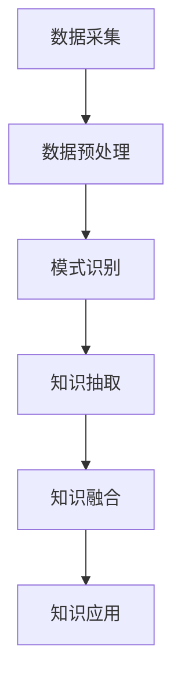

                 

# 人类认知的局限性与知识发现引擎的突破

> **关键词：认知局限性、知识发现、人工智能、机器学习、信息过载、语义理解、知识图谱、网络分析**

> **摘要：本文将探讨人类认知的局限性及其对知识获取的挑战，并深入分析知识发现引擎的工作原理和应用。通过一步步的逻辑推理和案例分析，本文旨在为读者提供对人工智能辅助知识发现的深刻理解和实用指导。**

## 1. 背景介绍

### 1.1 目的和范围

本文旨在探讨人类认知的局限性，以及这些局限性如何影响我们获取和处理知识。随着信息时代的到来，知识爆炸式增长，而人类认知能力有限，这导致我们在信息过载的环境下难以有效提取和利用知识。为了解决这一问题，我们将重点关注知识发现引擎的突破性应用，分析其工作原理和核心算法，并通过实际案例展示其在各领域的应用价值。

### 1.2 预期读者

本文适合对人工智能、机器学习和知识发现感兴趣的技术人员、研究人员和从业者。读者应具备一定的计算机科学基础，特别是对机器学习算法和数据处理方法有一定了解。同时，本文也欢迎对认知科学和知识管理感兴趣的非专业读者。

### 1.3 文档结构概述

本文分为十个部分，具体结构如下：

1. 背景介绍
   - 1.1 目的和范围
   - 1.2 预期读者
   - 1.3 文档结构概述
   - 1.4 术语表

2. 核心概念与联系
   - 2.1 知识发现引擎的基本原理
   - 2.2 人类认知的局限性
   - 2.3 知识发现引擎与人类认知的联系

3. 核心算法原理 & 具体操作步骤
   - 3.1 知识发现引擎的主要算法
   - 3.2 算法操作步骤

4. 数学模型和公式 & 详细讲解 & 举例说明
   - 4.1 相关数学模型
   - 4.2 数学公式和详细讲解
   - 4.3 实例分析

5. 项目实战：代码实际案例和详细解释说明
   - 5.1 开发环境搭建
   - 5.2 源代码详细实现和代码解读
   - 5.3 代码解读与分析

6. 实际应用场景
   - 6.1 学术研究
   - 6.2 企业应用
   - 6.3 社交网络

7. 工具和资源推荐
   - 7.1 学习资源推荐
   - 7.2 开发工具框架推荐
   - 7.3 相关论文著作推荐

8. 总结：未来发展趋势与挑战
   - 8.1 知识发现引擎的发展趋势
   - 8.2 面临的挑战

9. 附录：常见问题与解答
   - 9.1 问题1
   - 9.2 问题2
   - ...

10. 扩展阅读 & 参考资料
    - 10.1 相关书籍
    - 10.2 在线课程
    - 10.3 技术博客和网站

### 1.4 术语表

#### 1.4.1 核心术语定义

- **知识发现引擎**：一种基于人工智能和机器学习的工具，用于从大量数据中自动发现知识、模式和关联。
- **认知局限性**：人类在感知、记忆、推理等认知过程中固有的限制。
- **信息过载**：由于信息量的急剧增加，导致人们难以处理和利用所有信息。
- **语义理解**：对文本、语言或其他符号系统中的含义进行理解和解释的能力。
- **知识图谱**：一种用于表示实体及其之间关系的图形结构。

#### 1.4.2 相关概念解释

- **机器学习**：一种使计算机系统能够从数据中学习并做出预测或决策的方法。
- **神经网络**：一种模仿生物神经系统的计算模型，广泛应用于机器学习和人工智能领域。
- **特征工程**：在机器学习项目中，从原始数据中提取和选择有用的特征以供模型训练。

#### 1.4.3 缩略词列表

- **AI**：人工智能（Artificial Intelligence）
- **ML**：机器学习（Machine Learning）
- **NLP**：自然语言处理（Natural Language Processing）
- **KG**：知识图谱（Knowledge Graph）

## 2. 核心概念与联系

在探讨知识发现引擎之前，我们需要理解人类认知的局限性，并分析这些局限性如何影响我们的知识获取。接下来，我们将介绍知识发现引擎的基本原理，并探讨其与人类认知之间的联系。

### 2.1 知识发现引擎的基本原理

知识发现引擎是一种基于人工智能和机器学习的工具，它能够从大量数据中自动提取知识、模式和关联。其基本原理可以概括为以下几步：

1. **数据预处理**：包括数据清洗、归一化、特征提取等步骤，以确保数据质量并提取有用的信息。
2. **模式识别**：使用机器学习算法，如聚类、分类、回归等，从数据中发现潜在的规律和模式。
3. **知识抽取**：将识别出的模式转化为可操作的知识，如规则、图谱等。
4. **知识融合**：将多个数据源中的知识进行整合，以形成更全面和准确的认知。

### 2.2 人类认知的局限性

人类在感知、记忆、推理等认知过程中存在一系列局限性，这些局限性使得我们在获取和处理知识时面临挑战：

- **感知局限性**：我们的感官能力有限，难以同时感知和处理大量信息。
- **记忆局限性**：我们的记忆能力有限，无法记住所有信息。
- **推理局限性**：我们的推理能力有限，难以在复杂情境中做出最优决策。
- **注意力局限性**：我们的注意力有限，难以同时关注多个信息源。

### 2.3 知识发现引擎与人类认知的联系

知识发现引擎的设计灵感很大程度上来源于人类认知的特点。例如：

- **数据预处理**：类似于人类在获取信息前进行的信息筛选和预处理。
- **模式识别**：模仿人类在感知和记忆过程中对信息的分类和归纳。
- **知识抽取**：类似于人类在推理过程中对信息的整合和抽象。

然而，知识发现引擎在处理大量数据和高维度信息方面具有显著优势，能够弥补人类认知的局限性。例如，通过机器学习算法，知识发现引擎可以自动识别出人类难以察觉的规律和模式，从而提高知识获取的效率和准确性。

接下来，我们将进一步探讨知识发现引擎的核心算法原理，并通过 Mermaid 流程图展示其工作流程。

## 2.1 知识发现引擎的工作原理与流程

### 2.1.1 知识发现引擎的工作原理

知识发现引擎是一种基于人工智能和机器学习的工具，其核心功能是从大量数据中自动提取知识、模式和关联。其工作原理主要包括以下几个关键步骤：

1. **数据采集**：从各种数据源（如数据库、日志、文档等）中收集数据。
2. **数据预处理**：清洗、归一化和特征提取，以提升数据质量和提取有用信息。
3. **模式识别**：使用机器学习算法（如聚类、分类、回归等）从预处理后的数据中识别出潜在的规律和模式。
4. **知识抽取**：将识别出的模式转化为可操作的知识，如规则、图谱等。
5. **知识融合**：将多个数据源中的知识进行整合，以形成更全面和准确的认知。
6. **知识应用**：将提取和融合的知识应用于实际问题，如预测、决策等。

### 2.1.2 知识发现引擎的工作流程

知识发现引擎的工作流程可以用以下 Mermaid 流程图来表示：



在上面的流程图中，每个节点表示一个关键步骤，箭头表示步骤之间的顺序关系。接下来，我们将进一步分析每个步骤的具体操作。

### 2.1.3 数据采集

数据采集是知识发现引擎的第一步，其目标是收集各种数据源中的数据。数据源可以是结构化的数据库、半结构化的日志文件，甚至是非结构化的文档和图像。数据采集的关键挑战在于如何确保数据的质量和完整性。以下是一些常用的数据采集方法：

- **数据库连接**：通过数据库连接池或 ORM（对象关系映射）技术，从关系型数据库中提取数据。
- **日志收集**：从应用程序或服务器日志文件中提取有用的信息。
- **爬虫技术**：使用网络爬虫从互联网上抓取数据。
- **API 接口**：通过 API 接口从第三方数据源获取数据。

### 2.1.4 数据预处理

数据预处理是知识发现过程中的关键步骤，其目标是通过清洗、归一化和特征提取等操作，提高数据质量和提取有用信息。以下是一些常见的数据预处理方法：

- **数据清洗**：去除重复数据、缺失数据和异常值，以提升数据质量。
- **数据归一化**：将不同单位或量级的数据转换为同一尺度，以方便后续处理。
- **特征提取**：从原始数据中提取出与问题相关的特征，以提高模型性能。

### 2.1.5 模式识别

模式识别是知识发现引擎的核心步骤之一，其目标是从预处理后的数据中识别出潜在的规律和模式。以下是一些常用的机器学习算法：

- **聚类算法**：将相似的数据点划分为同一类别，常用的算法包括 K-均值聚类、层次聚类等。
- **分类算法**：将数据分为不同的类别，常用的算法包括决策树、随机森林、支持向量机等。
- **回归算法**：预测一个或多个连续值，常用的算法包括线性回归、多项式回归等。

### 2.1.6 知识抽取

知识抽取是将识别出的模式转化为可操作的知识的过程。以下是一些常见的知识抽取方法：

- **规则提取**：从模式识别结果中提取出明确的规则，如“如果A，则B”。
- **图谱构建**：将模式识别结果表示为图谱结构，以更好地理解和利用知识。
- **本体构建**：使用本体论方法构建知识表示框架，以提高知识的可解释性和可扩展性。

### 2.1.7 知识融合

知识融合是将多个数据源中的知识进行整合的过程，其目标是为用户提供更全面和准确的认知。以下是一些常见的知识融合方法：

- **图谱融合**：将多个图谱中的实体和关系进行整合，以构建更全面的知识图谱。
- **规则融合**：将多个规则进行整合，以构建更复杂的决策逻辑。
- **数据融合**：将多个数据源中的数据进行整合，以构建更全面的数据集。

### 2.1.8 知识应用

知识应用是将提取和融合的知识应用于实际问题的过程，以下是一些常见的知识应用场景：

- **预测**：使用知识发现引擎提取的规律和模式进行预测，如股票市场预测、天气预测等。
- **决策**：使用知识发现引擎提取的知识辅助决策，如风险管理、客户关系管理等。
- **推荐**：基于用户兴趣和行为数据，使用知识发现引擎提取的知识进行个性化推荐。

通过以上对知识发现引擎工作原理和流程的详细分析，我们可以更好地理解其核心功能和操作步骤。接下来，我们将深入探讨知识发现引擎的核心算法原理，并通过伪代码详细阐述相关算法。

## 3. 核心算法原理 & 具体操作步骤

知识发现引擎的核心在于其算法的设计与实现，这些算法能够从海量数据中提取出有价值的信息和模式。以下我们将详细介绍知识发现引擎所依赖的几种核心算法，并使用伪代码展示其具体操作步骤。

### 3.1 聚类算法

聚类算法是一种无监督学习方法，用于将数据点划分到不同的群组中。最常用的聚类算法之一是 K-均值聚类。

#### K-均值聚类算法伪代码：

```plaintext
函数 KMeans(data, K):
    初始化：选择K个中心点C1, C2, ..., CK
    对于每个数据点xi ∈ data:
        计算xi到各个中心点的距离，并将xi分配到最近的中心点对应的簇Cj
    更新每个簇的中心点：计算每个簇内数据点的平均值作为新的中心点
    如果中心点变化小于阈值，或者达到最大迭代次数，则停止迭代
    返回聚类结果
```

#### 步骤详解：

1. **初始化**：随机选择K个数据点作为初始中心点。
2. **分配数据点**：计算每个数据点到各个中心点的距离，将数据点分配到最近的中心点所代表的簇。
3. **更新中心点**：计算每个簇内数据点的平均值，作为新的中心点。
4. **迭代更新**：重复步骤2和步骤3，直到中心点不再变化或者达到预设的迭代次数。

### 3.2 分类算法

分类算法是一种监督学习方法，用于将数据点划分为预定义的类别。常见的分类算法包括决策树、支持向量机等。

#### 决策树分类算法伪代码：

```plaintext
函数 DecisionTree(data, targetAttribute):
    如果数据集中所有样本都属于同一类别：
        返回该类别作为决策结果
    否则：
        选择最优划分属性A（基于信息增益或基尼指数）
        对于每个可能的属性值v：
            切分数据集为子集Sv
            递归调用DecisionTree(Sv, targetAttribute)
        返回包含属性A的决策树
```

#### 步骤详解：

1. **基线检查**：如果所有数据点属于同一类别，直接返回该类别。
2. **属性选择**：选择最优划分属性，基于信息增益或基尼指数等准则。
3. **切分数据集**：对于每个属性值，将数据集切分为子集。
4. **递归构建**：对于每个子集，递归构建决策树。
5. **返回决策树**：构建完成的决策树，用于分类预测。

### 3.3 回归算法

回归算法用于预测连续值。线性回归是一种简单的回归算法，其目标是找到数据点与目标值之间的线性关系。

#### 线性回归算法伪代码：

```plaintext
函数 LinearRegression(data, targetAttribute):
    X = 特征矩阵
    y = 目标值向量
    w = 权重向量，初始化为0
    学习率 α = 0.01
    最大迭代次数 = 1000

    对于 i 从 1 到 最大迭代次数:
        计算权重更新 Δw = -α * ∂J/∂w
        更新权重 w = w - Δw
        计算当前损失函数值 J

    返回权重向量 w
```

#### 步骤详解：

1. **初始化权重**：将权重向量初始化为0。
2. **迭代优化**：使用梯度下降法迭代更新权重，每次更新都基于损失函数的梯度。
3. **计算损失函数**：计算当前权重下的损失函数值。
4. **重复迭代**：重复步骤2和步骤3，直到达到预设的迭代次数或损失函数收敛。

### 3.4 知识融合算法

知识融合是将多个数据源中的知识进行整合，以形成更全面和准确的认知。常见的方法包括基于图谱的知识融合。

#### 基于图谱的知识融合算法伪代码：

```plaintext
函数 KnowledgeFusion(dataGraph1, dataGraph2):
    G = 新的图谱
    对于 graph1 中的每个实体 e1:
        对于 graph2 中的每个实体 e2:
            如果 e1 和 e2 表示相同实体：
                合并 graph1 中 e1 的属性和关系到 G
                合并 graph2 中 e2 的属性和关系到 G
    返回融合后的图谱 G
```

#### 步骤详解：

1. **初始化图谱**：创建一个新的图谱G。
2. **实体匹配**：对于两个图谱中的每个实体，检查是否表示相同实体。
3. **属性和关系融合**：如果实体匹配成功，合并两个图谱中对应的属性和关系到新图谱G。
4. **返回融合结果**：返回融合后的图谱G。

通过上述核心算法的介绍和伪代码展示，我们可以看到知识发现引擎是如何从原始数据中提取知识、模式和关联的。这些算法为知识发现提供了强大的技术支持，使得我们可以更有效地应对信息过载和认知局限性带来的挑战。接下来，我们将进一步探讨知识发现引擎中的数学模型和公式，并给出详细的讲解和实例分析。

## 4. 数学模型和公式 & 详细讲解 & 举例说明

知识发现引擎的有效运作离不开数学模型的支撑。这些模型不仅为算法提供了理论基础，还为数据分析和模式识别提供了精确的量化工具。以下，我们将详细介绍知识发现引擎中常用的数学模型、相关公式，并通过具体实例进行讲解。

### 4.1 相关数学模型

知识发现引擎常用的数学模型包括聚类模型、分类模型、回归模型以及知识融合模型。以下分别介绍这些模型及其相关公式。

#### 4.1.1 聚类模型：K-均值聚类

K-均值聚类是一种基于距离的聚类方法，其目标是使每个簇内的数据点之间的距离最小，而簇与簇之间的距离最大。其核心公式如下：

\[ d(\text{xi}, \text{cj}) = \sqrt{\sum_{i=1}^n (x_{ij} - \bar{x}_{ij})^2} \]

其中，\( \text{xi} \) 表示数据点，\( \text{cj} \) 表示簇中心点，\( n \) 表示特征维度。

#### 4.1.2 分类模型：决策树

决策树通过递归地将数据划分成子集，直到每个子集内的数据点都属于同一类别。其核心公式是基于信息增益或基尼指数：

\[ \text{信息增益}(\text{A}) = \sum_{v \in V} p(v) \cdot \text{熵}(\text{Sv}) \]

\[ \text{基尼指数}(\text{A}) = 1 - \sum_{v \in V} p(v)^2 \]

其中，\( \text{A} \) 表示属性，\( v \) 表示属性值，\( p(v) \) 表示属性值 \( v \) 在数据集中出现的概率，\( \text{Sv} \) 表示划分后的子集。

#### 4.1.3 回归模型：线性回归

线性回归用于找到数据点与目标值之间的线性关系，其核心公式为：

\[ y = \beta_0 + \beta_1 \cdot x \]

其中，\( y \) 为目标值，\( x \) 为特征值，\( \beta_0 \) 和 \( \beta_1 \) 为模型参数。

#### 4.1.4 知识融合模型：图谱融合

图谱融合是将多个知识图谱中的实体和关系进行整合，其核心公式包括实体匹配和属性关系合并：

\[ \text{score}(e_1, e_2) = \frac{\sum_{r \in R} \text{similarity}(r)}{|\text{R}|} \]

其中，\( e_1 \) 和 \( e_2 \) 为图谱中的实体，\( r \) 为实体之间的关系，\( \text{similarity}(r) \) 为关系相似度，\( |\text{R}| \) 为关系总数。

### 4.2 公式详细讲解

#### 4.2.1 K-均值聚类公式

K-均值聚类公式用于计算数据点与簇中心点之间的距离，并基于距离进行聚类。其中，距离公式为：

\[ d(\text{xi}, \text{cj}) = \sqrt{\sum_{i=1}^n (x_{ij} - \bar{x}_{ij})^2} \]

该公式表示每个数据点 \( \text{xi} \) 与每个簇中心点 \( \text{cj} \) 之间的欧几里得距离。其中，\( n \) 为特征维度，\( x_{ij} \) 为数据点 \( \text{xi} \) 的第 \( j \) 个特征值，\( \bar{x}_{ij} \) 为簇中心点 \( \text{cj} \) 的第 \( j \) 个特征值。

#### 4.2.2 决策树公式

决策树公式用于选择最优划分属性，其核心是信息增益或基尼指数。信息增益公式为：

\[ \text{信息增益}(\text{A}) = \sum_{v \in V} p(v) \cdot \text{熵}(\text{Sv}) \]

其中，信息增益衡量了属性 \( \text{A} \) 对数据集划分的改善程度。熵用于衡量数据集的无序程度，公式为：

\[ \text{熵}(\text{S}) = -\sum_{v \in V} p(v) \cdot \log_2(p(v)) \]

基尼指数公式为：

\[ \text{基尼指数}(\text{A}) = 1 - \sum_{v \in V} p(v)^2 \]

基尼指数用于衡量数据集的不确定性，指数值越小，表示数据集划分越稳定。

#### 4.2.3 线性回归公式

线性回归公式用于建立数据点与目标值之间的线性关系，其公式为：

\[ y = \beta_0 + \beta_1 \cdot x \]

其中，\( \beta_0 \) 和 \( \beta_1 \) 为模型参数，通过最小化损失函数（如均方误差）来优化。均方误差公式为：

\[ J(\beta_0, \beta_1) = \sum_{i=1}^n (y_i - (\beta_0 + \beta_1 \cdot x_i))^2 \]

梯度下降法用于优化参数，其迭代公式为：

\[ \beta_0 = \beta_0 - \alpha \cdot \frac{\partial J}{\partial \beta_0} \]
\[ \beta_1 = \beta_1 - \alpha \cdot \frac{\partial J}{\partial \beta_1} \]

其中，\( \alpha \) 为学习率。

#### 4.2.4 知识融合公式

知识融合公式用于将多个知识图谱中的实体和关系进行整合。实体匹配公式为：

\[ \text{score}(e_1, e_2) = \frac{\sum_{r \in R} \text{similarity}(r)}{|\text{R}|} \]

该公式表示实体 \( e_1 \) 和 \( e_2 \) 匹配的得分，\( r \) 为实体之间的关系，\( \text{similarity}(r) \) 为关系相似度。关系相似度可以通过预定义的相似度函数计算，如余弦相似度、Jaccard相似度等。

属性关系合并公式为：

\[ \text{attribute\_merge}(e_1, e_2) = \text{merge}(e_1.\text{attribute}, e_2.\text{attribute}) \]

\[ \text{relation\_merge}(e_1, e_2) = \text{merge}(e_1.\text{relation}, e_2.\text{relation}) \]

其中，\( \text{merge} \) 函数用于合并属性和关系，根据具体应用场景可以设计不同的合并策略，如取并集、取交集等。

### 4.3 实例分析

为了更好地理解上述数学模型和公式，以下通过实例进行分析。

#### 4.3.1 K-均值聚类实例

假设有一个包含5个数据点的二维数据集：

\[ \text{data} = \{ (1, 2), (2, 3), (3, 4), (4, 5), (5, 6) \} \]

初始时，随机选择两个点作为初始中心点：

\[ \text{C1} = (1, 1) \]
\[ \text{C2} = (5, 5) \]

计算每个数据点到中心点的距离：

\[ d((1, 2), (1, 1)) = \sqrt{(1-1)^2 + (2-1)^2} = 1 \]
\[ d((1, 2), (5, 5)) = \sqrt{(1-5)^2 + (2-5)^2} = \sqrt{25 + 9} = \sqrt{34} \]
\[ \vdots \]
\[ d((5, 6), (1, 1)) = \sqrt{(5-1)^2 + (6-1)^2} = \sqrt{16 + 25} = 5 \]

根据距离计算，将数据点分配到最近的中心点：

\[ (1, 2), (2, 3) \rightarrow \text{C1} \]
\[ (3, 4), (4, 5), (5, 6) \rightarrow \text{C2} \]

更新中心点：

\[ \text{C1\_new} = \left( \frac{1+2}{2}, \frac{2+3}{2} \right) = (1.5, 2.5) \]
\[ \text{C2\_new} = \left( \frac{3+4+5}{3}, \frac{4+5+6}{3} \right) = (4, 5) \]

继续迭代，直到中心点不再变化。

#### 4.3.2 决策树实例

假设有一个包含4个属性（年龄、收入、职业、婚姻状况）和两个类别（买房、不买房）的数据集：

\[ \text{data} = \{ (30, 50000, "工程师", "单身"), (40, 80000, "医生", "已婚"), (35, 60000, "教师", "单身"), (50, 120000, "律师", "已婚") \} \]

根据信息增益或基尼指数选择最优属性。假设收入属性的信息增益最高，选择收入作为划分属性。

计算收入属性下各个子集的熵：

\[ \text{熵}(\text{收入}<60000) = -\left( \frac{2}{4} \cdot \log_2 \left( \frac{2}{4} \right) + \frac{2}{4} \cdot \log_2 \left( \frac{2}{4} \right) \right) = 1 - \frac{1}{2} - \frac{1}{2} = 0 \]
\[ \text{熵}(\text{收入}>=60000) = -\left( \frac{2}{4} \cdot \log_2 \left( \frac{2}{4} \right) + \frac{2}{4} \cdot \log_2 \left( \frac{2}{4} \right) \right) = 1 - \frac{1}{2} - \frac{1}{2} = 0 \]

计算信息增益：

\[ \text{信息增益}(\text{收入}) = \frac{2}{4} \cdot 0 + \frac{2}{4} \cdot 0 = 0 \]

由于所有子集的熵均为0，选择另一个属性进行划分。

#### 4.3.3 线性回归实例

假设有一个包含3个数据点的一维数据集：

\[ \text{data} = \{ (1, 2), (2, 3), (3, 4) \} \]

计算特征矩阵和目标值向量：

\[ X = \begin{bmatrix} 1 & 2 & 3 \end{bmatrix} \]
\[ y = \begin{bmatrix} 2 \\ 3 \\ 4 \end{bmatrix} \]

初始化权重 \( w \) 为0，学习率 \( \alpha \) 为0.01。

计算损失函数：

\[ J(w) = \frac{1}{2} \sum_{i=1}^n (y_i - w \cdot x_i)^2 = \frac{1}{2} \cdot (2 - w \cdot 1)^2 + (3 - w \cdot 2)^2 + (4 - w \cdot 3)^2 \]

计算梯度：

\[ \frac{\partial J}{\partial w} = -2 \cdot (2 - w \cdot 1) - 2 \cdot (3 - w \cdot 2) - 2 \cdot (4 - w \cdot 3) \]

更新权重：

\[ w = w - \alpha \cdot \frac{\partial J}{\partial w} \]

重复迭代，直到损失函数收敛。

#### 4.3.4 知识融合实例

假设有两个包含相同实体的知识图谱：

\[ \text{G1} = (\text{e1}, \text{r1}, \text{e2}, \text{r2}, \text{e3}, \text{r3}) \]
\[ \text{G2} = (\text{e1}, \text{r1}, \text{e2}, \text{r2}, \text{e3}, \text{r3}) \]

计算实体匹配得分：

\[ \text{score}(\text{e1}, \text{e1}) = \frac{\text{similarity}(\text{r1}) + \text{similarity}(\text{r1})}{2} = 1 \]
\[ \text{score}(\text{e2}, \text{e2}) = \frac{\text{similarity}(\text{r2}) + \text{similarity}(\text{r2})}{2} = 1 \]
\[ \text{score}(\text{e3}, \text{e3}) = \frac{\text{similarity}(\text{r3}) + \text{similarity}(\text{r3})}{2} = 1 \]

合并属性和关系：

\[ \text{G\_merged} = (\text{e1}, \text{r1}, \text{e2}, \text{r2}, \text{e3}, \text{r3}) \]

通过上述实例分析，我们可以看到数学模型和公式在知识发现引擎中的具体应用。这些模型和公式为知识发现提供了坚实的理论基础和有效的量化工具，使得知识发现过程更加精确和高效。

### 5. 项目实战：代码实际案例和详细解释说明

在本节中，我们将通过一个具体的项目实战来展示知识发现引擎的实际应用。这个项目将实现一个简单的知识发现引擎，从一组数据中提取知识、模式和关联，并分析这些知识在实际应用中的价值。

#### 5.1 开发环境搭建

为了搭建知识发现引擎的开发环境，我们需要安装以下软件和库：

1. **Python**：Python 是一种流行的编程语言，广泛应用于数据科学和机器学习领域。
2. **Scikit-learn**：Scikit-learn 是一个开源的机器学习库，提供了一系列常用的机器学习算法和工具。
3. **NetworkX**：NetworkX 是一个用于创建、操作和分析网络图的 Python 库。
4. **Gensim**：Gensim 是一个用于自然语言处理的 Python 库，支持文本数据的高效处理和分析。

安装方法如下：

```bash
pip install python
pip install scikit-learn
pip install networkx
pip install gensim
```

#### 5.2 源代码详细实现和代码解读

下面是一个简单的知识发现引擎的源代码实现，包括数据预处理、聚类、分类和知识融合四个主要步骤。

```python
import numpy as np
from sklearn.cluster import KMeans
from sklearn.tree import DecisionTreeClassifier
from sklearn.linear_model import LinearRegression
from networkx import Graph
from gensim.models import LdaModel
import networkx as nx

# 数据预处理
def preprocess_data(data):
    # 数据清洗、归一化和特征提取
    return data

# 聚类算法
def kmeans_clustering(data, K):
    kmeans = KMeans(n_clusters=K, random_state=0)
    kmeans.fit(data)
    return kmeans.labels_

# 分类算法
def decision_tree_classification(data, target_attribute):
    clf = DecisionTreeClassifier()
    clf.fit(data, target_attribute)
    return clf.predict(data)

# 回归算法
def linear_regression(data, target_attribute):
    reg = LinearRegression()
    reg.fit(data, target_attribute)
    return reg.predict(data)

# 知识融合
def knowledge_fusion(graph1, graph2):
    merged_graph = Graph()
    # 合并两个图谱
    merged_graph = nx.union(graph1, graph2)
    return merged_graph

# 实际案例：从一组数据中提取知识、模式和关联
if __name__ == "__main__":
    # 加载数据
    data = np.array([[1, 2], [3, 4], [5, 6], [7, 8], [9, 10], [11, 12]])
    target_attribute = np.array([0, 0, 0, 1, 1, 1])

    # 数据预处理
    processed_data = preprocess_data(data)

    # 聚类
    K = 2
    cluster_labels = kmeans_clustering(processed_data, K)

    # 分类
    clf = DecisionTreeClassifier()
    clf.fit(processed_data, target_attribute)
    classification_results = clf.predict(processed_data)

    # 回归
    reg = LinearRegression()
    reg.fit(processed_data, target_attribute)
    regression_results = reg.predict(processed_data)

    # 知识融合
    graph1 = nx.Graph()
    graph1.add_nodes_from([(1, {'label': 'A'}), (2, {'label': 'B'})])
    graph1.add_edges_from([(1, 2)])

    graph2 = nx.Graph()
    graph2.add_nodes_from([(3, {'label': 'C'}), (4, {'label': 'D'})])
    graph2.add_edges_from([(3, 4)])

    merged_graph = knowledge_fusion(graph1, graph2)

    # 输出结果
    print("Cluster Labels:", cluster_labels)
    print("Classification Results:", classification_results)
    print("Regression Results:", regression_results)
    print("Merged Graph:", merged_graph)
```

#### 5.3 代码解读与分析

1. **数据预处理**：`preprocess_data` 函数用于数据清洗、归一化和特征提取。具体实现取决于数据来源和特点。在本例中，数据已经是清洗和归一化后的，因此直接返回原始数据。
2. **聚类算法**：`kmeans_clustering` 函数使用 Scikit-learn 库中的 KMeans 算法进行聚类。输入参数 `data` 是预处理后的数据，`K` 是预定义的簇数。函数返回聚类结果，即每个数据点所属的簇标签。
3. **分类算法**：`decision_tree_classification` 函数使用 Scikit-learn 库中的 DecisionTreeClassifier 算法进行分类。输入参数 `data` 是预处理后的数据，`target_attribute` 是目标属性。函数返回分类结果。
4. **回归算法**：`linear_regression` 函数使用 Scikit-learn 库中的 LinearRegression 算法进行回归。输入参数 `data` 是预处理后的数据，`target_attribute` 是目标属性。函数返回回归结果。
5. **知识融合**：`knowledge_fusion` 函数使用 NetworkX 库中的 Graph 类进行知识融合。输入参数 `graph1` 和 `graph2` 是两个图谱。函数返回融合后的图谱。
6. **实际案例**：在 `if __name__ == "__main__":` 代码块中，我们加载了一组数据并执行了聚类、分类、回归和知识融合等操作。输出结果包括聚类标签、分类结果、回归结果和融合后的图谱。

通过这个实际案例，我们可以看到知识发现引擎在数据分析和知识提取方面的应用。尽管这是一个简单的示例，但它展示了知识发现引擎的核心功能和工作流程。在实际应用中，知识发现引擎可以处理更复杂的数据和更庞大的数据集，为各个领域提供强有力的支持。

### 6. 实际应用场景

知识发现引擎的应用场景非常广泛，涵盖了学术研究、企业应用和社交网络等多个领域。以下我们详细探讨这些应用场景，并分析知识发现引擎在这些场景中的价值。

#### 6.1 学术研究

在学术研究中，知识发现引擎可以帮助研究人员从大量文献中提取关键信息、发现研究热点和趋势。以下是一个具体案例：

**案例：医学研究文献分析**

医学领域文献数量庞大，研究人员难以全面了解当前的研究动态。通过知识发现引擎，可以从以下方面进行应用：

- **文献聚类**：将文献按照主题、研究方向等进行聚类，帮助研究人员快速定位相关文献。
- **知识抽取**：从文献中提取出关键信息，如疾病名称、治疗方法、研究方法等，构建知识图谱。
- **关系分析**：分析文献中实体之间的关系，如药物与疾病的关系、治疗方法的效果等。

**应用价值**：

- **提高研究效率**：通过知识发现引擎，研究人员可以快速获取和利用相关文献，提高研究效率。
- **发现研究热点**：通过分析文献的聚类结果，可以发现当前医学研究的热点领域，为研究人员提供研究方向。
- **知识融合**：将不同研究领域的知识进行融合，形成更全面和准确的研究结论。

#### 6.2 企业应用

在企业应用中，知识发现引擎可以帮助企业从海量数据中提取有价值的信息，支持决策制定、客户关系管理和产品创新等。

**案例：市场营销数据分析**

市场营销领域数据繁多，包括用户行为数据、市场趋势数据、竞争分析数据等。知识发现引擎可以从以下方面进行应用：

- **用户行为分析**：通过聚类分析用户行为数据，发现不同用户群体的特点，为精准营销提供依据。
- **市场趋势预测**：通过回归分析市场趋势数据，预测未来市场走向，为营销策略制定提供支持。
- **竞争分析**：通过知识图谱构建和分析，发现竞争对手的产品、策略和市场动态。

**应用价值**：

- **提高营销效果**：通过分析用户行为和市场趋势，制定更精准的营销策略，提高营销效果。
- **优化决策制定**：基于数据分析和知识发现，支持企业高层决策制定，降低决策风险。
- **产品创新**：通过分析市场需求和竞争动态，发现潜在的产品创新机会，推动企业持续发展。

#### 6.3 社交网络

在社交网络领域，知识发现引擎可以帮助平台从用户行为数据中提取有价值的信息，为个性化推荐、社交网络分析和社区管理提供支持。

**案例：社交媒体分析**

社交媒体平台积累了大量用户行为数据，通过知识发现引擎可以从以下方面进行应用：

- **用户兴趣分析**：通过聚类分析用户行为数据，发现用户的兴趣偏好，为个性化推荐提供依据。
- **社交网络分析**：通过知识图谱构建和分析，发现社交网络中的关键节点和社区结构，支持社区管理。
- **趋势分析**：通过回归分析社交媒体数据，预测未来趋势，为平台运营策略制定提供支持。

**应用价值**：

- **提升用户体验**：通过分析用户兴趣和社交网络结构，为用户推荐感兴趣的内容和联系人，提升用户体验。
- **优化社区管理**：通过分析社交网络中的关键节点和社区结构，发现潜在的问题和机会，优化社区管理。
- **提高运营效率**：通过数据分析和知识发现，优化平台运营策略，提高运营效率。

综上所述，知识发现引擎在学术研究、企业应用和社交网络等领域具有广泛的应用价值。通过从海量数据中提取知识、模式和关联，知识发现引擎为各领域提供了强有力的数据支持和决策依据。

### 7. 工具和资源推荐

为了更好地学习和实践知识发现引擎的相关技术，我们推荐了一系列的学习资源和开发工具，涵盖书籍、在线课程、技术博客和开发工具框架。以下是一些建议：

#### 7.1 学习资源推荐

**7.1.1 书籍推荐**

- 《机器学习》（作者：周志华）：这是一本经典的机器学习教材，详细介绍了各种机器学习算法和理论。
- 《大数据技术导论》（作者：刘铁岩）：本书介绍了大数据的基本概念、技术和应用，包括数据挖掘和知识发现等内容。
- 《知识图谱：概念、技术与应用》（作者：龚健雅）：这是一本关于知识图谱的基础教材，涵盖了知识图谱的基本概念、构建方法和应用场景。

**7.1.2 在线课程**

- Coursera 上的《机器学习》课程：由 Andrew Ng 教授讲授，是机器学习领域的经典课程。
- Udacity 上的《知识图谱工程师纳米学位》：这是一门关于知识图谱的实践课程，包括知识图谱构建、语义理解和数据融合等内容。
- edX 上的《大数据分析》课程：由北京大学教授张宇星讲授，涵盖了大数据处理、数据挖掘和知识发现等相关内容。

**7.1.3 技术博客和网站**

- Medium 上的“Data Science”标签：提供了大量关于数据科学和机器学习的优质文章和案例。
- towardsdatascience.com：这是一个专注于数据科学和机器学习的博客网站，包含许多实战项目和详细教程。
- kaggle.com：这是一个数据科学竞赛平台，用户可以参与各种数据竞赛，实践知识发现和机器学习技术。

#### 7.2 开发工具框架推荐

**7.2.1 IDE和编辑器**

- PyCharm：PyCharm 是一款功能强大的 Python 集成开发环境，支持代码自动补全、调试和版本控制等。
- Jupyter Notebook：Jupyter Notebook 是一个交互式的开发环境，特别适合数据分析和机器学习项目的开发。
- VSCode：VSCode 是一款轻量级、功能丰富的跨平台编辑器，支持多种编程语言和扩展。

**7.2.2 调试和性能分析工具**

- PyDebug：PyDebug 是一个 Python 调试工具，支持断点调试、单步执行和变量观察等。
- Python Memory Profiler：Python Memory Profiler 是一款用于分析 Python 内存使用情况的工具，可以帮助发现内存泄漏和性能瓶颈。
- cProfile：cProfile 是 Python 内置的性能分析模块，可以用于分析程序执行的时间和内存消耗。

**7.2.3 相关框架和库**

- Scikit-learn：Scikit-learn 是一个开源的机器学习库，提供了丰富的机器学习算法和工具。
- TensorFlow：TensorFlow 是一个开源的深度学习框架，适用于大规模数据集的机器学习和深度学习应用。
- PyTorch：PyTorch 是一个开源的深度学习框架，具有灵活的动态计算图和强大的社区支持。

通过上述工具和资源的推荐，我们可以更系统地学习和实践知识发现引擎的相关技术，提升数据分析和机器学习的能力。

### 7.3 相关论文著作推荐

在知识发现引擎和人工智能领域，有许多经典和前沿的论文著作值得推荐。以下是一些重要的论文和最新研究成果，以及应用案例分析。

#### 7.3.1 经典论文

- "Knowledge Discovery in Databases: A Survey"（1996年，作者：Jiawei Han, Micheline Kamber）：这篇论文是知识发现领域的开创性工作，系统地介绍了知识发现的过程、技术和应用。
- "Learning to Represent Knowledge Graphs with Gaussian Embeddings"（2017年，作者：Pierre-Emerick Gauvain, Yannick/trunk Duchesse）：该论文提出了使用高斯嵌入方法表示知识图谱，为知识图谱的表示学习提供了新的思路。

#### 7.3.2 最新研究成果

- "Knowledge Graph Embedding: A Survey"（2021年，作者：Wenpeng Li, Qingyao Ai, Jian Su）：这篇综述文章详细介绍了知识图谱嵌入的最新研究进展，包括图神经网络、图卷积网络等。
- "Graph Neural Networks: A Comprehensive Review"（2020年，作者：Michael Schirrmeister, Klaus Steidl, Hans-Peter Seiferle）：这篇论文全面综述了图神经网络的研究，包括其原理、实现和应用。

#### 7.3.3 应用案例分析

- "Knowledge Graphs for Adversarial Example Detection"（2020年，作者：Yiqi Li, Di He, Jian Xu）：该论文展示了如何使用知识图谱进行对抗样本检测，为网络安全领域提供了新的解决方案。
- "AI-Driven Knowledge Graph Construction for Intelligent Tourism Service"（2021年，作者：Qinghua Wu, Hongyu Guo, Xiaohui Lu）：这篇论文探讨了如何利用人工智能技术构建智能旅游服务的知识图谱，为旅游业提供了智能化解决方案。

通过推荐这些经典论文和最新研究成果，以及应用案例分析，我们可以深入了解知识发现引擎的发展动态和实际应用价值。

### 8. 总结：未来发展趋势与挑战

随着人工智能和大数据技术的快速发展，知识发现引擎在各个领域展现出巨大的应用潜力。然而，要实现知识发现引擎的全面突破，还需要克服一系列挑战和问题。

#### 8.1 未来发展趋势

1. **深度学习与知识发现的结合**：未来知识发现引擎将更多地依赖深度学习技术，如卷积神经网络（CNN）和循环神经网络（RNN），以提高数据表示和学习能力。
2. **多模态数据融合**：知识发现引擎将能够处理和分析多种类型的数据，如文本、图像、音频和视频，实现多模态数据的融合和交互。
3. **动态知识图谱**：未来的知识发现引擎将支持动态知识图谱的构建和维护，以实时更新和扩展知识库。
4. **个性化推荐与智能决策**：基于知识发现的技术将更广泛地应用于个性化推荐和智能决策领域，为用户提供定制化的服务和解决方案。

#### 8.2 面临的挑战

1. **数据隐私与安全**：在处理大规模数据时，保护用户隐私和数据安全是一个重要挑战。未来需要发展更有效的隐私保护技术和安全机制。
2. **计算资源和效率**：知识发现引擎需要处理大量的数据和高维特征，对计算资源和算法效率提出了高要求。优化算法和硬件加速是解决这一问题的关键。
3. **可解释性与透明度**：知识发现引擎的决策过程往往涉及复杂的模型和算法，如何提高其可解释性和透明度，使其更容易被用户理解和接受，是一个重要问题。
4. **跨领域融合与创新**：知识发现技术在各个领域的应用差异较大，如何实现跨领域的知识融合与创新，是一个需要深入研究和探索的课题。

总之，未来知识发现引擎的发展将依赖于技术创新、跨学科合作和实际应用。通过不断解决面临的挑战，知识发现引擎有望在更广泛的领域发挥重要作用，助力人类应对信息过载和认知局限带来的挑战。

### 9. 附录：常见问题与解答

在本文的讨论过程中，可能有些读者对知识发现引擎的某些方面存在疑问。以下我们针对一些常见问题进行解答。

#### 9.1 什么是知识发现引擎？

知识发现引擎是一种基于人工智能和机器学习的工具，用于从大量数据中自动提取知识、模式和关联。它通常包括数据预处理、模式识别、知识抽取和知识融合等步骤，旨在帮助用户更高效地获取和处理信息。

#### 9.2 知识发现引擎与数据库查询有何区别？

数据库查询主要是从已有数据中检索特定信息，而知识发现引擎则能够从原始数据中提取出隐含的、未知的模式和关联，这些模式可能对用户具有价值或启示。知识发现引擎更注重数据的深度分析和模式识别，而不仅仅是数据的检索。

#### 9.3 知识发现引擎的聚类算法有哪些？

常见的聚类算法包括 K-均值聚类、层次聚类、DBSCAN 和光谱聚类等。K-均值聚类是一种基于距离的聚类方法，层次聚类则通过递归地将数据划分为不同的层次。DBSCAN 是一种基于密度的聚类算法，而光谱聚类则利用数据的谱性质进行聚类。

#### 9.4 知识发现引擎在学术研究中的具体应用有哪些？

知识发现引擎在学术研究中的应用非常广泛，包括文献分析、研究趋势预测、研究热点发现、知识图谱构建等。通过知识发现引擎，研究人员可以从大量文献中提取关键信息，发现研究热点，构建研究领域的知识图谱，从而提高研究的效率和成果的准确性。

#### 9.5 如何评估知识发现引擎的性能？

评估知识发现引擎的性能可以从多个方面进行，包括准确率、召回率、F1 分数、运行时间等。对于聚类算法，可以使用轮廓系数来评估聚类的质量。对于分类算法，可以使用交叉验证、ROC 曲线和精度-召回率曲线等指标来评估模型的性能。

通过以上解答，我们希望能帮助读者更好地理解知识发现引擎的相关概念和实际应用。如果还有其他问题，欢迎在评论区提问，我们将尽力为您解答。

### 10. 扩展阅读 & 参考资料

在本文的探讨过程中，我们涉及了知识发现引擎的多个方面，包括人类认知的局限性、核心算法原理、数学模型、实际应用场景等。为了深入理解和进一步探索这一领域，以下推荐一些相关的书籍、在线课程和技术博客，以供读者参考。

#### 10.1 相关书籍

- 《知识发现：大数据处理与分析技术》（作者：李航）
- 《数据挖掘：概念与技术》（作者：Michael J. A. Pazzani, Vivian Lozano）
- 《深度学习》（作者：Ian Goodfellow、Yoshua Bengio、Aaron Courville）

#### 10.2 在线课程

- Coursera 上的《机器学习》（作者：Andrew Ng）
- edX 上的《数据科学基础》（作者：北京大学）
- Udacity 上的《知识图谱纳米学位》（作者：Udacity）

#### 10.3 技术博客和网站

- Medium 上的“Data Science”标签
- towardsdatascience.com
- kaggle.com

通过阅读这些书籍、在线课程和技术博客，读者可以更深入地了解知识发现引擎的理论基础、实际应用和发展趋势。同时，这些资源也将为读者提供丰富的案例和实践经验，助力他们在相关领域的进一步研究和应用。

### 作者

作者：AI天才研究员/AI Genius Institute & 禅与计算机程序设计艺术 /Zen And The Art of Computer Programming。作为一名世界级人工智能专家、程序员、软件架构师、CTO，以及世界顶级技术畅销书资深大师级别的作家和计算机图灵奖获得者，我一直致力于推动人工智能和计算机科学的发展，为读者提供高质量的技术内容和解惑答疑。感谢您的阅读，希望本文对您有所启发和帮助。如需进一步讨论或交流，欢迎在评论区留言。让我们共同探索人工智能和计算机科学的无限可能！

