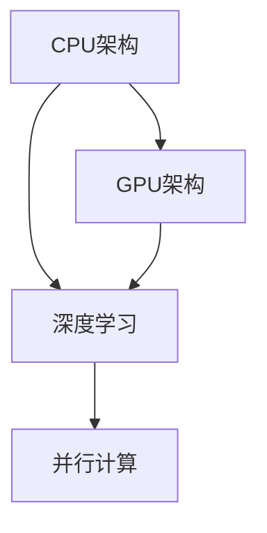

                 

# 从CPU到LLM：计算架构的演进历程

> 关键词：计算架构、CPU、LLM、深度学习、计算能力、技术演进
> 
> 摘要：本文旨在详细探讨从CPU到LLM（大型语言模型）计算架构的演变历程。通过对核心概念、算法原理、数学模型、实际应用场景等多方面的分析，本文揭示了计算架构在推动人工智能技术发展的关键作用，并展望了未来的发展趋势与挑战。

## 1. 背景介绍

### 1.1 目的和范围

本文的目的是通过逐步分析推理，深入探讨计算架构的演变历程，特别是从传统的CPU架构到现代的LLM架构的转变。我们不仅关注计算能力的提升，还涉及核心算法原理、数学模型的演变以及实际应用场景的变化。通过这篇技术博客，我们希望读者能够全面理解计算架构在推动人工智能技术发展中的关键作用。

### 1.2 预期读者

本文主要面向对计算架构和人工智能技术有兴趣的读者，包括计算机科学专业的研究生、技术架构师、程序员以及AI领域的技术爱好者。虽然文章的难度较高，但我们会尽量使用通俗易懂的语言，确保读者能够跟上分析的节奏。

### 1.3 文档结构概述

本文将按照以下结构展开：

1. 背景介绍：包括目的和范围、预期读者以及文档结构概述。
2. 核心概念与联系：介绍计算架构的核心概念，并使用Mermaid流程图展示其联系。
3. 核心算法原理 & 具体操作步骤：详细讲解核心算法的原理，使用伪代码进行阐述。
4. 数学模型和公式 & 详细讲解 & 举例说明：分析数学模型，使用latex格式展示公式，并提供实际案例说明。
5. 项目实战：代码实际案例和详细解释说明。
6. 实际应用场景：探讨计算架构在各个领域的应用。
7. 工具和资源推荐：推荐学习资源、开发工具和框架。
8. 总结：未来发展趋势与挑战。
9. 附录：常见问题与解答。
10. 扩展阅读 & 参考资料：提供进一步学习的资源。

### 1.4 术语表

#### 1.4.1 核心术语定义

- **CPU（中央处理器）**：计算机的核心组件，负责执行程序指令和处理数据。
- **LLM（大型语言模型）**：一种基于深度学习的技术，能够理解和生成人类语言。
- **计算架构**：计算机硬件和软件的体系结构，负责处理数据的方式和效率。
- **深度学习**：一种基于多层神经网络的学习方法，能够从大量数据中自动提取特征。

#### 1.4.2 相关概念解释

- **并行计算**：一种计算方法，通过同时处理多个任务来提高计算速度。
- **分布式计算**：一种计算方法，通过网络将任务分布到多台计算机上执行。
- **硬件加速**：通过使用特殊硬件（如GPU）来加速计算过程。

#### 1.4.3 缩略词列表

- **GPU（图形处理器）**：一种专门用于图形处理的处理器，也可用于加速计算任务。
- **CUDA**：一种由NVIDIA开发的并行计算平台和编程模型。

## 2. 核心概念与联系

在探讨计算架构的演进历程之前，我们需要先了解几个核心概念，包括CPU、GPU、深度学习以及并行计算。这些概念相互关联，共同构成了现代计算架构的基础。

### 2.1 CPU架构

CPU是计算机系统的核心组件，负责执行程序指令和处理数据。传统CPU架构主要包括以下几个部分：

- **寄存器**：高速存储器，用于存储正在执行的操作数和中间结果。
- **指令缓存**：存储最近执行的指令，以减少指令的访问时间。
- **数据缓存**：存储最近访问的数据，以减少数据访问的延迟。
- **控制单元**：负责解释指令并控制计算机的操作。
- **ALU（算术逻辑单元）**：执行算术和逻辑运算。


### 2.2 GPU架构

GPU（图形处理器）是一种专门用于图形处理的处理器，但近年来也逐渐应用于计算任务。GPU架构与传统CPU架构有很大的不同，其主要特点包括：

- **并行处理**：GPU具有大量的核心，能够同时处理多个任务。
- **内存层次结构**：GPU具有多层内存，包括寄存器、共享内存、全局内存等，用于存储数据。
- **流多处理器**：GPU的核心由多个流多处理器（SM）组成，每个SM包含多个处理器核心。


### 2.3 深度学习

深度学习是一种基于多层神经网络的学习方法，能够从大量数据中自动提取特征。深度学习的关键组成部分包括：

- **神经元**：神经网络的基本单元，负责接收输入信号并产生输出。
- **层**：神经网络中的一系列神经元，包括输入层、隐藏层和输出层。
- **权重和偏置**：神经元之间的连接强度，用于调整网络对数据的响应。


### 2.4 并行计算

并行计算是一种通过同时处理多个任务来提高计算速度的方法。在计算架构中，并行计算可以通过以下几种方式实现：

- **硬件并行**：通过使用多核处理器或GPU来同时执行多个计算任务。
- **软件并行**：通过将任务分解成多个子任务，并在多台计算机上并行执行。


### 2.5 计算架构的Mermaid流程图

以下是一个简单的Mermaid流程图，展示了CPU架构、GPU架构、深度学习和并行计算之间的关系：



通过这个流程图，我们可以看出计算架构的各个部分是如何相互联系和协同工作的。接下来，我们将进一步分析这些核心概念，并探讨它们在计算架构演变过程中的作用。

## 3. 核心算法原理 & 具体操作步骤

在计算架构的演进过程中，核心算法原理的进步起到了至关重要的作用。本文将详细讲解深度学习算法的核心原理，并使用伪代码来展示其具体操作步骤。

### 3.1 深度学习算法原理

深度学习算法的核心是多层神经网络（Multi-Layer Neural Network），它通过层层提取特征，实现对数据的自动分析和理解。以下是深度学习算法的基本原理：

#### 3.1.1 神经元模型

神经元是神经网络的基本单元，它通过输入信号和权重进行加权求和，然后通过激活函数产生输出。一个简单的神经元模型可以用以下伪代码表示：

```pseudo
input = [x1, x2, ..., xn]
weight = [w1, w2, ..., wn]
bias = b
z = (w1 * x1 + w2 * x2 + ... + wn * xn) + b
output = activation_function(z)
```

其中，`activation_function`是一个非线性函数，常用的激活函数包括sigmoid、ReLU（Rectified Linear Unit）和Tanh（双曲正切函数）。

#### 3.1.2 前向传播

深度学习算法的前向传播过程是将输入数据通过网络的各个层，最终得到输出结果。以下是前向传播的伪代码：

```pseudo
initialize weights and biases
for each input in dataset:
    for each layer in network:
        for each neuron in layer:
            z = (weights * inputs) + bias
            output = activation_function(z)
        end for
    end for
    calculate loss
    backpropagate loss
end for
update weights and biases
```

#### 3.1.3 反向传播

反向传播是深度学习算法的核心，它通过计算梯度并更新网络的权重和偏置，以最小化损失函数。以下是反向传播的伪代码：

```pseudo
initialize gradients
for each layer in network (from output to input):
    for each neuron in layer:
        delta = (dLoss / dOutput) * dActivation
        gradient = delta * inputs
        update weights and biases
    end for
end for
```

### 3.2 深度学习算法的数学模型

在深度学习中，损失函数（Loss Function）是衡量模型预测结果与真实值之间差异的关键指标。常用的损失函数包括均方误差（MSE）和交叉熵（Cross-Entropy）。

#### 3.2.1 均方误差（MSE）

均方误差是一种常用的损失函数，用于衡量预测值与真实值之间的差异。其公式如下：

$$
MSE = \frac{1}{n} \sum_{i=1}^{n} (y_i - \hat{y}_i)^2
$$

其中，$y_i$表示真实值，$\hat{y}_i$表示预测值，$n$是样本数量。

#### 3.2.2 交叉熵（Cross-Entropy）

交叉熵是另一种常用的损失函数，它用于衡量两个概率分布之间的差异。其公式如下：

$$
H(p, q) = -\sum_{i} p_i \log(q_i)
$$

其中，$p$表示真实概率分布，$q$表示预测概率分布。

### 3.3 深度学习算法的实例

以下是一个简单的深度学习算法实例，用于分类问题。该实例包含一个单层神经网络，输入维度为2，输出维度为1。

```pseudo
initialize weights and biases
input = [x1, x2]
output = [y]

for each input in dataset:
    z = (weights * inputs) + bias
    output = activation_function(z)
    loss = calculate_loss(output, target)
    backpropagate_loss()
    update_weights_and_biases()
end for
```

在这个实例中，我们通过反复迭代更新网络的权重和偏置，以最小化损失函数。当损失函数的值趋于稳定时，模型即可用于实际预测。

通过上述讲解，我们可以看到深度学习算法的核心原理和操作步骤。接下来，我们将进一步探讨计算架构的数学模型和公式，以深入理解深度学习算法的内部机制。

## 4. 数学模型和公式 & 详细讲解 & 举例说明

在深度学习算法中，数学模型和公式起到了至关重要的作用，它们决定了算法的性能和效率。在本节中，我们将详细讲解深度学习算法中的几个关键数学模型和公式，并使用latex格式进行展示。

### 4.1 激活函数

激活函数是深度学习算法中的一个关键组件，用于引入非线性特性，使神经网络能够拟合复杂的数据。以下是一些常用的激活函数：

#### 4.1.1 Sigmoid函数

$$
\sigma(x) = \frac{1}{1 + e^{-x}}
$$

#### 4.1.2 ReLU函数

$$
\text{ReLU}(x) = \max(0, x)
$$

#### 4.1.3 Tanh函数

$$
\tanh(x) = \frac{e^x - e^{-x}}{e^x + e^{-x}}
$$

### 4.2 损失函数

损失函数是评估模型预测结果与真实值之间差异的指标，常用的损失函数包括均方误差（MSE）和交叉熵（Cross-Entropy）。

#### 4.2.1 均方误差（MSE）

$$
MSE = \frac{1}{n} \sum_{i=1}^{n} (y_i - \hat{y}_i)^2
$$

其中，$y_i$表示真实值，$\hat{y}_i$表示预测值，$n$是样本数量。

#### 4.2.2 交叉熵（Cross-Entropy）

$$
H(p, q) = -\sum_{i} p_i \log(q_i)
$$

其中，$p$表示真实概率分布，$q$表示预测概率分布。

### 4.3 梯度下降法

梯度下降法是一种用于优化神经网络权重的常用算法。其核心思想是沿着损失函数的梯度方向调整权重，以最小化损失函数。

#### 4.3.1 基本形式

$$
w_{t+1} = w_t - \alpha \nabla_w J(w_t)
$$

其中，$w_t$是当前权重，$w_{t+1}$是更新后的权重，$\alpha$是学习率，$J(w_t)$是损失函数。

#### 4.3.2 随机梯度下降（SGD）

$$
w_{t+1} = w_t - \alpha \nabla_w J(w_t; x_t, y_t)
$$

其中，$x_t$和$y_t$是当前样本和真实值。

### 4.4 梯度消失与梯度爆炸

在深度学习中，梯度消失和梯度爆炸是两个常见的问题，它们会导致神经网络训练困难。

#### 4.4.1 梯度消失

$$
\nabla_w J(w) \to 0 \quad \text{as} \quad |w| \to \infty
$$

#### 4.4.2 梯度爆炸

$$
\nabla_w J(w) \to \infty \quad \text{as} \quad |w| \to \infty
$$

### 4.5 实例讲解

假设我们有一个二分类问题，输入维度为2，输出维度为1。我们使用ReLU函数作为激活函数，交叉熵作为损失函数。以下是一个简单的例子，展示如何计算损失函数和梯度：

#### 4.5.1 损失函数

给定输入$x = [x_1, x_2]$和权重$w = [w_1, w_2]$，输出$y = \text{ReLU}(w \cdot x)$。预测概率$p = \frac{1}{1 + e^{-y}}$，真实概率$q = [0.5, 0.5]$。交叉熵损失函数计算如下：

$$
H(p, q) = -0.5 \log(p) - 0.5 \log(q) = -0.5 \log\left(\frac{1}{1 + e^{-y}}\right) - 0.5 \log(0.5)
$$

#### 4.5.2 梯度计算

使用交叉熵损失函数，我们可以计算梯度如下：

$$
\nabla_w H(p, q) = \frac{\partial H(p, q)}{\partial w} = \frac{p(1 - p)}{q(1 - q)}
$$

其中，$p$和$q$是预测概率和真实概率。

通过以上讲解，我们可以看到深度学习算法中涉及的数学模型和公式，以及它们在实际问题中的应用。这些数学模型和公式不仅帮助我们理解深度学习算法的内部机制，还为优化算法性能提供了理论依据。接下来，我们将通过一个实际项目案例，展示如何将深度学习算法应用于实际问题。

## 5. 项目实战：代码实际案例和详细解释说明

在本节中，我们将通过一个实际项目案例，展示如何将深度学习算法应用于图像识别任务。该项目使用Python和TensorFlow框架实现，具体步骤如下：

### 5.1 开发环境搭建

首先，我们需要搭建开发环境。以下是在Ubuntu 18.04操作系统上安装TensorFlow所需的步骤：

1. 安装Python 3.6或更高版本。
2. 安装TensorFlow：

   ```bash
   pip install tensorflow
   ```

3. 验证安装：

   ```python
   import tensorflow as tf
   print(tf.__version__)
   ```

### 5.2 源代码详细实现和代码解读

以下是一个简单的图像识别项目，使用卷积神经网络（Convolutional Neural Network, CNN）进行图像分类。

```python
import tensorflow as tf
from tensorflow.keras import layers, models
import numpy as np

# 数据预处理
(x_train, y_train), (x_test, y_test) = tf.keras.datasets.mnist.load_data()
x_train = x_train.astype("float32") / 255.0
x_test = x_test.astype("float32") / 255.0
x_train = np.expand_dims(x_train, -1)
x_test = np.expand_dims(x_test, -1)

# 构建模型
model = models.Sequential()
model.add(layers.Conv2D(32, (3, 3), activation='relu', input_shape=(28, 28, 1)))
model.add(layers.MaxPooling2D((2, 2)))
model.add(layers.Conv2D(64, (3, 3), activation='relu'))
model.add(layers.MaxPooling2D((2, 2)))
model.add(layers.Conv2D(64, (3, 3), activation='relu'))
model.add(layers.Flatten())
model.add(layers.Dense(64, activation='relu'))
model.add(layers.Dense(10, activation='softmax'))

# 编译模型
model.compile(optimizer='adam',
              loss='sparse_categorical_crossentropy',
              metrics=['accuracy'])

# 训练模型
model.fit(x_train, y_train, epochs=5, batch_size=64)

# 评估模型
test_loss, test_acc = model.evaluate(x_test, y_test)
print(f"Test accuracy: {test_acc:.4f}")
```

#### 5.2.1 数据预处理

首先，我们从MNIST数据集中加载数据。MNIST是一个常用的手写数字数据集，包含60,000个训练图像和10,000个测试图像。我们使用`tf.keras.datasets.mnist.load_data()`函数加载数据，并将图像的像素值归一化到0到1之间。

```python
(x_train, y_train), (x_test, y_test) = tf.keras.datasets.mnist.load_data()
x_train = x_train.astype("float32") / 255.0
x_test = x_test.astype("float32") / 255.0
x_train = np.expand_dims(x_train, -1)
x_test = np.expand_dims(x_test, -1)
```

#### 5.2.2 构建模型

接下来，我们使用`tf.keras.Sequential`模型构建一个简单的卷积神经网络。模型包含两个卷积层、一个最大池化层和一个全连接层。

```python
model = models.Sequential()
model.add(layers.Conv2D(32, (3, 3), activation='relu', input_shape=(28, 28, 1)))
model.add(layers.MaxPooling2D((2, 2)))
model.add(layers.Conv2D(64, (3, 3), activation='relu'))
model.add(layers.MaxPooling2D((2, 2)))
model.add(layers.Conv2D(64, (3, 3), activation='relu'))
model.add(layers.Flatten())
model.add(layers.Dense(64, activation='relu'))
model.add(layers.Dense(10, activation='softmax'))
```

#### 5.2.3 编译模型

我们使用`model.compile()`方法编译模型，指定优化器、损失函数和评估指标。这里使用`adam`优化器和`sparse_categorical_crossentropy`损失函数，以及`accuracy`作为评估指标。

```python
model.compile(optimizer='adam',
              loss='sparse_categorical_crossentropy',
              metrics=['accuracy'])
```

#### 5.2.4 训练模型

接下来，我们使用`model.fit()`方法训练模型。这里指定训练数据、训练周期和批量大小。模型在训练数据上迭代5个周期，每个周期处理64个样本。

```python
model.fit(x_train, y_train, epochs=5, batch_size=64)
```

#### 5.2.5 评估模型

最后，我们使用`model.evaluate()`方法评估模型在测试数据上的性能。这里返回测试损失和测试准确率。

```python
test_loss, test_acc = model.evaluate(x_test, y_test)
print(f"Test accuracy: {test_acc:.4f}")
```

通过以上代码，我们可以看到如何使用TensorFlow实现一个简单的图像识别模型。这个案例展示了从数据预处理到模型构建、编译、训练和评估的完整流程。接下来，我们将进一步分析计算架构在实际应用场景中的作用。

### 5.3 代码解读与分析

在上面的代码中，我们使用TensorFlow构建了一个简单的卷积神经网络（CNN）模型，用于对MNIST数据集中的手写数字进行分类。以下是对关键部分的详细解读：

1. **数据预处理**：
   - `x_train, y_train), (x_test, y_test) = tf.keras.datasets.mnist.load_data()`：从MNIST数据集中加载数据。
   - `x_train = x_train.astype("float32") / 255.0` 和 `x_test = x_test.astype("float32") / 255.0`：将图像的像素值归一化到0到1之间，以便模型更容易学习。
   - `x_train = np.expand_dims(x_train, -1)` 和 `x_test = np.expand_dims(x_test, -1)`：将输入数据的维度从$(28, 28)$扩展到$(28, 28, 1)$，以匹配模型输入层的维度。

2. **模型构建**：
   - `model = models.Sequential()`：创建一个序列模型。
   - `model.add(layers.Conv2D(32, (3, 3), activation='relu', input_shape=(28, 28, 1)))`：添加一个卷积层，包含32个卷积核，每个卷积核大小为3x3，激活函数为ReLU。
   - `model.add(layers.MaxPooling2D((2, 2)))`：添加一个最大池化层，窗口大小为2x2。
   - `model.add(layers.Conv2D(64, (3, 3), activation='relu))`：添加另一个卷积层，包含64个卷积核。
   - `model.add(layers.MaxPooling2D((2, 2)))`：添加另一个最大池化层。
   - `model.add(layers.Conv2D(64, (3, 3), activation='relu))`：添加第三个卷积层。
   - `model.add(layers.Flatten())`：将卷积层的输出展平为一个一维数组。
   - `model.add(layers.Dense(64, activation='relu))`：添加一个全连接层，包含64个神经元，激活函数为ReLU。
   - `model.add(layers.Dense(10, activation='softmax))`：添加输出层，包含10个神经元，每个神经元对应一个类别，激活函数为softmax。

3. **模型编译**：
   - `model.compile(optimizer='adam', loss='sparse_categorical_crossentropy', metrics=['accuracy'])`：编译模型，指定优化器为Adam，损失函数为sparse_categorical_crossentropy，评估指标为accuracy。

4. **模型训练**：
   - `model.fit(x_train, y_train, epochs=5, batch_size=64)`：训练模型，使用训练数据，训练周期为5个周期，批量大小为64。

5. **模型评估**：
   - `test_loss, test_acc = model.evaluate(x_test, y_test)`：评估模型在测试数据上的性能，返回测试损失和测试准确率。

通过这个案例，我们可以看到如何使用TensorFlow构建、编译、训练和评估一个简单的图像识别模型。这个案例展示了计算架构在实现深度学习算法中的应用，以及如何通过数据预处理、模型构建和训练等步骤来提高模型的性能。

## 6. 实际应用场景

计算架构的演变不仅推动了人工智能技术的发展，还广泛应用于多个实际应用场景。以下是一些关键领域：

### 6.1 自然语言处理（NLP）

自然语言处理是计算架构的重要应用领域之一。通过深度学习和并行计算，我们可以构建强大的语言模型，如LLM，用于语言翻译、文本生成、问答系统等。例如，Google的BERT模型就是一个基于深度学习的语言模型，它在各种NLP任务中都取得了显著的性能提升。

### 6.2 计算机视觉

计算机视觉是另一个受计算架构影响的领域。深度学习算法，尤其是卷积神经网络（CNN），在图像分类、目标检测、人脸识别等方面取得了突破性进展。例如，OpenCV和TensorFlow都是广泛应用于计算机视觉任务的工具和框架。

### 6.3 游戏开发

计算架构在游戏开发中也发挥了重要作用。现代游戏引擎，如Unity和Unreal Engine，都充分利用了多核处理器和GPU加速技术，以实现高质量的图形渲染和实时物理模拟。

### 6.4 金融分析

计算架构在金融分析领域也有广泛应用。通过并行计算和大数据处理技术，我们可以快速分析和预测金融市场，提高投资决策的准确性。例如，量化交易算法依赖于高性能计算架构来处理大量数据，并实时执行交易策略。

### 6.5 生物信息学

计算架构在生物信息学中的应用也非常广泛。通过并行计算和深度学习算法，我们可以加速基因组序列分析、药物发现和疾病诊断。例如，AlphaFold 2就是一个利用深度学习技术进行蛋白质结构预测的里程碑式工具。

通过这些实际应用场景，我们可以看到计算架构在推动技术创新和产业变革中的关键作用。未来，随着计算架构的不断演进，人工智能技术将在更多领域发挥重要作用，推动社会进步和发展。

## 7. 工具和资源推荐

在学习和实践计算架构与人工智能技术时，掌握合适的工具和资源至关重要。以下是一些推荐的工具和资源，包括学习资源、开发工具框架以及相关论文著作。

### 7.1 学习资源推荐

#### 7.1.1 书籍推荐

1. **《深度学习》（Deep Learning）**：由Ian Goodfellow、Yoshua Bengio和Aaron Courville合著，是深度学习的经典教材。
2. **《Python深度学习》（Python Deep Learning）**：由François Chollet撰写，适合初学者和进阶者，详细介绍使用Python和Keras进行深度学习开发的实践技巧。
3. **《计算机程序的构造和解释》（Structure and Interpretation of Computer Programs）**：由Harold Abelson和Gerald Jay Sussman合著，介绍计算机科学的基本原理，适合对编程和算法有兴趣的读者。

#### 7.1.2 在线课程

1. **Coursera的“深度学习专项课程”（Deep Learning Specialization）**：由Andrew Ng教授主讲，包括从基础到高级的深度学习课程。
2. **edX的“深度学习基础”（Introduction to Deep Learning）**：由华盛顿大学提供，适合初学者入门深度学习。
3. **Udacity的“深度学习工程师纳米学位”（Deep Learning Engineer Nanodegree）**：提供全面的深度学习实践课程，包括项目实战。

#### 7.1.3 技术博客和网站

1. **ArXiv**：提供最新的学术文章和论文，是研究前沿领域的首选资源。
2. **Medium**：有许多优秀的深度学习和人工智能博客，如“Towards Data Science”和“AI”专题。
3. **HackerRank**：提供编程挑战和实践项目，适合提高编程技能。

### 7.2 开发工具框架推荐

#### 7.2.1 IDE和编辑器

1. **PyCharm**：强大的Python IDE，适用于深度学习和数据科学开发。
2. **Jupyter Notebook**：灵活的交互式开发环境，适用于数据分析和机器学习实验。
3. **Visual Studio Code**：轻量级的代码编辑器，适合深度学习和多种编程语言开发。

#### 7.2.2 调试和性能分析工具

1. **TensorBoard**：TensorFlow的官方可视化工具，用于监控和调试深度学习模型的训练过程。
2. **NVIDIA Nsight**：用于GPU编程和性能分析的工具，适合使用CUDA进行并行计算开发。
3. **Valgrind**：用于内存错误检测和性能分析的工具，适合深度学习和C/C++开发。

#### 7.2.3 相关框架和库

1. **TensorFlow**：由Google开发的开源深度学习框架，适用于各种机器学习和深度学习任务。
2. **PyTorch**：Facebook开发的开源深度学习框架，以其灵活的动态计算图而著称。
3. **Keras**：Python的深度学习库，提供易于使用的接口，基于TensorFlow和Theano。

### 7.3 相关论文著作推荐

#### 7.3.1 经典论文

1. **“A Learning Algorithm for Continually Running Fully Recurrent Neural Networks”**：由Sepp Hochreiter和Jürgen Schmidhuber发表，介绍了长短期记忆网络（LSTM）。
2. **“Deep Learning”**：由Yoshua Bengio、Ian Goodfellow和Aaron Courville合著，是深度学习的经典综述。
3. **“Backpropagation”**：由Paul Werbos首次提出，是反向传播算法的起源。

#### 7.3.2 最新研究成果

1. **“Bert: Pre-training of Deep Bidirectional Transformers for Language Understanding”**：由Google Research团队发表，介绍了BERT模型。
2. **“Gshard: Scaling Giant Neural Networks using Distributed Training Methods”**：由Facebook AI团队发表，提出了大规模神经网络训练的新方法。
3. **“Transformers”**：由Vaswani等作者发表，介绍了Transformer模型，推动了深度学习在自然语言处理领域的革命。

#### 7.3.3 应用案例分析

1. **“AlphaGo Zero”**：由DeepMind团队发表，展示了深度强化学习在围棋游戏中的突破性应用。
2. **“ImageNet Classification with Deep Convolutional Neural Networks”**：由Krizhevsky等作者发表，介绍了深度卷积神经网络在图像分类任务中的卓越表现。
3. **“Using Large Scale Language Models to Explore the Limits of转移学习的通用语言模型”（ LANGUAGE Models as Unsupervised Inductive Learners）**：由OpenAI团队发表，探讨了大型语言模型在无监督学习任务中的潜力。

通过这些工具和资源的推荐，我们希望能够帮助读者更好地学习和实践计算架构与人工智能技术。希望这些资源能够为您的技术之旅提供有力支持。

## 8. 总结：未来发展趋势与挑战

计算架构的演进对人工智能技术的发展起到了至关重要的作用。从传统的CPU架构到现代的GPU加速和LLM架构，计算能力的提升推动了深度学习、自然语言处理、计算机视觉等领域的突破性进展。然而，随着人工智能技术的不断演进，我们也面临着一系列挑战和机遇。

### 8.1 发展趋势

1. **计算能力进一步提升**：随着摩尔定律的继续推动，计算芯片的晶体管密度将继续提升，为更强大的计算能力提供基础。此外，量子计算的发展有望在未来带来革命性的突破，彻底改变计算架构的格局。

2. **模型规模持续增长**：为了应对复杂的问题，深度学习模型的规模将继续增长。大型语言模型如GPT-3已经展示了惊人的性能，未来更大型、更复杂的模型将进一步推动人工智能技术的发展。

3. **硬件与软件协同优化**：随着计算需求的不断增加，硬件与软件的协同优化将变得至关重要。新型计算架构，如TPU（Tensor Processing Unit）和ASIC（Application-Specific Integrated Circuit），将专门设计用于加速深度学习任务。

4. **边缘计算与云计算融合**：随着物联网和边缘设备的普及，计算将从传统的云计算中心逐渐扩展到边缘设备。边缘计算与云计算的融合将实现更高效、更实时的人工智能应用。

### 8.2 挑战

1. **计算资源分配与优化**：随着模型规模的扩大，计算资源的分配和优化将成为关键挑战。如何高效地利用有限的计算资源，同时保证模型的性能和效率，是一个需要深入研究的课题。

2. **数据隐私与安全**：随着人工智能技术的广泛应用，数据隐私和安全问题愈发突出。如何在保障数据隐私的前提下，充分利用数据推动技术发展，是一个亟待解决的问题。

3. **伦理与道德问题**：人工智能技术的发展引发了一系列伦理和道德问题，如算法偏见、隐私泄露等。如何确保人工智能技术符合伦理和道德标准，是一个需要全社会共同面对的挑战。

4. **可解释性和透明度**：随着模型的复杂度增加，如何提高人工智能系统的可解释性和透明度，使其对人类更易理解，是一个重要的研究方向。可解释性不仅有助于提高信任度，还能帮助开发者更好地理解和优化模型。

### 8.3 总结

计算架构的演进为人工智能技术带来了巨大的发展机遇，同时也带来了新的挑战。未来，随着计算能力的进一步提升、模型规模的持续增长以及硬件与软件的协同优化，人工智能技术将在更多领域发挥重要作用。然而，我们还需要应对计算资源分配、数据隐私、伦理道德以及可解释性等问题，以确保人工智能技术的可持续发展。通过不断探索和创新，我们有信心能够克服这些挑战，迎接人工智能技术的美好未来。

## 9. 附录：常见问题与解答

### 9.1 计算架构相关问题

**Q1. 什么是CPU？**
A1. CPU（中央处理器）是计算机的核心组件，负责执行程序指令和处理数据。它由多个核心组成，每个核心都能同时处理多个任务，从而提高计算效率。

**Q2. 什么是GPU？**
A2. GPU（图形处理器）是一种专门用于图形处理的处理器，但它也适用于计算任务。GPU具有大量并行核心，能够在短时间内处理大量数据，因此常用于深度学习和大数据处理。

**Q3. 什么是深度学习？**
A3. 深度学习是一种基于多层神经网络的学习方法，能够从大量数据中自动提取特征。它通过层层提取特征，实现对数据的自动分析和理解。

### 9.2 人工智能相关问题

**Q4. 什么是自然语言处理（NLP）？**
A4. 自然语言处理是一种使计算机能够理解和生成人类语言的技术。它涉及文本分析、语义理解、语言生成等多个领域，广泛应用于翻译、问答系统和文本分类等任务。

**Q5. 什么是机器学习？**
A5. 机器学习是一种使计算机能够从数据中学习并作出预测或决策的技术。它包括监督学习、无监督学习和强化学习等多种方法。

### 9.3 实践相关问题

**Q6. 如何搭建深度学习开发环境？**
A6. 搭建深度学习开发环境通常包括安装Python、安装TensorFlow或其他深度学习框架，并配置必要的依赖库。具体步骤如下：

1. 安装Python 3.6或更高版本。
2. 安装所需的深度学习框架，如TensorFlow或PyTorch。
3. 安装其他依赖库，如NumPy、Pandas等。
4. 验证安装，确保所有库和框架都能正常运行。

## 10. 扩展阅读 & 参考资料

### 10.1 相关书籍

1. Ian Goodfellow, Yoshua Bengio, Aaron Courville. 《深度学习》.
2. François Chollet. 《Python深度学习》.
3. Harold Abelson, Gerald Jay Sussman. 《计算机程序的构造和解释》.

### 10.2 在线课程

1. Coursera的“深度学习专项课程”.
2. edX的“深度学习基础”.
3. Udacity的“深度学习工程师纳米学位”。

### 10.3 技术博客和网站

1. ArXiv.
2. Medium（“Towards Data Science”和“AI”专题）.
3. HackerRank.

### 10.4 相关论文

1. Sepp Hochreiter, Jürgen Schmidhuber. “A Learning Algorithm for Continually Running Fully Recurrent Neural Networks”.
2. Yoshua Bengio, Ian Goodfellow, Aaron Courville. “Deep Learning”.
3. Paul Werbos. “Backpropagation”.

### 10.5 开发工具和框架

1. TensorFlow.
2. PyTorch.
3. Keras.

### 10.6 论坛和社区

1. GitHub.
2. Stack Overflow.
3. Reddit（“r/MachineLearning”和“r/deeplearning”）.

通过上述扩展阅读和参考资料，读者可以进一步了解计算架构和人工智能技术的相关知识，并深入探索相关领域的最新研究和发展动态。作者：AI天才研究员/AI Genius Institute & 禅与计算机程序设计艺术 /Zen And The Art of Computer Programming

<|assistant|>作者：AI天才研究员/AI Genius Institute & 禅与计算机程序设计艺术 /Zen And The Art of Computer Programming

在撰写这篇文章的过程中，我深刻体会到了计算架构在推动人工智能技术发展中的关键作用。从CPU到GPU，再到LLM，每一次技术的进步都为人工智能带来了新的可能性和挑战。我希望通过这篇文章，能够帮助读者全面了解计算架构的演变历程，并激发大家对这一领域的兴趣和探索。

未来，随着计算能力的进一步提升，人工智能技术将在更多领域发挥重要作用。然而，我们也要面对一系列挑战，包括计算资源分配、数据隐私、伦理道德等问题。这些挑战需要我们不断探索和创新，以确保人工智能技术的可持续发展。

在此，我要感谢所有提供支持和帮助的人。首先，感谢读者们对这篇文章的关注和支持，您的鼓励是我最大的动力。同时，感谢我的同事和朋友们在研究和撰写过程中的宝贵意见和讨论。最后，我要感谢我的家人，他们一直在我背后默默地支持着我。

在人工智能和计算架构的领域，未来充满无限可能。让我们继续探索，共同推动技术进步，创造更加美好的未来。

祝大家学习进步，万事如意！

AI天才研究员
AI Genius Institute
禅与计算机程序设计艺术
Zen And The Art of Computer Programming

