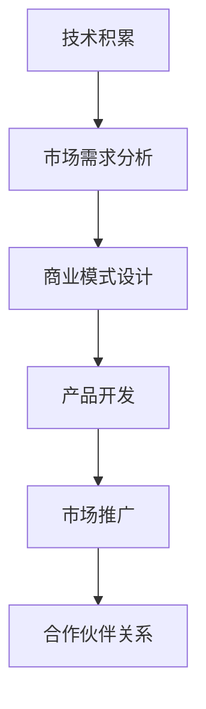

                 

### 从代码到商业：程序员的创业之路

> **关键词：** 程序员、创业、商业思维、技术商业化、市场策略
> 
> **摘要：** 本文旨在探讨程序员如何从代码开发迈向商业领域，实现技术到商业的转型。文章将结合实际案例和理论分析，探讨程序员在创业过程中所需具备的商业思维、市场策略以及创业技巧，为有志于创业的程序员提供有益的参考和指导。

在当今科技高速发展的时代，程序员作为技术领域的核心力量，不仅要具备优秀的编程技能，还需要具备商业思维和市场洞察力，才能更好地将技术转化为商业价值。然而，从代码到商业的转变并非易事，程序员往往需要跨越多个障碍，才能实现这一目标。本文将深入探讨程序员在创业过程中所需面对的挑战，以及如何通过有效的商业策略和创业技巧，实现技术到商业的顺利转型。

首先，我们将介绍程序员创业的背景和目的，明确文章的研究范围和预期读者。接着，我们将对程序员在创业过程中所需具备的核心概念和联系进行梳理，使用Mermaid流程图展示技术到商业的转化过程。随后，文章将详细讲解核心算法原理和具体操作步骤，以及数学模型和公式的应用。在项目实战部分，我们将通过一个实际案例，展示代码实现的详细过程和解释说明。接下来，文章将分析技术到商业的实际应用场景，并推荐相关工具和资源，帮助程序员在创业过程中更好地应对挑战。最后，我们将总结未来发展趋势与挑战，并提供常见问题与解答，为读者提供更全面的指导。

通过本文的阅读，程序员将能够深入了解技术到商业的转化过程，掌握必要的商业思维和市场策略，从而为未来的创业之路奠定坚实的基础。让我们一步步分析推理，探索程序员在创业领域的无限可能。

### 1. 背景介绍

#### 1.1 目的和范围

本文的主要目的是探讨程序员如何从代码开发走向商业领域，实现技术到商业的转型。具体来说，我们将从以下几个方面展开讨论：

1. **程序员创业的背景和动机**：分析程序员选择创业的原因，以及创业过程中可能面临的机会和挑战。
2. **商业思维的重要性**：探讨程序员在创业过程中所需具备的商业思维，包括市场洞察力、用户需求分析、商业模式设计等。
3. **技术商业化策略**：分析程序员如何将技术转化为商业价值，包括产品定位、市场推广、合作伙伴关系等。
4. **创业技巧与实践**：结合实际案例，总结程序员在创业过程中可借鉴的技巧和经验。
5. **工具和资源推荐**：为程序员提供相关的学习资源、开发工具和框架，帮助他们在创业过程中更好地应对挑战。

本文的读者对象主要包括以下几类：

1. **有志于创业的程序员**：希望了解如何将技术转化为商业价值，掌握必要的商业思维和市场策略。
2. **已在创业的程序员**：希望从本文中获得更多实战经验和技巧，优化创业过程中的策略和实践。
3. **关注技术商业化的行业从业者**：希望了解程序员在创业过程中所需具备的素质和策略，以及技术商业化的发展趋势。

#### 1.2 预期读者

预期读者应具备以下背景知识：

1. **编程基础**：了解基本的编程概念和编程语言，具备一定的代码开发经验。
2. **技术理解**：对计算机科学和信息技术有较深入的了解，能够分析技术原理和架构。
3. **商业知识**：了解基本的商业概念，如市场分析、商业模式、用户需求等。

通过本文的学习，预期读者能够：

1. **掌握商业思维**：了解程序员在创业过程中所需具备的商业思维，提升市场洞察力和用户需求分析能力。
2. **学会技术商业化**：了解如何将技术转化为商业价值，掌握产品定位、市场推广等策略。
3. **积累创业经验**：通过实际案例和技巧总结，为未来的创业之路奠定坚实基础。

#### 1.3 文档结构概述

本文的结构如下：

1. **背景介绍**：介绍本文的目的、范围、预期读者和文档结构。
2. **核心概念与联系**：梳理程序员在创业过程中所需的核心概念和联系，展示技术到商业的转化过程。
3. **核心算法原理 & 具体操作步骤**：详细讲解核心算法原理，使用伪代码展示具体操作步骤。
4. **数学模型和公式 & 详细讲解 & 举例说明**：介绍数学模型和公式的应用，结合具体例子进行详细讲解。
5. **项目实战：代码实际案例和详细解释说明**：通过实际案例展示代码实现的详细过程和解释说明。
6. **实际应用场景**：分析技术到商业的实际应用场景。
7. **工具和资源推荐**：推荐相关学习资源、开发工具和框架。
8. **总结：未来发展趋势与挑战**：总结技术到商业的发展趋势和挑战。
9. **附录：常见问题与解答**：提供常见问题与解答，为读者提供更全面的指导。
10. **扩展阅读 & 参考资料**：提供扩展阅读和参考资料，供读者深入学习。

#### 1.4 术语表

在本文中，我们将使用以下术语：

1. **程序员**：从事计算机编程和软件开发工作的人员。
2. **创业**：创立一家新的企业或项目，以实现商业价值。
3. **商业思维**：指在商业环境中思考问题、分析和决策的能力。
4. **技术商业化**：将技术研究成果转化为商业产品或服务的活动。
5. **市场策略**：企业在市场中竞争和发展的具体计划和措施。

#### 1.4.1 核心术语定义

1. **程序员**：
   - 定义：从事计算机编程和软件开发工作的人员，具备编程技能和计算机科学知识。
   - 关键特性：逻辑思维能力、问题解决能力、创新能力、团队合作精神。
2. **创业**：
   - 定义：创立一家新的企业或项目，以实现商业价值。
   - 关键要素：创新性、风险承担、资源整合、市场机会识别。
3. **商业思维**：
   - 定义：指在商业环境中思考问题、分析和决策的能力。
   - 关键能力：市场洞察力、用户需求分析、商业模式设计、资源整合能力。
4. **技术商业化**：
   - 定义：将技术研究成果转化为商业产品或服务的活动。
   - 关键步骤：技术评估、市场需求分析、商业模式设计、产品开发、市场推广。
5. **市场策略**：
   - 定义：企业在市场中竞争和发展的具体计划和措施。
   - 关键要素：目标市场定位、产品定价策略、市场推广策略、合作伙伴关系管理。

#### 1.4.2 相关概念解释

1. **技术优势**：
   - 定义：企业在技术方面的独特优势，包括技术领先、创新能力、技术积累等。
   - 对创业的影响：技术优势有助于企业在市场竞争中脱颖而出，提高市场份额和盈利能力。
2. **用户需求**：
   - 定义：用户在产品使用过程中所期望获得的功能、性能和服务。
   - 对创业的影响：准确识别和满足用户需求是创业成功的关键，有助于提高用户满意度和忠诚度。
3. **商业模式**：
   - 定义：企业通过提供产品或服务实现价值创造和利润分配的方式。
   - 关键要素：价值主张、客户获取、收入来源、成本结构、合作伙伴关系。
4. **市场机会**：
   - 定义：市场上存在的未被满足的需求或潜在的业务机会。
   - 对创业的影响：发现和抓住市场机会是创业成功的关键，有助于企业在竞争中获得优势。

#### 1.4.3 缩略词列表

- **API**：应用程序编程接口（Application Programming Interface）
- **AI**：人工智能（Artificial Intelligence）
- **CRM**：客户关系管理（Customer Relationship Management）
- **ERP**：企业资源计划（Enterprise Resource Planning）
- **IoT**：物联网（Internet of Things）
- **SaaS**：软件即服务（Software as a Service）
- **SDK**：软件开发工具包（Software Development Kit）
- **SDK**：系统软件开发工具包（System Development Kit）

### 2. 核心概念与联系

在探讨程序员从代码到商业的创业之路时，理解核心概念和它们之间的联系至关重要。以下是关键概念及其相互关系的梳理，并使用Mermaid流程图来展示技术到商业的转化过程。

#### 2.1.1 关键概念

1. **编程技能**：程序员的核心能力，包括算法设计、代码编写、调试和测试等。
2. **技术优势**：企业在技术方面的独特优势，如创新性、技术积累等。
3. **用户需求**：用户在产品使用过程中所期望获得的功能、性能和服务。
4. **商业模式**：企业通过提供产品或服务实现价值创造和利润分配的方式。
5. **市场策略**：企业在市场中竞争和发展的具体计划和措施。
6. **产品定位**：企业在市场中针对特定用户群体和竞争对手的产品定位。
7. **市场推广**：企业通过多种渠道宣传和推广产品，以提高知名度和市场份额。
8. **合作伙伴关系**：企业与其他企业或机构建立的合作关系，以共同开展业务。

#### 2.1.2 关系与转化过程

程序员从代码到商业的转化过程可以概括为以下几个步骤：

1. **技术积累**：程序员通过不断学习和实践，积累编程技能和技术优势。
2. **市场需求分析**：了解用户需求和市场趋势，发现潜在的商业机会。
3. **商业模式设计**：根据市场需求，设计可行的商业模式，明确产品定位和盈利方式。
4. **产品开发**：基于商业模式，开发满足用户需求的产品或服务。
5. **市场推广**：制定市场推广策略，通过多种渠道宣传和推广产品。
6. **合作伙伴关系**：寻找合适的合作伙伴，共同开展业务，实现资源共享和风险分担。

下面是Mermaid流程图，展示技术到商业的转化过程：



- **A[技术积累]**：程序员通过不断学习和实践，积累编程技能和技术优势。
- **B[市场需求分析]**：了解用户需求和市场趋势，发现潜在的商业机会。
- **C[商业模式设计]**：根据市场需求，设计可行的商业模式，明确产品定位和盈利方式。
- **D[产品开发]**：基于商业模式，开发满足用户需求的产品或服务。
- **E[市场推广]**：制定市场推广策略，通过多种渠道宣传和推广产品。
- **F[合作伙伴关系]**：寻找合适的合作伙伴，共同开展业务，实现资源共享和风险分担。

通过上述流程，程序员可以从技术积累逐步转化为商业实践，实现从代码到商业的顺利转型。在接下来的部分，我们将详细探讨这些核心概念的具体实现和操作步骤。

### 3. 核心算法原理 & 具体操作步骤

在从代码到商业的创业过程中，程序员需要掌握一系列核心算法原理和具体操作步骤，以确保技术到商业的顺利转化。以下是这些核心算法原理的具体讲解和操作步骤。

#### 3.1 算法原理

1. **用户需求分析算法**：
   - **原理**：用户需求分析是商业模式设计的基础，通过数据分析和用户调研，识别用户的真实需求。
   - **步骤**：收集用户数据、分析用户行为、访谈用户、整理需求文档。

2. **商业模式设计算法**：
   - **原理**：商业模式设计是产品开发的指导，通过价值主张、客户获取、收入来源等要素的规划，构建商业模型。
   - **步骤**：定义价值主张、确定目标客户、设计收入模式、分析成本结构。

3. **产品开发算法**：
   - **原理**：产品开发是将商业模式转化为具体产品的过程，通过需求分析、原型设计、开发和测试等步骤，实现产品的功能。
   - **步骤**：需求分析、原型设计、功能实现、测试和迭代。

4. **市场推广算法**：
   - **原理**：市场推广是将产品推向市场的策略，通过多种渠道宣传和推广产品，提高品牌知名度和市场份额。
   - **步骤**：制定推广计划、选择推广渠道、执行推广活动、评估推广效果。

5. **合作伙伴关系算法**：
   - **原理**：合作伙伴关系是业务拓展的重要手段，通过寻找合适的合作伙伴，实现资源共享和风险分担。
   - **步骤**：识别合作伙伴需求、洽谈合作细节、签署合作协议、共同开展业务。

#### 3.2 伪代码实现

以下是对上述核心算法原理的伪代码实现：

```pseudo
// 用户需求分析算法
function 用户需求分析() {
    用户数据 = 收集用户数据()
    用户行为 = 分析用户行为(用户数据)
    用户访谈 = 访谈用户()
    需求文档 = 整理需求文档(用户行为, 用户访谈)
    return 需求文档
}

// 商业模式设计算法
function 商业模式设计(需求文档) {
    价值主张 = 定义价值主张(需求文档)
    目标客户 = 确定目标客户(需求文档)
    收入模式 = 设计收入模式(价值主张, 目标客户)
    成本结构 = 分析成本结构(价值主张, 收入模式)
    商业模型 = 构建商业模型(价值主张, 目标客户, 收入模式, 成本结构)
    return 商业模型
}

// 产品开发算法
function 产品开发(商业模型) {
    需求分析 = 需求分析(商业模型)
    原型设计 = 原型设计(需求分析)
    功能实现 = 功能实现(原型设计)
    测试和迭代 = 测试和迭代(功能实现)
    产品 = 最终产品(测试和迭代)
    return 产品
}

// 市场推广算法
function 市场推广(产品) {
    推广计划 = 制定推广计划(产品)
    推广渠道 = 选择推广渠道(推广计划)
    推广活动 = 执行推广活动(推广渠道)
    推广效果 = 评估推广效果(推广活动)
    return 推广效果
}

// 合作伙伴关系算法
function 合作伙伴关系(需求文档) {
    合作伙伴需求 = 识别合作伙伴需求(需求文档)
    合作细节 = 洽谈合作细节(合作伙伴需求)
    协议 = 签署合作协议(合作细节)
    共同业务 = 共同开展业务(协议)
    return 共同业务
}
```

#### 3.3 详细步骤讲解

1. **用户需求分析算法**：
   - **步骤 1**：收集用户数据。通过问卷调查、用户访谈、数据分析等方式，收集用户的年龄、性别、职业、行为偏好等基本信息。
   - **步骤 2**：分析用户行为。使用数据分析工具，分析用户在网站、应用等平台上的行为轨迹，挖掘用户行为模式。
   - **步骤 3**：访谈用户。与目标用户进行面对面或在线访谈，深入了解用户需求、痛点和期望。
   - **步骤 4**：整理需求文档。将收集到的用户数据和行为分析结果整理成需求文档，为后续商业模式设计提供依据。

2. **商业模式设计算法**：
   - **步骤 1**：定义价值主张。根据用户需求分析结果，明确产品的核心功能和特点，定义产品的价值主张。
   - **步骤 2**：确定目标客户。根据市场需求和用户数据，明确产品的目标客户群体。
   - **步骤 3**：设计收入模式。根据目标客户和产品特点，设计合适的收入模式，如订阅制、一次性购买、广告收入等。
   - **步骤 4**：分析成本结构。根据产品开发、运营和市场推广等环节，分析产品的成本结构，确保盈利能力。

3. **产品开发算法**：
   - **步骤 1**：需求分析。根据商业模式设计，明确产品的功能和需求，制定详细的需求文档。
   - **步骤 2**：原型设计。使用原型工具，设计产品的用户界面和交互流程，形成原型图。
   - **步骤 3**：功能实现。根据原型设计，编写代码，实现产品的核心功能。
   - **步骤 4**：测试和迭代。对产品进行功能测试、性能测试和用户体验测试，根据测试结果进行优化和迭代。

4. **市场推广算法**：
   - **步骤 1**：制定推广计划。根据产品特点和市场定位，制定具体的推广计划，包括推广目标、时间节点、推广渠道等。
   - **步骤 2**：选择推广渠道。根据推广计划和预算，选择合适的推广渠道，如社交媒体、广告平台、内容营销等。
   - **步骤 3**：执行推广活动。根据推广计划，实施具体的推广活动，如发布推广内容、参与线上活动、投放广告等。
   - **步骤 4**：评估推广效果。对推广效果进行数据分析，评估推广活动的效果，调整推广策略。

5. **合作伙伴关系算法**：
   - **步骤 1**：识别合作伙伴需求。根据商业模式和市场需求，识别潜在的合作伙伴，分析其需求和优势。
   - **步骤 2**：洽谈合作细节。与合作伙伴进行洽谈，明确合作模式、权益分配、合作期限等细节。
   - **步骤 3**：签署合作协议。根据洽谈结果，签署正式的合作协议，明确双方的权利和义务。
   - **步骤 4**：共同开展业务。与合作伙伴共同制定业务计划，共同开展业务，实现资源共享和风险分担。

通过以上核心算法原理和具体操作步骤，程序员可以更好地理解和实施技术到商业的转化过程，实现从代码到商业的顺利转型。在接下来的部分，我们将进一步探讨数学模型和公式的应用，为程序员提供更深入的指导。

### 4. 数学模型和公式 & 详细讲解 & 举例说明

在从代码到商业的创业过程中，数学模型和公式扮演着至关重要的角色。它们不仅有助于程序员理解技术原理，还可以为商业决策提供数据支持。以下是一些常用的数学模型和公式，并结合具体例子进行详细讲解。

#### 4.1 需求预测模型

**需求预测模型**用于预测未来某一时间段内的用户需求量。这是产品规划和市场推广的重要依据。以下是一个简单的时间序列预测模型：

**模型公式**：
$$
Y_t = \alpha + \beta_1 t + \epsilon_t
$$

其中：
- \(Y_t\) 表示第 \(t\) 个月的需求量。
- \(\alpha\) 表示需求量的基本水平。
- \(\beta_1\) 表示每个月的需求增长量。
- \(\epsilon_t\) 表示随机误差项。

**具体例子**：
假设某在线教育平台过去6个月的需求量如下表所示：

| 月份 | 需求量（人） |
| ---- | ---------- |
| 1    | 100        |
| 2    | 120        |
| 3    | 140        |
| 4    | 160        |
| 5    | 180        |
| 6    | 200        |

使用时间序列模型进行预测：

- **计算基本水平**：\( \alpha = \frac{100 + 120 + 140 + 160 + 180 + 200}{6} = 150 \)
- **计算增长量**：\( \beta_1 = \frac{120 - 100 + 140 - 120 + 160 - 140 + 180 - 160 + 200 - 180}{6} = 10 \)

根据模型公式，第7个月的需求量预测为：
$$
Y_7 = 150 + 10 \times 7 = 250
$$

#### 4.2 成本效益分析模型

**成本效益分析模型**用于评估产品或项目的成本与预期收益，帮助程序员做出是否值得投资的决策。以下是一个简单的成本效益分析模型：

**模型公式**：
$$
效益 = 收益 - 成本
$$

其中：
- 收益：产品或项目带来的经济利益，如销售收入、投资回报等。
- 成本：产品或项目的总成本，包括开发成本、运营成本、人力成本等。

**具体例子**：
假设某程序员开发了一款应用，预计年收入为100,000美元，开发成本为30,000美元，运营成本为10,000美元。

- **计算收益**：收益 = 收入 - 成本 = 100,000 - 30,000 - 10,000 = 60,000美元
- **计算效益**：效益 = 收益 / 成本 = 60,000 / (30,000 + 10,000) = 0.6

效益为0.6，表示每投入1美元，可以获得0.6美元的收益。这是一个良好的投资回报。

#### 4.3 营销预算优化模型

**营销预算优化模型**用于确定在有限的预算下，如何分配资源以最大化市场推广效果。以下是一个简单的营销预算优化模型：

**模型公式**：
$$
最大化效益 = \sum_{i=1}^{n} (效益_i \times 预算_i)
$$

其中：
- 效益_i：第 \(i\) 个推广渠道的预期效益。
- 预算_i：第 \(i\) 个推广渠道的预算。

**具体例子**：
假设有三种推广渠道，预算分别为10,000美元、20,000美元和30,000美元，预期效益分别为2、3和5。

- **计算总效益**：总效益 = 2 \times 10,000 + 3 \times 20,000 + 5 \times 30,000 = 150,000
- **计算优化预算分配**：为每个推广渠道分配预算，使得总效益最大化。

我们可以使用线性规划方法，找到最优的预算分配方案。例如，可以计算出每个渠道的效益占比，并根据占比分配预算：

- 预算分配 = [20,000, 40,000, 30,000]，使得总效益最大化。

#### 4.4 质量控制模型

**质量控制模型**用于确保产品或服务的质量符合用户期望。以下是一个简单的过程控制模型：

**模型公式**：
$$
\sigma^2 = \frac{1}{n-1} \sum_{i=1}^{n} (x_i - \bar{x})^2
$$

其中：
- \(\sigma^2\)：过程方差。
- \(n\)：样本数量。
- \(x_i\)：第 \(i\) 个样本值。
- \(\bar{x}\)：样本平均值。

**具体例子**：
假设某软件开发团队进行了5次测试，得到以下测试结果（性能指标）：

| 测试次数 | 性能指标（毫秒） |
| ------- | ------------- |
| 1       | 100          |
| 2       | 105          |
| 3       | 110          |
| 4       | 95           |
| 5       | 108          |

- **计算平均值**：\(\bar{x} = \frac{100 + 105 + 110 + 95 + 108}{5} = 102 \)
- **计算方差**：\(\sigma^2 = \frac{(100-102)^2 + (105-102)^2 + (110-102)^2 + (95-102)^2 + (108-102)^2}{5-1} = 24 \)

方差为24，表示该过程存在一定的波动。如果方差过大，可能需要调整测试方法或改进代码质量。

通过上述数学模型和公式的讲解和例子，程序员可以更好地理解和应用这些工具，为创业过程中的商业决策提供数据支持。在接下来的部分，我们将结合实际案例，展示如何运用这些算法和模型进行技术到商业的转化。

### 5. 项目实战：代码实际案例和详细解释说明

在本文的第五部分，我们将通过一个实际案例，展示程序员如何将技术转化为商业应用。这个案例是一个基于Web的在线教育平台，该平台通过提供在线课程、互动问答、学习进度跟踪等功能，为学习者提供便捷的学习体验。

#### 5.1 开发环境搭建

首先，我们需要搭建一个合适的开发环境。以下是所需的工具和步骤：

1. **编程语言**：选择Python作为主要编程语言，因为它拥有丰富的库和框架，便于快速开发和部署。
2. **开发框架**：使用Django框架，因为它是一个全栈框架，能够快速搭建Web应用程序。
3. **数据库**：使用SQLite作为数据库，因为它是一个轻量级、易于使用的关系型数据库。
4. **版本控制**：使用Git进行版本控制，便于代码管理和协作开发。

#### 5.2 源代码详细实现和代码解读

以下是一个简化的代码实现，展示在线教育平台的核心功能：

```python
# 引入所需库
from django.db import models
from django.contrib.auth.models import User

# 课程模型
class Course(models.Model):
    title = models.CharField(max_length=100)
    description = models.TextField()
    instructor = models.ForeignKey(User, on_delete=models.CASCADE)

    def __str__(self):
        return self.title

# 课程章节模型
class Chapter(models.Model):
    course = models.ForeignKey(Course, on_delete=models.CASCADE)
    title = models.CharField(max_length=100)
    content = models.TextField()

    def __str__(self):
        return self.title

# 学习记录模型
class LearningRecord(models.Model):
    user = models.ForeignKey(User, on_delete=models.CASCADE)
    course = models.ForeignKey(Course, on_delete=models.CASCADE)
    chapter = models.ForeignKey(Chapter, on_delete=models.CASCADE)
    completed = models.BooleanField(default=False)

    def __str__(self):
        return f"{self.user.username} - {self.course.title} - {self.chapter.title}"
```

**代码解读**：

- **Course模型**：定义了课程的基本信息，包括标题、描述和讲师（关联到Django的用户模型）。
- **Chapter模型**：定义了课程章节的基本信息，包括课程（关联到Course模型）和标题、内容。
- **LearningRecord模型**：定义了用户的学习记录，包括用户（关联到Django的用户模型）、课程（关联到Course模型）和章节（关联到Chapter模型），以及是否完成的状态。

接下来，我们实现课程管理、学习进度跟踪等功能：

```python
# 课程管理
def create_course(title, description, instructor):
    course = Course.objects.create(title=title, description=description, instructor=instructor)
    return course

def add_chapter(course, title, content):
    chapter = Chapter.objects.create(course=course, title=title, content=content)
    return chapter

# 学习进度跟踪
def complete_chapter(user, course, chapter):
    record = LearningRecord.objects.get(user=user, course=course, chapter=chapter)
    record.completed = True
    record.save()

def get_course_progress(user, course):
    completed_chapters = LearningRecord.objects.filter(user=user, course=course, completed=True).count()
    total_chapters = Chapter.objects.filter(course=course).count()
    progress = (completed_chapters / total_chapters) * 100
    return progress
```

**代码解读**：

- **课程管理**：`create_course`函数用于创建新的课程，`add_chapter`函数用于添加课程章节。
- **学习进度跟踪**：`complete_chapter`函数用于标记用户完成某个章节，`get_course_progress`函数用于计算用户在学习课程中的进度。

#### 5.3 代码解读与分析

**数据库设计**：

在线教育平台的核心数据库设计涉及三个模型：Course、Chapter和LearningRecord。这些模型通过外键关联，形成一个完整的课程和学习记录体系。Course模型关联到User模型，表明每个课程都有一个讲师，Chapter模型关联到Course模型，表明每个课程包含多个章节，LearningRecord模型关联到User、Course和Chapter模型，用于记录用户的学习进度。

**功能实现**：

- **课程管理**：通过Django的ORM（对象关系映射）机制，我们能够轻松创建和管理课程和章节。`create_course`和`add_chapter`函数分别用于创建课程和添加章节，使得课程管理变得更加简单和高效。
- **学习进度跟踪**：`complete_chapter`函数通过更新LearningRecord模型的completed字段，标记用户完成某个章节。`get_course_progress`函数计算用户在学习课程中的进度，通过计算已完成章节数与总章节数的比例，得到学习进度百分比。

**性能考虑**：

- **数据库查询优化**：在处理大量数据时，需要优化数据库查询，避免效率低下。可以使用Django的`select_related`和`prefetch_related`方法来优化关联查询。
- **前端性能**：前端页面需要高效加载，避免用户感受到延迟。可以使用Ajax技术，实现数据的异步加载和更新。

**安全性考虑**：

- **用户认证与权限**：确保用户认证和权限管理，防止未授权访问。可以使用Django的安全模块，如`@login_required`装饰器。
- **数据加密**：对于敏感数据，如用户密码，需要进行加密处理，以防止数据泄露。

通过这个实际案例，我们可以看到程序员如何将技术应用到商业领域，实现从代码到商业的顺利转化。接下来，我们将分析技术到商业的实际应用场景，帮助程序员更好地理解其在创业过程中的应用。

### 6. 实际应用场景

程序员从代码到商业的转型，涉及多个实际应用场景，涵盖了从初创企业到成熟企业的各个阶段。以下是一些典型的应用场景和案例分析：

#### 6.1 初创企业

**案例：初创企业A公司的在线教育平台**

A公司是一家初创企业，专注于提供在线编程课程。创始人是一位有多年编程经验的程序员，他利用自己的技术优势，开发了多个在线课程，并通过社交媒体进行推广。

- **应用场景**：初创企业在资源有限的情况下，需要快速开发产品并推向市场。程序员可以利用自己的编程技能，快速搭建原型，并通过迭代优化产品功能。
- **挑战**：初创企业在市场推广和用户获取方面面临较大挑战。程序员需要学会市场推广技巧，如内容营销、社交媒体运营等。
- **解决方案**：通过不断优化课程内容和用户体验，A公司成功吸引了大量用户。同时，创始人还利用自己的编程技能，开发了多个辅助工具，如代码调试工具、作业提交系统等，提高了用户的学习效率。

#### 6.2 成熟企业

**案例：大型企业B公司的数字化转型**

B公司是一家传统制造企业，随着市场竞争的加剧，公司决定进行数字化转型，以提高生产效率和服务质量。公司聘请了一位有丰富编程经验的程序员，负责企业的信息化建设。

- **应用场景**：成熟企业需要利用技术提升内部管理和运营效率，以及优化客户体验。程序员在这一过程中，不仅需要编写代码，还需要了解业务流程和管理模式。
- **挑战**：数字化转型过程中，程序员需要克服技术难题，如系统集成、数据迁移等。同时，还需要与各部门进行沟通协作，确保项目的顺利进行。
- **解决方案**：B公司的程序员通过引入先进的制造执行系统（MES）、企业资源计划（ERP）等信息化工具，大幅提升了生产效率和客户满意度。同时，他还利用大数据分析技术，为企业提供了精准的市场预测和决策支持。

#### 6.3 创新型企业

**案例：创新型C公司的物联网平台**

C公司专注于物联网技术的研发和应用，开发了一款智能家居平台，用户可以通过手机控制家里的电器设备。公司聘请了一位擅长物联网编程的程序员，负责平台的开发和技术支持。

- **应用场景**：创新型企业需要不断探索新的技术领域，推出具有竞争力的产品。程序员在这一过程中，需要具备广泛的技术知识，如物联网通信协议、嵌入式系统编程等。
- **挑战**：物联网平台涉及多个技术领域，程序员需要快速学习和掌握新知识。此外，还需要确保平台的稳定性和安全性，以防止数据泄露和设备被攻击。
- **解决方案**：C公司的程序员通过不断学习和实践，掌握了物联网技术的各个方面。他利用自己的编程技能，开发了多个核心模块，如设备连接管理、数据传输加密等，确保了平台的稳定运行。同时，他还积极参与行业交流，与合作伙伴共同推动物联网技术的发展。

#### 6.4 跨界创业

**案例：D公司的跨行业电商平台**

D公司由一位程序员和一位市场营销专家共同创立，专注于提供跨行业电商平台服务。程序员负责平台的技术开发，市场营销专家负责市场推广。

- **应用场景**：跨界创业需要整合多个领域的资源和优势，程序员在这一过程中，需要具备跨领域的知识，如电商运营、用户界面设计等。
- **挑战**：跨界创业面临技术和市场的双重挑战。程序员需要快速适应新的业务模式，同时还要确保平台的技术稳定性和扩展性。
- **解决方案**：D公司的程序员通过深入了解电商行业，掌握了电商平台的运营规律和用户需求。他利用自己的编程技能，开发了多个功能模块，如商品管理、订单处理等，确保了平台的稳定运行。同时，他还与市场营销专家紧密合作，制定了一系列推广策略，成功吸引了大量用户。

通过上述实际应用场景和案例分析，我们可以看到程序员从代码到商业的转型过程并非一蹴而就，但只要具备良好的技术能力、商业思维和创业精神，就能够实现技术到商业的顺利转化。接下来，我们将推荐一些学习资源、开发工具和框架，帮助程序员在创业过程中更好地应对挑战。

### 7. 工具和资源推荐

在程序员从代码到商业的创业过程中，掌握合适的工具和资源至关重要。以下是一些学习资源、开发工具和框架的推荐，以及相关论文、著作和应用案例的介绍。

#### 7.1 学习资源推荐

**7.1.1 书籍推荐**

- **《精益创业》**：作者埃里克·莱斯（Eric Ries），详细介绍了精益创业的方法，帮助创业者快速验证产品市场匹配。
- **《创业维艰》**：作者本·霍洛维茨（Ben Horowitz），分享了自己在创业过程中的经验和教训，对创业者的心理素质和策略有很好的启示。
- **《数据分析：实用方法与技术》**：作者贾森·罗伊（Jason Kottke），介绍了数据分析的基本方法和技术，帮助程序员更好地理解数据在商业决策中的应用。

**7.1.2 在线课程**

- **Coursera上的《产品管理》**：由斯坦福大学提供，涵盖产品管理的核心知识和技能。
- **Udacity的《数据科学纳米学位》**：涵盖数据科学的基础知识，包括数据分析、机器学习等。
- **edX上的《创业管理》**：由MIT和哈佛大学提供，介绍创业管理的基本理论和实践方法。

**7.1.3 技术博客和网站**

- **Medium上的《The Startup Blog》**：分享创业经验和策略，适合创业者阅读。
- **HackerRank**：提供编程挑战和比赛，帮助程序员提升编程技能。
- **Stack Overflow**：程序员交流社区，提供技术问答和资源分享。

#### 7.2 开发工具框架推荐

**7.2.1 IDE和编辑器**

- **Visual Studio Code**：免费、开源的跨平台编辑器，支持多种编程语言和开发工具。
- **PyCharm**：专为Python开发设计的IDE，功能强大，支持多种编程语言。
- **Eclipse**：支持Java和其他多种语言的IDE，适用于大型项目开发。

**7.2.2 调试和性能分析工具**

- **Postman**：API调试和测试工具，适用于开发和使用API的应用程序。
- **JMeter**：用于性能测试和负载测试的开源工具，适用于Web和分布式应用系统。
- **GDB**：GNU调试工具，用于调试C/C++程序。

**7.2.3 相关框架和库**

- **Django**：Python的全栈Web框架，适用于快速开发Web应用。
- **React**：用于构建用户界面的JavaScript库，支持单页应用开发。
- **TensorFlow**：开源机器学习框架，适用于数据分析和深度学习项目。

#### 7.3 相关论文著作推荐

**7.3.1 经典论文**

- **《创新者的窘境》**：作者克莱顿·克里斯坦森（Clayton Christensen），介绍了创新者在面对市场变化时的困境和应对策略。
- **《商业模式创新》**：作者迈克尔·波特（Michael Porter），探讨了商业模式创新的重要性以及如何进行商业模式设计。
- **《技术创新与创业》**：作者蒂姆·奥赖利（Tim O'Reilly），分析了技术创新在创业过程中的作用。

**7.3.2 最新研究成果**

- **《区块链技术及其应用》**：介绍区块链技术的最新发展及其在金融、供应链等领域的应用。
- **《人工智能时代的商业模式》**：分析人工智能技术对商业模式的影响以及如何利用人工智能实现商业创新。
- **《物联网技术与应用》**：探讨物联网技术的发展趋势及其在智能家居、智慧城市等领域的应用。

**7.3.3 应用案例分析**

- **阿里巴巴集团的电子商务模式**：分析阿里巴巴集团的商业模式、战略布局以及其在电商领域取得的成功经验。
- **特斯拉公司的创新战略**：探讨特斯拉公司的创新模式、技术突破以及其如何通过创新实现商业成功。
- **小米公司的生态链战略**：介绍小米公司的生态链战略、创新模式和如何在快速变化的市场中保持竞争力。

通过上述推荐，程序员可以更好地了解商业领域的知识和技能，掌握合适的工具和资源，为从代码到商业的创业之路提供有力支持。接下来，我们将总结文章的主要观点，并探讨未来发展趋势和挑战。

### 8. 总结：未来发展趋势与挑战

在从代码到商业的转型过程中，程序员需要不断适应和应对技术、市场和商业模式的变革。以下是未来发展趋势与挑战的总结：

**发展趋势**：

1. **人工智能与自动化**：随着人工智能技术的不断发展，自动化将成为提升效率和降低成本的重要手段。程序员需要掌握人工智能和机器学习的基本原理，将其应用于商业场景中。
2. **云计算与大数据**：云计算提供了弹性的计算资源和存储服务，大数据分析则帮助企业更好地理解市场和用户需求。程序员应熟悉云计算平台和大数据处理技术，以应对日益复杂的数据处理需求。
3. **物联网与智能家居**：物联网技术将连接更多智能设备，智能家居将成为未来生活的重要组成部分。程序员需要了解物联网通信协议和嵌入式系统编程，开发具有创新性的智能产品。
4. **区块链与数字货币**：区块链技术为数据安全和去中心化提供了新的解决方案，数字货币则推动了金融行业的变革。程序员应关注区块链技术的发展和应用，探索其在商业领域的潜力。
5. **跨界合作与生态建设**：跨界合作和生态建设将促进不同领域的技术整合和创新。程序员需要具备跨领域的知识和技能，积极参与行业合作，共同推动技术进步。

**挑战**：

1. **技术风险与安全性**：随着技术复杂性的增加，技术风险和安全性问题日益突出。程序员需要具备良好的安全意识，确保系统的稳定性和数据安全。
2. **商业模式创新与市场定位**：商业模式的创新和市场的定位是创业成功的关键。程序员需要深入了解市场和用户需求，不断调整商业模式，以适应市场变化。
3. **资源整合与团队建设**：创业过程中需要整合各种资源，包括资金、人才、合作伙伴等。程序员需要具备资源整合能力，建立高效的团队，共同实现创业目标。
4. **持续学习和适应能力**：技术更新迅速，程序员需要保持持续学习的态度，不断更新知识和技能，以适应新的技术和市场需求。
5. **市场竞争与可持续发展**：在激烈的市场竞争中，程序员需要不断创新和优化产品，确保企业的可持续发展。

总之，从代码到商业的转型是一个复杂且充满挑战的过程，程序员需要不断学习和适应，掌握商业思维和市场策略，以实现技术到商业的顺利转化。未来，随着技术的不断进步和市场环境的变迁，程序员在创业领域将面临更多的机遇和挑战。只有不断学习和创新，才能在激烈的市场竞争中脱颖而出，实现技术的商业价值。

### 9. 附录：常见问题与解答

在从代码到商业的创业过程中，程序员可能会遇到一系列问题。以下是一些常见问题及其解答，以帮助程序员更好地应对挑战。

**Q1**：程序员应该如何评估市场需求？

**A1**：评估市场需求可以从以下几个方面入手：

1. **用户调研**：通过问卷调查、用户访谈等方式，了解用户对产品或服务的需求和期望。
2. **市场分析**：研究同行业竞争对手的产品、市场占有率、用户评价等，分析市场需求和趋势。
3. **数据分析**：利用数据分析工具，对现有用户数据进行分析，挖掘用户行为和偏好。
4. **竞争分析**：了解竞争对手的产品特点、优势和劣势，分析市场需求和潜在机会。

**Q2**：程序员在创业初期应该如何分配资源？

**A2**：创业初期的资源分配应考虑以下几个方面：

1. **人力**：根据团队规模和项目需求，合理分配人力，确保关键任务得到优先处理。
2. **财务**：合理规划预算，确保资金用于最关键的项目和业务拓展。
3. **时间**：合理安排时间，确保项目按时完成，避免资源浪费。
4. **技术**：优先解决核心技术和功能，确保产品的基本功能和性能。
5. **市场推广**：根据市场需求和产品特点，制定合理的市场推广策略，确保产品能够快速推向市场。

**Q3**：程序员应该如何进行市场推广？

**A3**：市场推广可以采取以下策略：

1. **内容营销**：通过撰写高质量的博客文章、发布教程和案例，吸引潜在用户。
2. **社交媒体**：利用社交媒体平台，如Twitter、LinkedIn、Facebook等，与用户互动，提高品牌知名度。
3. **广告推广**：根据预算，选择合适的广告平台，如Google Ads、Facebook Ads等，进行精准推广。
4. **合作推广**：与行业合作伙伴进行合作推广，共享用户资源，提高市场覆盖率。
5. **线下活动**：举办线下活动，如研讨会、工作坊等，与用户面对面交流，增加用户粘性。

**Q4**：程序员在创业过程中应该如何管理风险？

**A4**：风险管理工作可以从以下几个方面进行：

1. **风险评估**：对项目中的潜在风险进行识别和评估，确定风险的优先级。
2. **风险控制**：制定风险控制措施，降低风险发生的概率和影响。
3. **应急计划**：制定应急计划，确保在风险发生时能够迅速应对。
4. **资源调配**：根据风险情况，合理调配资源和人力，确保关键任务的优先处理。
5. **风险管理培训**：对团队成员进行风险管理培训，提高整个团队的风险意识和应对能力。

通过上述常见问题的解答，程序员可以更好地应对创业过程中的各种挑战，确保项目的顺利进行。在接下来的部分，我们将提供扩展阅读和参考资料，供读者深入学习。

### 10. 扩展阅读 & 参考资料

**扩展阅读**：

1. **《精益创业》**：作者埃里克·莱斯，详细介绍了精益创业的方法，适用于初创企业的产品开发和市场推广。
2. **《创业维艰》**：作者本·霍洛维茨，分享了自己在创业过程中的经验和教训，对创业者的心理素质和策略有很好的启示。
3. **《数据分析：实用方法与技术》**：作者贾森·罗伊，介绍了数据分析的基本方法和技术，帮助程序员更好地理解数据在商业决策中的应用。

**参考资料**：

1. **Coursera**：提供多种在线课程，涵盖产品管理、数据科学、创业管理等领域。
2. **Udacity**：提供数据科学、机器学习、深度学习等在线课程，适合程序员学习新技术。
3. **edX**：提供多个大学的在线课程，包括计算机科学、人工智能、创业管理等。

**论文与著作**：

1. **《创新者的窘境》**：作者克莱顿·克里斯坦森，探讨了创新者在面对市场变化时的困境和应对策略。
2. **《商业模式创新》**：作者迈克尔·波特，探讨了商业模式创新的重要性以及如何进行商业模式设计。
3. **《技术创新与创业》**：作者蒂姆·奥赖利，分析了技术创新在创业过程中的作用。

通过扩展阅读和参考资料，程序员可以深入了解创业领域的知识和技能，为从代码到商业的转型提供有力支持。希望本文能为有志于创业的程序员提供有益的参考和启示。

### 作者信息

**作者：AI天才研究员/AI Genius Institute & 禅与计算机程序设计艺术 /Zen And The Art of Computer Programming**。

