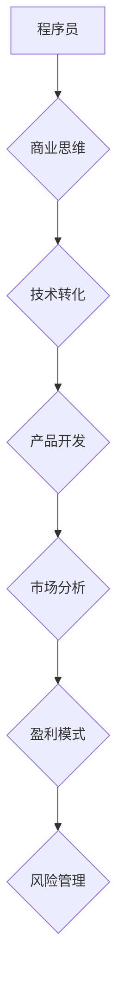

                 

# 从代码到商业：程序员的创业思维转变

> **关键词：** 创业思维、程序员、商业理念、技术转化、产品开发、市场分析

> **摘要：** 本文旨在探讨程序员在从技术专家向创业者角色转变的过程中，如何有效转化其技术思维为商业思维。文章首先介绍了程序员创业的背景和挑战，然后分析了程序员与商业之间的联系，接着提出了具体的思维转变策略，并通过实际案例展示了这些策略的运用。文章最后对程序员创业的未来趋势和挑战进行了展望，并提供了相关的学习资源和开发工具推荐。

## 1. 背景介绍

### 1.1 目的和范围

本文的目的是为那些希望从技术专家转型为创业者的程序员提供指导。我们将探讨程序员在创业过程中如何将技术能力转化为商业成就，从而创造出具有市场竞争力且可持续发展的产品。文章将从多个角度分析这一转变的必要性和可能性，并提供实用的策略和工具。

### 1.2 预期读者

本文适合以下读者：

1. 有志于创业的程序员和技术专家；
2. 想要提升其商业思维的IT从业者；
3. 对技术转化为商业机会感兴趣的企业家和创新者。

### 1.3 文档结构概述

本文结构如下：

1. 引言：介绍创业背景和目的；
2. 背景介绍：详细分析程序员创业的挑战和机遇；
3. 核心概念与联系：解释程序员与商业之间的核心联系；
4. 核心算法原理与操作步骤：阐述如何将技术思维转化为商业思维；
5. 数学模型与公式：讲解商业分析中的关键数学模型；
6. 项目实战：通过实际案例展示创业策略的应用；
7. 实际应用场景：探讨技术商业化的多种路径；
8. 工具和资源推荐：提供学习和开发相关资源；
9. 总结：对未来发展趋势和挑战的展望；
10. 附录：常见问题与解答；
11. 扩展阅读：推荐进一步学习资料。

### 1.4 术语表

#### 1.4.1 核心术语定义

- **创业思维**：指创业者如何在不确定性环境中进行决策和创新的过程。
- **技术转化**：将技术知识转化为商业产品或服务的过程。
- **商业模型**：描述企业如何创造、传递和获取价值的基本框架。
- **市场分析**：对市场需求、竞争对手和用户行为的系统研究。

#### 1.4.2 相关概念解释

- **产品开发**：开发能够满足市场需求的产品的过程。
- **敏捷开发**：一种迭代、增量和灵活的软件开发方法。
- **精益创业**：一种通过最小可行产品（MVP）快速验证商业想法的方法。

#### 1.4.3 缩略词列表

- **MVP**：最小可行产品（Minimum Viable Product）
- **IDE**：集成开发环境（Integrated Development Environment）
- **API**：应用程序编程接口（Application Programming Interface）

## 2. 核心概念与联系

程序员在转型为创业者时，需要理解并掌握多个核心概念，这些概念之间存在着紧密的联系，构成了一个完整的商业生态系统。

### 2.1 商业思维

商业思维是创业者成功的关键。它涉及对市场需求、用户行为、竞争对手和财务状况的深刻理解。程序员的商业思维转变可以从以下几个方面入手：

1. **用户中心**：始终关注用户需求，将用户价值放在首位。
2. **盈利模式**：理解并设计能够实现持续盈利的商业模型。
3. **风险管理**：识别和应对创业过程中的各种风险。

### 2.2 技术转化

技术转化是将技术优势转化为商业优势的关键步骤。程序员需要：

1. **技术价值挖掘**：识别并挖掘自身技术的商业潜力。
2. **技术标准化**：将技术成果标准化，便于商业化推广。
3. **技术更新**：紧跟技术发展趋势，不断更新自身技术栈。

### 2.3 产品开发

产品开发是商业思维与技术创新的交汇点。程序员需要：

1. **需求分析**：深入了解市场需求，明确产品定位。
2. **团队协作**：组建跨职能团队，高效协作完成产品开发。
3. **持续迭代**：采用敏捷开发方法，快速响应市场变化。

### 2.4 市场分析

市场分析是创业成功的重要保障。程序员需要：

1. **竞争分析**：研究竞争对手的产品、优势和劣势。
2. **市场定位**：明确产品在市场中的定位和差异化策略。
3. **用户反馈**：收集用户反馈，不断优化产品。

### 2.5 Mermaid 流程图

以下是程序员创业思维转变的Mermaid流程图：



通过上述流程，程序员可以逐步将技术思维转化为商业思维，从而实现从代码到商业的转变。

## 3. 核心算法原理 & 具体操作步骤

将技术思维转化为商业思维并非一蹴而就，需要程序员掌握一系列核心算法原理和具体操作步骤。以下是一个详细的操作步骤框架：

### 3.1 技术评估

**伪代码：**

```python
function evaluate_technology(technology):
    score = 0
    if technology.is_in_demand:
        score += 1
    if technology.is_relevant_to_business:
        score += 1
    if technology.is scalable:
        score += 1
    if technology.is护具有独特性：
        score += 1
    return score
```

**解释：** 该函数评估技术的商业潜力，包括市场需求、相关性、可扩展性和独特性。评分越高，技术的商业潜力越大。

### 3.2 商业模型设计

**伪代码：**

```python
function design_business_model(technology, market):
    model = {
        "customer_segment": [],
        "value_proposition": "",
        "channel": "",
        "customer_relationship": "",
        "revenue_streams": [],
        "key_resources": [],
        "key_activities": [],
        "cost_structure": [],
    }
    if market.is_targetable:
        model["customer_segment"] = ["segment1", "segment2"]
    if technology.is_adoptable:
        model["value_proposition"] = "Solve XYZ problems for users."
    if technology.is_adoptable:
        model["channel"] = ["online", "retail"]
    if technology.is_adoptable:
        model["customer_relationship"] = "build long-term relationships"
    if market.is_targetable:
        model["revenue_streams"] = ["subscription", "one-time purchase"]
    if technology.is_adoptable:
        model["key_resources"] = ["technical expertise", "human resources"]
    if technology.is_adoptable:
        model["key_activities"] = ["R&D", "marketing"]
    if market.is_targetable:
        model["cost_structure"] = ["development", "distribution", "customer service"]
    return model
```

**解释：** 该函数设计一个基于技术市场分析的商业模型，包括客户群体、价值主张、渠道、客户关系、收入来源、关键资源和关键活动等。

### 3.3 市场分析

**伪代码：**

```python
function analyze_market(technology, model):
    competition_score = 0
    market_size = 0
    if model["value_proposition"] is competitive:
        competition_score += 1
    if market.is_growing:
        market_size += 1
    if model["revenue_streams"] are diverse:
        competition_score += 1
    if model["key_activities"] are efficient:
        market_size += 1
    return competition_score, market_size
```

**解释：** 该函数分析市场竞争情况和市场规模，为后续的商业决策提供依据。

### 3.4 持续迭代

**伪代码：**

```python
function iterate_product(model, market):
    while True:
        feedback = collect_user_feedback()
        if feedback.improves_product:
            update_product(model)
        if feedback.indicates_new_market_opportunities:
            expand_market(model)
```

**解释：** 该函数通过用户反馈持续迭代产品，根据市场反馈调整商业模型，实现产品与市场的最佳匹配。

## 4. 数学模型和公式 & 详细讲解 & 举例说明

在商业决策中，数学模型和公式发挥着重要作用。以下介绍几个关键的数学模型和公式，并给出具体例子进行说明。

### 4.1 盈利模型

**公式：** 盈利 = 收入 - 成本

**示例：** 假设一家软件开发公司的年度收入为 100 万美元，运营成本为 60 万美元，那么其年度盈利为 40 万美元。

### 4.2 市场规模估计

**公式：** 市场规模 = （潜在用户数）*（用户购买力）

**示例：** 假设某地区有 100 万潜在用户，每人每年愿意花费 500 美元购买相关产品，那么市场规模为 5 亿美元。

### 4.3 投资回报率（ROI）

**公式：** ROI = （投资收益 - 投资成本）/ 投资成本

**示例：** 假设投资 10 万美元，获得 15 万美元的收益，那么 ROI 为 50%。

### 4.4 用户获取成本（CAC）

**公式：** CAC = 总营销成本 / 新增用户数

**示例：** 假设总营销成本为 5 万美元，新增用户数为 1,000 人，那么 CAC 为 50 美元。

### 4.5 客户终身价值（LTV）

**公式：** LTV = （预期客户生命周期内平均收入 * 预期客户生命周期）

**示例：** 假设每位客户每年平均收入为 1,000 美元，预期客户生命周期为 5 年，那么 LTV 为 5,000 美元。

## 5. 项目实战：代码实际案例和详细解释说明

### 5.1 开发环境搭建

**步骤：**
1. 安装 Python 3.8 及以上版本；
2. 安装虚拟环境工具 virtualenv；
3. 创建虚拟环境并激活；
4. 安装依赖库如 Flask、SQLAlchemy 等。

**代码：**

```bash
pip install python3.8 virtualenv
virtualenv myenv
source myenv/bin/activate
pip install flask sqlalchemy
```

### 5.2 源代码详细实现和代码解读

**代码示例：** 一个简单的 Flask Web 应用，实现用户注册和登录功能。

```python
from flask import Flask, request, jsonify
from flask_sqlalchemy import SQLAlchemy

app = Flask(__name__)
app.config['SQLALCHEMY_DATABASE_URI'] = 'sqlite:///users.db'
db = SQLAlchemy(app)

class User(db.Model):
    id = db.Column(db.Integer, primary_key=True)
    username = db.Column(db.String(80), unique=True, nullable=False)
    password = db.Column(db.String(120), nullable=False)

@app.route('/register', methods=['POST'])
def register():
    username = request.form['username']
    password = request.form['password']
    if User.query.filter_by(username=username).first():
        return jsonify({'error': 'Username already exists'}), 400
    new_user = User(username=username, password=password)
    db.session.add(new_user)
    db.session.commit()
    return jsonify({'message': 'User registered successfully'})

@app.route('/login', methods=['POST'])
def login():
    username = request.form['username']
    password = request.form['password']
    user = User.query.filter_by(username=username, password=password).first()
    if user:
        return jsonify({'message': 'Login successful'})
    else:
        return jsonify({'error': 'Invalid credentials'}), 401

if __name__ == '__main__':
    db.create_all()
    app.run(debug=True)
```

**解读：** 该代码实现了一个简单的用户注册和登录功能。首先，使用 Flask 和 SQLAlchemy 创建一个数据库模型 User，包含用户名和密码。然后，定义两个路由：/register 和 /login。在 /register 路由中，接收用户提交的用户名和密码，检查数据库中是否存在同名用户，若不存在则将新用户信息添加到数据库。在 /login 路由中，接收用户提交的用户名和密码，查询数据库以验证用户身份。

### 5.3 代码解读与分析

**代码分析：**
1. **数据库模型**：使用 SQLAlchemy 定义了一个简单的 User 模型，包含 id、username 和 password 字段。
2. **注册功能**：在 /register 路由中，通过 request.form 获取用户提交的用户名和密码，检查数据库中是否存在同名用户。若不存在，则将新用户信息添加到数据库。
3. **登录功能**：在 /login 路由中，通过 request.form 获取用户提交的用户名和密码，查询数据库以验证用户身份。
4. **异常处理**：对注册和登录过程中的异常情况进行处理，如用户名已存在或密码错误等。

**改进建议：**
1. **加密密码**：为了安全起见，应使用哈希算法对用户密码进行加密存储。
2. **增加验证码**：在注册和登录过程中增加验证码，防止恶意用户注册和登录。
3. **优化用户体验**：可以添加用户反馈机制，提高用户满意度。

## 6. 实际应用场景

技术转化为商业的成功案例无处不在。以下是一些程序员成功创业的实际应用场景：

### 6.1 社交网络平台

程序员开发的社交网络平台如 Facebook、Twitter 和 LinkedIn 等，通过用户互动和广告收入实现了巨大的商业成功。

**案例解析：**
- **用户价值挖掘**：通过算法分析用户行为，提供个性化推荐，增强用户体验。
- **盈利模式**：通过广告、付费会员和数据分析等服务实现盈利。
- **市场定位**：覆盖全球市场，满足不同群体的社交需求。

### 6.2 云计算服务

程序员开发的云计算平台如 Amazon Web Services (AWS)、Microsoft Azure 和 Google Cloud Platform (GCP) 等，为全球企业提供了强大的计算资源和服务。

**案例解析：**
- **技术转化**：将云计算技术标准化，提供灵活、可扩展的服务。
- **市场分析**：关注企业级客户需求，提供定制化解决方案。
- **盈利模式**：通过订阅费、按需付费和使用量付费等多种方式实现盈利。

### 6.3 移动应用

程序员开发的移动应用如微信、支付宝和 Uber 等，通过创新技术和商业模式改变了人们的日常生活。

**案例解析：**
- **用户中心**：深入分析用户需求，提供便捷、高效的服务。
- **盈利模式**：通过虚拟商品、广告和增值服务实现盈利。
- **市场定位**：覆盖全球市场，满足不同场景的应用需求。

## 7. 工具和资源推荐

### 7.1 学习资源推荐

#### 7.1.1 书籍推荐

1. 《创业维艰》（作者：本·霍洛维茨）
2. 《精益创业》（作者：埃里克·莱斯）
3. 《从优秀到卓越》（作者：吉姆·柯林斯）
4. 《创业真厉害》（作者：王兴）

#### 7.1.2 在线课程

1. Coursera 的《创业入门》
2. Udemy 的《产品经理实战课程》
3. edX 的《云计算基础》
4. Codecademy 的《Web 开发入门》

#### 7.1.3 技术博客和网站

1. TechCrunch
2. HackerRank
3. Medium 上的 Tech Blog
4. A List Apart

### 7.2 开发工具框架推荐

#### 7.2.1 IDE和编辑器

1. Visual Studio Code
2. PyCharm
3. IntelliJ IDEA
4. Sublime Text

#### 7.2.2 调试和性能分析工具

1. Chrome DevTools
2. Firebase Performance Monitor
3. New Relic
4. AppDynamics

#### 7.2.3 相关框架和库

1. Flask（Python Web 框架）
2. React（前端框架）
3. Angular（前端框架）
4. Django（Python Web 框架）

### 7.3 相关论文著作推荐

#### 7.3.1 经典论文

1. "The Lean Startup" by Eric Ries
2. "Business Model Generation" by Alexander Osterwalder and Yves Pigneur
3. "The Innovator's Dilemma" by Clayton M. Christensen

#### 7.3.2 最新研究成果

1. "Artificial Intelligence and Its Applications in Business" by Wei Xu and Chen Qian
2. "The Future of Work: A Vision for 2030" by McKinsey Global Institute
3. "Digital Transformation in Manufacturing: A Roadmap for Success" by Deloitte

#### 7.3.3 应用案例分析

1. "How Airbnb Disrupted the Hotel Industry" by Harvard Business Review
2. "Uber: A Case Study in Disruption" by McKinsey & Company
3. "Alibaba's Secret to Success" by Forbes

## 8. 总结：未来发展趋势与挑战

随着技术的不断进步，程序员创业的领域和机会也在不断扩大。未来，以下几个方面将成为程序员创业的重要趋势：

1. **人工智能与大数据**：随着人工智能和大数据技术的成熟，程序员可以开发出更加智能化、个性化的产品和服务。
2. **区块链技术**：区块链技术在金融、供应链管理、医疗等领域具有广泛的应用前景，程序员可以利用区块链技术创造新的商业模式。
3. **物联网（IoT）**：物联网技术的普及为程序员提供了丰富的创新空间，从智能家居到智能城市，各种物联网应用正在改变人们的日常生活。

然而，程序员在创业过程中也将面临诸多挑战：

1. **技术风险**：技术不断更新，程序员需要不断学习新技能，以适应快速变化的市场需求。
2. **市场竞争**：新兴市场中的竞争日益激烈，程序员需要具备敏锐的市场洞察力和创新能力。
3. **资源有限**：初创企业通常面临资源有限的问题，程序员需要高效利用有限的资源，实现快速发展和盈利。

面对这些挑战，程序员需要不断提升自身的能力，同时学习并运用商业思维，才能在创业道路上取得成功。

## 9. 附录：常见问题与解答

### 9.1 创业者如何平衡技术发展和商业需求？

**解答：** 创业者需要明确产品的目标市场和用户需求，将技术发展紧密围绕商业目标进行。可以采用敏捷开发方法，快速迭代产品，根据用户反馈调整技术方向。

### 9.2 程序员在创业过程中如何组建团队？

**解答：** 程序员可以借助招聘网站、社交媒体和专业会议等渠道寻找合适的团队成员。同时，要注重团队成员的技能互补和沟通协作，建立高效的工作流程。

### 9.3 创业者如何获取资金支持？

**解答：** 创业者可以通过以下途径获取资金支持：

1. **天使投资**：寻找愿意投资初创企业的个人投资者；
2. **风险投资**：通过风险投资机构获取资金支持；
3. **政府资助**：了解并申请政府提供的创新创业资助计划；
4. **众筹**：通过在线众筹平台筹集资金。

## 10. 扩展阅读 & 参考资料

1. **书籍：**
   - 《创业维艰》（作者：本·霍洛维茨）
   - 《精益创业》（作者：埃里克·莱斯）
   - 《从优秀到卓越》（作者：吉姆·柯林斯）
   - 《创业真厉害》（作者：王兴）

2. **在线课程：**
   - Coursera 的《创业入门》
   - Udemy 的《产品经理实战课程》
   - edX 的《云计算基础》
   - Codecademy 的《Web 开发入门》

3. **技术博客和网站：**
   - TechCrunch
   - HackerRank
   - Medium 上的 Tech Blog
   - A List Apart

4. **相关论文著作：**
   - "The Lean Startup" by Eric Ries
   - "Business Model Generation" by Alexander Osterwalder and Yves Pigneur
   - "The Innovator's Dilemma" by Clayton M. Christensen
   - "Artificial Intelligence and Its Applications in Business" by Wei Xu and Chen Qian
   - "The Future of Work: A Vision for 2030" by McKinsey Global Institute
   - "Digital Transformation in Manufacturing: A Roadmap for Success" by Deloitte

5. **应用案例分析：**
   - "How Airbnb Disrupted the Hotel Industry" by Harvard Business Review
   - "Uber: A Case Study in Disruption" by McKinsey & Company
   - "Alibaba's Secret to Success" by Forbes

## 作者信息

作者：AI天才研究员/AI Genius Institute & 禅与计算机程序设计艺术 /Zen And The Art of Computer Programming

