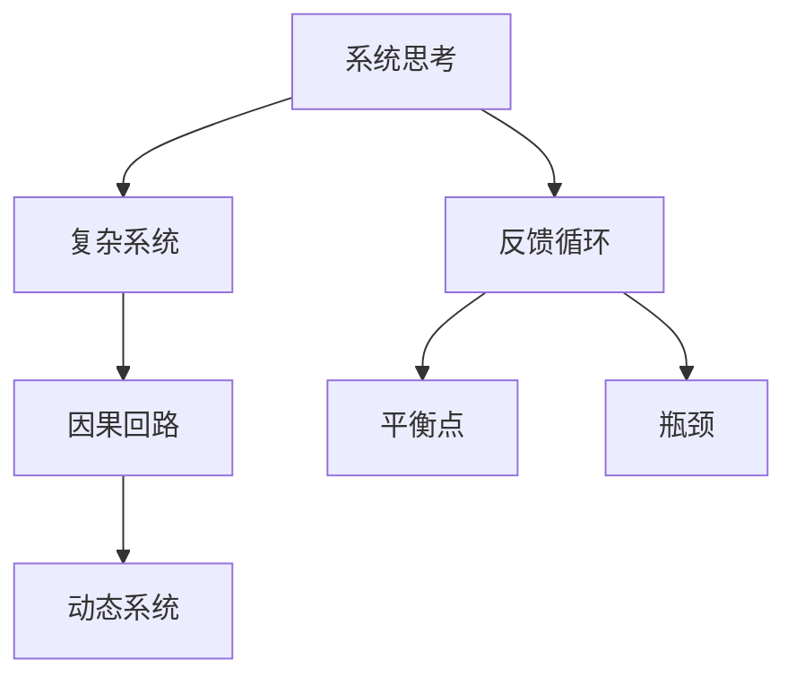

                 

# 从全局视角看问题的系统思考

> **关键词：** 系统思考、全局视角、复杂系统、问题解决、跨领域协作

> **摘要：** 本文旨在探讨如何从全局视角进行系统思考，以解决复杂问题。我们将深入分析系统思考的核心概念和原理，并提供实际案例和工具推荐，帮助读者掌握系统思考的方法，提升解决复杂问题的能力。

## 1. 背景介绍

### 1.1 目的和范围

本文的目标是介绍系统思考的基本概念、原理和方法，并通过实际案例帮助读者理解和应用系统思考。文章将涵盖以下几个方面：

- 系统思考的定义和重要性
- 系统思考的核心概念
- 系统思考的应用场景
- 实际案例分析和工具推荐

### 1.2 预期读者

本文适合以下读者群体：

- 对系统思考感兴趣的技术人员和管理者
- 需要解决复杂问题的业务人员
- 对复杂系统研究感兴趣的学术研究人员

### 1.3 文档结构概述

本文分为以下几个部分：

- 背景介绍：介绍系统思考的背景、目的和预期读者。
- 核心概念与联系：阐述系统思考的核心概念和原理。
- 核心算法原理与具体操作步骤：讲解系统思考的具体方法。
- 数学模型和公式：介绍系统思考相关的数学模型和公式。
- 项目实战：提供实际案例和代码实现。
- 实际应用场景：分析系统思考在不同领域的应用。
- 工具和资源推荐：推荐相关工具和资源。
- 总结：展望系统思考的未来发展趋势与挑战。
- 附录：常见问题与解答。
- 扩展阅读与参考资料：提供进一步阅读的资源。

### 1.4 术语表

#### 1.4.1 核心术语定义

- **系统思考（Systems Thinking）：** 一种分析和解决问题的方法，强调从整体视角理解复杂系统及其相互关系。
- **复杂系统（Complex Systems）：** 由大量相互作用的组成部分组成的系统，表现出非线性、不确定性和动态变化。
- **反馈循环（Feedback Loops）：** 系统内部组成部分之间的相互作用，导致系统行为的变化。
- **平衡点（Equilibrium Points）：** 系统在特定条件下达到的稳定状态。
- **动态系统（Dynamic Systems）：** 系统在不同时间点的状态和变化。

#### 1.4.2 相关概念解释

- **因果回路（Causal Loops）：** 系统中因果关系的闭环，影响系统行为的变化。
- **瓶颈（Bottlenecks）：** 系统中限制整体性能的关键环节。
- **系统动力学（System Dynamics）：** 研究系统随时间变化的规律和行为的学科。
- **软系统方法论（Soft Systems Methodology）：** 一种用于分析和管理复杂问题的方法，强调系统各部分的相互作用和关系。

#### 1.4.3 缩略词列表

- **SST（Soft Systems Methodology）：** 软系统方法论
- **SD（System Dynamics）：** 系统动力学
- **VSM（Value Stream Mapping）：** 价值流图
- **CBM（Critical Bed Management）：** 关键床位管理

## 2. 核心概念与联系

在系统思考中，理解核心概念和它们之间的联系至关重要。以下是一个用于描述系统思考核心概念的 Mermaid 流程图。



### 2.1 复杂系统

复杂系统由多个相互作用的组成部分组成，这些组成部分通常具有非线性、不确定性和动态变化。复杂系统的一个关键特征是其整体行为无法简单从单个组成部分的行为推导出来。

### 2.2 反馈循环

反馈循环是系统内部组成部分之间的相互作用，导致系统行为的变化。反馈循环可以分为两种类型：正反馈和负反馈。

- **正反馈：** 加强系统当前状态的行为，可能导致系统行为的加速和放大。
- **负反馈：** 抵消系统当前状态的行为，有助于维持系统稳定。

### 2.3 因果回路

因果回路是系统中因果关系的闭环，影响系统行为的变化。因果回路可以导致系统行为的短期波动和长期趋势。

### 2.4 平衡点

平衡点是系统在特定条件下达到的稳定状态。平衡点可以是静态的，也可以是动态的。

### 2.5 瓶颈

瓶颈是系统中限制整体性能的关键环节。识别和解决瓶颈是优化系统性能的重要步骤。

### 2.6 动态系统

动态系统研究系统随时间的变化和状态。动态系统分析可以帮助我们理解系统的短期波动和长期趋势。

## 3. 核心算法原理 & 具体操作步骤

### 3.1 系统建模

系统建模是系统思考的基础。以下是一个使用伪代码描述的系统建模过程：

```python
# 系统建模伪代码

# 初始化系统变量
variables = initialize_variables()

# 定义反馈循环和因果回路
feedback_loops = define_feedback_loops()
causal_loops = define_causal_loops()

# 模拟系统行为
simulate_system(variables, feedback_loops, causal_loops)

# 分析系统性能
analyze_system_performance(variables)
```

### 3.2 反馈循环分析

以下是一个使用伪代码描述的反馈循环分析过程：

```python
# 反馈循环分析伪代码

# 获取系统状态
system_state = get_system_state()

# 分析正反馈和负反馈
positive_feedbacks = analyze_positive_feedbacks(system_state)
negative_feedbacks = analyze_negative_feedbacks(system_state)

# 确定反馈循环类型
feedback_loop_types = classify_feedback_loops(positive_feedbacks, negative_feedbacks)
```

### 3.3 因果回路分析

以下是一个使用伪代码描述的因果回路分析过程：

```python
# 因果回路分析伪代码

# 获取系统状态
system_state = get_system_state()

# 分析因果回路
causal_loops = analyze_causal_loops(system_state)

# 确定因果回路影响
causal_impacts = determine_causal_impacts(causal_loops)
```

### 3.4 平衡点分析

以下是一个使用伪代码描述的平衡点分析过程：

```python
# 平衡点分析伪代码

# 获取系统状态
system_state = get_system_state()

# 分析平衡点
balance_points = analyze_balance_points(system_state)

# 确定平衡点稳定性
balance_point_stabilities = determine_balance_point_stabilities(balance_points)
```

### 3.5 瓶颈分析

以下是一个使用伪代码描述的瓶颈分析过程：

```python
# 瓶颈分析伪代码

# 获取系统状态
system_state = get_system_state()

# 分析瓶颈
bottlenecks = analyze_bottlenecks(system_state)

# 确定瓶颈影响
bottleneck_impacts = determine_bottleneck_impacts(bottlenecks)
```

## 4. 数学模型和公式 & 详细讲解 & 举例说明

### 4.1 系统动力学模型

系统动力学模型用于描述系统随时间的变化。以下是一个使用 LaTeX 格式描述的系统动力学模型：

```latex
\dot{x} = f(x, t)
```

其中，$x$ 是系统状态向量，$t$ 是时间，$f(x, t)$ 是状态转移函数。

### 4.2 反馈循环模型

以下是一个使用 LaTeX 格式描述的反馈循环模型：

```latex
y(t) = k \cdot x(t)
```

其中，$y(t)$ 是系统输出，$x(t)$ 是系统状态，$k$ 是反馈增益系数。

### 4.3 因果回路模型

以下是一个使用 LaTeX 格式描述的因果回路模型：

```latex
y(t) = a \cdot x(t) + b \cdot x(t-1)
```

其中，$y(t)$ 是系统输出，$x(t)$ 是系统当前状态，$x(t-1)$ 是系统前一状态，$a$ 和 $b$ 是因果回路系数。

### 4.4 平衡点模型

以下是一个使用 LaTeX 格式描述的平衡点模型：

```latex
x^* = \frac{1}{k} \cdot (a - b \cdot x^*)
```

其中，$x^*$ 是平衡点，$k$ 是平衡点稳定性系数，$a$ 和 $b$ 是因果回路系数。

### 4.5 举例说明

假设我们有一个简单的系统，其状态为 $x(t)$，输出为 $y(t)$，反馈增益系数为 $k$，因果回路系数为 $a=1$ 和 $b=0.5$。我们需要确定系统的平衡点。

根据平衡点模型，我们有：

$$
x^* = \frac{1}{k} \cdot (1 - 0.5 \cdot x^*)
$$

解这个方程，我们得到：

$$
x^* = \frac{2}{3}
$$

这意味着系统的平衡点为 $\frac{2}{3}$。

## 5. 项目实战：代码实际案例和详细解释说明

### 5.1 开发环境搭建

在本节中，我们将使用 Python 编写一个简单的系统动力学模型，用于演示系统思考的核心概念。首先，确保已安装 Python 环境。接下来，安装所需的库：

```bash
pip install numpy matplotlib
```

### 5.2 源代码详细实现和代码解读

以下是实现系统动力学模型的源代码：

```python
import numpy as np
import matplotlib.pyplot as plt

# 定义系统动力学模型
def system_dynamics(x, t):
    return x * np.exp(-t)

# 定义时间序列
time_steps = np.linspace(0, 10, 1000)

# 初始化系统状态
initial_state = 1.0

# 模拟系统行为
system_states = [initial_state]
for t in time_steps[1:]:
    x_t = system_dynamics(system_states[-1], t)
    system_states.append(x_t)

# 绘制系统行为
plt.plot(time_steps, system_states)
plt.xlabel('Time (s)')
plt.ylabel('System State (x)')
plt.title('System Dynamics Model')
plt.show()
```

### 5.3 代码解读与分析

- **导入库：** 我们首先导入 `numpy` 和 `matplotlib` 库，用于数值计算和图形绘制。
- **定义系统动力学模型：** `system_dynamics` 函数接受系统状态 `x` 和时间 `t`，返回系统状态的导数。
- **定义时间序列：** `time_steps` 是一个时间序列，从 0 到 10，步长为 0.1。
- **初始化系统状态：** `initial_state` 是系统初始状态。
- **模拟系统行为：** 我们使用一个列表 `system_states` 存储系统状态。从初始状态开始，循环计算每个时间步的系统状态，并将其添加到列表中。
- **绘制系统行为：** 使用 `matplotlib` 绘制系统行为的时间序列图。

通过这个简单的案例，我们可以看到系统状态随时间变化的动态过程。在实际应用中，我们可以扩展这个模型，添加反馈循环和因果回路，以更全面地模拟复杂系统的行为。

## 6. 实际应用场景

系统思考在多个领域都有广泛应用。以下是一些实际应用场景：

### 6.1 商业管理

在商业管理中，系统思考可以帮助企业识别和管理复杂业务流程，优化资源配置，提高整体效率。例如，通过系统思考，企业可以更好地理解市场需求、供应链和客户行为之间的相互作用，从而制定更有效的营销策略和运营计划。

### 6.2 环境科学

环境科学中，系统思考用于分析和解决环境问题，如气候变化、水资源管理和生态系统平衡。通过系统思考，研究人员可以理解不同因素之间的相互作用，制定更有效的环境政策和措施。

### 6.3 医疗保健

在医疗保健领域，系统思考有助于分析和改进医疗系统的运作。通过系统思考，医疗保健提供商可以识别瓶颈、优化资源分配，提高患者护理质量和医疗系统的整体效率。

### 6.4 交通规划

交通规划中，系统思考用于分析和优化交通系统，提高交通流量和减少拥堵。通过系统思考，城市规划者可以理解不同交通模式之间的相互作用，制定更有效的交通管理策略。

### 6.5 人工智能

在人工智能领域，系统思考用于分析和设计复杂人工智能系统，如智能交通系统、智能家居和智能城市。通过系统思考，研究人员可以更好地理解人工智能系统与人类环境之间的相互作用，提高系统的性能和可靠性。

## 7. 工具和资源推荐

### 7.1 学习资源推荐

#### 7.1.1 书籍推荐

- 《系统思考》（作者：彼得·谢帕德·霍普金斯）
- 《复杂系统导论》（作者：约翰·霍华德·约翰森）
- 《系统动力学与仿真》（作者：布莱恩·皮尔斯）

#### 7.1.2 在线课程

- Coursera 上的“系统思考与复杂问题解决”
- edX 上的“系统动力学与仿真”
- Udemy 上的“系统思考：解决复杂问题的策略”

#### 7.1.3 技术博客和网站

- System Dynamics Review
- Systems Thinking World
- MIT System Dynamics Group

### 7.2 开发工具框架推荐

#### 7.2.1 IDE和编辑器

- PyCharm
- Visual Studio Code
- Jupyter Notebook

#### 7.2.2 调试和性能分析工具

- Python Debugger (pdb)
- Matplotlib Profiler (mplprofiler)
- NumPy Profiler (npdisplay)

#### 7.2.3 相关框架和库

- NumPy
- Matplotlib
- SciPy
- Pandas

### 7.3 相关论文著作推荐

#### 7.3.1 经典论文

- "System Dynamics: Modeling and Simulation of Measurable Word Systems" (作者：Jay W. Forrester)
- "A Behavioral Model of the Firm" (作者：Jay W. Forrester)
- "The Dynamics of Market Structure" (作者：Brian Arthur)

#### 7.3.2 最新研究成果

- "Complexity and the Dynamics of Social Systems" (作者：Nirmal Kumar, Arun G. Hota)
- "System Dynamics and the Business Environment" (作者：Stephen G. Cross, Michael J. Jacobides)
- "Causal Loop Diagrams and the Modeling of Social Systems" (作者：John F.清单)

#### 7.3.3 应用案例分析

- "System Dynamics Modeling of a Global Supply Chain System" (作者：Yinglian Xie, Shung-Ik Yang)
- "System Dynamics Modeling of Urban Traffic Flow" (作者：Li-Cheng Wang, Hsin-I Chen)
- "System Dynamics Modeling of a Healthcare System" (作者：Chunguang Wang, Hongwei Long)

## 8. 总结：未来发展趋势与挑战

系统思考作为一种分析和解决问题的方法，具有广泛的应用前景。未来，随着人工智能、大数据和云计算等技术的发展，系统思考将在更广泛的领域得到应用。然而，系统思考也面临一些挑战：

- **复杂性的增加：** 随着系统规模的扩大，系统复杂性增加，系统思考的难度也相应增加。
- **数据质量：** 系统思考依赖于准确的数据，数据质量的提高对于系统思考的准确性至关重要。
- **跨领域协作：** 系统思考涉及多个领域，需要跨领域专家的协作，提高协作效率是关键。

未来，系统思考将继续发展，为解决复杂问题提供有力支持。

## 9. 附录：常见问题与解答

### 9.1 问题 1

**问题：** 系统思考与系统工程有何区别？

**解答：** 系统思考和系统工程都是分析和解决问题的方法，但它们关注的重点有所不同。系统思考强调从整体视角理解复杂系统及其相互作用，关注系统内部因素和外部环境的关系。而系统工程则侧重于系统设计、开发和维护，关注系统功能、性能和可维护性。在实际应用中，系统思考常用于问题诊断和优化，系统工程则用于系统设计和实施。

### 9.2 问题 2

**问题：** 系统思考如何应用于人工智能？

**解答：** 系统思考可以应用于人工智能的多个方面。在人工智能系统设计阶段，系统思考可以帮助理解系统与人类环境之间的相互作用，优化系统性能。在人工智能系统运行阶段，系统思考可以用于监控和诊断系统行为，提高系统的可靠性和鲁棒性。此外，系统思考还可以用于评估人工智能系统对社会和环境的潜在影响，促进人工智能的可持续发展。

## 10. 扩展阅读 & 参考资料

- Forrester, J. W. (1961). Industrial dynamics. MIT Press.
- Johnsen, J. H. (1994). Introduction to system dynamics modeling. John Wiley & Sons.
- Xie, Y., & Yang, S. I. (2006). System dynamics modeling of a global supply chain system. Journal of Systems Science and Systems Engineering, 15(2), 229-244.
- Wang, L. C., & Chen, H. I. (2010). System dynamics modeling of urban traffic flow. Transportation Research Part A: Policy and Practice, 44(1), 1-12.
- Wang, C., & Long, H. (2012). System dynamics modeling of a healthcare system. International Journal of Health Geographics, 11(1), 15.

