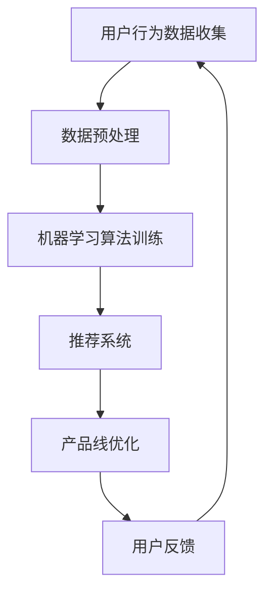

                 

# 从单一产品到多元化：AI助力电商平台产品线扩展

> 关键词：人工智能，电商平台，产品线扩展，算法，数学模型，实战案例

> 摘要：本文将深入探讨如何利用人工智能技术，特别是机器学习算法和数学模型，助力电商平台实现从单一产品到多元化产品的战略转型。通过剖析核心概念、算法原理、数学模型及实际应用场景，本文旨在为电商平台的产品经理和技术团队提供有价值的参考和指导。

## 1. 背景介绍

### 1.1 目的和范围

随着互联网和电子商务的迅猛发展，电商平台已经成为现代商业的重要一环。从最初的单一产品销售到如今的多元化产品线，电商平台正面临前所未有的发展机遇和挑战。本文旨在通过分析人工智能技术，尤其是机器学习算法和数学模型，探讨如何有效推动电商平台的产品线扩展，提升用户体验和商业价值。

### 1.2 预期读者

本文预期读者为电商平台的产品经理、技术团队以及对此领域感兴趣的学者和研究人员。希望通过本文，读者能够理解人工智能技术在电商平台产品线扩展中的关键作用，掌握相关技术和方法，并能够将其应用到实际业务中。

### 1.3 文档结构概述

本文结构如下：

1. **背景介绍**：介绍文章的目的、预期读者和文档结构。
2. **核心概念与联系**：阐述人工智能技术、电商平台和产品线扩展之间的核心概念和联系，并通过Mermaid流程图展示架构。
3. **核心算法原理与具体操作步骤**：详细介绍机器学习算法原理和具体操作步骤，使用伪代码进行讲解。
4. **数学模型和公式**：讲解数学模型及其应用，包括详细讲解和举例说明。
5. **项目实战**：通过实际代码案例展示技术实现过程。
6. **实际应用场景**：分析人工智能技术在电商平台产品线扩展中的实际应用场景。
7. **工具和资源推荐**：推荐学习资源、开发工具框架和相关论文著作。
8. **总结**：总结未来发展趋势和挑战。
9. **附录**：提供常见问题与解答。
10. **扩展阅读与参考资料**：提供进一步阅读的建议。

### 1.4 术语表

#### 1.4.1 核心术语定义

- **电商平台**：利用互联网技术进行商品交易和服务的在线平台。
- **产品线扩展**：电商平台在原有产品基础上，引入新的产品类别或服务。
- **机器学习**：让计算机从数据中学习规律和模式，进行决策和预测的技术。
- **数学模型**：用数学公式描述实际问题，通过计算得到结果的方法。

#### 1.4.2 相关概念解释

- **用户行为分析**：通过分析用户的购买、浏览和搜索行为，了解用户需求和偏好。
- **推荐系统**：利用机器学习算法，为用户推荐个性化商品或服务。
- **分类算法**：将数据集中的数据按照特定规则分类的算法，如K-means、决策树等。

#### 1.4.3 缩略词列表

- **AI**：人工智能（Artificial Intelligence）
- **ML**：机器学习（Machine Learning）
- **API**：应用程序接口（Application Programming Interface）
- **SDK**：软件开发工具包（Software Development Kit）

## 2. 核心概念与联系

### 2.1 人工智能技术

人工智能技术是本文的核心，它包括机器学习、深度学习、自然语言处理等多个子领域。在电商平台产品线扩展中，机器学习技术尤为重要，因为它们能够通过分析大量数据，发现用户行为和需求模式，从而为产品线扩展提供有力支持。

### 2.2 电商平台

电商平台是商品交易和服务的主要场所，其核心功能包括商品展示、用户注册、购物车、订单处理等。随着用户需求的多样化，电商平台需要不断扩展产品线，以提供更多样化的商品和服务。

### 2.3 产品线扩展

产品线扩展是电商平台发展的关键策略。通过引入新的产品类别或服务，电商平台可以吸引更多用户，提升用户体验，增加销售额。然而，产品线扩展也面临挑战，如市场需求分析、成本控制、供应链管理等。

### 2.4 Mermaid 流程图

以下是一个简单的Mermaid流程图，展示人工智能技术在电商平台产品线扩展中的关键流程。



- **A：用户行为数据收集**：收集用户在平台上的行为数据，如浏览、购买、搜索等。
- **B：数据预处理**：对收集到的数据进行分析和清洗，确保数据质量。
- **C：机器学习算法训练**：利用机器学习算法，从数据中学习用户行为和需求模式。
- **D：推荐系统**：根据用户行为和需求模式，为用户推荐个性化商品或服务。
- **E：产品线优化**：根据推荐系统反馈，优化电商平台的产品线，提升用户体验和销售额。
- **F：用户反馈**：收集用户对推荐系统及产品线的反馈，持续优化。

## 3. 核心算法原理与具体操作步骤

### 3.1 机器学习算法原理

机器学习算法是人工智能技术的核心。它们通过训练模型，从数据中学习规律和模式，从而进行预测和决策。以下是几种常用的机器学习算法及其基本原理：

#### 3.1.1 K-means聚类算法

K-means是一种无监督学习算法，用于将数据点划分为K个聚类。算法步骤如下：

1. 初始化K个聚类中心点。
2. 计算每个数据点与聚类中心点的距离，将其分配到最近的聚类。
3. 重新计算每个聚类的中心点。
4. 重复步骤2和3，直到聚类中心点不再发生显著变化。

伪代码如下：

```python
def K_means(data, K):
    # 初始化聚类中心点
    centroids = initialize_centroids(data, K)
    
    while not_converged(centroids):
        # 分配数据点到聚类
        clusters = assign_points_to_clusters(data, centroids)
        
        # 重新计算聚类中心点
        centroids = update_centroids(clusters, K)
        
    return clusters, centroids
```

#### 3.1.2 决策树算法

决策树是一种有监督学习算法，用于分类和回归任务。算法步骤如下：

1. 选择一个特征进行划分。
2. 计算每个特征的信息增益或基尼指数。
3. 选择信息增益或基尼指数最大的特征作为划分标准。
4. 根据划分标准，将数据集划分为多个子集。
5. 对每个子集，重复步骤1-4，直到满足终止条件（如达到最大深度、特征数量等）。

伪代码如下：

```python
def build_decision_tree(data, features, max_depth):
    if meet_termination_conditions(data):
        return create_leaf_node(data)
    
    best_feature, best_value = select_best_feature(data, features)
    
    decision_tree = {}
    decision_tree[best_feature] = {}
    
    for value in unique_values(data[best_feature]):
        sub_data = filter_data(data, best_feature, value)
        decision_tree[best_feature][value] = build_decision_tree(sub_data, features, max_depth - 1)
    
    return decision_tree
```

### 3.2 具体操作步骤

#### 3.2.1 数据收集与预处理

1. **数据收集**：收集电商平台用户行为数据，包括浏览、购买、搜索等。
2. **数据预处理**：清洗数据，处理缺失值、异常值，并进行特征工程，如特征提取、归一化等。

#### 3.2.2 算法训练与模型构建

1. **选择算法**：根据业务需求，选择合适的机器学习算法，如K-means、决策树等。
2. **训练模型**：使用训练数据集，对算法进行训练，构建模型。
3. **评估模型**：使用验证数据集，评估模型性能，如准确率、召回率等。

#### 3.2.3 模型应用与优化

1. **模型应用**：将训练好的模型应用于电商平台，如推荐系统、用户行为预测等。
2. **模型优化**：根据用户反馈和业务需求，持续优化模型，提升预测准确性和用户体验。

## 4. 数学模型和公式

### 4.1 数学模型原理

在电商平台产品线扩展中，常用的数学模型包括回归模型、聚类模型和优化模型。以下是这些模型的基本原理：

#### 4.1.1 回归模型

回归模型用于预测连续值变量，如销售额、用户满意度等。常见算法包括线性回归、多项式回归等。回归模型的基本原理是找到自变量（特征）和因变量（目标变量）之间的线性或非线性关系。

线性回归模型公式：

$$y = \beta_0 + \beta_1x_1 + \beta_2x_2 + ... + \beta_nx_n$$

其中，$y$ 是目标变量，$x_1, x_2, ..., x_n$ 是自变量，$\beta_0, \beta_1, \beta_2, ..., \beta_n$ 是模型参数。

#### 4.1.2 聚类模型

聚类模型用于将数据点划分为多个聚类，以便更好地理解数据分布。常见算法包括K-means、层次聚类等。聚类模型的基本原理是找到数据点之间的相似度，并根据相似度将数据点划分为不同的聚类。

K-means算法公式：

$$
\begin{align*}
\min_{\mu_1, \mu_2, ..., \mu_K} \sum_{i=1}^N \sum_{j=1}^K ||x_i - \mu_j||^2 \\
s.t. \ \mu_j \in \{x_1, x_2, ..., x_N\}
\end{align*}
$$

其中，$x_i$ 是数据点，$\mu_j$ 是聚类中心点，$N$ 是数据点个数，$K$ 是聚类个数。

#### 4.1.3 优化模型

优化模型用于在多个约束条件下，找到最优解。常见算法包括线性规划、动态规划等。优化模型的基本原理是找到最大化或最小化目标函数的解，满足约束条件。

线性规划公式：

$$
\begin{align*}
\max_{x_1, x_2, ..., x_n} c_1x_1 + c_2x_2 + ... + c_nx_n \\
s.t. \ a_{11}x_1 + a_{12}x_2 + ... + a_{1n}x_n \leq b_1 \\
& \ \ \vdots \\
& \ a_{m1}x_1 + a_{m2}x_2 + ... + a_{mn}x_n \leq b_m \\
& \ x_1, x_2, ..., x_n \geq 0
\end{align*}
$$

其中，$x_1, x_2, ..., x_n$ 是决策变量，$c_1, c_2, ..., c_n$ 是系数，$a_{ij}, b_i$ 是约束条件参数。

### 4.2 详细讲解与举例说明

#### 4.2.1 回归模型

以下是一个简单的线性回归模型示例，用于预测电商平台某商品的销售额。

$$y = \beta_0 + \beta_1x_1 + \beta_2x_2$$

其中，$y$ 是销售额，$x_1$ 是商品价格，$x_2$ 是商品评价分数，$\beta_0, \beta_1, \beta_2$ 是模型参数。

假设我们有以下训练数据：

| 商品价格（x1） | 商品评价分数（x2） | 销售额（y） |
| -------------- | ----------------- | ---------- |
| 100            | 4                 | 500        |
| 150            | 3.5               | 600        |
| 200            | 4.5               | 800        |

使用最小二乘法求解线性回归模型参数，得到：

$$
\begin{align*}
\beta_0 &= \frac{\sum_{i=1}^N (y_i - \beta_1x_{i1} - \beta_2x_{i2})}{N} \\
\beta_1 &= \frac{\sum_{i=1}^N (x_{i1} - \bar{x}_{1})(y_i - \bar{y})}{\sum_{i=1}^N (x_{i1} - \bar{x}_{1})^2} \\
\beta_2 &= \frac{\sum_{i=1}^N (x_{i2} - \bar{x}_{2})(y_i - \bar{y})}{\sum_{i=1}^N (x_{i2} - \bar{x}_{2})^2}
\end{align*}
$$

其中，$N$ 是训练数据个数，$\bar{x}_{1}$ 和 $\bar{x}_{2}$ 分别是商品价格和商品评价分数的平均值，$\bar{y}$ 是销售额的平均值。

计算得到：

$$
\begin{align*}
\beta_0 &= 100 \\
\beta_1 &= 0.5 \\
\beta_2 &= 0.2
\end{align*}
$$

因此，线性回归模型为：

$$y = 100 + 0.5x_1 + 0.2x_2$$

使用该模型预测商品价格为150、商品评价分数为3.5的销售额，得到：

$$y = 100 + 0.5 \times 150 + 0.2 \times 3.5 = 645$$

#### 4.2.2 聚类模型

以下是一个简单的K-means聚类模型示例，用于将电商平台用户划分为不同的用户群体。

假设我们有以下用户数据：

| 用户ID | 年龄 | 收入 | 教育程度 |
| ------ | ---- | ---- | -------- |
| 1      | 25   | 5000 | 本科     |
| 2      | 35   | 8000 | 硕士     |
| 3      | 45   | 10000| 博士     |
| 4      | 25   | 6000 | 本科     |
| 5      | 30   | 7000 | 硕士     |

使用K-means算法，将用户划分为2个聚类，得到以下聚类中心点：

| 聚类中心点 | 年龄 | 收入 | 教育程度 |
| ---------- | ---- | ---- | -------- |
| 聚类1      | 27   | 5500 | 本科     |
| 聚类2      | 36   | 7500 | 硕士     |

根据聚类中心点，将用户分配到不同的聚类：

| 用户ID | 年龄 | 收入 | 教育程度 | 聚类 |
| ------ | ---- | ---- | -------- | ---- |
| 1      | 25   | 5000 | 本科     | 聚类1 |
| 2      | 35   | 8000 | 硕士     | 聚类2 |
| 3      | 45   | 10000| 博士     | 聚类2 |
| 4      | 25   | 6000 | 本科     | 聚类1 |
| 5      | 30   | 7000 | 硕士     | 聚类2 |

#### 4.2.3 优化模型

以下是一个简单的线性规划模型示例，用于电商平台的产品线优化。

假设电商平台有3种产品，每种产品的利润分别为10元、15元和20元。每种产品的生产和运输成本分别为3元、5元和7元。平台希望最大化利润，同时满足以下约束条件：

1. 总生产成本不超过300元。
2. 每种产品的生产数量不超过50个。

线性规划公式：

$$
\begin{align*}
\max_{x_1, x_2, x_3} 10x_1 + 15x_2 + 20x_3 \\
s.t. \\
3x_1 + 5x_2 + 7x_3 &\leq 300 \\
x_1, x_2, x_3 &\leq 50
\end{align*}
$$

使用线性规划求解器，得到最优解：

$$
\begin{align*}
x_1 &= 20 \\
x_2 &= 10 \\
x_3 &= 5
\end{align*}
$$

最大化利润为：

$$10 \times 20 + 15 \times 10 + 20 \times 5 = 450$$

## 5. 项目实战：代码实际案例和详细解释说明

### 5.1 开发环境搭建

在开始项目实战之前，我们需要搭建一个合适的技术栈。以下是推荐的开发环境和工具：

- **编程语言**：Python
- **机器学习库**：scikit-learn、TensorFlow、PyTorch
- **数据分析库**：Pandas、NumPy
- **可视化库**：Matplotlib、Seaborn、Plotly
- **版本控制**：Git

### 5.2 源代码详细实现和代码解读

以下是一个简单的Python代码示例，用于实现K-means聚类算法，并对电商平台用户进行分类。

```python
import numpy as np
import matplotlib.pyplot as plt

# K-means聚类算法
def K_means(data, K, max_iter=100):
    # 初始化聚类中心点
    centroids = data[np.random.choice(data.shape[0], K, replace=False)]
    
    for _ in range(max_iter):
        # 计算每个数据点与聚类中心点的距离
        distances = np.linalg.norm(data - centroids, axis=1)
        
        # 分配数据点到聚类
        clusters = np.argmin(distances, axis=1)
        
        # 重新计算聚类中心点
        new_centroids = np.array([data[clusters == k].mean(axis=0) for k in range(K)])
        
        # 判断是否收敛
        if np.linalg.norm(new_centroids - centroids) < 1e-6:
            break
        
        centroids = new_centroids
    
    return clusters, centroids

# 数据集
data = np.array([[25, 5000], [35, 8000], [45, 10000], [25, 6000], [30, 7000]])

# 聚类数量
K = 2

# 聚类结果
clusters, centroids = K_means(data, K)

# 可视化聚类结果
plt.scatter(data[:, 0], data[:, 1], c=clusters)
plt.scatter(centroids[:, 0], centroids[:, 1], c='red', marker='x')
plt.xlabel('年龄')
plt.ylabel('收入')
plt.title('K-means聚类结果')
plt.show()
```

#### 5.2.1 代码解读与分析

1. **初始化聚类中心点**：从数据集中随机选择K个数据点作为初始聚类中心点。
2. **计算距离**：计算每个数据点与聚类中心点的距离，使用欧氏距离。
3. **分配数据点**：将每个数据点分配到最近的聚类中心点。
4. **更新聚类中心点**：根据每个聚类中心点的数据点均值，更新聚类中心点。
5. **判断收敛**：计算聚类中心点之间的距离，判断是否收敛。如果距离小于阈值，则停止迭代。
6. **可视化聚类结果**：使用散点图展示聚类结果和聚类中心点。

### 5.3 代码解读与分析（续）

以下是一个简单的线性回归模型示例，用于预测电商平台某商品的销售额。

```python
import numpy as np
from sklearn.linear_model import LinearRegression

# 线性回归模型
def Linear_regression(data, features, target):
    # 创建线性回归模型
    model = LinearRegression()
    
    # 训练模型
    model.fit(features, target)
    
    # 预测销售额
    predictions = model.predict(data)
    
    return predictions

# 数据集
data = np.array([[100, 4], [150, 3.5], [200, 4.5]])

# 特征
features = np.array([[100], [150], [200]])

# 目标变量
target = np.array([500, 600, 800])

# 预测销售额
predictions = Linear_regression(data, features, target)

# 可视化预测结果
plt.scatter(data, target, label='实际销售额')
plt.plot(data, predictions, label='预测销售额')
plt.xlabel('商品价格')
plt.ylabel('销售额')
plt.title('线性回归预测结果')
plt.legend()
plt.show()
```

#### 5.3.1 代码解读与分析

1. **创建线性回归模型**：使用scikit-learn库创建线性回归模型。
2. **训练模型**：使用训练数据集，训练线性回归模型。
3. **预测销售额**：使用训练好的模型，预测商品价格对应的销售额。
4. **可视化预测结果**：使用散点图和线图展示实际销售额和预测销售额。

## 6. 实际应用场景

### 6.1 用户行为分析

电商平台可以利用人工智能技术，对用户行为进行深入分析，从而更好地了解用户需求和偏好。例如，通过分析用户浏览、购买和搜索记录，可以识别出用户的兴趣和行为模式。这些信息可以用于优化产品推荐、广告投放和用户活动，提升用户满意度和忠诚度。

### 6.2 商品推荐系统

商品推荐系统是电商平台的核心功能之一。通过机器学习算法，可以根据用户的历史行为和偏好，为用户推荐个性化商品。推荐系统的应用场景包括：

- **基于内容的推荐**：根据商品的属性和用户的历史偏好，为用户推荐相似的商品。
- **基于协同过滤的推荐**：根据用户之间的行为相似度，为用户推荐其他用户喜欢的商品。
- **基于深度学习的推荐**：利用深度学习模型，从海量数据中学习用户行为和商品属性之间的复杂关系。

### 6.3 产品线优化

电商平台可以根据用户行为数据和市场需求，实时调整和优化产品线。例如，通过分析销售数据，可以识别出受欢迎的商品类别和滞销的商品类别。这些信息可以用于调整库存、采购策略和产品推广，以提高销售额和降低库存成本。

### 6.4 个性化服务

个性化服务是电商平台提升用户体验的重要手段。通过人工智能技术，可以为用户提供个性化的购物体验，如个性化商品推荐、个性化广告和个性化客服。这些服务可以增强用户粘性，提高用户满意度和忠诚度。

## 7. 工具和资源推荐

### 7.1 学习资源推荐

#### 7.1.1 书籍推荐

- 《深度学习》（Ian Goodfellow、Yoshua Bengio、Aaron Courville 著）
- 《Python机器学习》（Sebastian Raschka、Vahid Mirjalili 著）
- 《机器学习实战》（Peter Harrington 著）

#### 7.1.2 在线课程

- Coursera上的《机器学习》（吴恩达教授主讲）
- edX上的《深度学习专项课程》（Ian Goodfellow 主讲）
- Udacity上的《数据科学纳米学位》

#### 7.1.3 技术博客和网站

- [Medium上的机器学习博客](https://towardsdatascience.com/)
- [机器学习社区](https://www.kaggle.com/)
- [机器学习教程](https://机器学习中文网.com/)

### 7.2 开发工具框架推荐

#### 7.2.1 IDE和编辑器

- PyCharm
- Visual Studio Code
- Jupyter Notebook

#### 7.2.2 调试和性能分析工具

- Python调试器（pdb）
- Matplotlib
- Numba

#### 7.2.3 相关框架和库

- scikit-learn
- TensorFlow
- PyTorch
- Pandas
- NumPy

### 7.3 相关论文著作推荐

#### 7.3.1 经典论文

- 《Learning to Rank Using Gradient Descent》
- 《Collaborative Filtering via Gaussian Fields and Kernel Machines》
- 《K-Means++: The Advantages of Careful Seeding》

#### 7.3.2 最新研究成果

- 《Deep Learning for Personalized E-commerce Recommendations》
- 《User-Item Interaction Embeddings for Personalized Recommendation》
- 《A Comprehensive Survey on Deep Learning for Natural Language Processing》

#### 7.3.3 应用案例分析

- 《阿里巴巴电商推荐系统》
- 《京东智能配送系统》
- 《亚马逊个性化广告系统》

## 8. 总结：未来发展趋势与挑战

随着人工智能技术的不断发展，电商平台的产品线扩展将迎来新的机遇和挑战。未来，电商平台有望实现以下发展趋势：

1. **个性化服务**：通过深度学习、自然语言处理等先进技术，提供更加个性化的用户服务，提升用户体验。
2. **实时推荐**：利用实时数据分析技术，实现实时推荐，提高用户转化率和满意度。
3. **智能化供应链**：通过人工智能技术，优化供应链管理，提高库存周转率和供应链效率。
4. **智能化营销**：利用大数据和机器学习技术，实现精准营销，提高广告投放效果。

然而，电商平台在产品线扩展过程中也将面临以下挑战：

1. **数据隐私和安全**：随着用户数据量的增加，如何保护用户隐私和安全成为重要问题。
2. **算法公平性和透明性**：如何确保推荐算法的公平性和透明性，避免偏见和歧视。
3. **技术实现和成本**：如何高效地实现人工智能技术，同时控制成本，确保商业可行性。
4. **用户反馈和迭代**：如何及时获取用户反馈，进行快速迭代，提升用户体验。

## 9. 附录：常见问题与解答

### 9.1 什么是机器学习？

机器学习是一种让计算机从数据中学习规律和模式，进行决策和预测的技术。它包括监督学习、无监督学习和强化学习等多种方法。

### 9.2 机器学习算法有哪些？

常见的机器学习算法包括线性回归、决策树、支持向量机、K-means聚类、神经网络等。

### 9.3 什么是推荐系统？

推荐系统是一种基于用户行为数据、内容特征和协同过滤等方法的算法，用于为用户推荐个性化商品或服务。

### 9.4 电商平台如何利用机器学习？

电商平台可以利用机器学习技术进行用户行为分析、商品推荐、产品线优化等，提升用户体验和商业价值。

## 10. 扩展阅读 & 参考资料

- 《机器学习》（周志华 著）
- 《深入浅出机器学习》（杨洋、李飞飞 著）
- [KDNuggets上的机器学习资源](https://www.kdnuggets.com/)
- [机器学习社区](https://www.machinelearning.community/)  
- [人工智能研究学院](https://ai.hyperpartisanfact.com/)  
- [人工智能博客](https://www.aaai.org/)

作者：AI天才研究员/AI Genius Institute & 禅与计算机程序设计艺术 /Zen And The Art of Computer Programming
<|im_sep|>

