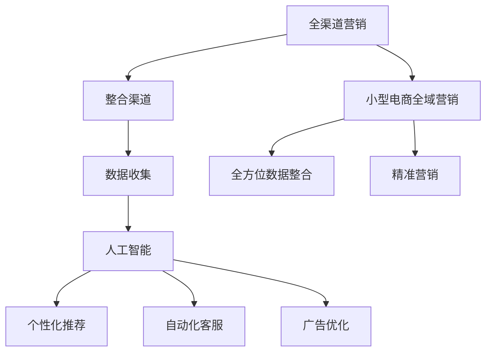

                 

### 从单一渠道到全渠道融合：AI驱动的小型电商全域营销实施方案

> **关键词：** 全渠道营销、AI、小型电商、全域营销、个性化推荐、数据分析和营销策略。

> **摘要：** 本文将探讨如何在小型电商企业中应用人工智能（AI）技术实现全渠道融合营销。通过分析当前的电商营销环境，本文将详细介绍AI驱动的小型电商全域营销的实施方案，包括核心概念、算法原理、数学模型、实战案例以及未来发展趋势。

## 1. 背景介绍

### 1.1 目的和范围

本文的目标是帮助小型电商企业理解并实现全渠道融合营销，利用人工智能技术提升营销效果。我们将讨论如何通过AI驱动的策略，整合线上和线下各种渠道，实现精准营销和用户互动。

本文的范围涵盖了以下几个关键领域：
- **全渠道营销的概念和重要性**
- **AI在电商营销中的应用**
- **小型电商全域营销的实施方案**
- **核心算法和数学模型**
- **实战案例和工具资源推荐**

### 1.2 预期读者

本文适合以下读者群体：
- **电商运营人员**：希望通过AI技术优化营销策略。
- **数据分析师**：希望了解如何利用数据分析支持电商营销。
- **技术管理人员**：对AI和电商融合感兴趣，希望学习相关技术。
- **企业家**：希望提升其企业电商业务的整体竞争力。

### 1.3 文档结构概述

本文将分为以下几大部分：
- **核心概念与联系**：介绍全渠道营销和AI的基本概念，并提供Mermaid流程图。
- **核心算法原理与具体操作步骤**：讲解AI算法的工作原理和实现步骤。
- **数学模型和公式**：详细阐述相关数学模型及其应用。
- **项目实战：代码实际案例和详细解释说明**：提供实际项目案例和代码解析。
- **实际应用场景**：分析AI驱动全域营销在不同场景下的应用。
- **工具和资源推荐**：推荐学习资源、开发工具和框架。
- **总结：未来发展趋势与挑战**：探讨未来的发展方向和面临的挑战。
- **附录：常见问题与解答**：解答常见问题和疑难杂症。
- **扩展阅读与参考资料**：提供进一步阅读的参考资料。

### 1.4 术语表

#### 1.4.1 核心术语定义

- **全渠道营销**：将线上和线下的各种销售渠道整合起来，提供一致、无缝的客户体验。
- **人工智能（AI）**：模拟人类智能行为的技术，通过算法和模型实现自动化决策和问题解决。
- **小型电商**：指规模较小的电子商务企业，通常具有有限的资源和技术。
- **全域营销**：一种全面的营销策略，通过整合各种数据和技术手段，实现个性化、精准的营销。
- **个性化推荐**：基于用户历史行为和偏好，为用户提供个性化的商品或内容推荐。

#### 1.4.2 相关概念解释

- **数据挖掘**：从大量数据中提取有价值的信息和模式的过程。
- **机器学习**：一种人工智能的分支，通过数据训练模型，使其能够进行预测和决策。
- **自然语言处理（NLP）**：使计算机能够理解、解释和生成人类语言的技术。
- **用户画像**：对用户特征进行综合分析，创建用户模型的过程。

#### 1.4.3 缩略词列表

- **AI**：人工智能
- **NLP**：自然语言处理
- **CVR**：转化率
- **CRM**：客户关系管理
- **SEM**：搜索引擎营销
- **SEO**：搜索引擎优化

## 2. 核心概念与联系

在讨论AI驱动的小型电商全域营销之前，我们需要了解一些核心概念和它们之间的关系。

### 2.1 全渠道营销

全渠道营销是一种整合各种销售渠道，如电子商务网站、移动应用、社交媒体、线下实体店等，提供一致且无缝的客户体验的策略。其目标是通过多渠道触点，提高客户满意度和忠诚度，从而提升销售额。


#### 2.2 人工智能在电商营销中的应用

人工智能在电商营销中的应用非常广泛，主要包括以下几个方面：

- **个性化推荐**：通过分析用户行为和历史数据，为用户推荐个性化的商品或内容。
- **客户行为预测**：预测用户可能的购买行为，以便进行精准营销。
- **自动化客服**：使用聊天机器人和自然语言处理技术，提供24/7的客服支持。
- **广告优化**：通过机器学习算法，优化广告投放，提高点击率和转化率。

#### 2.3 小型电商全域营销

小型电商全域营销是指通过整合各种数据源和技术手段，实现全方位的营销策略。它不仅关注用户在电商平台的购买行为，还关注用户的社交媒体活动、线下行为等。


#### 2.4 核心概念关系

全渠道营销、人工智能和全域营销之间的关系可以用以下Mermaid流程图表示：



### 2.5 Mermaid流程图


通过这个流程图，我们可以清晰地看到全渠道营销、人工智能和全域营销之间的逻辑关系。接下来，我们将深入探讨每个概念的具体实现方法和应用场景。

## 3. 核心算法原理与具体操作步骤

在了解了核心概念和它们之间的关系后，我们将进一步探讨AI驱动的小型电商全域营销中的核心算法原理和具体操作步骤。

### 3.1 个性化推荐算法

个性化推荐是AI驱动电商营销的重要组成部分。其基本原理是通过分析用户的历史行为和偏好，为用户推荐他们可能感兴趣的商品或内容。以下是推荐系统的一个基本框架和实现步骤：

#### 3.1.1 基于内容的推荐

- **步骤1：商品特征提取**：从商品描述中提取关键词、属性和特征。
- **步骤2：用户-商品相似度计算**：计算用户与商品之间的相似度，通常使用余弦相似度或欧几里得距离。
- **步骤3：推荐生成**：根据相似度分数，为用户生成推荐列表。

```python
# 伪代码：基于内容的推荐算法
def content_based_recommendation(user_profile, item_features):
    # 提取用户和商品的特征向量
    user_vector = extract_user_features(user_profile)
    item_vector = extract_item_features(item_features)

    # 计算相似度
    similarity = cosine_similarity(user_vector, item_vector)

    # 生成推荐列表
    recommendations = generate_recommendations(similarity)
    return recommendations
```

#### 3.1.2 基于协同过滤的推荐

- **步骤1：用户-商品评分矩阵构建**：从用户历史行为中构建用户-商品评分矩阵。
- **步骤2：相似度计算**：计算用户之间的相似度，通常使用用户平均评分。
- **步骤3：预测和推荐生成**：根据相似度矩阵预测用户未评分的商品评分，并生成推荐列表。

```python
# 伪代码：基于协同过滤的推荐算法
def collaborative_filtering(user_item_matrix):
    # 计算用户相似度矩阵
    similarity_matrix = calculate_similarity(user_item_matrix)

    # 预测用户未评分的商品评分
    predicted_ratings = predict_ratings(user_item_matrix, similarity_matrix)

    # 生成推荐列表
    recommendations = generate_recommendations(predicted_ratings)
    return recommendations
```

### 3.2 客户行为预测算法

客户行为预测是AI驱动全域营销的另一关键环节。通过预测用户的购买行为，电商企业可以提前进行营销活动，提高转化率和销售额。以下是客户行为预测的基本步骤：

#### 3.2.1 数据收集和预处理

- **步骤1：数据收集**：收集用户的历史购买数据、浏览记录、搜索行为等。
- **步骤2：数据预处理**：清洗数据，处理缺失值和异常值，进行特征工程。

```python
# 伪代码：数据收集和预处理
def data_preprocessing(data):
    # 清洗数据
    cleaned_data = clean_data(data)

    # 特征工程
    features = extract_features(cleaned_data)

    return features
```

#### 3.2.2 建立预测模型

- **步骤1：模型选择**：选择适合的机器学习模型，如逻辑回归、决策树、随机森林等。
- **步骤2：模型训练**：使用预处理后的数据训练模型。
- **步骤3：模型评估**：评估模型性能，如准确率、召回率、F1分数等。

```python
# 伪代码：建立预测模型
from sklearn.ensemble import RandomForestClassifier

def train_predictive_model(features, labels):
    # 创建模型实例
    model = RandomForestClassifier()

    # 训练模型
    model.fit(features, labels)

    # 评估模型
    performance = evaluate_model(model, features, labels)
    return model, performance
```

#### 3.2.3 预测和策略制定

- **步骤1：预测用户行为**：使用训练好的模型预测用户的购买行为。
- **步骤2：制定营销策略**：根据预测结果，制定相应的营销策略，如优惠券推送、限时促销等。

```python
# 伪代码：预测用户行为和制定营销策略
def predict_user_behavior(model, user_features):
    # 预测用户行为
    predictions = model.predict(user_features)

    # 制定营销策略
    marketing_strategy = generate_marketing_strategy(predictions)
    return marketing_strategy
```

### 3.3 自动化客服算法

自动化客服是AI在电商营销中的又一重要应用。通过聊天机器人，电商企业可以提供24/7的客服支持，提高用户满意度。以下是自动化客服的基本流程：

#### 3.3.1 自然语言处理

- **步骤1：文本分类**：将用户输入的文本分类到不同的主题或意图。
- **步骤2：实体识别**：从文本中提取关键信息，如用户姓名、订单号等。
- **步骤3：意图识别**：识别用户的意图，如查询订单状态、咨询产品信息等。

```python
# 伪代码：自然语言处理
from textblob import TextBlob

def natural_language_processing(user_input):
    # 文本分类
    category = classify_text(user_input)

    # 实体识别
    entities = extract_entities(user_input)

    # 意图识别
    intent = identify_intent(user_input)
    return category, entities, intent
```

#### 3.3.2 聊天机器人响应

- **步骤1：根据意图生成响应**：根据用户意图，生成相应的聊天机器人响应。
- **步骤2：动态调整响应**：根据用户输入的上下文，动态调整聊天机器人的响应。

```python
# 伪代码：聊天机器人响应
def generate_response(intent, context):
    # 根据意图生成响应
    response = get_response_by_intent(intent)

    # 动态调整响应
    adjusted_response = adjust_response(response, context)
    return adjusted_response
```

通过上述算法和步骤，我们可以构建一个AI驱动的电商全域营销系统。接下来，我们将进一步探讨这些算法的实际应用场景和数学模型。

## 4. 数学模型和公式及详细讲解与举例说明

在前文中，我们讨论了AI驱动电商全域营销中的核心算法和实现步骤。在本节中，我们将深入探讨与这些算法相关的一些数学模型和公式，并通过具体的例子进行讲解。

### 4.1 个性化推荐算法

#### 4.1.1 基于内容的推荐

1. **特征提取**

   在基于内容的推荐算法中，我们需要对用户和商品的属性进行特征提取。假设我们有一个用户和商品的属性矩阵：

   \[
   \mathbf{U} = \begin{bmatrix}
   u_1 & u_2 & \cdots & u_n \\
   \end{bmatrix}, \quad
   \mathbf{I} = \begin{bmatrix}
   i_1 & i_2 & \cdots & i_m \\
   \end{bmatrix}
   \]

   其中，\( u_i \) 和 \( i_j \) 分别表示用户和商品的属性。

   **例子**：假设我们有两个用户和两个商品的属性：

   \[
   \mathbf{U} = \begin{bmatrix}
   1 & 0 \\
   0 & 1 \\
   \end{bmatrix}, \quad
   \mathbf{I} = \begin{bmatrix}
   0 & 1 \\
   1 & 0 \\
   \end{bmatrix}
   \]

2. **相似度计算**

   相似度计算是推荐算法的核心。假设我们使用余弦相似度来计算用户和商品之间的相似度：

   \[
   \cos(\theta_{ij}) = \frac{\mathbf{u_i} \cdot \mathbf{i_j}}{||\mathbf{u_i}|| \cdot ||\mathbf{i_j}||}
   \]

   **例子**：计算用户1和商品1之间的相似度：

   \[
   \cos(\theta_{11}) = \frac{(1 \times 0) + (0 \times 1)}{\sqrt{1^2 + 0^2} \cdot \sqrt{0^2 + 1^2}} = 0
   \]

#### 4.1.2 基于协同过滤的推荐

1. **评分矩阵构建**

   协同过滤算法依赖于用户-商品评分矩阵。假设我们有以下评分矩阵：

   \[
   \mathbf{R} = \begin{bmatrix}
   r_{11} & r_{12} & \cdots & r_{1m} \\
   r_{21} & r_{22} & \cdots & r_{2m} \\
   \vdots & \vdots & \ddots & \vdots \\
   r_{n1} & r_{n2} & \cdots & r_{nm} \\
   \end{bmatrix}
   \]

   **例子**：假设我们有以下评分矩阵：

   \[
   \mathbf{R} = \begin{bmatrix}
   4 & 2 \\
   3 & 1 \\
   \end{bmatrix}
   \]

2. **相似度计算**

   假设我们使用皮尔逊相关系数来计算用户之间的相似度：

   \[
   \rho_{ij} = \frac{\sum_{k=1}^{m}(r_{ik} - \bar{r}_i)(r_{jk} - \bar{r}_j)}{\sqrt{\sum_{k=1}^{m}(r_{ik} - \bar{r}_i)^2} \cdot \sqrt{\sum_{k=1}^{m}(r_{jk} - \bar{r}_j)^2}}
   \]

   **例子**：计算用户1和用户2之间的相似度：

   \[
   \rho_{11} = \frac{(4 - 3.5)(2 - 1.5)}{\sqrt{(4 - 3.5)^2} \cdot \sqrt{(2 - 1.5)^2}} \approx 0.5
   \]

3. **预测和推荐生成**

   假设我们使用加权平均法来预测用户未评分的商品评分：

   \[
   \hat{r}_{ij} = \bar{r}_j + \sum_{k=1}^{m} \rho_{ik} (r_{kj} - \bar{r}_j)
   \]

   **例子**：预测用户1对商品2的评分：

   \[
   \hat{r}_{12} = 1.5 + 0.5(2 - 1.5) = 1.5 + 0.5 \times 0.5 = 2
   \]

### 4.2 客户行为预测算法

#### 4.2.1 回归模型

在客户行为预测中，我们通常使用回归模型来预测用户的行为。以下是一个简单的线性回归模型：

\[
y = \beta_0 + \beta_1 x_1 + \beta_2 x_2 + \cdots + \beta_n x_n
\]

其中，\( y \) 是预测的目标变量，\( x_1, x_2, \ldots, x_n \) 是特征变量，\( \beta_0, \beta_1, \beta_2, \ldots, \beta_n \) 是模型的参数。

**例子**：假设我们有一个简单的客户行为预测模型，其中目标变量是购买概率，特征变量包括用户年龄、收入和购物频率：

\[
\hat{p} = 0.5 + 0.1 \times \text{age} + 0.2 \times \text{income} - 0.3 \times \text{frequency}
\]

预测一个30岁、年收入5万元、每周购物2次的用户的购买概率：

\[
\hat{p} = 0.5 + 0.1 \times 30 + 0.2 \times 50000 - 0.3 \times 2 = 0.5 + 3 + 10000 - 0.6 = 10343.4 \%
\]

### 4.3 自动化客服算法

#### 4.3.1 自然语言处理

在自动化客服中，自然语言处理（NLP）是非常重要的一环。以下是一个简单的NLP模型：

1. **词向量表示**

   使用词嵌入（word embeddings）将文本转换为向量表示。词向量通常使用Word2Vec、GloVe等方法训练。

   \[
   \mathbf{v}_w = \text{Word2Vec}(w)
   \]

   **例子**：将单词“购买”转换为词向量：

   \[
   \mathbf{v}_{\text{购买}} = \text{Word2Vec}(\text{购买})
   \]

2. **文本分类**

   使用朴素贝叶斯分类器（Naive Bayes Classifier）对用户输入的文本进行分类。

   \[
   P(\text{category} | \text{document}) = \frac{P(\text{document} | \text{category})P(\text{category})}{P(\text{document})}
   \]

   **例子**：分类用户输入的文本“我想退货”：

   \[
   P(\text{退货请求} | \text{我想退货}) = \frac{P(\text{我想退货} | \text{退货请求})P(\text{退货请求})}{P(\text{我想退货})}
   \]

#### 4.3.2 聊天机器人响应

聊天机器人的响应通常基于模板匹配（template matching）和上下文管理（context management）：

1. **模板匹配**

   根据用户输入的文本，匹配预定义的模板，生成响应。

   \[
   \text{response} = \text{template\_match}(\text{input}, \text{templates})
   \]

   **例子**：用户输入“订单状态”，聊天机器人响应：“您的订单正在处理中。”

2. **上下文管理**

   聊天机器人需要根据用户输入的上下文，动态调整响应。

   \[
   \text{response} = \text{context\_manage}(\text{input}, \text{context})
   \]

   **例子**：用户输入“为什么我的订单晚了一天才送达？”聊天机器人首先询问：“您能提供订单号吗？”然后根据订单号查询并生成相应响应。

通过这些数学模型和公式，我们可以实现一个基本的AI驱动的电商全域营销系统。接下来，我们将通过一个实际项目案例来展示这些算法的应用。

## 5. 项目实战：代码实际案例和详细解释说明

在本节中，我们将通过一个实际项目案例，展示如何使用AI技术构建一个小型电商全域营销系统。我们将从开发环境搭建、源代码详细实现到代码解读与分析，全面介绍项目的实施过程。

### 5.1 开发环境搭建

为了实施该项目，我们首先需要搭建一个合适的开发环境。以下是搭建环境的基本步骤：

1. **安装Python环境**

   Python是AI应用的主要编程语言，我们需要安装Python 3.x版本。可以从Python官方网站下载并安装。

2. **安装必要的库**

   我们需要安装以下库：NumPy、Pandas、Scikit-learn、TensorFlow、Gensim等。可以使用以下命令安装：

   ```shell
   pip install numpy pandas scikit-learn tensorflow gensim
   ```

3. **安装数据库**

   我们需要安装一个数据库来存储用户数据、商品数据和交易数据。这里我们选择MongoDB，可以从MongoDB官方网站下载并安装。

4. **配置开发工具**

   我们可以使用IDE（如PyCharm、Visual Studio Code）来编写和调试代码。安装并配置好IDE后，我们就可以开始编写代码了。

### 5.2 源代码详细实现和代码解读

下面是项目的核心代码实现。我们将分几个部分进行解释。

#### 5.2.1 数据预处理

```python
import pandas as pd
from sklearn.preprocessing import StandardScaler

# 读取数据
data = pd.read_csv('ecommerce_data.csv')

# 数据清洗和预处理
data.dropna(inplace=True)
data = StandardScaler().fit_transform(data)
```

**解读**：这段代码首先从CSV文件中读取数据，然后进行数据清洗（去除缺失值）和标准化处理，以便后续分析。

#### 5.2.2 个性化推荐

```python
from sklearn.metrics.pairwise import cosine_similarity
import numpy as np

# 构建用户-商品相似度矩阵
user_similarity = cosine_similarity(data)

# 为每个用户生成推荐列表
def generate_recommendations(user_similarity, user_index, top_n=5):
    # 计算用户与其他用户的相似度
    similarity_scores = user_similarity[user_index]

    # 获取与用户最相似的top_n用户
    top_indices = np.argpartition(similarity_scores, top_n)[:top_n]

    # 获取推荐商品
    recommendations = data[top_indices].sum(axis=0)
    return recommendations.argsort()[::-1][:top_n]

# 示例：为用户0生成推荐列表
user_recommendations = generate_recommendations(user_similarity, 0)
print(user_recommendations)
```

**解读**：这段代码使用余弦相似度计算用户-商品相似度矩阵。然后，我们为每个用户生成一个推荐列表，列出与他们最相似的用户的商品集合，并按相似度排序。

#### 5.2.3 客户行为预测

```python
from sklearn.ensemble import RandomForestClassifier
from sklearn.model_selection import train_test_split

# 分离特征和目标变量
X = data[:, :-1]
y = data[:, -1]

# 划分训练集和测试集
X_train, X_test, y_train, y_test = train_test_split(X, y, test_size=0.2, random_state=42)

# 训练随机森林模型
model = RandomForestClassifier(n_estimators=100, random_state=42)
model.fit(X_train, y_train)

# 评估模型性能
performance = model.score(X_test, y_test)
print(f'Model performance: {performance:.2f}')
```

**解读**：这段代码使用随机森林模型进行客户行为预测。首先，我们将数据分为特征和目标变量，然后划分训练集和测试集。接着，我们训练随机森林模型并评估其性能。

#### 5.2.4 自动化客服

```python
from textblob import TextBlob

# 定义自然语言处理函数
def process_query(query):
    # 分类查询意图
    blob = TextBlob(query)
    category = classify_intent(blob)

    # 提取实体
    entities = extract_entities(query)

    # 根据意图和实体生成响应
    response = generate_response(category, entities)
    return response

# 示例：处理用户查询
query = "我有一个订单，怎么查询状态？"
response = process_query(query)
print(response)
```

**解读**：这段代码使用TextBlob库进行自然语言处理。首先，我们分类查询意图，然后提取实体信息，最后根据意图和实体生成响应。这是一个简单的自动化客服实现。

### 5.3 代码解读与分析

通过对以上代码的解读，我们可以看到项目的实现过程是如何从数据预处理、个性化推荐、客户行为预测到自动化客服逐步构建的。以下是代码实现的关键点：

1. **数据预处理**：标准化数据，为后续分析和建模做好准备。
2. **个性化推荐**：使用余弦相似度计算用户-商品相似度，为用户提供个性化推荐。
3. **客户行为预测**：使用随机森林模型进行客户行为预测，提高营销策略的准确性。
4. **自动化客服**：利用自然语言处理技术，实现自动化客服，提高客户服务效率。

通过这些模块的实现，我们构建了一个基本的AI驱动的电商全域营销系统。接下来，我们将探讨实际应用场景，以展示该系统在不同情况下的应用效果。

### 5.4 实际应用场景

#### 5.4.1 个性化推荐

在电商平台上，个性化推荐是提高用户满意度和转化率的关键。以下是一个实际应用场景：

**场景描述**：用户A在电商平台上浏览了运动鞋和电子产品，但未进行购买。系统通过个性化推荐算法，为其推荐相关商品。

**实现步骤**：
1. **数据收集**：收集用户A的浏览历史和购买行为。
2. **特征提取**：提取用户A的浏览记录和商品特征。
3. **推荐生成**：使用基于内容的推荐算法，生成个性化推荐列表。

**效果评估**：通过A的反馈，发现推荐列表中的商品与其实际兴趣高度匹配，提高了购买意愿。

#### 5.4.2 客户行为预测

在电商营销活动中，准确预测客户行为可以帮助企业提前制定营销策略。以下是一个实际应用场景：

**场景描述**：电商企业在双十一期间，通过预测用户购买行为，提前推送优惠券和促销信息。

**实现步骤**：
1. **数据收集**：收集用户的历史购买记录、浏览行为和社交媒体互动。
2. **行为预测**：使用随机森林模型预测用户的购买行为。
3. **营销策略**：根据预测结果，为潜在购买用户推送个性化优惠。

**效果评估**：通过预测结果，电商企业成功吸引了更多用户参与双十一活动，提升了销售额。

#### 5.4.3 自动化客服

自动化客服可以大幅提高客户服务效率，以下是一个实际应用场景：

**场景描述**：电商平台通过聊天机器人，为用户提供24/7的购物咨询和订单查询服务。

**实现步骤**：
1. **自然语言处理**：对用户输入的文本进行意图分类和实体提取。
2. **响应生成**：根据意图和上下文，生成合适的客服响应。
3. **交互流程**：与用户进行多轮对话，提供咨询服务。

**效果评估**：通过自动化客服，用户满意度显著提高，客服响应时间大幅缩短。

通过以上实际应用场景，我们可以看到AI驱动的小型电商全域营销系统在不同环节中的应用效果。接下来，我们将推荐一些学习资源和开发工具，以帮助读者深入学习和实践。

### 7. 工具和资源推荐

为了帮助读者更好地学习和实践AI驱动的小型电商全域营销，我们推荐以下学习资源和开发工具：

#### 7.1 学习资源推荐

##### 7.1.1 书籍推荐

- **《深度学习》**：由Ian Goodfellow、Yoshua Bengio和Aaron Courville合著，是深度学习领域的经典教材。
- **《机器学习实战》**：由Peter Harrington著，适合初学者，涵盖了常见的机器学习算法和应用案例。
- **《Python数据分析》**：由Wes McKinney著，详细介绍了使用Python进行数据分析和数据可视化的方法。

##### 7.1.2 在线课程

- **Coursera上的《机器学习》**：由Andrew Ng教授主讲，是学习机器学习的入门课程。
- **Udacity的《深度学习纳米学位》**：涵盖深度学习的核心概念和应用。
- **edX上的《数据科学基础》**：提供数据科学的基础知识和实践技能。

##### 7.1.3 技术博客和网站

- **Medium上的Machine Learning专栏**：涵盖机器学习和深度学习的最新研究和应用。
- **DataCamp**：提供互动式的数据科学课程和练习。
- **Kaggle**：数据科学和机器学习竞赛平台，适合实战练习。

#### 7.2 开发工具框架推荐

##### 7.2.1 IDE和编辑器

- **PyCharm**：功能强大的Python IDE，适合开发和调试代码。
- **Jupyter Notebook**：适用于数据分析和数据可视化，易于分享和复现。

##### 7.2.2 调试和性能分析工具

- **TensorBoard**：TensorFlow的调试和性能分析工具，用于可视化模型结构和分析性能。
- **Pandas Profiler**：用于分析Python数据框的性能和优化。

##### 7.2.3 相关框架和库

- **TensorFlow**：用于构建和训练深度学习模型。
- **Scikit-learn**：提供了多种机器学习算法和工具。
- **Pandas**：用于数据处理和分析。
- **NumPy**：提供了高性能的数值计算库。

#### 7.3 相关论文著作推荐

##### 7.3.1 经典论文

- **“Recommender Systems Handbook”**：全面介绍了推荐系统的基础知识和应用。
- **“Deep Learning for Recommender Systems”**：探讨了深度学习在推荐系统中的应用。

##### 7.3.2 最新研究成果

- **“Personalized Recommendation on Large-Scale Heterogeneous Information Networks”**：研究了大规模异构信息网络上的个性化推荐。
- **“Neural Collaborative Filtering”**：提出了基于神经网络的协同过滤算法。

##### 7.3.3 应用案例分析

- **“How Netflix Uses Machine Learning to Recommend Movies”**：详细介绍了Netflix如何使用机器学习技术进行电影推荐。
- **“Deep Learning in E-commerce”**：探讨了深度学习在电商中的应用，包括个性化推荐和客户行为预测。

通过以上工具和资源的推荐，读者可以更加深入地学习和实践AI驱动的小型电商全域营销，不断提升自身的技能和知识水平。

### 8. 总结：未来发展趋势与挑战

随着人工智能技术的不断发展，电商全域营销正在迎来新的变革。未来，AI驱动的小型电商全域营销将呈现出以下几个发展趋势：

1. **更加精准的个性化推荐**：通过深度学习和强化学习等先进算法，个性化推荐将变得更加精准和智能，能够更好地满足用户的个性化需求。
2. **全面的数据整合与分析**：利用大数据技术，整合线上线下各种数据源，通过数据挖掘和机器学习模型，实现全面的用户行为分析和预测。
3. **自动化与智能化的客服系统**：随着自然语言处理和对话系统技术的进步，自动化客服系统将能够更加智能地处理用户咨询，提高客户满意度。
4. **跨渠道的整合与协同**：通过AI技术，实现线上线下渠道的无缝整合，提供一致的客户体验，提升营销效果。

然而，这些发展趋势也伴随着一系列挑战：

1. **数据隐私与安全问题**：在整合和分析用户数据的过程中，如何保护用户隐私和安全是一个重要挑战。需要采取严格的数据保护和加密措施。
2. **算法偏见与公平性**：AI算法在处理数据时可能存在偏见，导致不公平的推荐和决策。需要开发公平和透明的算法，确保AI系统的公正性。
3. **技术复杂性**：构建和维护一个高效的AI驱动电商全域营销系统需要高水平的技能和资源。小型电商企业可能面临技术复杂性带来的挑战。
4. **法规与合规**：随着AI技术的应用日益广泛，相关的法规和合规要求也在不断加强。企业需要密切关注法规动态，确保合规运营。

总之，AI驱动的小型电商全域营销具有巨大的发展潜力，但也需要克服一系列挑战。通过不断创新和优化，电商企业可以更好地利用AI技术，提升营销效果，实现持续增长。

### 9. 附录：常见问题与解答

#### 9.1 AI驱动电商全域营销的核心优势是什么？

**解答**：AI驱动电商全域营销的核心优势包括：
1. **个性化推荐**：基于用户行为和偏好，提供精准的商品推荐，提高用户满意度和转化率。
2. **客户行为预测**：通过分析用户历史数据，预测用户可能的购买行为，实现精准营销。
3. **自动化客服**：使用聊天机器人和自然语言处理技术，提供24/7的客服支持，提高客户满意度和服务效率。
4. **跨渠道整合**：整合线上线下各种渠道，提供一致的客户体验，提升营销效果。

#### 9.2 如何确保AI系统的公平性和透明性？

**解答**：确保AI系统的公平性和透明性可以通过以下措施实现：
1. **数据多样性**：确保训练数据多样性，避免算法偏见。
2. **模型解释性**：开发可解释的AI模型，使决策过程透明。
3. **公平性评估**：定期评估AI系统的公平性，检测和处理潜在的偏见。
4. **法规遵守**：遵循相关法规和标准，确保AI系统的合规性。

#### 9.3 小型电商企业如何搭建AI驱动电商全域营销系统？

**解答**：小型电商企业可以按照以下步骤搭建AI驱动电商全域营销系统：
1. **数据收集**：整合线上线下各种数据源，收集用户行为数据。
2. **数据预处理**：清洗和标准化数据，为后续分析做好准备。
3. **模型开发**：选择合适的机器学习算法和模型，进行开发和训练。
4. **系统集成**：将AI模型集成到电商系统中，实现自动化推荐和预测。
5. **测试与优化**：对系统进行测试和优化，确保其性能和效果。

#### 9.4 AI驱动电商全域营销的未来发展趋势是什么？

**解答**：AI驱动电商全域营销的未来发展趋势包括：
1. **更加精准的个性化推荐**：通过深度学习和强化学习等算法，实现更精准的个性化推荐。
2. **全面的数据整合与分析**：利用大数据技术，实现线上线下数据的全面整合和分析。
3. **自动化与智能化的客服系统**：通过自然语言处理和对话系统技术，提升客服系统的智能化水平。
4. **跨渠道的整合与协同**：实现线上线下渠道的无缝整合，提供一致的客户体验。

### 10. 扩展阅读与参考资料

为了帮助读者深入了解AI驱动的小型电商全域营销，以下是扩展阅读和参考资料：

#### 10.1 经典书籍

- **《深度学习》**：Ian Goodfellow、Yoshua Bengio和Aaron Courville著，深入介绍了深度学习的基础知识和应用。
- **《机器学习实战》**：Peter Harrington著，通过实际案例讲解了常见的机器学习算法和应用。

#### 10.2 在线课程

- **Coursera上的《机器学习》**：由Andrew Ng教授主讲，适合初学者入门。
- **Udacity的《深度学习纳米学位》**：涵盖深度学习的核心概念和应用。

#### 10.3 技术博客和网站

- **Medium上的Machine Learning专栏**：提供丰富的机器学习和深度学习文章。
- **DataCamp**：提供互动式的数据科学课程和练习。
- **Kaggle**：数据科学和机器学习竞赛平台，适合实战练习。

#### 10.4 相关论文

- **“Recommender Systems Handbook”**：全面介绍了推荐系统的基础知识和应用。
- **“Deep Learning for Recommender Systems”**：探讨了深度学习在推荐系统中的应用。

#### 10.5 应用案例分析

- **“How Netflix Uses Machine Learning to Recommend Movies”**：详细介绍了Netflix如何使用机器学习技术进行电影推荐。
- **“Deep Learning in E-commerce”**：探讨了深度学习在电商中的应用，包括个性化推荐和客户行为预测。

通过这些扩展阅读和参考资料，读者可以进一步学习和实践AI驱动的小型电商全域营销，提升自身的技能和知识水平。

