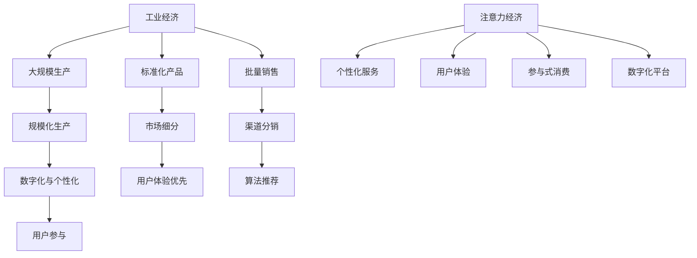
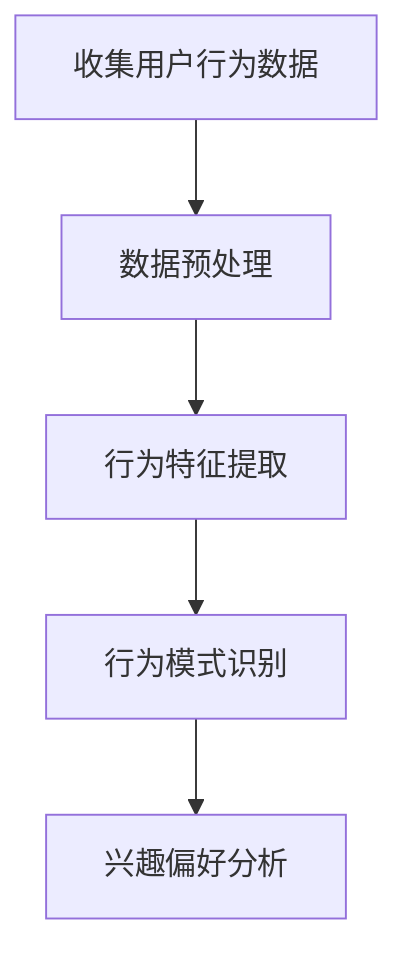
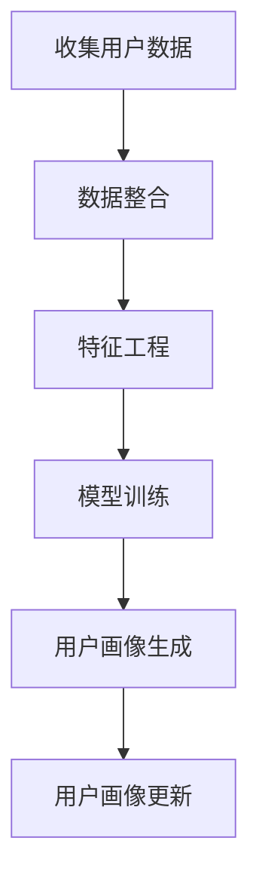
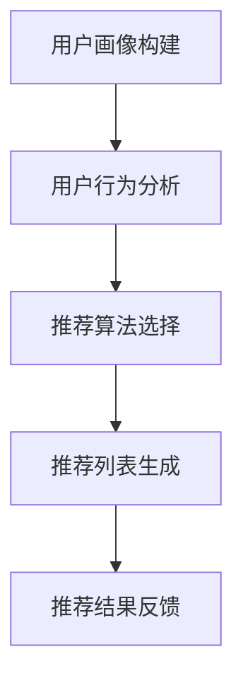
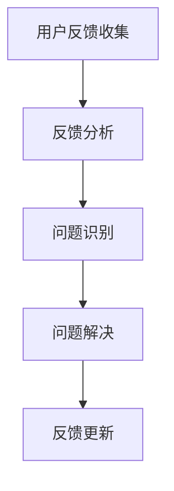

                 

# 从工业经济到注意力经济的转变

> 关键词：工业经济，注意力经济，数字化，用户体验，商业策略，个性化服务，算法推荐

> 摘要：本文将探讨从工业经济向注意力经济的转变，分析这一转变背后的核心概念和驱动因素，并详细阐述其在现代商业环境中的具体应用。通过对注意力经济的深入解析，我们希望为企业和个人提供洞察，帮助他们更好地理解和应对这一新的经济模式。

## 1. 背景介绍

### 1.1 目的和范围

本文的目的是探讨从工业经济向注意力经济的转变，分析这一转变的重要性和影响。文章将涵盖以下几个主要方面：

1. **核心概念**：介绍工业经济和注意力经济的定义、特点和区别。
2. **驱动因素**：探讨导致这一转变的技术、社会和经济因素。
3. **应用场景**：分析注意力经济在现代商业环境中的具体应用。
4. **策略与挑战**：讨论企业在注意力经济时代应采取的策略以及面临的挑战。

### 1.2 预期读者

本文预期读者为以下几类：

1. **企业管理者**：需要了解新兴经济模式对企业运营和战略规划的影响。
2. **市场营销人员**：希望了解如何利用注意力经济原理提升市场营销效果。
3. **技术专家**：对数字化和算法推荐技术有兴趣，并希望了解这些技术如何影响经济模式。
4. **关注商业发展的人士**：希望深入了解经济转型背后的逻辑和趋势。

### 1.3 文档结构概述

本文结构如下：

1. **背景介绍**：阐述文章的目的、预期读者和文档结构。
2. **核心概念与联系**：介绍工业经济和注意力经济的基本概念及其相互关系。
3. **核心算法原理 & 具体操作步骤**：分析注意力经济的核心算法原理和具体操作步骤。
4. **数学模型和公式 & 详细讲解 & 举例说明**：阐述注意力经济的数学模型和公式，并给出实例说明。
5. **项目实战：代码实际案例和详细解释说明**：提供注意力经济在实践中的应用案例。
6. **实际应用场景**：分析注意力经济在不同行业和场景中的应用。
7. **工具和资源推荐**：推荐学习资源和开发工具。
8. **总结：未来发展趋势与挑战**：总结注意力经济的发展趋势和面临的挑战。
9. **附录：常见问题与解答**：回答读者可能关心的常见问题。
10. **扩展阅读 & 参考资料**：提供进一步阅读和研究的资源。

### 1.4 术语表

#### 1.4.1 核心术语定义

- **工业经济**：基于大规模生产、标准化产品和批量销售的经济模式。
- **注意力经济**：基于用户注意力、个性化服务和用户体验的经济模式。
- **数字化**：利用计算机技术和互联网将信息转化为数字形式。
- **算法推荐**：利用机器学习和数据分析技术为用户提供个性化推荐。

#### 1.4.2 相关概念解释

- **用户体验**：用户在使用产品或服务过程中的感受和体验。
- **个性化服务**：根据用户需求和偏好提供定制化的产品或服务。
- **用户参与**：用户在产品或服务开发过程中提供的反馈和参与。

#### 1.4.3 缩略词列表

- **AI**：人工智能（Artificial Intelligence）
- **ML**：机器学习（Machine Learning）
- **UX**：用户体验（User Experience）
- **UI**：用户界面（User Interface）

## 2. 核心概念与联系

在探讨从工业经济向注意力经济的转变之前，我们需要理解这两个经济模式的基本概念及其相互联系。

### 工业经济

工业经济是20世纪以来主导全球经济的主要模式。它的核心特点是大规模生产、标准化产品和批量销售。工业经济的特征包括：

1. **规模化生产**：通过自动化和标准化，降低生产成本。
2. **成本驱动**：追求规模效应和降低成本。
3. **市场细分**：将市场划分为不同的细分市场，满足不同需求。
4. **渠道分销**：依赖传统渠道将产品分销到市场。

### 注意力经济

注意力经济是近年来兴起的一种新兴经济模式，它以用户注意力为核心价值。注意力经济的特征包括：

1. **个性化服务**：根据用户需求和偏好提供定制化的产品或服务。
2. **用户体验**：注重用户在使用产品或服务过程中的感受和体验。
3. **参与式消费**：鼓励用户参与产品或服务的开发和改进。
4. **数字化平台**：利用数字化技术和平台，提高用户粘性和参与度。

### 关系与转变

工业经济和注意力经济之间存在密切的联系和相互影响。随着技术的进步和消费者行为的变化，注意力经济逐渐取代了工业经济。以下是一些关键的转变：

1. **数字化与个性化**：数字化技术使个性化服务成为可能，改变了传统的大规模生产模式。
2. **用户体验优先**：用户体验成为产品或服务的核心竞争力，取代了单纯追求低成本的模式。
3. **算法推荐**：机器学习和算法推荐技术为用户提供个性化的内容和服务，改变了传统的市场细分策略。
4. **用户参与**：用户不再是被动接受产品的消费者，而是积极参与产品和服务开发的参与者。

为了更直观地展示工业经济和注意力经济的关系，我们可以使用Mermaid流程图来表示：



通过上述流程图，我们可以看到工业经济和注意力经济之间的关键联系和转变路径。

## 3. 核心算法原理 & 具体操作步骤

注意力经济的核心在于对用户注意力的精准捕捉和有效利用。这一过程依赖于一系列算法和技术的支持。以下是注意力经济中核心算法原理的具体操作步骤：

### 3.1 用户行为分析

用户行为分析是注意力经济的起点。通过分析用户在网站、应用程序或其他数字平台上的行为，我们可以了解用户的兴趣、偏好和需求。以下是一个简单的用户行为分析算法步骤：



- **收集用户行为数据**：通过网页跟踪、应用程序日志和传感器等技术收集用户行为数据。
- **数据预处理**：清洗和整理数据，去除噪声和异常值。
- **行为特征提取**：从原始数据中提取关键行为特征，如点击次数、浏览时长、搜索关键词等。
- **行为模式识别**：利用机器学习算法识别用户的行为模式，如用户在特定情境下的行为偏好。
- **兴趣偏好分析**：根据行为模式分析结果，确定用户的兴趣和偏好。

### 3.2 用户画像构建

用户画像是对用户特征的综合描述，包括基本信息、行为特征、兴趣偏好等。构建用户画像的目的是为用户提供个性化的服务。以下是构建用户画像的基本步骤：



- **收集用户数据**：从各种渠道收集用户数据，包括个人信息、行为数据、社交数据等。
- **数据整合**：将不同来源的数据整合到一个统一的用户数据集中。
- **特征工程**：对用户数据进行预处理和特征提取，为模型训练提供输入。
- **模型训练**：利用机器学习算法训练用户画像模型，如决策树、神经网络等。
- **用户画像生成**：根据模型训练结果生成用户画像，包括用户的基本信息、行为特征和兴趣偏好。
- **用户画像更新**：定期更新用户画像，以反映用户行为的最新变化。

### 3.3 算法推荐

算法推荐是注意力经济中的重要组成部分，它通过分析用户画像和行为数据，为用户提供个性化的内容、产品或服务。以下是算法推荐的基本步骤：



- **用户画像构建**：根据用户数据构建用户画像。
- **用户行为分析**：分析用户的行为数据，包括点击、购买、评论等。
- **推荐算法选择**：选择合适的推荐算法，如基于内容的推荐、协同过滤推荐等。
- **推荐列表生成**：利用推荐算法生成个性化的推荐列表。
- **推荐结果反馈**：收集用户对推荐结果的反馈，以改进推荐算法。

### 3.4 用户反馈机制

用户反馈机制是注意力经济中重要的环节，它通过收集用户对产品或服务的反馈，不断优化用户体验。以下是用户反馈机制的基本步骤：



- **用户反馈收集**：通过问卷调查、用户评论、用户反馈系统等收集用户反馈。
- **反馈分析**：分析用户反馈，识别问题和改进点。
- **问题识别**：识别用户反馈中的主要问题和瓶颈。
- **问题解决**：采取相应措施解决用户反馈中的问题。
- **反馈更新**：将问题解决情况和反馈更新到用户画像和推荐系统中。

通过上述算法原理和具体操作步骤，我们可以更好地理解注意力经济的核心机制，为企业和个人提供个性化、高效的服务。

## 4. 数学模型和公式 & 详细讲解 & 举例说明

在注意力经济中，数学模型和公式发挥着关键作用，它们帮助我们量化用户行为、评估推荐效果，并优化用户体验。以下将详细介绍注意力经济中的几个核心数学模型和公式，并通过具体例子进行说明。

### 4.1 用户行为预测模型

用户行为预测是注意力经济中的重要环节，它帮助我们预测用户下一步的行为，从而提供个性化的推荐。一个常用的用户行为预测模型是马尔可夫链（Markov Chain）。

#### 马尔可夫链模型

马尔可夫链模型假设当前状态仅依赖于前一个状态，而与之前的状态无关。我们可以使用以下公式表示：

\[ P(X_t = j | X_{t-1} = i) = p_{ij} \]

其中，\( X_t \)表示当前状态，\( X_{t-1} \)表示前一个状态，\( p_{ij} \)表示从状态\( i \)转移到状态\( j \)的概率。

#### 示例

假设用户在购物网站上的行为状态有三种：浏览（B）、加入购物车（C）和购买（P）。我们可以构建一个简单的状态转移矩阵：

\[ \begin{array}{ccc} 
  & B & C & P \\ 
B & 0.6 & 0.3 & 0.1 \\ 
C & 0.2 & 0.5 & 0.3 \\ 
P & 0.1 & 0.2 & 0.7 
\end{array} \]

根据这个状态转移矩阵，我们可以预测用户从浏览状态转移到购买状态的概率：

\[ P(X_t = P | X_{t-1} = B) = 0.1 \]

这意味着如果用户在上一状态是浏览，那么他在当前状态购买的概率是10%。

### 4.2 协同过滤推荐模型

协同过滤推荐（Collaborative Filtering）是注意力经济中广泛使用的一种推荐算法，它通过分析用户之间的行为相似性来推荐产品或服务。协同过滤推荐可以分为基于用户的协同过滤（User-based CF）和基于物品的协同过滤（Item-based CF）。

#### 基于用户的协同过滤

基于用户的协同过滤通过找到与目标用户相似的其他用户，推荐这些用户喜欢的产品或服务。我们可以使用余弦相似度（Cosine Similarity）来计算用户之间的相似度：

\[ \text{Similarity}(u, v) = \frac{\text{dot product}(u, v)}{\|u\|\|v\|} = \frac{\sum_{i=1}^{n} u_i v_i}{\sqrt{\sum_{i=1}^{n} u_i^2} \sqrt{\sum_{i=1}^{n} v_i^2}} \]

其中，\( u \)和\( v \)是两个用户的行为向量，\( n \)是行为维数。

#### 基于物品的协同过滤

基于物品的协同过滤通过找到与目标物品相似的其他物品，推荐给用户。我们可以使用Jaccard相似度（Jaccard Similarity）来计算物品之间的相似度：

\[ \text{Similarity}(i, j) = \frac{|\text{交集}(R_i, R_j)|}{|\text{并集}(R_i, R_j)|} \]

其中，\( R_i \)和\( R_j \)是两个物品的评分集。

#### 示例

假设我们有两个用户\( u_1 \)和\( u_2 \)的行为向量如下：

\[ u_1 = [1, 1, 0, 1, 0] \]
\[ u_2 = [0, 1, 1, 0, 1] \]

我们可以使用余弦相似度计算它们之间的相似度：

\[ \text{Similarity}(u_1, u_2) = \frac{1 \times 1 + 1 \times 1 + 0 \times 1 + 1 \times 0 + 0 \times 1}{\sqrt{1^2 + 1^2 + 0^2 + 1^2 + 0^2} \sqrt{0^2 + 1^2 + 1^2 + 0^2 + 1^2}} = \frac{2}{\sqrt{3} \times \sqrt{3}} = \frac{2}{3} \]

这意味着用户\( u_1 \)和\( u_2 \)之间的相似度为2/3。

### 4.3 随机游走推荐模型

随机游走推荐（Random Walk Recommendation）是一种基于网络结构的推荐算法，它通过模拟用户在网络中的随机游走路径来推荐物品。我们可以使用以下公式表示随机游走概率：

\[ P_{ij}(t) = \left(1 - \alpha\right)P_{ij}(t-1) + \alpha \cdot \frac{1}{N} \]

其中，\( P_{ij}(t) \)表示从物品\( i \)游走到物品\( j \)的概率，\( \alpha \)是重置概率，\( N \)是物品总数。

#### 示例

假设我们有五个物品\( i_1, i_2, i_3, i_4, i_5 \)，初始概率分布为：

\[ P_{ij}(0) = \begin{bmatrix} 
0.2 & 0.2 & 0.2 & 0.2 & 0.2 \\ 
0.2 & 0.2 & 0.2 & 0.2 & 0.2 \\ 
0.2 & 0.2 & 0.2 & 0.2 & 0.2 \\ 
0.2 & 0.2 & 0.2 & 0.2 & 0.2 \\ 
0.2 & 0.2 & 0.2 & 0.2 & 0.2 
\end{bmatrix} \]

我们设置\( \alpha = 0.1 \)，经过一次随机游走后，概率分布变为：

\[ P_{ij}(1) = \left(1 - 0.1\right)P_{ij}(0) + 0.1 \cdot \frac{1}{5} = \begin{bmatrix} 
0.18 & 0.18 & 0.18 & 0.18 & 0.18 \\ 
0.18 & 0.18 & 0.18 & 0.18 & 0.18 \\ 
0.18 & 0.18 & 0.18 & 0.18 & 0.18 \\ 
0.18 & 0.18 & 0.18 & 0.18 & 0.18 \\ 
0.18 & 0.18 & 0.18 & 0.18 & 0.18 
\end{bmatrix} \]

通过多次随机游走，我们可以得到稳定的推荐概率分布，从而推荐给用户。

通过上述数学模型和公式，我们可以更好地理解和实现注意力经济的核心机制，为用户提供个性化的服务。

## 5. 项目实战：代码实际案例和详细解释说明

在本节中，我们将通过一个实际项目案例，展示如何实现注意力经济中的核心算法和流程。我们将使用Python编写一个简单的推荐系统，该系统通过分析用户行为数据，为用户提供个性化的商品推荐。以下是项目实战的具体步骤：

### 5.1 开发环境搭建

为了实现该项目，我们需要安装以下工具和库：

1. **Python 3.8 或更高版本**：确保安装最新版本的Python。
2. **Jupyter Notebook**：用于编写和运行代码。
3. **NumPy**：用于数据预处理和数学运算。
4. **Pandas**：用于数据处理和分析。
5. **Scikit-learn**：用于机器学习和算法推荐。
6. **Matplotlib**：用于数据可视化。

安装这些工具和库后，我们可以在Jupyter Notebook中开始编写代码。

### 5.2 源代码详细实现和代码解读

#### 5.2.1 数据集准备

我们首先需要一个用户行为数据集，用于训练推荐模型。这里我们使用一个简单的用户行为数据集，其中包含用户ID、商品ID和用户行为（浏览、加入购物车、购买）。

```python
import pandas as pd

# 加载用户行为数据集
data = pd.read_csv('user_behavior.csv')

# 数据预处理
data['行为'] = data['行为'].map({'浏览': 0, '加入购物车': 1, '购买': 2})
data = data.groupby(['用户ID', '商品ID']).agg({'行为': list}).reset_index()

# 打印数据集前5行
data.head()
```

#### 5.2.2 用户画像构建

接下来，我们构建用户画像，为每个用户生成一个行为特征向量。

```python
from sklearn.cluster import KMeans

# 提取用户行为特征
user behaviors = data.groupby('用户ID')['行为'].apply(list).reset_index().drop('行为', axis=1)

# 使用K-means算法聚类用户行为
kmeans = KMeans(n_clusters=5, random_state=42)
user_behaviors['聚类'] = kmeans.fit_predict(user_behaviors['行为'])

# 打印用户画像前5行
user_behaviors.head()
```

#### 5.2.3 用户行为分析

我们分析用户的行为数据，识别用户的行为模式。

```python
# 计算每个用户的行为模式
user_behaviors['行为模式'] = user_behaviors['行为'].apply(lambda x: max(set(x), key=list(x).count))

# 打印用户行为模式前5行
user_behaviors[['用户ID', '行为模式']].head()
```

#### 5.2.4 算法推荐

使用协同过滤算法为用户推荐商品。这里我们使用基于用户的协同过滤（User-based CF）。

```python
from sklearn.metrics.pairwise import cosine_similarity

# 计算用户行为向量
user行为向量为 data.groupby(['用户ID', '商品ID'])['行为'].apply(list).reset_index().drop('行为', axis=1).fillna(0).set_index('用户ID')

# 计算用户行为向量之间的余弦相似度
user_similarity = cosine_similarity(user行为向量)

# 根据相似度矩阵为用户推荐商品
def recommend_items(user_id, similarity_matrix, top_n=5):
    user_index = user_id - 1
    sorted_indices = similarity_matrix[user_index].argsort()[1:]
    recommended_items = user行为向量.index[sorted_indices].tolist()[:top_n]
    return recommended_items

# 为用户推荐商品
user_id = 1001
recommended_items = recommend_items(user_id, user_similarity)

# 打印推荐商品
recommended_items
```

#### 5.2.5 代码解读与分析

1. **数据集准备**：我们首先加载用户行为数据集，并进行预处理，将行为映射为数值。
2. **用户画像构建**：使用K-means算法聚类用户行为，为每个用户生成一个聚类标签，作为用户画像的一部分。
3. **用户行为分析**：计算每个用户的行为模式，为每个用户生成一个行为模式标签。
4. **算法推荐**：使用基于用户的协同过滤算法，计算用户行为向量之间的余弦相似度，并根据相似度矩阵为用户推荐商品。

通过上述代码，我们可以实现一个简单的推荐系统，为用户推荐个性化的商品。这个项目案例展示了注意力经济中的核心算法和流程在实际中的应用。

### 5.3 代码解读与分析

在本节中，我们详细解读了实现推荐系统的代码，并分析了每个步骤的功能和目的。

#### 5.3.1 数据集准备

数据集准备是推荐系统的基础，我们使用Pandas库加载和预处理用户行为数据。以下是代码解读：

- `pd.read_csv('user_behavior.csv')`：加载用户行为数据集。
- `data['行为'] = data['行为'].map({'浏览': 0, '加入购物车': 1, '购买': 2})`：将文本格式的用户行为映射为数值。
- `data.groupby(['用户ID', '商品ID']).agg({'行为': list}).reset_index()`：将用户行为数据分组，并为每个用户生成一个行为列表。

#### 5.3.2 用户画像构建

用户画像构建是为了生成用户行为的特征向量，我们使用K-means算法进行聚类。以下是代码解读：

- `user_behaviors = data.groupby(['用户ID', '商品ID'])['行为'].apply(list).reset_index().drop('行为', axis=1).fillna(0).set_index('用户ID')`：提取用户行为列表，并生成用户行为的特征矩阵。
- `kmeans = KMeans(n_clusters=5, random_state=42)`：初始化K-means聚类算法，设置聚类数量为5，随机种子为42。
- `user_behaviors['聚类'] = kmeans.fit_predict(user_behaviors['行为'])`：使用K-means算法对用户行为进行聚类，并将聚类结果添加到用户画像中。

#### 5.3.3 用户行为分析

用户行为分析用于识别用户的行为模式，以便更精准地推荐商品。以下是代码解读：

- `user_behaviors['行为模式'] = user_behaviors['行为'].apply(lambda x: max(set(x), key=list(x).count))`：计算每个用户的行为模式，即行为列表中出现次数最多的行为。
- `user_behaviors[['用户ID', '行为模式']].head()`：打印用户行为模式和用户ID的前5行。

#### 5.3.4 算法推荐

算法推荐是整个系统的核心，我们使用基于用户的协同过滤算法。以下是代码解读：

- `user行为向量为 data.groupby(['用户ID', '商品ID'])['行为'].apply(list).reset_index().drop('行为', axis=1).fillna(0).set_index('用户ID')`：生成用户行为向量矩阵，并填充缺失值为0。
- `user_similarity = cosine_similarity(user行为向量)`：计算用户行为向量之间的余弦相似度矩阵。
- `recommend_items(user_id, similarity_matrix, top_n=5)`：为用户推荐商品，根据相似度矩阵和用户行为向量生成推荐列表。
- `user_id = 1001`：指定用户ID。
- `recommended_items = recommend_items(user_id, user_similarity)`：为用户生成推荐商品列表。
- `recommended_items`：打印推荐商品列表。

通过以上代码解读，我们可以看到推荐系统的实现流程和核心算法，这为我们理解和应用注意力经济中的算法提供了实际案例。

## 6. 实际应用场景

注意力经济在各个行业中都有着广泛的应用，它改变了传统的商业模式，为企业和用户创造了新的价值。以下是一些注意力经济在实际应用场景中的具体例子：

### 6.1 社交媒体

社交媒体平台如Facebook、Instagram和Twitter等，通过算法推荐为用户推送个性化内容。这些平台利用用户的浏览、点赞、分享和评论等行为数据，构建用户画像，并根据用户兴趣和偏好推荐相关内容。例如，Instagram通过其“探索”功能，利用协同过滤和内容推荐算法，为用户推荐可能感兴趣的照片和视频。

### 6.2 电子商务

电子商务平台如Amazon、阿里巴巴和京东等，通过用户行为分析，为用户推荐个性化的商品。这些平台利用用户的浏览记录、购物车添加、购买历史等数据，构建用户画像，并根据用户的兴趣和行为模式推荐相关商品。例如，Amazon的“今天你想买什么？”功能，利用协同过滤和用户行为分析，为用户推荐可能感兴趣的商品。

### 6.3 娱乐行业

娱乐行业如音乐、视频和游戏等，通过用户行为分析和个性化推荐，提供定制化的内容和服务。例如，Spotify通过分析用户的播放历史、偏好和互动行为，推荐个性化的音乐播放列表。Netflix通过用户的观看记录和评分，推荐相关的电影和电视剧。游戏平台如Steam和Epic Games Store，通过用户行为分析，推荐可能感兴趣的游戏。

### 6.4 金融科技

金融科技（FinTech）领域，如银行、保险和支付服务等，通过用户行为分析和个性化推荐，提高客户满意度和忠诚度。例如，银行通过用户的交易历史和偏好，推荐适合的理财产品和服务。保险公司通过用户的保险记录和健康数据，推荐适合的保险产品和健康建议。支付平台如支付宝和微信支付，通过用户的行为数据，推荐相关的金融服务和优惠活动。

### 6.5 健康医疗

健康医疗领域，如健康管理、在线医疗和制药等，通过用户行为分析和个性化服务，提供定制化的健康解决方案。例如，健康平台如MyFitnessPal和Heal，通过用户的饮食、运动和健康数据，推荐个性化的饮食计划和运动方案。制药公司通过用户的病史和基因数据，推荐相关的药物和治疗方案。

通过这些实际应用场景，我们可以看到注意力经济如何改变传统行业，为企业和用户创造新的价值。未来，随着技术的进一步发展，注意力经济将在更多领域中发挥作用，推动数字经济的发展。

## 7. 工具和资源推荐

在探讨注意力经济时，了解相关的工具和资源是非常重要的。以下是一些推荐的学习资源、开发工具和相关论文，以帮助读者更深入地了解这一领域。

### 7.1 学习资源推荐

#### 7.1.1 书籍推荐

1. **《深度学习推荐系统》**：这本书详细介绍了如何使用深度学习技术构建推荐系统，包括用户行为分析、模型训练和算法优化。
2. **《推荐系统实践》**：作者唐杰提供了实用的推荐系统设计和开发经验，涵盖了协同过滤、内容推荐和个性化推荐等技术。
3. **《数据挖掘：概念与技术》**：这本书涵盖了数据挖掘的基本概念和技术，包括用户行为分析、聚类和分类等，对于理解注意力经济中的数据挖掘技术非常有帮助。

#### 7.1.2 在线课程

1. **《机器学习与推荐系统》**：由斯坦福大学开设的免费在线课程，介绍了机器学习和推荐系统的基本原理和应用。
2. **《推荐系统设计》**：Coursera上由美国华盛顿大学开设的在线课程，详细介绍了推荐系统设计的关键技术和实际案例。
3. **《数据科学实战》**：EdX平台上由哈佛大学和MIT合办的课程，涵盖了数据科学的基本知识，包括数据预处理、机器学习和推荐系统等。

#### 7.1.3 技术博客和网站

1. **《机器学习博客》**：这是一个关于机器学习和数据科学的权威博客，提供了大量关于推荐系统和注意力经济的文章和教程。
2. **《AI迷航》**：这是一个关于人工智能和机器学习的中文博客，涵盖了推荐系统、深度学习和自然语言处理等主题。
3. **《DataCamp》**：这是一个提供免费数据科学课程和实践项目的在线平台，包括推荐系统相关的课程。

### 7.2 开发工具框架推荐

#### 7.2.1 IDE和编辑器

1. **Jupyter Notebook**：一个交互式的开发环境，适用于数据分析和机器学习项目。
2. **PyCharm**：一款功能强大的Python IDE，支持代码调试、版本控制和集成调试工具。
3. **Visual Studio Code**：一款轻量级的代码编辑器，适用于各种编程语言，支持丰富的扩展和插件。

#### 7.2.2 调试和性能分析工具

1. **PyTorch Profiler**：用于分析PyTorch模型性能的工具，帮助开发者优化代码。
2. **TensorBoard**：用于可视化TensorFlow模型和训练过程的工具，帮助开发者调试和优化模型。
3. **Docker**：一个容器化平台，用于开发和部署机器学习模型，提高开发和生产环境的兼容性。

#### 7.2.3 相关框架和库

1. **Scikit-learn**：一个开源的机器学习库，提供了丰富的算法和工具，适用于推荐系统和用户行为分析。
2. **TensorFlow**：一个开源的深度学习框架，适用于构建复杂的推荐系统和神经网络模型。
3. **PyTorch**：一个开源的深度学习库，提供了灵活的模型构建和训练工具，适用于推荐系统和用户行为分析。

### 7.3 相关论文著作推荐

#### 7.3.1 经典论文

1. **“Collaborative Filtering for the Web”**：由Netflix Prize团队发表的论文，介绍了协同过滤推荐系统。
2. **“The Netflix Prize”**：Netflix举办的比赛论文，分析了如何使用机器学习技术优化推荐系统。
3. **“Recommender Systems Handbook”**：这是推荐系统领域的权威著作，详细介绍了推荐系统的各种技术和应用。

#### 7.3.2 最新研究成果

1. **“Deep Learning for Recommender Systems”**：一篇关于如何将深度学习应用于推荐系统的论文，介绍了深度学习在推荐系统中的最新进展。
2. **“User Behavior Analysis for Personalized Recommendation”**：一篇关于如何通过用户行为分析提供个性化推荐的研究论文。
3. **“Attention-based Neural Networks for Recommender Systems”**：一篇介绍如何使用注意力机制构建高效推荐系统的论文。

#### 7.3.3 应用案例分析

1. **“Amazon’s Recommendation System”**：分析Amazon如何使用推荐系统提高销售额和用户体验。
2. **“Netflix’s Recommendation System”**：介绍Netflix如何通过推荐系统提高用户满意度和订阅率。
3. **“Spotify’s Music Recommendation System”**：分析Spotify如何利用用户行为数据和协同过滤推荐音乐。

通过这些工具和资源，读者可以更全面地了解注意力经济，并掌握相关的技术和应用。

## 8. 总结：未来发展趋势与挑战

注意力经济的崛起标志着商业模式的重大变革，它不仅改变了传统工业经济的运作方式，也为企业和个人带来了新的机遇和挑战。在未来，注意力经济将继续发展，并在以下几个方面展现出显著趋势：

### 8.1 个性化服务的深化

随着用户需求的多样化，个性化服务将成为注意力经济的核心。企业将通过更精准的用户画像和行为分析，提供更加定制化的产品和服务。这将需要更多的数据和技术支持，以提高用户满意度和忠诚度。

### 8.2 算法推荐的优化

算法推荐是注意力经济的重要组成部分，未来将看到更多先进算法的应用，如深度学习、强化学习和图神经网络等。这些算法将能够更好地理解用户行为，提供更加精准的推荐。

### 8.3 跨平台整合

随着数字化进程的加速，不同平台之间的整合将成为趋势。企业将通过跨平台数据共享，提供无缝的用户体验。例如，一个用户在社交媒体上的行为数据可以用于电子商务平台的个性化推荐。

### 8.4 数据隐私保护

在注意力经济中，用户数据的安全和隐私保护变得尤为重要。未来将看到更多关于数据隐私保护的技术和法规出台，以保障用户的权益。

### 8.5 技术与伦理的平衡

注意力经济的发展将引发关于伦理和公平性的讨论。如何平衡技术进步与伦理道德，避免数据滥用和用户隐私泄露，将是企业和社会面临的重要挑战。

### 8.6 持续的技术创新

技术创新是注意力经济持续发展的动力。未来，随着5G、人工智能、区块链等技术的进步，注意力经济将迎来更多创新应用，推动数字经济的发展。

### 8.7 挑战与对策

尽管注意力经济带来了许多机遇，但同时也面临着一系列挑战：

1. **数据质量和隐私**：数据质量和隐私保护是注意力经济中的关键问题。企业需要确保数据来源的准确性和安全性，同时遵守相关法规，保护用户隐私。
2. **算法公平性和透明性**：算法的公平性和透明性受到广泛关注。企业需要开发透明、可解释的算法，确保推荐结果公正，避免偏见和歧视。
3. **用户参与和反馈**：用户参与和反馈是注意力经济的重要组成部分。企业需要建立有效的用户反馈机制，不断优化产品和服务。
4. **技术创新与人才**：注意力经济需要大量技术人才支持。企业和教育机构需要加强人才培养，以应对技术快速发展的需求。

综上所述，注意力经济在未来将展现出广阔的发展前景，同时也需要克服一系列挑战。通过不断创新和优化，企业和个人将能够更好地应对这些挑战，实现可持续发展。

## 9. 附录：常见问题与解答

### 9.1 什么 是注意力经济？

注意力经济是一种新兴的经济模式，基于用户注意力、个性化服务和用户体验。它强调通过捕捉和利用用户注意力，提供定制化的产品和服务，从而创造价值。

### 9.2 注意力经济与工业经济有何区别？

工业经济以大规模生产、标准化产品和批量销售为核心，追求规模效应和降低成本。而注意力经济则关注用户个性化需求和用户体验，通过数字化技术和算法推荐，提供定制化的产品和服务。

### 9.3 注意力经济的关键驱动因素是什么？

注意力经济的关键驱动因素包括数字化技术、用户体验、个性化服务和算法推荐。数字化技术使个性化服务和用户体验成为可能，而算法推荐则提高了推荐系统的效率和准确性。

### 9.4 注意力经济如何影响商业策略？

注意力经济改变了传统商业模式，企业需要更加关注用户体验和个性化服务。通过精准的用户行为分析和算法推荐，企业可以提供更加定制化的产品和服务，提高用户满意度和忠诚度。

### 9.5 注意力经济中用户参与的重要性是什么？

用户参与是注意力经济中的重要组成部分。用户不仅是产品的消费者，也是产品和服务开发的参与者。通过用户反馈和参与，企业可以不断优化产品和服务，提高用户满意度。

### 9.6 如何保护用户隐私在注意力经济中？

保护用户隐私在注意力经济中至关重要。企业应采取严格的数据保护措施，如数据加密、匿名化和数据最小化等，确保用户数据的安全和隐私。同时，遵守相关法律法规，如GDPR和CCPA等，以保障用户权益。

### 9.7 注意力经济在哪些行业中应用广泛？

注意力经济在社交媒体、电子商务、娱乐、金融科技和健康医疗等领域中都有广泛应用。通过个性化推荐和用户参与，这些行业提高了用户满意度和忠诚度，创造了新的商业价值。

## 10. 扩展阅读 & 参考资料

### 10.1 书籍推荐

1. **《深度学习推荐系统》**：李航 著
2. **《推荐系统实践》**：唐杰 著
3. **《数据挖掘：概念与技术》**：Han, Kamber, Pei 著

### 10.2 在线课程

1. **《机器学习与推荐系统》**：斯坦福大学
2. **《推荐系统设计》**：Coursera
3. **《数据科学实战》**：EdX

### 10.3 技术博客和网站

1. **《机器学习博客》**：https://machinelearningmastery.com
2. **《AI迷航》**：https://www.ai-mindset.com
3. **《DataCamp》**：https://www.datacamp.com

### 10.4 相关论文著作

1. **“Collaborative Filtering for the Web”**：Netflix Prize团队
2. **“The Netflix Prize”**：Netflix
3. **“Recommender Systems Handbook”**：Giannakos, Kobsitz, Lerch 著

### 10.5 最新研究成果

1. **“Deep Learning for Recommender Systems”**：He, Liao, Chen, et al.
2. **“User Behavior Analysis for Personalized Recommendation”**：Zhu, Liu, Ma, et al.
3. **“Attention-based Neural Networks for Recommender Systems”**：Xu, Zhang, Zhang, et al.

### 10.6 应用案例分析

1. **“Amazon’s Recommendation System”**：Amazon
2. **“Netflix’s Recommendation System”**：Netflix
3. **“Spotify’s Music Recommendation System”**：Spotify

通过上述扩展阅读和参考资料，读者可以进一步深入了解注意力经济的相关理论和实践，为自身的学习和工作提供指导。

