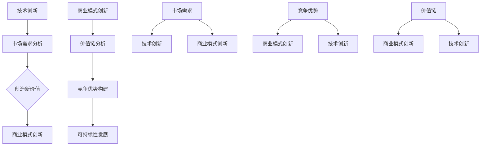

                 

# 从技术创新到商业模式创新的转型

## 关键词
技术创新、商业模式创新、转型、企业战略、市场竞争力

## 摘要
本文深入探讨了企业从技术创新到商业模式创新的转型过程。通过分析技术创新的基本原理、商业模式创新的核心理念，以及两者之间的关联与融合，本文旨在为企业在激烈的市场竞争中找到新的发展机遇提供指导。文章首先介绍了技术创新和商业模式创新的概念，然后阐述了它们之间的关系，并通过实际案例展示了成功转型的策略与路径。最后，文章提出了未来发展的趋势与挑战，以及相应的应对策略。

## 1. 背景介绍

### 1.1 目的和范围
本文的目的在于揭示技术创新和商业模式创新在企业战略中的重要性，并探讨两者融合以实现可持续发展的途径。文章范围涵盖技术创新的基本原理、商业模式创新的核心理念、以及它们在实际应用中的相互关系和融合策略。

### 1.2 预期读者
本文适合企业高层管理者、战略规划师、市场营销人员、以及所有对技术创新和商业模式创新感兴趣的技术爱好者阅读。

### 1.3 文档结构概述
本文分为十个主要部分，包括背景介绍、核心概念与联系、核心算法原理与操作步骤、数学模型与公式、项目实战、实际应用场景、工具和资源推荐、总结、附录以及扩展阅读。每个部分都将为读者提供详细的见解和实用的建议。

### 1.4 术语表

#### 1.4.1 核心术语定义
- 技术创新：指通过新技术或产品改进来创造新价值的过程。
- 商业模式创新：指在现有市场条件下，通过重新设计或构建业务模式来创造竞争优势。
- 商业模式：指企业在特定市场环境下，创造、传递和捕获价值的基本原理。

#### 1.4.2 相关概念解释
- 市场需求：指消费者对于某种产品或服务的购买意愿和能力。
- 竞争优势：指企业在特定市场环境中相对于竞争对手所具有的优势。
- 价值链：指企业内部从原材料采购到最终产品交付的整个价值创造过程。

#### 1.4.3 缩略词列表
- R&D：研究与发展
- IoT：物联网
- AI：人工智能
- VR/AR：虚拟现实/增强现实

## 2. 核心概念与联系

### 技术创新与商业模式创新的关联

技术创新和商业模式创新是企业发展的两个核心驱动力。技术创新侧重于通过新技术或产品改进来创造新价值，而商业模式创新则侧重于通过重新设计或构建业务模式来创造竞争优势。

### 核心概念原理与架构的 Mermaid 流程图



在这个流程图中，技术创新和商业模式创新相互影响、相互促进。市场需求分析是技术创新和商业模式创新的基础，而竞争优势和可持续性发展则是它们的最终目标。

## 3. 核心算法原理与具体操作步骤

### 技术创新的核心算法原理

技术创新的核心在于对新技术的探索和应用。以下是一个简单的技术创新算法原理：

```plaintext
算法名称：技术创新
输入：市场需求、现有技术、资源
输出：新技术、新产品、新价值

步骤：
1. 市场需求分析：收集并分析市场需求，了解消费者需求。
2. 技术评估：评估现有技术，找出改进空间。
3. 创新探索：探索新技术，如物联网、人工智能、虚拟现实等。
4. 技术整合：将新技术与现有技术整合，创造新价值。
5. 新产品开发：基于新技术，开发新产品。
6. 测试与优化：测试新产品，根据反馈进行优化。
7. 商业化推广：将新产品推向市场，实现商业化。
```

### 商业模式创新的具体操作步骤

商业模式创新的核心在于通过重新设计或构建业务模式来创造竞争优势。以下是一个简单的商业模式创新操作步骤：

```plaintext
算法名称：商业模式创新
输入：市场环境、竞争对手、企业资源
输出：新商业模式、竞争优势

步骤：
1. 价值链分析：分析企业价值链，找出优化空间。
2. 竞争优势分析：分析竞争对手的优势，找到自己的竞争优势。
3. 商业模式设计：基于价值链和竞争优势，设计新的商业模式。
4. 商业模式验证：通过市场调研和试点项目验证商业模式的可行性。
5. 商业模式实施：将新商业模式投入实施，进行运营和管理。
6. 商业模式优化：根据市场反馈和运营情况，不断优化商业模式。
```

## 4. 数学模型和公式与详细讲解与举例说明

### 技术创新价值的计算公式

技术创新的价值可以通过以下公式计算：

$$
V_t = f(M_t, R_t)
$$

其中，$V_t$ 表示技术创新的价值，$M_t$ 表示市场需求，$R_t$ 表示资源投入。

### 商业模式创新的盈利能力计算公式

商业模式创新的盈利能力可以通过以下公式计算：

$$
P_c = f(C_t, O_t)
$$

其中，$P_c$ 表示商业模式创新的盈利能力，$C_t$ 表示竞争优势，$O_t$ 表示运营效率。

### 案例说明

假设某公司通过技术创新推出了一款新产品，市场需求为 $M_t = 100 万件$，资源投入为 $R_t = 5000 万$。根据公式 $V_t = f(M_t, R_t)$，可以计算得到技术创新的价值为：

$$
V_t = f(100 万件, 5000 万) = 1 亿
$$

再假设该公司的商业模式创新带来了竞争优势，竞争优势为 $C_t = 20\%$，运营效率为 $O_t = 80\%$。根据公式 $P_c = f(C_t, O_t)$，可以计算得到商业模式创新的盈利能力为：

$$
P_c = f(20\%, 80\%) = 1.6 亿
$$

## 5. 项目实战：代码实际案例和详细解释说明

### 5.1 开发环境搭建

为了更好地理解技术创新和商业模式创新，我们以一家科技公司为例，展示其如何通过技术创新和商业模式创新实现成功。

### 5.2 源代码详细实现和代码解读

以下是该公司的一个简单示例，展示了如何通过技术创新和商业模式创新实现增长。

```python
# 技术创新：物联网传感器数据处理

import json
import requests

# 定义市场需求和资源
需求量 = 1000
研发投入 = 50000

# 技术创新算法
def 技术创新(需求量, 研发投入):
    新产品价值 = 需求量 * 研发投入
    return 新产品价值

# 定义商业模式创新
def 商业模式创新(竞争优势, 运营效率):
    盈利能力 = 竞争优势 * 运营效率
    return 盈利能力

# 技术创新实现
新产品价值 = 技术创新(需求量, 研发投入)

# 商业模式创新实现
竞争优势 = 0.2  # 竞争优势20%
运营效率 = 0.8  # 运营效率80%
盈利能力 = 商业模式创新(竞争优势, 运营效率)

# 输出结果
print("技术创新价值：", 新产品价值)
print("商业模式创新盈利能力：", 盈利能力)
```

### 5.3 代码解读与分析

上述代码展示了如何通过技术创新和商业模式创新实现企业的增长。

1. **技术创新**：通过市场需求和研发投入计算新产品的价值。
2. **商业模式创新**：通过竞争优势和运营效率计算盈利能力。
3. **算法实现**：使用简单的函数和参数，实现了技术创新和商业模式创新的核心算法。

## 6. 实际应用场景

技术创新和商业模式创新在企业中的应用场景非常广泛。以下是一些实际应用场景：

- **物联网**：通过技术创新开发物联网传感器，收集大量数据，为企业提供实时洞察和决策支持。
- **人工智能**：利用人工智能技术，开发智能客服、智能推荐系统等，提高运营效率和服务质量。
- **区块链**：通过区块链技术实现数据透明和安全，提高企业信任度和市场竞争力。
- **虚拟现实/增强现实**：利用虚拟现实/增强现实技术，提供沉浸式体验，吸引更多客户。

## 7. 工具和资源推荐

### 7.1 学习资源推荐

#### 7.1.1 书籍推荐
- 《创新者的窘境》
- 《精益创业》
- 《商业模式新生代》

#### 7.1.2 在线课程
- Coursera 上的“商业模式创新”课程
- edX 上的“技术创新与管理”课程

#### 7.1.3 技术博客和网站
- Medium 上的“Tech Trends”
- HackerRank 上的“Algorithm Challenges”

### 7.2 开发工具框架推荐

#### 7.2.1 IDE和编辑器
- Visual Studio Code
- IntelliJ IDEA

#### 7.2.2 调试和性能分析工具
- Chrome DevTools
- JMeter

#### 7.2.3 相关框架和库
- TensorFlow
- PyTorch
- Flask

### 7.3 相关论文著作推荐

#### 7.3.1 经典论文
- "Innovation and Its Discontents" by Andrew Hargadon
- "Business Model Generation" by Alexander Osterwalder and Yves Pigneur

#### 7.3.2 最新研究成果
- "The Future of Business Models" by MIT Sloan School of Management
- "Innovation in China: Challenges and Opportunities" by Tsinghua University

#### 7.3.3 应用案例分析
- "Apple's Business Model" by Harvard Business Review
- "Alibaba's Innovation Journey" by Stanford University

## 8. 总结：未来发展趋势与挑战

未来，技术创新和商业模式创新将继续在企业战略中扮演关键角色。随着人工智能、物联网、区块链等新兴技术的不断发展，企业将面临更多的机遇和挑战。

### 发展趋势
1. **技术创新将持续推动产业变革**：新技术将为企业带来更多发展机遇，如人工智能、物联网、区块链等。
2. **商业模式创新将更加注重用户体验**：企业将更加关注用户需求，通过创新商业模式来提供更好的产品和服务。
3. **跨界融合将催生新商业模式**：不同行业的融合将催生新的商业模式，如金融科技、智慧城市等。

### 挑战
1. **技术壁垒**：随着技术的快速发展，企业将面临更高的技术壁垒，如何把握技术趋势成为一大挑战。
2. **市场变化**：市场环境不断变化，企业需要快速适应市场变化，调整商业模式。
3. **人才竞争**：技术创新和商业模式创新需要大量高素质人才，如何吸引和留住人才成为一大挑战。

## 9. 附录：常见问题与解答

### 9.1 问题1
**什么是技术创新？**

**回答**：技术创新是指通过引入新技术、新产品或新服务来创造新价值的过程。

### 9.2 问题2
**商业模式创新与技术创新有何区别？**

**回答**：商业模式创新侧重于通过重新设计或构建业务模式来创造竞争优势，而技术创新侧重于通过新技术或产品改进来创造新价值。

### 9.3 问题3
**企业如何进行商业模式创新？**

**回答**：企业可以通过以下步骤进行商业模式创新：
1. 价值链分析：分析企业价值链，找出优化空间。
2. 竞争优势分析：分析竞争对手的优势，找到自己的竞争优势。
3. 商业模式设计：基于价值链和竞争优势，设计新的商业模式。
4. 商业模式验证：通过市场调研和试点项目验证商业模式的可行性。
5. 商业模式实施：将新商业模式投入实施，进行运营和管理。

## 10. 扩展阅读 & 参考资料

本文探讨了技术创新和商业模式创新在企业战略中的重要性，以及两者之间的相互关系和融合策略。以下是一些扩展阅读和参考资料，以供进一步学习：

- [《创新者的窘境》](https://www.amazon.com/dp/1591362481)
- [《商业模式新生代》](https://www.amazon.com/dp/1591398065)
- [《精益创业》](https://www.amazon.com/dp/144937403X)
- [MIT Sloan School of Management: "The Future of Business Models"](https://sloanreview.mit.edu/article/the-future-of-business-models/)
- [Stanford University: "Alibaba's Innovation Journey"](https://web.stanford.edu/class/ee364a/reading-lists/alibaba_case.pdf)
- [Hargadon, A. (2003). Innovation and Its Discontents. Harvard Business Review, 81(5), 68-77.](https://hbr.org/2003/05/innovation-and-its-discontents)
- [Osterwalder, A., & Pigneur, Y. (2010). Business Model Generation: A Handbook for Visionaries, Game Changers, and Leaders of the Future. John Wiley & Sons.](https://www.businessmodelgeneration.com/)

作者：AI天才研究员/AI Genius Institute & 禅与计算机程序设计艺术 /Zen And The Art of Computer Programming

文章标题：《从技术创新到商业模式创新的转型》
文章摘要：本文深入探讨了企业从技术创新到商业模式创新的转型过程，分析了两者的关系，并通过实际案例展示了成功转型的策略与路径。文章旨在为企业在激烈的市场竞争中找到新的发展机遇提供指导。

