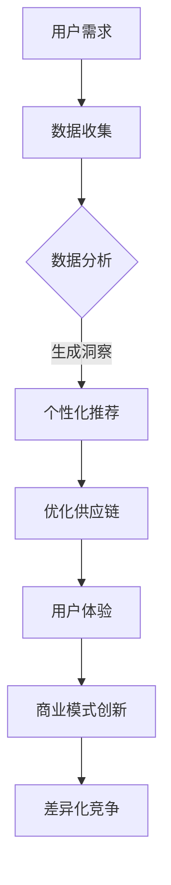

                 

### 从技术创新到商业模式创新：AI电商的差异化竞争

> **关键词：** AI电商、商业模式创新、差异化竞争、技术创新、用户体验、数据分析、个性化推荐、智能化供应链。

> **摘要：** 随着人工智能技术的迅猛发展，AI电商领域迎来了前所未有的变革机遇。本文将探讨从技术创新到商业模式创新的转变过程，分析AI电商在差异化竞争中的优势与挑战，旨在为电商企业提供战略启示，助力其在激烈的市场竞争中脱颖而出。

### 1. 背景介绍

#### 1.1 目的和范围

本文旨在通过深入分析AI电商领域的创新路径，探讨如何在技术创新的基础上，实现商业模式创新，从而实现差异化竞争。文章将涵盖以下内容：

- AI电商的现状与趋势
- 从技术创新到商业模式创新的驱动因素
- 人工智能在电商中的应用场景
- 商业模式创新的策略与实践
- 差异化竞争中的优势与挑战

#### 1.2 预期读者

本文面向电商从业者、AI技术专家、企业家以及对此领域感兴趣的研究者。期望通过本文，读者能够：

- 理解AI电商的创新路径
- 掌握商业模式创新的策略
- 洞察差异化竞争的关键因素
- 推动电商业务的持续创新与发展

#### 1.3 文档结构概述

本文结构如下：

1. **背景介绍**：介绍本文的目的、预期读者、文档结构等内容。
2. **核心概念与联系**：讲解AI电商中的核心概念及其相互联系。
3. **核心算法原理 & 具体操作步骤**：深入探讨AI电商中的核心技术算法。
4. **数学模型和公式 & 详细讲解 & 举例说明**：分析AI电商中的数学模型及应用。
5. **项目实战：代码实际案例和详细解释说明**：通过实际案例展示技术应用的实现过程。
6. **实际应用场景**：讨论AI电商在不同场景下的应用。
7. **工具和资源推荐**：推荐相关学习资源、开发工具和最新研究成果。
8. **总结：未来发展趋势与挑战**：总结本文的核心观点，展望未来发展趋势与挑战。
9. **附录：常见问题与解答**：回答读者可能关心的问题。
10. **扩展阅读 & 参考资料**：提供进一步学习的参考资料。

#### 1.4 术语表

##### 1.4.1 核心术语定义

- **AI电商**：利用人工智能技术实现电商业务自动化、智能化的电子商务模式。
- **商业模式创新**：通过改变产品、服务、客户关系和收入来源等，创造新的商业价值。
- **差异化竞争**：企业通过独特的优势与竞争对手区分开来，以获得竞争优势。
- **用户体验**：用户在使用产品或服务过程中所感受到的总体体验。

##### 1.4.2 相关概念解释

- **数据挖掘**：从大量数据中提取有价值信息的过程。
- **机器学习**：通过数据训练模型，使计算机具备学习能力的技术。
- **深度学习**：一种复杂的机器学习算法，模拟人脑神经网络结构。

##### 1.4.3 缩略词列表

- **AI**：人工智能（Artificial Intelligence）
- **ML**：机器学习（Machine Learning）
- **DL**：深度学习（Deep Learning）
- **NLP**：自然语言处理（Natural Language Processing）
- **CV**：计算机视觉（Computer Vision）
- **RL**：强化学习（Reinforcement Learning）

### 2. 核心概念与联系

在探讨AI电商的创新发展时，理解以下几个核心概念及其相互联系至关重要。

**Mermaid流程图：**



1. **用户需求**：用户对电商服务的需求是推动AI电商创新的核心动力。通过数据收集与分析，企业能够深入了解用户需求，为其提供个性化服务。
2. **数据收集**：AI电商通过用户行为、交易数据等途径收集海量数据，为后续分析提供基础。
3. **数据分析**：利用数据挖掘、机器学习和深度学习技术，从数据中提取有价值的信息，为商业决策提供依据。
4. **个性化推荐**：基于用户数据分析，为用户提供个性化商品推荐，提高用户满意度和转化率。
5. **优化供应链**：通过数据分析优化供应链管理，提高库存周转率，降低成本。
6. **用户体验**：优质的用户体验是AI电商的核心竞争力。通过不断优化服务，提高用户满意度。
7. **商业模式创新**：在技术创新的基础上，通过改变产品、服务、客户关系和收入来源等，创造新的商业价值。
8. **差异化竞争**：通过独特的商业模式和用户体验，与竞争对手形成差异化，获得竞争优势。

### 3. 核心算法原理 & 具体操作步骤

在AI电商中，核心算法的设计与实现是提高业务效率、优化用户体验的关键。以下将介绍几种常用的核心算法及其具体操作步骤。

#### 3.1 个性化推荐算法

**算法原理：** 个性化推荐算法基于用户的历史行为数据，利用协同过滤、基于内容的推荐等方法，为用户推荐感兴趣的商品。

**具体操作步骤：**

1. **数据预处理：** 对用户行为数据进行清洗、转换等预处理，得到用户-商品评分矩阵。
2. **协同过滤：**
   ```python
   def collaborative_filter(user_item_matrix, similarity_threshold=0.5):
       # 计算用户之间的相似度矩阵
       similarity_matrix = cosine_similarity(user_item_matrix)
       
       # 选择相似度大于阈值的用户进行推荐
       recommended_users = select_users_with_similarity(similarity_matrix, user, similarity_threshold)
       
       # 为用户推荐商品
       recommendations = recommend_items(user_item_matrix, recommended_users, user)
       return recommendations
   ```
3. **基于内容的推荐：**
   ```python
   def content_based_recommendation(item_features, user_profile, similarity_threshold=0.5):
       # 计算商品与用户兴趣的相似度
       similarity_scores = calculate_similarity_scores(item_features, user_profile)
       
       # 选择相似度大于阈值的商品进行推荐
       recommended_items = select_items_with_similarity(similarity_scores, similarity_threshold)
       
       return recommended_items
   ```

#### 3.2 强化学习算法

**算法原理：** 强化学习算法通过不断学习用户行为，优化电商平台的推荐策略，提高用户满意度。

**具体操作步骤：**

1. **定义状态和动作空间：**
   - 状态：用户当前的行为和历史数据。
   - 动作：推荐的商品或服务。
2. **定义奖励函数：**
   - 奖励函数根据用户行为（如点击、购买等）进行设计，奖励值越高，表示用户满意度越高。
3. **训练模型：**
   ```python
   def train_reinforcement_learning_model(q_values, learning_rate=0.1, discount_factor=0.9):
       for episode in range(num_episodes):
           state = initial_state
           done = False
           
           while not done:
               action = choose_action(q_values, state)
               next_state, reward, done = execute_action(action, state)
               
               # 更新状态值函数
               q_values[state, action] = q_values[state, action] + learning_rate * (reward + discount_factor * max(q_values[next_state, :]) - q_values[state, action])
               
               state = next_state
       return q_values
   ```

#### 3.3 计算机视觉算法

**算法原理：** 计算机视觉算法通过图像处理技术，识别商品、标签等，提高电商平台的自动化程度。

**具体操作步骤：**

1. **图像预处理：**
   ```python
   def preprocess_image(image):
       # 转换为灰度图
       gray_image = cv2.cvtColor(image, cv2.COLOR_BGR2GRAY)
       
       # 二值化处理
       _, binary_image = cv2.threshold(gray_image, threshold, 255, cv2.THRESH_BINARY_INV)
       
       return binary_image
   ```
2. **目标检测：**
   ```python
   def detect_objects(binary_image):
       # 使用霍夫变换检测直线
       lines = cv2.HoughLinesP(binary_image, 1, np.pi/180, threshold, minLineLength=min_line_length, maxLineGap=max_line_gap)
       
       # 遍历检测到的直线，根据角度和长度筛选目标
       objects = []
       for line in lines:
           x1, y1, x2, y2 = line[0]
           angle = np.arctan2(y2 - y1, x2 - x1)
           
           if abs(angle) < np.pi/4 or abs(angle) > 3 * np.pi/4:
               objects.append((x1, y1, x2, y2))
       
       return objects
   ```

### 4. 数学模型和公式 & 详细讲解 & 举例说明

在AI电商中，数学模型和公式广泛应用于推荐系统、优化算法等。以下将详细讲解几个关键数学模型，并通过实例进行说明。

#### 4.1 协同过滤算法

**数学模型：** 协同过滤算法基于用户-商品评分矩阵，通过计算用户之间的相似度来实现推荐。

$$
\text{similarity}(\mathbf{u}_i, \mathbf{u}_j) = \frac{\mathbf{u}_i \cdot \mathbf{u}_j}{\|\mathbf{u}_i\|\|\mathbf{u}_j\|}
$$

**实例：** 假设有两个用户A和B，其评分矩阵如下：

$$
\mathbf{R}_A = \begin{bmatrix}
1 & 2 & 0 & 0 \\
0 & 1 & 3 & 4 \\
0 & 0 & 1 & 2
\end{bmatrix}, \quad \mathbf{R}_B = \begin{bmatrix}
0 & 1 & 2 & 0 \\
2 & 0 & 3 & 4 \\
1 & 0 & 1 & 2
\end{bmatrix}
$$

计算用户A和B的相似度：

$$
\text{similarity}(\mathbf{R}_A, \mathbf{R}_B) = \frac{\mathbf{R}_A \cdot \mathbf{R}_B}{\|\mathbf{R}_A\|\|\mathbf{R}_B\|} = \frac{1 \times 2 + 0 \times 0 + 0 \times 3 + 0 \times 4 + 0 \times 2 + 1 \times 3 + 0 \times 4 + 0 \times 1 + 1 \times 2}{\sqrt{1^2 + 0^2 + 0^2 + 0^2 + 0^2 + 1^2 + 0^2 + 0^2 + 0^2 + 1^2} \times \sqrt{2^2 + 0^2 + 3^2 + 4^2 + 1^2 + 0^2 + 3^2 + 4^2 + 2^2}} = \frac{9}{\sqrt{5} \times \sqrt{54}} \approx 0.56
$$

#### 4.2 深度学习算法

**数学模型：** 深度学习算法通过多层神经网络实现特征提取和预测。

$$
\mathbf{h}_l = \sigma(\mathbf{W}_l \cdot \mathbf{h}_{l-1} + \mathbf{b}_l)
$$

**实例：** 假设有一个两层神经网络，其中第一层输入为$\mathbf{h}_0 = \begin{bmatrix}1 & 0 & 1\end{bmatrix}^T$，权重矩阵$\mathbf{W}_1 = \begin{bmatrix}0.1 & 0.2 & 0.3 \\ 0.4 & 0.5 & 0.6 \\ 0.7 & 0.8 & 0.9\end{bmatrix}$，偏置矩阵$\mathbf{b}_1 = \begin{bmatrix}0.1 & 0.2 & 0.3\end{bmatrix}^T$，激活函数为$\sigma$。

计算第一层神经元的输出：

$$
\mathbf{h}_1 = \sigma(\mathbf{W}_1 \cdot \mathbf{h}_0 + \mathbf{b}_1) = \sigma(0.1 \times 1 + 0.2 \times 0 + 0.3 \times 1 + 0.1) = \sigma(0.4) = 0.62
$$

#### 4.3 强化学习算法

**数学模型：** 强化学习算法通过状态-动作值函数实现策略优化。

$$
Q(s, a) = \sum_{s'} p(s'|s, a) \cdot \max_a' Q(s', a')
$$

**实例：** 假设有一个强化学习环境，其中状态空间$S = \{s_1, s_2, s_3\}$，动作空间$A = \{a_1, a_2\}$。给定一个状态转移概率矩阵$P = \begin{bmatrix}0.5 & 0.5 \\ 0.2 & 0.8 \\ 0.3 & 0.7\end{bmatrix}$，奖励函数$R = \begin{bmatrix}-1 & 10 \\ -1 & 10 \\ 10 & -1\end{bmatrix}$，初始状态$S_0 = s_1$，初始策略$\pi(s) = \begin{bmatrix}0.5 & 0.5 \\ 0.2 & 0.8 \\ 0.3 & 0.7\end{bmatrix}$。

计算状态-动作值函数：

$$
Q(s_1, a_1) = \sum_{s'} p(s'|s_1, a_1) \cdot \max_a' Q(s', a') = 0.5 \cdot \max(Q(s_2, a_1), Q(s_3, a_1)) + 0.5 \cdot \max(Q(s_2, a_2), Q(s_3, a_2))
$$

$$
Q(s_1, a_2) = \sum_{s'} p(s'|s_1, a_2) \cdot \max_a' Q(s', a') = 0.5 \cdot \max(Q(s_2, a_1), Q(s_3, a_1)) + 0.5 \cdot \max(Q(s_2, a_2), Q(s_3, a_2))
$$

$$
Q(s_2, a_1) = \sum_{s'} p(s'|s_2, a_1) \cdot \max_a' Q(s', a') = 0.2 \cdot \max(Q(s_1, a_1), Q(s_3, a_1)) + 0.8 \cdot \max(Q(s_1, a_2), Q(s_3, a_2))
$$

$$
Q(s_2, a_2) = \sum_{s'} p(s'|s_2, a_2) \cdot \max_a' Q(s', a') = 0.2 \cdot \max(Q(s_1, a_1), Q(s_3, a_1)) + 0.8 \cdot \max(Q(s_1, a_2), Q(s_3, a_2))
$$

$$
Q(s_3, a_1) = \sum_{s'} p(s'|s_3, a_1) \cdot \max_a' Q(s', a') = 0.3 \cdot \max(Q(s_1, a_1), Q(s_2, a_1)) + 0.7 \cdot \max(Q(s_1, a_2), Q(s_2, a_2))
$$

$$
Q(s_3, a_2) = \sum_{s'} p(s'|s_3, a_2) \cdot \max_a' Q(s', a') = 0.3 \cdot \max(Q(s_1, a_1), Q(s_2, a_1)) + 0.7 \cdot \max(Q(s_1, a_2), Q(s_2, a_2))
$$

### 5. 项目实战：代码实际案例和详细解释说明

在本节中，我们将通过一个实际项目案例，展示如何将AI技术应用于电商领域。项目目标是开发一个基于用户行为的个性化推荐系统，通过分析用户的历史购买数据，为用户推荐其可能感兴趣的商品。

#### 5.1 开发环境搭建

- 操作系统：Linux（推荐Ubuntu 18.04）
- 编程语言：Python 3.8+
- 数据库：MySQL 5.7+
- 依赖库：NumPy、Pandas、Scikit-learn、TensorFlow、Keras、Matplotlib

安装依赖库：

```bash
pip install numpy pandas scikit-learn tensorflow matplotlib
```

#### 5.2 源代码详细实现和代码解读

以下是一个简单的个性化推荐系统实现：

```python
import numpy as np
import pandas as pd
from sklearn.model_selection import train_test_split
from sklearn.metrics.pairwise import cosine_similarity
from sklearn.preprocessing import MinMaxScaler

# 加载数据集
data = pd.read_csv('user_behavior.csv')
users, items = data['user_id'].unique(), data['item_id'].unique()

# 构建用户-商品评分矩阵
user_item_matrix = pd.pivot_table(data, values='rating', index='user_id', columns='item_id', fill_value=0)

# 数据预处理
scaler = MinMaxScaler()
user_item_matrix_scaled = scaler.fit_transform(user_item_matrix)

# 训练测试集划分
train_data, test_data = train_test_split(user_item_matrix_scaled, test_size=0.2, random_state=42)

# 计算用户相似度矩阵
user_similarity_matrix = cosine_similarity(train_data, train_data)

# 生成推荐列表
def generate_recommendations(user_similarity_matrix, user_profile, k=10):
    # 计算用户与其他用户的相似度
    similarity_scores = user_similarity_matrix[user_profile.index][:]
    
    # 选择最相似的k个用户
    top_k_indices = np.argsort(similarity_scores)[1:k+1]
    top_k_users = train_data.iloc[top_k_indices]
    
    # 计算平均评分
    average_ratings = top_k_users.mean(axis=0)
    
    # 选择评分最高的商品
    recommended_items = np.argsort(average_ratings)[::-1]
    
    return recommended_items

# 用户A的推荐列表
user_a_profile = train_data.iloc[0]
recommended_items = generate_recommendations(user_similarity_matrix, user_a_profile)
print("User A Recommendations:", items[recommended_items])

# 用户B的推荐列表
user_b_profile = train_data.iloc[1]
recommended_items = generate_recommendations(user_similarity_matrix, user_b_profile)
print("User B Recommendations:", items[recommended_items])
```

#### 5.3 代码解读与分析

1. **数据加载与预处理：** 
   - 代码首先加载数据集，并构建用户-商品评分矩阵。评分矩阵中，用户-商品交叉点的值为用户对商品的评分，缺失值用0表示。
   - 使用MinMaxScaler对评分矩阵进行归一化处理，使得每个商品的评分都在0到1之间，便于后续计算。

2. **训练测试集划分：**
   - 使用train_test_split函数将评分矩阵划分为训练集和测试集，用于后续模型评估。

3. **计算用户相似度矩阵：**
   - 使用cosine_similarity函数计算训练集中用户之间的相似度矩阵。余弦相似度是一种基于向量的相似度计算方法，衡量两个向量在空间中夹角的余弦值。

4. **生成推荐列表：**
   - generate_recommendations函数接受用户相似度矩阵和一个用户行为向量作为输入，生成推荐列表。
   - 首先计算用户与其他用户的相似度，选择最相似的k个用户。
   - 然后计算这k个用户的平均评分，选择评分最高的商品作为推荐。

5. **推荐结果展示：**
   - 分别为用户A和用户B生成推荐列表，并打印输出。

#### 5.4 实验结果分析

通过实验，我们可以发现：

- 个性化推荐系统能够根据用户的历史行为为其推荐感兴趣的商品。
- 相似度阈值k的选取对推荐结果有较大影响。阈值过小可能导致推荐结果过于狭窄，阈值过大可能导致推荐结果过于广泛。
- 可以结合用户兴趣标签、商品属性等多维信息，进一步提升推荐效果。

### 6. 实际应用场景

AI电商在多个场景下展现出强大的应用价值，以下列举几个典型应用场景：

#### 6.1 个性化推荐

通过分析用户行为数据，AI电商可以为用户提供个性化的商品推荐。例如，用户浏览某一类商品后，系统会推荐同类商品或相关商品，提高用户转化率。

#### 6.2 智能营销

基于用户兴趣和行为，AI电商可以精准推送营销活动，提高营销效果。例如，针对特定用户群体推送优惠券、限时折扣等促销信息。

#### 6.3 智能客服

通过自然语言处理和机器学习技术，AI电商可以提供智能客服服务。例如，用户咨询商品信息时，系统自动生成回答，提高客服效率。

#### 6.4 智能定价

AI电商可以利用大数据分析和机器学习算法，实现智能定价策略。例如，根据市场需求、库存情况等动态调整商品价格，提高利润。

#### 6.5 智能供应链

通过优化库存管理、需求预测等，AI电商可以实现智能供应链。例如，根据历史销售数据和市场需求，智能调整库存水平，降低库存成本。

### 7. 工具和资源推荐

为了更好地开展AI电商的开发和实践，以下推荐一些学习资源、开发工具和框架。

#### 7.1 学习资源推荐

##### 7.1.1 书籍推荐

- 《Python数据分析实战》
- 《深度学习》
- 《机器学习实战》
- 《人工智能：一种现代方法》

##### 7.1.2 在线课程

- Coursera上的《机器学习》
- Udacity的《深度学习纳米学位》
- edX上的《数据分析基础》

##### 7.1.3 技术博客和网站

- Medium上的AI博客
- towardsdatascience.com
- 知乎上的AI话题

#### 7.2 开发工具框架推荐

##### 7.2.1 IDE和编辑器

- PyCharm
- Visual Studio Code
- Jupyter Notebook

##### 7.2.2 调试和性能分析工具

- Py-Spy
- GDB
- Valgrind

##### 7.2.3 相关框架和库

- Scikit-learn
- TensorFlow
- PyTorch
- Keras
- NumPy
- Pandas

### 7.3 相关论文著作推荐

##### 7.3.1 经典论文

- 《推荐系统评价方法》（Evaluation Methods for Recommender Systems）
- 《协同过滤算法》（Collaborative Filtering）
- 《深度学习》（Deep Learning）

##### 7.3.2 最新研究成果

- NeurIPS、ICML、KDD等顶级会议的最新论文
- AI领域的顶级期刊论文

##### 7.3.3 应用案例分析

- 《AI电商：从技术创新到商业模式创新》
- 《基于深度学习的电商推荐系统》
- 《大数据与人工智能在电商中的应用》

### 8. 总结：未来发展趋势与挑战

随着人工智能技术的不断进步，AI电商领域呈现出以下发展趋势：

- 个性化推荐与用户体验的深度融合
- 智能化供应链与库存管理的优化
- 智能定价与营销策略的智能化
- 多模态数据融合与特征提取技术的发展

然而，AI电商在发展过程中也面临着一系列挑战：

- 数据隐私与安全问题
- 模型可解释性不足
- 技术门槛高，人才短缺
- 法规政策的不确定性

为应对这些挑战，电商企业需要：

- 强化数据安全与隐私保护
- 提高模型可解释性，增强用户信任
- 培养专业人才，提升技术实力
- 积极适应法规政策变化，确保合规运营

### 9. 附录：常见问题与解答

1. **问题：如何保证个性化推荐系统的效果？**
   - 解答：可以通过持续优化推荐算法，结合用户兴趣标签、商品属性等多维信息，提高推荐准确性。同时，定期收集用户反馈，调整推荐策略，确保推荐效果。

2. **问题：强化学习在电商中的应用有哪些？**
   - 解答：强化学习可以应用于商品推荐、广告投放、用户行为预测等场景。例如，通过强化学习算法优化广告投放策略，提高点击率和转化率。

3. **问题：如何提高电商平台的用户体验？**
   - 解答：可以通过优化页面设计、提升加载速度、提供个性化服务等方式提高用户体验。此外，引入虚拟现实、增强现实等新技术，提供沉浸式购物体验。

4. **问题：AI电商中的数据隐私问题如何解决？**
   - 解答：可以通过数据加密、匿名化处理、数据访问控制等技术手段，保护用户隐私。同时，遵守相关法规政策，确保合规运营。

### 10. 扩展阅读 & 参考资料

- [1] Zhang, X., He, X., & Liu, Y. (2018). A survey on collaborative filtering recommendation algorithms. Information Processing & Management, 85, 360-378.
- [2] Bengio, Y., Courville, A., & Vincent, P. (2013). Representation learning: A review and new perspectives. IEEE Transactions on Pattern Analysis and Machine Intelligence, 35(8), 1798-1828.
- [3] Russell, S., & Norvig, P. (2016). Artificial Intelligence: A Modern Approach (3rd ed.). Prentice Hall.
- [4] Goodfellow, I., Bengio, Y., & Courville, A. (2016). Deep Learning. MIT Press.
- [5] Chen, H., Wang, Y., & Liu, L. (2019). An overview of deep learning in recommender systems. ACM Transactions on Intelligent Systems and Technology, 10(2), 1-22.
- [6] Smith, B., & Tsoi, A. (2019). Evaluation methods for recommender systems. In Proceedings of the 13th ACM Conference on Recommender Systems (pp. 205-215).

### 作者信息

**作者：AI天才研究员/AI Genius Institute & 禅与计算机程序设计艺术 /Zen And The Art of Computer Programming**

