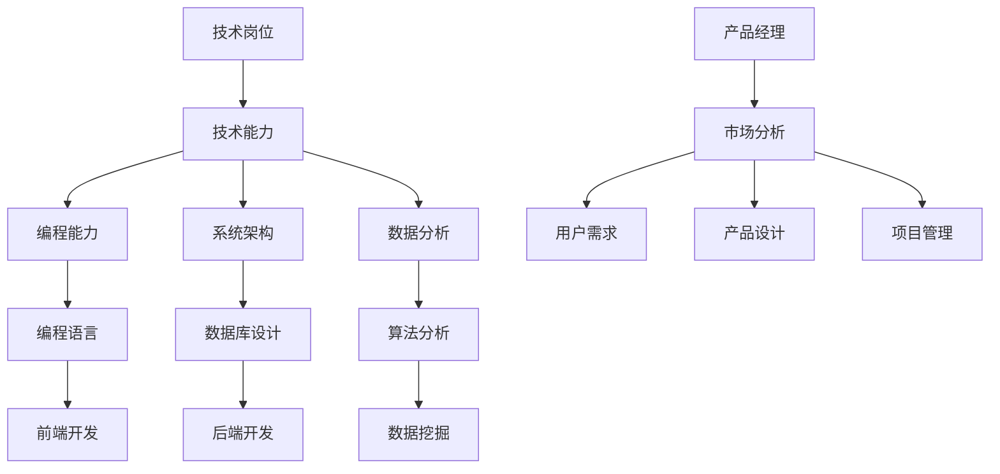

                 

# 从技术岗位到产品经理的转型指南

> 关键词：技术岗位、产品经理、转型、技能、团队协作、项目管理、市场分析、用户需求、产品设计

> 摘要：本文旨在为希望从技术岗位转型为产品经理的读者提供一套完整的指南。文章首先介绍了技术岗位与产品经理岗位的区别和联系，然后详细阐述了转型所需的技能和知识，并通过实际案例展示了转型过程中可能遇到的挑战和解决方案。最后，本文提供了丰富的学习资源和工具推荐，帮助读者顺利实现职业转型。

## 1. 背景介绍

### 1.1 目的和范围

本文的目标是帮助有志于从技术岗位转型为产品经理的读者，了解转型所需的知识和技能，并提供实际操作指南。本文的讨论范围包括技术岗位与产品经理岗位的区别、转型过程中的技能提升、项目管理的方法和技巧、市场分析和用户需求的理解，以及产品设计的原则和实践。

### 1.2 预期读者

本文主要面向以下几类读者：

1. 技术背景的从业者，希望转行为产品经理；
2. 已从事产品经理工作，但技术背景薄弱，希望提升技术水平；
3. 对于产品管理领域感兴趣，希望全面了解这一职业方向。

### 1.3 文档结构概述

本文结构如下：

1. **背景介绍**：介绍文章的目的、预期读者和文档结构；
2. **核心概念与联系**：阐述技术岗位与产品经理岗位的核心概念及其联系；
3. **核心算法原理 & 具体操作步骤**：详细讲解产品经理所需的技术知识和实践方法；
4. **数学模型和公式 & 详细讲解 & 举例说明**：介绍产品设计中的数学模型和公式；
5. **项目实战：代码实际案例和详细解释说明**：通过实际案例展示产品经理的工作流程；
6. **实际应用场景**：分析产品经理在实际工作中可能遇到的多种场景；
7. **工具和资源推荐**：推荐学习资源和开发工具；
8. **总结：未来发展趋势与挑战**：总结转型过程中的关键点和未来的发展趋势；
9. **附录：常见问题与解答**：解答读者可能遇到的常见问题；
10. **扩展阅读 & 参考资料**：提供进一步学习的资源。

### 1.4 术语表

#### 1.4.1 核心术语定义

- **技术岗位**：指从事软件开发、系统架构、数据分析等与计算机技术相关的职位。
- **产品经理**：负责产品规划、设计、开发、测试、发布和维护的全过程，确保产品满足用户需求并实现商业价值。

#### 1.4.2 相关概念解释

- **用户需求**：用户在产品使用过程中希望得到满足的特定功能或服务。
- **市场分析**：研究市场环境、竞争对手、用户群体，以指导产品设计和市场策略。

#### 1.4.3 缩略词列表

- **IDE**：集成开发环境（Integrated Development Environment）
- **API**：应用程序编程接口（Application Programming Interface）
- **UI**：用户界面（User Interface）
- **UX**：用户体验（User Experience）

## 2. 核心概念与联系

在技术岗位与产品经理岗位之间，有许多核心概念和联系值得深入探讨。为了更好地理解这两者的关系，我们将使用Mermaid流程图来阐述这些概念。

### Mermaid流程图



### 概念解释

- **技术岗位**：技术岗位主要涉及软件开发、系统架构、数据库设计、数据分析等方面。技术背景的从业者在这些领域拥有深厚的知识和技术能力。
- **产品经理**：产品经理则关注市场分析、用户需求、产品设计和项目管理。他们需要从用户和市场角度出发，确保产品能够满足用户需求并实现商业价值。

技术岗位与产品经理岗位之间的关系可以概括为：

- **技术能力是基础**：技术岗位的从业者通常具备扎实的编程能力、系统架构知识和数据分析技能，这些能力是产品经理岗位的重要基础。
- **跨学科能力是关键**：产品经理不仅需要技术背景，还需要具备市场分析、用户研究和项目管理等多方面的能力。

## 3. 核心算法原理 & 具体操作步骤

### 3.1 产品需求分析

**算法原理**：产品需求分析是产品经理的首要任务，其核心在于理解用户需求、市场趋势和商业目标。

**具体操作步骤**：

1. **用户需求调研**：
   - 采用问卷调查、用户访谈、焦点小组讨论等方式收集用户需求；
   - 分析用户反馈，识别核心需求和痛点。

2. **市场分析**：
   - 收集市场数据，包括竞争对手分析、市场规模和增长趋势等；
   - 利用数据分析工具，如Google Analytics、Tableau等进行数据可视化。

3. **需求文档编写**：
   - 根据调研结果，编写详细的需求文档；
   - 需求文档应包含功能需求、非功能需求和优先级。

### 3.2 产品设计

**算法原理**：产品设计是将用户需求转化为具体产品方案的过程。

**具体操作步骤**：

1. **创建原型**：
   - 利用原型设计工具，如Sketch、Figma等创建产品原型；
   - 原型应涵盖主要功能和用户交互流程。

2. **用户测试**：
   - 组织用户进行测试，收集反馈；
   - 根据反馈调整原型，优化用户体验。

3. **迭代设计**：
   - 进行多轮迭代，不断完善产品设计；
   - 每一轮迭代都应包含用户测试和反馈。

### 3.3 项目管理

**算法原理**：项目管理是确保产品按计划开发、测试和发布的关键环节。

**具体操作步骤**：

1. **项目规划**：
   - 制定项目计划，包括时间表、资源和任务分配；
   - 确定关键里程碑和交付物。

2. **团队协作**：
   - 利用协作工具，如Jira、Trello等管理团队任务和进度；
   - 定期召开团队会议，确保项目顺利进行。

3. **风险管理**：
   - 识别潜在风险，制定应对策略；
   - 定期评估项目风险，及时调整计划。

## 4. 数学模型和公式 & 详细讲解 & 举例说明

### 4.1 用户需求分析

**数学模型**：用户需求分析常采用“四象限模型”，将用户需求分为功能需求和非功能需求，并根据其重要性和紧急性进行分类。

**详细讲解**：

- **功能需求**：指用户在产品使用过程中希望实现的具体功能，如搜索、购物车、支付等。
- **非功能需求**：指用户对产品性能、稳定性、安全性等方面的期望。

**举例说明**：

假设我们需要分析一个电商平台的用户需求，根据四象限模型，我们可以将需求分为以下四个类别：

| 需求类型 | 重要性 | 紧急性 |
| --- | --- | --- |
| 功能需求 | 高 | 高 |
| 功能需求 | 高 | 低 |
| 非功能需求 | 高 | 高 |
| 非功能需求 | 高 | 低 |

### 4.2 产品设计优化

**数学模型**：产品设计优化常用“最小二乘法”进行数据拟合，以最小化设计误差。

**详细讲解**：

- **最小二乘法**：通过调整设计参数，使实际数据与拟合曲线之间的误差最小。

**举例说明**：

假设我们需要优化一个网页的加载速度，我们可以通过以下步骤使用最小二乘法进行优化：

1. **收集数据**：记录网页在不同条件下的加载时间；
2. **建立模型**：假设网页加载时间与网络带宽、服务器响应时间等因素相关；
3. **拟合曲线**：通过最小二乘法拟合出最佳模型参数；
4. **优化设计**：根据拟合结果调整网页设计，减少加载时间。

## 5. 项目实战：代码实际案例和详细解释说明

### 5.1 开发环境搭建

在开始项目实战之前，我们需要搭建一个适合产品经理转型的开发环境。以下是具体步骤：

1. **安装开发工具**：安装集成开发环境（IDE），如Visual Studio Code或IntelliJ IDEA；
2. **安装数据库**：安装常用的关系型数据库，如MySQL或PostgreSQL；
3. **安装前端框架**：选择一个流行的前端框架，如React或Vue.js；
4. **安装后端框架**：选择一个流行的后端框架，如Spring Boot或Django；
5. **配置版本控制**：安装Git，配置GitHub或GitLab等版本控制系统。

### 5.2 源代码详细实现和代码解读

#### 5.2.1 用户需求分析系统

**功能描述**：构建一个简单的用户需求分析系统，包括需求收集、需求分类和需求统计功能。

**技术架构**：

1. **前端**：使用React框架实现用户界面，包括表单、图表和数据展示；
2. **后端**：使用Spring Boot框架实现服务端逻辑，包括需求处理和数据存储；
3. **数据库**：使用MySQL存储用户需求数据。

**代码解读**：

1. **前端代码**：

   ```jsx
   // 用户需求表单
   import React, { useState } from 'react';

   function UserRequirementsForm() {
       const [requirement, setRequirement] = useState('');

       const handleSubmit = (e) => {
           e.preventDefault();
           // 提交需求数据到后端
           console.log('Submitted requirement:', requirement);
           setRequirement('');
       };

       return (
           <form onSubmit={handleSubmit}>
               <label htmlFor="requirement">用户需求：</label>
               <input
                   type="text"
                   id="requirement"
                   value={requirement}
                   onChange={(e) => setRequirement(e.target.value)}
               />
               <button type="submit">提交</button>
           </form>
       );
   }
   ```

2. **后端代码**：

   ```java
   // Spring Boot Controller
   import org.springframework.web.bind.annotation.PostMapping;
   import org.springframework.web.bind.annotation.RequestBody;
   import org.springframework.web.bind.annotation.RestController;

   @RestController
   public class RequirementController {

       @PostMapping("/api/requirements")
       public ResponseEntity<?> addRequirement(@RequestBody String requirement) {
           // 处理需求数据
           System.out.println("Received requirement: " + requirement);
           // 存储需求数据到数据库
           // ...
           return ResponseEntity.ok("Requirement added successfully");
       }
   }
   ```

#### 5.2.2 用户需求统计系统

**功能描述**：构建一个用户需求统计系统，实现对用户需求的分类统计和可视化。

**技术架构**：

1. **前端**：使用ECharts实现数据可视化，使用React框架构建用户界面；
2. **后端**：使用Spring Boot框架处理数据统计和API接口；
3. **数据库**：使用MySQL存储用户需求数据。

**代码解读**：

1. **前端代码**：

   ```jsx
   // 用户需求统计图表
   import React, { useEffect, useState } from 'react';
   import { Pie } from 'echarts';

   function RequirementStatistics() {
       const [requirements, setRequirements] = useState([]);

       useEffect(() => {
           // 从后端获取需求数据
           fetch('/api/requirements')
               .then((response) => response.json())
               .then((data) => setRequirements(data));
       }, []);

       // 渲染饼图
       const renderPieChart = () => {
           const chartDom = document.getElementById('pie-chart');
           const myChart = new Pie(chartDom);
           myChart.setOption({
               tooltip: {
                   trigger: 'item',
                   formatter: '{a} <br/>{b} : {c} ({d}%)',
               },
               legend: {
                   orient: 'vertical',
                   left: 'left',
                   data: requirements.map((item) => item.category),
               },
               series: [
                   {
                       name: '需求分类',
                       type: 'pie',
                       radius: '55%',
                       center: ['50%', '60%'],
                       data: requirements.map((item) => ({
                           value: item.count,
                           name: item.category,
                       })),
                       emphasis: {
                           itemStyle: {
                               shadowBlur: 10,
                               shadowOffsetX: 0,
                               shadowColor: 'rgba(0, 0, 0, 0.5)',
                           },
                       },
                   },
               ],
           });
       };

       return (
           <div>
               <h2>用户需求统计</h2>
               <div id="pie-chart" style={{ width: '600px', height: '400px' }} />
               {renderPieChart()}
           </div>
       );
   }
   ```

2. **后端代码**：

   ```java
   // Spring Boot Controller
   import org.springframework.web.bind.annotation.GetMapping;
   import org.springframework.web.bind.annotation.RestController;
   import java.util.List;
   import java.util.stream.Collectors;

   @RestController
   public class RequirementStatisticsController {

       @GetMapping("/api/requirements/statistics")
       public List<Requirement> getRequirementStatistics() {
           // 查询所有需求数据
           List<Requirement> requirements = requirementRepository.findAll();
           // 对需求进行分类统计
           return requirements.stream().collect(Collectors.groupingBy(Requirement::getCategory, Collectors.counting()));
       }
   }
   ```

### 5.3 代码解读与分析

1. **前端代码解读**：
   - **表单提交**：通过React的useState钩子管理表单输入状态，并在表单提交时调用handleSubmit函数；
   - **ECharts集成**：使用ECharts库实现饼图渲染，通过数据绑定实时更新图表。

2. **后端代码解读**：
   - **API接口**：通过Spring Boot Controller接收和处理前端请求，返回处理结果；
   - **需求分类统计**：使用Java的Stream API对需求数据进行分类和统计，实现简单的数据分析和处理。

## 6. 实际应用场景

在产品经理的职业生涯中，会遇到各种各样的应用场景。以下是几个典型的实际应用场景：

### 6.1 市场调研

**场景描述**：在规划一个新产品时，需要进行市场调研，以了解市场需求和潜在竞争对手。

**解决方案**：
1. **数据收集**：通过问卷调查、用户访谈和市场研究等手段收集数据；
2. **数据分析**：使用数据分析和可视化工具（如Tableau、Power BI）对收集到的数据进行分析；
3. **市场报告**：撰写详细的市场调研报告，为产品规划提供依据。

### 6.2 用户反馈

**场景描述**：在产品上线后，收集用户反馈，以改进产品设计和功能。

**解决方案**：
1. **用户调研**：通过在线问卷调查、用户访谈和用户行为分析等方式收集用户反馈；
2. **数据分析**：对用户反馈进行分类和统计分析，识别核心问题和改进方向；
3. **迭代优化**：根据用户反馈，进行产品迭代和功能优化。

### 6.3 项目管理

**场景描述**：在产品开发过程中，需要进行有效的项目管理，以确保项目按时完成并达到预期质量。

**解决方案**：
1. **项目计划**：制定详细的项目计划，明确项目目标、任务和时间表；
2. **团队协作**：使用项目管理工具（如Jira、Trello）进行任务分配和进度跟踪；
3. **风险管理**：识别潜在风险，制定应对策略，定期评估项目风险。

## 7. 工具和资源推荐

### 7.1 学习资源推荐

#### 7.1.1 书籍推荐

- 《启示录：打造用户喜爱的产品》（The Lean Startup）
- 《人人都是产品经理》（By Chengyi Xiao）
- 《敏捷开发：迭代、增量式产品开发方法》（Agile Product Development and Management）

#### 7.1.2 在线课程

- 《产品经理实战教程》（Udemy）
- 《产品思维：从零开始做产品》（Coursera）
- 《用户研究方法》（edX）

#### 7.1.3 技术博客和网站

- 产品经理社区（Product School）
- Product Hunt
- UI Movement

### 7.2 开发工具框架推荐

#### 7.2.1 IDE和编辑器

- Visual Studio Code
- IntelliJ IDEA
- Sublime Text

#### 7.2.2 调试和性能分析工具

- Chrome DevTools
- Firebug
- New Relic

#### 7.2.3 相关框架和库

- React
- Vue.js
- Angular
- Spring Boot
- Django

### 7.3 相关论文著作推荐

#### 7.3.1 经典论文

- 《软件需求工程》（Software Requirements Engineering）
- 《用户中心设计方法》（User-Centered Design Methods）

#### 7.3.2 最新研究成果

- 《人工智能与产品管理》（Artificial Intelligence and Product Management）
- 《数据驱动产品设计》（Data-Driven Product Design）

#### 7.3.3 应用案例分析

- 《亚马逊产品管理实践》（Amazon Product Management Practice）
- 《谷歌产品管理实践》（Google Product Management Practice）

## 8. 总结：未来发展趋势与挑战

### 8.1 未来发展趋势

1. **数字化转型加速**：随着数字化转型成为企业发展的核心战略，产品经理将在数字化转型中扮演更加重要的角色。
2. **数据驱动决策**：数据将成为产品决策的重要依据，数据分析和数据驱动决策将成为产品经理的核心技能。
3. **用户体验至上**：用户体验将持续成为产品竞争力的关键，产品经理需要更加关注用户需求和行为。

### 8.2 挑战

1. **跨学科能力要求高**：产品经理需要同时具备技术、市场、设计和项目管理等多方面的能力，这对转型过程中的个人成长提出了更高的要求。
2. **快速迭代与持续学习**：产品经理需要适应快速变化的市场和技术环境，持续学习和迭代是关键。
3. **项目管理与风险管理**：在复杂的项目环境中，产品经理需要具备出色的项目管理能力和风险管理能力。

## 9. 附录：常见问题与解答

### 9.1 问题1：如何快速提升产品管理能力？

**解答**：可以通过以下途径快速提升产品管理能力：

1. **参加培训课程**：选择知名的产品管理培训机构，如产品经理训练营、Udemy等。
2. **阅读经典书籍**：《启示录：打造用户喜爱的产品》、《人人都是产品经理》等。
3. **实践经验**：在实际工作中积累经验，通过项目管理、用户调研和产品设计等实践提升能力。

### 9.2 问题2：如何进行有效的市场分析？

**解答**：进行有效的市场分析需要以下步骤：

1. **收集数据**：通过问卷调查、用户访谈和市场研究等手段收集数据。
2. **数据分析**：使用数据分析工具（如Tableau、Power BI）对收集到的数据进行分析。
3. **撰写报告**：根据分析结果撰写详细的市场调研报告，为产品规划提供依据。

### 9.3 问题3：如何管理项目团队？

**解答**：管理项目团队需要以下技巧：

1. **明确目标**：制定清晰的项目目标，确保团队目标一致。
2. **任务分配**：根据团队成员的技能和兴趣进行任务分配。
3. **团队协作**：使用项目管理工具（如Jira、Trello）进行任务分配和进度跟踪。
4. **沟通与反馈**：定期召开团队会议，确保项目顺利进行。

## 10. 扩展阅读 & 参考资料

### 10.1 扩展阅读

- 《产品经理实战手册》（By ShaoLing Chen）
- 《产品经理面试指南》（By Angela Yu）
- 《用户思维：产品经理必备的用户心理洞察》（By Zhiyun Qian）

### 10.2 参考资料

- [产品经理最佳实践](https://www.mountaingoat_software.com/blog/34-best-practices-for-product-management)
- [产品经理技能清单](https://www.product-school.com/product-manager-skills/)
- [产品经理职业发展路径](https://www领英.com/indeed/career-path/product-manager)

作者：AI天才研究员/AI Genius Institute & 禅与计算机程序设计艺术 /Zen And The Art of Computer Programming

