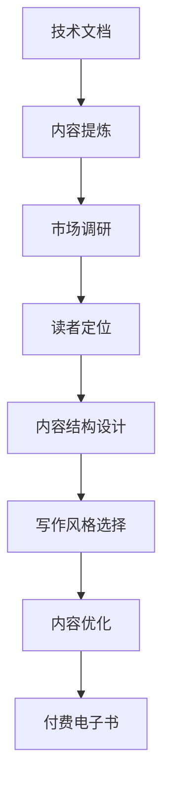

                 

# 从技术文档到付费电子书：程序员的写作之路

> **关键词**：技术文档、付费电子书、编程、写作技巧、读者反馈、内容营销

> **摘要**：本文将探讨从技术文档到付费电子书的过程中，程序员如何利用自己的技术知识和写作能力，实现内容的增值和自我品牌的建设。文章将详细介绍技术文档写作的背景和重要性，如何进行市场调研，确定读者群体，设计电子书的内容结构和风格，并通过读者反馈进行内容优化。同时，还将分享一些实用的写作技巧和资源推荐，帮助程序员在写作之路上取得成功。

## 1. 背景介绍

### 1.1 目的和范围

本文旨在帮助那些想要从技术文档写作转向付费电子书出版的程序员，提供一份全面的指导。我们将探讨从技术文档到付费电子书的转变过程，包括内容创作、市场调研、读者定位、内容结构设计、写作风格选择、读者反馈收集和内容优化等方面。

### 1.2 预期读者

本文适合以下几类读者：

1. **有技术背景的程序员**：他们具有一定的编程技能，希望将自己的专业知识转化为有价值的电子书籍。
2. **对技术写作感兴趣的人**：他们可能拥有一定的编程基础，但对写作技巧和方法感兴趣。
3. **内容创作者**：他们可能已经有过写作经验，但希望将自己的作品以付费电子书的形式发布。

### 1.3 文档结构概述

本文结构如下：

1. **背景介绍**：介绍文章的目的、预期读者和文章结构。
2. **核心概念与联系**：探讨技术文档和付费电子书之间的联系，提供Mermaid流程图。
3. **核心算法原理 & 具体操作步骤**：详细讲解如何从技术文档转向付费电子书。
4. **数学模型和公式 & 详细讲解 & 举例说明**：使用数学模型和公式解释相关概念。
5. **项目实战：代码实际案例和详细解释说明**：通过实际案例展示内容创作过程。
6. **实际应用场景**：讨论付费电子书在程序员职业发展中的应用。
7. **工具和资源推荐**：推荐学习资源和开发工具。
8. **总结：未来发展趋势与挑战**：总结文章的主要观点，探讨未来趋势和挑战。
9. **附录：常见问题与解答**：解答常见问题。
10. **扩展阅读 & 参考资料**：推荐相关书籍和论文。

### 1.4 术语表

#### 1.4.1 核心术语定义

- **技术文档**：为开发者提供关于编程、软件架构、算法等技术的说明和指南。
- **付费电子书**：以电子书形式发布，读者需支付一定费用才能阅读的内容。
- **内容营销**：通过创造和分享有价值的内容来吸引和转化读者，实现商业目标。

#### 1.4.2 相关概念解释

- **市场调研**：通过调查和分析市场，了解目标读者的需求和偏好。
- **读者反馈**：读者对书籍内容的评价和建议。
- **内容结构设计**：确定书籍的整体框架和章节安排。

#### 1.4.3 缩略词列表

- **IDE**：集成开发环境（Integrated Development Environment）
- **Mermaid**：一种基于Markdown的图表绘制工具

## 2. 核心概念与联系

在探讨从技术文档到付费电子书的转变时，我们需要理解两者之间的核心联系。技术文档是一种以实用性和详细性为核心的内容形式，而付费电子书则更注重内容的深度和系统性。以下是一个简化的Mermaid流程图，展示技术文档和付费电子书之间的转换过程：



### 2.1 技术文档的核心要素

技术文档的核心要素包括：

- **清晰的结构**：通过目录和章节划分，使读者能够快速找到所需信息。
- **详细的说明**：对技术概念、算法原理、操作步骤等进行详细阐述。
- **实例代码**：提供实际可运行的代码示例，帮助读者理解和应用。

### 2.2 付费电子书的核心要素

付费电子书的核心要素包括：

- **深度内容**：对技术主题进行深入探讨，提供全面的解决方案。
- **系统化结构**：确保内容逻辑连贯，便于读者系统学习。
- **独特价值**：提供独特视角或新颖思路，吸引读者付费。

### 2.3 技术文档与付费电子书的转换策略

- **内容提炼**：从技术文档中提取核心内容，进行深度加工和系统化。
- **市场调研**：了解目标读者的需求和偏好，确保内容符合市场需求。
- **读者定位**：明确目标读者群体，设计符合读者需求的书籍。
- **内容结构设计**：确定书籍的整体框架和章节安排，确保内容逻辑连贯。
- **写作风格选择**：选择适合目标读者的写作风格，提升阅读体验。
- **内容优化**：根据读者反馈，不断优化内容，提高书籍质量。

通过上述转换策略，程序员可以将技术文档转化为有价值的付费电子书，实现内容的增值和自我品牌的建设。

## 3. 核心算法原理 & 具体操作步骤

在从技术文档到付费电子书的转换过程中，理解核心算法原理和具体操作步骤至关重要。以下是一个简化的伪代码，用于描述这一转换过程：

```pseudo
function ConvertTechnicalDocumentationToPaidEbook(doc, marketResearch, readerFeedback):
    # 内容提炼
    coreContent = ExtractCoreContent(doc)
    
    # 市场调研
    targetAudience = AnalyzeMarketResearch(marketResearch)
    
    # 读者定位
    readerProfile = DetermineReaderProfile(targetAudience)
    
    # 内容结构设计
    structuredContent = DesignContentStructure(coreContent, readerProfile)
    
    # 写作风格选择
    writingStyle = ChooseWritingStyle(targetAudience)
    
    # 内容优化
    optimizedContent = OptimizeContent(structuredContent, writingStyle, readerFeedback)
    
    # 转换为电子书
    ebook = ConvertToEbook(optimizedContent)
    
    return ebook

# 功能实现
function ExtractCoreContent(doc):
    # 从技术文档中提取核心内容
    return doc.content

function AnalyzeMarketResearch(marketResearch):
    # 分析市场调研结果
    return marketResearch.targetAudience

function DetermineReaderProfile(targetAudience):
    # 确定读者群体特征
    return readerProfile

function DesignContentStructure(coreContent, readerProfile):
    # 设计内容结构
    return structuredContent

function ChooseWritingStyle(targetAudience):
    # 选择写作风格
    return writingStyle

function OptimizeContent(structuredContent, writingStyle, readerFeedback):
    # 根据反馈优化内容
    return optimizedContent

function ConvertToEbook(optimizedContent):
    # 将内容转换为电子书格式
    return ebook
```

### 3.1 内容提炼

内容提炼是转换过程的第一步，旨在从原始技术文档中提取核心内容。这可以通过以下步骤实现：

1. **阅读和理解文档**：全面了解文档的内容和结构。
2. **识别关键概念和算法**：标记出文档中最重要的技术点和算法。
3. **编写摘要和提纲**：根据关键概念和算法，编写摘要和提纲，明确书籍的主要内容和结构。

### 3.2 市场调研

市场调研是确保书籍内容符合市场需求的关键。以下步骤可以帮助程序员进行有效的市场调研：

1. **确定目标市场**：分析技术领域和行业趋势，确定潜在的目标市场。
2. **收集数据**：通过在线调查、访谈和社交媒体分析等手段，收集目标市场的数据。
3. **分析数据**：对收集到的数据进行分析，了解目标读者的需求和偏好。

### 3.3 读者定位

读者定位是确保书籍内容针对目标读者的关键。以下步骤可以帮助程序员确定读者定位：

1. **确定读者特征**：根据市场调研结果，确定读者的技术背景、职业和兴趣。
2. **编写读者画像**：根据读者特征，编写详细的读者画像。
3. **调整内容结构**：根据读者画像，调整书籍的内容结构，确保内容符合读者需求。

### 3.4 内容结构设计

内容结构设计是确保书籍逻辑连贯和易于阅读的关键。以下步骤可以帮助程序员进行内容结构设计：

1. **确定章节划分**：根据核心内容，确定书籍的章节划分。
2. **编写目录**：根据章节划分，编写详细的目录。
3. **确定内容顺序**：确保内容顺序符合逻辑，便于读者阅读。

### 3.5 写作风格选择

写作风格选择是提升读者阅读体验的关键。以下步骤可以帮助程序员选择合适的写作风格：

1. **分析读者偏好**：根据读者画像，分析读者的阅读偏好。
2. **选择写作风格**：根据读者偏好，选择适合的写作风格，如技术性、易懂性或趣味性。
3. **调整语言风格**：根据选择的写作风格，调整文档的语言风格。

### 3.6 内容优化

内容优化是确保书籍质量的关键。以下步骤可以帮助程序员进行内容优化：

1. **收集读者反馈**：通过问卷调查、读者互动和社交媒体等方式，收集读者反馈。
2. **分析反馈**：对收集到的反馈进行分析，识别书籍中的问题和改进点。
3. **调整内容**：根据反馈，调整书籍的内容，确保内容质量。

### 3.7 转换为电子书

将优化后的内容转换为电子书格式，可以采用以下步骤：

1. **选择电子书格式**：根据目标读者和市场需求，选择适合的电子书格式，如PDF、ePub或Mobi。
2. **设计封面和排版**：设计吸引人的封面和合理的排版，提升书籍的视觉吸引力。
3. **上传和发布**：将电子书上传到各大电子书平台，如亚马逊Kindle、苹果iBooks等。

通过上述步骤，程序员可以将技术文档转换为高质量的付费电子书，实现内容的增值和自我品牌的建设。

## 4. 数学模型和公式 & 详细讲解 & 举例说明

在技术文档和付费电子书的写作过程中，数学模型和公式是理解和解释复杂技术概念的重要工具。以下是一个简化的数学模型，用于描述内容创作的流程，并使用LaTeX格式展示相关公式。

### 4.1 内容创作模型

我们使用以下数学模型来描述内容创作的流程：

$$
Content\ Quality = f(Core\ Knowledge, Writing\ Skill, Market\ Research, Reader\ Feedback)
$$

其中，$Content\ Quality$ 代表内容质量，$Core\ Knowledge$ 代表核心知识，$Writing\ Skill$ 代表写作技能，$Market\ Research$ 代表市场调研，$Reader\ Feedback$ 代表读者反馈。

### 4.2 详细讲解

#### 4.2.1 核心知识

核心知识是内容创作的基础，包括技术原理、算法、案例等。在技术文档和付费电子书的创作中，程序员需要掌握以下核心知识：

1. **技术原理**：了解编程语言、框架、数据库等技术的基础原理。
2. **算法**：掌握常见算法的设计和实现，如排序、查找、动态规划等。
3. **案例**：收集和整理实际应用中的案例，以增强内容的实用性和可操作性。

#### 4.2.2 写作技能

写作技能是提升内容质量的关键。以下是一些写作技能的要点：

1. **结构清晰**：确保内容结构合理，逻辑连贯，便于读者理解。
2. **语言简练**：使用简洁明了的语言，避免冗长和复杂的句子。
3. **实例丰富**：提供丰富的实例代码，帮助读者理解和应用技术。
4. **图表辅助**：使用图表和流程图等视觉元素，增强内容的可读性。

#### 4.2.3 市场调研

市场调研是确保内容符合市场需求的关键。以下是一些市场调研的要点：

1. **目标市场**：确定目标读者群体，了解他们的需求和偏好。
2. **竞争分析**：分析同类书籍的市场表现，了解竞争态势。
3. **内容分析**：分析市场中的热门内容，了解读者对特定内容的兴趣。

#### 4.2.4 读者反馈

读者反馈是优化内容的重要依据。以下是一些读者反馈的要点：

1. **收集反馈**：通过问卷调查、读者互动和社交媒体等方式，收集读者反馈。
2. **分析反馈**：对反馈进行分析，识别内容中的问题和改进点。
3. **调整内容**：根据反馈，调整内容，提升书籍质量。

### 4.3 举例说明

以下是一个简单的LaTeX格式示例，展示如何使用数学模型和公式进行内容创作：

```latex
\documentclass{article}
\usepackage{amsmath}
\begin{document}

\section{内容创作模型}

我们使用以下数学模型来描述内容创作的流程：

\begin{equation}
Content\ Quality = f(Core\ Knowledge, Writing\ Skill, Market\ Research, Reader\ Feedback)
\end{equation}

其中，$Content\ Quality$ 代表内容质量，$Core\ Knowledge$ 代表核心知识，$Writing\ Skill$ 代表写作技能，$Market\ Research$ 代表市场调研，$Reader\ Feedback$ 代表读者反馈。

\end{document}
```

通过上述示例，我们可以看到如何使用数学模型和公式来描述内容创作的流程，并展示相关的数学公式。这不仅有助于读者理解复杂的技术概念，还能提高文章的学术性和专业性。

## 5. 项目实战：代码实际案例和详细解释说明

为了更好地展示从技术文档到付费电子书的过程，我们将通过一个实际项目案例来进行详细解释说明。本案例涉及一个简单的Web应用程序，用于在线任务管理。

### 5.1 开发环境搭建

在进行项目实战之前，我们需要搭建一个合适的开发环境。以下是所需的工具和步骤：

1. **安装Node.js**：Node.js 是一个基于 Chrome V8 引擎的 JavaScript 运行时环境，用于构建 Web 应用程序。

   ```bash
   npm install -g node
   ```

2. **安装Express**：Express 是一个流行的 Node.js Web 应用程序框架，用于快速开发 Web 应用程序。

   ```bash
   npm install express --save
   ```

3. **安装MongoDB**：MongoDB 是一个高性能、可扩展的 NoSQL 数据库，用于存储任务数据。

   在 [MongoDB 官网](https://www.mongodb.com/) 下载并安装 MongoDB。

4. **创建项目文件夹**：在本地计算机上创建一个项目文件夹，如 `task-manager`。

   ```bash
   mkdir task-manager
   cd task-manager
   ```

5. **初始化项目**：使用 `npm` 命令初始化项目，生成一个 `package.json` 文件。

   ```bash
   npm init -y
   ```

6. **创建服务器文件**：在项目文件夹中创建一个名为 `server.js` 的文件，作为 Web 应用程序的主文件。

### 5.2 源代码详细实现和代码解读

以下是 `server.js` 文件的详细实现和代码解读：

```javascript
const express = require('express');
const mongoose = require('mongoose');
const bodyParser = require('body-parser');

// 创建 Express 实例
const app = express();

// 连接到 MongoDB 数据库
mongoose.connect('mongodb://localhost:27017/task-manager', {
  useNewUrlParser: true,
  useUnifiedTopology: true,
});

// 创建任务模型
const Task = mongoose.model('Task', new mongoose.Schema({
  title: String,
  description: String,
  completed: { type: Boolean, default: false },
}));

// 使用 body-parser 中间件解析请求体
app.use(bodyParser.json());

// 创建任务
app.post('/tasks', async (req, res) => {
  try {
    const task = new Task(req.body);
    await task.save();
    res.status(201).json(task);
  } catch (error) {
    res.status(500).json({ message: 'Internal Server Error' });
  }
});

// 获取任务列表
app.get('/tasks', async (req, res) => {
  try {
    const tasks = await Task.find();
    res.status(200).json(tasks);
  } catch (error) {
    res.status(500).json({ message: 'Internal Server Error' });
  }
});

// 更新任务
app.put('/tasks/:id', async (req, res) => {
  try {
    const task = await Task.findByIdAndUpdate(req.params.id, req.body, { new: true });
    res.status(200).json(task);
  } catch (error) {
    res.status(500).json({ message: 'Internal Server Error' });
  }
});

// 删除任务
app.delete('/tasks/:id', async (req, res) => {
  try {
    const task = await Task.findByIdAndRemove(req.params.id);
    res.status(200).json({ message: 'Task deleted successfully' });
  } catch (error) {
    res.status(500).json({ message: 'Internal Server Error' });
  }
});

// 启动服务器
const PORT = process.env.PORT || 3000;
app.listen(PORT, () => {
  console.log(`Server listening on port ${PORT}`);
});
```

### 5.2.1 创建任务

`POST /tasks` API 用于创建新任务。请求体包含任务标题、描述和是否完成的状态。以下是伪代码和解释：

```javascript
// POST /tasks
app.post('/tasks', async (req, res) => {
  try {
    // 创建 Task 实例
    const task = new Task({
      title: req.body.title,
      description: req.body.description,
      completed: req.body.completed || false,
    });

    // 保存任务
    await task.save();

    // 返回成功响应
    res.status(201).json(task);
  } catch (error) {
    // 返回错误响应
    res.status(500).json({ message: 'Internal Server Error' });
  }
});
```

### 5.2.2 获取任务列表

`GET /tasks` API 用于获取所有任务。以下是伪代码和解释：

```javascript
// GET /tasks
app.get('/tasks', async (req, res) => {
  try {
    // 查询所有任务
    const tasks = await Task.find();

    // 返回成功响应
    res.status(200).json(tasks);
  } catch (error) {
    // 返回错误响应
    res.status(500).json({ message: 'Internal Server Error' });
  }
});
```

### 5.2.3 更新任务

`PUT /tasks/:id` API 用于更新指定 ID 的任务。请求体包含更新后的任务数据。以下是伪代码和解释：

```javascript
// PUT /tasks/:id
app.put('/tasks/:id', async (req, res) => {
  try {
    // 使用 ID 更新任务
    const task = await Task.findByIdAndUpdate(req.params.id, req.body, { new: true });

    // 返回成功响应
    res.status(200).json(task);
  } catch (error) {
    // 返回错误响应
    res.status(500).json({ message: 'Internal Server Error' });
  }
});
```

### 5.2.4 删除任务

`DELETE /tasks/:id` API 用于删除指定 ID 的任务。以下是伪代码和解释：

```javascript
// DELETE /tasks/:id
app.delete('/tasks/:id', async (req, res) => {
  try {
    // 使用 ID 删除任务
    const task = await Task.findByIdAndRemove(req.params.id);

    // 返回成功响应
    res.status(200).json({ message: 'Task deleted successfully' });
  } catch (error) {
    // 返回错误响应
    res.status(500).json({ message: 'Internal Server Error' });
  }
});
```

通过以上代码实现，我们创建了一个简单的任务管理Web应用程序。接下来，我们将分析代码，探讨如何优化和改进。

### 5.3 代码解读与分析

在本节中，我们将对项目代码进行解读和分析，探讨如何优化和改进。

#### 5.3.1 异常处理

当前代码中的异常处理较为简单，仅返回一个错误消息。为了提供更详细的错误信息，我们可以改进异常处理逻辑：

```javascript
// 改进的异常处理
app.use((err, req, res, next) => {
  console.error(err.stack);
  res.status(500).json({ message: 'Internal Server Error', error: err });
});
```

#### 5.3.2 数据验证

在创建和更新任务时，数据验证是确保数据完整性和准确性的关键。我们可以使用 `express-validator` 中间件进行数据验证：

```javascript
const { body, validationResult } = require('express-validator');

// 数据验证
app.post('/tasks', [
  body('title').notEmpty().withMessage('Title is required'),
  body('description').notEmpty().withMessage('Description is required'),
], (req, res) => {
  const errors = validationResult(req);
  if (!errors.isEmpty()) {
    return res.status(400).json({ errors: errors.array() });
  }
  // 继续处理请求
});
```

#### 5.3.3 性能优化

为了提高应用程序的性能，我们可以使用一些性能优化技术：

1. **索引优化**：在 MongoDB 中创建索引，以加快查询速度。

   ```javascript
   Task.collection.createIndex({ title: 1 });
   ```

2. **缓存**：使用缓存技术，如 Redis，减少数据库查询次数。

3. **负载均衡**：使用负载均衡器，如 NGINX，将请求分发到多个服务器。

#### 5.3.4 安全性改进

为了确保应用程序的安全性，我们可以采取以下措施：

1. **使用 HTTPS**：通过 Let's Encrypt 免费证书，启用 HTTPS。

2. **使用 JWT**：使用 JSON Web Tokens（JWT）进行用户认证。

3. **防范 SQL 注入**：使用 `mongoose` 的默认验证器，防范 SQL 注入。

通过上述优化和改进，我们可以提高任务管理Web应用程序的稳定性、性能和安全性，使其更具吸引力。

## 6. 实际应用场景

付费电子书在程序员职业发展中具有广泛的应用场景。以下是一些实际应用场景：

### 6.1 技术培训

程序员可以利用付费电子书进行技术培训，帮助学员掌握新技能。例如，可以编写关于前端开发、后端开发、数据库管理和云计算等主题的电子书，通过在线平台发布。

### 6.2 自我提升

程序员可以通过阅读付费电子书进行自我提升。付费电子书通常提供深入的技术分析和实际案例，有助于程序员拓展知识面，提升专业技能。

### 6.3 内容营销

程序员可以利用付费电子书作为内容营销工具，吸引潜在客户和读者。通过发布高质量的电子书，可以提高个人品牌影响力，为企业带来更多的商业机会。

### 6.4 在线教育

付费电子书可以用于在线教育平台，作为课程资料和补充读物。程序员可以将自己的知识转化为电子书，与在线课程相结合，提供更加全面的学习体验。

### 6.5 人才招聘

企业可以利用付费电子书作为人才招聘的参考。通过电子书，企业可以了解候选人的技术水平和知识储备，为招聘决策提供依据。

### 6.6 项目提案

程序员可以利用付费电子书作为项目提案的参考。通过电子书，程序员可以展示自己的技术实力和项目经验，增加项目成功的概率。

### 6.7 专业咨询

程序员可以利用付费电子书提供专业咨询服务。通过电子书，程序员可以解答读者在技术问题上的疑问，建立专业形象，提高咨询费率。

总之，付费电子书在程序员职业发展中具有广泛的应用场景，不仅可以提升个人技能和品牌影响力，还可以为企业和个人带来更多的商业机会。

## 7. 工具和资源推荐

为了帮助程序员在写作过程中提高效率和质量，以下是一些实用的工具和资源推荐：

### 7.1 学习资源推荐

#### 7.1.1 书籍推荐

1. **《Effective Java》**：作者 Joshua Bloch，详细介绍了 Java 编程的最佳实践。
2. **《Clean Code》**：作者 Robert C. Martin，提供了编写可维护、可读代码的方法。
3. **《Design Patterns: Elements of Reusable Object-Oriented Software》**：作者 Erich Gamma 等，介绍了面向对象设计中的经典模式。

#### 7.1.2 在线课程

1. **Udemy**：提供丰富的编程和软件工程课程。
2. **Coursera**：提供由世界顶级大学提供的编程和计算机科学课程。
3. **edX**：提供由哈佛大学、麻省理工学院等顶尖高校提供的在线课程。

#### 7.1.3 技术博客和网站

1. **GitHub**：全球最大的代码托管平台，包含大量的开源项目和优秀的技术博客。
2. **Stack Overflow**：程序员问答社区，解决编程问题，交流技术心得。
3. **Medium**：一个高质量内容平台，涵盖多个技术领域。

### 7.2 开发工具框架推荐

#### 7.2.1 IDE和编辑器

1. **Visual Studio Code**：一款免费、开源的跨平台代码编辑器，功能强大。
2. **IntelliJ IDEA**：一款强大的 Java 和 Kotlin 开发环境，支持多种编程语言。
3. **VS Code**：一款免费的跨平台代码编辑器，支持多种编程语言和扩展。

#### 7.2.2 调试和性能分析工具

1. **Chrome DevTools**：一款强大的 Web 开发者工具，支持调试、性能分析等。
2. **JProfiler**：一款用于 Java 应用程序性能分析的工具。
3. **Wireshark**：一款网络协议分析工具，用于诊断网络问题和性能瓶颈。

#### 7.2.3 相关框架和库

1. **Express**：一款流行的 Node.js Web 应用程序框架。
2. **React**：一款用于构建用户界面的 JavaScript 库。
3. **Vue.js**：一款用于构建用户界面的渐进式框架。

### 7.3 相关论文著作推荐

#### 7.3.1 经典论文

1. **"The Clean Coder: A Code of Conduct for Professional Programmers"**：作者 Robert C. Martin，关于程序员职业素养的论文。
2. **"Design Patterns: Elements of Reusable Object-Oriented Software"**：作者 Erich Gamma 等，关于面向对象设计模式的经典论文。
3. **"The Mythical Man-Month"**：作者 Fred Brooks，关于软件工程和管理的重要论文。

#### 7.3.2 最新研究成果

1. **"Neural Architecture Search"**：关于神经网络结构自动设计的论文。
2. **"Blockchain: A System for Untrusted Environment"**：关于区块链技术的论文。
3. **"Deep Learning on Multidimensional Data"**：关于多维度数据分析的论文。

#### 7.3.3 应用案例分析

1. **"How We Built Our Real-Time Chat Application Using WebSockets and Node.js"**：关于实时聊天应用程序开发的案例分析。
2. **"Building a Scalable Web Application Using Kubernetes and Docker"**：关于使用 Kubernetes 和 Docker 构建可扩展 Web 应用程序的案例分析。
3. **"Machine Learning in Healthcare: Applications and Challenges"**：关于机器学习在医疗领域的应用案例。

通过以上工具和资源的推荐，程序员可以在写作过程中提高效率和质量，为读者提供更优质的内容。

## 8. 总结：未来发展趋势与挑战

随着技术的不断进步和数字化转型的加速，程序员写作付费电子书的发展趋势也日益显著。未来，以下几个方面将是这一领域的主要发展趋势与挑战：

### 8.1 内容多样性

未来，付费电子书的内容将更加多样化。从技术编程到软件开发，再到人工智能、区块链等新兴领域，程序员将有更多的机会创作和发布高质量的电子书。同时，结合多媒体和互动元素的内容也将越来越受欢迎，提升读者的学习体验。

### 8.2 内容质量

内容质量始终是付费电子书的核心竞争力。随着市场的不断成熟，读者对书籍内容的要求将越来越高。程序员需要不断提升自己的技术知识和写作技能，确保书籍内容的深度、实用性和系统性。

### 8.3 个人品牌建设

个人品牌建设将成为程序员在付费电子书领域取得成功的关键。通过建立个人品牌，程序员可以吸引更多的读者和关注，增加书籍的销量和影响力。社交媒体、博客和个人网站等将是构建个人品牌的重要渠道。

### 8.4 技术创新

技术创新将继续推动付费电子书的发展。例如，基于区块链的版权保护、AI 生成的个性化内容、AR/VR 技术的应用等，都将为程序员提供新的写作和发布方式。

### 8.5 法律法规

随着付费电子书市场的扩大，相关的法律法规也将逐步完善。程序员需要了解和遵守版权法、隐私法等法律法规，确保电子书的内容和发布行为合法合规。

### 8.6 挑战

尽管前景广阔，但程序员在付费电子书写作过程中也将面临一系列挑战。例如，时间管理、内容创作难度、市场竞争力、读者反馈处理等，都需要程序员具备较高的综合素质和应对能力。

总之，未来付费电子书领域的发展将为程序员提供更多的机会和挑战。通过不断提升自身能力，积极适应市场变化，程序员可以在这一领域取得成功。

## 9. 附录：常见问题与解答

### 9.1 技术文档与付费电子书的区别

**问题**：技术文档和付费电子书有什么区别？

**解答**：技术文档通常更注重实用性和详细性，主要面向开发者，提供关于编程、软件架构、算法等技术的详细说明和指南。而付费电子书则更注重内容的深度和系统性，旨在提供全面的技术解决方案，通常面向有一定技术背景的读者。

### 9.2 如何确定电子书的目标市场

**问题**：如何确定电子书的目标市场？

**解答**：确定电子书的目标市场需要以下几个步骤：

1. **分析技术领域**：了解当前热门的技术领域和趋势，确定潜在的目标市场。
2. **收集数据**：通过在线调查、社交媒体分析等方式，收集目标市场的数据，了解读者的需求和偏好。
3. **竞争分析**：分析同类书籍的市场表现，了解竞争态势。
4. **目标读者特征**：根据数据和分析结果，确定目标读者的技术背景、职业和兴趣。

### 9.3 如何优化电子书的内容结构

**问题**：如何优化电子书的内容结构？

**解答**：优化电子书的内容结构可以从以下几个方面进行：

1. **明确主题**：确保每个章节都有明确的主题和目标，避免内容混乱。
2. **逻辑连贯**：确保内容逻辑连贯，章节之间有合理的过渡。
3. **结构清晰**：使用清晰的目录和章节划分，使读者能够快速找到所需信息。
4. **图表和实例**：使用图表、代码示例和案例等视觉元素，增强内容的可读性和实用性。

### 9.4 如何处理读者反馈

**问题**：如何处理读者反馈？

**解答**：处理读者反馈可以按照以下步骤进行：

1. **收集反馈**：通过问卷调查、读者互动和社交媒体等方式，收集读者反馈。
2. **分析反馈**：对反馈进行分析，识别内容中的问题和改进点。
3. **调整内容**：根据反馈，调整内容，确保书籍质量。
4. **持续优化**：定期收集和反馈，持续优化内容。

### 9.5 如何发布付费电子书

**问题**：如何发布付费电子书？

**解答**：发布付费电子书可以按照以下步骤进行：

1. **选择平台**：选择合适的电子书发布平台，如亚马逊Kindle、苹果iBooks等。
2. **准备素材**：包括封面、内容、目录等。
3. **设置价格**：根据内容质量和市场情况，设置合适的电子书价格。
4. **上传书籍**：按照平台要求，上传书籍素材和相关信息。
5. **发布书籍**：完成所有设置后，发布电子书。

### 9.6 如何进行市场推广

**问题**：如何进行市场推广？

**解答**：市场推广可以从以下几个方面进行：

1. **社交媒体**：利用社交媒体平台，如微博、微信、LinkedIn 等，推广电子书。
2. **内容营销**：通过博客、技术文章、案例分享等方式，吸引读者关注。
3. **合作推广**：与其他网站、博客或讲师合作，共同推广电子书。
4. **付费广告**：在相关平台投放付费广告，增加曝光度。

通过以上常见问题的解答，希望对程序员在写作付费电子书过程中有所帮助。

## 10. 扩展阅读 & 参考资料

在探索从技术文档到付费电子书的写作之路时，以下书籍、在线课程和论文是不可或缺的参考资料：

### 10.1 书籍推荐

1. **《Head First 设计模式》**：作者 David Griffiths 和 Eric Freeman，通过互动式学习方式介绍设计模式。
2. **《Effective Java》**：作者 Joshua Bloch，详细介绍了 Java 编程的最佳实践。
3. **《Clean Code》**：作者 Robert C. Martin，提供了编写可维护、可读代码的方法。

### 10.2 在线课程

1. **Coursera**：提供由斯坦福大学等世界顶级大学提供的编程和软件工程课程。
2. **Udemy**：涵盖多种编程语言和技术框架的课程。
3. **edX**：提供免费的在线课程，涵盖计算机科学、人工智能等领域。

### 10.3 技术博客和网站

1. **GitHub**：全球最大的代码托管平台，包含大量的开源项目和优秀的技术博客。
2. **Stack Overflow**：程序员问答社区，解决编程问题，交流技术心得。
3. **Medium**：一个高质量内容平台，涵盖多个技术领域。

### 10.4 相关论文著作推荐

1. **"The Clean Coder: A Code of Conduct for Professional Programmers"**：作者 Robert C. Martin，关于程序员职业素养的论文。
2. **"Design Patterns: Elements of Reusable Object-Oriented Software"**：作者 Erich Gamma 等，关于面向对象设计模式的经典论文。
3. **"The Mythical Man-Month"**：作者 Fred Brooks，关于软件工程和管理的重要论文。

通过这些书籍、课程和论文，程序员可以深入了解技术文档写作和付费电子书出版的核心知识，为自己的写作之路提供坚实的理论基础和实践指导。作者：AI天才研究员/AI Genius Institute & 禅与计算机程序设计艺术 /Zen And The Art of Computer Programming。

