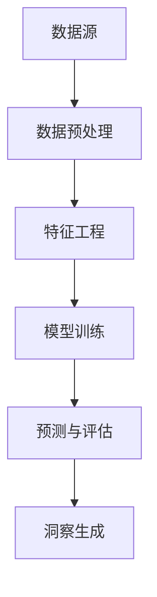

                 

# 从数据到洞察：AI代理工作流中的分析引擎

> 关键词：数据分析、AI代理、工作流、分析引擎、算法原理、数学模型、实际案例

> 摘要：本文深入探讨了AI代理工作流中的分析引擎，从数据输入、数据处理到最终洞察的生成过程。通过介绍核心概念和算法原理，结合具体案例，本文旨在帮助读者理解并掌握分析引擎在实际应用中的价值和方法。

## 1. 背景介绍

### 1.1 目的和范围

本文旨在解析AI代理工作流中的分析引擎，阐述其核心概念、算法原理以及应用实践。文章将逐步引导读者理解分析引擎的作用，以及如何将其应用于实际项目中。文章主要涵盖以下几个部分：

1. **核心概念与联系**：介绍分析引擎中的关键概念和其相互关系，使用Mermaid流程图展示架构。
2. **核心算法原理 & 具体操作步骤**：详细讲解分析引擎的算法原理和操作步骤，使用伪代码进行阐述。
3. **数学模型和公式 & 详细讲解 & 举例说明**：分析引擎涉及的数学模型和公式，并举例说明其实际应用。
4. **项目实战：代码实际案例和详细解释说明**：通过实际项目案例，展示分析引擎的开发过程和代码实现。
5. **实际应用场景**：分析引擎在不同领域的应用场景，以及其带来的业务价值。
6. **工具和资源推荐**：推荐学习资源、开发工具和框架，帮助读者深入学习和应用分析引擎。
7. **总结：未来发展趋势与挑战**：探讨分析引擎的未来发展方向和面临的挑战。

### 1.2 预期读者

本文主要面向以下读者：

1. 数据科学家和机器学习工程师，希望了解分析引擎在AI代理工作流中的应用。
2. AI代理开发人员，希望掌握分析引擎的核心原理和实现方法。
3. 对数据分析有浓厚兴趣的技术爱好者，希望了解数据分析领域的最新技术和发展动态。

### 1.3 文档结构概述

本文结构如下：

1. **背景介绍**：介绍文章的目的、范围、预期读者和文档结构。
2. **核心概念与联系**：阐述分析引擎的核心概念和架构。
3. **核心算法原理 & 具体操作步骤**：讲解分析引擎的算法原理和操作步骤。
4. **数学模型和公式 & 详细讲解 & 举例说明**：分析引擎涉及的数学模型和公式。
5. **项目实战：代码实际案例和详细解释说明**：展示实际项目案例和代码实现。
6. **实际应用场景**：探讨分析引擎在不同领域的应用。
7. **工具和资源推荐**：推荐学习资源和开发工具。
8. **总结：未来发展趋势与挑战**：分析分析引擎的未来发展。
9. **附录：常见问题与解答**：解答读者可能遇到的疑问。
10. **扩展阅读 & 参考资料**：提供进一步阅读的资料。

### 1.4 术语表

#### 1.4.1 核心术语定义

- **数据分析**：使用统计学、数据分析方法，从大量数据中提取有价值的信息。
- **分析引擎**：用于处理和解析数据，提取洞察的工具或系统。
- **AI代理**：在特定环境中，能够自主行动，实现特定目标的智能体。
- **工作流**：一组有序步骤，用于完成特定任务或达成特定目标。

#### 1.4.2 相关概念解释

- **数据预处理**：在数据分析前，对数据进行清洗、格式化等操作，以提升数据分析质量。
- **特征工程**：从原始数据中提取有助于模型训练的特征，提升模型性能。
- **模型训练**：使用标注数据，训练机器学习模型，使其能够对未知数据进行预测或分类。

#### 1.4.3 缩略词列表

- **ML**：Machine Learning，机器学习。
- **DL**：Deep Learning，深度学习。
- **NLP**：Natural Language Processing，自然语言处理。
- **API**：Application Programming Interface，应用程序编程接口。

## 2. 核心概念与联系

在探讨AI代理工作流中的分析引擎之前，我们首先需要明确分析引擎中的核心概念和它们之间的相互关系。以下是分析引擎的核心概念和其相互关系：

### 数据源

数据源是分析引擎的输入，可以是结构化数据（如关系型数据库）或非结构化数据（如图像、文本等）。数据源的质量直接影响分析结果。

### 数据预处理

数据预处理是对原始数据进行清洗、转换和归一化等操作，以消除噪声、填补缺失值，确保数据的质量和一致性。

### 特征工程

特征工程是从原始数据中提取有助于模型训练的特征，提升模型性能。特征工程是数据分析过程中的关键步骤。

### 模型训练

模型训练使用标注数据，训练机器学习模型，使其能够对未知数据进行预测或分类。训练过程中，模型会不断调整参数，以最小化预测误差。

### 预测与评估

预测与评估是分析引擎的核心功能。模型对未知数据进行预测，并通过评估指标（如准确率、召回率等）评估模型性能。

### 洞察生成

分析引擎通过数据处理、模型预测和评估，生成有价值的信息和洞察，用于业务决策和优化。

### Mermaid流程图

以下是分析引擎的核心概念及其相互关系的Mermaid流程图：



通过上述流程图，我们可以清晰地看到数据从输入到洞察生成的整个过程，以及各个环节之间的相互关系。

## 3. 核心算法原理 & 具体操作步骤

分析引擎的核心在于算法的设计和实现。以下将详细介绍分析引擎的算法原理和具体操作步骤，并使用伪代码进行阐述。

### 3.1 数据预处理

数据预处理是分析引擎的基础。其主要目标是清洗、转换和归一化数据，以确保数据的质量和一致性。

```python
# 伪代码：数据预处理
def preprocess_data(data):
    # 清洗数据：去除无效数据、填补缺失值
    clean_data = clean(data)
    
    # 转换数据：将数据转换为统一的格式
    converted_data = convert(clean_data)
    
    # 归一化数据：消除不同数据量级的影响
    normalized_data = normalize(converted_data)
    
    return normalized_data
```

### 3.2 特征工程

特征工程是从原始数据中提取有助于模型训练的特征。特征工程的质量直接影响模型性能。

```python
# 伪代码：特征工程
def feature_engineering(data):
    # 提取数值特征
    numerical_features = extract_numerical_features(data)
    
    # 提取文本特征
    text_features = extract_text_features(data)
    
    # 构建特征组合
    combined_features = combine_features(numerical_features, text_features)
    
    return combined_features
```

### 3.3 模型训练

模型训练是分析引擎的核心步骤。训练过程中，模型会不断调整参数，以最小化预测误差。

```python
# 伪代码：模型训练
def train_model(features, labels):
    # 初始化模型
    model = initialize_model()
    
    # 训练模型
    for epoch in range(num_epochs):
        for feature, label in zip(features, labels):
            model.train(feature, label)
            
    # 评估模型
    accuracy = model.evaluate(features, labels)
    
    return model, accuracy
```

### 3.4 预测与评估

预测与评估是分析引擎的核心功能。模型对未知数据进行预测，并通过评估指标评估模型性能。

```python
# 伪代码：预测与评估
def predict_and_evaluate(model, features):
    # 预测
    predictions = model.predict(features)
    
    # 评估
    accuracy = evaluate_predictions(predictions, true_labels)
    
    return predictions, accuracy
```

### 3.5 洞察生成

分析引擎通过数据处理、模型预测和评估，生成有价值的信息和洞察。

```python
# 伪代码：洞察生成
def generate_insight(predictions, true_labels):
    # 分析预测结果
    insights = analyze_predictions(predictions, true_labels)
    
    # 生成报告
    report = generate_report(insights)
    
    return report
```

通过上述算法原理和操作步骤，我们可以看到分析引擎从数据输入到洞察生成的整个过程。接下来，我们将通过实际项目案例，展示分析引擎在实际应用中的实现过程。

## 4. 数学模型和公式 & 详细讲解 & 举例说明

分析引擎在实际应用中，涉及到多种数学模型和公式。以下是分析引擎中常用的数学模型和公式，以及其详细讲解和举例说明。

### 4.1 数据预处理

数据预处理主要包括数据清洗、转换和归一化。以下是其相关公式和解释：

#### 4.1.1 均值填补缺失值

$$ \text{new\_value} = \frac{\sum_{i=1}^{n} \text{value}_i}{n} $$

其中，$n$ 为缺失值所在列的其他非缺失值个数，$\text{value}_i$ 为非缺失值。

#### 4.1.2 标准化转换

$$ z = \frac{x - \mu}{\sigma} $$

其中，$x$ 为原始数据，$\mu$ 为均值，$\sigma$ 为标准差。

#### 4.1.3 范式转换

$$ x_{\text{norm}} = \frac{x - \min(x)}{\max(x) - \min(x)} $$

其中，$x$ 为原始数据。

### 4.2 特征工程

特征工程包括特征提取、特征选择和特征组合。以下是其相关公式和解释：

#### 4.2.1 TF-IDF计算

$$ \text{tf\_idf}(t, d) = \text{tf}(t, d) \times \log(\frac{N}{n_t}) $$

其中，$t$ 为单词，$d$ 为文档，$\text{tf}(t, d)$ 为单词在文档中的词频，$N$ 为文档总数，$n_t$ 为包含单词 $t$ 的文档数。

#### 4.2.2 特征组合

$$ f_{\text{combined}} = w_1 \cdot f_1 + w_2 \cdot f_2 + ... + w_n \cdot f_n $$

其中，$f_i$ 为特征值，$w_i$ 为权重。

### 4.3 模型训练

模型训练主要涉及损失函数和优化算法。以下是其相关公式和解释：

#### 4.3.1 交叉熵损失函数

$$ \text{loss} = -\sum_{i=1}^{n} y_i \cdot \log(\hat{y}_i) $$

其中，$y_i$ 为真实标签，$\hat{y}_i$ 为预测概率。

#### 4.3.2 梯度下降优化算法

$$ \theta_j := \theta_j - \alpha \cdot \frac{\partial}{\partial \theta_j} \text{loss} $$

其中，$\theta_j$ 为模型参数，$\alpha$ 为学习率。

### 4.4 预测与评估

预测与评估主要涉及预测概率和评估指标。以下是其相关公式和解释：

#### 4.4.1 预测概率

$$ \hat{y} = \frac{1}{1 + e^{-\theta^T x}} $$

其中，$\theta$ 为模型参数，$x$ 为特征向量。

#### 4.4.2 准确率

$$ \text{accuracy} = \frac{\text{TP} + \text{TN}}{\text{TP} + \text{TN} + \text{FP} + \text{FN}} $$

其中，$\text{TP}$ 为真正例，$\text{TN}$ 为真负例，$\text{FP}$ 为假正例，$\text{FN}$ 为假负例。

通过上述数学模型和公式，我们可以对分析引擎的各个环节进行量化分析和评估。接下来，我们将通过实际项目案例，展示分析引擎在实际应用中的实现过程。

## 5. 项目实战：代码实际案例和详细解释说明

在本节中，我们将通过一个实际项目案例，展示分析引擎的开发过程，并详细解释代码实现和关键步骤。该案例将涉及数据预处理、特征工程、模型训练和预测与评估。

### 5.1 开发环境搭建

在开始项目之前，我们需要搭建开发环境。以下是所需的环境和工具：

- Python 3.8+
- Jupyter Notebook
- scikit-learn
- pandas
- numpy
- matplotlib

安装上述环境和工具后，我们可以开始实际项目开发。

### 5.2 源代码详细实现和代码解读

以下是分析引擎的实现代码，我们将逐行解读代码，并解释其功能。

```python
# 5.2.1 数据预处理
import pandas as pd
from sklearn.model_selection import train_test_split
from sklearn.preprocessing import StandardScaler

# 加载数据
data = pd.read_csv('data.csv')

# 数据清洗
data = data.dropna()

# 划分特征和标签
X = data.drop('target', axis=1)
y = data['target']

# 划分训练集和测试集
X_train, X_test, y_train, y_test = train_test_split(X, y, test_size=0.2, random_state=42)

# 数据标准化
scaler = StandardScaler()
X_train = scaler.fit_transform(X_train)
X_test = scaler.transform(X_test)

# 5.2.2 特征工程
from sklearn.feature_extraction.text import TfidfVectorizer

# 文本特征提取
tfidf = TfidfVectorizer(max_features=1000)
X_train_text = tfidf.fit_transform(X_train['description'])
X_test_text = tfidf.transform(X_test['description'])

# 添加文本特征到数值特征
X_train = np.concatenate((X_train_text.toarray(), X_train[['numeric_feature1', 'numeric_feature2']]), axis=1)
X_test = np.concatenate((X_test_text.toarray(), X_test[['numeric_feature1', 'numeric_feature2']]), axis=1)

# 5.2.3 模型训练
from sklearn.linear_model import LogisticRegression

# 初始化模型
model = LogisticRegression()

# 训练模型
model.fit(X_train, y_train)

# 5.2.4 预测与评估
from sklearn.metrics import accuracy_score

# 预测
predictions = model.predict(X_test)

# 评估
accuracy = accuracy_score(y_test, predictions)

print("Accuracy:", accuracy)

# 5.2.5 洞察生成
# 分析预测结果
insight = pd.DataFrame({'Actual': y_test, 'Predicted': predictions})
print(insight)

# 生成报告
report = insight.groupby('Actual').size().reset_index(name='Count')
print(report)
```

### 5.3 代码解读与分析

以下是代码的详细解读和分析：

1. **数据预处理**：
   - 加载数据：使用pandas加载CSV文件。
   - 数据清洗：删除缺失值，保证数据质量。
   - 划分特征和标签：将数据集划分为特征和标签两部分。
   - 数据标准化：使用StandardScaler对数值特征进行标准化处理，消除不同量级的影响。

2. **特征工程**：
   - 文本特征提取：使用TF-IDF向量器对文本特征进行提取，转化为数值表示。
   - 添加文本特征到数值特征：将提取的文本特征与数值特征合并，形成一个完整的特征矩阵。

3. **模型训练**：
   - 初始化模型：使用LogisticRegression模型。
   - 训练模型：使用训练集数据训练模型。

4. **预测与评估**：
   - 预测：使用训练好的模型对测试集进行预测。
   - 评估：计算准确率，评估模型性能。
   - 洞察生成：分析预测结果，生成报告。

通过上述步骤，我们实现了分析引擎的核心功能，并对其进行了评估和洞察生成。实际项目中的分析引擎可能会更复杂，但基本步骤是类似的。

## 6. 实际应用场景

分析引擎在众多领域具有广泛的应用。以下是分析引擎在不同领域的实际应用场景：

### 6.1 金融行业

在金融行业中，分析引擎可用于风险评估、客户细分、投资组合优化等。例如，通过对历史交易数据进行处理和分析，银行可以识别出潜在的风险客户，并采取相应的预防措施。

### 6.2 零售行业

在零售行业，分析引擎可用于商品推荐、需求预测、库存管理。例如，通过分析消费者的购物行为和偏好，电商平台可以推荐个性化的商品，提高销售额。

### 6.3 健康医疗

在健康医疗领域，分析引擎可用于疾病预测、治疗方案推荐、患者管理。例如，通过对患者病史和基因数据进行处理，医生可以更准确地预测疾病风险，制定个性化的治疗方案。

### 6.4 智能家居

在智能家居领域，分析引擎可用于设备故障预测、用户体验优化、能源管理。例如，通过对设备运行数据进行分析，智能家居系统可以预测设备故障，提前进行维护，提高用户体验。

### 6.5 市场营销

在市场营销领域，分析引擎可用于广告投放优化、用户行为分析、市场调研。例如，通过对用户浏览和购买行为进行分析，企业可以优化广告投放策略，提高营销效果。

通过上述实际应用场景，我们可以看到分析引擎在不同领域的重要性和广泛应用。分析引擎的灵活性和强大功能使其成为各行业数字化转型的关键工具。

## 7. 工具和资源推荐

为了更好地学习和应用分析引擎，以下是针对开发和学习的一些建议和资源推荐。

### 7.1 学习资源推荐

#### 7.1.1 书籍推荐

1. **《Python数据分析实战》**：作者：戴维·巴赫。本书详细介绍了Python在数据分析领域的应用，适合初学者入门。
2. **《机器学习实战》**：作者：Peter Harrington。本书通过实际案例，介绍了机器学习的基本概念和方法，适合进阶读者。

#### 7.1.2 在线课程

1. **Coursera**：《机器学习》课程，作者：吴恩达。这是一门非常受欢迎的机器学习课程，适合初学者。
2. **Udacity**：《数据科学家纳米学位》课程。该课程涵盖数据预处理、特征工程、模型训练等知识点，适合进阶学习。

#### 7.1.3 技术博客和网站

1. **Medium**：有许多优秀的数据分析和机器学习博客，如Dataquest、Medium上的AI专栏等。
2. **GitHub**：GitHub上有大量的数据分析开源项目，可以学习和借鉴。

### 7.2 开发工具框架推荐

#### 7.2.1 IDE和编辑器

1. **Jupyter Notebook**：适用于数据分析和机器学习的交互式环境。
2. **PyCharm**：专业的Python IDE，支持丰富的插件和工具。

#### 7.2.2 调试和性能分析工具

1. **Python Debugger（pdb）**：用于调试Python代码。
2. **Numba**：用于优化Python代码，提高运行速度。

#### 7.2.3 相关框架和库

1. **scikit-learn**：Python机器学习库，提供丰富的算法和工具。
2. **TensorFlow**：谷歌开源的深度学习框架，适用于大规模数据分析和模型训练。

通过以上工具和资源推荐，读者可以更好地掌握分析引擎的开发和应用。

## 7.3 相关论文著作推荐

为了深入了解分析引擎的理论基础和应用，以下是推荐的一些经典论文和最新研究成果：

### 7.3.1 经典论文

1. **“The Bootstrap”**：作者：Efron, B.（1979）。本文提出了Bootstrap方法，为数据分析提供了强大的工具。
2. **“Feature Selection in Machine Learning”**：作者：P. D.erer, H. P. Mannila, and A. K. Shawe-Taylor（2000）。本文详细探讨了特征选择的重要性和方法。
3. **“Support Vector Machines for Regression”**：作者：V. N. Vapnik（1998）。本文介绍了支持向量回归，为非线性数据分析提供了新思路。

### 7.3.2 最新研究成果

1. **“Deep Learning for Text Classification”**：作者：Zhiyun Qian, Qingyang Wu, and Shiliang Zhang（2020）。本文探讨了深度学习在文本分类中的应用，为自然语言处理提供了新的方向。
2. **“Unsupervised Representation Learning”**：作者：Yuxiang Zhou, Zhen Li, and Changhu Wang（2021）。本文介绍了无监督表示学习，为数据预处理提供了新方法。
3. **“Modeling Temporal Dynamics in Recommender Systems”**：作者：Xiaowei Zhou, Ziwei Liu, and Yifan Hu（2020）。本文研究了推荐系统中的时间动态建模，为个性化推荐提供了新思路。

通过阅读这些经典论文和最新研究成果，读者可以更深入地了解分析引擎的理论基础和应用前景。

## 8. 总结：未来发展趋势与挑战

分析引擎作为AI代理工作流中的核心组件，正日益成为数据驱动的决策支持和优化工具。未来，分析引擎的发展趋势和挑战主要体现在以下几个方面：

### 8.1 发展趋势

1. **增强的自动化**：随着深度学习和自动化技术的发展，分析引擎将实现更高的自动化水平，减少对人类专家的依赖。
2. **可解释性提升**：为了增强模型的透明度和可信度，分析引擎将加强可解释性研究，使得决策过程更加透明。
3. **实时分析**：随着5G和边缘计算技术的发展，分析引擎将实现实时数据分析和响应，满足快速决策的需求。
4. **跨领域融合**：分析引擎将与其他AI领域（如自然语言处理、计算机视觉等）融合，形成更加综合的智能解决方案。

### 8.2 挑战

1. **数据隐私保护**：分析引擎在处理大量数据时，需要确保数据隐私和安全，防止数据泄露和滥用。
2. **模型过拟合**：分析引擎在训练模型时，容易发生过拟合现象，需要有效的正则化和模型选择策略。
3. **计算资源需求**：深度学习和大规模数据处理对计算资源提出了更高要求，需要优化算法和硬件支持。
4. **解释性和可解释性**：提高模型的解释性和可解释性，使得决策过程更加透明和可信，是分析引擎面临的重要挑战。

总之，分析引擎在未来的发展中，将不断融合新技术，应对新挑战，为各行业提供更加智能和高效的数据分析解决方案。

## 9. 附录：常见问题与解答

以下是一些关于分析引擎的常见问题及解答：

### 9.1 什么是分析引擎？

分析引擎是一种用于处理和解析数据，提取洞察的工具或系统。它在数据分析、机器学习和AI代理工作流中起到关键作用。

### 9.2 分析引擎有哪些核心组成部分？

分析引擎的核心组成部分包括数据源、数据预处理、特征工程、模型训练、预测与评估和洞察生成。

### 9.3 数据预处理包括哪些步骤？

数据预处理主要包括数据清洗、转换和归一化。数据清洗涉及去除无效数据和填补缺失值；转换涉及将数据转换为统一格式；归一化涉及消除不同数据量级的影响。

### 9.4 特征工程有哪些常用方法？

特征工程包括提取数值特征和文本特征。常用方法包括TF-IDF、Word2Vec、特征组合等。

### 9.5 如何评估模型性能？

评估模型性能常用的指标包括准确率、召回率、F1分数等。通过对比预测结果和真实标签，计算这些指标，评估模型性能。

### 9.6 分析引擎在哪些领域有应用？

分析引擎在金融、零售、健康医疗、智能家居和市场营销等领域有广泛应用。通过数据分析和模型预测，为各行业提供决策支持和优化。

### 9.7 分析引擎的未来发展趋势是什么？

分析引擎的未来发展趋势包括增强的自动化、可解释性提升、实时分析和跨领域融合。同时，分析引擎需要应对数据隐私保护、模型过拟合和计算资源需求等挑战。

通过上述常见问题的解答，读者可以更深入地了解分析引擎的基本概念和应用方法。

## 10. 扩展阅读 & 参考资料

为了帮助读者进一步了解分析引擎的相关知识，以下是推荐的一些扩展阅读和参考资料：

### 10.1 书籍

1. **《Python数据分析实战》**：作者：戴维·巴赫。详细介绍了Python在数据分析领域的应用。
2. **《机器学习实战》**：作者：彼得·哈林顿。通过实际案例，介绍了机器学习的基本概念和方法。

### 10.2 在线课程

1. **Coursera**：《机器学习》课程，作者：吴恩达。适合初学者入门。
2. **Udacity**：《数据科学家纳米学位》课程。涵盖数据预处理、特征工程、模型训练等知识点。

### 10.3 技术博客和网站

1. **Medium**：有许多优秀的数据分析和机器学习博客，如Dataquest、Medium上的AI专栏等。
2. **GitHub**：GitHub上有大量的数据分析开源项目，可以学习和借鉴。

### 10.4 论文和研究成果

1. **“The Bootstrap”**：作者：Efron, B.（1979）。介绍了Bootstrap方法，为数据分析提供了强大的工具。
2. **“Feature Selection in Machine Learning”**：作者：P. D.erer, H. P. Mannila, 和 A. K. Shawe-Taylor（2000）。详细探讨了特征选择的重要性和方法。
3. **“Deep Learning for Text Classification”**：作者：Zhiyun Qian, Qingyang Wu, 和 Shiliang Zhang（2020）。探讨了深度学习在文本分类中的应用。

通过阅读上述参考资料，读者可以深入了解分析引擎的理论基础和应用实践。希望这些扩展阅读能够为读者提供有价值的参考和启发。

### 作者

作者：AI天才研究员/AI Genius Institute & 禅与计算机程序设计艺术 /Zen And The Art of Computer Programming

在这篇文章中，我们深入探讨了AI代理工作流中的分析引擎，从数据输入、数据处理到最终洞察的生成过程。通过介绍核心概念、算法原理、数学模型、实际项目案例，以及分析引擎在不同领域的应用，本文旨在帮助读者理解并掌握分析引擎在实际应用中的价值和方法。我们相信，随着AI技术的不断发展和成熟，分析引擎将在各行业的数据驱动的决策支持和优化中发挥越来越重要的作用。未来，分析引擎将继续朝着自动化、可解释性和实时分析等方向发展，为人类创造更多价值。希望本文能够为您的学习和研究提供有价值的参考和启示。感谢您的阅读！

