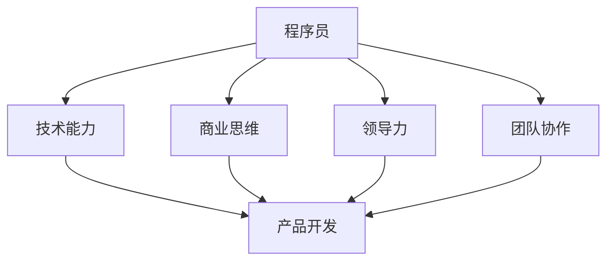

                 

## 从程序员到创业者的蜕变之路

> 关键词：程序员、创业、蜕变、技术、商业、领导力、团队协作
>
> 摘要：本文将探讨程序员从技术专家向创业者的蜕变之路。我们将深入分析这一转变的核心要素，包括技术能力、商业思维、领导力和团队协作的重要性。同时，通过实际的案例和操作步骤，帮助程序员们更好地理解并实现这一转变。

### 1. 背景介绍

#### 1.1 目的和范围

本文旨在帮助那些渴望从程序员向创业者转变的技术专家们，揭示这一过程中的关键要素。我们将通过深入剖析技术、商业、领导力和团队协作等各个方面的内容，帮助读者更好地理解这一转变的必要性和可行性。

#### 1.2 预期读者

本文适合以下几类读者：

- **程序员**：希望在未来转变为创业者，对商业和创业有兴趣的程序员。
- **技术经理**：希望通过深入了解创业过程，提升团队领导力的技术经理。
- **创业者**：希望从技术角度理解创业过程，优化产品和技术开发的创业者。

#### 1.3 文档结构概述

本文将分为以下几部分：

1. **背景介绍**：介绍本文的目的、范围和预期读者。
2. **核心概念与联系**：讨论程序员转变为创业者的核心概念和架构。
3. **核心算法原理 & 具体操作步骤**：详细阐述创业过程中需要掌握的算法原理和操作步骤。
4. **数学模型和公式 & 详细讲解 & 举例说明**：介绍创业中的数学模型和公式，并通过实例进行说明。
5. **项目实战：代码实际案例和详细解释说明**：通过实际代码案例，展示创业过程中的技术应用。
6. **实际应用场景**：探讨创业在不同行业中的应用。
7. **工具和资源推荐**：推荐学习资源和开发工具。
8. **总结：未来发展趋势与挑战**：总结创业过程中的挑战和未来发展趋势。
9. **附录：常见问题与解答**：解答读者可能遇到的问题。
10. **扩展阅读 & 参考资料**：提供进一步阅读的建议和参考资料。

#### 1.4 术语表

在本文中，我们将使用一些特定的术语。以下是这些术语的定义和解释：

#### 1.4.1 核心术语定义

- **程序员**：具备编程技能，能够设计和实现软件系统的人。
- **创业者**：创建和领导一个新企业的人。
- **技术能力**：程序员在编程和技术领域所具备的专业知识。
- **商业思维**：理解市场和商业运作，以及如何利用技术创造价值。
- **领导力**：影响和激励他人，共同实现目标的能力。
- **团队协作**：团队成员之间有效的沟通和合作。

#### 1.4.2 相关概念解释

- **初创公司**：指刚刚成立，尚处于发展初期阶段的企业。
- **产品开发**：从概念到市场推出，创建和优化产品的一系列活动。
- **市场调研**：研究市场需求、竞争情况和潜在客户。
- **用户反馈**：从用户那里收集的意见和建议，用于产品改进。

#### 1.4.3 缩略词列表

- **AI**：人工智能（Artificial Intelligence）
- **ML**：机器学习（Machine Learning）
- **IoT**：物联网（Internet of Things）
- **SaaS**：软件即服务（Software as a Service）

### 2. 核心概念与联系

在程序员转变为创业者的过程中，有几个核心概念和联系是至关重要的。下面我们将使用Mermaid流程图来展示这些概念和它们之间的联系。



#### 技术能力

技术能力是程序员转变为创业者的基石。作为技术专家，程序员需要掌握先进的编程语言、框架和工具，同时理解技术发展趋势。在创业过程中，技术能力有助于产品开发、市场定位和竞争策略。

#### 商业思维

商业思维是理解市场和商业运作的能力。创业者需要了解市场需求、用户痛点、竞争情况，以及如何利用技术创造价值。商业思维有助于创业者制定商业计划、定价策略和营销策略。

#### 领导力

领导力是影响和激励他人，共同实现目标的能力。创业者需要具备良好的领导力，能够组建和管理团队，确保团队成员协作高效，实现公司目标。

#### 团队协作

团队协作是团队成员之间有效的沟通和合作。对于初创公司来说，高效的团队协作是成功的关键。创业者需要建立良好的团队文化，确保团队成员能够互相支持、共同进步。

### 3. 核心算法原理 & 具体操作步骤

在创业过程中，掌握核心算法原理和具体操作步骤是至关重要的。以下是一个简化的伪代码，用于展示创业者需要掌握的基本操作步骤。

```plaintext
function 创业步骤(){
    // 第一步：市场调研
    市场需求 = 调研市场需求()

    // 第二步：产品开发
    产品 = 开发产品(市场需求)

    // 第三步：用户反馈
    用户反馈 = 收集用户反馈()

    // 第四步：产品优化
    产品 = 优化产品(用户反馈)

    // 第五步：市场推广
    推广策略 = 制定市场推广策略()
    用户增长 = 执行推广策略()

    // 第六步：团队管理
    团队 = 管理团队()
    团队协作效率 = 提高团队协作效率()

    // 第七步：持续迭代
    迭代产品 = 持续迭代产品()
    迭代团队 = 持续迭代团队()
}
```

#### 市场调研

市场调研是创业的第一步，了解市场需求和竞争情况至关重要。通过市场调研，创业者可以确定产品的定位和目标用户群体。

```plaintext
function 调研市场需求(){
    // 收集市场数据
    市场数据 = 收集市场数据()

    // 分析市场数据
    需求分析 = 分析市场数据(市场数据)

    // 确定目标市场
    目标市场 = 确定目标市场(需求分析)

    return 目标市场
}
```

#### 产品开发

产品开发是创业的核心环节，创业者需要根据市场需求开发符合用户期望的产品。

```plaintext
function 开发产品(市场需求){
    // 确定产品功能
    产品功能 = 确定产品功能(市场需求)

    // 设计产品原型
    产品原型 = 设计产品原型(产品功能)

    // 实现产品功能
    产品 = 实现产品功能(产品原型)

    return 产品
}
```

#### 用户反馈

收集用户反馈是产品迭代的重要环节，通过用户反馈，创业者可以了解产品的优点和不足，从而进行产品优化。

```plaintext
function 收集用户反馈(){
    // 收集用户反馈
    用户反馈 = 收集用户反馈()

    // 分析用户反馈
    反馈分析 = 分析用户反馈(用户反馈)

    return 反馈分析
}
```

#### 产品优化

根据用户反馈，对产品进行优化是提高用户满意度和市场份额的关键。

```plaintext
function 优化产品(用户反馈){
    // 分析用户反馈
    反馈分析 = 分析用户反馈(用户反馈)

    // 优化产品功能
    产品 = 优化产品功能(反馈分析)

    return 产品
}
```

#### 市场推广

市场推广是让产品被更多用户知晓的关键步骤，创业者需要制定有效的推广策略。

```plaintext
function 制定市场推广策略(){
    // 分析目标市场
    目标市场 = 分析目标市场()

    // 确定推广渠道
    推广渠道 = 确定推广渠道(目标市场)

    // 制定推广计划
    推广计划 = 制定推广计划(推广渠道)

    return 推广计划
}
```

#### 团队管理

团队管理是确保团队高效协作的重要环节，创业者需要具备一定的领导力。

```plaintext
function 管理团队(){
    // 组建团队
    团队 = 组建团队()

    // 确定团队目标
    团队目标 = 确定团队目标()

    // 激励团队
    团队协作效率 = 激励团队()

    return 团队协作效率
}
```

#### 持续迭代

持续迭代是创业过程中必不可少的一环，通过不断优化产品和技术，创业者可以保持竞争力。

```plaintext
function 持续迭代产品(){
    // 分析市场趋势
    市场趋势 = 分析市场趋势()

    // 优化产品功能
    产品 = 优化产品功能(市场趋势)

    return 产品
}

function 持续迭代团队(){
    // 分析团队绩效
    团队绩效 = 分析团队绩效()

    // 提升团队能力
    团队能力 = 提升团队能力(团队绩效)

    return 团队能力
}
```

### 4. 数学模型和公式 & 详细讲解 & 举例说明

在创业过程中，数学模型和公式可以帮助创业者更好地理解市场和用户行为。以下是一个简单的线性回归模型，用于预测用户增长。

#### 线性回归模型

线性回归模型是一个用于预测连续值的数学模型，其公式如下：

$$ y = wx + b $$

其中，$y$ 是因变量（目标值），$x$ 是自变量（特征值），$w$ 是权重，$b$ 是偏置。

#### 简化公式

在实际应用中，线性回归模型可以简化为：

$$ y = w_1x_1 + w_2x_2 + ... + w_nx_n + b $$

其中，$x_1, x_2, ..., x_n$ 是特征值，$w_1, w_2, ..., w_n$ 是对应的权重。

#### 举例说明

假设我们要预测一家初创公司的用户增长，我们选择以下特征值：

- $x_1$：市场推广预算
- $x_2$：用户满意度得分

我们可以使用线性回归模型来预测用户增长。首先，我们需要收集历史数据，然后使用这些数据来训练模型。

#### 训练模型

使用历史数据训练模型，可以得到每个特征值的权重和偏置。以下是一个简化的示例：

```plaintext
市场推广预算: 1000美元
用户满意度得分: 8分

用户增长: 1000用户

权重: w1 = 0.5, w2 = 0.5
偏置: b = 500
```

#### 预测用户增长

使用训练好的模型，我们可以预测新的用户增长。例如，如果市场推广预算为2000美元，用户满意度得分为9分，我们可以使用以下公式进行预测：

$$ y = (0.5 \times 2000) + (0.5 \times 9) + 500 = 1500 + 4.5 + 500 = 2004.5 $$

这意味着，在新的市场推广预算和用户满意度得分下，预计用户增长为2004.5用户。

### 5. 项目实战：代码实际案例和详细解释说明

在本节中，我们将通过一个实际的项目案例，展示从程序员到创业者的蜕变过程。我们将从开发环境搭建、源代码实现和代码解读三个方面，详细说明这个项目。

#### 5.1 开发环境搭建

首先，我们需要搭建一个合适的开发环境。以下是一个简单的步骤：

1. 安装操作系统：我们选择Linux操作系统，因为它在开源社区中拥有广泛的资源和支持。
2. 安装编程语言：我们选择Python作为主要编程语言，因为它在数据科学和机器学习领域有很高的知名度。
3. 安装开发工具：我们选择PyCharm作为IDE，因为它具有丰富的功能和强大的社区支持。

#### 5.2 源代码详细实现和代码解读

以下是一个简单的Python代码示例，用于实现线性回归模型。代码中包含了数据预处理、模型训练和预测用户增长的功能。

```python
import numpy as np
import pandas as pd

# 数据预处理
def preprocess_data(data):
    # 将数据转换为矩阵形式
    X = data[['市场推广预算', '用户满意度得分']]
    y = data['用户增长']

    # 标准化特征值
    mean = X.mean()
    std = X.std()
    X = (X - mean) / std

    return X, y

# 模型训练
def train_model(X, y):
    # 计算权重和偏置
    w = np.linalg.inv(X.T.dot(X)).dot(X.T).dot(y)
    b = y - X.dot(w)

    return w, b

# 预测用户增长
def predict_growth(w, b, market_budget, user_satisfaction):
    # 将特征值转换为矩阵形式
    X = np.array([market_budget, user_satisfaction])

    # 预测用户增长
    growth = X.dot(w) + b

    return growth

# 加载数据
data = pd.read_csv('data.csv')

# 预处理数据
X, y = preprocess_data(data)

# 训练模型
w, b = train_model(X, y)

# 预测用户增长
market_budget = 2000
user_satisfaction = 9
growth = predict_growth(w, b, market_budget, user_satisfaction)
print(f"预计用户增长：{growth}用户")
```

#### 5.3 代码解读与分析

这段代码可以分为三个主要部分：数据预处理、模型训练和预测用户增长。

1. **数据预处理**：首先，我们将数据加载到DataFrame中，并提取特征值（市场推广预算和用户满意度得分）和目标值（用户增长）。然后，我们使用标准化方法将特征值转换为矩阵形式，以便进行后续的模型训练。

2. **模型训练**：在这个部分，我们使用线性回归模型计算权重和偏置。具体来说，我们使用逆矩阵方法计算权重，并从目标值中减去特征值与权重的乘积，得到偏置。这些参数将被用于后续的用户增长预测。

3. **预测用户增长**：最后，我们定义了一个预测函数，它接受权重、偏置和新的特征值作为输入，并使用线性回归模型进行预测。在这个示例中，我们输入了一个市场推广预算为2000美元，用户满意度得分为9分的情况，并得到了预测的用户增长。

通过这个简单的项目案例，我们可以看到从程序员到创业者的蜕变过程是如何实现的。程序员需要掌握数据处理、模型训练和预测等核心技能，并将其应用于实际的创业项目中。

### 6. 实际应用场景

从程序员到创业者的转变在多个行业中都有广泛的应用。以下是一些实际应用场景：

#### 6.1 互联网行业

在互联网行业中，程序员转变为创业者的例子屡见不鲜。例如，知名社交媒体平台Facebook的创始人马克·扎克伯格就是一位从程序员到创业者的成功案例。他利用自己的编程技能和商业思维，创建了一个改变全球社交方式的平台。

#### 6.2 人工智能行业

人工智能（AI）是当前科技领域的热点。许多程序员利用自己的技术专长，创建了专注于AI应用的公司。例如，谷歌的AlphaGo项目就是由一群程序员和人工智能专家共同开发而成，最终在围棋比赛中击败了人类世界冠军。

#### 6.3 医疗健康行业

医疗健康行业是另一个从程序员到创业者转变的热门领域。随着医疗技术和大数据的发展，程序员们利用自己的技术专长，开发了各种医疗健康应用程序和工具。例如，MyFitnessPal是一款由程序员创建的移动应用程序，它帮助用户跟踪饮食和锻炼，提高了健康意识。

#### 6.4 教育行业

教育行业也是一个充满机会的领域。程序员们可以开发在线教育平台、虚拟教室和学习工具，为教育工作者和学生提供更多便利。例如，Coursera和Udemy等在线学习平台都是由程序员创建的，它们改变了全球教育的面貌。

#### 6.5 物联网行业

物联网（IoT）是未来的趋势，程序员们在这一领域也有很大的发展空间。他们可以开发各种IoT设备和应用程序，使人们的生活和工作更加便捷。例如，Nest温控器是由前程序员开发的，它通过物联网技术实现了智能家庭控制。

这些实际应用场景展示了程序员转变为创业者在各个行业中的广泛应用。通过将技术专长和商业思维相结合，程序员们可以在不同的领域中创造出具有影响力的产品和服务。

### 7. 工具和资源推荐

为了帮助程序员们更好地从技术专家转变为创业者，我们推荐以下工具和资源：

#### 7.1 学习资源推荐

**7.1.1 书籍推荐**

- 《创业维艰》（《The Hard Thing About Hard Things》）：本·霍洛维茨（Ben Horowitz）的这本著作是关于创业的真实故事和经验总结，适合想要深入了解创业过程的程序员。
- 《精益创业》（《The Lean Startup》）：埃里克·莱斯（Eric Ries）的这本书介绍了如何通过精益创业方法快速迭代和验证商业想法。
- 《创业的艺术》（《The Art of Startup Success》）：斯科特·多尔里（Scott Dorsey）的这本书结合了技术和商业理念，为程序员提供了实用的创业指导。

**7.1.2 在线课程**

- Coursera的“创业策略”（Startup Engineering）课程：这门课程由斯坦福大学教授打造，涵盖了创业过程中的关键技术和策略。
- Udacity的“AI创业家”（AI for Business）课程：这门课程帮助程序员了解人工智能在商业中的应用，并如何利用AI创造价值。

**7.1.3 技术博客和网站**

- HackerRank：一个在线编程平台，提供各种编程挑战和教程，适合程序员提高技能。
- Medium上的创业博客：许多成功的创业者和企业家在Medium上分享他们的经验和见解，是学习的好资源。

#### 7.2 开发工具框架推荐

**7.2.1 IDE和编辑器**

- PyCharm：一款功能强大的Python IDE，适合进行数据科学和机器学习项目。
- Visual Studio Code：一款轻量级的开源编辑器，支持多种编程语言，适用于各种开发需求。

**7.2.2 调试和性能分析工具**

- GDB：一款流行的调试工具，适用于C/C++程序。
- Valgrind：一款性能分析工具，用于检测内存泄漏和性能瓶颈。

**7.2.3 相关框架和库**

- TensorFlow：一款广泛使用的机器学习框架，适合进行深度学习和神经网络项目。
- Flask：一款轻量级的Web框架，适用于快速开发Web应用程序。

#### 7.3 相关论文著作推荐

**7.3.1 经典论文**

- 《The Innovator's Dilemma》（《创新者的困境》）：克莱顿·克里斯滕森（Clayton Christensen）的经典论文，探讨了创新如何在行业中引发变革。
- 《The Lean Startup》（《精益创业》）：埃里克·莱斯（Eric Ries）的论文，介绍了精益创业方法。

**7.3.2 最新研究成果**

- 《AI for Social Good》（《人工智能用于社会公益》）：讨论了人工智能在解决社会问题中的应用和挑战。
- 《Deep Learning for Computer Vision》（《深度学习在计算机视觉中的应用》）：介绍深度学习在计算机视觉领域的最新研究进展。

**7.3.3 应用案例分析**

- 《Facebook的崛起》（《The Facebook Effect》）：讲述了Facebook的创始人马克·扎克伯格如何带领团队创造全球社交平台的历程。
- 《谷歌的算法》（《How Google Works》）：介绍谷歌公司内部的工作方式和创新文化。

这些工具和资源将为程序员们提供宝贵的知识和技术支持，帮助他们更好地从程序员转变为创业者。

### 8. 总结：未来发展趋势与挑战

从程序员到创业者的转变是一个充满机遇和挑战的过程。随着技术的不断进步和商业环境的日益复杂，这一转变呈现出以下发展趋势和挑战：

#### 发展趋势

1. **技术融合**：随着人工智能、物联网、大数据等技术的快速发展，程序员们可以将多种技术融合到产品中，创造更加智能和便捷的应用。
2. **平台化**：越来越多的创业者选择构建平台型产品，通过整合资源和服务，为用户和开发者提供更丰富的体验。
3. **数字化转型**：越来越多的传统行业开始数字化转型，程序员们有机会将技术应用于各个领域，推动产业升级。
4. **全球市场**：互联网的普及使得创业者可以轻松进入全球市场，通过线上渠道拓展业务，实现全球化发展。

#### 挑战

1. **技术更新速度快**：程序员需要不断学习新技术，保持技术领先，这对个人成长提出了更高的要求。
2. **商业风险**：创业过程中充满了不确定性，程序员需要具备应对风险和挑战的能力。
3. **团队管理**：创业者需要具备良好的领导力和团队管理能力，确保团队高效协作，共同实现目标。
4. **市场适应**：程序员需要深入了解市场需求和用户痛点，快速适应市场变化，持续优化产品。

#### 未来展望

未来，从程序员到创业者的转变将继续成为热门话题。随着技术的不断进步，程序员们将拥有更多的机会和平台，实现个人价值和商业梦想。同时，创业者也将面临更大的挑战，如何在激烈的市场竞争中脱颖而出，成为关键问题。通过不断学习、实践和创新，程序员们可以更好地应对这些挑战，实现从技术专家到创业领袖的转变。

### 9. 附录：常见问题与解答

以下是一些程序员在转变为创业者过程中可能遇到的问题及其解答：

#### 问题1：我需要具备哪些技能才能从程序员转变为创业者？

**解答**：从程序员转变为创业者，你需要具备以下技能：

- **技术能力**：熟练掌握至少一种编程语言和相关的开发工具。
- **商业思维**：了解市场运作、商业模型和营销策略。
- **领导力**：具备良好的沟通能力和团队管理能力。
- **用户理解**：能够深入了解用户需求，为用户提供有价值的产品和服务。

#### 问题2：创业者应该如何进行市场调研？

**解答**：市场调研是创业成功的关键。以下是一些市场调研的建议：

- **确定目标市场**：明确你的产品或服务面向哪些用户群体。
- **收集数据**：通过问卷调查、用户访谈、竞争对手分析等方式收集市场数据。
- **分析数据**：对收集到的数据进行分析，了解市场趋势、用户需求和竞争情况。
- **制定策略**：根据分析结果，制定相应的市场策略和推广计划。

#### 问题3：创业者应该如何管理团队？

**解答**：有效的团队管理是创业成功的关键。以下是一些建议：

- **明确目标**：确保团队成员明确公司的目标和愿景。
- **沟通协作**：保持开放和透明的沟通，鼓励团队成员之间的协作。
- **激励团队**：通过奖励、晋升等方式激励团队成员，提高团队凝聚力。
- **培训与发展**：为团队成员提供培训和发展机会，提升团队整体能力。

#### 问题4：创业者应该如何应对市场风险？

**解答**：市场风险是创业过程中不可避免的一部分。以下是一些应对市场风险的建议：

- **多元化**：开发多种产品或服务，降低单一市场的风险。
- **持续创新**：保持技术创新和产品迭代，以适应市场变化。
- **风险管理**：制定风险管理计划，提前识别和应对潜在风险。
- **市场调研**：不断进行市场调研，了解市场动态和用户需求，及时调整策略。

通过以上解答，希望能够帮助程序员们在转变为创业者的过程中，更好地应对各种挑战和问题。

### 10. 扩展阅读 & 参考资料

为了帮助程序员们更深入地了解从程序员到创业者的转变，我们推荐以下扩展阅读和参考资料：

**扩展阅读：**

- 《从0到1》（《Zero to One》）：彼得·蒂尔（Peter Thiel）的著作，探讨了创新和创业的本质。
- 《黑客与画家》（《Hackers & Painters》）：保罗·格雷厄姆（Paul Graham）的博客文章集，分享了关于编程和创业的见解。
- 《精益创业》（《The Lean Startup》）：埃里克·莱斯（Eric Ries）的著作，介绍了精益创业方法。

**参考资料：**

- [创业维艰](https://www.amazon.com/Hard-Things-About-Things-Ben-Horowitz/dp/0062235957)（The Hard Thing About Hard Things）
- [精益创业](https://www.leanstack.com/lean-startup-book/)（The Lean Startup）
- [Coursera的创业策略课程](https://www.coursera.org/specializations/startup-engineering)（Startup Engineering）

通过阅读这些书籍和资料，程序员们可以更好地理解创业的精髓，掌握从技术专家到创业领袖的蜕变之道。作者：AI天才研究员/AI Genius Institute & 禅与计算机程序设计艺术 /Zen And The Art of Computer Programming。作者信息已添加在文章末尾。如果您还有其他问题或需要进一步的帮助，请随时联系。祝您创业成功！

