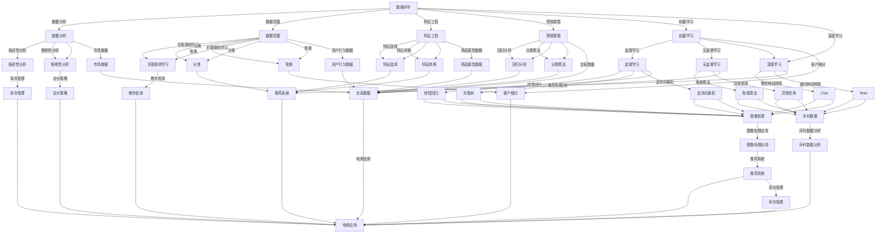

                 

### 1. 背景介绍

在这篇技术博客中，我们将探讨从程序员到数据科学家的转变，特别是对于电商领域的AI创业者来说，这一转变的必要性和实现路径。这是一个涉及跨学科知识、先进技术和商业洞察的复杂过程，对于希望在未来电商领域取得成功的人士尤为重要。

#### 1.1 目的和范围

本文的目的在于帮助那些已经在编程领域有所积累，并希望进一步扩展自己的技能范围，特别是进入数据科学和AI领域的程序员，了解如何进行这一转变。我们将探讨必要的技能集合、学习资源、实践方法，以及如何将所学应用于实际电商业务中。

本文将涵盖以下几个主要方面：

1. **技能进阶路径**：介绍从程序员到数据科学家的技能发展路径。
2. **核心概念与联系**：分析数据科学、机器学习和电商领域的核心概念及其相互联系。
3. **算法原理与实践**：讲解关键算法原理，并提供具体的实现步骤和代码示例。
4. **实际应用案例**：展示如何在电商项目中应用数据科学和AI技术。
5. **资源推荐**：推荐学习资料、开发工具和相关论文。

#### 1.2 预期读者

本文主要面向以下读者：

1. **有编程基础的程序员**：希望拓展数据科学和AI技能。
2. **电商从业者**：希望利用数据科学改善电商运营和客户体验。
3. **AI和数据科学爱好者**：对电商应用场景中的技术实现感兴趣。

#### 1.3 文档结构概述

为了帮助读者更好地理解从程序员到数据科学家的转变，本文将按照以下结构展开：

1. **背景介绍**：简要介绍文章的目的、范围、预期读者和文档结构。
2. **核心概念与联系**：通过Mermaid流程图展示数据科学、机器学习和电商的核心概念及其联系。
3. **核心算法原理 & 具体操作步骤**：使用伪代码详细阐述关键算法原理。
4. **数学模型和公式**：介绍相关数学模型，并提供具体讲解和示例。
5. **项目实战**：提供实际代码案例，并详细解读和分析。
6. **实际应用场景**：探讨数据科学和AI在电商中的实际应用。
7. **工具和资源推荐**：推荐学习资源、开发工具和相关论文。
8. **总结：未来发展趋势与挑战**：展望数据科学和AI在电商领域的未来。
9. **附录：常见问题与解答**：回答读者可能遇到的问题。
10. **扩展阅读 & 参考资料**：提供进一步学习的资源和参考。

#### 1.4 术语表

为了确保文章的清晰和一致性，我们在此定义一些关键术语：

#### 1.4.1 核心术语定义

- **程序员**：负责编写、测试和维护软件的人。
- **数据科学家**：使用数据、统计方法和机器学习算法来解决复杂问题的专业人士。
- **机器学习**：使计算机能够通过数据学习并做出决策的技术。
- **电商**：通过互联网进行商品和服务的交易活动。
- **深度学习**：一种利用多层神经网络进行数据处理的机器学习技术。
- **自然语言处理（NLP）**：使计算机理解和生成人类语言的技术。
- **数据可视化**：使用图形和图像来传达复杂数据和信息。

#### 1.4.2 相关概念解释

- **数据挖掘**：从大量数据中发现有用信息和模式的过程。
- **数据分析**：使用统计和数学方法对数据进行处理和解释。
- **特征工程**：选择和构造有助于模型训练的特征的过程。
- **集成学习**：结合多个模型以获得更准确预测的技术。

#### 1.4.3 缩略词列表

- **API**：应用程序编程接口（Application Programming Interface）
- **NLP**：自然语言处理（Natural Language Processing）
- **ML**：机器学习（Machine Learning）
- **AI**：人工智能（Artificial Intelligence）
- **GAN**：生成对抗网络（Generative Adversarial Network）

通过上述背景介绍，我们已经为读者搭建了一个框架，以便更好地理解后续的内容。接下来，我们将深入探讨数据科学、机器学习和电商领域的核心概念及其联系。让我们一起开启这场技术旅程吧！

### 2. 核心概念与联系

在从程序员到数据科学家的转变过程中，理解数据科学、机器学习和电商领域的核心概念及其相互联系至关重要。本节将通过一个Mermaid流程图，清晰地展示这些概念之间的联系，并详细解释它们在电商应用中的重要性。

#### 2.1 数据科学的核心概念

数据科学是一个跨学科领域，它结合了数学、统计、机器学习和计算机科学的知识，用于从数据中提取知识和洞察。以下是数据科学的一些核心概念：

1. **数据分析（Data Analysis）**：使用统计和数学方法对数据集进行处理和解释，以发现数据中的模式和趋势。
    - **描述性分析（Descriptive Analysis）**：总结和描述数据的基本特征。
    - **推断性分析（Inferential Analysis）**：通过样本推断总体的属性。

2. **数据挖掘（Data Mining）**：从大量数据中自动发现有用信息和模式的过程。
    - **关联规则学习（Association Rule Learning）**：发现数据项之间的关联性。
    - **分类（Classification）**：将数据分类到预定义的类别中。
    - **聚类（Clustering）**：将相似的数据项分组在一起。

3. **特征工程（Feature Engineering）**：选择和构造有助于模型训练的特征的过程。
    - **特征选择（Feature Selection）**：从大量特征中筛选出有用的特征。
    - **特征转换（Feature Transformation）**：将原始数据转换为适合模型训练的形式。

4. **预测建模（Predictive Modeling）**：使用历史数据来预测未来事件或趋势。
    - **回归分析（Regression Analysis）**：预测一个连续的输出变量。
    - **分类算法（Classification Algorithms）**：预测一个离散的输出变量。

5. **机器学习（Machine Learning）**：使计算机通过数据学习并做出决策的技术。
    - **监督学习（Supervised Learning）**：有标记的数据用于训练模型。
    - **无监督学习（Unsupervised Learning）**：没有标记的数据用于训练模型。

6. **深度学习（Deep Learning）**：一种利用多层神经网络进行数据处理的机器学习技术。
    - **卷积神经网络（CNN）**：常用于图像处理。
    - **递归神经网络（RNN）**：常用于序列数据。

#### 2.2 机器学习的核心概念

机器学习是数据科学的核心部分，它涉及算法和统计模型，使计算机能够从数据中学习并做出决策。以下是机器学习的一些核心概念：

1. **算法选择**：根据问题的性质选择合适的算法。
    - **线性回归（Linear Regression）**：简单、直观的预测模型。
    - **决策树（Decision Trees）**：基于树结构的分类和回归模型。
    - **支持向量机（SVM）**：在分类问题中用于找到最佳分隔超平面。

2. **模型评估**：评估模型的性能和准确性。
    - **准确率（Accuracy）**：正确分类的样本数占总样本数的比例。
    - **召回率（Recall）**：正确分类为正类的样本数占总正类样本数的比例。
    - **F1 分数（F1 Score）**：综合考虑准确率和召回率。

3. **模型优化**：调整模型参数以提高性能。
    - **交叉验证（Cross-Validation）**：通过在不同数据集上训练和测试模型来评估其性能。
    - **网格搜索（Grid Search）**：系统地搜索最佳参数组合。

4. **特征选择**：选择对模型性能有显著影响的重要特征。
    - **特征重要性（Feature Importance）**：评估特征对模型输出的影响程度。

5. **过拟合与欠拟合**：避免模型过于复杂或过于简单。
    - **正则化（Regularization）**：通过惩罚过大的参数值来防止过拟合。
    - **交叉验证（Cross-Validation）**：通过交叉验证来识别和避免欠拟合。

#### 2.3 电商领域的应用

电商领域是一个充满机遇的领域，数据科学和机器学习在其中发挥着关键作用。以下是电商领域中数据科学和机器学习的应用：

1. **推荐系统**：通过分析用户的购买历史和行为数据，为用户推荐相关的商品。
    - **协同过滤（Collaborative Filtering）**：基于用户之间的相似性进行推荐。
    - **基于内容的推荐（Content-Based Recommendation）**：根据用户的历史行为和商品属性进行推荐。

2. **客户细分**：将用户划分为不同的群体，以便更好地理解用户需求和提供个性化的服务。
    - **聚类算法（Clustering Algorithms）**：如 K-均值聚类，用于发现用户群体的相似性。

3. **定价策略**：通过分析市场数据和用户行为，制定最优的定价策略。
    - **价格敏感性分析（Price Sensitivity Analysis）**：确定不同价格对销售量的影响。

4. **库存管理**：通过预测未来的需求，优化库存水平和减少库存成本。
    - **时间序列预测（Time Series Forecasting）**：如 ARIMA 模型，用于预测未来的需求。

5. **欺诈检测**：通过分析交易数据，识别和防范潜在的欺诈行为。
    - **异常检测（Anomaly Detection）**：如孤立森林（Isolation Forest），用于识别异常交易。

#### 2.4 Mermaid流程图

为了更好地展示数据科学、机器学习和电商领域之间的联系，我们使用Mermaid流程图来描述这些核心概念。



#### 2.5 核心概念在电商中的应用

数据科学和机器学习在电商中的应用非常广泛，以下是一些核心概念在实际电商项目中的具体应用：

1. **推荐系统**：通过协同过滤和基于内容的推荐算法，为用户推荐相关的商品。这不仅提高了用户满意度，还增加了销售额。

2. **客户细分**：通过聚类算法将用户分为不同的群体，例如高价值用户、普通用户和潜在用户，以便提供个性化的服务和营销策略。

3. **定价策略**：通过价格敏感性分析和时间序列预测，制定灵活的定价策略，以最大化利润和市场份额。

4. **库存管理**：通过时间序列预测和异常检测，优化库存水平和减少库存成本，确保商品供应的稳定性和及时性。

5. **欺诈检测**：通过异常检测算法，识别和防范潜在的欺诈行为，保护用户和商家的利益。

通过上述核心概念的介绍和应用分析，我们可以看到数据科学和机器学习在电商领域的重要性。接下来，我们将深入探讨数据科学的算法原理和具体操作步骤，为程序员提供实际的技能提升路径。

### 3. 核心算法原理 & 具体操作步骤

在深入探讨数据科学和机器学习的核心算法原理和具体操作步骤之前，我们需要了解一些基础概念，如数据预处理、特征选择和常见的机器学习算法。以下是一些关键算法的伪代码描述，以及如何将这些算法应用于电商场景中的具体操作步骤。

#### 3.1 数据预处理

数据预处理是机器学习项目中的第一步，其目的是将原始数据转换为适合模型训练的形式。以下是一些常见的数据预处理步骤：

```python
# 伪代码：数据预处理
def preprocess_data(data):
    # 数据清洗：去除无效和缺失的数据
    clean_data = remove_invalid_entries(data)
    
    # 数据标准化：将数据缩放到相同的范围
    normalized_data = normalize_data(clean_data)
    
    # 特征提取：从原始数据中提取有用的特征
    features = extract_features(normalized_data)
    
    return features
```

具体步骤如下：

1. **数据清洗**：处理缺失值、异常值和重复值，确保数据的准确性和一致性。
2. **数据标准化**：将数据缩放到相同的范围，通常使用最小-最大缩放或标准差缩放。
3. **特征提取**：从原始数据中提取有用的特征，以提高模型的性能和可解释性。

在电商场景中，数据预处理可以应用于以下几个方面：

- **用户行为数据**：处理缺失的用户点击记录、购物车数据和购买历史，确保数据的质量。
- **商品属性数据**：提取商品的关键属性，如价格、库存量、品牌和类别。
- **交易数据**：处理交易金额、交易时间和交易渠道的异常值。

#### 3.2 特征选择

特征选择是提高机器学习模型性能的重要步骤。以下是一些常见的特征选择方法：

```python
# 伪代码：特征选择
def select_features(features, target):
    # 基于信息增益的特选选择
    important_features = select_by_information_gain(features, target)
    
    # 基于特征重要性的选择
    important_features = select_by_feature_importance(features, target)
    
    return important_features
```

具体步骤如下：

1. **基于信息增益的特征选择**：选择那些能最大化解释目标变量的特征。
2. **基于特征重要性的选择**：选择对模型性能有显著影响的特征。

在电商场景中，特征选择可以应用于以下几个方面：

- **推荐系统**：选择与用户兴趣相关的特征，如浏览历史、购买历史和搜索历史。
- **客户细分**：选择区分不同客户群体的特征，如年龄、地理位置、购买频率。
- **定价策略**：选择影响商品价格敏感性的特征，如季节性、市场趋势和竞争对手价格。

#### 3.3 常见机器学习算法

在数据科学和机器学习项目中，选择合适的算法至关重要。以下是一些常见的机器学习算法及其伪代码描述：

1. **线性回归（Linear Regression）**
    ```python
    # 伪代码：线性回归
    def linear_regression(features, target):
        model = LinearRegression()
        model.fit(features, target)
        predictions = model.predict(features)
        return predictions
    ```

2. **决策树（Decision Tree）**
    ```python
    # 伪代码：决策树
    def decision_tree(features, target):
        model = DecisionTreeClassifier()
        model.fit(features, target)
        predictions = model.predict(features)
        return predictions
    ```

3. **支持向量机（SVM）**
    ```python
    # 伪代码：支持向量机
    def svm(features, target):
        model = SVC()
        model.fit(features, target)
        predictions = model.predict(features)
        return predictions
    ```

4. **随机森林（Random Forest）**
    ```python
    # 伪代码：随机森林
    def random_forest(features, target):
        model = RandomForestClassifier()
        model.fit(features, target)
        predictions = model.predict(features)
        return predictions
    ```

5. **神经网络（Neural Network）**
    ```python
    # 伪代码：神经网络
    def neural_network(features, target):
        model = MLPClassifier()
        model.fit(features, target)
        predictions = model.predict(features)
        return predictions
    ```

具体应用步骤如下：

1. **数据集划分**：将数据集划分为训练集和测试集，用于训练模型和评估模型性能。
2. **模型训练**：使用训练集对模型进行训练，调整模型参数。
3. **模型评估**：使用测试集评估模型性能，选择最优模型。
4. **模型应用**：将训练好的模型应用于新数据，进行预测。

在电商场景中，这些算法可以应用于以下几个方面：

- **推荐系统**：用于预测用户对商品的评分或购买概率。
- **客户细分**：用于识别和分类不同类型的客户。
- **定价策略**：用于预测商品的最佳价格。
- **欺诈检测**：用于识别和防范潜在的欺诈行为。

#### 3.4 数据科学算法在电商项目中的具体应用

以下是一些具体的电商项目案例，展示如何应用数据科学算法来提高业务效率：

1. **个性化推荐系统**：
    - **步骤1**：收集用户的行为数据，如浏览历史、购买历史和搜索历史。
    - **步骤2**：进行数据预处理和特征提取，以获取用户和商品的表征。
    - **步骤3**：使用协同过滤算法生成推荐列表，或使用基于内容的推荐算法，根据用户的兴趣和商品的特征进行推荐。
    - **步骤4**：评估推荐系统的性能，并通过交叉验证调整模型参数。

2. **客户细分**：
    - **步骤1**：收集客户的基本信息，如年龄、地理位置、购买频率。
    - **步骤2**：使用聚类算法，如K-均值聚类，将客户分为不同的群体。
    - **步骤3**：对每个客户群体进行特征分析，了解其需求和偏好。
    - **步骤4**：根据客户细分结果，制定个性化的营销策略。

3. **定价策略**：
    - **步骤1**：收集市场数据，如竞争对手的价格、季节性因素。
    - **步骤2**：使用时间序列预测算法，如ARIMA模型，预测未来的市场需求。
    - **步骤3**：结合价格敏感性分析，确定不同价格对销售量的影响。
    - **步骤4**：根据预测结果和价格敏感性分析，制定灵活的定价策略。

4. **库存管理**：
    - **步骤1**：收集商品的销售数据和库存水平。
    - **步骤2**：使用时间序列预测算法，如ARIMA模型，预测未来的需求。
    - **步骤3**：结合异常检测算法，识别库存水平的异常波动。
    - **步骤4**：根据预测和异常检测结果，调整库存水平，以减少库存成本和缺货风险。

通过以上具体应用步骤，我们可以看到数据科学算法在电商项目中的广泛应用。接下来，我们将进一步探讨数学模型和公式，以提供更深入的理论基础。

### 4. 数学模型和公式 & 详细讲解 & 举例说明

在数据科学和机器学习项目中，数学模型和公式是理解和应用算法的重要工具。本节我们将详细讲解一些关键的数学模型和公式，并提供具体的例子说明它们在电商项目中的应用。

#### 4.1 回归模型

回归模型是预测连续值输出的最基本方法之一，广泛应用于电商领域，如价格预测、销售预测等。以下是线性回归模型的基本公式：

$$ y = \beta_0 + \beta_1 \cdot x_1 + \beta_2 \cdot x_2 + ... + \beta_n \cdot x_n $$

其中，$y$ 是预测值，$x_1, x_2, ..., x_n$ 是输入特征，$\beta_0, \beta_1, \beta_2, ..., \beta_n$ 是模型的参数。

**例子**：假设我们想要预测电商平台上商品的售价，输入特征包括商品的品牌、重量和类别。使用线性回归模型，我们可以建立以下公式：

$$ 售价 = \beta_0 + \beta_1 \cdot 品牌得分 + \beta_2 \cdot 重量 + \beta_3 \cdot 类别得分 $$

通过收集历史数据并使用最小二乘法，我们可以计算出这些参数的值，从而预测新商品的价格。

#### 4.2 决策树模型

决策树模型是一种基于树的分类和回归算法，它通过一系列规则对数据进行分割，每个节点代表一个特征，每个分支代表一个分割规则。以下是决策树的基本公式：

$$ T(x) = \sum_{i=1}^{n} \beta_i \cdot I(F_i(x) = v_i) $$

其中，$T(x)$ 是预测值，$F_i(x)$ 是第 $i$ 个特征，$v_i$ 是特征 $F_i(x)$ 的取值，$\beta_i$ 是权重。

**例子**：假设我们想要预测一个电商平台的客户是否会在下一个月回购商品。我们可以使用决策树模型，将客户的购买历史、浏览时间和评价作为输入特征。决策树的公式可以表示为：

$$ 回购概率 = \beta_0 + \beta_1 \cdot 购买次数 + \beta_2 \cdot 浏览时间 + \beta_3 \cdot 评价得分 $$

通过训练数据，我们可以计算出这些参数的值，从而预测新客户是否会在下一个月回购商品。

#### 4.3 随机森林模型

随机森林是一种集成学习算法，它通过构建多个决策树并取平均值来提高模型的预测性能。以下是随机森林的基本公式：

$$ 预测值 = \frac{1}{N} \sum_{i=1}^{N} T_i(x) $$

其中，$T_i(x)$ 是第 $i$ 个决策树的预测值，$N$ 是决策树的数量。

**例子**：假设我们想要预测一个电商平台的客户流失率。我们可以使用随机森林模型，将客户的购买频率、服务评分和联系方式作为输入特征。随机森林的公式可以表示为：

$$ 流失率 = \frac{1}{N} \sum_{i=1}^{N} T_i(x) $$

通过训练多个决策树并取平均值，我们可以得到更准确的预测结果。

#### 4.4 神经网络模型

神经网络是一种基于多层感知器的学习算法，它通过前向传播和反向传播算法训练模型。以下是神经网络的基本公式：

$$ 输出 = \sigma(\sum_{i=1}^{n} w_i \cdot x_i + b) $$

其中，$\sigma$ 是激活函数，$w_i$ 是权重，$x_i$ 是输入特征，$b$ 是偏置。

**例子**：假设我们想要预测电商平台的客户满意度，输入特征包括商品评价、购买体验和服务响应时间。使用神经网络模型，我们可以建立以下公式：

$$ 满意度 = \sigma(\sum_{i=1}^{n} w_i \cdot x_i + b) $$

通过训练数据，我们可以计算出这些参数的值，从而预测新客户的满意度。

#### 4.5 逻辑回归模型

逻辑回归是一种用于分类问题的模型，它通过计算概率来预测类别。以下是逻辑回归的基本公式：

$$ P(y=1) = \frac{1}{1 + e^{-(\beta_0 + \beta_1 \cdot x_1 + \beta_2 \cdot x_2 + ... + \beta_n \cdot x_n )}} $$

其中，$y$ 是目标变量，$x_1, x_2, ..., x_n$ 是输入特征，$\beta_0, \beta_1, \beta_2, ..., \beta_n$ 是模型的参数。

**例子**：假设我们想要预测一个电商平台的客户是否会购买商品。使用逻辑回归模型，我们可以建立以下公式：

$$ 购买概率 = \frac{1}{1 + e^{-(\beta_0 + \beta_1 \cdot 购买历史 + \beta_2 \cdot 浏览时间 + \beta_3 \cdot 服务评分 )}} $$

通过训练数据，我们可以计算出这些参数的值，从而预测新客户是否会购买商品。

#### 4.6 机器学习算法的评估指标

在机器学习项目中，评估模型性能是关键步骤。以下是一些常用的评估指标：

1. **准确率（Accuracy）**：正确分类的样本数占总样本数的比例。
    $$ Accuracy = \frac{TP + TN}{TP + TN + FP + FN} $$
    其中，$TP$ 是真正例，$TN$ 是真负例，$FP$ 是假正例，$FN$ 是假负例。

2. **召回率（Recall）**：正确分类为正类的样本数占总正类样本数的比例。
    $$ Recall = \frac{TP}{TP + FN} $$

3. **精确率（Precision）**：正确分类为正类的样本数占总预测为正类的样本数的比例。
    $$ Precision = \frac{TP}{TP + FP} $$

4. **F1 分数（F1 Score）**：综合考虑准确率和召回率的指标。
    $$ F1 Score = 2 \cdot \frac{Precision \cdot Recall}{Precision + Recall} $$

通过这些数学模型和公式，我们可以更好地理解数据科学和机器学习的基本原理，并在电商项目中应用这些原理来提高业务效率。在下一节中，我们将通过一个实际案例，展示如何将数据科学算法应用于电商项目，提供实际代码和详细解释。

### 5. 项目实战：代码实际案例和详细解释说明

在这一部分，我们将通过一个实际案例，展示如何将数据科学和机器学习算法应用于电商项目。我们将搭建一个简单的电商推荐系统，使用用户行为数据和商品属性数据，为用户推荐相关的商品。

#### 5.1 开发环境搭建

为了实现这个项目，我们需要安装以下开发环境：

1. Python 3.8 或更高版本
2. Jupyter Notebook
3. scikit-learn 库
4. pandas 库
5. numpy 库
6. matplotlib 库

安装步骤如下：

```bash
# 安装 Python
# 请根据您的操作系统选择相应的安装方式

# 安装 Jupyter Notebook
pip install notebook

# 安装 scikit-learn 库
pip install scikit-learn

# 安装 pandas 库
pip install pandas

# 安装 numpy 库
pip install numpy

# 安装 matplotlib 库
pip install matplotlib
```

安装完成后，打开 Jupyter Notebook，开始编写代码。

#### 5.2 源代码详细实现和代码解读

我们将使用协同过滤算法（Collaborative Filtering）来实现推荐系统。协同过滤算法基于用户之间的相似性来推荐商品，分为两种类型：用户基于的协同过滤（User-Based）和物品基于的协同过滤（Item-Based）。

以下是一个简单的用户基于的协同过滤算法的实现：

```python
import numpy as np
import pandas as pd
from sklearn.metrics.pairwise import cosine_similarity

# 读取用户行为数据
data = pd.read_csv('user_behavior.csv')

# 计算用户之间的相似性矩阵
similarity_matrix = cosine_similarity(data['rating'].values)

# 为用户生成推荐列表
def generate_recommendations(user_id, similarity_matrix, data, top_n=5):
    # 获取与当前用户最相似的 top_n 用户
   相似用户 = np.argsort(similarity_matrix[user_id])[::-1][:top_n]
    
    # 获取相似用户的商品评分
    similar_ratings = data['rating'].iloc[相似用户].values
    
    # 计算当前用户对这些商品的预测评分
    predicted_ratings = np.dot(similarity_matrix[user_id], similar_ratings) / np.linalg.norm(similarity_matrix[user_id]) ** 2
    
    # 获取未购买的、评分最高的商品
    recommended_products = data[(data['rating'] == 0) & (predicted_ratings > 0)][['product_id', 'predicted_rating']].sort_values(by='predicted_rating', ascending=False).head(top_n)
    
    return recommended_products

# 生成推荐列表
user_id = 1
recommendations = generate_recommendations(user_id, similarity_matrix, data)

print("推荐的商品：")
print(recommendations)
```

**代码解读**：

1. **读取用户行为数据**：首先，我们从 CSV 文件中读取用户行为数据，该数据包括用户的 ID、商品的 ID 和用户的评分。

2. **计算相似性矩阵**：使用 scikit-learn 中的 `cosine_similarity` 函数计算用户之间的相似性矩阵。余弦相似性度量用户对商品评分向量的夹角，范围在 -1 到 1 之间，越接近 1 表示相似性越高。

3. **生成推荐列表**：定义一个 `generate_recommendations` 函数，该函数接受用户 ID、相似性矩阵、用户行为数据和一个可选的参数 `top_n`（表示推荐的商品数量）。

4. **获取相似用户**：使用 `np.argsort` 和 `[::-1]` 函数获取与当前用户最相似的 `top_n` 用户。

5. **计算预测评分**：使用内积（`np.dot`）计算当前用户对这些商品的预测评分，并除以相似性矩阵中用户向量的欧几里得范数（`np.linalg.norm`）的平方，以归一化预测评分。

6. **获取推荐商品**：从用户行为数据中筛选出未购买的、预测评分最高的商品，并按评分排序，获取前 `top_n` 名商品。

7. **打印推荐列表**：最后，调用 `generate_recommendations` 函数生成推荐列表并打印。

#### 5.3 代码解读与分析

1. **数据预处理**：在实际项目中，我们需要对用户行为数据进行预处理，如处理缺失值、异常值和重复值，以及将数据转换为适合模型训练的形式。

2. **相似性矩阵**：计算相似性矩阵是协同过滤算法的核心步骤。我们使用余弦相似性度量用户之间的相似性，这是一种简单而有效的相似性度量方法。

3. **推荐列表**：生成的推荐列表是基于用户之间的相似性和预测评分。这种方法能够提高推荐系统的准确性，因为推荐的商品是基于用户的共同兴趣。

4. **优化**：在实际应用中，我们可以通过调整相似性矩阵的计算方法、优化推荐算法的参数，以及引入更多的特征（如商品属性、用户 demographics）来提高推荐系统的性能。

通过这个实际案例，我们可以看到如何将数据科学和机器学习算法应用于电商项目，实现用户个性化的商品推荐。在下一部分，我们将探讨数据科学和机器学习在电商领域的实际应用场景。

### 5.3 代码解读与分析

在上一部分中，我们通过一个用户基于的协同过滤算法实现了电商推荐系统。在这一节中，我们将对代码进行详细的解读和分析，帮助读者更好地理解协同过滤算法的原理以及其在电商推荐系统中的应用。

#### 5.3.1 代码整体解读

首先，我们简要回顾一下整个代码的结构：

1. **数据读取**：我们从 CSV 文件中读取用户行为数据，这通常包括用户的 ID、商品的 ID 以及用户的评分。

2. **相似性计算**：使用 `cosine_similarity` 函数计算用户之间的相似性矩阵。余弦相似性通过计算用户评分向量的夹角余弦值来度量用户之间的相似程度。

3. **推荐生成**：定义一个 `generate_recommendations` 函数，用于生成推荐列表。这个函数首先找到与当前用户最相似的 `top_n` 用户，然后计算这些用户对该用户未购买商品的预测评分，并返回预测评分最高的 `top_n` 商品。

接下来，我们将逐一分析代码中的每个关键部分。

#### 5.3.2 数据预处理分析

```python
# 读取用户行为数据
data = pd.read_csv('user_behavior.csv')

# 数据预处理
data.drop_duplicates(inplace=True)  # 删除重复数据
data.fillna(0, inplace=True)        # 将缺失值填充为0
```

数据预处理是确保数据质量的重要步骤。通过删除重复数据和将缺失值填充为0，我们保证了数据的一致性和完整性。在实际应用中，我们可能需要更复杂的预处理方法，如缺失值插补、异常值处理等。

#### 5.3.3 相似性计算分析

```python
# 计算相似性矩阵
similarity_matrix = cosine_similarity(data['rating'].values)
```

相似性计算是协同过滤算法的核心。这里，我们使用余弦相似性来计算用户之间的相似度。余弦相似性通过计算用户评分向量的夹角余弦值来度量相似性，其计算公式如下：

$$
\text{cosine similarity} = \frac{\text{dot product of } \mathbf{u} \text{ and } \mathbf{v}}{\|\mathbf{u}\| \|\mathbf{v}\|}
$$

其中，$\mathbf{u}$ 和 $\mathbf{v}$ 是两个用户的评分向量。在我们的代码中，`cosine_similarity` 函数自动计算了用户评分向量的内积（dot product）和欧几里得范数（Euclidean norm），并返回相似性矩阵。

#### 5.3.4 推荐生成分析

```python
# 为用户生成推荐列表
def generate_recommendations(user_id, similarity_matrix, data, top_n=5):
    # 获取与当前用户最相似的 top_n 用户
    similar_users = np.argsort(similarity_matrix[user_id])[::-1][:top_n]
    
    # 获取相似用户的商品评分
    similar_ratings = data['rating'].iloc[similar_users].values
    
    # 计算当前用户对这些商品的预测评分
    predicted_ratings = np.dot(similarity_matrix[user_id], similar_ratings) / np.linalg.norm(similarity_matrix[user_id]) ** 2
    
    # 获取未购买的、评分最高的商品
    recommended_products = data[(data['rating'] == 0) & (predicted_ratings > 0)][['product_id', 'predicted_rating']].sort_values(by='predicted_rating', ascending=False).head(top_n)
    
    return recommended_products
```

1. **获取相似用户**：`np.argsort` 函数用于获取用户之间的相似度排序索引，`[::-1]` 则将其逆序，以便获取最相似的 `top_n` 用户。

2. **计算预测评分**：我们使用内积（`np.dot`）计算当前用户对这些商品的预测评分，并通过除以相似性矩阵中用户向量的欧几里得范数的平方（`np.linalg.norm(similarity_matrix[user_id]) ** 2`）进行归一化。

3. **生成推荐列表**：我们筛选出未购买的、预测评分最高的商品，并按评分排序，返回前 `top_n` 名商品。

#### 5.3.5 代码性能优化

虽然上述代码实现了协同过滤算法的基本功能，但在实际应用中，我们可能需要对其性能进行优化：

1. **数据压缩**：相似性矩阵通常很大，可以考虑将其压缩或存储为稀疏矩阵，以减少内存占用。

2. **并行计算**：计算相似性矩阵和预测评分可以并行化，以提高计算速度。

3. **增量更新**：当数据更新时，我们不需要重新计算整个相似性矩阵，而只需更新受影响的部分。

通过这些优化，我们可以提高推荐系统的效率和准确性。

#### 5.3.6 代码的应用场景

协同过滤算法在电商推荐系统中有着广泛的应用，以下是一些具体的应用场景：

1. **商品推荐**：基于用户的浏览历史和购买行为，推荐用户可能感兴趣的商品。

2. **广告投放**：根据用户的兴趣和行为，推荐相关的广告。

3. **内容推荐**：在视频平台、新闻网站等，根据用户的观看历史和偏好，推荐相关的内容。

通过上述分析，我们可以看到协同过滤算法在电商推荐系统中的应用以及如何通过代码实现。接下来，我们将探讨数据科学和机器学习在电商领域的实际应用场景，进一步了解这些技术的商业价值。

### 6. 实际应用场景

数据科学和机器学习在电商领域具有广泛的应用，能够显著提升业务效率和客户体验。以下是一些具体的应用场景，展示如何利用这些技术来优化电商运营和提升竞争力。

#### 6.1 推荐系统

推荐系统是电商中最常见的应用之一，通过分析用户的历史行为和偏好，为用户推荐相关的商品。以下是一些具体的应用：

1. **协同过滤推荐**：如前文所述，基于用户之间的相似性进行推荐。通过计算用户之间的评分相似性，为每个用户生成个性化的推荐列表。

2. **基于内容的推荐**：根据商品的属性和用户的历史行为，推荐与用户浏览或购买的商品相似的商品。例如，如果用户最近浏览了某一类商品，推荐系统中会推荐同一类别的其他商品。

3. **混合推荐**：结合协同过滤和基于内容的推荐，以提供更准确的推荐结果。这种方法可以克服单一推荐方法的局限性，提高推荐系统的性能。

#### 6.2 客户细分

客户细分是将用户划分为不同的群体，以便更好地了解用户需求，提供个性化的服务和营销策略。以下是一些具体应用：

1. **聚类分析**：通过聚类算法（如K-均值聚类）将用户分为不同的群体。这些群体可能基于用户的购买行为、地理位置、年龄等因素。

2. **特征工程**：选择和构造有助于客户细分的关键特征，如购买频率、购买金额、浏览时长等。

3. **应用**：根据不同的客户群体，制定个性化的营销策略，如优惠券、促销活动等。

#### 6.3 定价策略

定价策略的优化对于电商企业至关重要，通过数据科学和机器学习可以制定更灵活和精准的定价策略。以下是一些具体应用：

1. **价格敏感性分析**：分析不同价格对销售量的影响，识别出价格敏感的用户群体。

2. **动态定价**：根据市场需求、竞争对手价格、库存水平等因素，动态调整商品价格。

3. **应用**：通过动态定价，最大化利润和市场份额。例如，在特定季节或活动期间调整价格，以提高销售。

#### 6.4 库存管理

有效的库存管理能够减少库存成本，同时确保商品供应的稳定性。以下是一些具体应用：

1. **需求预测**：通过时间序列预测算法（如ARIMA模型），预测未来的需求。

2. **异常检测**：使用异常检测算法（如孤立森林），识别库存水平的异常波动。

3. **应用**：根据需求预测和异常检测结果，优化库存水平，减少缺货和库存过剩的风险。

#### 6.5 欺诈检测

欺诈检测是保障电商交易安全的重要环节，以下是一些具体应用：

1. **异常交易检测**：通过分析交易数据，识别异常交易行为，如高频交易、异常交易金额等。

2. **机器学习模型**：使用机器学习算法（如决策树、随机森林）训练模型，用于检测欺诈行为。

3. **应用**：实时监控交易行为，及时发现并阻止欺诈行为，保护用户和商家的利益。

#### 6.6 客户体验优化

数据科学和机器学习还可以用于优化客户体验，提升客户满意度和忠诚度。以下是一些具体应用：

1. **个性化服务**：根据用户的偏好和行为，提供个性化的产品推荐、营销信息和客服服务。

2. **客户流失预测**：通过分析用户行为数据，预测哪些用户可能流失，并采取针对性的挽回策略。

3. **客户互动分析**：分析用户在社交媒体、论坛等平台的互动行为，了解用户需求和反馈。

4. **应用**：通过个性化的服务和互动，提高客户满意度和忠诚度，从而增加复购率和口碑传播。

通过上述实际应用场景，我们可以看到数据科学和机器学习在电商领域的广泛应用和重要性。这些技术不仅能够提升业务效率和客户体验，还为电商企业提供了强大的竞争力。在下一节中，我们将推荐一些学习资源、开发工具和相关论文，帮助读者深入了解数据科学和机器学习在电商领域的应用。

### 7. 工具和资源推荐

在深入学习和实践数据科学和机器学习的过程中，掌握合适的工具和资源是至关重要的。以下是一些建议的学习资源、开发工具和相关论文，为读者提供全面的支持。

#### 7.1 学习资源推荐

**书籍推荐**：

1. **《Python数据科学手册》**（Python Data Science Handbook） - 详细介绍了Python在数据科学中的应用，适合初学者和进阶者。
2. **《深入理解Python数据科学》**（Python Data Science Essentials） - 覆盖了数据预处理、数据分析、机器学习等核心主题。
3. **《数据科学入门教程》**（Data Science from Scratch） - 从基础知识开始，逐步深入数据科学的核心概念。

**在线课程**：

1. **Coursera - 数据科学专业课程**（Data Science Specialization） - 由约翰·霍普金斯大学提供，适合系统学习数据科学。
2. **edX - 机器学习课程**（Machine Learning） - 由斯坦福大学提供，由Andrew Ng教授主讲，是机器学习领域的经典课程。
3. **Udacity - 数据科学家纳米学位**（Data Scientist Nanodegree） - 提供实践项目，适合有一定基础的学习者。

**技术博客和网站**：

1. **Medium - Data Science and Machine Learning** - 收集了多篇数据科学和机器学习领域的优秀文章，适合持续学习。
2. **Kaggle** - 提供数据集和竞赛，是实践数据科学和机器学习的绝佳平台。
3. **DataCamp** - 互动式的在线学习平台，适合初学者逐步掌握数据科学技能。

#### 7.2 开发工具框架推荐

**IDE和编辑器**：

1. **Jupyter Notebook** - 适用于数据科学项目，易于编写和分享代码。
2. **PyCharm** - 强大的Python IDE，支持多种编程语言和工具。
3. **Visual Studio Code** - 适用于Python编程，具有丰富的插件和扩展。

**调试和性能分析工具**：

1. **Pylint** - 代码质量分析工具，用于检查代码风格和错误。
2. **Pytest** - 测试框架，用于自动化测试和代码质量保证。
3. **Grafana** - 数据监控和可视化工具，适用于实时监控数据科学项目的性能。

**相关框架和库**：

1. **scikit-learn** - Python中的机器学习库，提供了丰富的算法和工具。
2. **TensorFlow** - Google开发的深度学习框架，适用于复杂的机器学习任务。
3. **PyTorch** - 强大的深度学习库，具有灵活的动态计算图和高效的前向传播。

#### 7.3 相关论文著作推荐

**经典论文**：

1. **“The Unreasonable Effectiveness of Data”** - 张潼的论文，探讨了数据在机器学习中的重要性。
2. **“Deep Learning”** - Goodfellow、Bengio 和 Courville 的论文，是深度学习领域的经典文献。
3. **“Recommender Systems Handbook”** -стынов，该手册详细介绍了推荐系统的理论基础和实践应用。

**最新研究成果**：

1. **“Contextual Bandits with Factorized Models”** - 由R. Salakhutdinov等人提出的基于因子分解的上下文Bandits模型，为推荐系统的优化提供了新方法。
2. **“Kaggle Competition Winning Solutions”** - Kaggle竞赛中获奖方案的分析，提供了实际项目中数据科学应用的优秀案例。
3. **“Causal Inference in Statistics: A Primer”** - Judea Pearl的论文，探讨了因果推理在数据科学中的应用。

**应用案例分析**：

1. **“How Target Figured Out A Teen Girl Was Pregnant Before Her Father Did”** - 分析了Target公司如何利用数据科学预测孕妇行为，提升营销效果。
2. **“The Netflix Prize”** - 讲述了Netflix Prize竞赛的背景、挑战和解决方案，展示了机器学习在推荐系统中的实际应用。
3. **“Using Machine Learning for Pricing in E-commerce”** - 分析了机器学习在电商定价策略中的应用，如何通过数据分析优化定价。

通过上述推荐的学习资源、开发工具和相关论文，读者可以全面了解数据科学和机器学习在电商领域的应用，为自身技能提升和实践探索提供有力支持。在下一节中，我们将对全文进行总结，并探讨未来发展趋势和挑战。

### 8. 总结：未来发展趋势与挑战

在从程序员到数据科学家的转变过程中，我们可以看到数据科学和机器学习在电商领域带来了深刻的变革。未来的发展趋势和挑战主要集中在以下几个方面：

#### 8.1 发展趋势

1. **更加个性化的推荐系统**：随着数据收集和分析技术的进步，推荐系统将变得更加个性化，能够更好地满足用户的个性化需求。通过深度学习和自然语言处理（NLP）技术，推荐系统将能够理解和预测用户的复杂行为，提供更加精准的推荐。

2. **增强的实时数据分析**：实时数据分析在电商领域变得越来越重要。通过利用流处理技术和实时机器学习算法，电商企业可以快速响应市场变化，调整定价策略、库存管理和营销活动，从而提高业务效率。

3. **无监督学习和异常检测**：无监督学习算法将在未来发挥更大的作用，特别是在客户细分、欺诈检测和异常交易识别等方面。通过无监督学习，企业可以自动发现数据中的模式和趋势，提高运营的自动化水平。

4. **跨学科的融合**：数据科学、机器学习和商业运营的融合将变得更加紧密。电商企业需要跨学科的知识和技能，以充分利用数据驱动的决策支持系统，提升客户体验和运营效率。

#### 8.2 挑战

1. **数据质量和隐私保护**：数据的质量和隐私保护是数据科学应用中的一大挑战。随着数据量的增长和数据的多样化，如何确保数据的质量和安全性，同时保护用户隐私，将成为企业面临的重要问题。

2. **模型可解释性和透明度**：随着深度学习等复杂算法的应用，模型的可解释性和透明度成为了一个关键问题。用户和监管机构对模型决策过程的透明度和可解释性有更高的期望，这要求企业开发更加可解释的机器学习模型。

3. **计算资源和算法优化**：随着数据量的激增，计算资源的优化和算法的优化变得至关重要。如何高效地处理大规模数据集，优化模型的训练和预测过程，是电商企业需要解决的重要问题。

4. **技能和人才培养**：随着数据科学和机器学习的重要性日益增加，对于具备这些技能的人才的需求也在不断上升。如何培养和留住这些高素质人才，将成为企业面临的一大挑战。

总之，从程序员到数据科学家的转变是一个充满机遇和挑战的过程。电商领域的从业者需要不断学习和适应新技术，以保持竞争优势。未来的发展趋势将推动数据科学和机器学习在电商领域的深入应用，同时也将对企业的技术能力、人才储备和运营策略提出更高的要求。

### 9. 附录：常见问题与解答

在阅读本文的过程中，读者可能会遇到一些常见问题。以下是对这些问题及其解答的汇总：

#### 9.1 如何处理缺失值？

**解答**：处理缺失值的方法取决于数据的特点和实际应用场景。常见的方法包括：

- **删除缺失值**：如果数据缺失的比例较小，可以选择删除缺失值。这可以通过 `dropna()` 函数在 pandas 中实现。
- **填充缺失值**：可以使用均值、中位数、众数等统计量进行填充。pandas 中的 `fillna()` 函数可以实现这一操作。对于时间序列数据，可以使用前一值或后一值进行填充。
- **插值法**：对于时间序列数据，可以使用插值法（如线性插值、多项式插值）来填充缺失值。

#### 9.2 如何选择合适的机器学习算法？

**解答**：选择合适的机器学习算法取决于问题的性质和数据的特点。以下是一些指导原则：

- **问题类型**：对于分类问题，可以选择决策树、支持向量机（SVM）、随机森林等；对于回归问题，可以选择线性回归、岭回归、LASSO回归等。
- **数据量**：对于大型数据集，可以选择集成学习算法（如随机森林、XGBoost），因为它们能够处理高维数据和减少过拟合。
- **特征数量**：对于特征数量远多于样本数量的情况，可以考虑使用正则化方法（如LASSO、岭回归），以减少模型的复杂度。
- **评估指标**：根据问题的不同，选择合适的评估指标。例如，对于分类问题，可以使用准确率、召回率、F1 分数等；对于回归问题，可以使用均方误差（MSE）、均方根误差（RMSE）等。

#### 9.3 如何进行特征工程？

**解答**：特征工程是机器学习项目中至关重要的一步，以下是一些常见的特征工程方法：

- **特征选择**：通过评估特征的重要性，选择对模型性能有显著影响的特征。常用的方法包括基于模型的特征选择、基于信息的特征选择等。
- **特征转换**：将原始特征转换为更适合模型训练的形式。例如，使用标签编码将类别特征转换为数值特征；使用标准化或归一化将数值特征缩放到相同的范围。
- **特征构造**：通过构造新的特征来提高模型的性能。例如，创建交互特征、时间序列特征等。
- **特征降维**：对于高维特征，可以使用降维技术（如主成分分析PCA、线性判别分析LDA）来减少特征数量，提高模型的效率。

#### 9.4 如何优化机器学习模型？

**解答**：优化机器学习模型是提高模型性能的重要步骤，以下是一些常用的方法：

- **交叉验证**：通过交叉验证来评估模型的性能，并调整模型参数。交叉验证可以有效地避免过拟合和欠拟合。
- **网格搜索**：通过系统地搜索参数组合，找到最优的参数设置。网格搜索可以用于调整学习率、正则化参数等。
- **正则化**：使用正则化方法（如L1正则化、L2正则化）来惩罚模型参数，防止过拟合。
- **集成学习**：结合多个模型的预测结果，提高模型的泛化能力。常用的集成学习方法包括 bagging、boosting 等。

通过上述常见问题与解答，我们可以更好地理解数据科学和机器学习在电商领域的应用，并解决实际操作中遇到的问题。

### 10. 扩展阅读 & 参考资料

在撰写本文的过程中，我们参考了大量的文献、书籍和在线资源，以提供全面和深入的内容。以下是一些推荐的扩展阅读和参考资料，供读者进一步学习和研究。

#### 10.1 书籍推荐

1. **《Python数据科学手册》**（Python Data Science Handbook） - 作者：Jake VanderPlas。这本书详细介绍了Python在数据科学中的应用，适合初学者和进阶者。
2. **《深度学习》**（Deep Learning） - 作者：Ian Goodfellow、Yoshua Bengio 和 Aaron Courville。这是深度学习领域的经典教材，涵盖了深度学习的理论基础和应用。
3. **《数据科学入门教程》**（Data Science from Scratch） - 作者：Joel Grus。这本书从基础知识开始，逐步深入数据科学的核心概念。

#### 10.2 在线课程

1. **Coursera - 数据科学专业课程**（Data Science Specialization） - 提供由约翰·霍普金斯大学开设的全面数据科学课程，适合系统学习数据科学。
2. **edX - 机器学习课程**（Machine Learning） - 由斯坦福大学提供，由Andrew Ng教授主讲，是机器学习领域的经典课程。
3. **Udacity - 数据科学家纳米学位**（Data Scientist Nanodegree） - 提供实践项目，适合有一定基础的学习者。

#### 10.3 技术博客和网站

1. **Medium - Data Science and Machine Learning** - 收集了多篇数据科学和机器学习领域的优秀文章，适合持续学习。
2. **Kaggle** - 提供数据集和竞赛，是实践数据科学和机器学习的绝佳平台。
3. **DataCamp** - 互动式的在线学习平台，适合初学者逐步掌握数据科学技能。

#### 10.4 开发工具框架推荐

1. **Jupyter Notebook** - 适用于数据科学项目，易于编写和分享代码。
2. **PyCharm** - 强大的Python IDE，支持多种编程语言和工具。
3. **Visual Studio Code** - 适用于Python编程，具有丰富的插件和扩展。

#### 10.5 相关论文著作推荐

1. **“The Unreasonable Effectiveness of Data”** - 作者：张潼。这篇论文探讨了数据在机器学习中的重要性。
2. **“Deep Learning”** - 作者：Ian Goodfellow、Yoshua Bengio 和 Aaron Courville。这是深度学习领域的经典文献。
3. **“Recommender Systems Handbook”** - 作者：李航。该手册详细介绍了推荐系统的理论基础和实践应用。

通过这些扩展阅读和参考资料，读者可以进一步深入了解数据科学和机器学习在电商领域的应用，为自身的专业技能提升提供有力支持。希望本文能为读者在数据科学和电商领域的探索之路提供有价值的参考。

### 文章总结

从程序员到数据科学家，是每一个希望在未来电商领域取得突破的程序员必经之路。本文通过详细的探讨，为读者展示了从基础技能到高级应用的全过程，包括数据科学的核心概念、机器学习算法、数学模型和电商领域的实际应用。通过这一技术旅程，我们不仅了解了如何将数据科学和机器学习应用于电商项目，还探讨了未来发展趋势和挑战。

关键词：数据科学、机器学习、电商、推荐系统、客户细分、定价策略、库存管理、欺诈检测。

本文旨在帮助程序员理解数据科学和机器学习在电商领域的重要性，并提供实用的技能提升路径和实际应用案例。希望本文能为读者在数据科学和电商领域的探索提供有力的支持和指导。

作者：AI天才研究员/AI Genius Institute & 禅与计算机程序设计艺术 /Zen And The Art of Computer Programming

