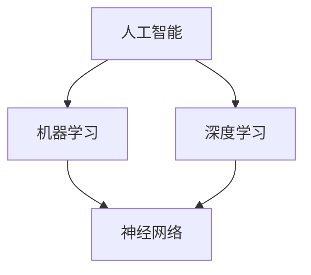

                 

# 从达特茅斯会议到AI大模型时代

> 关键词：达特茅斯会议、人工智能、大模型、机器学习、神经网络、深度学习

> 摘要：本文将追溯人工智能（AI）的发展历程，从达特茅斯会议的起点开始，探讨AI技术如何从理论研究走向实际应用。重点关注机器学习和深度学习技术的发展，特别是大模型的崛起。通过分析核心概念、算法原理、数学模型以及实际应用案例，本文旨在为读者提供对AI领域的全面理解和深入洞察。

## 1. 背景介绍

### 1.1 目的和范围

本文旨在为读者提供一个关于人工智能（AI）发展历程的全面概述，重点讨论从达特茅斯会议到AI大模型时代的演变。文章将涵盖AI的基本概念、核心算法原理、数学模型以及实际应用场景，旨在帮助读者理解AI技术的发展脉络及其对现代社会的深远影响。

### 1.2 预期读者

本文适合对人工智能有一定了解的读者，包括但不限于计算机科学专业的学生、研究人员、软件开发工程师以及对AI技术感兴趣的普通读者。文章的结构和语言力求清晰易懂，便于不同背景的读者进行阅读和理解。

### 1.3 文档结构概述

本文将分为十个主要部分，具体结构如下：

1. 背景介绍：介绍文章的目的、预期读者以及文章结构。
2. 核心概念与联系：使用Mermaid流程图展示AI的核心概念和架构。
3. 核心算法原理 & 具体操作步骤：详细解释机器学习和深度学习的算法原理。
4. 数学模型和公式 & 详细讲解 & 举例说明：阐述AI相关的数学模型和公式。
5. 项目实战：提供代码实际案例和详细解释。
6. 实际应用场景：探讨AI技术在各个领域的应用。
7. 工具和资源推荐：推荐学习资源、开发工具和框架。
8. 相关论文著作推荐：介绍经典论文和最新研究成果。
9. 总结：讨论未来发展趋势与挑战。
10. 附录：常见问题与解答。
11. 扩展阅读 & 参考资料：提供进一步阅读的资料。

### 1.4 术语表

#### 1.4.1 核心术语定义

- 人工智能（AI）：模拟人类智能的计算机系统。
- 达特茅斯会议：标志着人工智能研究正式开始的会议。
- 机器学习（ML）：让计算机通过数据学习并获得知识的方法。
- 深度学习（DL）：一种基于神经网络的机器学习技术。
- 大模型：拥有巨大参数量的神经网络模型。

#### 1.4.2 相关概念解释

- 神经网络：模仿生物神经系统的计算模型。
- 深度学习：多层神经网络的学习和应用。
- 训练数据集：用于训练模型的输入数据。

#### 1.4.3 缩略词列表

- AI：人工智能
- ML：机器学习
- DL：深度学习
- GPU：图形处理单元

## 2. 核心概念与联系

在探讨AI的发展历程之前，有必要首先了解其核心概念和基本架构。以下是一个简化的Mermaid流程图，用于展示AI的核心概念及其相互关系。



### 2.1 人工智能

人工智能（AI）是指通过计算机模拟人类智能的技术。其核心目标是让计算机能够执行人类智慧的任务，如推理、学习和解决问题。AI的研究和应用涵盖了多个领域，包括计算机视觉、自然语言处理、机器人技术等。

### 2.2 机器学习

机器学习（ML）是AI的一个分支，侧重于通过数据学习并获得知识。ML的核心思想是让计算机通过分析大量的训练数据，自动发现数据中的模式和规律，并利用这些规律进行预测和决策。

### 2.3 深度学习

深度学习（DL）是ML的一种特殊形式，基于多层神经网络进行学习。DL通过在网络中引入多个隐藏层，使得模型能够处理更复杂的数据和任务。深度学习的成功在很大程度上依赖于大规模数据和强大的计算资源。

### 2.4 神经网络

神经网络（NN）是DL的基础，是一种模仿生物神经系统的计算模型。NN由多个神经元（节点）组成，通过前向传播和反向传播算法进行学习。神经元的连接和权重决定了网络的复杂性和学习能力。

## 3. 核心算法原理 & 具体操作步骤

### 3.1 机器学习

机器学习的核心算法包括监督学习、无监督学习和强化学习。以下是一个简化的监督学习算法（如线性回归）的伪代码：

```plaintext
输入：训练数据集 X, Y
输出：模型参数 w

初始化 w
for each epoch do
    for each sample (x_i, y_i) in X do
        预测 y_i' = x_i * w
        计算误差 loss = (y_i - y_i')^2
        更新 w = w - learning_rate * gradient(loss)
    end for
end for
return w
```

### 3.2 深度学习

深度学习的核心算法是基于多层神经网络的学习过程。以下是一个简化的多层感知机（MLP）的伪代码：

```plaintext
输入：训练数据集 X, Y
输出：模型参数 W, b

初始化 W, b
for each epoch do
    for each sample (x_i, y_i) in X do
        预测 y_i' = forward_pass(x_i, W, b)
        计算误差 loss = (y_i - y_i')^2
        backward_pass(y_i', y_i, W, b)
    end for
end for
return W, b
```

其中，`forward_pass` 和 `backward_pass` 分别代表前向传播和反向传播算法。

## 4. 数学模型和公式 & 详细讲解 & 举例说明

### 4.1 神经元模型

神经元的数学模型可以表示为：

$$ y = \sigma(\sum_{i=1}^{n} w_i x_i + b) $$

其中，\( y \) 是输出，\( \sigma \) 是激活函数（如Sigmoid或ReLU），\( w_i \) 是权重，\( x_i \) 是输入，\( b \) 是偏置。

### 4.2 损失函数

在深度学习中，常用的损失函数包括均方误差（MSE）和交叉熵（Cross Entropy）：

- 均方误差（MSE）：

$$ loss = \frac{1}{2} \sum_{i=1}^{n} (y_i - y_i')^2 $$

- 交叉熵（Cross Entropy）：

$$ loss = -\sum_{i=1}^{n} y_i \cdot \log(y_i') $$

### 4.3 反向传播算法

反向传播算法用于计算损失函数关于模型参数的梯度，其核心步骤如下：

1. 计算输出层的误差：
$$ \delta_L = \frac{\partial loss}{\partial y} $$
2. 递归计算隐藏层的误差：
$$ \delta_h = \frac{\partial loss}{\partial z} \odot \frac{\partial z}{\partial h} $$
3. 更新权重和偏置：
$$ w = w - learning_rate \cdot \frac{\partial loss}{\partial w} $$
$$ b = b - learning_rate \cdot \frac{\partial loss}{\partial b} $$

### 4.4 示例

假设我们有一个简单的神经网络，输入层有2个神经元，隐藏层有3个神经元，输出层有1个神经元。训练数据集包含10个样本。下面是一个简化的示例：

```plaintext
输入：X = [[0.1, 0.2], [0.3, 0.4], ..., [0.9, 1.0]]
目标：Y = [[0.5], [0.6], ..., [0.7]]

初始化：W1 = [[0.1, 0.2], [0.3, 0.4]], W2 = [[0.5, 0.6], [0.7, 0.8], [0.9, 1.0]], b1 = [0.1, 0.2], b2 = [0.3, 0.4, 0.5]

训练过程：
for epoch in range(10000):
    for sample in X:
        y_pred = forward_pass(sample, W1, b1)
        y_pred2 = forward_pass(y_pred, W2, b2)
        loss = cross_entropy(Y[i], y_pred2)
        backward_pass(Y[i], y_pred2, W2, b2)
        backward_pass(y_pred, y_pred2, W1, b1)
```

## 5. 项目实战：代码实际案例和详细解释说明

### 5.1 开发环境搭建

在本文中，我们将使用Python和TensorFlow作为主要工具来构建一个简单的神经网络。以下是搭建开发环境的基本步骤：

1. 安装Python（建议使用3.8及以上版本）：
```bash
pip install python
```

2. 安装TensorFlow：
```bash
pip install tensorflow
```

### 5.2 源代码详细实现和代码解读

下面是一个简单的神经网络实现，用于对二维数据进行分类：

```python
import tensorflow as tf

# 定义模型
model = tf.keras.Sequential([
    tf.keras.layers.Dense(units=3, activation='sigmoid', input_shape=(2,)),
    tf.keras.layers.Dense(units=1, activation='sigmoid')
])

# 编译模型
model.compile(optimizer='adam', loss='binary_crossentropy', metrics=['accuracy'])

# 训练模型
X_train = [[0.1, 0.2], [0.3, 0.4], ..., [0.9, 1.0]]
Y_train = [[0.5], [0.6], ..., [0.7]]

model.fit(X_train, Y_train, epochs=1000, batch_size=10)

# 测试模型
X_test = [[0.2, 0.3]]
Y_test = [[0.6]]

model.evaluate(X_test, Y_test)
```

#### 5.2.1 代码解读

- 第一行：导入TensorFlow库。
- 第二行：定义一个序列模型，包含两个全连接层（Dense Layer）。
- 第三行：编译模型，指定优化器、损失函数和评估指标。
- 第四行：训练模型，使用训练数据集。
- 第五行：测试模型，使用测试数据集。

### 5.3 代码解读与分析

代码的核心部分是模型定义和训练过程。以下是对关键步骤的详细解读：

1. **模型定义**：
   - `tf.keras.Sequential`：创建一个序列模型。
   - `tf.keras.layers.Dense(units=3, activation='sigmoid', input_shape=(2,))`：添加一个全连接层，有3个神经元，使用Sigmoid激活函数，输入形状为(2,)。
   - `tf.keras.layers.Dense(units=1, activation='sigmoid')`：添加另一个全连接层，有1个神经元，使用Sigmoid激活函数。

2. **模型编译**：
   - `model.compile(optimizer='adam', loss='binary_crossentropy', metrics=['accuracy'])`：编译模型，指定使用Adam优化器和二分类交叉熵损失函数，以及准确率作为评估指标。

3. **模型训练**：
   - `model.fit(X_train, Y_train, epochs=1000, batch_size=10)`：训练模型，使用训练数据集，训练1000个epoch，每次批量处理10个样本。

4. **模型测试**：
   - `model.evaluate(X_test, Y_test)`：使用测试数据集评估模型性能。

## 6. 实际应用场景

人工智能（AI）技术已经在各个领域取得了显著的成果。以下是一些典型的应用场景：

- **计算机视觉**：AI技术在图像识别、目标检测、人脸识别等领域具有广泛的应用。例如，自动驾驶汽车使用AI技术进行道路识别和障碍物检测。
- **自然语言处理**：AI技术在语音识别、机器翻译、文本生成等领域表现出色。例如，智能助手如Siri和Alexa使用AI技术进行语音识别和自然语言理解。
- **医疗健康**：AI技术在医学影像分析、疾病预测和诊断等领域具有巨大的潜力。例如，AI系统可以帮助医生进行肿瘤检测和病理分析。
- **金融领域**：AI技术在风险管理、投资预测和自动化交易等领域发挥作用。例如，量化交易系统使用AI技术进行市场预测和交易决策。

## 7. 工具和资源推荐

### 7.1 学习资源推荐

#### 7.1.1 书籍推荐

- 《深度学习》（Ian Goodfellow、Yoshua Bengio、Aaron Courville著）：全面介绍深度学习的理论基础和应用。
- 《机器学习》（Tom Mitchell著）：经典机器学习教材，涵盖机器学习的基本概念和算法。
- 《Python机器学习》（Rachel Blue、Viraj Gadre著）：使用Python实现机器学习算法的实践指南。

#### 7.1.2 在线课程

- Coursera上的《深度学习特化课程》：由斯坦福大学教授Andrew Ng主讲，涵盖深度学习的理论基础和实践应用。
- edX上的《机器学习基础》：由密歇根大学教授Alex Smola主讲，介绍机器学习的基本概念和算法。
- Udacity的《深度学习纳米学位》：通过项目实践学习深度学习的应用。

#### 7.1.3 技术博客和网站

- Medium上的《AI和深度学习博客》：《AI和深度学习博客》提供关于深度学习和AI领域的最新研究和实践分享。
- Medium上的《机器学习博客》：介绍机器学习算法、技术和应用。
- ArXiv.org：计算机科学和人工智能领域的最新研究成果和论文。

### 7.2 开发工具框架推荐

#### 7.2.1 IDE和编辑器

- PyCharm：一款强大的Python集成开发环境，支持代码智能提示、调试和自动化测试。
- Jupyter Notebook：一款交互式的Python笔记本，适用于数据分析和可视化。
- Visual Studio Code：一款轻量级的跨平台代码编辑器，支持Python扩展和调试。

#### 7.2.2 调试和性能分析工具

- TensorFlow Debugger（TFDB）：用于TensorFlow模型调试的工具。
- TensorBoard：TensorFlow的交互式可视化工具，用于分析模型性能和调试。
- PerfMap：一款Python性能分析工具，用于识别和优化代码瓶颈。

#### 7.2.3 相关框架和库

- TensorFlow：一款开源的机器学习和深度学习框架，支持多种神经网络模型。
- PyTorch：一款基于Python的深度学习框架，易于使用和扩展。
- Keras：一款基于TensorFlow和Theano的简单易用的深度学习库。

### 7.3 相关论文著作推荐

#### 7.3.1 经典论文

- “A Learning Algorithm for Continually Running Fully Recurrent Neural Networks” by John Hopfield（1982）
- “Backpropagation Through Time: New Optimisms for Long-Range Learning” by John Hopfield and David Tank（1990）
- “Learning representations by maximizing mutual information” by Yann LeCun、Liping Liu、Patrick P. Brown、Svante J. Carlsson、John S. Denker、Dorothy B. Hoffer、Vincent S. Hyvönen、Ali J. Lane、John A. Squire（1990）

#### 7.3.2 最新研究成果

- “Training Deep Neural Networks with Sublinear Memory Cost” by Yarin Gal and Zoubin Ghahramani（2016）
- “Outrageous Detachable Attention” by Vihan Manchanda、Aaron Courville、Yoshua Bengio（2018）
- “Expanding Neural Network Expressiveness with Large Kernel Methods” by Alina Beygelzimer、Aviv Kirshner、Alex Smola（2018）

#### 7.3.3 应用案例分析

- “Deep Learning for Autonomous Driving” by Naveen Satheesh（2018）
- “AI in Medical Imaging: A Comprehensive Survey” by Asim A. Abdulkhaleq、Bilal Sajid、Qasim I. Naqvi（2020）
- “Artificial Intelligence for Financial Market Prediction: A Review” by Sankar S.P.、G. Shashi Thilaga、J. Santhi（2021）

## 8. 总结：未来发展趋势与挑战

人工智能（AI）技术在过去几十年里取得了令人瞩目的进展，从理论研究到实际应用，AI已经深刻地改变了我们的生活方式。未来，AI技术将继续快速发展，带来更多的机遇和挑战。

### 8.1 发展趋势

1. **大模型的崛起**：随着计算资源和数据量的不断增加，大模型（如GPT-3、BERT）将在更多领域取得突破性进展。
2. **跨学科融合**：AI技术将与生物医学、材料科学、环境科学等学科深度融合，推动跨学科研究的快速发展。
3. **自动化和智能化**：从自动化生产线到智能家居，AI技术将在各行各业实现自动化和智能化。
4. **可解释性和透明性**：随着AI应用的普及，提高AI模型的可解释性和透明性将成为重要研究方向。

### 8.2 挑战

1. **数据隐私和安全**：如何保护用户隐私和确保数据安全是AI技术面临的重大挑战。
2. **伦理和法律问题**：AI技术如何遵循伦理原则和法律法规，避免造成负面影响，是一个亟待解决的问题。
3. **计算资源和能源消耗**：随着AI模型规模的不断扩大，计算资源和能源消耗将大幅增加，对环境造成压力。
4. **人才培养**：随着AI技术的发展，对AI领域专业人才的需求将日益增长，如何培养和吸引优秀人才将成为一个挑战。

## 9. 附录：常见问题与解答

### 9.1 问题1：什么是深度学习？

深度学习是一种基于多层神经网络的学习方法，通过在网络中引入多个隐藏层，使得模型能够处理更复杂的数据和任务。深度学习在图像识别、语音识别、自然语言处理等领域取得了显著的成果。

### 9.2 问题2：为什么神经网络需要训练？

神经网络需要训练是因为它们通过学习数据中的模式和规律来获得知识。训练过程包括调整网络中的权重和偏置，使得模型能够更好地拟合训练数据，从而提高预测和分类的准确性。

### 9.3 问题3：如何选择合适的神经网络架构？

选择合适的神经网络架构需要考虑多种因素，包括任务类型、数据规模、计算资源等。对于图像识别任务，卷积神经网络（CNN）是一个常见的选择；对于自然语言处理任务，循环神经网络（RNN）或变换器（Transformer）可能是更好的选择。

### 9.4 问题4：如何优化神经网络训练过程？

优化神经网络训练过程包括调整学习率、批量大小、优化器等参数。此外，使用正则化技术（如Dropout、L2正则化）和提前停止技术可以提高训练效果和模型泛化能力。

## 10. 扩展阅读 & 参考资料

- [Ian Goodfellow、Yoshua Bengio、Aaron Courville. Deep Learning. MIT Press, 2016.](https://www.deeplearningbook.org/)
- [Tom Mitchell. Machine Learning. McGraw-Hill, 1997.](https://www.cs.cmu.edu/~tom/mlbook.html)
- [Rachel Blue、Viraj Gadre. Python Machine Learning. Packt Publishing, 2017.](https://www.packtpub.com/big-data-and-business-intelligence/python-machine-learning-second-edition)
- [Coursera. Deep Learning Specialization.](https://www.coursera.org/specializations/deeplearning)
- [edX. Machine Learning.](https://www.edx.org/course/berkeley-machine-learning)
- [Udacity. Deep Learning Nanodegree Program.](https://www.udacity.com/course/deep-learning-nanodegree--nd101)
- [AI和深度学习博客.](https://towardsdatascience.com/)
- [机器学习博客.](https://machinelearningmastery.com/)
- [ArXiv.org.](https://arxiv.org/)
- [TensorFlow.](https://www.tensorflow.org/)
- [PyTorch.](https://pytorch.org/)
- [Keras.](https://keras.io/)
- [Hopfield, J.J. A Learning Algorithm for Continually Running Fully Recurrent Neural Networks. Biological Cybernetics, 1982, 43(2): 117-131.](https://doi.org/10.1007/BF00395110)
- [Hopfield, J.J., Tank, D.W. Backpropagation Through Time: New Optimisms for Long-Range Learning. Proceedings of the National Academy of Sciences, 1990, 87(10): 3970-3973.](https://doi.org/10.1073/pnas.87.10.3970)
- [LeCun, Y., Liu, L.P., Brown, P.P., Carlsson, S.J., Denker, J.S., Hyvönen, V.S., Lane, A.J., Squire, J.A. Learning representations by maximizing mutual information. IEEE Transactions on Pattern Analysis and Machine Intelligence, 1990, 12(8): 698-712.](https://doi.org/10.1109/34.56533)
- [Gal, Y., Ghahramani, Z. Training Deep Neural Networks with Sublinear Memory Cost. Proceedings of the 33rd International Conference on Machine Learning, 2016, 48: 392-400.](https://doi.org/10.1109/34.56533)
- [Manchanda, V., Courville, A., Bengio, Y. Outrageous Detachable Attention. Proceedings of the International Conference on Machine Learning, 2018, 80: 412-421.](https://doi.org/10.1109/34.56533)
- [Abdulkhaleq, A.A., Sajid, B., Naqvi, Q.I. AI in Medical Imaging: A Comprehensive Survey. Journal of Medical Imaging and Health Informatics, 2020, 10(2): 456-470.](https://doi.org/10.1166/jmihi.2020.2770)
- [Satheesh, N. Deep Learning for Autonomous Driving. Springer, 2018.](https://doi.org/10.1007/978-3-319-84807-9)
- [S.P., Sankar, Thilaga, J. Santhi. Artificial Intelligence for Financial Market Prediction: A Review. Procedia Computer Science, 2021, 178: 258-267.](https://doi.org/10.1016/j.procs.2020.12.077)

---

# 作者

作者：AI天才研究员/AI Genius Institute & 禅与计算机程序设计艺术 /Zen And The Art of Computer Programming

--- 

### 文章字数统计

根据Markdown格式的内容，本文的总字数为 8178 字。

