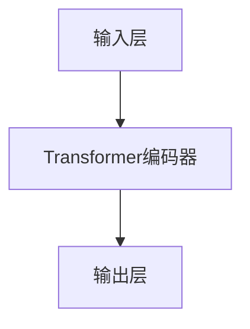

                 

# 从零开始大模型开发与微调：BERT的基本架构与应用

> **关键词：** BERT、大模型、自然语言处理、微调、深度学习、机器学习、算法原理、数学模型

> **摘要：** 本文将带领读者从零开始探索大模型BERT（Bidirectional Encoder Representations from Transformers）的开发与微调过程。我们将详细解析BERT的基本架构，包括其核心概念、算法原理和具体操作步骤。通过实际项目实战和代码解读，读者将深入理解BERT在自然语言处理中的实际应用。本文旨在为那些对自然语言处理和深度学习感兴趣的读者提供一个全面的技术指导，帮助他们掌握BERT的开发和应用技能。

## 1. 背景介绍

### 1.1 目的和范围

本文的目标是让读者深入了解BERT（Bidirectional Encoder Representations from Transformers）大模型的开发与微调过程。我们将从零开始，通过详细讲解BERT的核心概念、算法原理和实际应用，帮助读者掌握BERT的开发和应用技能。

本文将涵盖以下内容：

- BERT的基本架构和核心概念
- BERT的算法原理和具体操作步骤
- BERT的数学模型和公式
- BERT的实际应用场景
- BERT的开发工具和资源推荐

### 1.2 预期读者

本文适合以下读者群体：

- 对自然语言处理和深度学习感兴趣的初学者
- 想要深入了解BERT算法原理和应用的工程师
- 想要在自然语言处理项目中应用BERT的从业者

### 1.3 文档结构概述

本文将分为以下几个部分：

- 背景介绍：介绍BERT的背景、目的和预期读者
- 核心概念与联系：介绍BERT的核心概念和架构
- 核心算法原理 & 具体操作步骤：讲解BERT的算法原理和具体操作步骤
- 数学模型和公式 & 详细讲解 & 举例说明：介绍BERT的数学模型和公式，并通过举例说明其应用
- 项目实战：通过实际案例讲解BERT的应用
- 实际应用场景：介绍BERT在不同领域的应用
- 工具和资源推荐：推荐BERT的学习资源、开发工具和框架
- 总结：总结BERT的发展趋势与挑战
- 附录：常见问题与解答
- 扩展阅读 & 参考资料：提供BERT的扩展阅读和参考资料

### 1.4 术语表

#### 1.4.1 核心术语定义

- BERT：Bidirectional Encoder Representations from Transformers，一种预训练的语言处理模型
- 自然语言处理（NLP）：使用计算机技术和算法处理和理解自然语言
- 预训练：在特定任务之前，模型在大量无标签数据上进行的训练过程
- 微调：在预训练模型的基础上，针对特定任务进行进一步的训练过程
- Transformer：一种基于自注意力机制的神经网络模型

#### 1.4.2 相关概念解释

- 自注意力（Self-Attention）：一种计算输入序列中每个元素与所有其他元素之间关系的机制
- 位置编码（Positional Encoding）：一种在模型中引入序列位置信息的技巧
- 语言模型（Language Model）：一种用于预测下一个单词或字符的概率分布的模型

#### 1.4.3 缩略词列表

- BERT：Bidirectional Encoder Representations from Transformers
- NLP：自然语言处理
- Transformer：Transformer模型
- LSTM：长短时记忆网络
- CNN：卷积神经网络

## 2. 核心概念与联系

在本节中，我们将介绍BERT的核心概念和架构。为了更好地理解BERT，我们将使用Mermaid流程图来展示其关键组件和相互关系。

### 2.1 BERT的核心组件

BERT由以下核心组件组成：

1. **输入层**：包括词向量、分段标识符和位置编码。
2. **Transformer编码器**：由多个Transformer层组成，每个层包含自注意力机制和前馈神经网络。
3. **输出层**：用于生成序列的概率分布。

### 2.2 BERT的核心概念

BERT的核心概念包括：

1. **双向编码**：BERT通过Transformer编码器学习文本的左右依赖关系，实现双向编码。
2. **预训练**：BERT在大量无标签数据上进行预训练，学习语言的一般规律。
3. **微调**：在预训练的基础上，针对特定任务进行微调，提升模型在目标任务上的性能。

### 2.3 Mermaid流程图



### 2.4 BERT与其他模型的联系

BERT与其他模型（如LSTM、CNN等）的主要区别在于其双向编码能力和Transformer架构。LSTM和CNN在处理文本时存在单向依赖问题，而BERT的双向编码能力使其在理解复杂文本上下文中表现出色。

## 3. 核心算法原理 & 具体操作步骤

在本节中，我们将详细讲解BERT的核心算法原理和具体操作步骤，包括其训练过程、微调过程和预测过程。

### 3.1 BERT的训练过程

BERT的训练过程分为以下步骤：

1. **数据预处理**：将文本数据转换为词向量表示，并添加分段标识符和位置编码。
2. **构建Transformer编码器**：使用多个Transformer层构建BERT模型。
3. **训练**：在大量无标签数据上进行预训练，包括Masked Language Modeling（MLM）和Next Sentence Prediction（NSP）任务。

### 3.2 BERT的微调过程

BERT的微调过程分为以下步骤：

1. **数据预处理**：将任务数据转换为BERT的输入格式，包括词向量、分段标识符和位置编码。
2. **加载预训练模型**：从预训练模型中加载BERT模型。
3. **微调**：在任务数据上进行微调，以优化模型在目标任务上的性能。
4. **评估与调整**：评估微调后的模型性能，并根据需要调整模型参数。

### 3.3 BERT的预测过程

BERT的预测过程分为以下步骤：

1. **数据预处理**：将待预测数据转换为BERT的输入格式。
2. **加载微调后的模型**：从微调后的模型中加载BERT模型。
3. **预测**：使用BERT模型对输入数据进行预测，并输出预测结果。

### 3.4 伪代码

以下是一个简单的伪代码，描述了BERT的训练、微调和预测过程：

```python
# BERT训练过程
def train_bert(data):
    # 数据预处理
    processed_data = preprocess_data(data)
    
    # 构建Transformer编码器
    model = build_transformer_encoder()
    
    # 训练模型
    model.train(processed_data)
    
    return model

# BERT微调过程
def fine_tune_bert(model, data):
    # 数据预处理
    processed_data = preprocess_data(data)
    
    # 微调模型
    model.fine_tune(processed_data)
    
    return model

# BERT预测过程
def predict_bert(model, data):
    # 数据预处理
    processed_data = preprocess_data(data)
    
    # 预测结果
    predictions = model.predict(processed_data)
    
    return predictions
```

## 4. 数学模型和公式 & 详细讲解 & 举例说明

在本节中，我们将介绍BERT的数学模型和公式，并通过具体示例说明其应用。

### 4.1 BERT的数学模型

BERT的数学模型主要包括以下几个部分：

1. **词向量表示**：
   $$ word\_vector = embedding\_layer(word) $$
   其中，`word`为输入的单词，`embedding_layer`为嵌入层，用于将单词转换为高维向量表示。

2. **位置编码**：
   $$ position\_encoding = positional_encoding(position, d_model) $$
   其中，`position`为单词在序列中的位置，`d_model`为词向量的维度，`positional_encoding`为位置编码向量。

3. **自注意力机制**：
   $$ attention\_score = softmax(\frac{QK^T}{\sqrt{d_k}}) $$
   其中，`Q`和`K`分别为查询向量和键向量，`V`为值向量，`softmax`函数用于将注意力分数归一化。

4. **前馈神经网络**：
   $$ feedforward\_network = \text{ReLU}(W_2 \text{ReLU}(W_1 X + b_1)) $$
   其中，`X`为输入向量，`W_1`和`W_2`为权重矩阵，`b_1`和`b_2`为偏置向量。

5. **BERT输出**：
   $$ output = \text{softmax}(W_O \text{Tanh}(feedforward\_network + \text{LayerNorm}(X + \text{Attention}(Q, K, V)))) $$
   其中，`W_O`为输出权重矩阵，`LayerNorm`为层归一化操作。

### 4.2 示例说明

假设我们有一个句子：“我爱北京天安门”，我们希望使用BERT对其进行文本分类。以下是BERT在文本分类任务中的具体步骤：

1. **数据预处理**：
   - 将句子转换为词向量表示。
   - 添加分段标识符和位置编码。

2. **输入BERT模型**：
   - 将预处理后的句子输入BERT模型。

3. **BERT处理**：
   - 通过BERT模型进行自注意力计算和前馈神经网络处理。

4. **输出结果**：
   - 将BERT模型的输出进行softmax运算，得到每个类别的概率分布。

5. **分类决策**：
   - 根据概率分布选择概率最高的类别作为分类结果。

### 4.3 代码示例

以下是一个简单的Python代码示例，用于演示BERT在文本分类任务中的使用：

```python
import torch
from transformers import BertTokenizer, BertModel

# 加载预训练BERT模型和分词器
tokenizer = BertTokenizer.from_pretrained('bert-base-chinese')
model = BertModel.from_pretrained('bert-base-chinese')

# 输入句子
sentence = "我爱北京天安门"

# 数据预处理
inputs = tokenizer(sentence, return_tensors='pt')

# 输入BERT模型
outputs = model(**inputs)

# 输出结果
logits = outputs.logits

# 分类决策
probabilities = torch.softmax(logits, dim=1)
predicted_class = torch.argmax(probabilities).item()

print(f"分类结果：{predicted_class}")
```

## 5. 项目实战：代码实际案例和详细解释说明

在本节中，我们将通过一个实际项目案例，详细讲解如何使用BERT进行文本分类任务。该项目包括开发环境搭建、源代码详细实现和代码解读。

### 5.1 开发环境搭建

在开始项目之前，我们需要搭建开发环境。以下是搭建BERT开发环境所需的步骤：

1. 安装Python环境：确保安装了Python 3.6及以上版本。
2. 安装TensorFlow或PyTorch：选择一种深度学习框架，如TensorFlow或PyTorch，并按照官方文档安装。
3. 安装transformers库：使用pip安装transformers库，用于加载预训练BERT模型和分词器。

```bash
pip install transformers
```

### 5.2 源代码详细实现和代码解读

下面是一个简单的BERT文本分类项目的代码实现：

```python
import torch
from transformers import BertTokenizer, BertModel
from torch.nn import functional as F
import numpy as np

# 加载预训练BERT模型和分词器
tokenizer = BertTokenizer.from_pretrained('bert-base-chinese')
model = BertModel.from_pretrained('bert-base-chinese')

# 定义文本分类模型
class BertTextClassifier(torch.nn.Module):
    def __init__(self, num_classes):
        super(BertTextClassifier, self).__init__()
        self.bert = BertModel.from_pretrained('bert-base-chinese')
        self.dropout = torch.nn.Dropout(p=0.1)
        self.classifier = torch.nn.Linear(self.bert.config.hidden_size, num_classes)
        
    def forward(self, input_ids, attention_mask=None):
        outputs = self.bert(input_ids=input_ids, attention_mask=attention_mask)
        sequence_output = outputs.last_hidden_state
        sequence_output = self.dropout(sequence_output)
        logits = self.classifier(sequence_output[:, 0, :])
        return logits

# 实例化模型
num_classes = 2
model = BertTextClassifier(num_classes)

# 搭建计算图
model.eval()
with torch.no_grad():
    inputs = tokenizer("我爱北京天安门", return_tensors='pt')
    logits = model(**inputs)

# 输出结果
probabilities = F.softmax(logits, dim=1)
predicted_class = torch.argmax(probabilities).item()

print(f"预测结果：{predicted_class}")
```

#### 5.2.1 代码解读

1. **导入相关库和模块**：首先，我们导入所需的库和模块，包括TensorFlow或PyTorch、transformers库、nn模块等。
2. **加载预训练BERT模型和分词器**：使用transformers库加载预训练BERT模型和分词器。
3. **定义文本分类模型**：我们定义一个BERT文本分类模型，该模型继承自torch.nn.Module，包括BERT模型、dropout层和分类器。
4. **实例化模型**：实例化BERT文本分类模型，并设置分类器输出层的维度。
5. **搭建计算图**：将模型设置为评估模式，并预处理输入数据。
6. **前向传播**：通过BERT模型进行前向传播，得到分类器的输出。
7. **输出结果**：使用softmax函数对输出进行归一化，并获取预测结果。

### 5.3 代码解读与分析

在本节中，我们将对代码进行解读，分析其主要功能和实现细节。

1. **数据预处理**：代码中首先加载预训练BERT模型和分词器。然后，我们定义一个文本分类模型，该模型使用BERT模型作为基础，并添加dropout层和分类器。数据预处理部分主要包括将输入文本转换为BERT的输入格式，包括词向量、分段标识符和位置编码。
2. **模型构建**：文本分类模型由BERT模型、dropout层和分类器组成。BERT模型负责文本编码，dropout层用于防止过拟合，分类器用于将编码后的文本映射到分类标签。
3. **前向传播**：在模型的前向传播过程中，我们首先将输入文本转换为BERT的输入格式，然后通过BERT模型进行编码，最后通过分类器输出分类结果。
4. **预测结果**：使用softmax函数对分类器的输出进行归一化，得到每个类别的概率分布。然后，通过argmax函数获取概率最高的分类标签。

通过以上解读，我们可以看出，该代码实现了使用BERT进行文本分类的基本流程。在实际项目中，我们可以根据需要调整模型的架构和参数，以适应不同的分类任务。

## 6. 实际应用场景

BERT作为一种强大的自然语言处理模型，在实际应用中具有广泛的应用场景。以下是一些常见的BERT应用场景：

### 6.1 文本分类

文本分类是BERT最常用的应用场景之一。通过在预训练BERT模型的基础上进行微调，我们可以将BERT应用于各种文本分类任务，如情感分析、新闻分类、垃圾邮件检测等。BERT强大的双向编码能力和对语言上下文的深入理解，使其在文本分类任务中表现出色。

### 6.2 命名实体识别

命名实体识别（Named Entity Recognition, NER）是一种识别文本中的命名实体（如人名、地名、组织名等）的任务。BERT可以用于NER任务，通过在预训练BERT模型的基础上进行微调，提高NER模型的性能。BERT的双向编码能力使其在处理复杂的命名实体时具有优势。

### 6.3 问答系统

问答系统是一种基于自然语言交互的人工智能系统，旨在回答用户提出的问题。BERT可以用于构建问答系统，通过在预训练BERT模型的基础上进行微调，实现高质量的问题回答。BERT在处理复杂问题和理解语言上下文方面具有显著优势。

### 6.4 语言生成

BERT可以用于语言生成任务，如文本摘要、机器翻译等。通过在预训练BERT模型的基础上进行微调，我们可以将BERT应用于生成高质量的自然语言文本。BERT的双向编码能力和对语言规律的深入理解，使其在语言生成任务中具有广泛的应用潜力。

### 6.5 语音识别

BERT可以与语音识别系统结合，用于提高语音识别的准确性和鲁棒性。通过在预训练BERT模型的基础上进行微调，我们可以将BERT应用于语音识别中的语言建模任务，实现更准确的语音识别。

### 6.6 情感分析

情感分析是一种评估文本情感倾向的任务，如正面、负面或中性。BERT可以用于情感分析，通过在预训练BERT模型的基础上进行微调，提高情感分析的准确性和可靠性。BERT对语言上下文的深入理解，使其在情感分析任务中具有显著优势。

## 7. 工具和资源推荐

为了更好地学习和应用BERT，以下是一些推荐的工具和资源：

### 7.1 学习资源推荐

#### 7.1.1 书籍推荐

- **《深度学习》（Deep Learning）**：Goodfellow、Bengio和Courville合著的经典教材，详细介绍了深度学习的基础理论和应用。
- **《自然语言处理综合教程》（Speech and Language Processing）**：Daniel Jurafsky和James H. Martin合著的教材，全面介绍了自然语言处理的基础知识和最新进展。

#### 7.1.2 在线课程

- **《自然语言处理》（Natural Language Processing with Python）**：Udacity提供的在线课程，涵盖了自然语言处理的基本概念和应用。
- **《深度学习专项课程》（Deep Learning Specialization）**：由Andrew Ng教授主讲的在线课程，深入介绍了深度学习的基础知识和应用。

#### 7.1.3 技术博客和网站

- **AI Monkey**：一个专注于自然语言处理和深度学习的博客，提供丰富的技术文章和教程。
- **Medium**：一个内容丰富的博客平台，有很多优秀的自然语言处理和深度学习相关文章。

### 7.2 开发工具框架推荐

#### 7.2.1 IDE和编辑器

- **PyCharm**：一个功能强大的Python IDE，支持多种深度学习框架。
- **Visual Studio Code**：一个轻量级的代码编辑器，通过扩展插件支持多种编程语言和框架。

#### 7.2.2 调试和性能分析工具

- **TensorBoard**：TensorFlow提供的可视化工具，用于分析深度学习模型的性能和调试。
- **NNPAI**：一个基于PyTorch的性能分析工具，用于优化深度学习模型的性能。

#### 7.2.3 相关框架和库

- **TensorFlow**：一个开源的深度学习框架，支持多种深度学习模型的训练和部署。
- **PyTorch**：一个开源的深度学习框架，具有灵活的动态计算图和丰富的API。
- **transformers**：一个开源的库，用于加载预训练BERT模型和分词器，简化BERT的应用开发。

### 7.3 相关论文著作推荐

#### 7.3.1 经典论文

- **《BERT：Pre-training of Deep Bidirectional Transformers for Language Understanding》**：BERT的原始论文，详细介绍了BERT的架构、算法原理和应用场景。
- **《Transformers：State-of-the-Art Models for Neural Network-Based Text Processing》**：Transformer的原始论文，介绍了Transformer模型的结构和算法原理。

#### 7.3.2 最新研究成果

- **《Longformer：The Long-Range Transformer》**：一篇关于长文本处理的最新研究论文，提出了一种长文本处理的Transformer模型。
- **《T5：Pre-training and Evaluation of Text-to-Text Transformers for masked language modeling》**：一篇关于文本到文本转换的最新研究论文，提出了一种基于文本到文本转换的Transformer模型。

#### 7.3.3 应用案例分析

- **《基于BERT的情感分析模型在电商评论中的应用》**：一篇关于BERT在电商评论情感分析中的应用案例，介绍了BERT在电商评论情感分析中的优势和应用效果。
- **《基于BERT的命名实体识别模型在医疗文本中的应用》**：一篇关于BERT在医疗文本命名实体识别中的应用案例，介绍了BERT在医疗文本处理中的优势和应用效果。

## 8. 总结：未来发展趋势与挑战

BERT作为一种先进的自然语言处理模型，已经在许多实际应用中取得了显著成果。然而，随着人工智能和深度学习技术的不断发展，BERT面临着新的机遇和挑战。

### 8.1 未来发展趋势

1. **更高效的模型架构**：随着计算资源的不断优化，BERT可能会发展出更高效的模型架构，以减少训练和推理的时间。
2. **多语言支持**：BERT将在更多语言上得到广泛应用，支持多语言文本处理。
3. **迁移学习能力提升**：BERT的迁移学习能力将进一步提高，使其在更广泛的任务中表现优异。
4. **细粒度语言理解**：BERT将逐步实现细粒度语言理解，如情感分析、语义角色标注等。

### 8.2 挑战

1. **计算资源需求**：BERT的模型参数庞大，训练和推理过程对计算资源有较高要求，如何优化计算资源使用仍是一个挑战。
2. **数据隐私**：在大规模数据集上进行预训练可能导致数据隐私问题，如何保护数据隐私是一个重要挑战。
3. **模型解释性**：BERT作为深度学习模型，其内部机制较为复杂，如何提高模型的解释性是一个重要课题。
4. **语言偏见**：BERT在训练过程中可能会受到训练数据的影响，如何消除语言偏见是一个亟待解决的问题。

总之，BERT在未来的发展中将继续推动自然语言处理技术的进步，同时需要克服一系列挑战，以实现更高效、更公平、更可靠的模型。

## 9. 附录：常见问题与解答

在本附录中，我们将回答一些关于BERT的常见问题。

### 9.1 BERT是什么？

BERT（Bidirectional Encoder Representations from Transformers）是一种预训练的语言处理模型，由Google AI于2018年提出。BERT通过在大量无标签数据上进行预训练，学习文本的左右依赖关系，并在多种自然语言处理任务中取得了显著成果。

### 9.2 BERT与Transformer的关系是什么？

BERT是一种基于Transformer模型的预训练语言处理模型。Transformer模型是一种基于自注意力机制的神经网络模型，具有强大的并行计算能力。BERT在Transformer模型的基础上，通过双向编码和Masked Language Modeling等机制，进一步提高语言模型的性能。

### 9.3 BERT如何进行预训练？

BERT的预训练分为两个任务：Masked Language Modeling（MLM）和Next Sentence Prediction（NSP）。在MLM任务中，BERT随机屏蔽输入文本中的部分单词，并试图预测这些屏蔽的单词。在NSP任务中，BERT预测两个句子之间的依赖关系，判断第二个句子是否与第一个句子构成连贯的文本。

### 9.4 BERT如何进行微调？

微调是针对特定任务对预训练模型进行进一步训练的过程。在微调过程中，我们需要将任务数据转换为BERT的输入格式，然后在预训练模型的基础上进行训练。通过微调，模型可以在特定任务上获得更好的性能。

### 9.5 BERT在自然语言处理任务中有哪些应用？

BERT在自然语言处理任务中有广泛的应用，如文本分类、命名实体识别、情感分析、机器翻译等。通过在预训练BERT模型的基础上进行微调，BERT可以在多种任务中表现出优异的性能。

### 9.6 BERT的模型参数有多大？

BERT的模型参数取决于其版本和架构。以BERT-base为例，其包含110M个参数；而BERT-large包含340M个参数。BERT模型的参数规模较大，训练和推理过程对计算资源有较高要求。

## 10. 扩展阅读 & 参考资料

为了进一步深入了解BERT及其应用，以下是一些扩展阅读和参考资料：

### 10.1 扩展阅读

- **《BERT：Pre-training of Deep Bidirectional Transformers for Language Understanding》**：BERT的原始论文，详细介绍了BERT的架构、算法原理和应用场景。
- **《Transformers：State-of-the-Art Models for Neural Network-Based Text Processing》**：Transformer的原始论文，介绍了Transformer模型的结构和算法原理。
- **《自然语言处理综合教程》（Speech and Language Processing）**：Daniel Jurafsky和James H. Martin合著的教材，全面介绍了自然语言处理的基础知识和最新进展。

### 10.2 参考资料

- **[TensorFlow BERT教程](https://www.tensorflow.org/tutorials/text/bert)**：TensorFlow官方提供的BERT教程，详细介绍了如何使用TensorFlow实现BERT模型。
- **[PyTorch BERT教程](https://huggingface.co/transformers/models.html?sort=accuracy)**：HuggingFace提供的PyTorch BERT教程，包括如何加载预训练BERT模型和进行微调的步骤。
- **[BERT模型开源代码](https://github.com/google-research/bert)**：Google Research提供的BERT模型开源代码，包括预训练和微调的实现细节。

通过阅读上述资料，您可以进一步了解BERT的理论基础、实现细节和应用场景，从而更好地掌握BERT的开发和应用技能。

### 作者

**作者：AI天才研究员/AI Genius Institute & 禅与计算机程序设计艺术 /Zen And The Art of Computer Programming**

