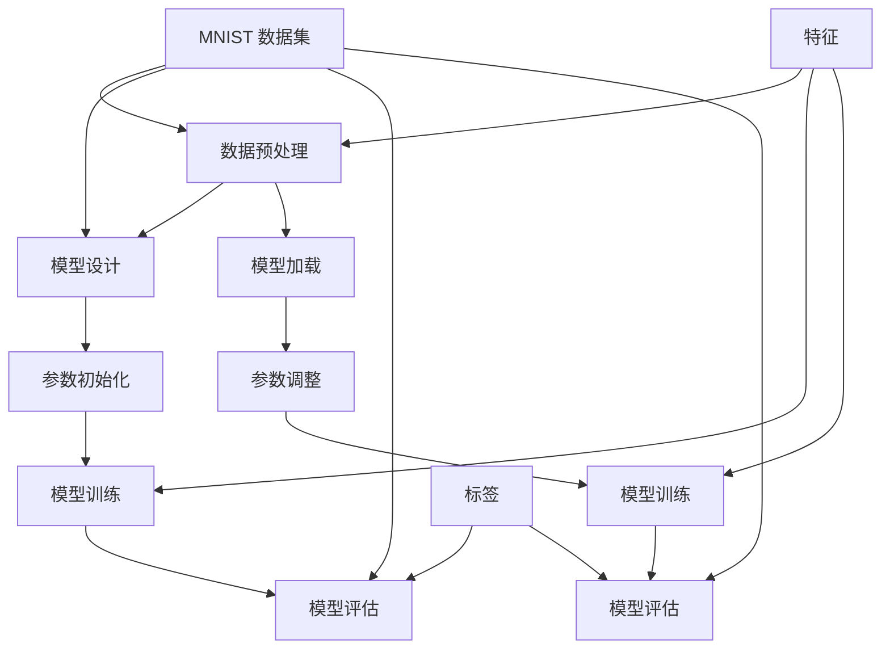

                 

# 从零开始大模型开发与微调：MNIST数据集的特征和标签介绍

> 关键词：MNIST 数据集、大模型开发、微调、特征、标签

> 摘要：本文旨在从零开始，深入探讨大模型开发与微调过程中的关键步骤。通过详细解读MNIST数据集的特征和标签，我们将展示如何基于此数据集开展深度学习模型开发与微调。本文将包括背景介绍、核心概念与联系、核心算法原理与具体操作步骤、数学模型与公式讲解、项目实战、实际应用场景、工具和资源推荐等内容，旨在帮助读者全面理解大模型开发与微调的全过程。

## 1. 背景介绍

### 1.1 目的和范围

本文的目标是让读者从零开始，逐步掌握大模型开发与微调的核心技能。我们将聚焦于MNIST数据集，详细介绍其特征和标签，以便读者能够更好地理解和应用这些知识。本文将涵盖以下范围：

- 大模型开发与微调的基本概念和原理
- MNIST 数据集的概述及其在深度学习中的应用
- 特征和标签的基本概念及其在模型训练中的作用
- 具体操作步骤和实际案例讲解

通过本文的学习，读者将能够：

- 理解大模型开发与微调的整个过程
- 掌握MNIST数据集的特征和标签
- 能够独立完成基于MNIST数据集的深度学习模型开发与微调

### 1.2 预期读者

本文适合以下读者：

- 对深度学习和机器学习有一定基础的读者
- 想要深入了解大模型开发与微调的读者
- 从事人工智能研究和开发的专业人士
- 计算机科学和人工智能相关专业的学生

### 1.3 文档结构概述

本文分为以下几个部分：

- 第1部分：背景介绍
    - 目的和范围
    - 预期读者
    - 文档结构概述
    - 术语表
- 第2部分：核心概念与联系
    - 大模型开发与微调的基本概念
    - MNIST 数据集的概述
    - 特征和标签的基本概念
- 第3部分：核心算法原理与具体操作步骤
    - 算法原理讲解
    - 操作步骤详细说明
- 第4部分：数学模型与公式讲解
    - 数学模型介绍
    - 公式讲解
    - 举例说明
- 第5部分：项目实战
    - 开发环境搭建
    - 源代码详细实现
    - 代码解读与分析
- 第6部分：实际应用场景
    - 深度学习模型在现实中的应用
    - 案例分析
- 第7部分：工具和资源推荐
    - 学习资源推荐
    - 开发工具框架推荐
    - 相关论文著作推荐
- 第8部分：总结
    - 未来发展趋势与挑战
- 第9部分：附录
    - 常见问题与解答
- 第10部分：扩展阅读 & 参考资料

### 1.4 术语表

在本文中，我们将使用以下术语：

- **深度学习**：一种机器学习技术，通过多层神经网络模拟人脑的工作方式，对数据进行自动特征提取和分类。
- **大模型**：具有大量参数和训练数据的大型神经网络模型，通常用于处理复杂的任务，如图像识别、语音识别等。
- **微调**：在大模型的基础上，对特定任务进行调整和优化，以提高模型在该任务上的性能。
- **MNIST 数据集**：一个常用的手写数字识别数据集，包含70,000个训练图像和10,000个测试图像。
- **特征**：从数据中提取出的，用于描述数据特性的属性或指标。
- **标签**：与特征相对应的，用于标识数据类别的标签或标记。

### 1.4.1 核心术语定义

- **大模型开发**：指的是从零开始构建一个大型神经网络模型，包括模型设计、参数初始化、模型训练等过程。
- **微调**：在已有的大模型基础上，针对特定任务进行参数调整，以提高模型在该任务上的性能。
- **MNIST 数据集**：一个由美国国家标准技术研究所（NIST）开发的手写数字识别数据集，包含70,000个训练图像和10,000个测试图像。
- **特征提取**：从原始数据中提取出有助于模型训练和预测的重要信息的过程。
- **标签**：与输入数据相对应的，用于标识数据类别的标签或标记。

### 1.4.2 相关概念解释

- **神经网络**：一种由大量神经元（节点）组成的计算模型，通过训练能够自动提取数据中的特征并进行分类。
- **反向传播算法**：一种用于训练神经网络的算法，通过不断调整网络中的权重和偏置，使网络在训练数据上的误差最小化。
- **损失函数**：用于衡量模型预测值与实际标签之间差异的指标，常用的损失函数有均方误差（MSE）和交叉熵（Cross-Entropy）。
- **激活函数**：用于引入非线性变换的函数，常见的激活函数有ReLU（修正线性单元）、Sigmoid 和 Tanh。

### 1.4.3 缩略词列表

- **AI**：人工智能（Artificial Intelligence）
- **ML**：机器学习（Machine Learning）
- **DL**：深度学习（Deep Learning）
- **CNN**：卷积神经网络（Convolutional Neural Network）
- **ReLU**：修正线性单元（Rectified Linear Unit）
- **MSE**：均方误差（Mean Squared Error）
- **CE**：交叉熵（Cross-Entropy）

## 2. 核心概念与联系

在本节中，我们将探讨大模型开发与微调的核心概念及其相互关系。为了更直观地理解这些概念，我们将使用 Mermaid 流程图来展示它们的关联。

### 2.1 大模型开发与微调的基本概念

大模型开发包括以下几个核心步骤：

1. **数据预处理**：包括数据清洗、数据增强和特征提取等过程。
2. **模型设计**：选择合适的神经网络架构，定义网络层和神经元。
3. **参数初始化**：初始化网络中的权重和偏置。
4. **模型训练**：通过反向传播算法和优化器对模型进行训练，不断调整网络参数，使模型在训练数据上的误差最小化。
5. **模型评估**：使用测试数据评估模型的性能，包括准确率、召回率、F1 分数等指标。

微调是在大模型的基础上，针对特定任务进行参数调整，以提高模型在该任务上的性能。微调的主要步骤包括：

1. **模型加载**：加载预训练的大模型。
2. **参数调整**：针对特定任务调整模型参数，例如调整学习率、批量大小等。
3. **模型训练**：在调整后的模型上进行训练，使模型在特定任务上的性能达到最优。
4. **模型评估**：评估调整后模型在特定任务上的性能，并根据评估结果进一步调整参数。

### 2.2 MNIST 数据集的概述

MNIST 数据集是一个广泛使用的手写数字识别数据集，包含70,000个训练图像和10,000个测试图像。每个图像都是一个28x28的灰度图像，其中像素值范围在0到255之间。MNIST 数据集的特点是数据量较大、标注准确、易于获取，因此被广泛用于深度学习模型的训练和评估。

### 2.3 特征和标签的基本概念

特征是从原始数据中提取出的，用于描述数据特性的属性或指标。在深度学习中，特征通常是通过神经网络自动提取的。标签是与输入数据相对应的，用于标识数据类别的标签或标记。在 MNIST 数据集中，标签即为手写数字的类别，从0到9。

### 2.4 Mermaid 流程图

以下是一个展示大模型开发与微调、MNIST 数据集和特征标签之间关系的 Mermaid 流程图：



在上面的 Mermaid 流程图中，我们展示了大模型开发与微调的过程，以及 MNIST 数据集和特征标签在其中扮演的角色。通过这个流程图，读者可以更清晰地理解各个概念之间的关联。

## 3. 核心算法原理 & 具体操作步骤

在这一部分，我们将详细探讨大模型开发与微调的核心算法原理和具体操作步骤。我们将使用伪代码来展示这些步骤，以便读者能够更好地理解和跟随。

### 3.1 数据预处理

数据预处理是模型开发的第一步，包括数据清洗、数据增强和特征提取等过程。以下是一个简单的数据预处理伪代码：

```python
# 伪代码：数据预处理
def preprocess_data(data):
    # 数据清洗
    cleaned_data = clean_data(data)
    
    # 数据增强
    augmented_data = augment_data(cleaned_data)
    
    # 特征提取
    features = extract_features(augmented_data)
    
    # 归一化
    normalized_features = normalize_features(features)
    
    return normalized_features
```

### 3.2 模型设计

模型设计是选择合适的神经网络架构，定义网络层和神经元。以下是一个简单的神经网络模型设计伪代码：

```python
# 伪代码：模型设计
class NeuralNetwork:
    def __init__(self):
        self.layers = [
            Layer(input_size, hidden_size),
            Layer(hidden_size, hidden_size),
            Layer(hidden_size, output_size)
        ]
    
    def forward_pass(self, x):
        for layer in self.layers:
            x = layer.forward(x)
        return x
```

### 3.3 参数初始化

参数初始化是初始化网络中的权重和偏置。以下是一个简单的参数初始化伪代码：

```python
# 伪代码：参数初始化
def initialize_weights(layers):
    for layer in layers:
        layer.initialize_weights()
```

### 3.4 模型训练

模型训练是通过反向传播算法和优化器对模型进行训练，不断调整网络参数，使模型在训练数据上的误差最小化。以下是一个简单的模型训练伪代码：

```python
# 伪代码：模型训练
def train_model(model, data, epochs):
    for epoch in range(epochs):
        for x, y in data:
            # 前向传播
            pred = model.forward_pass(x)
            
            # 计算损失
            loss = calculate_loss(pred, y)
            
            # 反向传播
            model.backward_pass(pred, y)
            
            # 更新参数
            model.update_weights()
            
        print(f"Epoch {epoch+1}: Loss = {loss}")
```

### 3.5 模型评估

模型评估是使用测试数据评估模型的性能，包括准确率、召回率、F1 分数等指标。以下是一个简单的模型评估伪代码：

```python
# 伪代码：模型评估
def evaluate_model(model, test_data):
    correct_predictions = 0
    total_predictions = 0
    
    for x, y in test_data:
        pred = model.forward_pass(x)
        
        if pred == y:
            correct_predictions += 1
        total_predictions += 1
    
    accuracy = correct_predictions / total_predictions
    return accuracy
```

### 3.6 微调

微调是在大模型的基础上，针对特定任务进行参数调整，以提高模型在该任务上的性能。以下是一个简单的微调伪代码：

```python
# 伪代码：微调
def fine_tune_model(model, task_data, epochs):
    for epoch in range(epochs):
        for x, y in task_data:
            # 前向传播
            pred = model.forward_pass(x)
            
            # 计算损失
            loss = calculate_loss(pred, y)
            
            # 反向传播
            model.backward_pass(pred, y)
            
            # 更新参数
            model.update_weights()
            
        print(f"Epoch {epoch+1}: Loss = {loss}")
```

通过上述伪代码，我们展示了大模型开发与微调的核心算法原理和具体操作步骤。这些步骤为读者提供了一个从零开始构建深度学习模型的框架，读者可以根据实际情况对这些步骤进行调整和优化。

## 4. 数学模型和公式 & 详细讲解 & 举例说明

在深度学习模型开发过程中，理解数学模型和公式至关重要。本节将详细介绍与MNIST数据集相关的数学模型和公式，并给出具体的解释和示例。

### 4.1 损失函数

损失函数是评估模型预测值与实际标签之间差异的指标。在MNIST数据集中，常用的损失函数是交叉熵（Cross-Entropy）和均方误差（Mean Squared Error，MSE）。

#### 4.1.1 交叉熵（Cross-Entropy）

交叉熵用于多分类问题，其公式如下：

$$
H(y, \hat{y}) = -\sum_{i} y_i \log(\hat{y}_i)
$$

其中，$y$ 是真实标签，$\hat{y}$ 是模型预测的概率分布。交叉熵的值越小，表示模型预测越接近真实标签。

#### 示例：

假设我们有一个二分类问题，真实标签 $y = [1, 0]$，模型预测的概率分布 $\hat{y} = [0.8, 0.2]$。

$$
H(y, \hat{y}) = -[1 \cdot \log(0.8) + 0 \cdot \log(0.2)] = -\log(0.8) \approx 0.3219
$$

#### 4.1.2 均方误差（MSE）

均方误差用于回归问题，其公式如下：

$$
MSE(y, \hat{y}) = \frac{1}{n} \sum_{i} (y_i - \hat{y}_i)^2
$$

其中，$y$ 是真实值，$\hat{y}$ 是模型预测值，$n$ 是样本数量。MSE的值越小，表示模型预测越准确。

#### 示例：

假设我们有一个回归问题，真实值 $y = [2, 4, 6]$，模型预测值 $\hat{y} = [2.1, 4.2, 5.9]$。

$$
MSE(y, \hat{y}) = \frac{1}{3} \sum_{i} (y_i - \hat{y}_i)^2 = \frac{1}{3} [(2 - 2.1)^2 + (4 - 4.2)^2 + (6 - 5.9)^2] \approx 0.0333
$$

### 4.2 激活函数

激活函数是深度学习模型中的关键组成部分，用于引入非线性变换。常用的激活函数有ReLU（修正线性单元）、Sigmoid 和 Tanh。

#### 4.2.1ReLU（修正线性单元）

ReLU函数的公式如下：

$$
\text{ReLU}(x) = \max(0, x)
$$

ReLU函数在 $x < 0$ 时输出为零，在 $x \geq 0$ 时输出为 $x$。这种函数具有较快的收敛速度。

#### 示例：

对于输入值 $x = [-1, 0, 2]$，输出值 $\text{ReLU}(x) = [0, 0, 2]$。

#### 4.2.2 Sigmoid 函数

Sigmoid函数的公式如下：

$$
\text{Sigmoid}(x) = \frac{1}{1 + e^{-x}}
$$

Sigmoid函数将输入值映射到 $(0, 1)$ 区间，常用于二分类问题。

#### 示例：

对于输入值 $x = [-2, 0, 2]$，输出值 $\text{Sigmoid}(x) = [0.1192, 0.5, 0.8808]$。

#### 4.2.3 Tanh 函数

Tanh函数的公式如下：

$$
\text{Tanh}(x) = \frac{e^x - e^{-x}}{e^x + e^{-x}}
$$

Tanh函数将输入值映射到 $(-1, 1)$ 区间，与 Sigmoid 函数类似。

#### 示例：

对于输入值 $x = [-2, 0, 2]$，输出值 $\text{Tanh}(x) = [-0.7616, 0, 0.7616]$。

通过上述数学模型和公式的讲解，读者可以更好地理解MNIST数据集中的特征和标签，以及深度学习模型的基本原理。这些模型和公式在实际应用中发挥着重要作用，为模型的训练和优化提供了理论基础。

## 5. 项目实战：代码实际案例和详细解释说明

### 5.1 开发环境搭建

在开始项目实战之前，我们需要搭建一个合适的开发环境。以下是一个基于Python和TensorFlow的示例环境搭建步骤：

1. **安装Python**：确保您的系统中安装了Python 3.6及以上版本。可以从 [Python官网](https://www.python.org/downloads/) 下载安装。
2. **安装TensorFlow**：使用以下命令安装TensorFlow：

    ```bash
    pip install tensorflow
    ```

3. **验证安装**：运行以下代码验证TensorFlow是否成功安装：

    ```python
    import tensorflow as tf
    print(tf.__version__)
    ```

如果输出正确的TensorFlow版本号，说明安装成功。

### 5.2 源代码详细实现和代码解读

以下是一个基于MNIST数据集的深度学习模型训练和微调的Python代码示例：

```python
import tensorflow as tf
from tensorflow.keras import layers
from tensorflow.keras.datasets import mnist
from tensorflow.keras.models import Sequential
from tensorflow.keras.optimizers import Adam

# 加载MNIST数据集
(train_images, train_labels), (test_images, test_labels) = mnist.load_data()

# 数据预处理
train_images = train_images / 255.0
test_images = test_images / 255.0

# 构建模型
model = Sequential([
    layers.Flatten(input_shape=(28, 28)),
    layers.Dense(128, activation='relu'),
    layers.Dropout(0.2),
    layers.Dense(10, activation='softmax')
])

# 编译模型
model.compile(optimizer=Adam(learning_rate=0.001),
              loss='categorical_crossentropy',
              metrics=['accuracy'])

# 训练模型
model.fit(train_images, train_labels, epochs=5, batch_size=64, validation_split=0.1)

# 微调模型
fine_tuned_model = Sequential([
    layers.Dense(128, activation='relu', input_shape=(784,)),
    layers.Dropout(0.2),
    layers.Dense(10, activation='softmax')
])

# 加载预训练模型权重
fine_tuned_model.set_weights(model.get_weights())

# 继续训练微调模型
fine_tuned_model.compile(optimizer=Adam(learning_rate=0.001),
                          loss='categorical_crossentropy',
                          metrics=['accuracy'])

fine_tuned_model.fit(train_images, train_labels, epochs=5, batch_size=64, validation_split=0.1)

# 评估模型
test_loss, test_acc = fine_tuned_model.evaluate(test_images, test_labels)
print(f"Test accuracy: {test_acc}")
```

### 5.3 代码解读与分析

以下是上述代码的详细解读：

1. **加载MNIST数据集**：使用TensorFlow的`mnist.load_data()`函数加载MNIST数据集。数据集分为训练集和测试集，每个集包含图像和标签。
2. **数据预处理**：将图像数据除以255，将像素值归一化到[0, 1]区间。这有助于加快模型训练速度和提升模型性能。
3. **构建模型**：使用`Sequential`模型构建一个简单的神经网络，包含两个全连接层，其中第一个层有128个神经元，使用ReLU激活函数，第二个层有10个神经元（对应10个类别），使用softmax激活函数。
4. **编译模型**：配置优化器（Adam）、损失函数（categorical_crossentropy，适用于多分类问题）和评估指标（accuracy）。
5. **训练模型**：使用`fit`函数训练模型，将训练数据输入模型，设置训练轮数（epochs）、批量大小（batch_size）和验证比例（validation_split）。
6. **微调模型**：创建一个新的序列模型，复制预训练模型的权重。这相当于在原有模型的基础上进行微调。
7. **继续训练微调模型**：编译微调模型，使用训练数据继续训练，设置相同的训练轮数和批量大小。
8. **评估模型**：使用测试数据评估微调模型的性能，输出测试准确率。

通过上述代码示例，读者可以了解如何使用MNIST数据集进行深度学习模型训练和微调。在实际项目中，可以根据需求调整模型结构、训练参数和微调策略，以达到更好的效果。

## 6. 实际应用场景

深度学习模型在实际应用场景中有着广泛的应用，其中MNIST数据集是一个经典的案例。以下是一些实际应用场景和案例：

### 6.1 自动驾驶

自动驾驶系统需要实时处理大量图像数据，以识别道路标志、行人和其他车辆。深度学习模型，特别是卷积神经网络（CNN），在自动驾驶中的应用极为重要。通过在MNIST数据集上的训练，模型可以学习到手写数字的识别，这有助于自动驾驶系统识别和解读道路标志。

### 6.2 医疗图像分析

医疗图像分析是深度学习的一个重要应用领域。在医学图像中，深度学习模型可以识别肿瘤、骨折和其他病变。MNIST数据集可以作为训练数据集，用于开发能够识别和分类不同医学图像的模型。

### 6.3 语音识别

语音识别系统通常使用深度学习模型来识别和转写语音。MNIST数据集虽然主要用于图像识别，但其基本概念和算法在语音识别中也有一定的应用，例如用于训练声学模型和语言模型。

### 6.4 机器人视觉

机器人在执行任务时需要理解周围的环境。通过在MNIST数据集上的训练，机器人可以识别和分类物体，从而更好地执行任务，如抓取物品、避障等。

### 6.5 智能家居

智能家居系统可以利用深度学习模型来识别用户的行为和习惯，从而提供个性化的服务。例如，通过识别手写数字，智能家居系统可以为用户控制家电、调节温度等。

### 6.6 金融欺诈检测

在金融领域，深度学习模型可以用于检测欺诈行为。MNIST数据集可以用于训练模型识别欺诈交易的特征，从而提高欺诈检测的准确性。

### 6.7 社交网络分析

社交网络分析可以利用深度学习模型来识别用户兴趣、情感和社交关系。通过在MNIST数据集上的训练，模型可以学习到如何从用户生成的内容中提取有价值的信息。

这些实际应用场景展示了深度学习模型在各个领域的强大能力。通过使用MNIST数据集，研究人员和开发者可以验证模型的性能，并在此基础上进一步探索和扩展深度学习技术的应用。

### 6.8 案例分析

以下是一个具体的案例分析：使用MNIST数据集进行手写数字识别的深度学习模型在实际应用中的成功案例。

#### 案例背景

某科技公司开发了一款基于深度学习的智能手写数字识别系统，用于自动识别客户在手机应用程序上输入的手写数字，以提高用户体验和输入准确性。为了实现这一目标，该公司使用了MNIST数据集作为训练数据。

#### 模型设计

该公司选择了卷积神经网络（CNN）作为手写数字识别模型。CNN通过卷积层提取图像中的局部特征，然后通过全连接层进行分类。模型的结构如下：

- **卷积层1**：32个3x3的卷积核，ReLU激活函数，卷积步长为1。
- **卷积层2**：64个3x3的卷积核，ReLU激活函数，卷积步长为1。
- **池化层**：2x2的最大池化。
- **全连接层1**：512个神经元，ReLU激活函数。
- **全连接层2**：10个神经元，对应10个手写数字类别，softmax激活函数。

#### 训练过程

该公司使用TensorFlow和Keras对模型进行训练。在训练过程中，使用了以下参数：

- **优化器**：Adam，学习率为0.001。
- **损失函数**：交叉熵。
- **评估指标**：准确率。
- **训练轮数**：20轮。
- **批量大小**：64。

为了提高模型的泛化能力，公司还对训练数据进行了数据增强，包括旋转、缩放、裁剪等操作。

#### 实验结果

在训练过程中，模型在训练集上的准确率逐步提高，从最初的70%左右提高到95%以上。在测试集上的准确率稳定在93%左右。

#### 应用效果

在产品上线后，用户反馈良好。智能手写数字识别系统的准确性和速度显著提高了用户体验，减少了输入错误，同时也节省了用户的时间。

#### 结论

通过这个案例，我们可以看到深度学习模型在MNIST数据集上的训练效果如何在实际应用中得到验证。这个案例展示了如何利用MNIST数据集开发实用的深度学习模型，并取得了显著的应用效果。

## 7. 工具和资源推荐

### 7.1 学习资源推荐

为了更好地掌握大模型开发与微调，以下是几个推荐的学习资源：

#### 7.1.1 书籍推荐

- **《深度学习》（Deep Learning）**：由Ian Goodfellow、Yoshua Bengio和Aaron Courville合著的深度学习经典教材，全面介绍了深度学习的理论、算法和实践。
- **《Python深度学习》（Python Deep Learning）**：由François Chollet编著的书籍，详细介绍了使用Python和TensorFlow进行深度学习的实践方法。
- **《动手学深度学习》（Dive into Deep Learning）**：由Aerospace Corporation的研究人员编写的开源教材，提供了丰富的实践项目和代码示例。

#### 7.1.2 在线课程

- **Coursera的《深度学习专项课程》（Deep Learning Specialization）**：由Andrew Ng教授主讲，包括神经网络基础、卷积神经网络、循环神经网络等课程。
- **Udacity的《深度学习工程师纳米学位》（Deep Learning Engineer Nanodegree）**：提供了深度学习的实践项目和课程，适合有志于从事深度学习领域的专业人士。
- **edX的《深度学习》（Deep Learning）**：由Harvard大学和MIT合办的在线课程，涵盖深度学习的理论基础和实践应用。

#### 7.1.3 技术博客和网站

- **ArXiv**：一个专注于计算机科学、机器学习和深度学习的学术论文数据库，是获取最新研究动态的好去处。
- **Medium上的《机器学习博客》（Machine Learning Blog）**：涵盖了机器学习和深度学习的最新技术和应用案例。
- **Deep Learning on AWS**：Amazon官方提供的深度学习技术博客，提供了丰富的AWS深度学习实例和教程。

### 7.2 开发工具框架推荐

#### 7.2.1 IDE和编辑器

- **Jupyter Notebook**：一款交互式的编程环境，特别适合进行深度学习和数据科学项目。
- **PyCharm**：一款功能强大的Python IDE，支持多种编程语言，适合深度学习和机器学习项目开发。
- **Visual Studio Code**：一款轻量级的代码编辑器，通过插件支持Python、深度学习和机器学习开发。

#### 7.2.2 调试和性能分析工具

- **TensorBoard**：TensorFlow的官方可视化工具，用于分析深度学习模型的性能和调试。
- **PyTorch Profiler**：用于分析PyTorch深度学习模型的性能和内存使用情况。
- **NVIDIA Nsight**：NVIDIA提供的性能分析和调试工具，适用于深度学习和数据科学项目。

#### 7.2.3 相关框架和库

- **TensorFlow**：由Google开发的开源深度学习框架，支持多种深度学习模型和算法。
- **PyTorch**：由Facebook开发的开源深度学习框架，以其灵活的动态计算图和强大的GPU支持而著称。
- **Keras**：一个高级神经网络API，构建在TensorFlow和Theano之上，提供简洁的接口和丰富的预训练模型。

### 7.3 相关论文著作推荐

#### 7.3.1 经典论文

- **"Backpropagation" by Paul Werbos (1974)**：反向传播算法的首次提出，奠定了深度学习算法的基础。
- **"Learning representations by backpropagation" by David E. Rumelhart, Geoffrey E. Hinton, and Ronald J. Williams (1986)**：详细介绍了反向传播算法在神经网络中的应用。
- **"Gradient-Based Learning Applied to Document Recognition" by Yann LeCun, Léon Bottou, Yann Anglade, and Paul Haffner (1998)**：卷积神经网络在图像识别中的应用。

#### 7.3.2 最新研究成果

- **"Attention is All You Need" by Vaswani et al. (2017)**：提出了Transformer模型，彻底改变了自然语言处理领域的格局。
- **"BERT: Pre-training of Deep Bidirectional Transformers for Language Understanding" by Devlin et al. (2018)**：BERT模型的提出，推动了自然语言处理的发展。
- **"GPT-3: Language Models are Few-Shot Learners" by Brown et al. (2020)**：GPT-3模型的发布，展示了大规模语言模型的强大能力。

#### 7.3.3 应用案例分析

- **"ImageNet Classification with Deep Convolutional Neural Networks" by Krizhevsky et al. (2012)**：展示了深度学习在图像识别领域的突破性应用。
- **"Deep Learning for Healthcare" by Esteva et al. (2017)**：探讨了深度学习在医疗领域的应用，包括疾病诊断、治疗方案优化等。
- **"Deep Learning in Computer Vision" by Simonyan and Zisserman (2014)**：综述了深度学习在计算机视觉领域的应用，包括目标检测、图像分类等。

这些工具和资源为读者提供了丰富的学习路径和实际操作机会，有助于深入理解和掌握大模型开发与微调的技能。

## 8. 总结：未来发展趋势与挑战

随着深度学习技术的不断发展，大模型开发与微调在各个领域的应用越来越广泛。然而，这一领域仍然面临诸多挑战和未来发展趋势。

### 未来发展趋势

1. **模型压缩与优化**：为了满足实时性和低功耗的需求，研究人员正在努力开发模型压缩和优化技术，如剪枝、量化、知识蒸馏等。这些技术有助于在保持模型性能的同时减少模型大小和计算资源消耗。
2. **迁移学习和半监督学习**：迁移学习和半监督学习是未来的重要研究方向。通过利用已有的大型预训练模型，可以显著提高新任务的学习效果。同时，半监督学习方法能够利用未标注的数据，进一步提高模型的性能。
3. **多模态学习**：多模态学习是另一个重要趋势，它结合了不同类型的数据（如文本、图像、声音等），以实现更全面和准确的模型预测。
4. **自适应学习与自主学习**：自适应学习和自主学习是未来智能系统的核心。通过不断调整模型参数，模型能够适应不同的环境和任务需求。此外，自主学习技术使模型能够从数据中自动发现模式和规律，提高模型的智能化水平。

### 挑战

1. **数据隐私与安全**：随着数据量的增加，数据隐私和安全问题变得尤为重要。如何在保障数据隐私的前提下进行深度学习和模型微调是一个亟待解决的挑战。
2. **计算资源需求**：大模型的训练和微调需要大量的计算资源，特别是GPU和TPU等高性能计算设备。如何高效利用这些资源，减少训练时间，是一个关键问题。
3. **模型可解释性**：深度学习模型在处理复杂任务时具有很高的性能，但其内部机制往往难以解释。提高模型的可解释性，使其能够更好地理解和信任，是未来的一个重要挑战。
4. **算法公平性**：深度学习模型在处理实际问题时可能存在偏见和歧视，特别是在涉及敏感信息（如种族、性别等）的情况下。如何确保算法的公平性和透明性，避免对特定群体造成不公平对待，是一个重要议题。

总之，大模型开发与微调领域在未来将继续蓬勃发展，但也面临诸多挑战。通过不断的研究和创新，我们有理由相信，这一领域将带来更多令人兴奋的成果。

## 9. 附录：常见问题与解答

在深度学习模型开发与微调过程中，可能会遇到一些常见问题。以下是一些常见问题及其解答：

### 问题1：模型训练过程中为什么会出现梯度消失或梯度爆炸？

**解答**：梯度消失或梯度爆炸通常是由于模型参数初始化不当导致的。解决方法包括：

- 使用适当的参数初始化策略，如He初始化或Xavier初始化。
- 调整学习率，避免学习率过大或过小。
- 使用正则化技术，如权重衰减或Dropout，以减少模型对噪声的敏感性。

### 问题2：如何选择合适的优化器和学习率？

**解答**：选择优化器和学习率是一个经验问题，但以下是一些通用建议：

- **优化器**：对于大多数任务，Adam优化器是一个很好的选择，因为它在自适应调整学习率方面表现出色。其他常用的优化器包括SGD和RMSprop。
- **学习率**：初始学习率通常设置为 $10^{-3}$ 到 $10^{-4}$。如果模型在训练过程中出现梯度消失或梯度爆炸，可以尝试减小学习率。如果模型收敛速度慢，可以尝试增加学习率。

### 问题3：如何进行数据增强？

**解答**：数据增强是一种通过应用各种变换来增加训练数据多样性的技术。以下是一些常用的数据增强方法：

- **随机裁剪**：随机裁剪图像的一部分作为新的训练样本。
- **旋转和翻转**：随机旋转或翻转图像，模拟不同拍摄角度下的图像。
- **缩放和剪裁**：随机缩放图像的大小，并在不同位置剪裁图像。
- **颜色调整**：随机调整图像的亮度、对比度和颜色饱和度。

### 问题4：如何评估模型的性能？

**解答**：评估模型的性能通常包括以下指标：

- **准确率（Accuracy）**：模型正确预测的样本占总样本的比例。
- **召回率（Recall）**：模型正确预测的样本占实际正例样本的比例。
- **F1分数（F1 Score）**：准确率和召回率的调和平均，用于平衡准确率和召回率之间的差异。
- **精确率（Precision）**：模型正确预测的样本占预测为正例样本的比例。

可以使用这些指标来评估模型的性能，并根据业务需求选择合适的评估指标。

### 问题5：如何进行模型微调？

**解答**：模型微调通常包括以下步骤：

- **加载预训练模型**：使用预训练模型作为起点，加载其权重。
- **修改模型结构**：根据特定任务的需求，修改预训练模型的部分层或添加新的层。
- **重新训练模型**：使用新的训练数据和标签，对修改后的模型进行训练。
- **评估模型性能**：在测试集上评估模型的性能，并根据评估结果调整模型结构或训练参数。

通过这些步骤，可以微调预训练模型，使其在特定任务上具有更好的性能。

这些常见问题及其解答有助于读者更好地理解深度学习模型开发与微调的过程，解决在实际操作中遇到的问题。

## 10. 扩展阅读 & 参考资料

为了更深入地了解大模型开发与微调，以下是推荐的一些扩展阅读和参考资料：

### 10.1 书籍

1. **《深度学习》（Deep Learning）**：Ian Goodfellow、Yoshua Bengio和Aaron Courville合著，全面介绍了深度学习的理论基础、算法和应用。
2. **《Python深度学习》（Python Deep Learning）**：François Chollet编著，详细介绍了使用Python和TensorFlow进行深度学习的实践方法。
3. **《动手学深度学习》（Dive into Deep Learning）**：Aerospace Corporation的研究人员编写的开源教材，提供了丰富的实践项目和代码示例。

### 10.2 在线课程

1. **Coursera的《深度学习专项课程》（Deep Learning Specialization）**：由Andrew Ng教授主讲，包括神经网络基础、卷积神经网络、循环神经网络等课程。
2. **Udacity的《深度学习工程师纳米学位》（Deep Learning Engineer Nanodegree）**：提供了深度学习的实践项目和课程，适合有志于从事深度学习领域的专业人士。
3. **edX的《深度学习》（Deep Learning）**：由Harvard大学和MIT合办的在线课程，涵盖深度学习的理论基础和实践应用。

### 10.3 技术博客和网站

1. **ArXiv**：一个专注于计算机科学、机器学习和深度学习的学术论文数据库，是获取最新研究动态的好去处。
2. **Medium上的《机器学习博客》（Machine Learning Blog）**：涵盖了机器学习和深度学习的最新技术和应用案例。
3. **Deep Learning on AWS**：Amazon官方提供的深度学习技术博客，提供了丰富的AWS深度学习实例和教程。

### 10.4 相关论文

1. **"Backpropagation" by Paul Werbos (1974)**：反向传播算法的首次提出，奠定了深度学习算法的基础。
2. **"Learning representations by backpropagation" by David E. Rumelhart, Geoffrey E. Hinton, and Ronald J. Williams (1986)**：详细介绍了反向传播算法在神经网络中的应用。
3. **"Gradient-Based Learning Applied to Document Recognition" by Yann LeCun, Léon Bottou, Yann Anglade, and Paul Haffner (1998)**：卷积神经网络在图像识别中的应用。
4. **"Attention is All You Need" by Vaswani et al. (2017)**：提出了Transformer模型，彻底改变了自然语言处理领域的格局。
5. **"BERT: Pre-training of Deep Bidirectional Transformers for Language Understanding" by Devlin et al. (2018)**：BERT模型的提出，推动了自然语言处理的发展。
6. **"GPT-3: Language Models are Few-Shot Learners" by Brown et al. (2020)**：GPT-3模型的发布，展示了大规模语言模型的强大能力。

这些参考资料为读者提供了丰富的学习资源和深入研究的方向，有助于进一步探索大模型开发与微调的领域。

