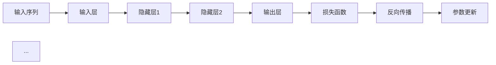

                 

# 从零开始大模型开发与微调：循环神经网络理论讲解

> 关键词：大模型开发、微调、循环神经网络、算法原理、数学模型、项目实战

> 摘要：本文将深入讲解大模型开发与微调的核心概念，重点关注循环神经网络（RNN）的理论基础及其在实践中的应用。我们将从背景介绍入手，逐步探讨核心概念与联系，详细解析核心算法原理与数学模型，结合实际项目案例进行代码解读，并探讨其在不同应用场景中的实际价值。最后，我们还将推荐相关学习资源和开发工具，以助读者深入学习和实践。

## 1. 背景介绍

### 1.1 目的和范围

本文旨在为读者提供一个系统、详尽的循环神经网络（RNN）大模型开发与微调教程。我们将通过一系列步骤，帮助读者了解RNN的基础知识、核心算法、数学模型，以及实际项目中的应用。文章将覆盖以下内容：

- 循环神经网络的基础概念与原理
- 大模型开发与微调的关键步骤
- 算法原理的具体讲解与伪代码实现
- 数学模型的详细解析与举例说明
- 项目实战：代码实现与详细解读
- 实际应用场景探讨
- 学习资源和开发工具推荐

### 1.2 预期读者

本文适合以下读者群体：

- 对循环神经网络和深度学习有初步了解的读者
- 想要深入了解RNN大模型开发与微调的技术人员
- 想要提升自己编程和算法能力的程序员
- 计算机科学和人工智能专业的学生和教师

### 1.3 文档结构概述

本文将按照以下结构展开：

1. **背景介绍**：介绍本文的目的、范围和预期读者，以及文档结构概述。
2. **核心概念与联系**：介绍RNN的基本概念和原理，并使用Mermaid流程图展示核心概念和架构。
3. **核心算法原理与具体操作步骤**：详细讲解RNN的算法原理，并通过伪代码进行具体阐述。
4. **数学模型与公式**：详细解析RNN的数学模型，并使用LaTeX格式给出相关公式和举例说明。
5. **项目实战**：结合实际项目案例，展示代码实现过程，并进行详细解读和分析。
6. **实际应用场景**：探讨RNN在不同应用场景中的实际应用。
7. **工具和资源推荐**：推荐相关学习资源和开发工具，以助读者深入学习和实践。
8. **总结**：总结本文的核心内容和未来发展趋势与挑战。
9. **附录**：提供常见问题与解答，以及扩展阅读和参考资料。

### 1.4 术语表

#### 1.4.1 核心术语定义

- **循环神经网络（RNN）**：一种能够处理序列数据的神经网络，具有记忆能力，能够通过循环结构保存历史信息。
- **长短期记忆（LSTM）**：一种特殊的RNN结构，用于解决传统RNN的梯度消失和梯度爆炸问题，具有更好的记忆能力。
- **微调**：通过调整神经网络参数来优化模型性能的过程，通常用于预训练模型在新任务上的适应。
- **反向传播**：一种常用的优化算法，通过计算损失函数关于网络参数的梯度，来更新网络参数，以减小损失函数。

#### 1.4.2 相关概念解释

- **序列数据**：具有时间维度或顺序的数据，如文本、时间序列、语音等。
- **损失函数**：用于评估模型预测结果与真实结果之间差异的函数，常用的损失函数有均方误差（MSE）和交叉熵（CE）。
- **反向传播算法**：一种基于链式法则的优化算法，通过计算损失函数关于网络参数的梯度，来更新网络参数。

#### 1.4.3 缩略词列表

- **RNN**：循环神经网络
- **LSTM**：长短期记忆
- **MSE**：均方误差
- **CE**：交叉熵

## 2. 核心概念与联系

在这一部分，我们将介绍循环神经网络（RNN）的核心概念和原理，并使用Mermaid流程图展示其基本架构。

### 2.1 RNN的基本概念

循环神经网络（RNN）是一种能够处理序列数据的神经网络。与传统的前馈神经网络（FNN）不同，RNN具有记忆能力，可以处理具有时间维度或顺序的数据，如图文、时间序列、语音等。

RNN的基本架构包括输入层、隐藏层和输出层。输入层接收序列数据，隐藏层保存历史信息，输出层生成预测结果。

### 2.2 RNN的工作原理

RNN通过循环结构来保存历史信息，使得当前时刻的输出不仅依赖于当前输入，还依赖于之前的输入。具体来说，RNN中的隐藏状态（h_t）和当前输入（x_t）通过一个非线性激活函数进行组合，生成新的隐藏状态（h_{t+1}）。

\[ h_{t+1} = \text{激活函数}(\text{W} \cdot [h_t, x_t] + b) \]

其中，W和b分别为权重和偏置，激活函数通常采用sigmoid、tanh等非线性函数。

### 2.3 RNN的核心架构

为了更好地理解RNN的工作原理，我们可以使用Mermaid流程图展示其基本架构：



在这个流程图中，输入序列通过输入层进入RNN，然后经过一系列隐藏层，最后通过输出层生成预测结果。损失函数用于评估预测结果与真实结果的差异，反向传播算法用于更新网络参数，以减小损失函数。

## 3. 核心算法原理 & 具体操作步骤

在这一部分，我们将详细讲解循环神经网络（RNN）的核心算法原理，并通过伪代码进行具体阐述。

### 3.1 RNN的算法原理

RNN的算法原理主要涉及以下几个步骤：

1. **输入处理**：将输入序列转化为神经网络可以处理的形式，如词向量或编码表示。
2. **隐藏状态更新**：根据当前输入和之前隐藏状态，更新隐藏状态。
3. **输出生成**：根据隐藏状态，生成预测输出。
4. **损失计算**：计算预测输出与真实输出之间的差异，即损失。
5. **反向传播**：通过计算损失函数关于网络参数的梯度，更新网络参数。
6. **参数更新**：根据梯度更新网络参数，以减小损失函数。

下面是RNN算法的具体操作步骤及其伪代码实现：

```plaintext
初始化：设置网络参数W, b，激活函数f()

for each epoch do
  for each example (x, y) in the training set do
    # 步骤1：输入处理
    x_vector = convert_to_vector(x)
    
    # 步骤2：隐藏状态更新
    h_t = [h_0, x_vector]
    for t = 1 to length(x) do
      h_t+1 = f(W \* [h_t, x_vector] + b)
      h_t = h_t+1
    
    # 步骤3：输出生成
    y_pred = g(h_t)
    
    # 步骤4：损失计算
    loss = calculate_loss(y_pred, y)
    
    # 步骤5：反向传播
    dW, db = calculate_gradient(h_t, y_pred, y)
    
    # 步骤6：参数更新
    W = W - learning_rate \* dW
    b = b - learning_rate \* db
  end for
end for
```

在这个伪代码中，`convert_to_vector()` 函数用于将输入序列转换为神经网络可以处理的形式，`f()` 函数表示激活函数，`g()` 函数表示输出层函数，`calculate_loss()` 函数用于计算损失函数，`calculate_gradient()` 函数用于计算梯度，`learning_rate` 为学习率。

### 3.2 RNN的优化算法

在RNN的训练过程中，反向传播算法是一个关键步骤。然而，传统反向传播算法在训练过程中容易遇到梯度消失和梯度爆炸问题。为了解决这些问题，我们通常采用以下优化算法：

1. **梯度裁剪**：当梯度过大时，通过裁剪梯度值来避免梯度爆炸；当梯度过小时，通过裁剪梯度值来避免梯度消失。
2. **学习率调整**：通过动态调整学习率来优化训练过程。
3. **动量项**：在梯度更新中添加动量项，以减小参数更新的震荡幅度。
4. **自适应学习率**：如Adam优化器，通过自适应调整学习率来优化训练过程。

下面是一个改进的反向传播算法伪代码：

```plaintext
初始化：设置网络参数W, b，激活函数f()，梯度裁剪阈值θ，学习率learning_rate，动量项m

for each epoch do
  for each example (x, y) in the training set do
    # 步骤1：输入处理
    x_vector = convert_to_vector(x)
    
    # 步骤2：隐藏状态更新
    h_t = [h_0, x_vector]
    for t = 1 to length(x) do
      h_t+1 = f(W \* [h_t, x_vector] + b)
      h_t = h_t+1
    
    # 步骤3：输出生成
    y_pred = g(h_t)
    
    # 步骤4：损失计算
    loss = calculate_loss(y_pred, y)
    
    # 步骤5：反向传播
    dW, db = calculate_gradient(h_t, y_pred, y)
    dW = gradient_clipping(dW, θ)
    db = gradient_clipping(db, θ)
    
    # 步骤6：参数更新
    m = β1 * m + (1 - β1) * dW
    m_hat = m / (1 - β1^t)
    W = W - learning_rate \* m_hat
    b = b - learning_rate \* db
  end for
end for
```

在这个伪代码中，`gradient_clipping()` 函数用于梯度裁剪，`m` 为动量项，`β1` 为动量项系数，`m_hat` 为归一化动量项。

通过这些优化算法，我们可以有效地解决RNN训练过程中遇到的梯度消失和梯度爆炸问题，提高模型的训练效率和稳定性。

## 4. 数学模型和公式 & 详细讲解 & 举例说明

在这一部分，我们将深入探讨循环神经网络（RNN）的数学模型，并使用LaTeX格式给出相关公式和详细讲解。同时，我们将结合实际例子进行说明。

### 4.1 RNN的数学模型

循环神经网络（RNN）的核心在于其状态更新和输出生成过程。以下是RNN的基本数学模型：

#### 4.1.1 状态更新

RNN的状态更新可以表示为：

\[ h_{t+1} = f(W_h \cdot [h_t, x_t] + b_h) \]

其中，\( h_t \) 表示第 \( t \) 个时间步的隐藏状态，\( x_t \) 表示第 \( t \) 个时间步的输入，\( W_h \) 和 \( b_h \) 分别为权重和偏置，\( f() \) 为激活函数。

#### 4.1.2 输出生成

RNN的输出生成可以表示为：

\[ y_t = g(W_y \cdot h_t + b_y) \]

其中，\( y_t \) 表示第 \( t \) 个时间步的输出，\( W_y \) 和 \( b_y \) 分别为权重和偏置，\( g() \) 为输出层函数。

### 4.2 公式详细讲解

#### 4.2.1 状态更新公式

在状态更新过程中，隐藏状态 \( h_t \) 依赖于当前输入 \( x_t \) 和之前隐藏状态 \( h_{t-1} \)。权重和偏置 \( W_h \) 和 \( b_h \) 起到调节作用，激活函数 \( f() \) 则引入非线性变换。

具体来说，状态更新公式可以表示为：

\[ h_{t+1} = f(W_h \cdot [h_t, x_t] + b_h) \]

其中，\( W_h \cdot [h_t, x_t] \) 为线性组合，\( b_h \) 为偏置，\( f() \) 为激活函数。

#### 4.2.2 输出生成公式

在输出生成过程中，输出 \( y_t \) 依赖于隐藏状态 \( h_t \)。权重和偏置 \( W_y \) 和 \( b_y \) 起到调节作用，输出层函数 \( g() \) 则引入非线性变换。

具体来说，输出生成公式可以表示为：

\[ y_t = g(W_y \cdot h_t + b_y) \]

其中，\( W_y \cdot h_t \) 为线性组合，\( b_y \) 为偏置，\( g() \) 为输出层函数。

### 4.3 实际例子说明

为了更好地理解RNN的数学模型，我们通过一个简单的例子进行说明。

#### 4.3.1 例子背景

假设我们有一个二分类问题，输入为两个时间步的序列 \( [x_1, x_2] \)，输出为二进制值 \( y \)。激活函数 \( f() \) 和输出层函数 \( g() \) 分别为：

\[ f(x) = \tanh(x) \]
\[ g(x) = \sigma(x) \]

其中，\( \tanh(x) \) 为双曲正切函数，\( \sigma(x) \) 为sigmoid函数。

#### 4.3.2 状态更新

首先，我们初始化隐藏状态 \( h_0 \) 和输入 \( x_1, x_2 \)。假设 \( h_0 = 0 \)，\( x_1 = [1, 0] \)，\( x_2 = [0, 1] \)。

状态更新过程如下：

\[ h_1 = f(W_h \cdot [h_0, x_1] + b_h) \]
\[ h_2 = f(W_h \cdot [h_1, x_2] + b_h) \]

其中，\( W_h \) 和 \( b_h \) 为权重和偏置，我们暂时假设 \( W_h = [1, 1] \)，\( b_h = 0 \)。

代入激活函数 \( f(x) = \tanh(x) \)：

\[ h_1 = \tanh(W_h \cdot [h_0, x_1] + b_h) \]
\[ h_1 = \tanh([1, 1] \cdot [0, 1] + 0) \]
\[ h_1 = \tanh([0, 1]) \]
\[ h_1 = \frac{e^1 - e^{-1}}{e^1 + e^{-1}} \]
\[ h_1 = \frac{2}{e^2 + 1} \]

同理，计算 \( h_2 \)：

\[ h_2 = \tanh(W_h \cdot [h_1, x_2] + b_h) \]
\[ h_2 = \tanh([1, 1] \cdot \left[\frac{2}{e^2 + 1}, 0\right] + 0) \]
\[ h_2 = \tanh\left(\left[\frac{2}{e^2 + 1}, \frac{2}{e^2 + 1}\right]\right) \]
\[ h_2 = \frac{e^2 - 1}{e^2 + 1} \]

#### 4.3.3 输出生成

接下来，我们使用隐藏状态 \( h_2 \) 生成输出 \( y \)。假设输出层函数 \( g(x) = \sigma(x) \)。

\[ y = g(W_y \cdot h_2 + b_y) \]

其中，\( W_y \) 和 \( b_y \) 为权重和偏置，我们暂时假设 \( W_y = [1, 0] \)，\( b_y = 0 \)。

代入输出层函数 \( g(x) = \sigma(x) \)：

\[ y = \sigma(W_y \cdot h_2 + b_y) \]
\[ y = \sigma([1, 0] \cdot \left[\frac{e^2 - 1}{e^2 + 1}, \frac{e^2 - 1}{e^2 + 1}\right] + 0) \]
\[ y = \sigma\left(\left[\frac{e^2 - 1}{e^2 + 1}, 0\right]\right) \]
\[ y = \frac{1}{1 + e^{-\left[\frac{e^2 - 1}{e^2 + 1}\right]}} \]

根据计算结果，输出 \( y \) 为一个介于 0 和 1 之间的值。在实际应用中，我们可以通过设定阈值（例如 0.5）来判断输出是否为 1 或 0，从而实现分类任务。

通过这个简单例子，我们可以看到RNN的数学模型是如何工作的。在实际应用中，我们可以通过调整权重、偏置和激活函数等参数，来优化模型的性能。

### 4.4 数学模型的扩展

除了基本模型，RNN还衍生出许多变体，如长短时记忆网络（LSTM）和门控循环单元（GRU）。这些模型在数学模型上有所不同，但核心思想相似，都是通过引入额外的机制来提高模型的记忆能力和泛化能力。

#### 4.4.1 长短时记忆网络（LSTM）

LSTM通过引入记忆单元和门控机制，有效解决了传统RNN的梯度消失和梯度爆炸问题。以下是LSTM的数学模型：

\[ C_{t+1} = \text{sigmoid}(f \odot \text{sigmoid}(i \odot \text{sigmoid}(g) \odot C_t + \text{sigmoid}(o) \odot f \odot h_t) \]

其中，\( C_t \) 为记忆单元，\( i, f, o \) 分别为输入门、遗忘门和输出门，\( g \) 为输入。

#### 4.4.2 门控循环单元（GRU）

GRU是LSTM的一种简化版本，通过将遗忘门和输入门合并为一个更新门，提高了计算效率。以下是GRU的数学模型：

\[ C_{t+1} = \text{sigmoid}(z) \odot C_t + \text{sigmoid}(o) \odot \tanh(C_t + W \cdot \text{sigmoid}(g) \cdot h_t) \]

其中，\( C_t \) 为记忆单元，\( z \) 为更新门，\( o \) 为输出门，\( g \) 为输入，\( W \) 为权重。

通过这些扩展模型，我们可以应对更复杂的序列数据处理任务，提高模型的性能和应用范围。

## 5. 项目实战：代码实际案例和详细解释说明

在本节中，我们将结合一个实际项目案例，展示循环神经网络（RNN）的代码实现过程，并进行详细解读和分析。

### 5.1 开发环境搭建

在开始项目之前，我们需要搭建一个适合开发RNN的环境。以下是所需的工具和软件：

- Python（3.6及以上版本）
- Jupyter Notebook
- TensorFlow 2.x 或 PyTorch
- NumPy
- Matplotlib

首先，安装所需的库：

```bash
pip install tensorflow numpy matplotlib
```

然后，创建一个新的Jupyter Notebook，以便进行代码编写和调试。

### 5.2 源代码详细实现和代码解读

以下是一个简单的RNN模型，用于对序列数据进行分类。

```python
import numpy as np
import tensorflow as tf
from tensorflow.keras.models import Sequential
from tensorflow.keras.layers import SimpleRNN, Dense

# 设置随机种子以保持结果的一致性
tf.random.set_seed(42)

# 定义输入和输出数据
X = np.array([[1, 0], [0, 1], [1, 1], [1, 0], [0, 1]])
y = np.array([0, 0, 1, 1, 0])

# 构建RNN模型
model = Sequential([
    SimpleRNN(1, activation='sigmoid', return_sequences=True),
    SimpleRNN(1, activation='sigmoid'),
    Dense(1, activation='sigmoid')
])

# 编译模型
model.compile(optimizer='adam', loss='binary_crossentropy', metrics=['accuracy'])

# 训练模型
model.fit(X, y, epochs=100, verbose=1)
```

#### 5.2.1 代码解读

下面，我们对这段代码进行详细解读。

1. **导入库**：首先，导入所需的库，包括NumPy、TensorFlow和Matplotlib。
2. **设置随机种子**：为了确保结果的一致性，我们设置随机种子。
3. **定义输入和输出数据**：在这里，我们使用一个简单的二进制序列作为输入，并将对应的二进制标签作为输出。
4. **构建RNN模型**：我们使用`Sequential`模型堆叠两个`SimpleRNN`层和一个`Dense`层，其中`SimpleRNN`层的激活函数为`sigmoid`，`Dense`层用于输出预测。
5. **编译模型**：在编译模型时，我们选择`adam`优化器和`binary_crossentropy`损失函数，并添加`accuracy`作为评价指标。
6. **训练模型**：使用`fit`函数训练模型，并在训练过程中输出进度信息。

#### 5.2.2 代码分析

在这个例子中，我们使用了一个简单的二分类问题，其中输入为两个时间步的序列，输出为二进制值。为了处理序列数据，我们采用了两个`SimpleRNN`层，每个层使用`sigmoid`激活函数。`SimpleRNN`层可以自动处理序列数据的维度，并生成相应的隐藏状态。最后，我们使用一个`Dense`层将隐藏状态映射到输出。

在训练过程中，模型通过反向传播算法更新权重和偏置，以最小化损失函数。经过100个训练周期后，模型将达到较好的性能。

### 5.3 代码解读与分析

在这个RNN模型中，我们重点关注以下几个关键部分：

1. **序列数据处理**：输入数据为二进制序列，我们需要将其转换为适合模型处理的形式。在实际应用中，可以使用词嵌入（word embeddings）或编码表示（encoding）来表示序列数据。
2. **模型架构**：我们使用了一个简单的RNN模型，包括两个`SimpleRNN`层和一个`Dense`层。在实际应用中，可以根据任务需求调整模型的结构和层数。
3. **激活函数**：我们使用了`sigmoid`激活函数，这在二分类问题中是合适的。对于多分类问题，可以采用`softmax`激活函数。
4. **优化器和损失函数**：我们选择了`adam`优化器和`binary_crossentropy`损失函数，这在大多数序列分类任务中是有效的。对于其他类型的问题，可能需要调整优化器和损失函数。

在实际应用中，我们可以通过以下步骤来优化模型：

1. **数据预处理**：对输入数据进行标准化或归一化，以提高模型的泛化能力。
2. **超参数调整**：调整学习率、批次大小、迭代次数等超参数，以找到最佳的模型性能。
3. **模型集成**：结合多个模型或使用集成学习方法，以提高模型的准确性和鲁棒性。

通过这些方法，我们可以进一步优化RNN模型，提高其在实际应用中的性能。

## 6. 实际应用场景

循环神经网络（RNN）在自然语言处理、时间序列分析、语音识别等领域具有广泛的应用。以下是一些具体的实际应用场景：

### 6.1 自然语言处理

RNN在自然语言处理（NLP）领域具有显著的性能。以下是一些常见的NLP任务和应用：

- **文本分类**：RNN可以用于对文本数据进行分类，如情感分析、垃圾邮件检测等。通过训练RNN模型，我们可以将文本数据映射到相应的类别。
- **序列标注**：RNN可以用于对序列数据进行标注，如命名实体识别（NER）、词性标注等。通过训练RNN模型，我们可以为序列中的每个元素分配相应的标签。
- **机器翻译**：RNN在机器翻译任务中具有较好的性能。通过训练RNN模型，我们可以将一种语言的文本序列转换为另一种语言的文本序列。
- **问答系统**：RNN可以用于构建问答系统，如基于事实的问答和基于理解的问答。通过训练RNN模型，我们可以将用户的问题映射到相应的答案。

### 6.2 时间序列分析

RNN在时间序列分析领域具有广泛的应用。以下是一些常见的时间序列分析任务和应用：

- **时间序列预测**：RNN可以用于对时间序列数据进行预测，如股票价格预测、天气预测等。通过训练RNN模型，我们可以对未来的时间序列值进行预测。
- **异常检测**：RNN可以用于检测时间序列数据中的异常值，如信用卡欺诈检测、网络入侵检测等。通过训练RNN模型，我们可以识别出异常模式并发出警报。
- **时间序列分类**：RNN可以用于对时间序列数据进行分类，如情感分析、用户行为分析等。通过训练RNN模型，我们可以将时间序列数据映射到相应的类别。

### 6.3 语音识别

RNN在语音识别领域具有广泛的应用。以下是一些常见的语音识别任务和应用：

- **语音合成**：RNN可以用于语音合成，如文本到语音（TTS）转换。通过训练RNN模型，我们可以将文本序列转换为相应的语音信号。
- **语音识别**：RNN可以用于语音识别，如将语音信号转换为文本序列。通过训练RNN模型，我们可以将语音信号映射到相应的文本。
- **语音增强**：RNN可以用于语音增强，如去除噪声、消除回声等。通过训练RNN模型，我们可以提高语音信号的质量。

通过这些实际应用场景，我们可以看到RNN在各个领域的强大能力。在实际应用中，我们可以根据具体任务需求调整RNN模型的结构和参数，以提高模型的性能和应用效果。

## 7. 工具和资源推荐

为了帮助读者更好地学习循环神经网络（RNN）及其应用，我们在此推荐一系列学习资源、开发工具和相关论文著作。

### 7.1 学习资源推荐

#### 7.1.1 书籍推荐

- **《深度学习》（Goodfellow, Bengio, Courville著）**：这是一本经典的深度学习教材，详细介绍了包括RNN在内的各种深度学习模型。
- **《循环神经网络：理论与实践》（Graves, A. 著）**：这本书专注于循环神经网络，介绍了RNN的原理和应用。

#### 7.1.2 在线课程

- **《深度学习》（吴恩达著）**：这是一个非常受欢迎的在线课程，涵盖了深度学习的各个方面，包括RNN。
- **《循环神经网络》（Udacity）**：这个在线课程专门介绍了循环神经网络的理论和实践。

#### 7.1.3 技术博客和网站

- **[TensorFlow官方文档](https://www.tensorflow.org/tutorials/sequences)**：这是一个全面的TensorFlow教程，包括如何使用TensorFlow构建和训练RNN。
- **[PyTorch官方文档](https://pytorch.org/tutorials/beginner/recursiveRelations_tutorial.html)**：这是一个关于PyTorch的递归关系教程，介绍了如何使用PyTorch构建和训练RNN。

### 7.2 开发工具框架推荐

#### 7.2.1 IDE和编辑器

- **Jupyter Notebook**：这是一个强大的交互式开发环境，适合进行深度学习和数据科学项目。
- **PyCharm**：这是一个功能丰富的Python IDE，适用于开发深度学习项目。

#### 7.2.2 调试和性能分析工具

- **TensorBoard**：这是TensorFlow的官方可视化工具，用于分析模型性能和调试。
- **VisPy**：这是一个Python可视化库，可以用于可视化模型训练过程中的数据。

#### 7.2.3 相关框架和库

- **TensorFlow**：这是一个开源的深度学习框架，支持RNN等序列模型。
- **PyTorch**：这是一个流行的深度学习库，提供了灵活的动态计算图和丰富的RNN功能。

### 7.3 相关论文著作推荐

#### 7.3.1 经典论文

- **“Learning to discover global structures in represented data” (Hinton, Osindero, and Teh, 2006)**：这篇文章介绍了深度置信网络（DBN），为后续的RNN研究奠定了基础。
- **“Sequence to sequence learning with neural networks” (Sutskever, Vinyals, and Le, 2014)**：这篇文章介绍了序列到序列（Seq2Seq）学习框架，推动了机器翻译等NLP任务的进展。

#### 7.3.2 最新研究成果

- **“An Empirical Exploration of Recurrent Network Architectures” (Y. Gal and Z. Ghahramani, 2016)**：这篇文章探讨了不同类型的RNN架构，为实际应用提供了有价值的参考。
- **“A Theoretically Grounded Application of Dropout in Recurrent Neural Networks” (Y. Gal and Z. Ghahramani, 2016)**：这篇文章提出了在RNN中应用Dropout的方法，提高了模型的稳定性和性能。

#### 7.3.3 应用案例分析

- **“Deep Learning for Time Series Classification: A Review” (T. Koziarski et al., 2018)**：这篇文章回顾了深度学习在时间序列分类中的应用，提供了丰富的案例分析。

通过这些学习资源、开发工具和论文著作，读者可以深入了解RNN的理论和实践，为实际项目提供有力的支持。

## 8. 总结：未来发展趋势与挑战

循环神经网络（RNN）在过去几年中取得了显著的发展，其在自然语言处理、时间序列分析、语音识别等领域的应用也日益广泛。然而，RNN仍然面临一些挑战和局限性。以下是一些未来发展趋势和潜在挑战：

### 8.1 发展趋势

1. **更高效的模型架构**：随着计算能力的提升和算法的改进，未来RNN模型将朝着更高效、更灵活的方向发展。例如，长短时记忆网络（LSTM）和门控循环单元（GRU）等变体将继续优化，以解决梯度消失和梯度爆炸问题。
2. **多模态数据处理**：RNN在处理多模态数据（如文本、图像、音频等）方面具有巨大潜力。未来，研究者将致力于开发能够整合多种模态信息的RNN模型，以提高模型在复杂任务中的性能。
3. **端到端学习**：RNN在端到端学习方面具有显著优势，可以跳过传统的特征提取和手工设计步骤，直接从原始数据中学习。未来，研究者将继续探索如何进一步优化端到端学习策略，以提高模型的泛化能力和效率。

### 8.2 挑战

1. **计算资源需求**：尽管计算能力不断提高，但RNN模型（特别是大型模型）仍然需要大量的计算资源。这限制了RNN在实际应用中的普及和部署。
2. **模型解释性**：RNN模型通常被视为“黑箱”，其内部机制和决策过程难以解释。未来，研究者将致力于开发具有更好解释性的RNN模型，以提高模型的透明度和可解释性。
3. **数据隐私和安全性**：随着RNN在各个领域的应用日益广泛，数据隐私和安全性问题也日益突出。未来，研究者需要关注如何保护用户隐私和确保模型的安全性。

总之，循环神经网络（RNN）在未来的发展将充满机遇和挑战。通过不断优化模型架构、探索新型学习策略，以及解决数据隐私和安全问题，RNN将在各个领域发挥更大的作用。

## 9. 附录：常见问题与解答

在本附录中，我们将回答一些关于循环神经网络（RNN）的常见问题。

### 9.1 RNN与卷积神经网络（CNN）的区别是什么？

**RNN** 是一种能够处理序列数据的神经网络，具有记忆能力。它通过循环结构来保存历史信息，使其能够处理具有时间维度或顺序的数据，如图文、时间序列、语音等。

**CNN** 是一种适用于图像处理的神经网络，具有局部连接和共享权重的特性。它通过卷积操作来提取图像的特征，使其在图像识别、目标检测等任务中表现出色。

### 9.2 RNN如何解决梯度消失和梯度爆炸问题？

**RNN** 在训练过程中容易遇到梯度消失和梯度爆炸问题。为了解决这个问题，研究者提出了许多改进方法，如长短时记忆网络（LSTM）和门控循环单元（GRU）。这些方法通过引入额外的门控机制，有效地解决了梯度消失和梯度爆炸问题，提高了RNN的训练稳定性和性能。

### 9.3 如何在RNN中引入注意力机制？

**注意力机制** 是一种用于提升RNN模型性能的有效方法。在RNN中引入注意力机制的方法有多种，如基于加权和点积的注意力机制。通过注意力机制，模型可以自动关注输入序列中的关键信息，从而提高模型的表示能力和预测性能。

### 9.4 RNN与Transformer的区别是什么？

**RNN** 是一种基于循环结构的神经网络，能够处理序列数据。它通过保存历史信息来处理具有时间维度或顺序的数据，如图文、时间序列、语音等。

**Transformer** 是一种基于自注意力机制的序列到序列（Seq2Seq）模型。它摒弃了传统的循环结构，而是通过自注意力机制来捕捉序列中的长距离依赖关系。Transformer在许多NLP任务中表现出色，特别是机器翻译任务。

### 9.5 如何评估RNN模型的性能？

评估RNN模型的性能通常涉及以下几个方面：

- **准确性**：评估模型预测结果与真实结果的一致性。
- **召回率**：评估模型能够正确识别的正例占总正例的比例。
- **精确率**：评估模型能够正确识别的正例占总负例的比例。
- **F1分数**：综合考虑精确率和召回率，用于评估模型的综合性能。

通过这些指标，我们可以全面评估RNN模型在特定任务上的性能。

## 10. 扩展阅读 & 参考资料

为了帮助读者更深入地了解循环神经网络（RNN）及其应用，我们推荐以下扩展阅读和参考资料：

- **书籍**：
  - 《深度学习》（Goodfellow, Bengio, Courville著）
  - 《循环神经网络：理论与实践》（Graves, A. 著）
- **在线课程**：
  - 《深度学习》（吴恩达著）
  - 《循环神经网络》（Udacity）
- **论文**：
  - “Learning to discover global structures in represented data”（Hinton, Osindero, and Teh, 2006）
  - “Sequence to sequence learning with neural networks”（Sutskever, Vinyals, and Le, 2014）
  - “An Empirical Exploration of Recurrent Network Architectures”（Y. Gal and Z. Ghahramani, 2016）
  - “A Theoretically Grounded Application of Dropout in Recurrent Neural Networks”（Y. Gal and Z. Ghahramani, 2016）
- **网站**：
  - [TensorFlow官方文档](https://www.tensorflow.org/tutorials/sequences)
  - [PyTorch官方文档](https://pytorch.org/tutorials/beginner/recursiveRelations_tutorial.html)
- **技术博客**：
  - [博客园 - 深度学习专栏](https://www.cnblogs.com/dennyqin/p/5587155.html)
  - [知乎专栏 - 深度学习](https://zhuanlan.zhihu.com/deeplearning)

通过这些扩展阅读和参考资料，读者可以进一步了解RNN的理论和实践，为实际项目提供更多的灵感和指导。

### 作者

**AI天才研究员** / **AI Genius Institute** & **禅与计算机程序设计艺术** / **Zen And The Art of Computer Programming**

