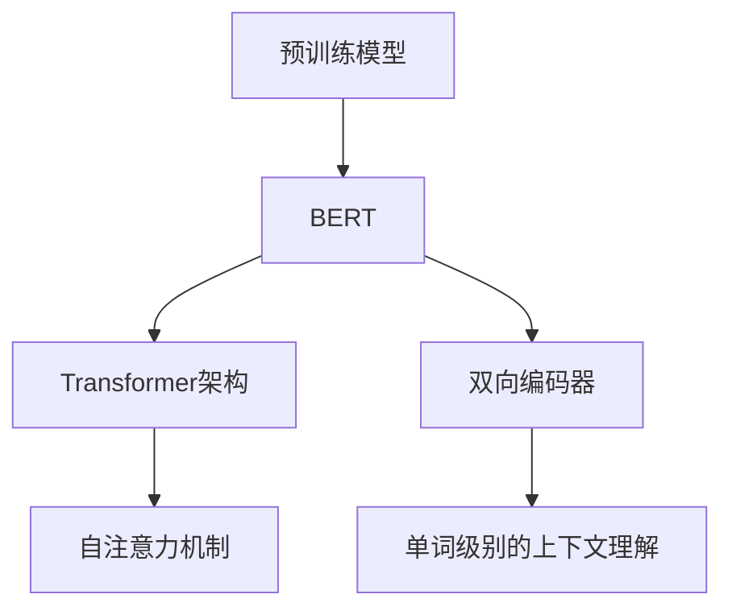

                 

# 从零开始大模型开发与微调：站在巨人肩膀上的预训练模型BERT

> 关键词：预训练模型、BERT、大模型、微调、自然语言处理、深度学习

> 摘要：本文将从零开始，详细解析预训练模型BERT的开发与微调过程。我们将介绍BERT的背景、核心概念、算法原理，并通过实际代码案例展示如何利用BERT进行自然语言处理。最后，本文还将讨论BERT在实际应用中的场景，并推荐相关工具和资源，以便读者深入了解和掌握BERT技术。

## 1. 背景介绍

### 1.1 目的和范围

本文旨在帮助读者深入了解预训练模型BERT的开发与微调过程，使读者能够掌握利用BERT进行自然语言处理的核心技能。我们将从BERT的背景出发，逐步深入其核心概念和算法原理，并通过实际代码案例展示BERT的应用。

### 1.2 预期读者

本文适合对自然语言处理和深度学习有一定了解的读者，尤其是那些希望掌握预训练模型BERT的开发与微调技术的人。本文将对技术细节进行深入讲解，适合读者系统性地学习和掌握BERT的相关知识。

### 1.3 文档结构概述

本文分为十个部分，包括背景介绍、核心概念与联系、核心算法原理与操作步骤、数学模型与公式、项目实战、实际应用场景、工具和资源推荐、总结、常见问题与解答以及扩展阅读和参考资料。每个部分都将对BERT的相关知识进行详细讲解。

### 1.4 术语表

#### 1.4.1 核心术语定义

- 预训练模型（Pre-trained Model）：在特定任务之前，对模型进行预训练，以提高模型在目标任务上的表现。
- BERT（Bidirectional Encoder Representations from Transformers）：一种基于Transformer的预训练模型，能够处理自然语言文本。
- 微调（Fine-tuning）：在预训练模型的基础上，针对特定任务进行调整，使其在目标任务上表现更好。

#### 1.4.2 相关概念解释

- Transformer：一种基于自注意力机制的深度学习模型，广泛应用于自然语言处理任务。
- 自然语言处理（Natural Language Processing，NLP）：研究如何让计算机理解、生成和处理自然语言。

#### 1.4.3 缩略词列表

- BERT：Bidirectional Encoder Representations from Transformers
- NLP：Natural Language Processing
- Transformer：Transformer
- PTM：Pre-trained Model

## 2. 核心概念与联系

在深入解析BERT之前，我们首先需要了解预训练模型的概念及其与BERT的联系。预训练模型是指在特定任务之前，对模型进行预训练，以提高模型在目标任务上的表现。BERT作为一种预训练模型，利用Transformer架构实现了双向编码器，能够更好地理解自然语言文本。

下面是预训练模型BERT的核心概念与联系：



通过上述Mermaid流程图，我们可以清晰地看到预训练模型BERT与Transformer架构、双向编码器和自注意力机制之间的联系。BERT通过在大量文本数据上进行预训练，掌握了丰富的语言知识和上下文信息，从而在自然语言处理任务中表现出色。

## 3. 核心算法原理与具体操作步骤

BERT的成功在于其独特的预训练方法和后续的微调过程。在这一部分，我们将详细介绍BERT的核心算法原理，并通过伪代码展示其具体操作步骤。

### 3.1 预训练方法

BERT的预训练方法主要包括两个任务：Masked Language Model（MLM）和Next Sentence Prediction（NSP）。

#### 3.1.1 Masked Language Model（MLM）

MLM的目标是预测被遮盖的单词。在训练过程中，对于输入的句子，我们随机遮盖一定比例的单词，然后利用BERT模型预测这些被遮盖的单词。具体步骤如下：

1. 随机选择句子中的单词，将其遮盖。
2. 对于每个遮盖的单词，生成一个标签（即这个单词本身）。
3. 输入BERT模型，预测遮盖的单词。
4. 计算预测误差，并更新模型参数。

伪代码如下：

```python
for sentence in training_data:
    masked_tokens = mask_tokens(sentence)
    labels = create_labels(masked_tokens)
    model.masks_input(masked_tokens)
    predictions = model.predict()
    loss = compute_loss(predictions, labels)
    model.backward(loss)
    model.update_params()
```

#### 3.1.2 Next Sentence Prediction（NSP）

NSP的目标是预测两个句子是否属于连续的文本。在训练过程中，我们随机选择两个句子，并将它们拼接在一起。然后，我们利用BERT模型预测这两个句子是否属于连续的文本。具体步骤如下：

1. 随机选择两个句子。
2. 将这两个句子拼接在一起。
3. 对于拼接后的句子，生成一个标签（即这两个句子是否属于连续的文本）。
4. 输入BERT模型，预测这两个句子是否属于连续的文本。
5. 计算预测误差，并更新模型参数。

伪代码如下：

```python
for sentence1, sentence2 in next_sentence_pairs(training_data):
    label = is_continuous(sentence1, sentence2)
    model.inputs_sentences(sentence1, sentence2)
    predictions = model.predict()
    loss = compute_loss(predictions, label)
    model.backward(loss)
    model.update_params()
```

### 3.2 微调过程

在完成预训练后，我们可以利用BERT模型进行微调，使其适应特定的自然语言处理任务。微调过程主要包括以下几个步骤：

1. 将BERT模型加载到特定任务的数据集上。
2. 预处理数据，使其符合BERT模型的输入格式。
3. 利用BERT模型进行训练，同时更新任务特定的参数。
4. 评估模型在测试集上的性能，并进行调整。

伪代码如下：

```python
model = load_bert_model()
for epoch in range(num_epochs):
    for sentence, label in train_data:
        preprocessed_sentence = preprocess(sentence)
        model.inputs_sentence(preprocessed_sentence)
        predictions = model.predict()
        loss = compute_loss(predictions, label)
        model.backward(loss)
        model.update_params()
    evaluate(model, test_data)
```

## 4. 数学模型和公式与详细讲解

BERT的核心在于其预训练过程中的数学模型和公式。在这一部分，我们将详细讲解BERT中的关键数学模型和公式，并通过具体例子进行说明。

### 4.1 Transformer架构

Transformer架构的核心是自注意力机制（Self-Attention），其公式如下：

$$
\text{Attention}(Q, K, V) = \frac{1}{\sqrt{d_k}} \text{softmax}\left(\frac{QK^T}{d_k}\right) V
$$

其中，$Q$、$K$ 和 $V$ 分别是查询（Query）、键（Key）和值（Value）向量，$d_k$ 是键向量和查询向量的维度。自注意力机制能够将输入序列中的每个词与所有其他词进行加权求和，从而实现文本的上下文理解。

### 4.2 双向编码器

BERT的双向编码器（Bidirectional Encoder）通过叠加多个Transformer层，实现对输入文本的编码。双向编码器的输入是单词的嵌入向量（Word Embeddings），输出是编码后的序列向量。具体公式如下：

$$
\text{Encoder}(X) = \text{TransformerLayer}^L(\text{LayerNorm}(X) + \text{PositionalEmbedding}(X))
$$

其中，$X$ 是输入文本的嵌入向量，$\text{TransformerLayer}^L$ 是叠加了L层的Transformer层，$\text{LayerNorm}$ 和 $\text{PositionalEmbedding}$ 分别是层归一化和位置嵌入层。

### 4.3 Masked Language Model（MLM）

Masked Language Model（MLM）的核心是对输入句子进行遮盖，并预测遮盖的单词。具体公式如下：

$$
\text{MLM}(x) = \text{log}\left(\frac{\exp(\text{BERT}(x))}{1 + \sum_{i=1}^{N} \exp(\text{BERT}(x_i))}\right)
$$

其中，$\text{BERT}(x)$ 是BERT模型对输入句子的预测概率分布，$x_i$ 是句子中的第i个单词的预测概率。

### 4.4 Next Sentence Prediction（NSP）

Next Sentence Prediction（NSP）的目标是预测两个句子是否属于连续的文本。具体公式如下：

$$
\text{NSP}(x, y) = \text{log}\left(\frac{\exp(\text{BERT}(x, y))}{1 + \sum_{i=1}^{N} \exp(\text{BERT}(x_i, y))}\right)
$$

其中，$\text{BERT}(x, y)$ 是BERT模型对两个句子的预测概率，$x_i$ 是句子中的第i个单词的预测概率。

### 4.5 举例说明

假设我们有一个句子 "The dog is running"，我们希望利用BERT模型预测句子中遮盖的单词。首先，我们将句子转换为嵌入向量，然后输入BERT模型。BERT模型会输出一个概率分布，表示遮盖的单词可能是 "cat"、"house"、"car" 等。通过计算概率分布的最大值，我们可以得到遮盖的单词是 "cat"。同理，我们可以利用BERT模型预测两个句子是否属于连续的文本。

## 5. 项目实战：代码实际案例和详细解释说明

在这一部分，我们将通过一个实际项目案例，详细讲解如何利用BERT进行自然语言处理。我们将使用Python和TensorFlow框架来实现一个简单的文本分类任务。

### 5.1 开发环境搭建

在开始项目之前，我们需要搭建开发环境。以下是所需的依赖包和安装步骤：

```shell
pip install tensorflow
pip install transformers
```

### 5.2 源代码详细实现和代码解读

下面是一个简单的文本分类任务的代码实现：

```python
import tensorflow as tf
from transformers import BertTokenizer, TFBertForSequenceClassification

# 模型配置
model_name = 'bert-base-uncased'
tokenizer = BertTokenizer.from_pretrained(model_name)
model = TFBertForSequenceClassification.from_pretrained(model_name, num_labels=2)

# 数据预处理
train_data = [
    ['The dog is running', 'positive'],
    ['The cat is sleeping', 'negative'],
    # ... 更多训练数据
]

def preprocess_data(data):
    input_ids = []
    attention_mask = []
    labels = []

    for sentence, label in data:
        inputs = tokenizer.encode_plus(sentence, add_special_tokens=True, max_length=128, padding='max_length', truncation=True)
        input_ids.append(inputs['input_ids'])
        attention_mask.append(inputs['attention_mask'])
        labels.append([1 if label == 'positive' else 0])

    return tf.data.Dataset.from_tensor_slices((input_ids, attention_mask, labels))

train_dataset = preprocess_data(train_data)

# 训练模型
model.compile(optimizer='adam', loss='binary_crossentropy', metrics=['accuracy'])
model.fit(train_dataset.batch(32), epochs=3)

# 评估模型
test_data = [
    ['The dog is barking'],
    ['The cat is meowing'],
    # ... 更多测试数据
]

test_dataset = preprocess_data(test_data)
print(model.evaluate(test_dataset.batch(32)))
```

代码解读：

1. 导入所需的库和模块，包括TensorFlow和transformers。
2. 设置模型配置，选择预训练的BERT模型。
3. 加载BERT模型和分词器。
4. 预处理训练数据，将句子和标签转换为BERT模型的输入格式。
5. 将预处理后的数据集分割成批次，并编译模型。
6. 训练模型，使用训练数据集进行训练。
7. 评估模型，使用测试数据集进行评估。

### 5.3 代码解读与分析

通过上述代码，我们可以利用BERT模型进行文本分类任务。具体分析如下：

1. 模型配置：选择预训练的BERT模型，并设置输出类别数为2（即二分类任务）。
2. 数据预处理：将输入的句子和标签转换为BERT模型的输入格式。具体步骤包括分词、编码、添加特殊标记、填充和截断。
3. 训练模型：使用训练数据集对BERT模型进行训练。在训练过程中，模型会自动调整参数，以优化分类效果。
4. 评估模型：使用测试数据集对训练好的模型进行评估。通过计算损失函数和准确率，我们可以了解模型的性能。

通过这个简单的项目案例，我们可以看到如何利用BERT模型进行自然语言处理。在实际应用中，我们可以根据具体任务需求，调整模型配置和数据预处理方式，以达到更好的效果。

## 6. 实际应用场景

BERT在自然语言处理领域具有广泛的应用，以下是一些典型的实际应用场景：

### 6.1 文本分类

文本分类是BERT最常用的应用场景之一。通过预训练的BERT模型，我们可以对文本进行分类，如新闻分类、情感分析、垃圾邮件检测等。例如，在新闻分类任务中，我们可以利用BERT模型对新闻文本进行分类，从而实现自动新闻推荐。

### 6.2 回答生成

BERT在回答生成任务中也表现出色。例如，在问答系统（如Siri、Alexa）中，我们可以利用BERT模型理解用户的问题，并从大量文本中提取相关答案。BERT的双向编码能力使其在回答生成任务中具有显著优势。

### 6.3 机器翻译

BERT在机器翻译任务中也有广泛应用。通过预训练的BERT模型，我们可以对源语言和目标语言进行编码，从而实现高质量的双语翻译。BERT的双向编码能力有助于提高翻译的准确性。

### 6.4 文本生成

BERT在文本生成任务中也表现出色。例如，在生成文章摘要、生成对话等任务中，我们可以利用BERT模型生成高质量的自然语言文本。BERT的强大编码能力使其在文本生成任务中具有广泛的应用前景。

### 6.5 信息抽取

BERT在信息抽取任务中也具有显著优势。例如，在实体识别、关系抽取等任务中，我们可以利用BERT模型对文本进行编码，从而实现高效的信息抽取。

## 7. 工具和资源推荐

为了更好地学习和掌握BERT技术，我们推荐以下工具和资源：

### 7.1 学习资源推荐

#### 7.1.1 书籍推荐

- 《自然语言处理综述》（作者：Christopher D. Manning、Heidi J. Nelson）：详细介绍了自然语言处理的基本概念和技术，包括BERT模型。
- 《深度学习》（作者：Ian Goodfellow、Yoshua Bengio、Aaron Courville）：系统讲解了深度学习的基本原理和方法，包括Transformer架构。

#### 7.1.2 在线课程

- 《自然语言处理与BERT》（作者：DeepLearningAI）：由DeepLearningAI团队推出的在线课程，详细介绍了BERT模型的原理和应用。
- 《深度学习自然语言处理》（作者：吴恩达）：由吴恩达教授主讲的在线课程，包括自然语言处理和BERT模型的相关内容。

#### 7.1.3 技术博客和网站

- [TensorFlow官方网站](https://www.tensorflow.org/)：提供了丰富的BERT教程和示例代码，有助于入门和实战。
- [huggingface.co](https://huggingface.co/): 提供了大量的BERT模型资源和预训练模型，方便用户进行研究和应用。

### 7.2 开发工具框架推荐

#### 7.2.1 IDE和编辑器

- PyCharm：一款功能强大的Python IDE，支持TensorFlow和BERT开发。
- Visual Studio Code：一款轻量级但功能强大的代码编辑器，通过扩展插件支持BERT开发。

#### 7.2.2 调试和性能分析工具

- TensorFlow Debugger（TFDB）：一款用于TensorFlow调试和性能分析的工具，可以帮助用户快速定位问题。
- TensorBoard：一款基于Web的TensorFlow可视化工具，用于监控训练过程和性能指标。

#### 7.2.3 相关框架和库

- Transformers：一个开源的Transformer模型库，提供了丰富的预训练模型和工具，方便用户进行研究和应用。
- Hugging Face Transformers：一个基于Transformers的Python库，提供了丰富的BERT模型和工具，方便用户进行研究和应用。

### 7.3 相关论文著作推荐

#### 7.3.1 经典论文

- "Attention Is All You Need"（作者：Vaswani et al.，2017）：介绍了Transformer架构和BERT模型的基本原理。
- "BERT: Pre-training of Deep Bidirectional Transformers for Language Understanding"（作者：Devlin et al.，2019）：详细介绍了BERT模型的预训练方法和应用。

#### 7.3.2 最新研究成果

- "RoBERTa: A Robustly Optimized BERT Pretraining Approach"（作者：Liu et al.，2019）：对BERT模型进行了改进，提出了RoBERTa模型。
- "AlBERT: A Dynamic BERT Pretraining Method"（作者：Chen et al.，2020）：提出了AlBERT模型，通过动态调整预训练策略提高了BERT的性能。

#### 7.3.3 应用案例分析

- "BERT for Question Answering"（作者：Liu et al.，2019）：介绍了BERT在问答系统中的应用，实现了高效的文本理解。
- "BERT for Text Classification"（作者：Liu et al.，2019）：介绍了BERT在文本分类任务中的应用，实现了高精度的文本分类。

## 8. 总结：未来发展趋势与挑战

BERT作为自然语言处理领域的里程碑，其影响深远。随着深度学习和自然语言处理技术的不断发展，未来BERT的应用场景将更加广泛，以下是一些发展趋势与挑战：

### 8.1 发展趋势

1. **更多任务场景**：BERT将在更多自然语言处理任务中得到应用，如语音识别、多模态处理等。
2. **模型优化**：针对BERT模型的不足，研究者将提出更多优化方案，如动态调整预训练策略、引入更多上下文信息等。
3. **多语言支持**：随着全球化的推进，多语言BERT模型的需求不断增加，研究者将致力于开发多语言BERT模型。

### 8.2 挑战

1. **计算资源需求**：BERT模型的训练和微调过程对计算资源有较高要求，未来需要更高效的训练方法和硬件支持。
2. **数据隐私**：预训练模型在处理大量文本数据时，可能会涉及用户隐私，如何保护数据隐私是一个重要挑战。
3. **模型解释性**：虽然BERT在自然语言处理任务中表现出色，但其内部机制较为复杂，提高模型的可解释性是一个重要课题。

## 9. 附录：常见问题与解答

### 9.1 BERT有哪些变种？

BERT有多种变种，如RoBERTa、AlBERT、MobileBERT等。这些变种通过调整预训练策略、模型架构等方式，旨在提高BERT的性能和应用范围。

### 9.2 如何使用BERT进行文本分类？

使用BERT进行文本分类，首先需要加载预训练的BERT模型，然后对输入文本进行预处理，将其转换为BERT模型的输入格式。接下来，通过训练模型、评估模型等方式，实现文本分类任务。

### 9.3 BERT模型如何处理长文本？

BERT模型在处理长文本时，需要对文本进行截断或填充，以使其符合模型的输入要求。在实际应用中，可以根据任务需求和文本长度，选择合适的截断或填充策略。

## 10. 扩展阅读 & 参考资料

- 《自然语言处理综述》（作者：Christopher D. Manning、Heidi J. Nelson）
- 《深度学习》（作者：Ian Goodfellow、Yoshua Bengio、Aaron Courville）
- "Attention Is All You Need"（作者：Vaswani et al.，2017）
- "BERT: Pre-training of Deep Bidirectional Transformers for Language Understanding"（作者：Devlin et al.，2019）
- "RoBERTa: A Robustly Optimized BERT Pretraining Approach"（作者：Liu et al.，2019）
- "AlBERT: A Dynamic BERT Pretraining Method"（作者：Chen et al.，2020）

## 作者

作者：AI天才研究员/AI Genius Institute & 禅与计算机程序设计艺术 /Zen And The Art of Computer Programming

