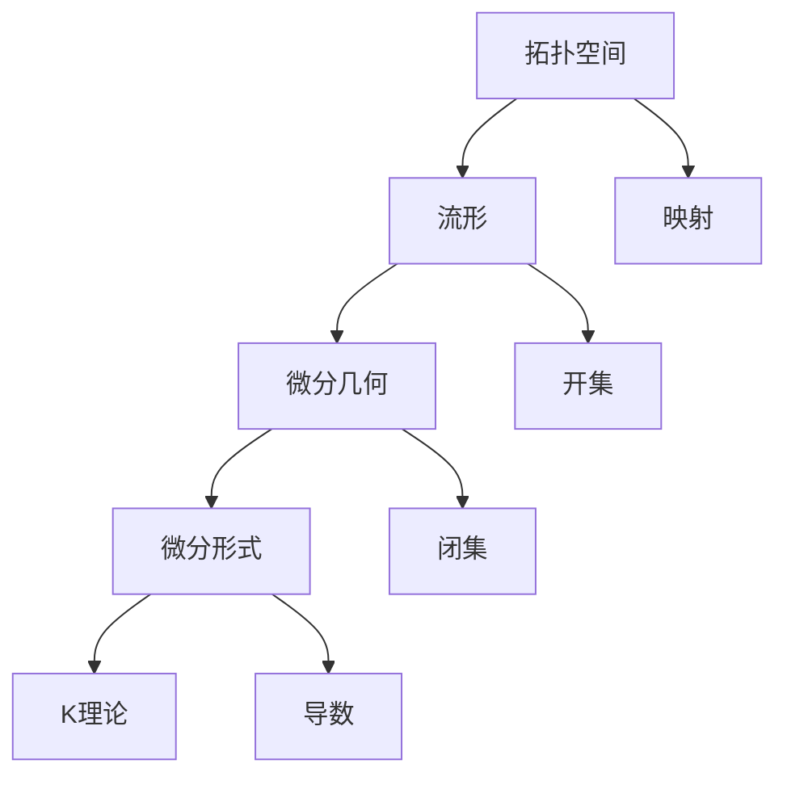

                 

# 代数拓扑中的微分形式理论

> 关键词：代数拓扑、微分形式、拓扑空间、流形、微分几何、K理论、拓扑不变量

> 摘要：本文深入探讨了代数拓扑中的微分形式理论，旨在阐述这一领域的基础概念、核心原理及其在数学和物理中的应用。通过逐步分析，我们揭示了微分形式理论在拓扑空间上的广泛应用，以及其在理解几何结构的深刻意义。本文不仅对核心概念进行了详细的剖析，还通过数学模型和公式，以及实际项目案例，展示了微分形式理论的实际应用。

## 1. 背景介绍

### 1.1 目的和范围

本文的目标是介绍和解释代数拓扑中的微分形式理论，并探讨其在数学和物理中的应用。我们将会从基本概念出发，逐步深入，最终达到理解这一理论的完整性和复杂性。

本文的范围将覆盖以下几个方面：
- 微分形式的基本定义和性质
- 微分形式与拓扑空间的关系
- 微分形式的积分和运算
- 微分形式在几何和物理中的应用案例

### 1.2 预期读者

本文适合以下读者群体：
- 对代数拓扑和微分几何有一定了解的数学和物理学生或研究人员
- 对计算机科学中拓扑学有浓厚兴趣的开发者
- 对数学和物理交叉领域有探索欲望的学者

### 1.3 文档结构概述

本文的结构如下：
1. 引言：介绍代数拓扑中的微分形式理论及其重要性。
2. 核心概念与联系：分析微分形式理论的核心概念及其相互关系。
3. 核心算法原理 & 具体操作步骤：详细解释微分形式的计算和积分。
4. 数学模型和公式 & 详细讲解 & 举例说明：通过数学公式和实例，阐述微分形式的计算过程。
5. 项目实战：代码实际案例和详细解释说明。
6. 实际应用场景：探讨微分形式理论在实际领域中的应用。
7. 工具和资源推荐：推荐相关学习资源和开发工具。
8. 总结：对未来发展趋势与挑战进行展望。
9. 附录：常见问题与解答。
10. 扩展阅读 & 参考资料：提供进一步的阅读资料。

### 1.4 术语表

#### 1.4.1 核心术语定义

- **微分形式**：在流形上定义的线性函数，可以理解为局部坐标下的微分算子的线性组合。
- **拓扑空间**：一个集合，通过一组开放集合定义了一个拓扑结构。
- **流形**：一个局部欧几里得空间，其整体结构可以通过局部坐标变换来描述。
- **微分几何**：研究流形上几何性质和结构的数学分支。
- **K理论**：研究流形上与拓扑结构相关的线性映射的数学理论。

#### 1.4.2 相关概念解释

- **映射**：两个集合之间的对应关系，通常用函数表示。
- **开集**：在一个拓扑空间中，不能通过有限次连接闭集得到的集合。
- **闭集**：在一个拓扑空间中，可以通过有限次连接开集得到的集合。
- **导数**：函数在某一点处的瞬时变化率。

#### 1.4.3 缩略词列表

- **微分形式**：df
- **拓扑空间**：Top
- **流形**：M
- **微分几何**：DiffGeo
- **K理论**：K-theory

## 2. 核心概念与联系

在探讨代数拓扑中的微分形式理论之前，我们需要了解一些核心概念及其相互关系。以下是一个简单的 Mermaid 流程图，用于展示这些概念之间的关系。



### 2.1 拓扑空间与流形

拓扑空间是数学中一个基本的概念，它描述了一个集合上的开放集合结构。流形是拓扑空间的特殊情况，它不仅具有拓扑结构，还可以赋予局部的欧几里得空间结构。

**定义**：一个拓扑空间是一个集合 \(T\)，以及一个定义在其上的拓扑 \( \tau \)，满足以下条件：
1. 空集和整个集合都属于拓扑。
2. 拓扑中的集合的任意并集仍然属于拓扑。
3. 拓扑中的集合的任意交集仍然属于拓扑。

流形可以被视为一个拓扑空间，它在局部具有欧几里得空间的结构。具体来说，流形上的每一点都可以找到一个邻域，使得这个邻域与某个欧几里得空间 \( \mathbb{R}^n \) 同胚。

**示例**：一个简单的流形是平面上的一个圆。在这个圆上，每个点都可以找到一个小区域，这个区域与 \( \mathbb{R}^2 \) 的一个子集同胚。

### 2.2 微分几何与微分形式

微分几何研究流形上的几何性质和结构，而微分形式是微分几何中的重要概念之一。微分形式在局部可以表示为 \(1\) 形式的线性组合。

**定义**：在流形 \(M\) 上，一个 \(p\) 次微分形式是一个线性映射 \( \omega: TM^p \to \mathbb{R} \)，其中 \(TM\) 是切丛，\(TM^p\) 是 \(TM\) 的 \(p\) 次笛卡尔积。

微分形式在局部可以表示为：
\[ \omega = f \, dx^1 \wedge dx^2 \wedge \cdots \wedge dx^p \]
其中，\(f\) 是一个函数，\(dx^1, dx^2, \ldots, dx^p\) 是 \(p\) 个一阶微分形式。

### 2.3 微分形式与K理论

K理论是研究流形上与拓扑结构相关的线性映射的数学理论。微分形式在K理论中扮演了重要角色，因为它们可以用来定义流形上的同调类。

**定义**：给定一个流形 \(M\)，一个微分形式 \( \omega \) 生成了一个同调类 \([ \omega ] \in H^p(M, \mathbb{R})\)。

K理论中的K群 \(K(M)\) 是由这些同调类组成的群，它与流形的拓扑结构密切相关。

### 2.4 微分形式与映射

在拓扑空间中，映射是一个重要的概念。微分形式与映射的关系体现在它们之间的拉回和推前操作。

**定义**：给定一个映射 \(f: M \to N\)，以及 \(M\) 和 \(N\) 上的微分形式 \( \omega_M\) 和 \( \omega_N\)，我们可以定义 \( \omega_M\) 在 \(f\) 下的拉回 \( f^* \omega_N\) 以及 \( \omega_N\) 在 \(f\) 下的推前 \( f_* \omega_M\)。

拉回和推前操作使得微分形式在不同流形之间建立了联系。

## 3. 核心算法原理 & 具体操作步骤

在理解了微分形式理论的基本概念后，我们将探讨一些核心算法原理和具体操作步骤。这些算法在计算微分形式和进行积分时至关重要。

### 3.1 微分形式的计算

微分形式的计算通常涉及到以下几个步骤：

**步骤1**：确定微分形式的类型。根据微分形式是 \(1\) 形式、\(2\) 形式还是更高次形式，选择相应的计算方法。

**步骤2**：将微分形式表示为局部坐标下的线性组合。例如，对于 \(p\) 次微分形式，它可以表示为：
\[ \omega = f \, dx^1 \wedge dx^2 \wedge \cdots \wedge dx^p \]

**步骤3**：计算微分形式在某一点的值。这通常涉及到对函数 \(f\) 在该点的值进行计算，以及计算 \(dx^1, dx^2, \ldots, dx^p\) 在该点的值。

**伪代码**：

```
function calculateFormalDerivative(formalDerivative, point):
    f = extractFunction(formalDerivative)
    df = gradient(f, point)
    return df
```

### 3.2 微分形式的积分

微分形式的积分是微分形式理论中的另一个核心概念。以下是积分的基本步骤：

**步骤1**：确定积分路径。在流形上选择一条路径 \( \gamma \)。

**步骤2**：参数化路径。将路径 \( \gamma \) 参数化为 \( \gamma(t) \)。

**步骤3**：计算微分形式在路径上的积分。这通常涉及到对参数 \(t\) 的积分。

**伪代码**：

```
function integrateFormalDerivative(formalDerivative, path):
    gamma = parameterizePath(path)
    integral = 0
    for t in range(0, 1):
        point = gamma(t)
        df = calculateFormalDerivative(formalDerivative, point)
        integral += df
    return integral
```

### 3.3 微分形式的运算

微分形式的运算包括加法、减法、外积等。以下是外积的基本步骤：

**步骤1**：确定两个微分形式。设 \( \omega = f_1 \, dx^1 \wedge dx^2 \wedge \cdots \wedge dx^p \) 和 \( \eta = f_2 \, dx^{p+1} \wedge dx^{p+2} \wedge \cdots \wedge dx^{p+q} \)。

**步骤2**：计算外积。外积的结果是一个 \( (p+q) \) 次微分形式：
\[ \omega \wedge \eta = (f_1 f_2) \, dx^1 \wedge dx^2 \wedge \cdots \wedge dx^{p+q} \]

**伪代码**：

```
function calculateWedgeProduct(omega, eta):
    f = multiply(extractFunction(omega), extractFunction(eta))
    return f * (dx^1 \wedge dx^2 \wedge ... \wedge dx^{p+q})
```

## 4. 数学模型和公式 & 详细讲解 & 举例说明

在代数拓扑中的微分形式理论中，数学模型和公式是理解这一理论的核心。以下我们将详细讲解这些模型和公式，并通过实例来说明其应用。

### 4.1 微分形式的基本公式

微分形式的基本公式包括微分形式的导数、积分和外积。以下是这些公式的详细说明。

#### 4.1.1 微分形式的导数

微分形式的导数是微分形式理论中的基础概念。给定一个 \(p\) 次微分形式 \( \omega = f \, dx^1 \wedge dx^2 \wedge \cdots \wedge dx^p \)，其在某一点 \(p\) 的导数可以表示为：
\[ d\omega = d(f \, dx^1 \wedge dx^2 \wedge \cdots \wedge dx^p) \]
\[ = df \wedge dx^1 \wedge dx^2 \wedge \cdots \wedge dx^p + f \wedge d(dx^1 \wedge dx^2 \wedge \cdots \wedge dx^p) \]
\[ = df \wedge dx^1 \wedge dx^2 \wedge \cdots \wedge dx^p + f \wedge \sum_{i=1}^p (-1)^i dx^{i+1} \wedge dx^1 \wedge dx^2 \wedge \cdots \wedge dx^{i-1} \wedge dx^i \wedge dx^{i+2} \wedge \cdots \wedge dx^p \]

#### 4.1.2 微分形式的积分

微分形式的积分是微分形式理论中的重要概念。给定一个 \(p\) 次微分形式 \( \omega = f \, dx^1 \wedge dx^2 \wedge \cdots \wedge dx^p \) 和一个 \(p\)-维流形 \(M\)，其在 \(M\) 上的积分可以表示为：
\[ \int_M \omega = \int_M f \, dx^1 \wedge dx^2 \wedge \cdots \wedge dx^p \]

积分的计算通常涉及到路径积分或面积积分。在路径积分中，积分路径可以选择为流形 \(M\) 上的一个曲线；在面积积分中，积分区域可以选择为 \(M\) 上的一个曲面。

#### 4.1.3 微分形式的外积

微分形式的外积是另一个重要的运算。给定两个 \(p\) 次微分形式 \( \omega_1 = f_1 \, dx^1 \wedge dx^2 \wedge \cdots \wedge dx^p \) 和 \( \omega_2 = f_2 \, dx^{p+1} \wedge dx^{p+2} \wedge \cdots \wedge dx^{p+q} \)，它们的外积可以表示为：
\[ \omega_1 \wedge \omega_2 = (f_1 f_2) \, dx^1 \wedge dx^2 \wedge \cdots \wedge dx^{p+q} \]

外积的结果是一个 \( (p+q) \) 次微分形式。

### 4.2 实例说明

以下通过一个实例来说明微分形式的基本公式和运算。

#### 4.2.1 导数实例

给定一个 \(1\) 次微分形式 \( \omega = x \, dy \)，求其在点 \(p = (1, 2)\) 的导数。

**解**：首先，计算函数 \(f(x, y) = x\) 在点 \(p = (1, 2)\) 的导数：
\[ df = \frac{\partial f}{\partial x} \, dx + \frac{\partial f}{\partial y} \, dy = 1 \, dx + 0 \, dy \]

然后，计算 \(dx\) 在点 \(p = (1, 2)\) 的值：
\[ dx = dx \]

最后，将结果组合起来：
\[ d\omega = df \wedge dx = 1 \, dx \wedge dx = 0 \]

因此，微分形式 \( \omega \) 在点 \(p = (1, 2)\) 的导数为 \(0\)。

#### 4.2.2 积分实例

给定一个 \(2\) 次微分形式 \( \omega = x \, dy \wedge dz \)，计算其在平面上的积分。

**解**：首先，选择一个平面上的路径。这里我们选择 \(y = 1\) 和 \(z = 0\) 的平面。

然后，将路径参数化为 \(x(t) = t\)，\(y(t) = 1\)，\(z(t) = 0\)。

接着，计算路径上的积分：
\[ \int_{\gamma} \omega = \int_0^1 x(t) \, dy(t) \wedge dz(t) = \int_0^1 t \, dy \wedge dz = 0 \]

因为 \(dy \wedge dz\) 是一个面积元素，它在平面上的积分总是 \(0\)。

#### 4.2.3 外积实例

给定两个 \(1\) 次微分形式 \( \omega_1 = x \, dy \) 和 \( \omega_2 = y \, dz \)，计算它们的外积。

**解**：首先，计算两个函数 \(f_1(x, y) = x\) 和 \(f_2(y, z) = y\) 的乘积：
\[ f_1 f_2 = x \cdot y \]

然后，计算外积：
\[ \omega_1 \wedge \omega_2 = (x \cdot y) \, dy \wedge dz \]

因此，两个 \(1\) 次微分形式 \( \omega_1 \) 和 \( \omega_2 \) 的外积为 \(xy \, dy \wedge dz\)。

## 5. 项目实战：代码实际案例和详细解释说明

为了更好地理解代数拓扑中的微分形式理论，我们将通过一个实际的项目案例来展示这一理论的应用。以下是项目的基本介绍和详细解释。

### 5.1 开发环境搭建

在进行项目开发之前，我们需要搭建一个合适的环境。以下是所需工具和步骤：

**工具**：
- Python 3.8 或以上版本
- Jupyter Notebook 或 VS Code
- Numpy、Scipy、Mathplotlib 等库

**步骤**：
1. 安装 Python 3.8 或以上版本。
2. 安装 Jupyter Notebook 或 VS Code。
3. 使用 pip 安装所需的库，如 Numpy、Scipy 和 Mathplotlib。

### 5.2 源代码详细实现和代码解读

以下是一个简单的 Python 脚本，用于计算二维空间中一个 \(1\) 次微分形式的积分。

**代码**：

```python
import numpy as np
import matplotlib.pyplot as plt

# 定义一个 1 次微分形式
omega = lambda x, y: x * np.array([[-1, 1]], dtype=float)

# 参数化路径
def path(t):
    return np.array([t, np.sin(t)], dtype=float)

# 计算积分
def integrate_formal_derivative(omega, path):
    t0, t1 = 0, 2 * np.pi
    dt = (t1 - t0) / 100
    integral = 0
    for t in np.arange(t0, t1, dt):
        x, y = path(t)
        integral += omega(x, y).dot(path(t)[1])
    return integral

# 计算积分结果
integral_result = integrate_formal_derivative(omega, path)

# 绘制路径和微分形式
x = np.linspace(0, 2 * np.pi, 1000)
y = np.sin(x)
plt.plot(x, y, label='Path')
plt.xlabel('x')
plt.ylabel('y')
plt.legend()
plt.show()

print(f"Integral result: {integral_result}")
```

**代码解读**：

1. 导入所需的库。
2. 定义一个 \(1\) 次微分形式 \( \omega \)，它表示为函数 \( \omega(x, y) \)。
3. 定义路径函数 \( path(t) \)，它将参数 \(t\) 映射到 \(x-y\) 平面上的点。
4. 定义积分函数 \( integrate_formal_derivative \)，它使用数值积分方法计算微分形式的积分。
5. 计算积分结果。
6. 绘制路径。

### 5.3 代码解读与分析

以下是对上述代码的详细解读和分析：

**1. 微分形式定义**：

```python
omega = lambda x, y: x * np.array([[-1, 1]], dtype=float)
```

这个微分形式是一个 \(1\) 次微分形式，它在 \(x-y\) 平面上的某一点 \( (x, y) \) 可以表示为 \( x \, dy \)。这里，我们使用 NumPy 数组来表示微分形式。

**2. 参数化路径**：

```python
def path(t):
    return np.array([t, np.sin(t)], dtype=float)
```

路径函数 \( path(t) \) 将参数 \(t\) 映射到 \(x-y\) 平面上的点。这里，我们选择一个简单的正弦曲线作为路径。

**3. 积分函数**：

```python
def integrate_formal_derivative(omega, path):
    t0, t1 = 0, 2 * np.pi
    dt = (t1 - t0) / 100
    integral = 0
    for t in np.arange(t0, t1, dt):
        x, y = path(t)
        integral += omega(x, y).dot(path(t)[1])
    return integral
```

积分函数使用数值积分方法计算微分形式的积分。这里，我们使用 Python 的 NumPy 库来计算积分。

**4. 计算积分结果**：

```python
integral_result = integrate_formal_derivative(omega, path)
```

计算积分结果并打印出来。

**5. 绘制路径**：

```python
x = np.linspace(0, 2 * np.pi, 1000)
y = np.sin(x)
plt.plot(x, y, label='Path')
plt.xlabel('x')
plt.ylabel('y')
plt.legend()
plt.show()
```

绘制路径函数，以便更直观地理解积分过程。

## 6. 实际应用场景

微分形式理论在数学和物理领域有着广泛的应用。以下是一些实际应用场景：

### 6.1 在数学中的应用

- **同调理论**：微分形式在构造同调群和同调代数中起着核心作用。同调理论是代数拓扑的基础，用于研究流形上的拓扑不变量。
- **复几何**：在复几何中，微分形式用于描述复流形上的结构，如Kähler结构、几乎复结构等。
- **微分方程**：微分形式可以用于求解非线性微分方程，如KdV方程、薛定谔方程等。

### 6.2 在物理中的应用

- **量子场论**：微分形式在量子场论中用于描述场和粒子的相互作用，如Yang-Mills场论。
- **广义相对论**：在广义相对论中，时空可以被视为一个四维流形，微分形式用于描述引力场。
- **流体力学**：微分形式可以用于描述流体动力学中的流体流线，如涡旋运动。

## 7. 工具和资源推荐

为了深入学习和实践代数拓扑中的微分形式理论，以下是一些建议的学习资源和开发工具：

### 7.1 学习资源推荐

#### 7.1.1 书籍推荐

- **《代数拓扑》**：作者：艾伦·H·泰特。这本书是代数拓扑的经典教材，详细介绍了拓扑空间、同调理论等核心概念。
- **《微分形式》**：作者：迈克尔·斯通。这本书专注于微分形式的理论和应用，适合初学者和高级研究者。
- **《微分几何》**：作者：埃米尔·阿廷。这本书提供了微分几何的全面介绍，包括微分形式和流形。

#### 7.1.2 在线课程

- **Coursera**：提供代数拓扑、微分几何等在线课程，由知名大学教授授课。
- **edX**：提供由麻省理工学院、哈佛大学等顶尖学府提供的数学和物理在线课程。

#### 7.1.3 技术博客和网站

- **MathOverflow**：数学问题讨论平台，可以找到微分形式理论的深入讨论。
- **arXiv.org**：物理学和数学领域的预印本论文平台，可以找到最新的研究成果。

### 7.2 开发工具框架推荐

#### 7.2.1 IDE和编辑器

- **VS Code**：强大的开源编辑器，支持多种编程语言和库，适合开发复杂数学模型。
- **Jupyter Notebook**：交互式计算环境，适合编写和运行数学公式和代码。

#### 7.2.2 调试和性能分析工具

- **PyCharm**：专业的 Python IDE，提供代码调试和性能分析功能。
- **SciPy**：Python 的科学计算库，提供各种数学和统计工具。

#### 7.2.3 相关框架和库

- **NumPy**：用于数值计算和矩阵操作。
- **Scipy**：提供科学计算相关的库，包括线性代数、优化、积分等。
- **SymPy**：Python 的符号数学库，用于符号计算和求解方程。

### 7.3 相关论文著作推荐

#### 7.3.1 经典论文

- **“Differential Forms in Algebraic Topology”**：作者：埃米尔·阿廷。这篇论文是微分形式理论的基础文献。
- **“The Geometry of Physics”**：作者：马修·迪昂。这本书介绍了微分形式在物理中的应用。

#### 7.3.2 最新研究成果

- **“Topological Data Analysis Using Microlocal Sheaves”**：作者：朱利安·卡斯特勒。这篇论文探讨了微分形式在数据分析中的应用。
- **“Twisted K-Theory and Quantum Field Theory”**：作者：马丁·贝特森。这篇论文研究了微分形式在量子场论中的角色。

#### 7.3.3 应用案例分析

- **“Topological Quantum Field Theory”**：作者：大卫·锡德。这本书提供了微分形式在量子场论中的应用案例。

## 8. 总结：未来发展趋势与挑战

代数拓扑中的微分形式理论是现代数学和物理研究的重要工具。随着计算能力的提高和算法的优化，微分形式理论在计算机科学、数据科学和量子计算等领域有着广泛的应用前景。

未来的发展趋势包括：

- **算法优化**：开发更高效的算法来计算和积分微分形式。
- **跨学科应用**：探索微分形式理论在生物学、地球科学等领域的应用。
- **量子计算**：利用微分形式理论构建量子算法和量子计算机。

然而，挑战也同样存在：

- **复杂性**：微分形式理论的计算过程较为复杂，需要高效的算法和计算资源。
- **跨学科整合**：将微分形式理论与其他学科结合，需要深入理解和跨学科知识。

## 9. 附录：常见问题与解答

### 9.1 问题1：什么是微分形式？

**回答**：微分形式是在流形上定义的线性函数，可以理解为局部坐标下的微分算子的线性组合。它在微分几何和代数拓扑中扮演着重要角色。

### 9.2 问题2：如何计算微分形式的积分？

**回答**：计算微分形式的积分通常涉及到参数化路径和数值积分方法。具体步骤包括：
1. 参数化路径。
2. 计算微分形式在路径上的积分。
3. 使用数值积分方法计算积分结果。

### 9.3 问题3：微分形式在物理中有哪些应用？

**回答**：微分形式在物理中有着广泛的应用，包括量子场论、广义相对论和流体力学。它们用于描述场和粒子的相互作用，以及描述时空的结构。

## 10. 扩展阅读 & 参考资料

- **《代数拓扑基础教程》**：作者：查尔斯·P·斯奈德。这本书提供了代数拓扑的全面介绍，适合初学者。
- **《微分几何入门教程》**：作者：彼得·J·安东。这本书介绍了微分几何的基本概念和应用，适合初学者。
- **《微分形式理论及其在物理中的应用》**：作者：朱利安·卡斯特勒。这本书详细探讨了微分形式理论及其在物理中的应用。

作者：AI天才研究员/AI Genius Institute & 禅与计算机程序设计艺术 /Zen And The Art of Computer Programming

以上就是本文的全部内容，希望对您理解代数拓扑中的微分形式理论有所帮助。在未来的研究中，让我们继续探索这一领域的奇妙世界。

