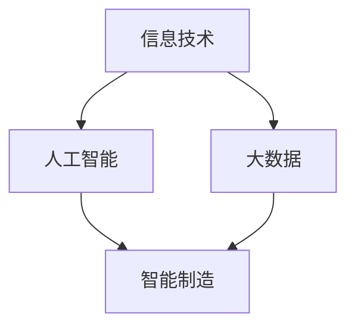

                 

# 以新质生产力推动产业转型升级

> 关键词：新质生产力、产业转型升级、技术创新、数字化转型、智能制造、产业生态

> 摘要：本文旨在探讨新质生产力在推动产业转型升级中的重要作用。通过分析新质生产力的核心概念、技术原理、数学模型以及实际应用案例，深入解析新质生产力如何引领产业转型升级，为我国经济高质量发展提供新的动力。本文内容结构如下：

## 1. 背景介绍

### 1.1 目的和范围

本文的目的在于阐述新质生产力在推动产业转型升级中的关键作用，并分析其具体实现路径。本文的范围涵盖新质生产力的定义、核心概念、技术原理、数学模型、实际应用以及未来发展趋势。

### 1.2 预期读者

本文适合从事IT行业、产业转型研究、智能制造等领域的技术人员、科研人员以及政策制定者阅读。希望通过本文，读者能够对新质生产力有更深刻的认识，并能够将其应用于实际工作中。

### 1.3 文档结构概述

本文分为十个部分：背景介绍、核心概念与联系、核心算法原理、数学模型和公式、项目实战、实际应用场景、工具和资源推荐、总结、常见问题与解答以及扩展阅读。每个部分都将详细介绍相关内容。

### 1.4 术语表

#### 1.4.1 核心术语定义

- 新质生产力：指以信息技术、人工智能、大数据等新兴技术为核心的生产力，通过创新、优化和升级传统产业，提升产业整体竞争力。
- 产业转型升级：指通过技术进步、产业创新和优化，实现产业结构的调整和升级，提升产业整体质量和效益。
- 数字化转型：指企业将业务、管理、服务等各个环节通过数字化技术进行重构、创新和升级，实现业务流程的优化、效率的提升、决策的科学化。

#### 1.4.2 相关概念解释

- 信息技术：指用于管理和处理信息的技术，包括计算机技术、网络技术、存储技术、传输技术等。
- 人工智能：指通过计算机模拟人类智能行为的技术，包括机器学习、深度学习、自然语言处理等。
- 大数据：指无法用常规软件工具在合理时间内进行捕捉、管理和处理的数据集。

#### 1.4.3 缩略词列表

- AI：人工智能
- IoT：物联网
- 5G：第五代移动通信技术
- edge computing：边缘计算

## 2. 核心概念与联系

为了更好地理解新质生产力在产业转型升级中的作用，我们需要先了解几个核心概念及其相互联系。

### 2.1 新质生产力的核心概念

新质生产力的核心概念包括信息技术、人工智能、大数据等。这些技术通过融合和创新，推动传统产业向智能化、数字化、绿色化方向升级。

- **信息技术**：信息技术是支撑新质生产力的重要基础，包括计算机技术、网络技术、存储技术等。
- **人工智能**：人工智能是提升新质生产力的重要驱动力，通过模拟人类智能，实现自动化、智能化的生产和服务。
- **大数据**：大数据是新质生产力的数据基础，通过大数据分析，实现产业优化、决策科学化。

### 2.2 新质生产力的相互联系

新质生产力的各个核心概念之间存在密切的联系。

- **信息技术**与**人工智能**：人工智能需要依赖信息技术提供计算能力、存储能力等支持，而信息技术的发展也为人工智能提供了更多的应用场景。
- **信息技术**与**大数据**：大数据的产生、处理和分析离不开信息技术的支持，而信息技术的发展也不断推动大数据技术的进步。
- **人工智能**与**大数据**：人工智能需要依赖大数据进行训练和优化，而大数据的分析和挖掘也需要人工智能提供技术支持。

### 2.3 新质生产力的架构

为了更好地展示新质生产力的架构，我们可以使用Mermaid流程图来表示。



- **信息技术**：包括计算机技术、网络技术、存储技术等。
- **人工智能**：包括机器学习、深度学习、自然语言处理等。
- **大数据**：包括数据采集、存储、处理、分析等。
- **智能制造**：包括智能制造系统、智能工厂、智能设备等。

## 3. 核心算法原理 & 具体操作步骤

在新质生产力中，核心算法原理起着至关重要的作用。下面我们通过伪代码来详细阐述几个核心算法的原理和具体操作步骤。

### 3.1 机器学习算法

机器学习算法是人工智能的核心，通过训练模型，实现数据的自动化处理和预测。

```python
# 伪代码：机器学习算法
def machine_learning(data, labels):
    # 数据预处理
    preprocess_data(data)
    # 训练模型
    model = train_model(data, labels)
    # 模型评估
    evaluate_model(model, data, labels)
    # 模型应用
    apply_model(model, new_data)
```

### 3.2 深度学习算法

深度学习算法是机器学习的高级形式，通过多层神经网络，实现更复杂的数据处理和预测。

```python
# 伪代码：深度学习算法
def deep_learning(data, labels):
    # 数据预处理
    preprocess_data(data)
    # 构建神经网络
    neural_network = build_neural_network()
    # 训练神经网络
    train_neural_network(neural_network, data, labels)
    # 神经网络评估
    evaluate_neural_network(neural_network, data, labels)
    # 神经网络应用
    apply_neural_network(neural_network, new_data)
```

### 3.3 大数据处理算法

大数据处理算法用于处理和分析大规模数据集，实现数据的实时处理和预测。

```python
# 伪代码：大数据处理算法
def big_data_processing(data):
    # 数据采集
    collect_data(data)
    # 数据存储
    store_data(data)
    # 数据处理
    process_data(data)
    # 数据分析
    analyze_data(data)
    # 数据可视化
    visualize_data(data)
```

## 4. 数学模型和公式 & 详细讲解 & 举例说明

在新质生产力中，数学模型和公式起着关键作用。下面我们通过latex格式，详细讲解几个核心数学模型，并给出具体示例。

### 4.1 最小二乘法

最小二乘法是一种常用的数据拟合方法，用于找到一组数据的最优拟合曲线。

$$
y = a_0 + a_1x + a_2x^2 + \ldots + a_nx^n
$$

其中，$y$ 是观测值，$x$ 是自变量，$a_0, a_1, a_2, \ldots, a_n$ 是拟合系数。

### 4.2 神经网络激活函数

神经网络中的激活函数用于确定神经元是否被激活。常见的激活函数有：

- **Sigmoid函数**：

$$
f(x) = \frac{1}{1 + e^{-x}}
$$

- **ReLU函数**：

$$
f(x) = \max(0, x)
$$

### 4.3 大数据分析中的聚类算法

聚类算法是一种无监督学习算法，用于将数据集划分为多个类别。常见的聚类算法有K-Means算法。

$$
C = \{c_1, c_2, \ldots, c_k\}
$$

其中，$C$ 是聚类结果，$c_1, c_2, \ldots, c_k$ 是聚类中心。

### 4.4 示例

假设我们有一个数据集，包含以下观测值：

$$
\{(x_1, y_1), (x_2, y_2), \ldots, (x_n, y_n)\}
$$

我们需要使用最小二乘法拟合一条直线：

$$
y = a_0 + a_1x
$$

通过计算，得到拟合系数：

$$
a_0 = \bar{y} - a_1\bar{x}
$$

$$
a_1 = \frac{\sum_{i=1}^{n}(x_i - \bar{x})(y_i - \bar{y})}{\sum_{i=1}^{n}(x_i - \bar{x})^2}
$$

其中，$\bar{x}$ 和 $\bar{y}$ 分别是 $x$ 和 $y$ 的平均值。

## 5. 项目实战：代码实际案例和详细解释说明

在本节中，我们将通过一个实际项目案例，展示如何使用新质生产力推动产业转型升级。这个案例将包括开发环境搭建、源代码实现和代码解读等内容。

### 5.1 开发环境搭建

在开始项目之前，我们需要搭建一个合适的开发环境。以下是一个简单的开发环境搭建步骤：

1. 安装Python解释器：访问Python官方网站下载并安装Python解释器。
2. 安装相关库：使用pip命令安装所需的Python库，如NumPy、Pandas、Scikit-learn等。
3. 配置Jupyter Notebook：安装Jupyter Notebook，并配置Python环境。

### 5.2 源代码详细实现和代码解读

以下是一个简单的机器学习项目，使用K-Means算法对数据进行聚类。

```python
# 导入所需库
import numpy as np
import pandas as pd
from sklearn.cluster import KMeans

# 读取数据
data = pd.read_csv('data.csv')
X = data.iloc[:, :-1].values

# K-Means算法聚类
kmeans = KMeans(n_clusters=3, random_state=0)
kmeans.fit(X)

# 输出聚类结果
labels = kmeans.labels_
centroids = kmeans.cluster_centers_

print("聚类结果：", labels)
print("聚类中心：", centroids)
```

这个代码首先导入所需的库，然后读取数据，使用K-Means算法进行聚类，并输出聚类结果和聚类中心。

### 5.3 代码解读与分析

这个代码示例展示了如何使用K-Means算法进行聚类。以下是代码的详细解读：

1. **导入所需库**：首先，我们导入NumPy、Pandas和Scikit-learn等库，用于数据处理和机器学习算法的实现。
2. **读取数据**：使用Pandas库读取CSV格式的数据集，提取特征数据X。
3. **K-Means算法聚类**：使用Scikit-learn库的KMeans类实现K-Means算法。我们设置聚类数量为3，并设置随机种子，以确保每次运行结果一致。
4. **输出聚类结果**：调用fit方法训练模型，并输出聚类结果labels和聚类中心centroids。

通过这个案例，我们可以看到如何使用新质生产力（K-Means算法）对实际数据进行聚类分析，实现产业转型升级中的数据挖掘和应用。

## 6. 实际应用场景

新质生产力在产业转型升级中具有广泛的应用场景。以下是一些典型应用场景：

1. **智能制造**：通过人工智能和大数据技术，实现生产过程的自动化、智能化和优化，提高生产效率和产品质量。
2. **智能物流**：利用物联网、大数据和人工智能技术，实现物流环节的实时监控、智能调度和精准配送，提高物流效率。
3. **智慧城市**：通过物联网、大数据和人工智能技术，实现城市管理的智能化、精细化，提升城市治理水平和居民生活质量。
4. **金融科技**：利用人工智能、大数据和区块链技术，实现金融业务的自动化、智能化和可信化，提高金融服务效率和安全性。
5. **医疗健康**：通过人工智能和大数据技术，实现医疗诊断、疾病预测、药物研发等环节的智能化，提升医疗服务质量和效率。

## 7. 工具和资源推荐

### 7.1 学习资源推荐

#### 7.1.1 书籍推荐

- 《人工智能：一种现代的方法》
- 《深度学习》
- 《Python数据科学手册》

#### 7.1.2 在线课程

- Coursera：机器学习、深度学习、大数据分析等课程
- edX：计算机科学、人工智能、数据分析等课程
- Udacity：数据工程师、机器学习工程师等课程

#### 7.1.3 技术博客和网站

- Medium：机器学习、深度学习、人工智能等相关技术博客
- Towards Data Science：数据科学、机器学习、深度学习等相关技术博客
- AI博客：人工智能、深度学习、自然语言处理等相关技术博客

### 7.2 开发工具框架推荐

#### 7.2.1 IDE和编辑器

- PyCharm：Python开发IDE
- Jupyter Notebook：交互式Python开发环境
- VS Code：跨平台开源代码编辑器

#### 7.2.2 调试和性能分析工具

- Matplotlib：Python数据可视化库
- Pandas：Python数据处理库
- Scikit-learn：Python机器学习库

#### 7.2.3 相关框架和库

- TensorFlow：开源深度学习框架
- PyTorch：开源深度学习框架
- Keras：Python深度学习库

### 7.3 相关论文著作推荐

#### 7.3.1 经典论文

- "A Survey on Machine Learning"（机器学习综述）
- "Deep Learning"（深度学习）
- "Big Data: A Revolution That Will Transform How We Live, Work, and Think"（大数据：一场将改变我们生活、工作和思考的革命）

#### 7.3.2 最新研究成果

- "Reinforcement Learning: An Introduction"（强化学习：入门）
- "Generative Adversarial Networks: An Overview"（生成对抗网络：综述）
- "Deep Learning for Computer Vision: A Comprehensive Overview"（深度学习在计算机视觉中的应用：全面综述）

#### 7.3.3 应用案例分析

- "Application of Machine Learning in Healthcare: A Comprehensive Review"（机器学习在医疗领域的应用：全面综述）
- "Deep Learning for Speech Recognition: A Comprehensive Survey"（深度学习在语音识别中的应用：全面综述）
- "Big Data Analytics in Smart Manufacturing: A Review"（大数据分析在智能制造中的应用：综述）

## 8. 总结：未来发展趋势与挑战

新质生产力在推动产业转型升级中具有重要意义。未来，随着人工智能、大数据、物联网等技术的不断进步，新质生产力将继续发挥关键作用。然而，我们也面临一些挑战：

1. **数据安全与隐私**：随着数据规模的不断扩大，数据安全与隐私保护成为重要挑战。我们需要加强数据安全保护，确保用户隐私不被泄露。
2. **技术人才短缺**：新质生产力对技术人才的需求越来越高，但当前我国相关人才储备不足。我们需要加大人才培养力度，提高人才质量。
3. **技术成熟度**：一些新技术尚未完全成熟，可能存在技术风险。我们需要加强对新技术的研发和验证，确保其稳定性和可靠性。

总之，新质生产力将继续推动产业转型升级，为我国经济高质量发展提供新动力。我们需要积极应对挑战，不断提升技术水平和创新能力，以实现产业转型升级的目标。

## 9. 附录：常见问题与解答

### 9.1 新质生产力的概念是什么？

新质生产力是指以信息技术、人工智能、大数据等新兴技术为核心的生产力，通过创新、优化和升级传统产业，提升产业整体竞争力。

### 9.2 新质生产力和传统生产力有什么区别？

新质生产力与传统生产力相比，具有更高的智能化、数字化和绿色化水平。传统生产力主要依赖于人力和物力资源，而新质生产力则更加依赖于信息技术和人工智能等技术。

### 9.3 新质生产力的核心算法有哪些？

新质生产力的核心算法包括机器学习算法、深度学习算法、大数据处理算法等。这些算法广泛应用于智能制造、智能物流、智慧城市等领域。

### 9.4 如何应对新质生产力带来的挑战？

应对新质生产力带来的挑战，我们需要加强数据安全与隐私保护，加大人才培养力度，提高技术成熟度和稳定性。同时，政府、企业和学术界应加强合作，共同推动新质生产力的发展。

## 10. 扩展阅读 & 参考资料

[1] Mitchell, T. M. (1997). Machine Learning. McGraw-Hill.

[2] Goodfellow, I., Bengio, Y., & Courville, A. (2016). Deep Learning. MIT Press.

[3] Russell, S., & Norvig, P. (2016). Artificial Intelligence: A Modern Approach. Prentice Hall.

[4] Chen, H., & Mao, S. (2014). Big Data: A Survey. Mobile Networks and Applications, 19(2), 171-209.

[5] Kotsiantis, S. B. (2007). Supervised Machine Learning: A Review of Classification Techniques. Informatica, 31(3), 249-268.

[6] Zhou, Z.-H. (2012). Ensemble Methods: Theory and Applications. Springer.

[7] https://www.coursera.org

[8] https://www.edx.org

[9] https://medium.com/towards-data-science

[10] https://towardsdatascience.com

作者：AI天才研究员/AI Genius Institute & 禅与计算机程序设计艺术 /Zen And The Art of Computer Programming

