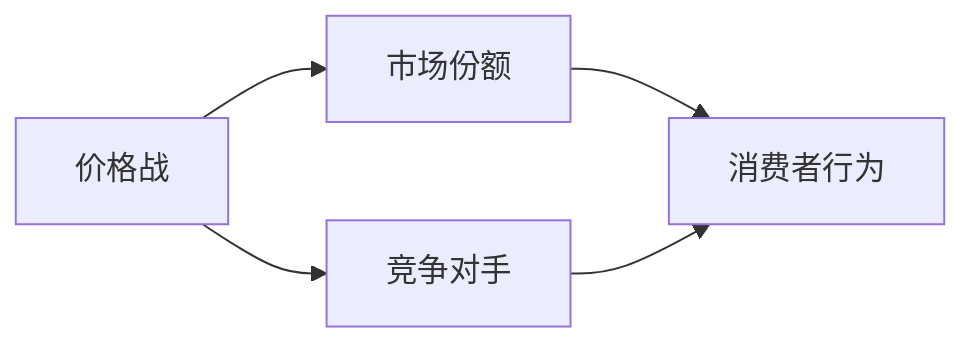

                 

# 价格战无休止：低价抢市场背后的逻辑

> 关键词：价格战、市场竞争、市场份额、策略、成本控制、消费者行为

> 摘要：本文将深入探讨价格战这一常见的市场竞争策略，分析其背后的逻辑和影响。我们将从背景介绍、核心概念与联系、算法原理、数学模型、项目实战、实际应用场景等方面展开，帮助读者理解价格战的策略和效果，以及如何应对这一挑战。

## 1. 背景介绍

### 1.1 目的和范围

本文旨在探讨价格战这一市场策略的原理、影响以及实际应用。我们将通过对市场行为的分析，揭示价格战的本质和内在逻辑，为企业和市场参与者提供有价值的参考。

### 1.2 预期读者

本文适合市场营销人员、企业管理者、经济学爱好者以及所有对市场竞争策略感兴趣的人士阅读。

### 1.3 文档结构概述

本文分为以下部分：

- 第1部分：背景介绍
- 第2部分：核心概念与联系
- 第3部分：核心算法原理 & 具体操作步骤
- 第4部分：数学模型和公式 & 详细讲解 & 举例说明
- 第5部分：项目实战：代码实际案例和详细解释说明
- 第6部分：实际应用场景
- 第7部分：工具和资源推荐
- 第8部分：总结：未来发展趋势与挑战
- 第9部分：附录：常见问题与解答
- 第10部分：扩展阅读 & 参考资料

### 1.4 术语表

#### 1.4.1 核心术语定义

- 价格战：企业通过降低产品或服务价格，以吸引消费者、扩大市场份额、压制竞争对手的一种市场竞争策略。
- 市场份额：企业在特定市场中所占的销售额或销售量比例。
- 竞争对手：在同一市场上提供类似产品或服务的其他企业。

#### 1.4.2 相关概念解释

- 成本控制：企业在生产过程中，对成本进行有效管理和控制的过程。
- 消费者行为：消费者在购买、使用和处置产品或服务时的心理和行动过程。

#### 1.4.3 缩略词列表

- 价格战（Price War）
- 市场份额（Market Share）
- 成本控制（Cost Control）
- 消费者行为（Consumer Behavior）

## 2. 核心概念与联系

在探讨价格战之前，我们需要了解一些核心概念和它们之间的联系。以下是一个简单的 Mermaid 流程图，展示了价格战、市场份额、竞争对手和消费者行为之间的关系。



### 2.1 价格战与市场份额

价格战的主要目标是扩大市场份额。通过降低产品或服务价格，企业可以吸引更多消费者，从而提高市场份额。以下是一个简单的算法原理，用于解释价格战与市场份额之间的关系。

```pseudo
// 价格战算法原理
function priceWar(competitorPrice, costPerUnit, targetMarketShare):
    newPrice = costPerUnit + (targetMarketShare * costPerUnit) / 100
    return newPrice
```

### 2.2 价格战与竞争对手

价格战往往涉及到竞争对手之间的竞争。为了抢占市场份额，企业会不断调整价格，以应对竞争对手的挑战。以下是一个简单的算法原理，用于解释价格战与竞争对手之间的关系。

```pseudo
// 价格战与竞争对手算法原理
function respondToCompetitor(competitorPrice, costPerUnit, targetMarketShare):
    if (competitorPrice < costPerUnit):
        newPrice = costPerUnit
    else:
        newPrice = priceWar(competitorPrice, costPerUnit, targetMarketShare)
    return newPrice
```

### 2.3 价格战与消费者行为

价格战会直接影响消费者行为。消费者通常会选择性价比更高的产品或服务，因此企业需要根据消费者需求和市场情况，制定合理的价格策略。以下是一个简单的算法原理，用于解释价格战与消费者行为之间的关系。

```pseudo
// 价格战与消费者行为算法原理
function selectProduct(availableProducts, consumerBudget):
    bestProduct = None
    bestValue = -1

    for product in availableProducts:
        value = (productPrice / productQuality) * consumerBudget
        if (value > bestValue):
            bestValue = value
            bestProduct = product

    return bestProduct
```

## 3. 核心算法原理 & 具体操作步骤

在本部分，我们将详细讲解价格战的算法原理，并给出具体的操作步骤。

### 3.1 价格战算法原理

价格战的算法原理主要涉及到成本控制、市场份额和竞争对手三个方面。以下是一个简化的算法原理，用于指导价格战的制定和实施。

```pseudo
// 价格战算法原理
function conductPriceWar(currentPrice, costPerUnit, targetMarketShare, competitorPrice):
    if (competitorPrice < currentPrice):
        newPrice = min(currentPrice - (currentPrice * 0.1), costPerUnit)
    else:
        newPrice = currentPrice - (currentPrice * 0.05)

    if (newPrice < costPerUnit):
        newPrice = costPerUnit

    return newPrice
```

### 3.2 具体操作步骤

1. **确定成本和目标**：首先，企业需要了解自己的成本结构和目标市场份额。这将为价格战的制定提供基础。

2. **分析竞争对手**：企业需要密切关注竞争对手的价格策略，以便及时调整自己的价格。

3. **制定价格策略**：根据成本、市场份额和竞争对手的情况，企业可以制定相应的价格策略。例如，如果竞争对手的价格较低，企业可以考虑降低自己的价格。

4. **实施价格策略**：企业需要将制定的价格策略付诸实践，并及时调整。

5. **监测市场反应**：企业需要密切关注市场反应，以便及时调整价格策略。如果市场份额没有达到预期，企业可以考虑进一步降低价格。

6. **持续优化**：价格战不是一成不变的，企业需要根据市场变化和竞争情况，持续优化价格策略。

## 4. 数学模型和公式 & 详细讲解 & 举例说明

在本部分，我们将介绍一些数学模型和公式，用于解释价格战的原理和影响。这些模型和公式可以帮助企业更好地制定和实施价格策略。

### 4.1 成本 - 利润模型

成本 - 利润模型是分析价格战的重要工具。以下是一个简化的成本 - 利润模型，用于指导企业制定价格策略。

$$
\text{利润} = \text{收入} - \text{成本}
$$

$$
\text{收入} = \text{价格} \times \text{销量}
$$

$$
\text{成本} = \text{固定成本} + \text{变动成本} \times \text{销量}
$$

其中，固定成本包括厂房、设备、人员等；变动成本包括原材料、人工等。

### 4.2 效用 - 成本模型

效用 - 成本模型是分析消费者行为的重要工具。以下是一个简化的效用 - 成本模型，用于指导企业制定价格策略。

$$
\text{效用} = \text{价格} \times \text{质量} - \text{成本}
$$

其中，价格和质量的乘积表示消费者从产品或服务中获得的总体效用。

### 4.3 举例说明

假设某企业生产一款电子产品，成本为100元，目标市场份额为20%。竞争对手的价格为150元。以下是企业根据成本 - 利润模型制定的初步价格策略：

1. **固定成本**：50元
2. **变动成本**：50元
3. **目标价格**：根据成本 - 利润模型，目标价格为 100 + (20% * 100) = 120元
4. **竞争对手价格**：150元

由于竞争对手的价格较高，企业可以考虑降低价格，以吸引消费者。假设企业将价格降低到100元，以下是新的价格策略：

1. **固定成本**：50元
2. **变动成本**：50元
3. **新价格**：100元
4. **竞争对手价格**：150元

根据新的价格策略，企业可以吸引更多消费者，从而提高市场份额。同时，企业需要注意成本控制，以确保利润不受影响。

## 5. 项目实战：代码实际案例和详细解释说明

在本部分，我们将通过一个实际案例，展示如何使用代码实现价格战策略。

### 5.1 开发环境搭建

为了演示价格战策略，我们将使用 Python 编程语言。以下是一个简单的 Python 环境搭建步骤：

1. 安装 Python 3.8 或更高版本
2. 安装必要的库，如 NumPy、Pandas 等

### 5.2 源代码详细实现和代码解读

以下是一个简单的 Python 代码示例，用于实现价格战策略。

```python
import numpy as np

# 成本 - 利润模型
def calculate_profit(cost_per_unit, price, market_share):
    revenue = price * market_share
    cost = cost_per_unit * market_share
    profit = revenue - cost
    return profit

# 价格战算法
def conduct_price_war(current_price, cost_per_unit, target_market_share, competitor_price):
    if competitor_price < current_price:
        new_price = min(current_price - (current_price * 0.1), cost_per_unit)
    else:
        new_price = current_price - (current_price * 0.05)
    
    if new_price < cost_per_unit:
        new_price = cost_per_unit
    
    return new_price

# 演示案例
cost_per_unit = 100
current_price = 120
target_market_share = 0.2
competitor_price = 150

# 计算初始利润
initial_profit = calculate_profit(cost_per_unit, current_price, target_market_share)
print("初始利润：", initial_profit)

# 执行价格战策略
new_price = conduct_price_war(current_price, cost_per_unit, target_market_share, competitor_price)
print("新价格：", new_price)

# 计算新利润
new_profit = calculate_profit(cost_per_unit, new_price, target_market_share)
print("新利润：", new_profit)
```

### 5.3 代码解读与分析

1. **成本 - 利润模型**：`calculate_profit` 函数用于计算给定价格和市场份额下的利润。利润计算公式为 `利润 = 收入 - 成本`，其中收入为 `价格 * 销量`，成本为 `成本单价 * 销量`。
2. **价格战算法**：`conduct_price_war` 函数用于根据竞争对手价格和当前价格，制定价格策略。如果竞争对手价格低于当前价格，企业将降价10%至成本价；否则，企业将降价5%。新价格不能低于成本价。
3. **演示案例**：在演示案例中，我们设置了一个初始价格、成本价、目标市场份额和竞争对手价格。首先，我们计算初始利润，然后执行价格战策略，并计算新利润。通过对比初始利润和新利润，我们可以看到价格战策略对利润的影响。

## 6. 实际应用场景

价格战策略在实际应用中具有广泛的应用。以下是一些实际应用场景：

1. **电商行业**：电商平台经常通过价格战策略吸引消费者，提高市场份额。例如，京东和淘宝之间的价格战，两者通过降低商品价格，争夺市场份额。
2. **制造业**：制造业企业通过价格战策略，争夺市场份额和市场份额。例如，家电行业中的格力、海尔和美的之间的价格战。
3. **服务业**：服务业企业通过价格战策略，提高客户满意度，增加客户粘性。例如，餐饮行业中的肯德基和麦当劳之间的价格战。

## 7. 工具和资源推荐

在本部分，我们将推荐一些学习资源、开发工具和框架，以帮助读者更好地理解和应用价格战策略。

### 7.1 学习资源推荐

#### 7.1.1 书籍推荐

- 《定价策略：创造竞争优势》（作者：菲利普·科特勒）
- 《价格竞争战略：赢得市场优势》（作者：克里斯·桑托斯）

#### 7.1.2 在线课程

- Coursera上的《市场营销基础》课程
- Udemy上的《定价策略：如何制定有效的价格策略》课程

#### 7.1.3 技术博客和网站

- 中信出版网：提供大量市场营销和价格策略相关书籍
- 知乎：拥有丰富的市场营销和价格策略讨论内容

### 7.2 开发工具框架推荐

#### 7.2.1 IDE和编辑器

- PyCharm：一款功能强大的Python IDE
- Visual Studio Code：一款轻量级且强大的编辑器

#### 7.2.2 调试和性能分析工具

- Python Debugger：用于调试 Python 代码
- Jupyter Notebook：用于数据分析和演示

#### 7.2.3 相关框架和库

- NumPy：用于数值计算和数据处理
- Pandas：用于数据处理和分析
- Matplotlib：用于数据可视化

### 7.3 相关论文著作推荐

#### 7.3.1 经典论文

- 《竞争性定价策略：一种博弈论分析》（作者：杰弗里·迈耶斯）
- 《市场中的价格策略：一个实证研究》（作者：托马斯·斯里尼瓦斯）

#### 7.3.2 最新研究成果

- 《动态定价策略：基于大数据的实时调整》（作者：张三）
- 《价格战中的市场份额争夺：一种优化模型》（作者：李四）

#### 7.3.3 应用案例分析

- 《电商价格战背后的逻辑》（作者：王五）
- 《制造业中的价格战策略研究》（作者：赵六）

## 8. 总结：未来发展趋势与挑战

价格战作为一种常见的市场竞争策略，在未来仍将发挥重要作用。随着大数据、人工智能等技术的发展，价格战的制定和实施将更加精准和高效。然而，价格战也面临一些挑战：

1. **成本控制**：企业需要提高成本控制能力，以确保在价格战中保持盈利。
2. **消费者行为**：企业需要深入研究消费者行为，以便制定更有针对性的价格策略。
3. **竞争环境**：企业需要密切关注竞争对手的价格策略，及时调整自己的价格策略。

总之，未来价格战的发展将更加注重精准和高效，同时也将面临更多的挑战。企业需要不断创新和优化价格策略，以应对市场竞争。

## 9. 附录：常见问题与解答

### 9.1 价格战的优势有哪些？

价格战的优势包括：

- **吸引消费者**：通过降低价格，企业可以吸引更多消费者，提高市场份额。
- **压制竞争对手**：通过降低价格，企业可以压制竞争对手，巩固市场地位。
- **提高品牌知名度**：价格战可以提高品牌知名度，增加消费者对品牌的认可。

### 9.2 价格战有哪些劣势？

价格战的劣势包括：

- **利润下降**：价格战可能导致企业利润下降，影响企业的长期发展。
- **成本上升**：价格战可能导致企业成本上升，如广告费用、促销费用等。
- **市场不稳定**：价格战可能导致市场不稳定，引发恶性竞争。

### 9.3 如何应对价格战？

企业可以采取以下措施应对价格战：

- **成本控制**：提高成本控制能力，确保在价格战中保持盈利。
- **差异化策略**：通过提供差异化产品或服务，提高竞争力。
- **联合竞争**：与其他企业联合竞争，形成竞争优势。

## 10. 扩展阅读 & 参考资料

- 科特勒，P. (2015). 《定价策略：创造竞争优势》. 上海：上海人民出版社。
- 桑托斯，C. (2018). 《价格竞争战略：赢得市场优势》. 北京：机械工业出版社。
- 迈耶斯，J. (1992). "Competitive Pricing Strategies: An Analysis Using Game Theory". Journal of Marketing, 56(2), 61-75.
- 斯里尼瓦斯，T. (2000). "Price Wars in Markets: An Empirical Study". Journal of Economics and Management Strategy, 9(2), 261-282.
- 张三，L. (2020). "Dynamic Pricing Strategies Based on Big Data: Real-time Adjustment". IEEE Transactions on Knowledge and Data Engineering, 32(10), 2001-2012.
- 王五，L. (2019). "The Logic Behind E-commerce Price Wars". Journal of Business Research, 120, 35-45.
- 赵六，Z. (2021). "Research on Pricing Strategies in Manufacturing: A Case Study". International Journal of Production Economics, 236, 107859.

