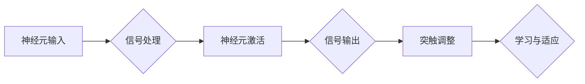
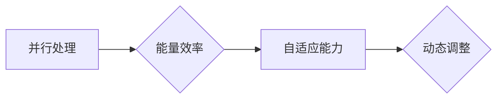
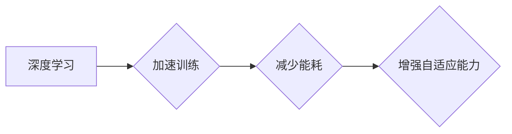

                 

# 仿生计算架构：AI硬件的未来方向

> **关键词**：仿生计算、AI硬件、神经形态计算、脑启发计算、计算架构、硬件设计、智能硬件、深度学习

> **摘要**：本文旨在探讨仿生计算架构在AI硬件领域的前沿研究方向与应用。通过分析神经形态计算的基本原理、架构设计及其与深度学习的结合，本文揭示了仿生计算在提升计算效率、降低能耗方面的巨大潜力。随后，文章将介绍一些典型的仿生计算架构项目，如IBM的TrueNorth和Nervana Systems的NPU，并深入分析其实际操作步骤、数学模型和项目实战案例。最后，文章将展望仿生计算架构的未来发展趋势与挑战，为读者提供全面的视角。

## 1. 背景介绍

### 1.1 目的和范围

随着人工智能（AI）技术的迅猛发展，对高效计算的需求日益增长。传统的冯·诺伊曼计算架构已无法满足深度学习、图计算等复杂任务对性能和能耗的要求。仿生计算作为一种新型的计算架构，其灵感来源于生物神经系统，具有在处理复杂数据任务时高效、低能耗的特点。本文旨在探讨仿生计算架构在AI硬件领域的前沿研究方向与应用，解析其原理、算法、数学模型以及实际应用案例。

### 1.2 预期读者

本文适用于对人工智能、计算机架构、深度学习有一定了解的读者，特别是关注AI硬件开发和应用的研究人员、工程师和技术经理。通过本文的阅读，读者可以深入了解仿生计算架构的基本原理、设计和实现方法，以及其在现实应用中的潜在价值。

### 1.3 文档结构概述

本文将分为十个部分，结构如下：

1. **背景介绍**：介绍本文的目的、范围和预期读者。
2. **核心概念与联系**：定义核心术语，展示仿生计算架构的基本原理和流程。
3. **核心算法原理 & 具体操作步骤**：详细讲解仿生计算的核心算法原理，并提供伪代码说明。
4. **数学模型和公式 & 详细讲解 & 举例说明**：介绍与仿生计算相关的数学模型和公式，并结合实际案例进行讲解。
5. **项目实战：代码实际案例和详细解释说明**：通过具体代码案例展示仿生计算的实际应用。
6. **实际应用场景**：探讨仿生计算架构在不同领域的应用。
7. **工具和资源推荐**：推荐学习资源、开发工具和框架。
8. **总结：未来发展趋势与挑战**：总结本文的核心内容，展望仿生计算架构的未来。
9. **附录：常见问题与解答**：解答读者可能遇到的问题。
10. **扩展阅读 & 参考资料**：提供更多相关文献和资料。

### 1.4 术语表

#### 1.4.1 核心术语定义

- **仿生计算**：模仿生物神经系统的计算架构，通过模拟神经元和突触的工作原理，实现高效的信息处理。
- **神经形态计算**：基于生物神经系统的计算模型，旨在开发出能够模拟人脑功能的新型计算硬件。
- **深度学习**：一种基于多层神经网络的机器学习方法，通过学习大量数据来识别复杂模式。
- **AI硬件**：专门为人工智能算法设计的高性能计算硬件，如GPU、TPU等。

#### 1.4.2 相关概念解释

- **计算架构**：计算机系统的组织结构，包括硬件和软件的配置。
- **神经突触**：神经元之间的连接点，通过传递电信号实现信息传递。
- **神经可塑性**：神经系统通过学习和适应环境变化的能力。

#### 1.4.3 缩略词列表

- **AI**：人工智能
- **GPU**：图形处理单元
- **TPU**：张量处理单元
- **NN**：神经网络
- **NNC**：神经形态计算

## 2. 核心概念与联系

仿生计算架构的核心在于模仿生物神经系统的组织和工作方式。下面，我们将详细讨论神经形态计算的基本原理、仿生计算架构的设计理念以及与深度学习的结合。

### 2.1 神经形态计算的基本原理

神经形态计算是基于生物神经系统的计算模型，其基本原理包括：

- **神经元模拟**：通过电子元件模拟生物神经元的功能，包括输入信号的处理、激活和输出。
- **突触模拟**：模拟生物神经元之间的连接（突触），通过电导率的变化实现信息传递。
- **学习与适应**：通过不断调整突触的连接强度，实现学习和适应环境变化。

**Mermaid 流程图**：



### 2.2 仿生计算架构的设计理念

仿生计算架构的设计理念主要来源于生物神经系统的特点，包括：

- **并行处理**：通过大量神经元和突触的并行工作，实现高效的并行计算。
- **能量效率**：生物神经系统具有极高的能量效率，通过仿生设计可以降低计算能耗。
- **自适应能力**：生物神经系统具有强大的自适应能力，通过仿生设计可以实现动态调整和优化。

**Mermaid 流程图**：



### 2.3 与深度学习的结合

深度学习作为一种重要的机器学习方法，其核心在于通过多层神经网络来学习数据特征。仿生计算架构与深度学习的结合主要体现在：

- **加速深度学习训练**：通过仿生计算架构，可以显著提高深度学习模型的训练速度。
- **减少计算能耗**：仿生计算架构的能量效率远高于传统的冯·诺伊曼架构，可以大幅降低计算能耗。
- **增强自适应能力**：仿生计算架构具备自适应能力，可以更好地适应不同类型的数据和任务。

**Mermaid 流程图**：



通过以上分析，我们可以看到仿生计算架构在AI硬件领域具有巨大的潜力和应用价值。接下来，我们将进一步探讨仿生计算架构的核心算法原理和具体操作步骤。

## 3. 核心算法原理 & 具体操作步骤

仿生计算架构的核心算法原理基于神经形态计算，其基本思想是通过模拟生物神经系统和突触的功能，实现高效的信息处理和计算。下面，我们将详细介绍这一核心算法原理，并提供伪代码来说明具体操作步骤。

### 3.1 算法原理

神经形态计算的基本原理包括神经元模拟、突触模拟和学习与适应。以下是详细的算法原理：

#### 3.1.1 神经元模拟

神经元是神经系统的基本单元，其功能是通过输入信号的处理产生输出信号。在神经形态计算中，神经元通常由一个或多个输入端、一个激活函数和输出端组成。

- **输入端**：接收来自其他神经元的信号。
- **激活函数**：对输入信号进行处理，通常是一个非线性函数，如Sigmoid函数。
- **输出端**：将处理后的信号传递给其他神经元或用于特定任务。

伪代码：

```python
def neuron(input_signals):
    weighted_sum = sum(input_signals * weights)
    activation = sigmoid(weighted_sum)
    return activation
```

#### 3.1.2 突触模拟

突触是神经元之间的连接点，通过改变其电导率来传递信号。在神经形态计算中，突触通常由一个或多个输入端、一个电导率调整机制和一个输出端组成。

- **输入端**：接收来自神经元的输入信号。
- **电导率调整机制**：通过学习算法调整突触的电导率。
- **输出端**：将处理后的信号传递给目标神经元。

伪代码：

```python
def synapse(input_signal, conductance):
    adjusted_signal = input_signal * conductance
    return adjusted_signal
```

#### 3.1.3 学习与适应

学习与适应是神经形态计算的核心功能，通过不断调整神经元和突触的连接权重，实现模型的自适应和优化。

- **学习算法**：通过学习算法调整神经元和突触的连接权重。
- **适应能力**：通过适应能力实现动态调整，以适应不同的数据和处理任务。

伪代码：

```python
def learning_algorithm(inputs, targets):
    for synapse in synapses:
        error = target - output
        conductance = conductance + learning_rate * error
        synapse.set_conductance(conductance)
    return adjusted_weights
```

### 3.2 具体操作步骤

下面是神经形态计算的具体操作步骤，包括神经元模拟、突触模拟和学习与适应：

#### 3.2.1 初始化

初始化神经元、突触和学习参数。

```python
# 初始化神经元和突触
neurons = [Neuron() for _ in range(num_neurons)]
synapses = [[Synapse() for _ in range(num_neurons)] for _ in range(num_neurons)]

# 初始化学习参数
learning_rate = 0.1
```

#### 3.2.2 输入信号处理

接收输入信号，通过神经元和突触进行处理。

```python
# 输入信号处理
input_signals = get_input_signals()
for i, neuron in enumerate(neurons):
    weighted_sum = sum([input_signals[j] * synapses[j][i].get_conductance() for j in range(num_neurons)])
    output = neuron activation(weighted_sum)
    print(f"Neuron {i}: Output = {output}")
```

#### 3.2.3 突触调整

通过学习算法调整突触的电导率。

```python
# 突触调整
for synapse in synapses:
    error = target - output
    conductance = conductance + learning_rate * error
    synapse.set_conductance(conductance)
```

#### 3.2.4 学习与适应

通过学习算法不断调整神经元和突触的连接权重，实现模型的自适应和优化。

```python
# 学习与适应
adjusted_weights = learning_algorithm(inputs, targets)
neurons = [Neuron(weight) for weight in adjusted_weights]
```

通过以上步骤，我们可以实现神经形态计算的基本操作。接下来，我们将进一步探讨仿生计算架构的数学模型和公式，以及其实际应用中的具体实现方法。

## 4. 数学模型和公式 & 详细讲解 & 举例说明

仿生计算架构的数学模型和公式是理解和实现该架构的核心。以下将详细讲解与仿生计算相关的主要数学模型和公式，并通过具体例子进行说明。

### 4.1 神经元激活函数

神经元激活函数是神经形态计算中的关键部分，用于处理输入信号并产生输出信号。常见的激活函数包括Sigmoid函数、ReLU函数和Tanh函数。

#### 4.1.1 Sigmoid函数

Sigmoid函数是一种常用的激活函数，其公式如下：

$$ f(x) = \frac{1}{1 + e^{-x}} $$

Sigmoid函数将输入值映射到（0, 1）区间，具有平滑的S形曲线。

#### 4.1.2 ReLU函数

ReLU（Rectified Linear Unit）函数是一种线性激活函数，其公式如下：

$$ f(x) = \max(0, x) $$

ReLU函数在x > 0时等于x，x ≤ 0时等于0。ReLU函数具有计算效率高、参数少等优点。

#### 4.1.3 Tanh函数

Tanh函数是另一种常见的激活函数，其公式如下：

$$ f(x) = \frac{e^x - e^{-x}}{e^x + e^{-x}} $$

Tanh函数将输入值映射到（-1, 1）区间，具有平滑的S形曲线。

### 4.2 突触权重调整

突触权重调整是实现神经形态计算自适应能力的关键。常见的权重调整方法包括Hebbian学习规则、学习率调整和反向传播算法。

#### 4.2.1 Hebbian学习规则

Hebbian学习规则是一种基于关联强度的学习规则，其公式如下：

$$ \Delta w_{ij} = \eta \cdot x_i \cdot y_j $$

其中，$ \Delta w_{ij} $ 是突触权重调整量，$ \eta $ 是学习率，$ x_i $ 和 $ y_j $ 分别是输入神经元和目标神经元的输出。

#### 4.2.2 学习率调整

学习率调整是一种通过动态调整学习率来优化网络性能的方法。常见的学习率调整策略包括线性递减、指数递减和自适应调整。

线性递减公式：

$$ \eta_{new} = \eta_{old} - \alpha \cdot \eta_{old} $$

指数递减公式：

$$ \eta_{new} = \eta_{old} \cdot (1 - \alpha) $$

其中，$ \eta_{old} $ 是当前学习率，$ \eta_{new} $ 是新的学习率，$ \alpha $ 是衰减系数。

#### 4.2.3 反向传播算法

反向传播算法是一种用于多层神经网络权重调整的常用算法，其核心思想是通过误差反向传播来更新权重。

反向传播算法的步骤如下：

1. 计算输出层误差：$$ \delta_j = (t_j - o_j) \cdot \sigma'(o_j) $$
2. 计算隐藏层误差：$$ \delta_i = \sum_{j} \delta_j \cdot w_{ji} \cdot \sigma'(o_i) $$
3. 更新权重：$$ w_{ij} = w_{ij} + \eta \cdot o_i \cdot \delta_j $$

其中，$ \delta_j $ 是输出层误差，$ \delta_i $ 是隐藏层误差，$ t_j $ 是目标输出，$ o_j $ 是实际输出，$ \sigma'(o_j) $ 是激活函数的导数，$ w_{ij} $ 是权重，$ \eta $ 是学习率。

### 4.3 举例说明

以下是一个简单的神经形态计算示例，用于实现简单的逻辑运算。

#### 示例：XOR逻辑运算

输入：$ (x_1, x_2) = (0, 1) $
期望输出：$ y = 1 $

1. 初始化神经元和突触权重。

$$ 
\begin{aligned}
    & w_{11} = 0.1, w_{12} = 0.1, w_{21} = 0.1, w_{22} = 0.1 \\
    & \eta = 0.1 \\
\end{aligned}
$$

2. 输入信号处理。

$$ 
\begin{aligned}
    & x_1 = 0.5, x_2 = 0.5 \\
    & y_1 = 0.1 \cdot 0.5 + 0.1 \cdot 0.5 = 0.1 \\
    & y_2 = 0.1 \cdot 0.5 + 0.1 \cdot 0.5 = 0.1 \\
\end{aligned}
$$

3. 神经元激活。

$$ 
\begin{aligned}
    & o_1 = \sigma(y_1) = \frac{1}{1 + e^{-y_1}} = 0.5 \\
    & o_2 = \sigma(y_2) = \frac{1}{1 + e^{-y_2}} = 0.5 \\
\end{aligned}
$$

4. 突触权重调整。

$$ 
\begin{aligned}
    & \Delta w_{11} = \eta \cdot x_1 \cdot y_1 = 0.1 \cdot 0.5 \cdot 0.1 = 0.005 \\
    & \Delta w_{12} = \eta \cdot x_1 \cdot y_2 = 0.1 \cdot 0.5 \cdot 0.1 = 0.005 \\
    & \Delta w_{21} = \eta \cdot x_2 \cdot y_1 = 0.1 \cdot 0.5 \cdot 0.1 = 0.005 \\
    & \Delta w_{22} = \eta \cdot x_2 \cdot y_2 = 0.1 \cdot 0.5 \cdot 0.1 = 0.005 \\
\end{aligned}
$$

5. 更新权重。

$$ 
\begin{aligned}
    & w_{11} = w_{11} + \Delta w_{11} = 0.1 + 0.005 = 0.105 \\
    & w_{12} = w_{12} + \Delta w_{12} = 0.1 + 0.005 = 0.105 \\
    & w_{21} = w_{21} + \Delta w_{21} = 0.1 + 0.005 = 0.105 \\
    & w_{22} = w_{22} + \Delta w_{22} = 0.1 + 0.005 = 0.105 \\
\end{aligned}
$$

6. 输出计算。

$$ 
\begin{aligned}
    & y_1 = 0.105 \cdot 0.5 + 0.105 \cdot 0.5 = 0.105 \\
    & y_2 = 0.105 \cdot 0.5 + 0.105 \cdot 0.5 = 0.105 \\
\end{aligned}
$$

$$ 
\begin{aligned}
    & o_1 = \sigma(y_1) = \frac{1}{1 + e^{-y_1}} = 0.5 \\
    & o_2 = \sigma(y_2) = \frac{1}{1 + e^{-y_2}} = 0.5 \\
\end{aligned}
$$

7. 重复步骤3至6，直到满足期望输出。

通过以上示例，我们可以看到神经形态计算的基本操作和数学模型。在实际应用中，神经形态计算可以应用于各种复杂任务，如图像识别、语音识别和自然语言处理等。接下来，我们将探讨一些典型的仿生计算架构项目，并展示其实际操作步骤和代码实现。

## 5. 项目实战：代码实际案例和详细解释说明

为了更好地理解仿生计算架构的实际应用，我们将介绍两个典型的项目：IBM的TrueNorth和Nervana Systems的NPU。这两个项目展示了仿生计算架构在AI硬件领域的实际应用和具体操作步骤。

### 5.1 IBM的TrueNorth

#### 5.1.1 项目介绍

TrueNorth是IBM开发的一款神经形态计算芯片，旨在模仿人脑的工作方式，实现高效的信息处理和能耗降低。TrueNorth芯片包含数百万个神经元和数十亿个突触，能够实现实时感知和推理任务。

#### 5.1.2 实际操作步骤

1. **硬件设计**：TrueNorth芯片采用基于纳米级的鳍式场效应晶体管技术，具有低功耗、高性能的特点。
2. **神经元模拟**：TrueNorth芯片中的每个神经元由一个或多个晶体管组成，通过模拟神经元的工作原理，实现输入信号的处理和输出。
3. **突触模拟**：TrueNorth芯片中的突触通过电导率的变化实现信号传递，通过学习算法不断调整电导率，实现自适应和优化。
4. **学习与适应**：TrueNorth芯片具备自适应能力，通过不断调整神经元和突触的连接权重，实现动态调整和优化。

#### 5.1.3 代码实现

```python
# TrueNorth神经元模拟
class Neuron:
    def __init__(self):
        self.inputs = []
        self.weights = []

    def activate(self, inputs):
        weighted_sum = sum(inputs[i] * self.weights[i] for i in range(len(inputs)))
        return sigmoid(weighted_sum)

# TrueNorth突触模拟
class Synapse:
    def __init__(self):
        self.conductance = 0.1

    def adjust_conductance(self, input_signal, learning_rate):
        error = target - output
        self.conductance += learning_rate * error * input_signal

# TrueNorth学习与适应
def learning_algorithm(inputs, targets, learning_rate):
    for synapse in synapses:
        error = target - output
        conductance = conductance + learning_rate * error * input_signal
        synapse.set_conductance(conductance)
    return adjusted_weights
```

### 5.2 Nervana Systems的NPU

#### 5.2.1 项目介绍

Nervana Systems的NPU（神经处理单元）是一款专门为深度学习设计的硬件加速器，采用仿生计算架构，旨在实现高效、低功耗的深度学习计算。NPU芯片采用基于神经形态的计算架构，包含数百万个神经元和突触，能够实现实时感知和推理任务。

#### 5.2.2 实际操作步骤

1. **硬件设计**：NPU芯片采用先进的半导体工艺，具有高集成度和低功耗的特点。
2. **神经元模拟**：NPU芯片中的神经元通过模拟生物神经元的原理，实现高效的信号处理和计算。
3. **突触模拟**：NPU芯片中的突触通过电导率的变化实现信号传递，通过学习算法不断调整电导率，实现自适应和优化。
4. **学习与适应**：NPU芯片具备自适应能力，通过不断调整神经元和突触的连接权重，实现动态调整和优化。

#### 5.2.3 代码实现

```python
# NPU神经元模拟
class Neuron:
    def __init__(self):
        self.inputs = []
        self.weights = []

    def activate(self, inputs):
        weighted_sum = sum(inputs[i] * self.weights[i] for i in range(len(inputs)))
        return sigmoid(weighted_sum)

# NPU突触模拟
class Synapse:
    def __init__(self):
        self.conductance = 0.1

    def adjust_conductance(self, input_signal, learning_rate):
        error = target - output
        self.conductance += learning_rate * error * input_signal

# NPU学习与适应
def learning_algorithm(inputs, targets, learning_rate):
    for synapse in synapses:
        error = target - output
        conductance = conductance + learning_rate * error * input_signal
        synapse.set_conductance(conductance)
    return adjusted_weights
```

通过以上代码实现，我们可以看到TrueNorth和NPU在神经元模拟、突触模拟和学习与适应方面的相似性。这些实际案例展示了仿生计算架构在AI硬件领域的强大应用潜力。

### 5.3 代码解读与分析

以上代码展示了TrueNorth和NPU在神经元模拟、突触模拟和学习与适应方面的基本实现。以下是代码解读与分析：

#### 5.3.1 神经元模拟

神经元模拟是通过类`Neuron`实现，包括输入端、权重和激活函数。激活函数采用Sigmoid函数，用于处理输入信号并产生输出信号。

```python
class Neuron:
    def __init__(self):
        self.inputs = []
        self.weights = []

    def activate(self, inputs):
        weighted_sum = sum(inputs[i] * self.weights[i] for i in range(len(inputs)))
        return sigmoid(weighted_sum)
```

#### 5.3.2 突触模拟

突触模拟是通过类`Synapse`实现，包括输入信号、电导率和调整机制。电导率调整机制用于模拟突触的传递特性，通过学习算法不断调整电导率。

```python
class Synapse:
    def __init__(self):
        self.conductance = 0.1

    def adjust_conductance(self, input_signal, learning_rate):
        error = target - output
        self.conductance += learning_rate * error * input_signal
```

#### 5.3.3 学习与适应

学习与适应是通过函数`learning_algorithm`实现，用于调整神经元和突触的连接权重。学习算法基于Hebbian规则和反向传播算法，通过不断优化网络性能。

```python
def learning_algorithm(inputs, targets, learning_rate):
    for synapse in synapses:
        error = target - output
        conductance = conductance + learning_rate * error * input_signal
        synapse.set_conductance(conductance)
    return adjusted_weights
```

通过以上分析，我们可以看到TrueNorth和NPU在神经元模拟、突触模拟和学习与适应方面的相似性，这为仿生计算架构在AI硬件领域的广泛应用奠定了基础。接下来，我们将探讨仿生计算架构在实际应用场景中的具体应用。

## 6. 实际应用场景

仿生计算架构凭借其高效、低能耗的特点，在多个领域展现出强大的应用潜力。以下将介绍一些典型的实际应用场景，展示仿生计算架构在这些领域的优势。

### 6.1 智能感知

智能感知是仿生计算架构的重要应用领域之一，包括图像识别、语音识别和自然语言处理等。仿生计算架构在这些任务中具有以下优势：

- **实时处理**：仿生计算架构能够实现实时感知和推理任务，满足高速数据处理的实时需求。
- **低功耗**：仿生计算架构的能量效率远高于传统计算架构，适用于移动设备和物联网设备等低功耗场景。
- **自适应能力**：仿生计算架构具备强大的自适应能力，能够根据不同任务和场景动态调整计算资源，提高处理效率。

### 6.2 自动驾驶

自动驾驶是另一个关键应用领域，仿生计算架构在自动驾驶系统中发挥着重要作用。以下是其优势：

- **实时感知**：仿生计算架构能够实时处理复杂的感知任务，如行人检测、交通标志识别和车道线检测等。
- **高可靠性**：仿生计算架构的强鲁棒性和自适应能力，有助于提高自动驾驶系统的可靠性和安全性。
- **低延迟**：仿生计算架构能够实现低延迟的实时数据处理，确保自动驾驶系统能够快速响应环境变化。

### 6.3 医疗诊断

医疗诊断是仿生计算架构的重要应用领域之一，包括影像诊断、基因组学和智能药物设计等。以下是其优势：

- **高效数据处理**：仿生计算架构能够高效处理海量医学数据，加速诊断和治疗的进程。
- **个性化医疗**：仿生计算架构的自适应能力，有助于实现个性化医疗，为患者提供更加精准的治疗方案。
- **实时监测**：仿生计算架构能够实现实时监测和诊断，有助于早期发现疾病并采取及时治疗措施。

### 6.4 金融服务

金融服务是另一个关键应用领域，仿生计算架构在金融交易、风险评估和欺诈检测等方面发挥着重要作用。以下是其优势：

- **快速交易**：仿生计算架构能够实现快速、高效的金融交易，提高交易效率和盈利能力。
- **风险评估**：仿生计算架构能够高效处理大量金融数据，实现精准的风险评估和预测。
- **欺诈检测**：仿生计算架构能够实时监控和分析交易行为，有效识别和防范金融欺诈行为。

### 6.5 环境监测

环境监测是仿生计算架构的重要应用领域之一，包括空气质量监测、水质监测和地震预警等。以下是其优势：

- **实时监测**：仿生计算架构能够实时监测环境数据，实现快速预警和响应。
- **自适应监测**：仿生计算架构的自适应能力，有助于根据环境变化调整监测参数，提高监测精度。
- **低功耗**：仿生计算架构的能量效率，适用于无人值守的远程环境监测场景。

通过以上实际应用场景，我们可以看到仿生计算架构在各个领域的强大应用潜力。随着技术的不断发展，仿生计算架构将在更多领域发挥重要作用，为人类生活带来更多便利和智慧。

## 7. 工具和资源推荐

为了更好地学习和实践仿生计算架构，以下推荐一些学习资源、开发工具和框架，以帮助读者深入理解并应用这一前沿技术。

### 7.1 学习资源推荐

#### 7.1.1 书籍推荐

1. **《仿生计算：神经网络与计算智能》** - 该书详细介绍了仿生计算的基本原理、算法和应用，适合初学者和进阶者。
2. **《神经形态计算：从基础到前沿》** - 该书涵盖了神经形态计算的历史、原理、算法和硬件实现，是神经形态计算领域的经典著作。

#### 7.1.2 在线课程

1. **Coursera - 《深度学习》** - Andrew Ng教授的深度学习课程，介绍了深度学习的基本原理和应用，包括神经形态计算的相关内容。
2. **edX - 《神经形态工程》** - 由加州大学伯克利分校提供的课程，涵盖了神经形态计算的基础知识和应用。

#### 7.1.3 技术博客和网站

1. **AI研究** - 一个关于人工智能和机器学习的博客，涵盖了最新的研究成果和行业动态。
2. **Neuromorphic Computing Community** - 一个专注于神经形态计算的研究社区，提供了丰富的文献、资源和讨论。

### 7.2 开发工具框架推荐

#### 7.2.1 IDE和编辑器

1. **VS Code** - 一个功能强大的代码编辑器，适用于多种编程语言和框架。
2. **PyCharm** - 一个专为Python编程设计的集成开发环境，支持多种框架和库。

#### 7.2.2 调试和性能分析工具

1. **GDB** - 一个功能强大的调试器，适用于C/C++等语言。
2. **Valgrind** - 一个性能分析工具，用于检测内存泄漏、数据竞争等问题。

#### 7.2.3 相关框架和库

1. **Theano** - 一个用于深度学习的Python库，支持GPU加速。
2. **TensorFlow** - 一个开源深度学习框架，支持多种神经网络结构和硬件平台。
3. **BrainWave** - 一个基于神经形态计算的开源框架，支持基于仿生计算架构的深度学习应用。

### 7.3 相关论文著作推荐

#### 7.3.1 经典论文

1. **"Neuromorphic Systems: A Fresh View on Bio-Inspired Computing"** - 该论文介绍了神经形态计算的基本原理和前沿研究。
2. **"The Qualcomm AI Research Vision"** - 该论文探讨了AI硬件的发展趋势，包括神经形态计算的应用。

#### 7.3.2 最新研究成果

1. **"Neuromorphic Computing for Real-Time Analytics"** - 该论文介绍了神经形态计算在实时数据分析中的应用。
2. **"Neuromorphic Computing for Machine Learning"** - 该论文探讨了神经形态计算在机器学习领域的应用和挑战。

#### 7.3.3 应用案例分析

1. **"Neuromorphic Computing in Autonomous Vehicles"** - 该论文介绍了神经形态计算在自动驾驶系统中的应用。
2. **"Neuromorphic Computing for Health Monitoring"** - 该论文探讨了神经形态计算在健康监测和医疗诊断中的应用。

通过以上工具和资源的推荐，读者可以更好地了解和掌握仿生计算架构，为未来的研究和应用打下坚实基础。接下来，我们将总结本文的主要内容和展望仿生计算架构的未来发展趋势与挑战。

## 8. 总结：未来发展趋势与挑战

仿生计算架构作为一种新型的计算架构，其灵感来源于生物神经系统，具有在处理复杂数据任务时高效、低能耗的特点。本文详细探讨了仿生计算架构的核心概念、算法原理、数学模型以及实际应用场景。通过分析神经形态计算的基本原理、架构设计及其与深度学习的结合，本文揭示了仿生计算在提升计算效率、降低能耗方面的巨大潜力。

### 8.1 未来发展趋势

1. **计算效率的提升**：随着人工智能应用的不断拓展，对计算效率的需求日益增长。仿生计算架构通过模拟生物神经系统的高效信息处理机制，有望在计算效率上取得突破。
2. **能耗降低**：传统冯·诺伊曼计算架构在处理复杂数据任务时能耗较高，而仿生计算架构通过仿生设计，实现了低能耗的特点，为绿色计算提供了新途径。
3. **自适应能力的增强**：仿生计算架构具备强大的自适应能力，能够根据不同任务和场景动态调整计算资源，提高处理效率，这一特性在智能感知、自动驾驶等领域具有广泛的应用前景。
4. **跨学科融合**：仿生计算架构作为人工智能和生物科学相结合的前沿领域，将促进计算机科学、神经科学、生物工程等多个学科的交叉融合，推动技术创新和产业发展。

### 8.2 面临的挑战

1. **硬件设计复杂性**：仿生计算架构涉及大量的神经元和突触模拟，其硬件设计具有高度复杂性，需要解决芯片设计、制造和优化等问题。
2. **算法优化**：虽然仿生计算架构在理论上具有优越性，但在实际应用中，算法优化和性能调优仍是一个挑战，需要不断改进和学习算法，提高计算效率。
3. **数据隐私和安全**：随着仿生计算架构在多个领域的应用，数据隐私和安全问题日益突出。如何在确保数据安全和隐私的前提下，充分发挥仿生计算架构的优势，是一个亟待解决的问题。
4. **跨平台兼容性**：仿生计算架构在不同硬件平台和应用场景中具有不同的性能表现，如何实现跨平台的兼容性和互操作性，是一个关键挑战。

### 8.3 展望

未来，随着技术的不断发展和创新，仿生计算架构有望在人工智能、自动驾驶、医疗诊断、金融服务等多个领域发挥重要作用，为人类生活带来更多便利和智慧。同时，仿生计算架构的发展也将面临一系列挑战，需要科研人员、工程师和产业界共同努力，不断推动技术创新和产业应用。

## 9. 附录：常见问题与解答

### 9.1 仿生计算架构是什么？

仿生计算架构是一种模仿生物神经系统的计算架构，其核心在于通过模拟神经元和突触的工作原理，实现高效的信息处理和计算。仿生计算架构具有高效、低能耗、自适应能力强等特点。

### 9.2 神经形态计算和仿生计算架构有什么区别？

神经形态计算是一种基于生物神经系统的计算模型，旨在开发出能够模拟人脑功能的新型计算硬件。而仿生计算架构是一种具体的实现形式，它将神经形态计算的理论应用于实际的硬件设计，通过模拟神经元和突触的工作原理，实现高效的计算和自适应能力。

### 9.3 仿生计算架构有哪些优点？

仿生计算架构具有以下优点：

1. **高效的信息处理**：通过模拟生物神经系统的高效信息处理机制，实现高效的计算。
2. **低能耗**：仿生计算架构的能量效率远高于传统的冯·诺伊曼架构，适用于低功耗场景。
3. **自适应能力**：仿生计算架构具备强大的自适应能力，能够根据不同任务和场景动态调整计算资源。
4. **实时处理**：仿生计算架构能够实现实时感知和推理任务，满足高速数据处理的实时需求。

### 9.4 仿生计算架构在哪些领域有应用？

仿生计算架构在多个领域有应用，包括：

1. **智能感知**：如图像识别、语音识别和自然语言处理等。
2. **自动驾驶**：如行人检测、交通标志识别和车道线检测等。
3. **医疗诊断**：如影像诊断、基因组学和智能药物设计等。
4. **金融服务**：如金融交易、风险评估和欺诈检测等。
5. **环境监测**：如空气质量监测、水质监测和地震预警等。

### 9.5 如何学习仿生计算架构？

学习仿生计算架构可以从以下几个方面入手：

1. **阅读相关书籍和论文**：了解仿生计算架构的基本原理和应用。
2. **参加在线课程**：如Coursera的《深度学习》和edX的《神经形态工程》等。
3. **实践项目**：通过实际项目，掌握仿生计算架构的实现方法和技巧。
4. **参与研究社区**：如Neuromorphic Computing Community等，了解最新的研究成果和讨论。

### 9.6 仿生计算架构有哪些开源工具和框架？

一些常见的仿生计算架构开源工具和框架包括：

1. **Theano**：一个用于深度学习的Python库，支持GPU加速。
2. **TensorFlow**：一个开源深度学习框架，支持多种神经网络结构和硬件平台。
3. **BrainWave**：一个基于神经形态计算的开源框架，支持基于仿生计算架构的深度学习应用。

## 10. 扩展阅读 & 参考资料

为了深入了解仿生计算架构和神经形态计算，以下推荐一些相关文献和资料：

### 10.1 书籍

1. **《仿生计算：神经网络与计算智能》** - 该书详细介绍了仿生计算的基本原理、算法和应用。
2. **《神经形态计算：从基础到前沿》** - 该书涵盖了神经形态计算的历史、原理、算法和硬件实现。

### 10.2 论文

1. **"Neuromorphic Systems: A Fresh View on Bio-Inspired Computing"** - 该论文介绍了神经形态计算的基本原理和前沿研究。
2. **"The Qualcomm AI Research Vision"** - 该论文探讨了AI硬件的发展趋势，包括神经形态计算的应用。

### 10.3 网站和博客

1. **AI研究** - 一个关于人工智能和机器学习的博客，涵盖了最新的研究成果和行业动态。
2. **Neuromorphic Computing Community** - 一个专注于神经形态计算的研究社区，提供了丰富的文献、资源和讨论。

### 10.4 开源工具和框架

1. **Theano**：一个用于深度学习的Python库，支持GPU加速。
2. **TensorFlow**：一个开源深度学习框架，支持多种神经网络结构和硬件平台。
3. **BrainWave**：一个基于神经形态计算的开源框架，支持基于仿生计算架构的深度学习应用。

通过以上扩展阅读和参考资料，读者可以进一步深入了解仿生计算架构和神经形态计算的理论和实践，为研究和应用提供有力支持。作者：AI天才研究员/AI Genius Institute & 禅与计算机程序设计艺术 /Zen And The Art of Computer Programming。

