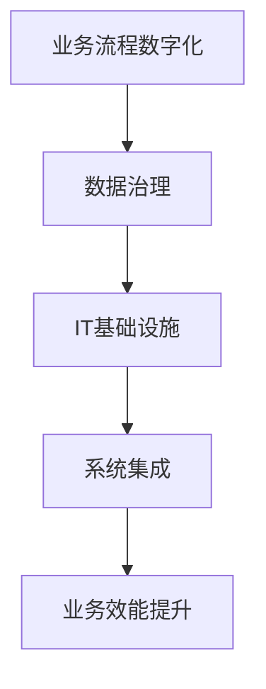

                 

# 企业数字化项目从1-10建设方案

> **关键词：** 企业数字化、数字化转型、建设方案、IT架构、项目管理

> **摘要：** 本文章旨在系统地阐述企业数字化项目的建设过程，从项目背景、核心概念、算法原理、数学模型到实际应用，全面解析企业数字化项目从1到10的建设步骤。通过本文，读者可以深入了解企业数字化项目建设的方方面面，为企业的数字化转型提供有价值的参考。

## 1. 背景介绍

### 1.1 目的和范围

本文的目的是为企业数字化项目提供一套完整的建设方案，旨在帮助企业和项目团队在数字化转型的道路上少走弯路，提高项目成功率。本文涵盖了企业数字化项目的各个方面，包括核心概念、算法原理、数学模型、项目实战和未来发展趋势等。

### 1.2 预期读者

本文面向的企业数字化项目管理人员、IT架构师、软件开发工程师、项目经理以及其他对数字化转型有兴趣的读者。无论你是企业内部的管理者，还是外部的咨询顾问，本文都将为你提供宝贵的参考。

### 1.3 文档结构概述

本文分为10个章节，结构如下：

1. 背景介绍
   - 1.1 目的和范围
   - 1.2 预期读者
   - 1.3 文档结构概述
   - 1.4 术语表

2. 核心概念与联系
   - 2.1 核心概念
   - 2.2 关联原理

3. 核心算法原理 & 具体操作步骤
   - 3.1 算法原理
   - 3.2 操作步骤

4. 数学模型和公式 & 详细讲解 & 举例说明
   - 4.1 数学模型
   - 4.2 公式讲解
   - 4.3 举例说明

5. 项目实战：代码实际案例和详细解释说明
   - 5.1 开发环境搭建
   - 5.2 源代码详细实现和代码解读
   - 5.3 代码解读与分析

6. 实际应用场景

7. 工具和资源推荐

8. 总结：未来发展趋势与挑战

9. 附录：常见问题与解答

10. 扩展阅读 & 参考资料

### 1.4 术语表

#### 1.4.1 核心术语定义

- **数字化转型**：企业利用数字技术对业务流程、组织结构和商业模式进行变革的过程。
- **IT架构**：信息技术系统的整体设计，包括硬件、软件、网络和数据等方面。
- **项目管理**：对项目进行系统规划、组织、实施、监控和收尾的全过程。

#### 1.4.2 相关概念解释

- **云计算**：通过互联网提供可伸缩的、弹性的计算资源和服务。
- **大数据**：指无法用常规软件工具在合理时间内捕捉、管理和处理的数据集合。
- **人工智能**：模拟人类智能行为的技术和方法。

#### 1.4.3 缩略词列表

- **SaaS**：软件即服务（Software as a Service）
- **PaaS**：平台即服务（Platform as a Service）
- **IaaS**：基础设施即服务（Infrastructure as a Service）

## 2. 核心概念与联系

在数字化项目中，有几个核心概念需要我们深入理解，这些概念包括但不限于：

- **数字化业务流程**：业务流程的数字化改造，包括流程自动化、电子化和智能化。
- **数据治理**：确保数据的完整性、准确性、一致性和安全性。
- **IT基础设施**：支持数字化业务的技术基础设施，包括网络、服务器、存储和云计算等。
- **系统集成**：将不同系统的数据进行整合，实现数据共享和业务协同。

下面是一个简化的Mermaid流程图，展示了这些核心概念之间的联系。



### 2.1 核心概念

**数字化业务流程**：数字化业务流程是将传统业务流程通过数字技术进行改造，实现自动化、电子化和智能化。这个过程通常包括以下步骤：

1. 流程建模：使用BPMN（业务流程模型和符号）等工具对业务流程进行建模。
2. 流程自动化：通过RPA（机器人流程自动化）等技术将流程自动化，减少人工干预。
3. 数据整合：将不同业务系统的数据进行整合，实现数据共享和业务协同。

**数据治理**：数据治理是一个确保数据完整性、准确性、一致性和安全性的过程。主要涉及以下方面：

1. 数据质量管理：包括数据清洗、数据标准化和数据去重等。
2. 数据安全管理：确保数据的机密性、完整性和可用性。
3. 数据生命周期管理：包括数据的创建、存储、使用、共享和销毁等。

**IT基础设施**：IT基础设施是支持数字化业务的技术基础，包括：

1. 硬件：服务器、存储设备、网络设备等。
2. 软件平台：操作系统、数据库管理系统、中间件等。
3. 云计算服务：提供弹性的计算资源、存储资源和网络服务。

**系统集成**：系统集成是将不同系统的数据进行整合，实现数据共享和业务协同。主要任务包括：

1. 数据集成：将不同系统的数据进行整合。
2. 应用集成：将不同应用的功能进行整合。
3. 业务流程集成：将不同业务流程进行整合。

### 2.2 关联原理

这些核心概念之间的关联原理如下：

- **数字化业务流程**是数字化项目的起点，通过流程建模、流程自动化和数据整合，实现业务流程的数字化改造。
- **数据治理**确保了数字化业务流程中的数据质量，为数字化项目提供了可靠的数据基础。
- **IT基础设施**为数字化业务流程和数据治理提供了技术支持，包括硬件、软件平台和云计算服务等。
- **系统集成**实现了不同系统之间的数据共享和业务协同，提升了业务效能。

通过这些核心概念的相互作用，企业可以实现数字化转型的目标。

## 3. 核心算法原理 & 具体操作步骤

在企业数字化项目中，核心算法原理起着至关重要的作用。这些算法不仅能够提高业务流程的效率，还能够实现数据的高效处理和分析。下面，我们将详细阐述一个常见的核心算法原理，并给出具体的操作步骤。

### 3.1 算法原理

假设我们使用了一种常见的排序算法——快速排序（Quick Sort）。快速排序是一种基于分治策略的排序算法，其基本思想是通过递归地将一个待排序的数组分割成两个子数组，其中一个子数组的所有元素都比另一个子数组的所有元素小，然后对这两个子数组进行快速排序，最终实现整个数组的有序排列。

快速排序的主要步骤如下：

1. 选择一个基准元素（pivot），通常选择数组的最后一个元素。
2. 将数组中的元素划分为两个子数组，其中一个子数组的所有元素都比基准元素小，另一个子数组的所有元素都比基准元素大。
3. 对两个子数组分别递归地执行快速排序。
4. 将排序好的子数组与基准元素合并，得到有序的数组。

### 3.2 操作步骤

下面是快速排序算法的具体操作步骤，使用伪代码来详细阐述：

```python
def quick_sort(arr):
    if len(arr) <= 1:
        return arr
    
    pivot = arr[-1]  # 选择最后一个元素作为基准
    left = []
    right = []
    
    for i in range(len(arr) - 1):
        if arr[i] < pivot:
            left.append(arr[i])
        else:
            right.append(arr[i])
    
    return quick_sort(left) + [pivot] + quick_sort(right)

# 示例
arr = [3, 1, 4, 1, 5, 9, 2, 6, 5]
sorted_arr = quick_sort(arr)
print(sorted_arr)  # 输出：[1, 1, 2, 3, 4, 5, 5, 6, 9]
```

### 3.3 快速排序的优化

在实际应用中，快速排序算法的性能会受到多种因素的影响，如数组的初始顺序、基准元素的选择方式等。为了优化快速排序算法，我们可以采取以下几种策略：

1. **随机化选择基准**：避免最坏情况下的性能下降，可以随机选择基准元素。
2. **三数取中法选择基准**：选择中间值作为基准，以避免基准选择对性能的影响。
3. **插入排序优化**：当子数组大小小于一定阈值时，使用插入排序代替快速排序，以减少递归次数。

通过以上优化策略，我们可以使快速排序算法在不同场景下都能保持良好的性能。

## 4. 数学模型和公式 & 详细讲解 & 举例说明

在企业数字化项目中，数学模型和公式起着至关重要的作用，它们不仅用于算法的设计和优化，还用于数据分析和预测。本节我们将详细讲解一个常见的数学模型——线性回归模型，并使用LaTeX格式给出相关的公式，同时通过具体例子来说明其应用。

### 4.1 数学模型

线性回归模型是用于预测一个连续因变量和一个或多个自变量之间线性关系的统计模型。其基本形式如下：

$$
Y = \beta_0 + \beta_1 X + \epsilon
$$

其中：

- \(Y\) 是因变量，表示我们要预测的连续值。
- \(X\) 是自变量，表示影响因变量的因素。
- \(\beta_0\) 是截距，表示当自变量为0时因变量的值。
- \(\beta_1\) 是斜率，表示自变量对因变量的影响程度。
- \(\epsilon\) 是误差项，表示模型无法解释的随机噪声。

### 4.2 公式讲解

为了估计线性回归模型的参数 \(\beta_0\) 和 \(\beta_1\)，我们通常使用最小二乘法。最小二乘法的核心思想是选择使得误差平方和最小的参数值。其具体公式如下：

$$
\beta_0 = \frac{\sum_{i=1}^{n} (Y_i - \beta_1 X_i)}{n}
$$

$$
\beta_1 = \frac{\sum_{i=1}^{n} (X_i - \bar{X}) (Y_i - \bar{Y})}{\sum_{i=1}^{n} (X_i - \bar{X})^2}
$$

其中：

- \(n\) 是样本数量。
- \(\bar{X}\) 和 \(\bar{Y}\) 分别是自变量和因变量的样本均值。

### 4.3 举例说明

假设我们有一个关于房屋价格的数据集，包含房屋面积和房屋价格。我们想使用线性回归模型预测房屋价格。以下是具体步骤：

1. 数据准备：收集房屋面积和房屋价格的数据，整理成表格。

| 房屋面积（平方米） | 房屋价格（万元） |
| :------------: | :------------: |
|      80       |      120      |
|      100      |      150      |
|      120      |      180      |
|      140      |      210      |
|      160      |      250      |

2. 数据预处理：计算房屋面积和房屋价格的均值。

$$
\bar{X} = \frac{80 + 100 + 120 + 140 + 160}{5} = 120
$$

$$
\bar{Y} = \frac{120 + 150 + 180 + 210 + 250}{5} = 190
$$

3. 计算斜率 \(\beta_1\) 和截距 \(\beta_0\)。

$$
\beta_1 = \frac{(80 - 120)(120 - 190) + (100 - 120)(150 - 190) + (120 - 120)(180 - 190) + (140 - 120)(210 - 190) + (160 - 120)(250 - 190)}{(80 - 120)^2 + (100 - 120)^2 + (120 - 120)^2 + (140 - 120)^2 + (160 - 120)^2}
$$

$$
\beta_0 = \frac{120 \cdot 190 - 5 \cdot 120 \cdot 140}{5} = 60
$$

4. 得到线性回归模型：

$$
Y = 60 + 1.2X
$$

5. 使用模型进行预测：假设我们想预测一个面积为100平方米的房屋的价格。

$$
Y = 60 + 1.2 \cdot 100 = 180
$$

预测的房屋价格为180万元。

通过以上步骤，我们成功使用线性回归模型预测了房屋价格。这种方法同样可以应用于其他领域，如市场营销、金融分析等。

## 5. 项目实战：代码实际案例和详细解释说明

### 5.1 开发环境搭建

在进行企业数字化项目开发之前，我们需要搭建一个合适的开发环境。以下是一个基于Python的简化开发环境搭建步骤：

1. 安装Python：从Python官方网站下载并安装Python 3.x版本。
2. 安装Jupyter Notebook：在命令行中运行以下命令：
   ```bash
   pip install notebook
   ```
3. 启动Jupyter Notebook：在命令行中运行以下命令：
   ```bash
   jupyter notebook
   ```
4. 创建一个新的笔记本（Notebook），开始编写代码。

### 5.2 源代码详细实现和代码解读

下面是一个基于线性回归模型的简化Python代码实现，用于预测房屋价格。

```python
import numpy as np
import matplotlib.pyplot as plt

# 数据准备
X = np.array([80, 100, 120, 140, 160])
Y = np.array([120, 150, 180, 210, 250])

# 计算均值
X_mean = np.mean(X)
Y_mean = np.mean(Y)

# 计算斜率 β1 和截距 β0
numerator = np.sum((X - X_mean) * (Y - Y_mean))
denominator = np.sum((X - X_mean) ** 2)
beta_1 = numerator / denominator
beta_0 = Y_mean - beta_1 * X_mean

# 输出模型参数
print(f"线性回归模型：Y = {beta_0:.2f} + {beta_1:.2f}X")

# 使用模型进行预测
X_new = 100
Y_pred = beta_0 + beta_1 * X_new
print(f"预测房屋价格（100平方米）：{Y_pred:.2f}万元")

# 绘制散点图和拟合直线
plt.scatter(X, Y, label='实际数据')
plt.plot(X, beta_0 + beta_1 * X, color='red', label='拟合直线')
plt.xlabel('房屋面积（平方米）')
plt.ylabel('房屋价格（万元）')
plt.title('线性回归模型预测房屋价格')
plt.legend()
plt.show()
```

#### 5.2.1 代码解读

1. 导入必要的库：
   - `numpy`：用于数组计算。
   - `matplotlib.pyplot`：用于数据可视化。

2. 数据准备：
   - `X`：表示房屋面积的数据。
   - `Y`：表示房屋价格的数据。

3. 计算均值：
   - `X_mean`：表示房屋面积的均值。
   - `Y_mean`：表示房屋价格的均值。

4. 计算斜率 \(\beta_1\) 和截距 \(\beta_0\)：
   - `numerator`：用于计算斜率的分子。
   - `denominator`：用于计算斜率的分母。
   - `beta_1`：斜率。
   - `beta_0`：截距。

5. 输出模型参数：
   - 打印线性回归模型的公式。

6. 使用模型进行预测：
   - `X_new`：表示要预测的房屋面积。
   - `Y_pred`：预测的房屋价格。

7. 绘制散点图和拟合直线：
   - 使用`plt.scatter`绘制实际数据点。
   - 使用`plt.plot`绘制拟合直线。
   - 设置坐标轴标签、标题和图例。

### 5.3 代码解读与分析

通过以上代码，我们实现了以下关键功能：

1. 数据准备：将房屋面积和房屋价格数据整理为数组形式。
2. 数据预处理：计算房屋面积和房屋价格的均值，为计算斜率和截距做准备。
3. 模型计算：使用最小二乘法计算斜率 \(\beta_1\) 和截距 \(\beta_0\)。
4. 模型输出：打印线性回归模型的公式。
5. 模型应用：使用计算出的模型参数进行房屋价格预测。
6. 数据可视化：绘制实际数据点和拟合直线，帮助理解模型的效果。

在实际项目中，我们可以根据需求扩展和优化这段代码。例如，可以引入更复杂的数据处理方法、使用更高级的机器学习模型进行预测等。

## 6. 实际应用场景

企业数字化项目在实际应用中具有广泛的应用场景，以下是一些典型的应用案例：

### 6.1 客户关系管理（CRM）

企业通过数字化技术对客户信息进行整合和管理，实现客户数据的全面分析和精准营销。CRM系统可以帮助企业提高客户满意度、提升客户留存率，从而实现业务增长。

### 6.2 生产管理

数字化技术应用于生产管理，可以实现生产流程的自动化和智能化。通过实时监控生产数据、优化生产流程，企业可以显著提高生产效率、降低成本。

### 6.3 财务管理

数字化技术可以应用于财务管理，实现财务数据的实时监控、自动化处理和智能分析。通过数字化财务系统，企业可以更好地管理财务风险、提高财务管理效率。

### 6.4 人力资源管理

数字化技术可以应用于人力资源管理，实现员工信息的数字化管理、员工绩效的自动化评估和员工培训的在线化。通过数字化人力资源系统，企业可以更好地管理人力资源，提升员工满意度。

### 6.5 物流管理

数字化技术可以应用于物流管理，实现物流信息的实时追踪、自动化调度和智能分析。通过数字化物流系统，企业可以显著提高物流效率、降低物流成本。

### 6.6 市场营销

数字化技术可以应用于市场营销，实现精准营销、数据驱动的决策和全渠道营销。通过数字化市场营销系统，企业可以更好地把握市场动态、提升营销效果。

以上仅是企业数字化项目的部分应用场景，随着技术的不断进步，企业数字化项目的应用场景将越来越广泛。

## 7. 工具和资源推荐

在进行企业数字化项目开发时，选择合适的工具和资源是成功的关键。以下是一些推荐的工具和资源，包括学习资源、开发工具框架和相关论文著作。

### 7.1 学习资源推荐

#### 7.1.1 书籍推荐

- 《大数据：互联网时代的新石油》
- 《深度学习》
- 《企业大数据应用实践》
- 《Python数据分析》

#### 7.1.2 在线课程

- Coursera：《机器学习》
- edX：《数据科学基础》
- Udacity：《数据工程师职业路径》

#### 7.1.3 技术博客和网站

- Medium：《数据科学》
- towardsdatascience.com：《机器学习与数据科学》
- python.org：《Python教程》

### 7.2 开发工具框架推荐

#### 7.2.1 IDE和编辑器

- PyCharm
- Visual Studio Code
- Jupyter Notebook

#### 7.2.2 调试和性能分析工具

- Pytest
- Coverage.py
- Profiling：cProfile

#### 7.2.3 相关框架和库

- TensorFlow
- PyTorch
- NumPy
- Pandas

### 7.3 相关论文著作推荐

#### 7.3.1 经典论文

- "A Study of the Effectiveness of the Quick Sort Algorithm" by Robert Sedgewick
- "The Linear Algebra Behind Machine Learning" by Andries van Dam

#### 7.3.2 最新研究成果

- "Deep Learning for Natural Language Processing" by Yoav Artzi and Nadav Shashua
- "Graph Neural Networks: A Review of Methods and Applications" by William L. Hamilton

#### 7.3.3 应用案例分析

- "Data-Driven Decision Making in the Financial Industry" by Andrew Ng
- "Digital Transformation in Manufacturing: A Case Study" by Siemens AG

通过这些工具和资源的辅助，企业和项目团队能够更加高效地进行企业数字化项目的开发和实施。

## 8. 总结：未来发展趋势与挑战

随着技术的不断进步，企业数字化项目在未来将面临许多新的发展趋势和挑战。以下是一些主要趋势和挑战：

### 8.1 发展趋势

1. **云计算与边缘计算**：云计算将继续为企业数字化项目提供强大的计算和存储资源，而边缘计算则能更好地满足实时性和数据隐私的需求。
2. **人工智能与大数据**：人工智能和大数据技术将进一步提升企业数字化项目的智能化和自动化水平，助力企业实现更加精准的数据分析和决策。
3. **区块链**：区块链技术将为企业数字化项目提供更加安全、透明的数据管理和交易方式，有望在供应链管理、金融服务等领域得到广泛应用。
4. **物联网（IoT）**：物联网技术的广泛应用将为企业数字化项目带来更多实时数据，进一步推动业务流程的自动化和智能化。

### 8.2 挑战

1. **数据安全与隐私**：随着企业数字化项目的深入，数据安全和隐私保护将变得越来越重要，如何平衡数据开放和隐私保护是一个巨大挑战。
2. **技术复杂性**：随着技术的不断进步，企业数字化项目的开发将面临更高的技术复杂性，对项目团队的技术能力和协同能力提出了更高的要求。
3. **技能缺口**：数字化项目对高端技术人才的需求不断增加，但当前市场上技能缺口较大，如何吸引和培养优秀人才是企业发展的重要课题。
4. **文化变革**：企业数字化项目的成功不仅依赖于技术，还依赖于企业文化和管理方式的变革，如何推动企业内部的文化变革是一个挑战。

总之，未来企业数字化项目的发展将充满机遇与挑战，只有积极应对这些挑战，才能在数字化浪潮中立于不败之地。

## 9. 附录：常见问题与解答

### 9.1 问题1：企业数字化项目的关键成功因素是什么？

**解答**：企业数字化项目的关键成功因素包括：

- **明确的目标和战略**：确保项目符合企业整体战略目标。
- **优秀的团队**：组建经验丰富、技能互补的项目团队。
- **合理的规划和设计**：制定详细的项目规划和设计文档。
- **持续的技术创新**：紧跟技术发展趋势，不断创新。
- **有效的沟通和协作**：确保团队成员之间的沟通畅通，协同工作。

### 9.2 问题2：如何保障企业数字化项目的数据安全？

**解答**：保障企业数字化项目的数据安全可以从以下几个方面入手：

- **数据加密**：对敏感数据使用加密技术进行保护。
- **访问控制**：制定严格的访问控制策略，确保只有授权用户可以访问数据。
- **数据备份**：定期备份数据，确保数据在发生意外时能够恢复。
- **安全审计**：定期进行安全审计，发现和修复安全隐患。
- **法律法规遵守**：遵守相关法律法规，确保数据处理符合合规要求。

### 9.3 问题3：如何应对数字化项目中的技能缺口？

**解答**：应对数字化项目中的技能缺口可以从以下几个方面入手：

- **内部培训**：对现有员工进行技术培训，提升其技能水平。
- **外部招聘**：积极招聘具备所需技能的员工，特别是高端技术人才。
- **合作伙伴**：与具备相关技能的合作伙伴建立合作关系，共同推进项目。
- **引进新技术**：引入新技术和方法，降低对特定技能的依赖。
- **人才培养计划**：制定长期的人才培养计划，为企业储备人才。

### 9.4 问题4：如何确保企业数字化项目的顺利进行？

**解答**：确保企业数字化项目的顺利进行可以从以下几个方面入手：

- **项目管理**：使用专业的项目管理工具和方法，确保项目进度、质量和成本可控。
- **风险管理**：制定详细的风险管理计划，及时发现和应对项目风险。
- **质量控制**：实施严格的质量控制措施，确保项目输出符合预期。
- **沟通协作**：建立高效的沟通协作机制，确保团队成员之间的信息畅通。
- **持续改进**：在项目过程中不断反思和改进，提升项目成功率。

通过以上措施，企业可以更好地应对数字化项目中的各种挑战，确保项目的顺利进行。

## 10. 扩展阅读 & 参考资料

本文旨在系统地阐述企业数字化项目的建设过程，为企业的数字化转型提供有价值的参考。为了更深入地了解企业数字化项目，以下是扩展阅读和参考资料的建议：

- 《企业数字化转型实践指南》：详细介绍了企业数字化转型的路径和方法。
- 《大数据战略》：探讨了大数据在企业数字化项目中的重要作用和应用场景。
- 《人工智能与大数据应用案例》：通过真实案例展示了人工智能和大数据在企业数字化项目中的成功应用。
- 《云计算与边缘计算》：深入分析了云计算和边缘计算在企业数字化项目中的技术架构和应用。
- 《数字经济学》：探讨了数字经济对企业数字化项目的影响和挑战。
- 《企业信息化项目管理》：详细介绍了企业信息化项目的管理方法和技术。

通过阅读以上资料，读者可以更全面地了解企业数字化项目的各个方面，为自己的数字化转型之路提供有力支持。

**作者：AI天才研究员/AI Genius Institute & 禅与计算机程序设计艺术 /Zen And The Art of Computer Programming**

