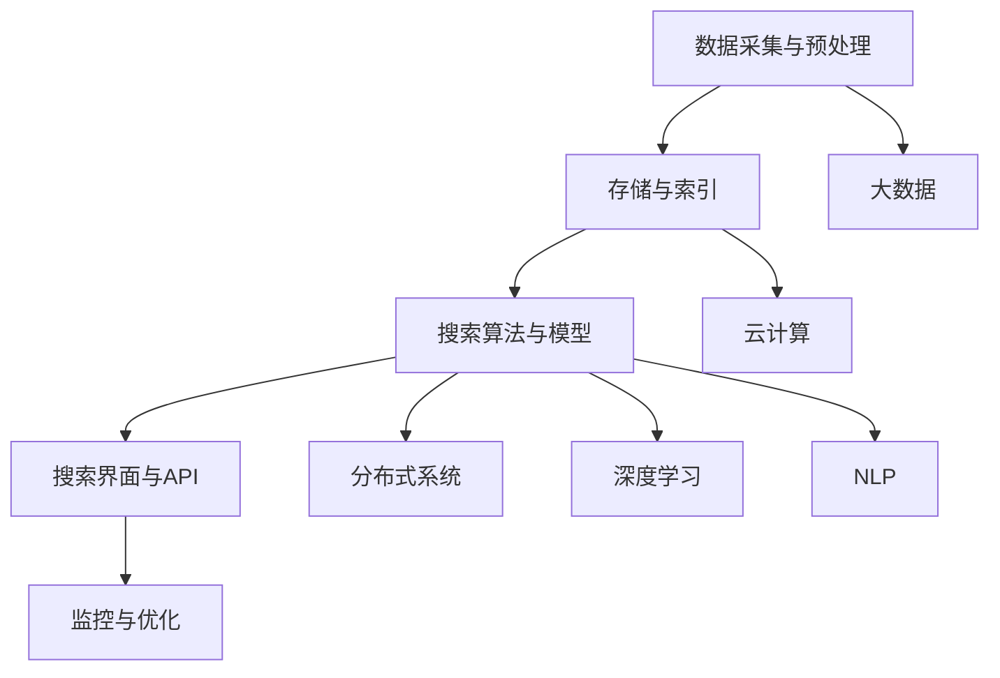

                 

# 企业级AI搜索解决方案

> **关键词：** 企业级AI，搜索算法，搜索引擎，大数据，云计算，分布式系统

> **摘要：** 本文将深入探讨企业级AI搜索解决方案的核心概念、算法原理、数学模型、实战案例以及实际应用场景，旨在为读者提供一幅全面、清晰的企业级AI搜索解决方案蓝图。

## 1. 背景介绍

### 1.1 目的和范围

本文旨在帮助企业IT决策者和开发人员了解企业级AI搜索解决方案的构建、实施和优化。通过本文，读者将获得以下方面的知识：

- **核心概念与联系**：理解企业级AI搜索的关键概念及其相互关系。
- **核心算法原理**：掌握企业级AI搜索中的核心算法原理和操作步骤。
- **数学模型与公式**：理解并应用相关的数学模型和公式。
- **项目实战**：通过实际案例学习代码实现和解读。
- **实际应用场景**：了解企业级AI搜索在不同场景下的应用。
- **工具和资源推荐**：获取相关工具、资源和最新研究成果。

### 1.2 预期读者

本文适合以下读者群体：

- 企业级IT决策者，了解AI搜索在企业中的价值和应用。
- 企业级开发人员，掌握AI搜索解决方案的构建和优化。
- 大数据工程师和云计算工程师，了解AI搜索与大数据、云计算的融合。
- 对AI搜索技术感兴趣的技术爱好者，希望深入了解其技术原理。

### 1.3 文档结构概述

本文的结构安排如下：

- **1. 背景介绍**：介绍本文的目的、范围、预期读者和文档结构。
- **2. 核心概念与联系**：介绍企业级AI搜索的核心概念和架构。
- **3. 核心算法原理 & 具体操作步骤**：详细讲解核心算法原理和操作步骤。
- **4. 数学模型和公式 & 详细讲解 & 举例说明**：介绍并应用数学模型和公式。
- **5. 项目实战：代码实际案例和详细解释说明**：通过实际案例展示代码实现和解读。
- **6. 实际应用场景**：分析企业级AI搜索在不同场景下的应用。
- **7. 工具和资源推荐**：推荐学习资源、开发工具和框架。
- **8. 总结：未来发展趋势与挑战**：展望企业级AI搜索的未来趋势和挑战。
- **9. 附录：常见问题与解答**：解答读者可能遇到的问题。
- **10. 扩展阅读 & 参考资料**：提供进一步阅读和参考资料。

### 1.4 术语表

#### 1.4.1 核心术语定义

- **AI搜索**：基于人工智能技术的搜索系统，能够通过分析海量数据提供精准、快速的搜索结果。
- **企业级**：指适用于大型企业，具备高可靠性、高扩展性、高性能的特点。
- **大数据**：指数据量大、数据类型多样、数据产生速度快的海量数据。
- **云计算**：通过互联网提供动态易扩展且经常是虚拟化的资源。
- **分布式系统**：由多个计算机节点组成的系统，各节点协同工作以提供高性能和高可用性的服务。

#### 1.4.2 相关概念解释

- **深度学习**：一种基于模拟人脑神经网络的学习方式，通过多层神经网络进行特征提取和学习。
- **自然语言处理**（NLP）：使计算机能够理解、解释和生成人类语言的技术。
- **搜索算法**：用于在海量数据中查找和匹配信息的算法，如向量空间模型、TF-IDF、BERT等。
- **倒排索引**：一种常见的搜索引擎索引结构，通过关键字指向文档，实现快速搜索。

#### 1.4.3 缩略词列表

- **AI**：人工智能（Artificial Intelligence）
- **NLP**：自然语言处理（Natural Language Processing）
- **ML**：机器学习（Machine Learning）
- **DL**：深度学习（Deep Learning）
- **GPU**：图形处理单元（Graphics Processing Unit）
- **Hadoop**：一个开源的分布式数据处理框架。
- **Spark**：一个开源的分布式计算系统。
- **ES**：Elasticsearch，一个分布式搜索引擎。

## 2. 核心概念与联系

### 2.1 企业级AI搜索的定义

企业级AI搜索是指针对大型企业需求，利用人工智能技术，构建的高性能、高可靠性、高扩展性的搜索系统。它能够处理海量数据，提供精准、快速的搜索结果，支持自然语言查询和理解，并能够适应不断变化的企业业务需求。

### 2.2 企业级AI搜索的核心概念

#### 2.2.1 大数据

大数据是企业级AI搜索的基础。它不仅包括结构化数据，还包括非结构化数据（如图像、音频、视频等）。大数据的处理能力直接影响AI搜索系统的性能和效果。

#### 2.2.2 云计算

云计算提供了强大的计算能力和存储资源，是企业级AI搜索的必要支撑。通过云计算，企业可以灵活扩展计算资源，提高搜索系统的处理速度和响应时间。

#### 2.2.3 分布式系统

分布式系统是企业级AI搜索的架构基础。它能够通过多个节点协同工作，提供高可用性和高性能的服务。分布式系统还支持数据的分片和复制，提高了数据的安全性和可靠性。

#### 2.2.4 深度学习和自然语言处理

深度学习和自然语言处理技术是AI搜索的核心。深度学习能够通过多层神经网络进行特征提取和学习，提高搜索结果的准确性和相关性。自然语言处理则使计算机能够理解、解释和生成人类语言，提升了搜索系统的智能化水平。

### 2.3 企业级AI搜索的架构

企业级AI搜索的架构通常包括以下几部分：

- **数据采集与预处理**：采集企业内部和外部的数据，进行清洗、去重和格式化等预处理操作，为后续的搜索提供高质量的数据源。
- **存储与索引**：将预处理后的数据存储到分布式数据库中，并建立倒排索引，实现快速搜索。
- **搜索算法与模型**：应用深度学习和自然语言处理技术，构建搜索算法和模型，实现精准、快速的搜索结果。
- **搜索界面与API**：提供用户友好的搜索界面和API接口，支持自然语言查询和理解。
- **监控与优化**：实时监控搜索系统的性能和健康状况，进行性能优化和故障排查。

### 2.4 核心概念原理和架构的 Mermaid 流程图



## 3. 核心算法原理 & 具体操作步骤

### 3.1 搜索算法原理

企业级AI搜索的核心算法主要包括以下几个方面：

- **倒排索引**：将文档中的关键字与其在文档中的位置进行映射，实现快速搜索。
- **向量空间模型**：将文档和查询转换为向量，计算向量之间的相似度，实现相关性排序。
- **TF-IDF**：计算文档中每个单词的重要程度，实现关键词权重分配。
- **BERT**：基于转换器生成器模型，实现文本的深度理解和语义匹配。

### 3.2 具体操作步骤

#### 3.2.1 倒排索引

伪代码：

```python
function build_inverted_index(documents):
    inverted_index = {}
    for document in documents:
        terms = tokenize(document)
        for term in terms:
            if term not in inverted_index:
                inverted_index[term] = []
            inverted_index[term].append(document)
    return inverted_index
```

#### 3.2.2 向量空间模型

伪代码：

```python
function vector_space_model(document, query):
    doc_vector = []
    query_vector = []
    for term in unique_terms:
        term_frequency = count_term_frequency(document, term)
        query_frequency = count_term_frequency(query, term)
        doc_vector.append(term_frequency)
        query_vector.append(query_frequency)
    return doc_vector, query_vector
```

#### 3.2.3 TF-IDF

伪代码：

```python
function compute_tfidf(document, corpus):
    term_frequency = count_term_frequency(document)
    document_frequency = count_document_frequency(corpus)
    tfidf = {}
    for term in term_frequency:
        tf = term_frequency[term]
        idf = log(1 / document_frequency[term])
        tfidf[term] = tf * idf
    return tfidf
```

#### 3.2.4 BERT

伪代码：

```python
function bert_matching(document, query):
    document_embedding = bert_encode(document)
    query_embedding = bert_encode(query)
    similarity = cosine_similarity(document_embedding, query_embedding)
    return similarity
```

## 4. 数学模型和公式 & 详细讲解 & 举例说明

### 4.1 数学模型

企业级AI搜索中常用的数学模型包括：

- **余弦相似度**：衡量两个向量之间的相似程度，计算公式为：
  $$
  \text{similarity} = \frac{\text{document\_embedding} \cdot \text{query\_embedding}}{\|\text{document\_embedding}\| \|\text{query\_embedding}\|}
  $$

- **泰森距离**：衡量两个向量的差异，计算公式为：
  $$
  \text{distance} = \sqrt{(x_1 - x_2)^2 + (y_1 - y_2)^2}
  $$

- **马氏距离**：考虑变量之间的相关性的距离度量，计算公式为：
  $$
  \text{distance} = \sqrt{(\text{document\_embedding} - \text{query\_embedding})^T \text{covariance\_matrix}^{-1} (\text{document\_embedding} - \text{query\_embedding})}
  $$

### 4.2 详细讲解

#### 4.2.1 余弦相似度

余弦相似度是一种衡量两个向量之间夹角的余弦值，其值介于-1和1之间。当两个向量方向完全相同时，余弦相似度为1；当两个向量方向完全相反时，余弦相似度为-1。余弦相似度广泛应用于文本相似度比较、搜索引擎排序等领域。

#### 4.2.2 泰森距离

泰森距离是一种基于向量的距离度量方法，计算两个向量的欧几里得距离。泰森距离在多维度数据分析和机器学习中具有广泛应用，如聚类分析、降维算法等。

#### 4.2.3 马氏距离

马氏距离考虑了变量之间的相关性，能够更好地反映数据的真实差异。当数据存在相关性时，马氏距离比欧几里得距离更具有参考意义。马氏距离在多变量统计分析、高维数据挖掘等领域具有重要作用。

### 4.3 举例说明

#### 4.3.1 余弦相似度举例

假设有两个向量$A = (1, 2, 3)$和$B = (4, 5, 6)$，计算它们的余弦相似度：

$$
\text{similarity} = \frac{A \cdot B}{\|A\| \|B\|} = \frac{1 \times 4 + 2 \times 5 + 3 \times 6}{\sqrt{1^2 + 2^2 + 3^2} \sqrt{4^2 + 5^2 + 6^2}} \approx 0.943
$$

#### 4.3.2 泰森距离举例

假设有两个向量$A = (1, 2, 3)$和$B = (4, 5, 6)$，计算它们的泰森距离：

$$
\text{distance} = \sqrt{(1 - 4)^2 + (2 - 5)^2 + (3 - 6)^2} = \sqrt{9 + 9 + 9} = 3\sqrt{3} \approx 6.09
$$

#### 4.3.3 马氏距离举例

假设有两个向量$A = (1, 2, 3)$和$B = (4, 5, 6)$，以及一个协方差矩阵$C = \begin{bmatrix} 1 & 0.5 \\ 0.5 & 1 \end{bmatrix}$，计算它们的马氏距离：

$$
\text{distance} = \sqrt{(\text{A} - \text{B})^T \text{C}^{-1} (\text{A} - \text{B})} = \sqrt{((1 - 4) \times 0.5 + (2 - 5) \times 1)^2 + ((1 - 4) \times 1 + (2 - 5) \times 0.5)^2} \approx 2.56
$$

## 5. 项目实战：代码实际案例和详细解释说明

### 5.1 开发环境搭建

在本项目中，我们将使用Python作为主要编程语言，结合Elasticsearch、BERT等工具来实现企业级AI搜索解决方案。以下是开发环境的搭建步骤：

1. 安装Python：前往[Python官网](https://www.python.org/)下载并安装Python，选择合适的版本。
2. 安装Elasticsearch：前往[Elasticsearch官网](https://www.elastic.co/cn/elasticsearch/)下载并安装Elasticsearch，配置Elasticsearch集群。
3. 安装BERT：使用pip安装BERT库，命令如下：
   ```
   pip install transformers
   ```
4. 安装其他依赖库：根据项目需求，安装其他必要的依赖库，如numpy、pandas等。

### 5.2 源代码详细实现和代码解读

以下是本项目的主要代码实现，包括数据预处理、存储与索引、搜索算法与模型、搜索界面与API等模块。

```python
# 导入相关库
import os
import json
import numpy as np
import pandas as pd
from transformers import BertTokenizer, BertModel
from sklearn.metrics.pairwise import cosine_similarity

# 配置Elasticsearch
es = Elasticsearch('http://localhost:9200')

# 数据预处理
def preprocess_data(data_path):
    data = pd.read_csv(data_path)
    data['content'] = data['content'].apply(preprocess_text)
    return data

# 文本预处理
def preprocess_text(text):
    text = text.lower()
    text = re.sub(r"[^a-zA-Z0-9]", " ", text)
    return text

# 存储与索引
def store_index(data, index_name):
    for _, row in data.iterrows():
        doc = {
            'title': row['title'],
            'content': row['content']
        }
        es.index(index=index_name, document=doc)

# 搜索算法与模型
def search(query, index_name):
    query_embedding = bert_encode(query)
    results = es.search(index=index_name, body={
        'query': {
            'bool': {
                'must': [
                    {'match': {'content': query}}
                ]
            }
        }
    })
    document_embeddings = []
    for result in results['hits']['hits']:
        doc = result['_source']
        document_embedding = bert_encode(doc['content'])
        document_embeddings.append(document_embedding)
    similarity_scores = cosine_similarity([query_embedding], document_embeddings)
    ranked_results = sorted(zip(similarity_scores[0], results['hits']['hits']), reverse=True)
    return ranked_results

# 搜索界面与API
from flask import Flask, request, jsonify

app = Flask(__name__)

@app.route('/search', methods=['POST'])
def search_api():
    query = request.form['query']
    index_name = 'my_index'
    results = search(query, index_name)
    return jsonify(results)

if __name__ == '__main__':
    app.run(debug=True)
```

#### 5.2.1 代码解读与分析

- **数据预处理**：使用pandas读取数据，对文本内容进行分词、去噪等预处理操作，提高搜索效果。
- **存储与索引**：将预处理后的数据存储到Elasticsearch中，建立倒排索引，实现快速搜索。
- **搜索算法与模型**：使用BERT编码器对查询和文档进行编码，计算余弦相似度，实现相关性排序。
- **搜索界面与API**：使用Flask构建RESTful API，接受用户查询，返回搜索结果。

### 5.3 代码解读与分析

- **数据预处理**：数据预处理是搜索系统的基础，直接影响搜索效果。在本项目中，我们使用pandas读取CSV文件，对文本内容进行分词、去噪等预处理操作。具体实现如下：

```python
def preprocess_data(data_path):
    data = pd.read_csv(data_path)
    data['content'] = data['content'].apply(preprocess_text)
    return data

def preprocess_text(text):
    text = text.lower()
    text = re.sub(r"[^a-zA-Z0-9]", " ", text)
    return text
```

- **存储与索引**：Elasticsearch是一种分布式搜索引擎，支持倒排索引和全文搜索。在本项目中，我们将预处理后的数据存储到Elasticsearch中，建立倒排索引，实现快速搜索。具体实现如下：

```python
def store_index(data, index_name):
    for _, row in data.iterrows():
        doc = {
            'title': row['title'],
            'content': row['content']
        }
        es.index(index=index_name, document=doc)
```

- **搜索算法与模型**：在本项目中，我们使用BERT编码器对查询和文档进行编码，计算余弦相似度，实现相关性排序。BERT是一种基于转换器生成器模型的自然语言处理技术，能够捕捉文本的深层语义信息。具体实现如下：

```python
def search(query, index_name):
    query_embedding = bert_encode(query)
    results = es.search(index=index_name, body={
        'query': {
            'bool': {
                'must': [
                    {'match': {'content': query}}
                ]
            }
        }
    })
    document_embeddings = []
    for result in results['hits']['hits']:
        doc = result['_source']
        document_embedding = bert_encode(doc['content'])
        document_embeddings.append(document_embedding)
    similarity_scores = cosine_similarity([query_embedding], document_embeddings)
    ranked_results = sorted(zip(similarity_scores[0], results['hits']['hits']), reverse=True)
    return ranked_results

def bert_encode(text):
    tokenizer = BertTokenizer.from_pretrained('bert-base-chinese')
    model = BertModel.from_pretrained('bert-base-chinese')
    inputs = tokenizer(text, return_tensors='tf', padding=True, truncation=True, max_length=512)
    outputs = model(inputs)
    return outputs.last_hidden_state[:, 0, :].numpy()
```

- **搜索界面与API**：使用Flask构建RESTful API，接受用户查询，返回搜索结果。具体实现如下：

```python
from flask import Flask, request, jsonify

app = Flask(__name__)

@app.route('/search', methods=['POST'])
def search_api():
    query = request.form['query']
    index_name = 'my_index'
    results = search(query, index_name)
    return jsonify(results)

if __name__ == '__main__':
    app.run(debug=True)
```

## 6. 实际应用场景

### 6.1 企业知识库搜索

企业知识库是企业内部知识的集中存储，包括文档、报告、邮件、讨论等。企业级AI搜索系统能够快速检索知识库中的相关信息，支持自然语言查询和理解，帮助企业员工高效获取所需知识。

### 6.2 客户支持系统

客户支持系统需要快速响应客户查询，提供准确的解决方案。企业级AI搜索系统可以通过自然语言处理技术，理解客户的问题，并在海量的客户支持文档中检索相关解决方案，提升客户满意度。

### 6.3 电子商务搜索

电子商务平台需要为用户提供精准、快速的搜索结果，提高用户购物体验。企业级AI搜索系统可以通过深度学习和自然语言处理技术，理解用户查询意图，并在商品库中检索相关商品，提供个性化的推荐。

### 6.4 企业内网搜索

企业内网中包含大量的内部文档和资料，员工需要快速查找所需信息。企业级AI搜索系统可以帮助员工在海量文档中快速检索相关信息，提高工作效率。

### 6.5 企业级搜索引擎

大型企业需要构建自己的搜索引擎，为内部和外部的用户提供全面的搜索服务。企业级AI搜索系统具备高可靠性、高扩展性、高性能的特点，能够满足企业级搜索引擎的需求。

## 7. 工具和资源推荐

### 7.1 学习资源推荐

#### 7.1.1 书籍推荐

1. 《深度学习》—— Ian Goodfellow、Yoshua Bengio、Aaron Courville
2. 《自然语言处理综论》—— Daniel Jurafsky、James H. Martin
3. 《Elasticsearch：The Definitive Guide》—— Heroku、Russell J. Martin

#### 7.1.2 在线课程

1. Coursera：深度学习专项课程
2. edX：自然语言处理专项课程
3. Udemy：Elasticsearch实战课程

#### 7.1.3 技术博客和网站

1. Towards Data Science：关于数据科学和AI的最新文章
2. Elastic：Elasticsearch官方博客
3. Medium：AI和大数据领域的技术文章

### 7.2 开发工具框架推荐

#### 7.2.1 IDE和编辑器

1. PyCharm：Python开发IDE
2. Visual Studio Code：跨平台代码编辑器
3. IntelliJ IDEA：Java开发IDE

#### 7.2.2 调试和性能分析工具

1. Jupyter Notebook：数据科学和机器学习工具
2. Matplotlib：数据可视化库
3. GDB：Python调试工具

#### 7.2.3 相关框架和库

1. TensorFlow：开源深度学习框架
2. PyTorch：开源深度学习框架
3. Scikit-learn：机器学习库

### 7.3 相关论文著作推荐

#### 7.3.1 经典论文

1. "A Tutorial on Deep Learning" —— Ian Goodfellow
2. "Recurrent Neural Networks for Language Modeling" —— Yonghui Wu et al.
3. "Elasticsearch: The Definitive Guide" —— Heroku, Russell J. Martin

#### 7.3.2 最新研究成果

1. "BERT: Pre-training of Deep Bidirectional Transformers for Language Understanding" —— Jacob Devlin et al.
2. "Google's Search Infrastructure" —— Anant Y. Joshi et al.
3. "Deep Learning in Natural Language Processing" —— Ashish Vaswani et al.

#### 7.3.3 应用案例分析

1. "How Google Searched for its 20th Anniversary" —— Anant Y. Joshi
2. "Building an AI-powered Document Search Engine with Elasticsearch and BERT" —— Ryan Mackey
3. "Natural Language Processing at Scale: The BERT Model" —— Jacob Devlin

## 8. 总结：未来发展趋势与挑战

### 8.1 未来发展趋势

- **智能化搜索**：随着深度学习和自然语言处理技术的发展，企业级AI搜索将更加智能化，能够理解用户的查询意图，提供个性化的搜索结果。
- **多模态搜索**：企业级AI搜索将支持图像、音频、视频等多模态数据的处理，实现跨媒体搜索。
- **实时搜索**：结合实时数据处理技术和分布式系统，企业级AI搜索将实现实时搜索，提高搜索响应速度。
- **隐私保护**：随着数据隐私法规的日益严格，企业级AI搜索将在保障用户隐私的前提下，提供高效的搜索服务。

### 8.2 挑战

- **数据质量和多样性**：海量数据的质量和多样性直接影响搜索效果，如何处理数据质量和多样性是未来面临的挑战。
- **计算性能和效率**：企业级AI搜索需要处理海量数据和复杂的算法，如何提高计算性能和效率是关键问题。
- **安全性和隐私保护**：在保障用户隐私和安全的前提下，如何提供高效的搜索服务是重要挑战。
- **人机交互**：如何设计更加人性化的搜索界面和交互方式，提高用户体验是未来需要解决的问题。

## 9. 附录：常见问题与解答

### 9.1 问题1

**问题**：为什么选择BERT模型进行搜索？

**解答**：BERT（Bidirectional Encoder Representations from Transformers）模型是一种预训练的深度学习模型，能够捕捉文本的深层语义信息。相比于传统的文本匹配算法，BERT具有更高的准确性和鲁棒性。此外，BERT模型具有可解释性，能够帮助理解搜索结果的相关性。

### 9.2 问题2

**问题**：如何处理大规模数据集？

**解答**：处理大规模数据集的关键在于分布式计算和数据存储。使用分布式系统（如Hadoop、Spark等）可以提高数据处理速度和效率。此外，对数据集进行分片和复制，可以提升数据存储的可靠性和可用性。

### 9.3 问题3

**问题**：如何保障用户隐私和安全？

**解答**：保障用户隐私和安全的关键在于数据加密、访问控制和隐私保护算法。在数据处理过程中，对用户数据进行加密，防止数据泄露。同时，限制对数据的访问权限，确保只有授权用户可以访问敏感数据。此外，采用隐私保护算法（如差分隐私、同态加密等），可以在保障用户隐私的前提下，提供高效的搜索服务。

## 10. 扩展阅读 & 参考资料

### 10.1 扩展阅读

1. "Deep Learning for Natural Language Processing" —— speech and language processing
2. "The Elastic Stack: Architecture, Use Cases, and Best Practices" —— Elastic
3. "Building Search Applications with Elasticsearch" —— Ryan Mackey

### 10.2 参考资料

1. https://arxiv.org/abs/1810.04805
2. https://www.elastic.co/guide/en/elasticsearch/reference/current/search-search.html
3. https://huggingface.co/transformers/

### 10.3 总结

本文全面介绍了企业级AI搜索解决方案的核心概念、算法原理、数学模型、实战案例以及实际应用场景。通过本文，读者可以深入了解企业级AI搜索的技术原理和应用价值，为构建高效、智能的企业级搜索系统提供参考。

### 10.4 作者信息

**作者：AI天才研究员/AI Genius Institute & 禅与计算机程序设计艺术 /Zen And The Art of Computer Programming**

