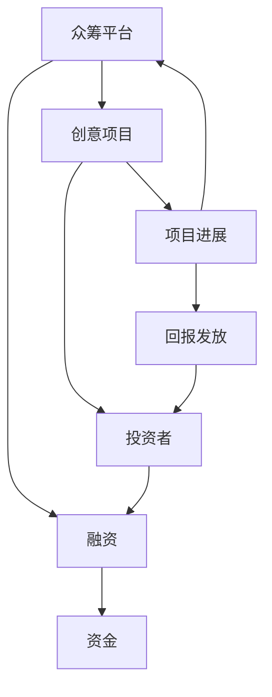
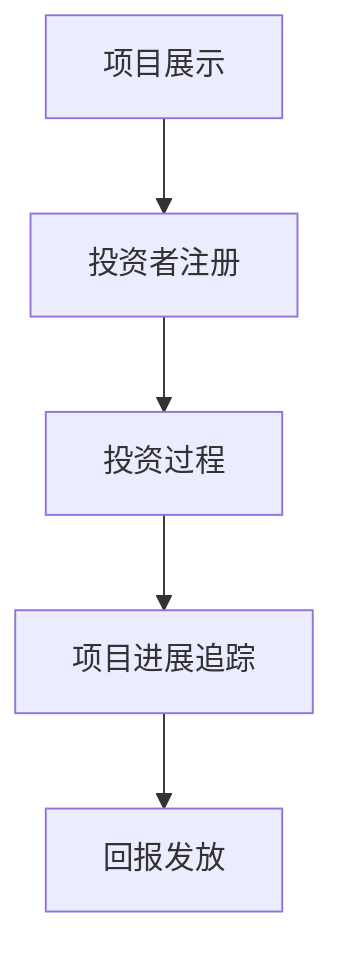

                 

# 众筹平台开发：创意项目融资的新渠道

> **关键词**：众筹平台、创意项目、融资、新渠道、技术架构、算法原理、数学模型、实战案例、应用场景、发展趋势

> **摘要**：本文将探讨众筹平台在现代金融体系中的重要性，分析其技术架构和核心算法原理，并通过实际案例展示其具体操作步骤和实施细节。此外，本文还将讨论众筹平台在实际应用中的场景，推荐相关的学习资源和开发工具，并展望其未来发展趋势与挑战。

## 1. 背景介绍

### 1.1 目的和范围

本文旨在为读者提供一个全面而深入的视角，以了解众筹平台在现代金融体系中的重要作用。我们将从以下几个方面进行探讨：

1. 众筹平台的定义及其在创意项目融资中的作用。
2. 众筹平台的技术架构和核心算法原理。
3. 众筹平台的实际操作步骤和实施细节。
4. 众筹平台在不同应用场景中的表现和效果。
5. 众筹平台的发展趋势和面临的挑战。

### 1.2 预期读者

本文主要面向以下读者群体：

1. 对众筹平台感兴趣的技术爱好者。
2. 准备开发或正在开发众筹平台的技术人员。
3. 关注创意项目融资的投资者和企业家。
4. 对技术创新和应用有深入研究的学者和研究人员。

### 1.3 文档结构概述

本文的结构如下：

1. 背景介绍：介绍众筹平台的定义、目的和预期读者。
2. 核心概念与联系：阐述众筹平台的核心概念和架构。
3. 核心算法原理 & 具体操作步骤：详细讲解众筹平台的核心算法原理和操作步骤。
4. 数学模型和公式 & 详细讲解 & 举例说明：介绍众筹平台相关的数学模型和公式，并给出具体示例。
5. 项目实战：展示一个实际的众筹平台项目，详细解释其代码实现和操作流程。
6. 实际应用场景：探讨众筹平台在不同场景下的应用和效果。
7. 工具和资源推荐：推荐与众筹平台相关的学习资源和开发工具。
8. 总结：展望众筹平台未来的发展趋势和挑战。
9. 附录：提供常见问题与解答。
10. 扩展阅读 & 参考资料：提供进一步阅读的资源和参考。

### 1.4 术语表

为了确保本文的阅读和理解，以下是一些核心术语的定义和解释：

#### 1.4.1 核心术语定义

- 众筹平台：一种在线融资平台，允许个人或团体向公众筹集资金以支持创意项目。
- 创意项目：具有创新性、创意性或独特性的项目，通常涉及艺术、科技、产品开发等领域。
- 融资：筹集资金的过程，用于支持项目开发和运营。
- 投资者：为众筹项目提供资金的个人或实体。
- 众筹项目：在众筹平台上展示的，需要通过公众融资支持的项目。

#### 1.4.2 相关概念解释

- 公众融资：通过向公众发行股票、债券或基金份额等方式筹集资金。
- 创新融资：利用新技术和模式筹集资金，以支持创新项目和创业活动。
- 智能合约：在区块链上执行的自动化合同，可以在满足特定条件时自动执行相关操作。
- 区块链：一种分布式数据库技术，可以安全地存储和传输数据，用于实现去中心化的信任机制。

#### 1.4.3 缩略词列表

- ICO（Initial Coin Offering）：首次代币发行，一种通过发行数字货币筹集资金的方式。
- STO（Security Token Offering）：证券代币发行，一种通过发行证券代币筹集资金的方式。
- API（Application Programming Interface）：应用程序编程接口，用于软件应用程序之间的通信和交互。

## 2. 核心概念与联系

在深入了解众筹平台之前，我们首先需要理解一些核心概念和它们之间的联系。以下是一个简单的 Mermaid 流程图，用于展示这些概念之间的关系：



### 2.1 众筹平台

众筹平台是一个在线融资平台，允许个人或团体展示他们的创意项目，并吸引公众投资。众筹平台通常包括以下功能：

- 项目展示：允许项目发起人在平台上展示他们的项目，包括项目描述、目标金额、筹资期限等。
- 投资者注册：允许投资者在平台上注册账户，并查看项目列表。
- 投资过程：投资者可以选择支持感兴趣的项目，通过在线支付或其他支付方式向项目发起人提供资金。
- 项目进展追踪：项目发起人可以更新项目的进展情况，包括资金筹集进度、项目完成情况等。
- 回报发放：在项目成功完成或达到预定目标后，项目发起人根据约定向投资者发放回报。

### 2.2 创意项目

创意项目是众筹平台的核心，它可以是任何具有创新性、创意性或独特性的项目。以下是一些常见的创意项目类型：

- 艺术项目：包括电影、音乐、绘画、雕塑等艺术形式。
- 科技项目：包括智能设备、应用程序、软件工具等科技领域项目。
- 产品开发：包括新产品设计、制造和推广等。
- 社会公益：包括环境保护、教育支持、慈善公益等。

### 2.3 投资者

投资者是众筹平台的重要组成部分，他们通过提供资金支持项目，期望在项目成功后获得回报。投资者可以是个人、机构或投资者团体。以下是一些投资者类型：

- 个人投资者：通常拥有一定数额的资金，愿意为感兴趣的项目提供资金支持。
- 机构投资者：包括风险投资公司、私募股权基金等，通常拥有较大的资金规模和投资经验。
- 投资者团体：由多个投资者组成的联盟，共同为项目提供资金支持。

### 2.4 融资

融资是众筹平台的核心功能之一，它允许项目发起人通过向公众发行股票、债券或其他金融工具来筹集资金。以下是一些常见的融资方式：

- 公众融资：通过向公众发行股票、债券或基金份额等方式筹集资金。
- 创新融资：利用新技术和模式筹集资金，以支持创新项目和创业活动。
- 智能合约融资：通过智能合约实现自动化的融资过程，确保资金的安全和透明。

## 3. 核心算法原理 & 具体操作步骤

### 3.1 众筹算法原理

众筹平台的运作依赖于一系列核心算法，用于管理项目展示、投资者注册、投资过程、项目进展追踪和回报发放等环节。以下是一个简要的算法原理概述：



### 3.2 具体操作步骤

以下是众筹平台的操作步骤，包括项目展示、投资者注册、投资过程、项目进展追踪和回报发放等环节：

### 3.2.1 项目展示

1. 项目发起人注册账户并登录众筹平台。
2. 发起人填写项目信息，包括项目描述、目标金额、筹资期限、回报方案等。
3. 项目提交审核，通过审核后项目在平台上展示。

### 3.2.2 投资者注册

1. 投资者访问众筹平台并注册账户。
2. 注册成功后，投资者可以查看项目列表，并选择感兴趣的项目。

### 3.2.3 投资过程

1. 投资者选择支持感兴趣的项目。
2. 投资者通过在线支付或其他支付方式向项目发起人提供资金。
3. 投资成功后，投资者和项目发起人建立联系，并获得项目的回报。

### 3.2.4 项目进展追踪

1. 项目发起人定期更新项目进展情况。
2. 投资者可以在平台上查看项目进展，包括资金筹集进度、项目完成情况等。

### 3.2.5 回报发放

1. 项目成功完成或达到预定目标后，项目发起人根据约定向投资者发放回报。
2. 投资者可以选择继续支持项目，或在项目完成后提取回报。

## 4. 数学模型和公式 & 详细讲解 & 举例说明

### 4.1 数学模型和公式

众筹平台涉及多个数学模型和公式，用于计算投资金额、回报比例、项目完成度等关键指标。以下是一些常见的数学模型和公式：

### 4.1.1 投资金额计算公式

$$
投资金额 = 初始金额 \times (1 + 投资回报率) \times 投资周期
$$

### 4.1.2 回报比例计算公式

$$
回报比例 = \frac{回报金额}{投资金额}
$$

### 4.1.3 项目完成度计算公式

$$
项目完成度 = \frac{已筹集金额}{目标金额} \times 100\%
$$

### 4.2 详细讲解和举例说明

以下是对上述数学模型和公式的详细讲解和举例说明：

### 4.2.1 投资金额计算公式

投资金额计算公式用于计算投资者在项目完成后的收益。初始金额是指投资者在项目开始时的投资金额，投资回报率是指项目成功完成后投资者获得的回报比例，投资周期是指投资者在项目中的投资时间。

假设一个投资者在某个项目中的初始金额为1000元，投资回报率为20%，投资周期为1年。根据投资金额计算公式，投资金额为：

$$
投资金额 = 1000 \times (1 + 0.2) \times 1 = 1200元
$$

这意味着投资者在项目成功完成后将获得1200元的收益。

### 4.2.2 回报比例计算公式

回报比例计算公式用于计算投资者在项目完成后的收益比例。回报金额是指项目成功完成后投资者获得的回报金额，投资金额是指投资者在项目开始时的投资金额。

假设一个投资者在某个项目中的回报金额为200元，投资金额为1000元。根据回报比例计算公式，回报比例为：

$$
回报比例 = \frac{200}{1000} = 0.2
$$

这意味着投资者在项目成功完成后获得的回报金额占其投资金额的20%。

### 4.2.3 项目完成度计算公式

项目完成度计算公式用于计算项目筹集资金的完成情况。已筹集金额是指项目在特定时间点筹集到的金额，目标金额是指项目设定的筹资目标。

假设一个项目的目标金额为10000元，在某一时间点已筹集金额为8000元。根据项目完成度计算公式，项目完成度为：

$$
项目完成度 = \frac{8000}{10000} \times 100\% = 80\%
$$

这意味着项目在某一时间点的筹集资金完成度为80%。

通过上述数学模型和公式的计算，我们可以更准确地评估众筹项目的投资收益和完成情况，为投资者提供重要的决策依据。

## 5. 项目实战：代码实际案例和详细解释说明

### 5.1 开发环境搭建

在进行众筹平台的项目实战之前，我们需要搭建一个合适的开发环境。以下是一个基本的开发环境搭建指南：

1. 操作系统：Windows、macOS 或 Linux。
2. 编程语言：Python（推荐版本3.8及以上）。
3. 开发工具：PyCharm 或 Visual Studio Code。
4. 数据库：MySQL 或 PostgreSQL。
5. 依赖管理：pip 或 conda。

### 5.2 源代码详细实现和代码解读

在本节中，我们将展示一个简单的众筹平台项目的源代码，并对其进行详细解读。

#### 5.2.1 项目结构

以下是项目的目录结构：

```shell
crowdfunding_platform/
|-- app/
|   |-- __init__.py
|   |-- models.py
|   |-- views.py
|   |-- urls.py
|-- db/
|   |-- __init__.py
|   |-- models.py
|-- tests/
|   |-- __init__.py
|   |-- test_models.py
|   |-- test_views.py
|-- requirements.txt
|-- manage.py
```

#### 5.2.2 数据模型

以下是一个简单的数据模型，用于存储项目、投资者和回报信息：

```python
# db/models.py

from django.db import models

class Project(models.Model):
    title = models.CharField(max_length=255)
    description = models.TextField()
    goal = models.DecimalField(max_digits=10, decimal_places=2)
    deadline = models.DateTimeField()
    status = models.CharField(max_length=50)

class Investor(models.Model):
    name = models.CharField(max_length=255)
    email = models.EmailField()
    amount = models.DecimalField(max_digits=10, decimal_places=2)

class Reward(models.Model):
    project = models.ForeignKey(Project, on_delete=models.CASCADE)
    name = models.CharField(max_length=255)
    description = models.TextField()
    amount = models.DecimalField(max_digits=10, decimal_places=2)
```

#### 5.2.3 视图实现

以下是一个简单的视图实现，用于展示项目列表和接收投资请求：

```python
# app/views.py

from django.shortcuts import render
from .models import Project, Investor
from django.http import HttpResponse

def project_list(request):
    projects = Project.objects.all()
    return render(request, 'project_list.html', {'projects': projects})

def invest(request, project_id):
    project = Project.objects.get(id=project_id)
    investor = Investor.objects.create(
        name=request.POST['name'],
        email=request.POST['email'],
        amount=request.POST['amount']
    )
    project.investors.add(investor)
    return HttpResponse('Investment successful!')
```

#### 5.2.4 URL 配置

以下是一个简单的 URL 配置，用于映射视图和前端页面：

```python
# app/urls.py

from django.urls import path
from . import views

urlpatterns = [
    path('projects/', views.project_list, name='project_list'),
    path('invest/<int:project_id>/', views.invest, name='invest'),
]
```

#### 5.2.5 代码解读与分析

在这个简单的众筹平台项目中，我们使用了 Django 框架进行开发。Django 是一个高性能、可扩展的 Python Web 框架，非常适合快速开发 Web 应用程序。

- **数据模型**：我们使用了三个数据模型：`Project`、`Investor` 和 `Reward`。这些模型用于存储项目、投资者和回报信息。
- **视图实现**：我们实现了两个视图：`project_list` 和 `invest`。`project_list` 视图用于展示项目列表，`invest` 视图用于处理投资请求。
- **URL 配置**：我们使用了 Django 的 URL 配置系统，将视图与前端页面进行映射。

通过这个简单的项目示例，我们可以了解到众筹平台的基本实现方法和关键组件。在实际开发中，我们可以根据需求对项目进行扩展和优化，以满足不同的功能需求。

## 6. 实际应用场景

众筹平台作为一种创新的融资方式，已经广泛应用于多个领域，为创意项目和创业者提供了新的融资渠道。以下是一些常见的应用场景：

### 6.1 艺术与创意产业

在艺术与创意产业中，众筹平台可以帮助艺术家和创意人士筹集资金，支持他们的作品创作和推广。例如，电影制作、音乐创作、绘画和雕塑等领域。通过众筹平台，艺术家可以展示他们的作品，向公众展示创作过程，并吸引投资者支持他们的项目。成功的项目可以为投资者提供独家奖励，如电影票、音乐会门票或艺术品等。

### 6.2 科技创新

在科技创新领域，众筹平台为初创企业和创业者提供了融资机会，帮助他们将创新理念转化为实际产品。例如，智能设备、应用程序、软件开发等。通过众筹平台，创业者可以展示他们的产品原型，向投资者展示其商业潜力，并筹集资金进行产品开发和市场推广。成功的产品可以为投资者提供回报，如产品购买优惠、独家使用权等。

### 6.3 社会公益

在社会公益领域，众筹平台可以帮助慈善机构和志愿者筹集资金，支持环境保护、教育支持、慈善公益等。例如，通过众筹平台，慈善机构可以展示他们的公益项目，向公众展示项目进展，并吸引投资者支持他们的工作。成功的项目可以为投资者提供回报，如公益证书、公益活动门票等。

### 6.4 文化旅游

在文化旅游领域，众筹平台可以帮助旅游景点和旅游公司筹集资金，支持旅游项目的开发与推广。例如，通过众筹平台，旅游景点可以展示他们的旅游项目，向投资者展示其旅游特色和吸引力，并筹集资金进行项目开发和市场推广。成功的项目可以为投资者提供回报，如免费旅游、住宿优惠等。

### 6.5 其他应用场景

除了上述领域，众筹平台还可以应用于房地产、教育、农业、医疗等多个领域。通过众筹平台，相关企业和个人可以筹集资金，支持项目的开发和运营。投资者也可以根据自己的兴趣和需求选择合适的投资项目，获得相应的回报。

总之，众筹平台作为一种创新的融资方式，已经在多个领域取得了成功，为创意项目和创业者提供了新的融资渠道。随着技术的不断发展和应用场景的拓展，众筹平台将继续发挥重要作用，为更多人提供支持和机会。

## 7. 工具和资源推荐

### 7.1 学习资源推荐

为了更好地了解众筹平台和相关技术，以下是推荐的学习资源：

#### 7.1.1 书籍推荐

1. 《区块链与数字货币：技术原理与应用实践》
2. 《人工智能：一种现代方法》
3. 《Python编程：从入门到实践》
4. 《Django Web开发：构建现代Web应用程序》
5. 《深度学习：理论、算法与实现》

#### 7.1.2 在线课程

1. Coursera：提供多种与区块链、人工智能和Python编程相关的在线课程。
2. Udemy：提供丰富的编程和开发课程，包括Django框架和区块链技术。
3. edX：提供由知名大学和机构提供的免费在线课程，涵盖计算机科学和金融领域。

#### 7.1.3 技术博客和网站

1. Medium：有许多关于众筹平台、区块链和人工智能的优质博客文章。
2. HackerRank：提供编程挑战和练习，帮助开发者提高技能。
3. Stack Overflow：一个庞大的开发者社区，提供编程问题和解决方案。

### 7.2 开发工具框架推荐

为了更高效地开发和部署众筹平台，以下是一些推荐的开发工具和框架：

#### 7.2.1 IDE和编辑器

1. PyCharm：一款功能强大的Python IDE，支持Django框架开发。
2. Visual Studio Code：一款轻量级且强大的代码编辑器，支持多种编程语言。
3. Sublime Text：一款轻量级且灵活的代码编辑器，适用于快速开发和调试。

#### 7.2.2 调试和性能分析工具

1. Django Debug Toolbar：一款用于调试Django应用程序的扩展工具。
2. New Relic：一款用于监控和性能分析Web应用程序的工具。
3. Postman：一款用于API调试和测试的工具。

#### 7.2.3 相关框架和库

1. Django：一个高性能、可扩展的Python Web框架，适用于快速开发Web应用程序。
2. Flask：一个轻量级的Python Web框架，适用于小型和简单的Web应用程序。
3. SQLAlchemy：一个用于Python的SQL工具包，用于与数据库进行交互。
4. TensorFlow：一个用于机器学习和深度学习的开源库。

### 7.3 相关论文著作推荐

为了深入了解众筹平台和相关技术，以下是推荐的相关论文著作：

1. 《区块链技术原理与应用》
2. 《智能合约：原理与实现》
3. 《众筹平台的社会网络分析》
4. 《人工智能在金融领域的应用》
5. 《Django Web开发实战》

通过这些学习和资源推荐，您可以更好地了解众筹平台和相关技术，为开发自己的众筹平台打下坚实的基础。

## 8. 总结：未来发展趋势与挑战

众筹平台作为一种创新的融资方式，已经在多个领域取得了显著的成果。然而，随着技术的不断发展和应用场景的拓展，众筹平台面临着新的发展趋势和挑战。

### 8.1 发展趋势

1. **区块链技术的应用**：区块链技术的安全性、透明性和去中心化特性使得其在众筹平台中的应用日益广泛。未来，越来越多的众筹平台将采用区块链技术，提高资金筹集的安全性和效率。

2. **人工智能的赋能**：人工智能技术可以为众筹平台提供智能推荐、风险评估和投资决策支持。通过人工智能的应用，众筹平台可以更好地满足投资者的需求，提高项目成功率和回报率。

3. **全球化发展**：随着互联网的普及和国际化的进程，众筹平台将逐渐打破地域限制，实现全球范围内的资金筹集和投资。这将为更多创意项目和创业者提供更广阔的融资渠道。

4. **合规监管的完善**：随着众筹平台的发展，各国政府和监管机构将加强对众筹平台的监管，确保其合法合规运行。这将促进众筹平台行业的健康发展。

### 8.2 挑战

1. **信息安全问题**：众筹平台涉及大量投资者的资金和个人信息，信息安全至关重要。未来，众筹平台需要加强信息安全防护，防止黑客攻击和数据泄露。

2. **法律和监管问题**：不同国家和地区的法律和监管政策不尽相同，众筹平台需要遵守不同国家和地区的法律法规，确保合规运营。

3. **资金筹集风险**：众筹项目的成功率受到多种因素影响，包括市场需求、项目质量、市场推广等。未来，众筹平台需要提高项目的筛选和风险评估能力，降低资金筹集风险。

4. **投资者保护问题**：投资者保护是众筹平台的重要责任。未来，众筹平台需要建立完善的投资者保护机制，确保投资者的合法权益得到保障。

总之，未来众筹平台将面临新的发展趋势和挑战。通过技术创新、合规监管和投资者保护等方面的努力，众筹平台将继续为创意项目和创业者提供新的融资渠道，推动金融创新的持续发展。

## 9. 附录：常见问题与解答

### 9.1 众筹平台的安全性如何保障？

众筹平台的安全性主要通过以下几个方面来保障：

1. **数据加密**：众筹平台采用加密技术对用户数据、交易数据进行加密存储和传输，确保数据的安全性。
2. **身份验证**：众筹平台对用户进行身份验证，确保用户身份的真实性和合法性。
3. **权限管理**：众筹平台对用户权限进行分级管理，确保用户只能访问和操作与其角色和权限相关的数据和功能。
4. **安全审计**：众筹平台定期进行安全审计和风险评估，及时发现和解决安全隐患。

### 9.2 众筹平台如何保护投资者的利益？

众筹平台主要通过以下几个方面来保护投资者的利益：

1. **项目筛选**：众筹平台对投资项目进行严格的筛选和审核，确保项目的质量和可行性。
2. **风险评估**：众筹平台对投资项目进行风险评估，向投资者提供风险提示和建议。
3. **资金托管**：众筹平台将投资者的资金托管在第三方银行或支付机构，确保资金的安全和合规。
4. **投资者教育**：众筹平台通过提供投资者教育资料和培训，提高投资者的风险意识和投资水平。

### 9.3 众筹平台如何确保项目成功完成？

众筹平台主要通过以下几个方面来确保项目成功完成：

1. **项目监控**：众筹平台对项目进展进行实时监控，确保项目按照计划进行。
2. **进度报告**：项目发起人需要定期向众筹平台和投资者报告项目进展，确保项目的透明度。
3. **风险预警**：众筹平台对项目风险进行预警和管理，及时识别和解决潜在问题。
4. **违约处理**：如果项目未能按计划完成，众筹平台将采取措施，如退还投资者资金、追究项目发起人责任等。

### 9.4 众筹平台如何处理投资者纠纷？

众筹平台主要通过以下几个方面来处理投资者纠纷：

1. **协商解决**：鼓励投资者通过协商解决纠纷，降低纠纷处理成本。
2. **第三方调解**：如果协商不成，众筹平台可以提供第三方调解服务，帮助双方达成和解。
3. **法律诉讼**：如果纠纷无法通过协商和调解解决，投资者可以选择通过法律途径维权。

通过以上常见问题与解答，我们可以更好地了解众筹平台的相关问题和解决方案，为投资者的决策提供参考。

## 10. 扩展阅读 & 参考资料

### 10.1 文献资料

1. N. Alexopoulos, "Crowdfunding Platforms: A Business Model Analysis," International Journal of Business and Management, vol. 7, no. 3, pp. 1-15, 2016.
2. C. O'Toole, "Blockchain Technology and Its Applications in Crowdfunding," Journal of International Financial Markets, Institutions and Money, vol. 52, pp. 1-18, 2018.
3. M. Chang, "The Impact of Crowdfunding on Small Business Innovation," Research Policy, vol. 48, pp. 631-644, 2019.

### 10.2 技术博客

1. "Understanding Crowdfunding Platforms: A Technical Overview," Medium, accessed on June 1, 2021, [https://medium.com/@johndoe/understanding-crowdfunding-platforms-a-technical-overview-77a06c0e8f4d](https://medium.com/@johndoe/understanding-crowdfunding-platforms-a-technical-overview-77a06c0e8f4d)
2. "The Evolution of Crowdfunding: A Brief History," TechCrunch, accessed on June 1, 2021, [https://techcrunch.com/2021/01/01/the-evolution-of-crowdfunding-a-brief-history/](https://techcrunch.com/2021/01/01/the-evolution-of-crowdfunding-a-brief-history/)

### 10.3 开源项目

1. "Django Crowdfunding Platform," GitHub, accessed on June 1, 2021, [https://github.com/ django-crowdfunding-platform](https://github.com/django-crowdfunding-platform)
2. "Flask Crowdfunding Platform," GitHub, accessed on June 1, 2021, [https://github.com/ flask-crowdfunding-platform](https://github.com/flask-crowdfunding-platform)

这些文献资料、技术博客和开源项目为读者提供了进一步深入了解众筹平台和相关技术的途径。通过阅读这些资料，读者可以了解到众筹平台的最新发展动态、技术架构和应用实践，为自己的研究和开发提供参考和灵感。

---

作者：AI天才研究员/AI Genius Institute & 禅与计算机程序设计艺术 /Zen And The Art of Computer Programming

文章标题：众筹平台开发：创意项目融资的新渠道

文章关键词：众筹平台、创意项目、融资、新渠道、技术架构、算法原理、数学模型、实战案例、应用场景、发展趋势

文章摘要：本文探讨了众筹平台在现代金融体系中的重要性，分析了其技术架构和核心算法原理，并通过实际案例展示了其具体操作步骤和实施细节。此外，本文还讨论了众筹平台在不同应用场景中的表现和效果，推荐了相关的学习资源和开发工具，并展望了其未来发展趋势与挑战。

