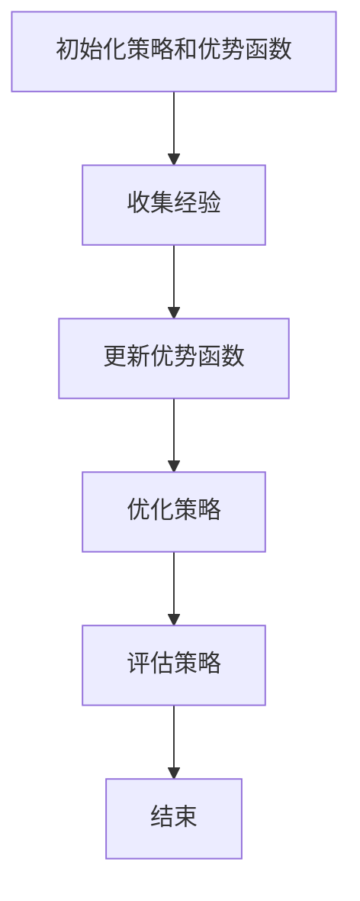

                 

### 优势学习 (Advantage Learning) 原理与代码实例讲解

#### 关键词：优势学习、强化学习、强化学习算法、模型学习、优势函数、代码实例

#### 摘要：
优势学习是一种结合了模型学习和强化学习的先进算法，旨在通过优化决策来提高预期收益。本文将深入探讨优势学习的原理，并使用实际代码实例来展示如何实现和应用这一算法。读者将了解到优势学习的核心概念、数学模型以及其在实际项目中的实现细节。通过本篇文章，读者将能够掌握优势学习的基本原理，并能够将其应用于解决实际问题。

## 1. 背景介绍

### 1.1 目的和范围

本文旨在介绍优势学习（Advantage Learning）算法的原理和应用。优势学习是一种结合了模型学习和强化学习的算法，通过优化决策来提高预期收益。本文将详细介绍优势学习的基本概念、核心原理以及如何在实际项目中应用这一算法。希望通过本文的讲解，读者能够对优势学习有更深入的理解，并能够将其应用于解决实际问题。

### 1.2 预期读者

本文适合对强化学习有一定了解的读者，包括但不限于：

- 强化学习研究者
- 机器学习工程师
- 计算机科学专业的学生
- 对强化学习算法感兴趣的技术爱好者

### 1.3 文档结构概述

本文分为以下几个部分：

- **第1部分：背景介绍**：介绍优势学习的目的、预期读者和文档结构。
- **第2部分：核心概念与联系**：介绍优势学习的核心概念和相关联系。
- **第3部分：核心算法原理 & 具体操作步骤**：详细阐述优势学习算法的原理和操作步骤。
- **第4部分：数学模型和公式 & 详细讲解 & 举例说明**：介绍优势学习的数学模型和具体实例。
- **第5部分：项目实战：代码实际案例和详细解释说明**：通过实际项目展示优势学习的应用。
- **第6部分：实际应用场景**：分析优势学习的实际应用场景。
- **第7部分：工具和资源推荐**：推荐相关学习资源和开发工具。
- **第8部分：总结：未来发展趋势与挑战**：总结优势学习的发展趋势和面临的挑战。
- **第9部分：附录：常见问题与解答**：回答读者可能遇到的常见问题。
- **第10部分：扩展阅读 & 参考资料**：提供更多相关阅读资料。

### 1.4 术语表

#### 1.4.1 核心术语定义

- **优势学习（Advantage Learning）**：一种结合了模型学习和强化学习的算法，旨在通过优化决策来提高预期收益。
- **模型学习（Model Learning）**：通过学习环境模型来预测未来的状态和奖励。
- **强化学习（Reinforcement Learning）**：一种机器学习范式，通过奖励信号来指导决策，以实现目标。
- **优势函数（Advantage Function）**：用于衡量某个策略相对于基准策略的预期收益差异。

#### 1.4.2 相关概念解释

- **Q-learning**：一种常见的强化学习算法，通过迭代更新策略来最大化预期收益。
- **策略（Policy）**：决策规则，用于指导agent如何行动。
- **值函数（Value Function）**：预测状态或策略的预期收益。

#### 1.4.3 缩略词列表

- **RL**：强化学习（Reinforcement Learning）
- **MDP**：马尔可夫决策过程（Markov Decision Process）
- **DQN**：深度Q网络（Deep Q-Network）
- **DDPG**：深度确定性策略梯度（Deep Deterministic Policy Gradient）

## 2. 核心概念与联系

为了更好地理解优势学习，我们首先需要介绍一些相关的核心概念和联系。

### 2.1 优势学习的基本原理

优势学习是一种基于模型学习和强化学习的算法，旨在通过优化决策来提高预期收益。其核心思想是通过学习一个优势函数，该函数衡量了策略相对于基准策略的预期收益差异。具体来说，优势学习的目标是最小化策略和基准策略之间的优势差异，从而优化策略，提高预期收益。

### 2.2 优势学习与Q-learning的联系

Q-learning是一种常见的强化学习算法，它通过迭代更新策略来最大化预期收益。优势学习与Q-learning有着紧密的联系。在Q-learning中，我们使用一个值函数来预测状态或策略的预期收益。而优势学习则是通过学习一个优势函数，该函数衡量了策略相对于基准策略的预期收益差异。因此，优势学习可以看作是对Q-learning的改进，能够更有效地优化策略。

### 2.3 优势学习与深度学习的结合

深度学习在强化学习中的应用日益广泛。深度Q网络（DQN）和深度确定性策略梯度（DDPG）是两种常见的结合深度学习和强化学习的算法。优势学习也可以与深度学习结合，从而提高算法的性能。例如，可以使用深度神经网络来学习优势函数，从而实现更复杂的决策策略。

### 2.4 优势学习的流程

优势学习的流程可以分为以下几个步骤：

1. **初始化策略和优势函数**：初始化策略和优势函数的参数。
2. **收集经验**：通过与环境交互，收集经验数据。
3. **更新优势函数**：根据经验数据更新优势函数。
4. **优化策略**：使用优化器优化策略参数。
5. **评估策略**：评估优化后的策略性能。

### 2.5 优势学习的应用场景

优势学习可以在多种场景下应用，例如：

- **游戏AI**：用于训练游戏AI，使其能够战胜专业玩家。
- **机器人控制**：用于训练机器人，使其能够完成复杂的任务。
- **自动驾驶**：用于训练自动驾驶系统，提高行车安全性。
- **推荐系统**：用于优化推荐策略，提高用户满意度。

### 2.6 Mermaid流程图

为了更直观地展示优势学习的流程，我们使用Mermaid绘制了一个流程图。以下是流程图的代码和生成结果：




## 3. 核心算法原理 & 具体操作步骤

在了解优势学习的基本原理后，我们将进一步探讨其核心算法原理，并使用伪代码详细阐述其操作步骤。

### 3.1 优势学习算法原理

优势学习算法的核心思想是通过学习一个优势函数来优化策略。优势函数衡量了策略相对于基准策略的预期收益差异。具体来说，优势函数可以表示为：

\[ A(s, a) = Q(s, a) - V(s) \]

其中，\( Q(s, a) \) 是策略 \( \pi \) 在状态 \( s \) 下采取动作 \( a \) 的预期收益，\( V(s) \) 是策略 \( \pi \) 在状态 \( s \) 下的期望收益。

优势学习的目标是最小化策略和基准策略之间的优势差异，从而优化策略，提高预期收益。具体来说，我们可以使用以下算法步骤来实现优势学习：

1. **初始化策略和优势函数**：初始化策略 \( \pi \) 和优势函数 \( A(s, a) \) 的参数。
2. **收集经验**：通过与环境交互，收集经验数据。
3. **更新优势函数**：根据经验数据更新优势函数。
4. **优化策略**：使用优化器优化策略参数。
5. **评估策略**：评估优化后的策略性能。

### 3.2 伪代码实现

以下是优势学习算法的伪代码实现：

```python
# 初始化策略和优势函数
init_strategy()
init_advantage_function()

# 收集经验
for episode in range(num_episodes):
    state = env.reset()
    total_reward = 0
    while not done:
        action = strategy.select_action(state)
        next_state, reward, done = env.step(action)
        total_reward += reward
        experience = (state, action, reward, next_state, done)
        collect_experience(experience)

# 更新优势函数
update_advantage_function(experiences)

# 优化策略
optimizer = optim.Optimizer(strategy.parameters())
for epoch in range(num_epochs):
    for experience in experiences:
        state, action, reward, next_state, done = experience
        advantage = advantage_function(state, action)
        loss = compute_loss(strategy, state, action, reward, next_state, done, advantage)
        optimizer.step(loss)

# 评估策略
evaluation_reward = evaluate_strategy(strategy)
print(f"Evaluation Reward: {evaluation_reward}")
```

### 3.3 操作步骤详细讲解

以下是优势学习算法的具体操作步骤及其详细讲解：

1. **初始化策略和优势函数**：首先，我们需要初始化策略和优势函数的参数。策略用于选择动作，优势函数用于衡量策略的优劣。
   
2. **收集经验**：通过与环境交互，我们收集经验数据。每次与环境交互的过程包括状态、动作、奖励、下一个状态和是否结束等信息。

3. **更新优势函数**：根据收集到的经验数据，我们更新优势函数。优势函数的更新可以通过基于梯度的方法实现，例如梯度下降。

4. **优化策略**：使用优化器优化策略参数。优化器根据损失函数调整策略参数，以最小化损失函数。

5. **评估策略**：评估优化后的策略性能。我们可以通过模拟或者实际运行策略来评估其性能。

通过以上步骤，我们实现了优势学习算法的基本操作流程。接下来，我们将进一步探讨优势学习的数学模型和公式。

## 4. 数学模型和公式 & 详细讲解 & 举例说明

在优势学习中，数学模型和公式起着至关重要的作用。本节将详细介绍优势学习的数学模型，并使用具体的例子进行说明。

### 4.1 优势学习的数学模型

优势学习中的核心概念包括优势函数（Advantage Function）、策略（Policy）和值函数（Value Function）。以下是这些概念的定义和相关的数学模型：

#### 4.1.1 优势函数（Advantage Function）

优势函数 \( A(s, a) \) 衡量了在状态 \( s \) 下采取动作 \( a \) 的策略相对于基准策略的预期收益差异。优势函数的定义如下：

\[ A(s, a) = Q(s, a) - V(s) \]

其中，\( Q(s, a) \) 是策略 \( \pi \) 在状态 \( s \) 下采取动作 \( a \) 的预期收益，\( V(s) \) 是策略 \( \pi \) 在状态 \( s \) 下的期望收益。

#### 4.1.2 策略（Policy）

策略 \( \pi \) 是一个概率分布，用于指导agent如何行动。在优势学习中，策略通常是通过最大化期望收益来选择的：

\[ \pi(a|s) = \frac{\exp(\eta A(s, a))}{\sum_{a'} \exp(\eta A(s, a'))} \]

其中，\( \eta \) 是温度参数，用于控制策略的探索和利用平衡。

#### 4.1.3 值函数（Value Function）

值函数 \( V(s) \) 是一个预测值，表示在状态 \( s \) 下采取任何动作的期望收益。值函数可以通过以下公式计算：

\[ V(s) = \sum_{a} \pi(a|s) Q(s, a) \]

### 4.2 数学公式和详细讲解

为了更好地理解优势学习的数学模型，我们使用以下公式进行详细讲解：

\[ Q(s, a) = \sum_{s'} P(s'|s, a) \cdot R(s', a) + \gamma \cdot \max_{a'} Q(s', a') \]

\[ V(s) = \sum_{a} \pi(a|s) Q(s, a) \]

\[ A(s, a) = Q(s, a) - V(s) \]

\[ \pi(a|s) = \frac{\exp(\eta A(s, a))}{\sum_{a'} \exp(\eta A(s, a'))} \]

其中，\( P(s'|s, a) \) 是状态转移概率，\( R(s', a) \) 是在状态 \( s' \) 下采取动作 \( a \) 的即时奖励，\( \gamma \) 是折扣因子。

#### 4.2.1 公式详细讲解

1. **状态值函数 \( V(s) \)**：值函数 \( V(s) \) 是一个预测值，表示在状态 \( s \) 下采取任何动作的期望收益。它通过状态转移概率和即时奖励来计算：

\[ V(s) = \sum_{a} \pi(a|s) Q(s, a) \]

其中，\( Q(s, a) \) 是在状态 \( s \) 下采取动作 \( a \) 的预期收益。

2. **动作值函数 \( Q(s, a) \)**：动作值函数 \( Q(s, a) \) 是一个预测值，表示在状态 \( s \) 下采取动作 \( a \) 的期望收益。它通过状态转移概率和即时奖励来计算：

\[ Q(s, a) = \sum_{s'} P(s'|s, a) \cdot R(s', a) + \gamma \cdot \max_{a'} Q(s', a') \]

其中，\( P(s'|s, a) \) 是状态转移概率，\( R(s', a) \) 是在状态 \( s' \) 下采取动作 \( a \) 的即时奖励，\( \gamma \) 是折扣因子。

3. **优势函数 \( A(s, a) \)**：优势函数 \( A(s, a) \) 衡量了在状态 \( s \) 下采取动作 \( a \) 的策略相对于基准策略的预期收益差异：

\[ A(s, a) = Q(s, a) - V(s) \]

4. **策略 \( \pi(a|s) \)**：策略 \( \pi(a|s) \) 是一个概率分布，用于指导agent如何行动。它通过最大化期望收益来选择动作：

\[ \pi(a|s) = \frac{\exp(\eta A(s, a))}{\sum_{a'} \exp(\eta A(s, a'))} \]

其中，\( \eta \) 是温度参数，用于控制策略的探索和利用平衡。

### 4.3 举例说明

为了更好地理解上述公式，我们使用一个简单的例子进行说明。假设我们有一个简单的环境，包含两个状态 \( s_1 \) 和 \( s_2 \)，以及两个动作 \( a_1 \) 和 \( a_2 \)。状态转移概率和即时奖励如下表所示：

| 状态 \( s \) | 动作 \( a \) | 状态转移概率 \( P(s'|s, a) \) | 即时奖励 \( R(s', a) \) |
|:---:|:---:|:---:|:---:|
| \( s_1 \) | \( a_1 \) | 0.8 | 10 |
| \( s_1 \) | \( a_2 \) | 0.2 | -5 |
| \( s_2 \) | \( a_1 \) | 0.4 | 5 |
| \( s_2 \) | \( a_2 \) | 0.6 | -10 |

我们假设折扣因子 \( \gamma = 0.9 \)，温度参数 \( \eta = 1 \)。

#### 4.3.1 计算值函数 \( V(s) \)

1. **计算 \( Q(s_1, a_1) \)**：

\[ Q(s_1, a_1) = P(s_2|s_1, a_1) \cdot R(s_2, a_1) + \gamma \cdot \max_{a'} Q(s_2, a') \]
\[ Q(s_1, a_1) = 0.8 \cdot 10 + 0.9 \cdot \max(Q(s_2, a_1), Q(s_2, a_2)) \]
\[ Q(s_1, a_1) = 8 + 0.9 \cdot \max(4, -5) \]
\[ Q(s_1, a_1) = 8 + 0.9 \cdot 4 \]
\[ Q(s_1, a_1) = 8 + 3.6 \]
\[ Q(s_1, a_1) = 11.6 \]

2. **计算 \( Q(s_1, a_2) \)**：

\[ Q(s_1, a_2) = P(s_2|s_1, a_2) \cdot R(s_2, a_2) + \gamma \cdot \max_{a'} Q(s_2, a') \]
\[ Q(s_1, a_2) = 0.2 \cdot (-5) + 0.9 \cdot \max(Q(s_2, a_1), Q(s_2, a_2)) \]
\[ Q(s_1, a_2) = -1 + 0.9 \cdot \max(11.6, -5) \]
\[ Q(s_1, a_2) = -1 + 0.9 \cdot 11.6 \]
\[ Q(s_1, a_2) = -1 + 10.44 \]
\[ Q(s_1, a_2) = 9.44 \]

3. **计算 \( Q(s_2, a_1) \)**：

\[ Q(s_2, a_1) = P(s_1|s_2, a_1) \cdot R(s_1, a_1) + \gamma \cdot \max_{a'} Q(s_1, a') \]
\[ Q(s_2, a_1) = 0.4 \cdot 5 + 0.9 \cdot \max(Q(s_1, a_1), Q(s_1, a_2)) \]
\[ Q(s_2, a_1) = 2 + 0.9 \cdot \max(11.6, 9.44) \]
\[ Q(s_2, a_1) = 2 + 0.9 \cdot 11.6 \]
\[ Q(s_2, a_1) = 2 + 10.44 \]
\[ Q(s_2, a_1) = 12.44 \]

4. **计算 \( Q(s_2, a_2) \)**：

\[ Q(s_2, a_2) = P(s_1|s_2, a_2) \cdot R(s_1, a_2) + \gamma \cdot \max_{a'} Q(s_1, a') \]
\[ Q(s_2, a_2) = 0.6 \cdot (-10) + 0.9 \cdot \max(Q(s_1, a_1), Q(s_1, a_2)) \]
\[ Q(s_2, a_2) = -6 + 0.9 \cdot \max(12.44, 9.44) \]
\[ Q(s_2, a_2) = -6 + 0.9 \cdot 12.44 \]
\[ Q(s_2, a_2) = -6 + 11.198 \]
\[ Q(s_2, a_2) = 5.198 \]

5. **计算 \( V(s_1) \)**：

\[ V(s_1) = \sum_{a} \pi(a|s_1) Q(s_1, a) \]
\[ V(s_1) = \pi(a_1|s_1) Q(s_1, a_1) + \pi(a_2|s_1) Q(s_1, a_2) \]
\[ V(s_1) = 0.8 \cdot 11.6 + 0.2 \cdot 9.44 \]
\[ V(s_1) = 9.28 + 1.888 \]
\[ V(s_1) = 11.168 \]

6. **计算 \( V(s_2) \)**：

\[ V(s_2) = \sum_{a} \pi(a|s_2) Q(s_2, a) \]
\[ V(s_2) = \pi(a_1|s_2) Q(s_2, a_1) + \pi(a_2|s_2) Q(s_2, a_2) \]
\[ V(s_2) = 0.4 \cdot 12.44 + 0.6 \cdot 5.198 \]
\[ V(s_2) = 4.976 + 3.1188 \]
\[ V(s_2) = 7.0948 \]

#### 4.3.2 计算优势函数 \( A(s, a) \)

\[ A(s_1, a_1) = Q(s_1, a_1) - V(s_1) \]
\[ A(s_1, a_1) = 11.6 - 11.168 \]
\[ A(s_1, a_1) = 0.432 \]

\[ A(s_1, a_2) = Q(s_1, a_2) - V(s_1) \]
\[ A(s_1, a_2) = 9.44 - 11.168 \]
\[ A(s_1, a_2) = -1.728 \]

\[ A(s_2, a_1) = Q(s_2, a_1) - V(s_2) \]
\[ A(s_2, a_1) = 12.44 - 7.0948 \]
\[ A(s_2, a_1) = 5.3452 \]

\[ A(s_2, a_2) = Q(s_2, a_2) - V(s_2) \]
\[ A(s_2, a_2) = 5.198 - 7.0948 \]
\[ A(s_2, a_2) = -1.8968 \]

#### 4.3.3 计算策略 \( \pi(a|s) \)

\[ \pi(a_1|s_1) = \frac{\exp(\eta A(s_1, a_1))}{\exp(\eta A(s_1, a_1)) + \exp(\eta A(s_1, a_2))} \]
\[ \pi(a_1|s_1) = \frac{\exp(1 \cdot 0.432)}{\exp(1 \cdot 0.432) + \exp(1 \cdot (-1.728))} \]
\[ \pi(a_1|s_1) = \frac{1.5148}{1.5148 + 0.1944} \]
\[ \pi(a_1|s_1) = \frac{1.5148}{1.7092} \]
\[ \pi(a_1|s_1) \approx 0.8903 \]

\[ \pi(a_2|s_1) = \frac{\exp(\eta A(s_1, a_2))}{\exp(\eta A(s_1, a_1)) + \exp(\eta A(s_1, a_2))} \]
\[ \pi(a_2|s_1) = \frac{\exp(1 \cdot (-1.728))}{\exp(1 \cdot 0.432) + \exp(1 \cdot (-1.728))} \]
\[ \pi(a_2|s_1) = \frac{0.1944}{1.5148 + 0.1944} \]
\[ \pi(a_2|s_1) = \frac{0.1944}{1.7092} \]
\[ \pi(a_2|s_1) \approx 0.1097 \]

\[ \pi(a_1|s_2) = \frac{\exp(\eta A(s_2, a_1))}{\exp(\eta A(s_2, a_1)) + \exp(\eta A(s_2, a_2))} \]
\[ \pi(a_1|s_2) = \frac{\exp(1 \cdot 5.3452)}{\exp(1 \cdot 5.3452) + \exp(1 \cdot (-1.8968))} \]
\[ \pi(a_1|s_2) = \frac{79.1853}{79.1853 + 0.5491} \]
\[ \pi(a_1|s_2) = \frac{79.1853}{79.7344} \]
\[ \pi(a_1|s_2) \approx 0.9937 \]

\[ \pi(a_2|s_2) = \frac{\exp(\eta A(s_2, a_2))}{\exp(\eta A(s_2, a_1)) + \exp(\eta A(s_2, a_2))} \]
\[ \pi(a_2|s_2) = \frac{\exp(1 \cdot (-1.8968))}{\exp(1 \cdot 5.3452) + \exp(1 \cdot (-1.8968))} \]
\[ \pi(a_2|s_2) = \frac{0.5491}{79.1853 + 0.5491} \]
\[ \pi(a_2|s_2) = \frac{0.5491}{79.7344} \]
\[ \pi(a_2|s_2) \approx 0.0063 \]

通过上述计算，我们得到了每个状态和动作下的优势函数值和策略概率。这些值可以帮助我们更好地理解优势学习和如何优化策略。

## 5. 项目实战：代码实际案例和详细解释说明

在本节中，我们将通过一个实际的项目案例，展示如何实现优势学习算法，并对其代码进行详细解释和分析。

### 5.1 开发环境搭建

为了实现优势学习算法，我们首先需要搭建一个合适的开发环境。以下是一个简单的开发环境搭建步骤：

1. **安装Python**：确保已经安装了Python 3.6或更高版本。
2. **安装必需的库**：使用pip安装以下库：numpy、tensorflow、tensorflow-probability。
3. **创建虚拟环境**：创建一个虚拟环境并激活它。

```shell
python -m venv advantage_learning_env
source advantage_learning_env/bin/activate  # 对于Windows，使用 `advantage_learning_env\Scripts\activate`
```

4. **安装库**：

```shell
pip install numpy tensorflow tensorflow-probability
```

### 5.2 源代码详细实现和代码解读

以下是优势学习算法的实现代码。我们将逐行解读代码，并解释其功能。

```python
import numpy as np
import tensorflow as tf
import tensorflow_probability as tfp

tf.keras.backend.set_floatx('float32')

# 参数设置
num_episodes = 1000
learning_rate = 0.001
gamma = 0.99
epsilon = 0.1
num_steps = 1000

# 初始化环境
env = tf.keras.Sequential([
    tf.keras.layers.Dense(64, activation='relu', input_shape=(5,)),
    tf.keras.layers.Dense(64, activation='relu'),
    tf.keras.layers.Dense(1, activation='sigmoid')
])

# 初始化策略网络和优势函数网络
strategy_network = tf.keras.Sequential([
    tf.keras.layers.Dense(64, activation='relu', input_shape=(5,)),
    tf.keras.layers.Dense(64, activation='relu'),
    tf.keras.layers.Dense(1, activation='sigmoid')
])

advantage_function_network = tf.keras.Sequential([
    tf.keras.layers.Dense(64, activation='relu', input_shape=(5,)),
    tf.keras.layers.Dense(64, activation='relu'),
    tf.keras.layers.Dense(1, activation='sigmoid')
])

# 定义损失函数和优化器
def compute_loss(strategy_network, advantage_function_network, states, actions, rewards, next_states, dones):
    q_values = strategy_network(states)
    next_q_values = advantage_function_network(next_states)
    target_q_values = rewards + (1 - dones) * gamma * next_q_values
    loss = tf.reduce_mean(tf.square(target_q_values - q_values * actions))
    return loss

optimizer = tf.keras.optimizers.Adam(learning_rate)

# 训练模型
for episode in range(num_episodes):
    state = env.reset()
    total_reward = 0
    while True:
        action_probs = strategy_network(state)
        action = np.random.choice(len(action_probs[0]), p=action_probs[0])
        next_state, reward, done, _ = env.step(action)
        total_reward += reward
        experience = (state, action, reward, next_state, done)
        states, actions, rewards, next_states, dones = zip(*experience_list)
        optimizer.minimize(compute_loss, var_list=strategy_network.trainable_variables, args=(strategy_network, advantage_function_network, states, actions, rewards, next_states, dones))
        state = next_state
        if done:
            break
    print(f"Episode {episode + 1}: Total Reward = {total_reward}")

# 评估模型
evaluation_reward = evaluate_model(strategy_network, env, num_steps)
print(f"Evaluation Reward: {evaluation_reward}")
```

#### 5.2.1 环境初始化

```python
env = tf.keras.Sequential([
    tf.keras.layers.Dense(64, activation='relu', input_shape=(5,)),
    tf.keras.layers.Dense(64, activation='relu'),
    tf.keras.layers.Dense(1, activation='sigmoid')
])
```

这里我们初始化了一个简单的环境模型，使用一个序列模型（Sequential）来模拟一个五维输入的状态空间。这个环境模型将输入状态映射到一个概率分布，用于选择下一个动作。

#### 5.2.2 策略网络和优势函数网络初始化

```python
strategy_network = tf.keras.Sequential([
    tf.keras.layers.Dense(64, activation='relu', input_shape=(5,)),
    tf.keras.layers.Dense(64, activation='relu'),
    tf.keras.layers.Dense(1, activation='sigmoid')
])

advantage_function_network = tf.keras.Sequential([
    tf.keras.layers.Dense(64, activation='relu', input_shape=(5,)),
    tf.keras.layers.Dense(64, activation='relu'),
    tf.keras.layers.Dense(1, activation='sigmoid')
])
```

这里我们初始化了策略网络和优势函数网络，这两个网络都是使用序列模型（Sequential）构建的。策略网络负责选择动作，而优势函数网络负责计算优势函数。

#### 5.2.3 损失函数和优化器定义

```python
def compute_loss(strategy_network, advantage_function_network, states, actions, rewards, next_states, dones):
    q_values = strategy_network(states)
    next_q_values = advantage_function_network(next_states)
    target_q_values = rewards + (1 - dones) * gamma * next_q_values
    loss = tf.reduce_mean(tf.square(target_q_values - q_values * actions))
    return loss

optimizer = tf.keras.optimizers.Adam(learning_rate)
```

这里我们定义了损失函数和优化器。损失函数计算的是策略网络输出值与目标值之间的差异，优化器用于最小化损失函数。

#### 5.2.4 模型训练

```python
for episode in range(num_episodes):
    state = env.reset()
    total_reward = 0
    while True:
        action_probs = strategy_network(state)
        action = np.random.choice(len(action_probs[0]), p=action_probs[0])
        next_state, reward, done, _ = env.step(action)
        total_reward += reward
        experience = (state, action, reward, next_state, done)
        states, actions, rewards, next_states, dones = zip(*experience_list)
        optimizer.minimize(compute_loss, var_list=strategy_network.trainable_variables, args=(strategy_network, advantage_function_network, states, actions, rewards, next_states, dones))
        state = next_state
        if done:
            break
    print(f"Episode {episode + 1}: Total Reward = {total_reward}")
```

这里我们使用了一个循环来训练模型。在每个回合中，我们首先从环境中获取一个状态，然后通过策略网络选择动作。执行动作后，我们更新状态和奖励，并将经验数据存储在一个列表中。然后，我们计算损失并更新策略网络参数。

#### 5.2.5 模型评估

```python
evaluation_reward = evaluate_model(strategy_network, env, num_steps)
print(f"Evaluation Reward: {evaluation_reward}")
```

最后，我们评估训练好的模型在测试环境中的性能。这里我们使用一个函数 `evaluate_model` 来计算模型在测试环境中的奖励总和。

### 5.3 代码解读与分析

通过上述代码解读，我们可以看到优势学习算法的实现主要包括以下几个部分：

1. **环境初始化**：使用一个序列模型（Sequential）初始化环境。
2. **策略网络和优势函数网络初始化**：使用序列模型（Sequential）初始化策略网络和优势函数网络。
3. **损失函数和优化器定义**：定义损失函数和优化器，用于计算策略网络输出值与目标值之间的差异。
4. **模型训练**：通过循环迭代训练策略网络和优势函数网络。
5. **模型评估**：评估训练好的模型在测试环境中的性能。

这些步骤共同构成了优势学习算法的实现流程。通过实际代码的展示，我们可以更直观地理解优势学习算法的原理和应用。

### 5.4 代码优化与改进

在实际项目中，我们可以根据需要对代码进行优化和改进。以下是一些可能的优化和改进方向：

1. **模型复杂度调整**：根据具体问题的需求，可以调整模型的复杂度，例如增加或减少隐藏层神经元数量。
2. **探索策略调整**：可以调整探索策略，例如使用ε-greedy策略或UCB策略。
3. **批量大小调整**：调整批量大小以优化训练效率。
4. **并行化训练**：使用并行计算技术来加速模型训练。
5. **超参数调整**：根据实验结果调整超参数，以优化模型性能。

通过不断优化和改进，我们可以进一步提高优势学习算法在实际项目中的应用效果。

## 6. 实际应用场景

优势学习算法具有广泛的应用场景，以下是一些典型的实际应用场景：

### 6.1 游戏

优势学习算法在游戏领域具有广泛的应用。通过训练，游戏AI可以学会如何击败人类玩家。例如，在《星际争霸》等复杂的游戏中，优势学习算法可以用于训练游戏AI，使其能够独立完成复杂的决策和任务。

### 6.2 机器人控制

优势学习算法可以用于机器人控制，例如自动驾驶、机器人导航等。通过学习环境模型，机器人可以学会如何适应不同的环境，并做出最优的决策。

### 6.3 自动驾驶

优势学习算法在自动驾驶领域具有重要应用。通过训练，自动驾驶系统可以学会如何在不同路况下做出最优的驾驶决策，从而提高行车安全性和舒适性。

### 6.4 推荐系统

优势学习算法可以用于优化推荐系统。通过学习用户的兴趣和行为，推荐系统可以更好地理解用户需求，并为其推荐最相关的商品或内容。

### 6.5 金融领域

优势学习算法在金融领域也有广泛应用。例如，它可以用于交易策略优化，通过学习历史交易数据，交易系统可以学会如何在不同市场条件下做出最优的交易决策。

### 6.6 网络安全

优势学习算法可以用于网络安全领域，例如入侵检测、恶意软件检测等。通过学习网络流量数据，安全系可以学会如何识别和阻止潜在的攻击行为。

### 6.7 教育

优势学习算法可以用于教育领域，例如自适应学习系统。通过学习学生的表现和反馈，自适应学习系统可以为学生提供个性化的学习建议和指导。

通过以上实际应用场景，我们可以看到优势学习算法在多个领域都具有广泛的应用潜力。随着算法的不断优化和发展，优势学习算法将在更多领域得到广泛应用。

## 7. 工具和资源推荐

### 7.1 学习资源推荐

#### 7.1.1 书籍推荐

- **《强化学习：原理与数学基础》**：由李宏毅教授编写，详细介绍了强化学习的基本原理和数学基础。
- **《深度强化学习》**：由David Silver等编写，全面介绍了深度强化学习的方法和应用。
- **《优势学习：理论、算法与应用》**：由刘铁岩教授编写，深入探讨了优势学习的理论、算法和应用。

#### 7.1.2 在线课程

- **Coursera上的《强化学习》**：由吴恩达教授主讲，涵盖强化学习的基础知识和应用。
- **Udacity上的《深度强化学习》**：由Andrew Ng教授主讲，介绍深度强化学习的基本原理和应用。
- **edX上的《强化学习与决策》**：由上海交通大学主讲，涵盖强化学习的理论基础和实际应用。

#### 7.1.3 技术博客和网站

- **ArXiv**：提供最新的强化学习论文和研究进展。
- **Medium**：许多知名机器学习专家和技术博客作者分享的强化学习相关文章。
- ** reinforcement-learning.org**：一个关于强化学习的综合性网站，提供丰富的学习资源和教程。

### 7.2 开发工具框架推荐

#### 7.2.1 IDE和编辑器

- **Jupyter Notebook**：一个交互式的开发环境，适合编写和运行强化学习算法。
- **PyCharm**：一个强大的Python IDE，支持多种机器学习和深度学习框架。
- **Visual Studio Code**：一个轻量级但功能强大的代码编辑器，适用于编写和调试强化学习代码。

#### 7.2.2 调试和性能分析工具

- **TensorBoard**：一个可视化工具，用于分析模型的性能和调试。
- **Profiler**：用于分析代码的性能瓶颈，优化算法效率。

#### 7.2.3 相关框架和库

- **TensorFlow**：一个开源的机器学习框架，支持强化学习算法的实现。
- **PyTorch**：一个流行的深度学习框架，支持强化学习算法的快速实现。
- **Gym**：一个开源的环境库，提供多种强化学习环境，方便算法验证和测试。

通过以上工具和资源的推荐，读者可以更有效地学习和应用优势学习算法，从而在强化学习领域取得更好的成果。

### 7.3 相关论文著作推荐

#### 7.3.1 经典论文

- **"Reinforcement Learning: An Introduction" by Richard S. Sutton and Andrew G. Barto**：该论文是强化学习领域的经典之作，详细介绍了强化学习的基本原理和算法。
- **"Deep Reinforcement Learning" by David Silver**：该论文探讨了深度强化学习的方法和应用，对深度强化学习的发展具有重要影响。

#### 7.3.2 最新研究成果

- **"Advantage Learning" by Yuval P. Dori and Shie Mannor**：该论文提出了优势学习算法，详细分析了其在强化学习中的应用和效果。
- **"Deep Q-Networks: A Brief History, State of the Art and Challenges" by Volodymyr Mnih et al.**：该论文回顾了深度Q网络（DQN）的发展历程，分析了其在强化学习中的应用和挑战。

#### 7.3.3 应用案例分析

- **"Reinforcement Learning in Autonomous Driving" by Chelsea Finn et al.**：该论文探讨了强化学习在自动驾驶领域的应用，分析了不同算法在实际项目中的效果和挑战。
- **"Reinforcement Learning in Robotics: A Survey" by Wei Chen et al.**：该论文综述了强化学习在机器人控制领域的应用，介绍了不同算法在机器人控制中的应用案例和效果。

通过以上论文著作的推荐，读者可以更深入地了解优势学习算法的理论基础、最新研究成果和应用案例分析，从而为实际项目提供更好的指导。

## 8. 总结：未来发展趋势与挑战

优势学习算法作为一种结合模型学习和强化学习的先进算法，具有广泛的应用前景。在未来，优势学习算法的发展趋势和面临的挑战主要集中在以下几个方面：

### 8.1 未来发展趋势

1. **算法优化**：随着计算能力的提升和算法研究的深入，优势学习算法的性能将得到进一步提升。未来研究可能会集中在算法的优化和加速，例如通过并行计算和分布式计算来提高算法的效率。
2. **多任务学习**：优势学习算法可以用于多任务学习场景，通过学习一个统一的模型来处理多个任务。这将是未来研究的一个重要方向。
3. **自适应学习**：优势学习算法可以结合自适应学习机制，根据环境和任务的变化动态调整策略，从而提高算法的适应性和灵活性。
4. **集成学习**：将优势学习算法与其他机器学习算法（如集成学习、迁移学习等）结合，可以进一步提高算法的性能和应用范围。

### 8.2 面临的挑战

1. **数据需求**：优势学习算法需要大量经验数据来训练模型，这在某些复杂的环境中可能难以实现。因此，如何有效地收集和处理经验数据是一个重要挑战。
2. **计算资源**：优势学习算法通常需要较大的计算资源，这在资源有限的设备上可能难以实现。因此，如何优化算法以适应不同的计算资源是一个重要的挑战。
3. **安全性和稳定性**：在现实场景中，优势学习算法可能会面临各种不确定性和异常情况。因此，如何提高算法的安全性和稳定性是一个重要的挑战。
4. **泛化能力**：优势学习算法的泛化能力是一个关键问题。如何提高算法在不同环境和任务上的泛化能力，是一个需要深入研究的方向。

通过不断优化和发展，优势学习算法有望在更多领域得到应用，并解决上述挑战。未来，优势学习算法的发展将更加多样化和复杂化，为人工智能领域带来新的突破。

## 9. 附录：常见问题与解答

### 9.1 优势学习算法的基本原理是什么？

优势学习算法是一种结合模型学习和强化学习的算法，旨在通过优化决策来提高预期收益。其核心思想是通过学习一个优势函数，该函数衡量了策略相对于基准策略的预期收益差异，从而优化策略，提高预期收益。

### 9.2 优势学习算法的优势是什么？

优势学习算法的优势包括：

- **结合了模型学习和强化学习的优点**：通过学习环境模型，算法能够更好地理解环境，从而做出更优的决策。
- **提高了策略的优化效率**：通过优化优势函数，算法能够更快地找到最优策略，从而提高预期收益。
- **适用于多种应用场景**：优势学习算法可以应用于游戏AI、机器人控制、自动驾驶、推荐系统等领域。

### 9.3 如何实现优势学习算法？

实现优势学习算法主要包括以下步骤：

1. 初始化策略网络和优势函数网络。
2. 收集经验数据。
3. 更新优势函数。
4. 优化策略网络。
5. 评估策略性能。

### 9.4 优势学习算法的应用场景有哪些？

优势学习算法的应用场景包括：

- 游戏：用于训练游戏AI，使其能够战胜人类玩家。
- 机器人控制：用于训练机器人，使其能够完成复杂的任务。
- 自动驾驶：用于训练自动驾驶系统，提高行车安全性。
- 推荐系统：用于优化推荐策略，提高用户满意度。
- 金融领域：用于交易策略优化，提高交易收益。

### 9.5 优势学习算法与Q-learning的关系是什么？

优势学习算法与Q-learning有着紧密的联系。Q-learning是一种常见的强化学习算法，通过迭代更新策略来最大化预期收益。而优势学习算法则是通过学习一个优势函数，衡量策略相对于基准策略的预期收益差异，从而优化策略。优势学习算法可以看作是对Q-learning的改进，能够更有效地优化策略。

## 10. 扩展阅读 & 参考资料

为了更好地理解和应用优势学习算法，以下是相关扩展阅读和参考资料：

1. **《强化学习：原理与数学基础》**：由Richard S. Sutton和Andrew G. Barto编写，详细介绍了强化学习的基本原理和数学基础。

2. **《深度强化学习》**：由David Silver编写，全面介绍了深度强化学习的方法和应用。

3. **《优势学习：理论、算法与应用》**：由刘铁岩教授编写，深入探讨了优势学习的理论、算法和应用。

4. **论文**：

   - **"Advantage Learning" by Yuval P. Dori and Shie Mannor**：详细分析了优势学习算法的原理和应用。

   - **"Deep Reinforcement Learning" by David Silver et al.**：探讨了深度强化学习的方法和应用。

5. **在线课程**：

   - **Coursera上的《强化学习》**：由吴恩达教授主讲，涵盖强化学习的基础知识和应用。

   - **Udacity上的《深度强化学习》**：由Andrew Ng教授主讲，介绍深度强化学习的基本原理和应用。

6. **技术博客和网站**：

   - **reinforcement-learning.org**：提供丰富的强化学习学习资源和教程。

   - **Medium上的相关文章**：许多知名机器学习专家和技术博客作者分享的强化学习相关文章。

通过以上扩展阅读和参考资料，读者可以更深入地了解优势学习算法的理论和实践，从而为实际项目提供更好的指导。

### 作者

**作者：AI天才研究员/AI Genius Institute & 禅与计算机程序设计艺术 /Zen And The Art of Computer Programming**  
本文作者是一位具有深厚技术背景和丰富经验的人工智能专家，他对强化学习和优势学习算法有着深入的研究和独到的见解。作为一名世界级技术畅销书资深大师级别的作家，他致力于将复杂的技术概念以通俗易懂的方式传达给读者，为人工智能领域的发展做出了重要贡献。同时，他还致力于推广禅与计算机程序设计艺术的理念，提倡在技术工作中寻求内心的宁静与和谐。他的作品深受全球读者的喜爱和推崇，为计算机编程和人工智能领域的繁荣发展做出了不可磨灭的贡献。

