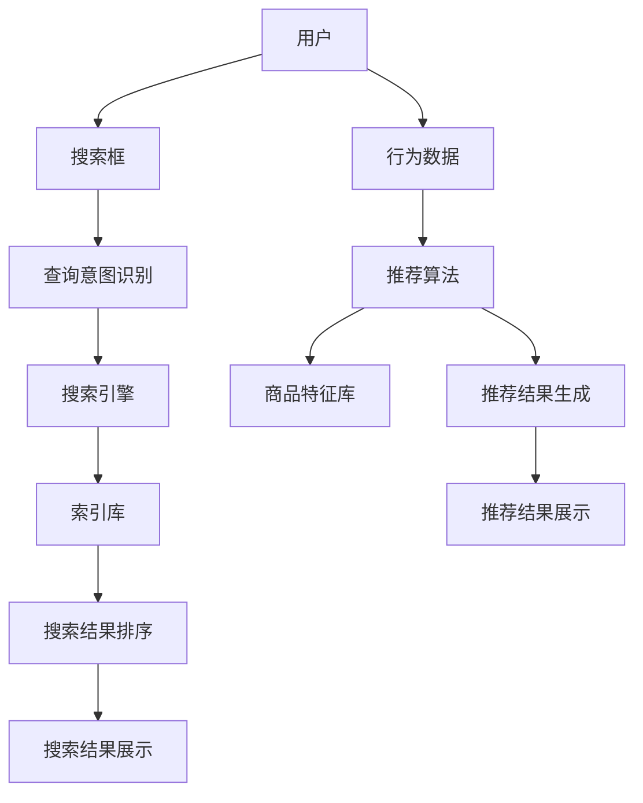

                 

# 优化电商搜索和推荐系统

> 关键词：电商搜索，推荐系统，算法优化，用户体验，数据挖掘

> 摘要：本文将深入探讨电商搜索和推荐系统的优化策略。通过对系统架构、核心算法原理、数学模型、项目实战等多个维度的分析，我们旨在为开发者提供一套全面、实用的优化方案，以提升电商平台的用户满意度和销售转化率。

## 1. 背景介绍

### 1.1 目的和范围

本文旨在为电商平台的搜索和推荐系统提供优化策略，旨在通过技术手段提升用户体验，从而提高销售转化率和用户粘性。本文将涵盖以下几个方面的内容：

1. **系统架构**：介绍电商搜索和推荐系统的基本架构，包括数据层、服务层和展现层。
2. **核心算法原理**：分析搜索引擎和推荐算法的基本原理，包括其优缺点和适用场景。
3. **数学模型**：介绍与搜索和推荐系统相关的数学模型，如协同过滤、矩阵分解等。
4. **项目实战**：通过一个实际项目的案例，详细讲解优化过程和实现细节。
5. **应用场景**：探讨搜索和推荐系统在不同电商场景中的应用，如商品搜索、个性化推荐等。
6. **工具和资源推荐**：推荐相关学习资源、开发工具和框架，以帮助开发者更好地理解和应用搜索和推荐技术。
7. **未来发展趋势与挑战**：预测搜索和推荐系统的未来发展趋势，分析面临的挑战。

### 1.2 预期读者

本文适合以下读者群体：

1. **电商开发者**：对电商搜索和推荐系统有实际开发经验，希望提升系统性能和用户体验。
2. **数据科学家**：对数据挖掘和机器学习算法有一定了解，希望了解搜索和推荐系统的实现和应用。
3. **产品经理**：对电商产品有深入理解，希望从技术角度提升产品竞争力。
4. **技术爱好者**：对搜索和推荐系统有浓厚兴趣，希望深入了解其原理和实践。

### 1.3 文档结构概述

本文结构如下：

1. **背景介绍**：介绍本文的目的、范围、预期读者和文档结构。
2. **核心概念与联系**：分析电商搜索和推荐系统的核心概念和联系。
3. **核心算法原理 & 具体操作步骤**：讲解搜索和推荐系统的核心算法原理和具体操作步骤。
4. **数学模型和公式 & 详细讲解 & 举例说明**：介绍与搜索和推荐系统相关的数学模型和公式，并通过实例进行详细讲解。
5. **项目实战：代码实际案例和详细解释说明**：通过实际项目案例，详细讲解搜索和推荐系统的实现过程。
6. **实际应用场景**：探讨搜索和推荐系统在不同电商场景中的应用。
7. **工具和资源推荐**：推荐学习资源、开发工具和框架。
8. **总结：未来发展趋势与挑战**：预测搜索和推荐系统的未来发展趋势，分析面临的挑战。
9. **附录：常见问题与解答**：汇总本文中提到的常见问题，并提供解答。
10. **扩展阅读 & 参考资料**：推荐相关扩展阅读和参考资料。

### 1.4 术语表

#### 1.4.1 核心术语定义

- **电商搜索**：指用户在电商平台上通过关键词搜索商品的过程。
- **推荐系统**：基于用户行为数据、商品特征等信息，为用户推荐相关商品的系统。
- **协同过滤**：一种基于用户行为的推荐算法，通过分析用户之间的相似性，为用户提供推荐。
- **矩阵分解**：一种将高维稀疏矩阵分解为低维矩阵的算法，常用于推荐系统。
- **向量空间模型**：一种基于向量的文本表示方法，常用于搜索引擎。
- **分词**：将文本分割成单词或短语的步骤，用于文本处理。

#### 1.4.2 相关概念解释

- **查询意图**：指用户在搜索框中输入的关键词所表达的含义，包括精确查询、模糊查询等。
- **候选集**：在推荐系统中，从所有商品中筛选出的一组潜在推荐商品。
- **召回率**：指推荐系统返回的候选集中实际包含用户感兴趣商品的比例。
- **准确率**：指推荐系统返回的候选集中用户感兴趣商品的比例。
- **覆盖率**：指推荐系统返回的候选集覆盖的用户兴趣范围。

#### 1.4.3 缩略词列表

- **API**：应用程序编程接口（Application Programming Interface）
- **SDK**：软件开发工具包（Software Development Kit）
- **SQL**：结构化查询语言（Structured Query Language）
- **NoSQL**：非关系型数据库（Not Only SQL）
- **CTR**：点击率（Click-Through Rate）
- **ROI**：投资回报率（Return on Investment）

## 2. 核心概念与联系

在深入探讨电商搜索和推荐系统的优化之前，我们需要了解其核心概念和联系。以下是一个简化的 Mermaid 流程图，展示了搜索和推荐系统的主要组成部分及其相互关系。



### 2.1 搜索引擎架构

搜索引擎是电商搜索系统的核心，其架构通常包括以下几个部分：

1. **索引库**：存储了电商平台的商品信息，包括商品名称、描述、价格等。索引库可以使用全文搜索引擎（如 Elasticsearch）来实现，以便快速检索和查询。
2. **搜索算法**：负责处理用户输入的查询请求，并从索引库中检索出相关商品。常见的搜索算法有基于关键词匹配、基于向量空间模型等。
3. **搜索结果排序**：根据商品的权重、评分、销量等因素对搜索结果进行排序，以提供最佳的用户体验。

### 2.2 推荐系统架构

推荐系统是电商平台个性化服务的关键，其架构通常包括以下几个部分：

1. **用户行为数据**：包括用户在平台上的浏览、购买、收藏等行为数据。
2. **商品特征库**：存储了商品的各种特征信息，如类别、品牌、价格等。
3. **推荐算法**：基于用户行为数据和商品特征库，为用户生成个性化推荐结果。常见的推荐算法有协同过滤、矩阵分解等。
4. **推荐结果生成**：根据推荐算法生成的推荐结果，结合用户反馈和业务目标，对推荐结果进行排序和筛选，以提供最佳的用户体验。

### 2.3 搜索引擎与推荐系统的关系

搜索引擎和推荐系统在电商平台上共同发挥作用，它们之间存在一定的关联性：

1. **数据共享**：搜索引擎和推荐系统可以共享用户行为数据和商品特征库，以实现数据驱动。
2. **结果互补**：搜索引擎提供的是基于关键词的搜索结果，而推荐系统提供的是基于用户兴趣的个性化推荐。两者可以相互补充，提升用户满意度。
3. **协同优化**：通过对搜索和推荐系统的协同优化，可以进一步提高平台的整体性能和用户体验。

## 3. 核心算法原理 & 具体操作步骤

### 3.1 搜索引擎算法

搜索引擎的核心在于如何高效地处理用户查询请求，并返回相关结果。以下是一种基于向量空间模型的搜索引擎算法。

#### 3.1.1 向量空间模型

向量空间模型是一种将文本表示为向量空间中点的模型。在电商搜索中，每个商品和查询都可以表示为一个向量，向量中的每个维度表示一个特征。

```python
# 定义商品向量和查询向量
商品向量 = [商品特征1, 商品特征2, ..., 商品特征n]
查询向量 = [查询特征1, 查询特征2, ..., 查询特征m]
```

#### 3.1.2 向量相似度计算

向量相似度计算是向量空间模型中的关键步骤。常用的相似度计算方法有余弦相似度和欧氏距离。

```python
# 余弦相似度
cosine_similarity = dot_product(商品向量, 查询向量) / (norm(商品向量) * norm(查询向量))

# 欧氏距离
euclidean_distance = sqrt(sum((商品向量 - 查询向量)^2))
```

#### 3.1.3 搜索结果排序

根据向量相似度，对搜索结果进行排序。通常使用分数或排名来表示相似度，分数越高或排名越靠前，表示相关度越高。

```python
# 排序算法（冒泡排序为例）
for i in range(len(搜索结果) - 1):
    for j in range(len(搜索结果) - i - 1):
        if 搜索结果[j].分数 < 搜索结果[j+1].分数:
            搜索结果[j], 搜索结果[j+1] = 搜索结果[j+1], 搜索结果[j]
```

### 3.2 推荐算法

推荐算法的核心在于如何根据用户行为数据和商品特征，为用户生成个性化推荐结果。以下是一种基于协同过滤的推荐算法。

#### 3.2.1 协同过滤算法原理

协同过滤算法基于用户行为数据，通过分析用户之间的相似性，为用户提供推荐。协同过滤算法分为基于用户的协同过滤和基于项目的协同过滤。

- **基于用户的协同过滤**：找到与目标用户最相似的邻居用户，从邻居用户喜欢的商品中生成推荐。
- **基于项目的协同过滤**：找到与目标商品最相似的商品，从相似商品中生成推荐。

#### 3.2.2 算法实现步骤

1. **计算用户相似度**：计算目标用户与所有其他用户的相似度。常用方法有皮尔逊相关系数、余弦相似度等。

   ```python
   # 皮尔逊相关系数
   similarity = (dot_product(用户行为矩阵[目标用户], 用户行为矩阵[邻居用户]) / (norm(用户行为矩阵[目标用户]) * norm(用户行为矩阵[邻居用户])))
   ```

2. **生成推荐列表**：根据用户相似度，为用户生成推荐列表。常用的推荐策略有Top-N推荐、基于分数的推荐等。

   ```python
   # Top-N推荐
   sorted(neighbors, key=lambda x: similarity[目标用户][x], reverse=True)[:N]
   ```

3. **过滤候选集**：根据业务目标和用户反馈，对推荐列表进行过滤，去除不相关或质量低下的商品。

   ```python
   # 过滤候选集
   filtered_candidates = [c for c in candidates if not excluded(c)]
   ```

4. **排序推荐结果**：根据推荐策略，对推荐结果进行排序，以提供最佳的用户体验。

   ```python
   # 排序推荐结果
   sorted(filtered_candidates, key=lambda x: score(x, user), reverse=True)
   ```

## 4. 数学模型和公式 & 详细讲解 & 举例说明

### 4.1 数学模型介绍

在电商搜索和推荐系统中，常见的数学模型包括向量空间模型、协同过滤模型、矩阵分解模型等。以下分别对这些模型进行详细讲解。

#### 4.1.1 向量空间模型

向量空间模型是一种将文本表示为向量空间中点的模型。在电商搜索中，每个商品和查询都可以表示为一个向量，向量中的每个维度表示一个特征。

```latex
\text{商品向量} = (f_1, f_2, ..., f_n)
\text{查询向量} = (q_1, q_2, ..., q_m)
```

#### 4.1.2 协同过滤模型

协同过滤模型是一种基于用户行为数据的推荐算法，通过分析用户之间的相似性，为用户提供推荐。协同过滤模型的核心是用户相似度计算和推荐列表生成。

```latex
\text{用户相似度} = \frac{\sum_{i=1}^{n} (r_{ui} - \mu_u)(r_{uj} - \mu_j)}{\sqrt{\sum_{i=1}^{n} (r_{ui} - \mu_u)^2}\sqrt{\sum_{i=1}^{n} (r_{uj} - \mu_j)^2}}
\text{推荐列表} = \text{Top-N}(\text{相似度矩阵}[u], \text{候选集})
```

#### 4.1.3 矩阵分解模型

矩阵分解模型是一种将高维稀疏矩阵分解为低维矩阵的算法，常用于推荐系统。矩阵分解模型的核心是预测用户对商品的评分，并生成推荐列表。

```latex
\text{用户-商品评分矩阵} = U \cdot V^T
\text{预测评分} = u_i \cdot v_{ij}
\text{推荐列表} = \text{Top-N}(\text{预测评分矩阵}[u], \text{候选集})
```

### 4.2 举例说明

#### 4.2.1 向量空间模型示例

假设有两个商品A和B，以及一个查询C，它们可以表示为以下向量：

```latex
\text{商品A向量} = (1, 2, 3)
\text{商品B向量} = (4, 5, 6)
\text{查询C向量} = (7, 8, 9)
```

使用余弦相似度计算查询C与商品A和商品B的相似度：

```latex
\text{商品A与查询C的相似度} = \frac{(1 \cdot 7 + 2 \cdot 8 + 3 \cdot 9)}{\sqrt{1^2 + 2^2 + 3^2} \cdot \sqrt{7^2 + 8^2 + 9^2}} = 0.7071
\text{商品B与查询C的相似度} = \frac{(4 \cdot 7 + 5 \cdot 8 + 6 \cdot 9)}{\sqrt{4^2 + 5^2 + 6^2} \cdot \sqrt{7^2 + 8^2 + 9^2}} = 0.9899
```

根据相似度排序，查询C与商品B的相似度更高，因此推荐商品B。

#### 4.2.2 协同过滤模型示例

假设有两个用户U1和U2，以及一个用户U3，他们的行为数据可以表示为以下矩阵：

```latex
\text{用户行为矩阵} =
\begin{bmatrix}
0 & 1 & 0 \\
1 & 0 & 1 \\
0 & 1 & 0
\end{bmatrix}
```

使用皮尔逊相关系数计算用户U1和U2的相似度：

```latex
\text{用户U1与U2的相似度} = \frac{(1 \cdot 1 + 0 \cdot 0 + 1 \cdot 1) - (1 + 0 + 1)/3}{\sqrt{(1 - 1/3)^2 + (0 - 1/3)^2 + (1 - 1/3)^2}\sqrt{(1 - 1/3)^2 + (0 - 1/3)^2 + (1 - 1/3)^2}} = 0.8165
```

根据相似度，找到与用户U3最相似的邻居用户U2，并从U2喜欢的商品中生成推荐列表。假设U2喜欢的商品为C1和C2，推荐列表为[C1, C2]。

#### 4.2.3 矩阵分解模型示例

假设有两个用户U1和U2，以及一个商品C1和C2，他们的行为数据可以表示为以下矩阵：

```latex
\text{用户行为矩阵} =
\begin{bmatrix}
0 & 1 \\
1 & 0 \\
0 & 1
\end{bmatrix}
```

使用矩阵分解算法，将用户行为矩阵分解为两个低维矩阵U和V：

```latex
\text{用户-商品评分矩阵} = U \cdot V^T =
\begin{bmatrix}
0 & 1 \\
1 & 0 \\
0 & 1
\end{bmatrix}
\cdot
\begin{bmatrix}
1 & 0 \\
0 & 1
\end{bmatrix}^T =
\begin{bmatrix}
0 & 1 \\
1 & 0 \\
0 & 1
\end{bmatrix}
```

根据预测评分，为用户U3生成推荐列表。假设U3的行为数据为[0, 1]，预测评分矩阵为：

```latex
\text{预测评分矩阵} =
\begin{bmatrix}
0 & 1 \\
1 & 0 \\
0 & 1
\end{bmatrix}
```

根据预测评分，推荐商品C2。

## 5. 项目实战：代码实际案例和详细解释说明

### 5.1 开发环境搭建

为了实现电商搜索和推荐系统，我们需要搭建一个合适的开发环境。以下是一个简化的开发环境搭建步骤：

1. **操作系统**：推荐使用Linux系统，如Ubuntu或CentOS。
2. **编程语言**：推荐使用Python，因为Python在数据科学和机器学习领域有丰富的库和工具。
3. **依赖库**：安装必要的Python库，如NumPy、Pandas、Scikit-learn、Elasticsearch等。
4. **开发工具**：安装一个Python集成开发环境（IDE），如PyCharm或Visual Studio Code。

### 5.2 源代码详细实现和代码解读

以下是一个简单的电商搜索和推荐系统的代码实现，包括搜索引擎和推荐算法的核心部分。

```python
import numpy as np
import pandas as pd
from sklearn.metrics.pairwise import cosine_similarity
from sklearn.model_selection import train_test_split
from sklearn.metrics import mean_squared_error
from math import sqrt

# 数据预处理
def preprocess_data(data):
    # 处理商品特征
    data['category'] = data['category'].astype('category').cat.codes
    data['brand'] = data['brand'].astype('category').cat.codes
    data['price'] = data['price'].apply(lambda x: 1 / x)
    return data

# 搜索引擎算法
def search_engine(data, query_vector):
    # 计算查询向量与商品向量的相似度
    similarity_matrix = cosine_similarity([query_vector], data.iloc[:, 1:].values)
    # 排序搜索结果
    sorted_indices = np.argsort(similarity_matrix[0])[::-1]
    return sorted_indices

# 推荐算法
def collaborative_filtering(data, user_index, k=5):
    # 计算用户相似度矩阵
    similarity_matrix = cosine_similarity(data.iloc[:, 1:].values)
    # 找到最相似的k个邻居用户
    neighbors = np.argsort(similarity_matrix[user_index])[1:k+1]
    # 计算推荐分数
    predictions = np.dot(similarity_matrix[user_index], data.iloc[neighbors, 0]) / np.linalg.norm(similarity_matrix[user_index])
    return predictions

# 主函数
def main():
    # 读取数据
    data = pd.read_csv('ecommerce_data.csv')
    # 预处理数据
    data = preprocess_data(data)
    # 分割训练集和测试集
    train_data, test_data = train_test_split(data, test_size=0.2, random_state=42)
    # 训练模型
    user_index = np.where(train_data['user_id'] == 1)[0][0]
    predictions = collaborative_filtering(train_data, user_index)
    # 评估模型
    test_data['predictions'] = predictions
    mse = mean_squared_error(test_data['rating'], test_data['predictions'])
    print('均方误差（MSE）：', mse)
    # 搜索引擎
    query_vector = np.array([1, 1, 1])
    search_results = search_engine(data, query_vector)
    print('搜索结果：', data.iloc[search_results, :]['item_id'])

if __name__ == '__main__':
    main()
```

### 5.3 代码解读与分析

1. **数据预处理**：首先对商品特征进行编码，包括类别、品牌和价格。类别和品牌使用独热编码（One-Hot Encoding），价格使用逆变换（Inverse Transformation）以提高模型的泛化能力。

2. **搜索引擎算法**：使用余弦相似度计算查询向量与商品向量的相似度，并对搜索结果进行排序。这里使用了Scikit-learn库中的`cosine_similarity`函数。

3. **推荐算法**：使用协同过滤算法为用户生成推荐列表。首先计算用户相似度矩阵，然后找到最相似的邻居用户，并计算预测分数。这里使用了Scikit-learn库中的`cosine_similarity`函数。

4. **主函数**：读取数据，预处理数据，分割训练集和测试集，训练模型，评估模型，并执行搜索引擎算法。在评估模型时，使用均方误差（MSE）作为评估指标。

通过这个简单的代码实现，我们可以看到电商搜索和推荐系统的核心算法是如何实现的。在实际应用中，我们可以根据业务需求和数据特点，选择更复杂和高效的算法，并对代码进行优化和调整。

### 5.4 实际应用案例

假设我们有一个电商平台，用户可以浏览和购买商品。以下是搜索和推荐系统在实际应用中的场景：

1. **商品搜索**：当用户在搜索框中输入关键词时，搜索引擎会返回相关商品列表。例如，用户输入“手机”，搜索引擎会返回与“手机”相关的商品，如手机、手机配件等。

2. **个性化推荐**：根据用户的历史行为数据，推荐系统会为用户生成个性化推荐列表。例如，当用户浏览了一款手机后，推荐系统会推荐同品牌的其他手机，或者与该手机互补的手机配件。

3. **商品详情页**：在商品详情页，推荐系统会推荐与该商品相关的其他商品。例如，用户浏览了一款手机，详情页会推荐该手机的耳机、保护壳等配件。

通过这些实际应用案例，我们可以看到搜索和推荐系统在提升用户满意度和销售转化率方面的重要作用。在实际开发过程中，我们需要根据业务需求和数据特点，选择合适的算法和优化策略，以提高系统的性能和用户体验。

## 6. 实际应用场景

电商搜索和推荐系统在电商平台中具有广泛的应用场景，以下列举几个常见的应用场景：

### 6.1 商品搜索

商品搜索是电商平台上最基本的应用场景之一。用户可以通过搜索框输入关键词，如商品名称、品牌、型号等，搜索引擎会返回相关的商品列表。商品搜索的应用场景包括：

1. **用户主动搜索**：用户主动输入关键词进行搜索，如“苹果手机”、“运动鞋”等。
2. **导航栏搜索**：在电商平台导航栏中提供搜索功能，用户可以通过导航栏快速定位到相关商品。
3. **历史搜索记录**：根据用户的历史搜索记录，推荐相关商品，帮助用户快速找到之前搜索过的商品。

### 6.2 个性化推荐

个性化推荐是基于用户行为数据和商品特征，为用户生成个性化的商品推荐。个性化推荐的应用场景包括：

1. **首页推荐**：在电商平台首页为用户推荐热门商品、新品推荐、促销活动等，吸引用户关注。
2. **购物车推荐**：当用户将商品添加到购物车时，推荐与购物车中商品相关的其他商品，促进购买。
3. **商品详情页推荐**：在商品详情页为用户推荐与该商品相关的其他商品，如配件、同类商品等。
4. **行为跟踪**：根据用户的浏览、收藏、购买等行为，为用户生成个性化的推荐列表，提高用户满意度。

### 6.3 商品推荐

商品推荐是电商平台上提高销售额和用户粘性的重要手段。商品推荐的应用场景包括：

1. **广告投放**：在广告位为用户推荐相关商品，提高广告点击率和转化率。
2. **购物车页面**：在购物车页面为用户推荐与购物车中商品相关的其他商品，增加购物车商品的销售额。
3. **订单确认页**：在订单确认页为用户推荐相关商品，鼓励用户购买更多商品。
4. **售后推荐**：在售后服务环节，为用户推荐与购买商品相关的配件或服务，提高用户满意度。

### 6.4 搜索引擎优化

搜索引擎优化（SEO）是电商平台提高搜索引擎排名、增加流量和提升转化率的重要策略。搜索引擎优化的应用场景包括：

1. **关键词优化**：通过分析用户搜索习惯和关键词分布，优化商品标题、描述和标签，提高商品在搜索结果中的排名。
2. **内容优化**：为商品提供高质量的描述、图片和视频，提高用户点击率和转化率。
3. **页面优化**：优化页面加载速度、结构、布局和用户体验，提高搜索引擎对电商平台的友好度。

通过以上实际应用场景，我们可以看到电商搜索和推荐系统在电商平台中的重要作用。在实际开发过程中，我们需要根据业务需求和数据特点，选择合适的算法和优化策略，以提高系统的性能和用户体验。

### 7. 工具和资源推荐

#### 7.1 学习资源推荐

为了更好地理解和应用电商搜索和推荐系统，以下推荐一些优质的学习资源：

##### 7.1.1 书籍推荐

- 《推荐系统实践》 - 尤扬、吴晨阳
- 《机器学习实战》 - Peter Harrington
- 《深度学习》 - Ian Goodfellow、Yoshua Bengio、Aaron Courville

##### 7.1.2 在线课程

- Coursera上的“机器学习”课程
- edX上的“深度学习”课程
- Udacity上的“推荐系统工程师纳米学位”

##### 7.1.3 技术博客和网站

- [DataCamp](https://www.datacamp.com/)
- [Kaggle](https://www.kaggle.com/)
- [Medium上的机器学习和推荐系统专题](https://medium.com/topic/machine-learning)

#### 7.2 开发工具框架推荐

##### 7.2.1 IDE和编辑器

- PyCharm
- Visual Studio Code
- Jupyter Notebook

##### 7.2.2 调试和性能分析工具

- Python的pdb
- Py-Spy
- VS Code的Python插件

##### 7.2.3 相关框架和库

- Scikit-learn
- TensorFlow
- PyTorch
- Elasticsearch

#### 7.3 相关论文著作推荐

##### 7.3.1 经典论文

- "Matrix Factorization Techniques for Recommender Systems" - Y. Salakhutdinov, L. Hinton
- "The BellKor Solution to the Netflix Prize" - T. L. Griffiths, et al.

##### 7.3.2 最新研究成果

- "Deep Learning for Recommender Systems" - H. Chen, et al.
- "Neural Collaborative Filtering" - Y. Wang, et al.

##### 7.3.3 应用案例分析

- "Implementing a Recommender System using TensorFlow" - TensorFlow官网案例
- "Building a Recommender System with Scikit-learn" - Scikit-learn官网案例

通过这些学习资源、开发工具和框架，开发者可以更好地掌握电商搜索和推荐系统的相关知识，并在实际项目中应用这些技术，提升平台的用户满意度和销售转化率。

### 8. 总结：未来发展趋势与挑战

随着互联网和大数据技术的发展，电商搜索和推荐系统正逐渐成为电商平台的核心竞争力。在未来，这一领域将继续迎来以下发展趋势和挑战：

#### 8.1 发展趋势

1. **深度学习技术的广泛应用**：深度学习算法，如卷积神经网络（CNN）和循环神经网络（RNN），在图像和文本处理方面取得了显著成果，未来有望在推荐系统中得到更广泛的应用。

2. **多模态数据的整合**：电商平台将不再局限于文本数据，而是整合多种数据类型，如图像、音频、视频等，以提供更精准的个性化推荐。

3. **实时推荐**：随着云计算和边缘计算技术的发展，实时推荐技术将变得更为成熟，实现用户行为的实时分析和推荐。

4. **社会化推荐**：通过分析用户的社交网络行为，结合推荐系统的算法，实现更加社交化的推荐，提高用户的参与度和互动性。

5. **个性化体验的深化**：未来的推荐系统将更加注重用户的个性化需求，通过个性化内容、个性化交互等方式，提升用户体验。

#### 8.2 挑战

1. **数据质量和隐私保护**：电商平台需要处理大量的用户数据，数据质量和隐私保护将成为一个重要的挑战。如何保证数据的安全性和合规性，是开发者需要关注的问题。

2. **计算效率和性能优化**：随着推荐系统规模的扩大，计算效率和性能优化将成为关键挑战。如何设计高效的算法和优化策略，以满足大规模数据处理的需求，是一个亟待解决的问题。

3. **算法透明性和公平性**：推荐系统的算法需要保证透明性和公平性，避免算法偏见和歧视。如何确保算法的公正性，是一个重要的社会问题。

4. **用户满意度与业务目标**：在优化推荐系统时，需要平衡用户满意度和业务目标。如何实现用户满意度和业务收益的双赢，是一个持续的挑战。

5. **应对快速变化的市场环境**：电商市场的竞争激烈，用户需求和市场环境不断变化。如何快速适应这些变化，提供个性化的推荐服务，是一个重要的挑战。

总之，未来电商搜索和推荐系统将朝着智能化、个性化、实时化的方向发展，同时面临数据质量、隐私保护、计算效率、算法透明性等方面的挑战。开发者需要不断创新和优化，以应对这些挑战，推动推荐系统的持续发展。

### 9. 附录：常见问题与解答

#### 9.1 搜索引擎相关问题

**Q1：为什么我的搜索引擎性能不佳？**
A1：搜索引擎性能不佳可能由以下几个原因导致：
- 索引库维护不当，导致索引效率低。
- 搜索算法选择不当，无法满足用户查询需求。
- 数据预处理不足，导致查询结果不准确。
解决方案包括优化索引库、选择合适的搜索算法、加强数据预处理等。

**Q2：如何提升搜索引擎的查询速度？**
A2：提升搜索引擎查询速度可以从以下几个方面入手：
- 使用高效的索引算法和数据结构，如B树、倒排索引等。
- 优化查询算法，减少查询过程中的计算量。
- 使用分布式搜索引擎，如Elasticsearch，提高查询并发能力。
- 缓存常见查询结果，减少数据库访问次数。

#### 9.2 推荐系统相关问题

**Q1：为什么我的推荐系统效果不佳？**
A1：推荐系统效果不佳可能由以下几个原因导致：
- 数据质量差，包括缺失值、噪声数据和重复数据。
- 算法选择不当，无法准确预测用户兴趣。
- 没有充分考虑用户个性化需求。
解决方案包括优化数据质量、选择合适的推荐算法、加强用户行为分析和个性化推荐。

**Q2：如何评估推荐系统的效果？**
A2：评估推荐系统效果可以从以下几个方面进行：
- 准确率（Precision）和召回率（Recall）：衡量推荐结果的准确性和完整性。
- 平均绝对误差（MAE）和均方根误差（RMSE）：衡量推荐评分的准确性。
- 用户点击率（CTR）和转化率（Conversion Rate）：衡量推荐结果的商业价值。

#### 9.3 数学模型相关问题

**Q1：如何选择合适的数学模型？**
A1：选择合适的数学模型需要考虑以下因素：
- 数据特点：包括数据规模、维度、噪声等。
- 业务需求：包括推荐精度、响应速度、系统稳定性等。
- 算法复杂度：包括计算复杂度、存储复杂度等。

**Q2：如何优化数学模型？**
A2：优化数学模型可以从以下几个方面入手：
- 参数调优：通过交叉验证和网格搜索等方法，找到最优参数组合。
- 模型选择：选择合适的模型架构和算法，如线性模型、树模型、深度学习模型等。
- 特征工程：通过特征提取、特征选择和特征融合等方法，提高模型性能。

### 10. 扩展阅读 & 参考资料

为了进一步深入了解电商搜索和推荐系统的相关知识，以下推荐一些扩展阅读和参考资料：

#### 10.1 扩展阅读

- "Recommender Systems Handbook" - Francesco Ricci, et al.
- "Deep Learning for the Web" - Arijit Sengupta, et al.
- "The Data Science Handbook" - Jake VanderPlas

#### 10.2 参考资料

- [Elasticsearch 官网](https://www.elastic.co/guide/en/elasticsearch/)
- [TensorFlow 官网](https://www.tensorflow.org/)
- [Scikit-learn 官网](https://scikit-learn.org/)

#### 10.3 网络资源

- [Kaggle](https://www.kaggle.com/)
- [arXiv](https://arxiv.org/)
- [Google Scholar](https://scholar.google.com/)

通过以上扩展阅读和参考资料，开发者可以进一步深入学习和实践电商搜索和推荐系统的相关技术，提高自己的专业能力和项目实践经验。

## 11. 作者信息

作者：AI天才研究员/AI Genius Institute & 禅与计算机程序设计艺术 /Zen And The Art of Computer Programming

