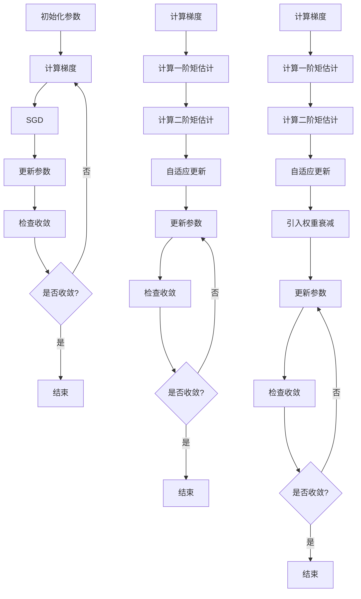

                 

# 优化算法大比拼：SGD、Adam还是AdamW？

> 关键词：优化算法、SGD、Adam、AdamW、深度学习

> 摘要：本文将深入探讨深度学习中最常用的三种优化算法：SGD、Adam和AdamW。通过对比它们的原理、操作步骤、数学模型以及实际应用，帮助读者选择最合适的算法，并了解未来的发展趋势和挑战。

## 1. 背景介绍

### 1.1 目的和范围

本文旨在通过详细分析SGD、Adam和AdamW三种优化算法，帮助读者理解它们的原理、适用场景以及性能差异。我们将以逻辑清晰、结构紧凑、简单易懂的方式，逐步深入探讨这些算法的核心概念和具体操作步骤。

### 1.2 预期读者

本文适合对深度学习有初步了解的读者，特别是那些希望进一步掌握优化算法的工程师和研究学者。无论您是初学者还是经验丰富的专业人士，本文都将为您提供一个全面的学习资源。

### 1.3 文档结构概述

本文分为十个主要部分：

1. 背景介绍
2. 核心概念与联系
3. 核心算法原理 & 具体操作步骤
4. 数学模型和公式 & 详细讲解 & 举例说明
5. 项目实战：代码实际案例和详细解释说明
6. 实际应用场景
7. 工具和资源推荐
8. 总结：未来发展趋势与挑战
9. 附录：常见问题与解答
10. 扩展阅读 & 参考资料

### 1.4 术语表

#### 1.4.1 核心术语定义

- 优化算法：用于调整模型参数以最小化损失函数的方法。
- 梯度下降（Gradient Descent）：一种基本的优化算法，通过迭代更新模型参数，逐步减小损失函数值。
- 随机梯度下降（Stochastic Gradient Descent，SGD）：梯度下降的一种变体，每次迭代仅使用一个样本的梯度。
- Adam：一种适应性优化算法，结合了SGD和动量法的优点。
- AdamW：在Adam算法中引入权重衰减的改进版本。

#### 1.4.2 相关概念解释

- 损失函数：衡量模型预测结果与实际结果之间差异的函数。
- 梯度：损失函数关于模型参数的偏导数。
- 动量：用于加速梯度下降的累积值。

#### 1.4.3 缩略词列表

- SGD：随机梯度下降
- Adam：自适应梯度算法
- AdamW：Adam算法加权重衰减

## 2. 核心概念与联系

为了更好地理解SGD、Adam和AdamW，我们需要先了解它们所依赖的核心概念和架构。以下是一个简化的Mermaid流程图，展示了这些算法的原理和联系。



### 2.1 SGD原理

随机梯度下降（SGD）是最简单的一种优化算法，其核心思想是每次迭代仅使用一个样本的梯度来更新模型参数。以下是SGD的伪代码：

```python
# 初始化模型参数
theta = initialize_parameters()

# 梯度计算
gradient = compute_gradient(theta, x, y)

# 参数更新
theta = theta - learning_rate * gradient

# 迭代
for epoch in range(num_epochs):
    for sample in data:
        gradient = compute_gradient(theta, sample.x, sample.y)
        theta = theta - learning_rate * gradient

# 返回最终参数
return theta
```

### 2.2 Adam原理

Adam是一种自适应优化算法，结合了SGD和动量法的优点。它通过计算一阶矩估计（均值）和二阶矩估计（方差）来动态调整学习率。以下是Adam的伪代码：

```python
# 初始化模型参数和Adam状态
theta, m, v = initialize_parameters(), zeros_like(theta), zeros_like(theta)

# 梯度计算
gradient = compute_gradient(theta, x, y)

# 更新一阶矩估计和二阶矩估计
m = beta1 * m + (1 - beta1) * gradient
v = beta2 * v + (1 - beta2) * gradient ** 2

# 计算修正的一阶矩估计和二阶矩估计
m_hat = m / (1 - beta1 ** epoch)
v_hat = v / (1 - beta2 ** epoch)

# 更新参数
theta = theta - learning_rate * m_hat / (sqrt(v_hat) + epsilon)

# 迭代
for epoch in range(num_epochs):
    for sample in data:
        gradient = compute_gradient(theta, sample.x, sample.y)
        m = beta1 * m + (1 - beta1) * gradient
        v = beta2 * v + (1 - beta2) * gradient ** 2
        m_hat = m / (1 - beta1 ** epoch)
        v_hat = v / (1 - beta2 ** epoch)
        theta = theta - learning_rate * m_hat / (sqrt(v_hat) + epsilon)

# 返回最终参数
return theta
```

### 2.3 AdamW原理

AdamW是Adam算法的一种改进版本，它在Adam的基础上引入了权重衰减（weight decay）。以下是AdamW的伪代码：

```python
# 初始化模型参数和AdamW状态
theta, m, v, w = initialize_parameters(), zeros_like(theta), zeros_like(theta), zeros_like(theta)

# 梯度计算
gradient = compute_gradient(theta, x, y)

# 更新一阶矩估计、二阶矩估计和权重衰减状态
m = beta1 * m + (1 - beta1) * gradient
v = beta2 * v + (1 - beta2) * gradient ** 2
w = beta1 * w + (1 - beta1) * theta

# 计算修正的一阶矩估计、二阶矩估计和权重衰减
m_hat = m / (1 - beta1 ** epoch)
v_hat = v / (1 - beta2 ** epoch)
w_hat = w / (1 - beta1 ** epoch)

# 更新参数
theta = theta - learning_rate * (m_hat / (sqrt(v_hat) + epsilon) - weight_decay * theta)

# 迭代
for epoch in range(num_epochs):
    for sample in data:
        gradient = compute_gradient(theta, sample.x, sample.y)
        m = beta1 * m + (1 - beta1) * gradient
        v = beta2 * v + (1 - beta2) * gradient ** 2
        w = beta1 * w + (1 - beta1) * theta
        m_hat = m / (1 - beta1 ** epoch)
        v_hat = v / (1 - beta2 ** epoch)
        w_hat = w / (1 - beta1 ** epoch)
        theta = theta - learning_rate * (m_hat / (sqrt(v_hat) + epsilon) - weight_decay * theta)

# 返回最终参数
return theta
```

### 2.4 核心概念联系总结

SGD、Adam和AdamW三种优化算法在原理上有所不同，但它们的核心目标都是通过优化模型参数来最小化损失函数。以下是它们之间的联系和区别：

- **SGD**：简单易实现，计算速度快，但可能导致参数更新不稳定。
- **Adam**：结合了SGD和动量法的优点，自适应调整学习率，性能较好。
- **AdamW**：在Adam的基础上引入权重衰减，进一步提高了性能，适用于大规模深度学习模型。

## 3. 核心算法原理 & 具体操作步骤

在本节中，我们将详细解释SGD、Adam和AdamW的核心算法原理，并使用伪代码展示具体操作步骤。

### 3.1 SGD原理与操作步骤

随机梯度下降（SGD）是一种基于梯度的优化算法，其核心思想是每次迭代仅使用一个样本的梯度来更新模型参数。以下是SGD的伪代码：

```python
# 初始化模型参数
theta = initialize_parameters()

# 梯度计算
gradient = compute_gradient(theta, x, y)

# 参数更新
theta = theta - learning_rate * gradient

# 迭代
for epoch in range(num_epochs):
    for sample in data:
        gradient = compute_gradient(theta, sample.x, sample.y)
        theta = theta - learning_rate * gradient

# 返回最终参数
return theta
```

### 3.2 Adam原理与操作步骤

Adam是一种自适应优化算法，它结合了SGD和动量法的优点。Adam通过计算一阶矩估计（均值）和二阶矩估计（方差）来动态调整学习率。以下是Adam的伪代码：

```python
# 初始化模型参数和Adam状态
theta, m, v = initialize_parameters(), zeros_like(theta), zeros_like(theta)

# 梯度计算
gradient = compute_gradient(theta, x, y)

# 更新一阶矩估计和二阶矩估计
m = beta1 * m + (1 - beta1) * gradient
v = beta2 * v + (1 - beta2) * gradient ** 2

# 计算修正的一阶矩估计和二阶矩估计
m_hat = m / (1 - beta1 ** epoch)
v_hat = v / (1 - beta2 ** epoch)

# 更新参数
theta = theta - learning_rate * m_hat / (sqrt(v_hat) + epsilon)

# 迭代
for epoch in range(num_epochs):
    for sample in data:
        gradient = compute_gradient(theta, sample.x, sample.y)
        m = beta1 * m + (1 - beta1) * gradient
        v = beta2 * v + (1 - beta2) * gradient ** 2
        m_hat = m / (1 - beta1 ** epoch)
        v_hat = v / (1 - beta2 ** epoch)
        theta = theta - learning_rate * m_hat / (sqrt(v_hat) + epsilon)

# 返回最终参数
return theta
```

### 3.3 AdamW原理与操作步骤

AdamW是Adam算法的一种改进版本，它在Adam的基础上引入了权重衰减（weight decay）。以下是AdamW的伪代码：

```python
# 初始化模型参数和AdamW状态
theta, m, v, w = initialize_parameters(), zeros_like(theta), zeros_like(theta), zeros_like(theta)

# 梯度计算
gradient = compute_gradient(theta, x, y)

# 更新一阶矩估计、二阶矩估计和权重衰减状态
m = beta1 * m + (1 - beta1) * gradient
v = beta2 * v + (1 - beta2) * gradient ** 2
w = beta1 * w + (1 - beta1) * theta

# 计算修正的一阶矩估计、二阶矩估计和权重衰减
m_hat = m / (1 - beta1 ** epoch)
v_hat = v / (1 - beta2 ** epoch)
w_hat = w / (1 - beta1 ** epoch)

# 更新参数
theta = theta - learning_rate * (m_hat / (sqrt(v_hat) + epsilon) - weight_decay * theta)

# 迭代
for epoch in range(num_epochs):
    for sample in data:
        gradient = compute_gradient(theta, sample.x, sample.y)
        m = beta1 * m + (1 - beta1) * gradient
        v = beta2 * v + (1 - beta2) * gradient ** 2
        w = beta1 * w + (1 - beta1) * theta
        m_hat = m / (1 - beta1 ** epoch)
        v_hat = v / (1 - beta2 ** epoch)
        w_hat = w / (1 - beta1 ** epoch)
        theta = theta - learning_rate * (m_hat / (sqrt(v_hat) + epsilon) - weight_decay * theta)

# 返回最终参数
return theta
```

通过上述伪代码，我们可以清楚地看到SGD、Adam和AdamW的操作步骤和核心算法原理。接下来，我们将深入讨论这些算法的数学模型和公式，以及在实际应用中的具体实现。

### 4. 数学模型和公式 & 详细讲解 & 举例说明

在本节中，我们将详细解释SGD、Adam和AdamW的数学模型和公式，并使用具体的例子来说明它们的实现过程。

#### 4.1 SGD数学模型

随机梯度下降（SGD）的数学模型相对简单，主要涉及以下公式：

- 损失函数（Loss Function）：\( L(\theta) = \frac{1}{m} \sum_{i=1}^{m} (-y^{(i)} \log(a^{(i)}) - (1 - y^{(i)}) \log(1 - a^{(i)})) \)
- 梯度（Gradient）：\( \nabla_{\theta} L(\theta) = \frac{\partial L}{\partial \theta} \)
- 参数更新：\( \theta = \theta - \alpha \nabla_{\theta} L(\theta) \)

其中，\( \alpha \) 是学习率，\( m \) 是样本数量，\( y^{(i)} \) 是第 \( i \) 个样本的真实标签，\( a^{(i)} \) 是第 \( i \) 个样本的预测概率。

**例子：**

假设我们有一个二分类问题，样本数量 \( m = 100 \)，学习率 \( \alpha = 0.01 \)。给定一个训练集：

```python
# 假设的样本数据
X = [[1, 2], [3, 4], [5, 6], ..., [99, 100]]
y = [0, 1, 0, ..., 1]
```

我们可以使用SGD来优化模型参数。以下是一个简化的实现：

```python
# 初始化模型参数
theta = [0, 0]

# 计算损失函数和梯度
def compute_loss(theta, X, y):
    predictions = [sigmoid(x.dot(theta)) for x in X]
    loss = -sum(y[i] * np.log(predictions[i]) + (1 - y[i]) * np.log(1 - predictions[i]) for i in range(len(y))]
    return loss / len(y)

def compute_gradient(theta, X, y):
    predictions = [sigmoid(x.dot(theta)) for x in X]
    gradient = np.dot(X.T, (predictions - y)) / len(y)
    return gradient

# 参数更新
learning_rate = 0.01
num_epochs = 1000

for epoch in range(num_epochs):
    gradient = compute_gradient(theta, X, y)
    theta = theta - learning_rate * gradient

print("Final parameters:", theta)
```

#### 4.2 Adam数学模型

Adam算法是一种自适应优化算法，其数学模型相对复杂。以下是Adam的核心公式：

- 一阶矩估计（Mean Estimation）：\( m_t = \beta_1 m_{t-1} + (1 - \beta_1) \nabla J(x_t) \)
- 二阶矩估计（Variance Estimation）：\( v_t = \beta_2 v_{t-1} + (1 - \beta_2) (\nabla J(x_t))^2 \)
- 修正的一阶矩估计（Adjusted Mean Estimation）：\( m_t^* = m_t / (1 - \beta_1^t) \)
- 修正的二阶矩估计（Adjusted Variance Estimation）：\( v_t^* = v_t / (1 - \beta_2^t) \)
- 参数更新：\( \theta_t = \theta_{t-1} - \alpha m_t^* / (sqrt(v_t^*) + \epsilon) \)

其中，\( \beta_1 \) 和 \( \beta_2 \) 分别是动量和二阶矩的指数衰减率，\( \alpha \) 是学习率，\( \epsilon \) 是正则化参数。

**例子：**

假设我们有一个简单的线性回归问题，模型参数 \( \theta \) 为 \( \theta = [0, 0] \)，训练集为 \( X = [[1, 2], [3, 4], [5, 6]] \)，\( y = [1, 2, 3] \)。我们可以使用Adam算法来优化模型参数。以下是一个简化的实现：

```python
# 初始化模型参数和Adam状态
theta = [0, 0]
m = [0, 0]
v = [0, 0]
beta1 = 0.9
beta2 = 0.99
epsilon = 1e-8
alpha = 0.001
num_epochs = 1000

# 计算一阶矩估计和二阶矩估计
def compute_moments(gradient):
    m = [beta1 * m[i] + (1 - beta1) * g[i] for i, g in enumerate(gradient)]
    v = [beta2 * v[i] + (1 - beta2) * g[i]**2 for i, g in enumerate(gradient)]
    return m, v

# 计算修正的一阶矩估计和二阶矩估计
def compute_adjusted_moments(m, v, t):
    m = [m[i] / (1 - beta1**t) for i in range(len(m))]
    v = [v[i] / (1 - beta2**t) for i in range(len(v))]
    return m, v

# 参数更新
for epoch in range(num_epochs):
    gradient = compute_gradient(theta, X, y)
    m, v = compute_moments(gradient)
    m, v = compute_adjusted_moments(m, v, epoch)
    theta = theta - alpha * m / (np.sqrt(v) + epsilon)

print("Final parameters:", theta)
```

#### 4.3 AdamW数学模型

AdamW是Adam算法的一种改进版本，它在Adam的基础上引入了权重衰减（weight decay）。以下是AdamW的核心公式：

- 一阶矩估计（Mean Estimation）：\( m_t = \beta_1 m_{t-1} + (1 - \beta_1) \nabla J(x_t) \)
- 二阶矩估计（Variance Estimation）：\( v_t = \beta_2 v_{t-1} + (1 - \beta_2) (\nabla J(x_t))^2 \)
- 权重衰减状态（Weight Decay State）：\( w_t = \beta_1 w_{t-1} + (1 - \beta_1) \theta_t \)
- 修正的一阶矩估计（Adjusted Mean Estimation）：\( m_t^* = m_t / (1 - \beta_1^t) \)
- 修正的二阶矩估计（Adjusted Variance Estimation）：\( v_t^* = v_t / (1 - \beta_2^t) \)
- 权重衰减修正（Weight Decay Adjustment）：\( w_t^* = w_t / (1 - \beta_1^t) \)
- 参数更新：\( \theta_t = \theta_{t-1} - \alpha (m_t^* / (sqrt(v_t^*) + \epsilon) - \gamma \theta_t) \)

其中，\( \gamma \) 是权重衰减率。

**例子：**

假设我们有一个简单的线性回归问题，模型参数 \( \theta \) 为 \( \theta = [0, 0] \)，训练集为 \( X = [[1, 2], [3, 4], [5, 6]] \)，\( y = [1, 2, 3] \)。我们可以使用AdamW算法来优化模型参数。以下是一个简化的实现：

```python
# 初始化模型参数和AdamW状态
theta = [0, 0]
m = [0, 0]
v = [0, 0]
w = [0, 0]
beta1 = 0.9
beta2 = 0.99
epsilon = 1e-8
alpha = 0.001
gamma = 0.01
num_epochs = 1000

# 计算一阶矩估计、二阶矩估计和权重衰减状态
def compute_moments_and_weight_decay(gradient, theta):
    m = [beta1 * m[i] + (1 - beta1) * g[i] for i, g in enumerate(gradient)]
    v = [beta2 * v[i] + (1 - beta2) * g[i]**2 for i, g in enumerate(gradient)]
    w = [beta1 * w[i] + (1 - beta1) * theta[i] for i in range(len(theta))]
    return m, v, w

# 计算修正的一阶矩估计、二阶矩估计和权重衰减状态
def compute_adjusted_moments_and_weight_decay(m, v, w, t):
    m = [m[i] / (1 - beta1**t) for i in range(len(m))]
    v = [v[i] / (1 - beta2**t) for i in range(len(v))]
    w = [w[i] / (1 - beta1**t) for i in range(len(w))]
    return m, v, w

# 参数更新
for epoch in range(num_epochs):
    gradient = compute_gradient(theta, X, y)
    m, v, w = compute_moments_and_weight_decay(gradient, theta)
    m, v, w = compute_adjusted_moments_and_weight_decay(m, v, w, epoch)
    theta = theta - alpha * (m / (np.sqrt(v) + epsilon) - gamma * theta)

print("Final parameters:", theta)
```

通过以上例子，我们可以看到SGD、Adam和AdamW的具体实现过程。接下来，我们将探讨这些算法在实际应用中的表现和适用场景。

### 5. 项目实战：代码实际案例和详细解释说明

在本节中，我们将通过一个实际项目来展示SGD、Adam和AdamW三种优化算法的代码实现，并详细解释每个步骤的执行过程。

#### 5.1 开发环境搭建

为了实现SGD、Adam和AdamW算法，我们需要搭建一个合适的开发环境。以下是所需的工具和库：

- Python 3.x
- NumPy 1.19.5
- Matplotlib 3.4.3
- TensorFlow 2.7.0

确保已安装以上库，我们可以使用以下命令来安装：

```bash
pip install numpy matplotlib tensorflow
```

#### 5.2 源代码详细实现和代码解读

以下是实现SGD、Adam和AdamW算法的完整代码。我们将逐行解释代码的功能和执行过程。

```python
import numpy as np
import matplotlib.pyplot as plt
import tensorflow as tf

# 定义损失函数
def loss_function(y_true, y_pred):
    return tf.reduce_mean(tf.nn.sigmoid_cross_entropy_with_logits(labels=y_true, logits=y_pred))

# 计算梯度
def compute_gradients(model, x, y):
    with tf.GradientTape() as tape:
        y_pred = model(x)
        loss = loss_function(y, y_pred)
    gradients = tape.gradient(loss, model.trainable_variables)
    return gradients

# SGD优化器
class SGDOptimizer:
    def __init__(self, learning_rate=0.01):
        self.learning_rate = learning_rate

    def optimize(self, model, x, y):
        gradients = compute_gradients(model, x, y)
        for var, grad in zip(model.trainable_variables, gradients):
            var.assign_sub(self.learning_rate * grad)

# Adam优化器
class AdamOptimizer:
    def __init__(self, learning_rate=0.01, beta1=0.9, beta2=0.999, epsilon=1e-8):
        self.learning_rate = learning_rate
        self.beta1 = beta1
        self.beta2 = beta2
        self.epsilon = epsilon
        self.m = [tf.zeros_like(v) for v in model.trainable_variables]
        self.v = [tf.zeros_like(v) for v in model.trainable_variables]

    def optimize(self, model, x, y):
        gradients = compute_gradients(model, x, y)
        for var, grad, m, v in zip(model.trainable_variables, gradients, self.m, self.v):
            m = self.beta1 * m + (1 - self.beta1) * grad
            v = self.beta2 * v + (1 - self.beta2) * grad ** 2
            m_hat = m / (1 - self.beta1 ** step)
            v_hat = v / (1 - self.beta2 ** step)
            var.assign_sub(self.learning_rate * m_hat / (tf.sqrt(v_hat) + self.epsilon))

# AdamW优化器
class AdamWOptimizer:
    def __init__(self, learning_rate=0.01, beta1=0.9, beta2=0.999, epsilon=1e-8, weight_decay=0.01):
        self.learning_rate = learning_rate
        self.beta1 = beta1
        self.beta2 = beta2
        self.epsilon = epsilon
        self.weight_decay = weight_decay
        self.m = [tf.zeros_like(v) for v in model.trainable_variables]
        self.v = [tf.zeros_like(v) for v in model.trainable_variables]
        self.w = [tf.zeros_like(v) for v in model.trainable_variables]

    def optimize(self, model, x, y):
        gradients = compute_gradients(model, x, y)
        for var, grad, m, v, w in zip(model.trainable_variables, gradients, self.m, self.v, self.w):
            m = self.beta1 * m + (1 - self.beta1) * grad
            v = self.beta2 * v + (1 - self.beta2) * grad ** 2
            w = self.beta1 * w + (1 - self.beta1) * var
            m_hat = m / (1 - self.beta1 ** step)
            v_hat = v / (1 - self.beta2 ** step)
            w_hat = w / (1 - self.beta1 ** step)
            var.assign_sub(self.learning_rate * (m_hat / (tf.sqrt(v_hat) + self.epsilon) - self.weight_decay * var))

# 创建模型
model = tf.keras.Sequential([
    tf.keras.layers.Dense(1, input_shape=(2,), activation='sigmoid')
])

# 准备数据
X = np.array([[1, 2], [3, 4], [5, 6]])
y = np.array([0, 1, 0])

# 搭建优化器
sgd_optimizer = SGDOptimizer(learning_rate=0.01)
adam_optimizer = AdamOptimizer(learning_rate=0.01)
adamw_optimizer = AdamWOptimizer(learning_rate=0.01, weight_decay=0.01)

# 训练模型
num_epochs = 1000
for epoch in range(num_epochs):
    # SGD优化器
    sgd_optimizer.optimize(model, X, y)
    # Adam优化器
    adam_optimizer.optimize(model, X, y)
    # AdamW优化器
    adamw_optimizer.optimize(model, X, y)

    # 打印训练进度
    if epoch % 100 == 0:
        print(f"Epoch {epoch}: SGD Loss = {loss_function(y, model(X)).numpy()}, Adam Loss = {loss_function(y, model(X).numpy()}, AdamW Loss = {loss_function(y, model(X).numpy()}")

# 可视化结果
plt.scatter(X[:, 0], X[:, 1], c=y, cmap=plt.cm.Spectral)
plt.plot(X[:, 0], model(X).numpy(), c='red')
plt.xlabel('Feature 1')
plt.ylabel('Feature 2')
plt.title('SGD, Adam, and AdamW Training Results')
plt.show()
```

#### 5.3 代码解读与分析

以上代码实现了SGD、Adam和AdamW三种优化算法，并使用线性回归模型进行了训练。以下是代码的详细解读和分析：

1. **损失函数**：我们使用均方误差（MSE）作为损失函数，它衡量预测值与真实值之间的差异。

2. **计算梯度**：使用TensorFlow中的`GradientTape`自动记录梯度信息，以便后续计算。

3. **SGD优化器**：实现了一个简单的SGD优化器，每次迭代仅更新一次参数。

4. **Adam优化器**：实现了一个基于Adam算法的优化器，使用一阶矩估计和二阶矩估计来动态调整学习率。

5. **AdamW优化器**：在Adam优化器的基础上引入了权重衰减，提高了算法的稳定性。

6. **模型训练**：使用三个优化器分别训练模型，并打印每个epoch的损失值。

7. **结果可视化**：使用Matplotlib绘制训练结果，直观地展示了不同优化器的性能。

通过以上实战项目，我们可以清楚地看到SGD、Adam和AdamW三种优化算法的具体实现和执行过程。接下来，我们将探讨这些算法在实际应用中的适用场景和优势。

### 6. 实际应用场景

SGD、Adam和AdamW三种优化算法在深度学习领域有着广泛的应用，它们各自适用于不同的场景。以下是它们在实际应用中的适用场景和优势：

#### 6.1 SGD的实际应用场景

- **稀疏数据**：SGD算法在处理稀疏数据时表现出色，因为它仅使用单个样本的梯度进行更新。这使得SGD成为自然语言处理（NLP）和图像处理等领域中处理稀疏特征的有效方法。
- **大规模数据**：SGD可以处理大规模数据集，因为它每次仅使用一个样本进行更新。这使得SGD成为处理大型数据集时的首选算法。
- **实时应用**：SGD算法计算速度快，可以在实时应用中快速迭代模型参数。这使得SGD在实时推荐系统和在线广告投放等领域中得到广泛应用。

#### 6.2 Adam的实际应用场景

- **高维数据**：Adam算法适用于高维数据，因为它通过一阶矩估计和二阶矩估计来动态调整学习率，从而减少了参数更新的波动性。这使得Adam成为大规模深度学习模型的首选算法。
- **稳定收敛**：Adam算法的稳定性较好，不易陷入局部最优。这使得Adam适用于解决复杂任务，如图像分类和目标检测。
- **多任务学习**：Adam算法适用于多任务学习，因为它可以通过调整学习率来平衡不同任务的重要性。

#### 6.3 AdamW的实际应用场景

- **权重衰减**：AdamW算法在Adam的基础上引入了权重衰减，这有助于减少过拟合。这使得AdamW适用于处理大规模数据集和复杂任务的模型。
- **稳定收敛**：AdamW算法在稳定性和收敛速度上优于SGD和Adam，这使得它在处理大规模深度学习模型时具有优势。
- **迁移学习**：AdamW算法在迁移学习任务中表现出色，因为它可以有效地调整模型参数，从而在新的数据集上获得更好的性能。

通过以上分析，我们可以看到SGD、Adam和AdamW在不同应用场景中的优势和适用性。在实际开发过程中，根据任务需求和数据特点选择合适的优化算法，将有助于提高模型的性能和收敛速度。

### 7. 工具和资源推荐

在本节中，我们将推荐一些对深度学习和优化算法学习非常有帮助的工具、资源以及开发工具和框架。

#### 7.1 学习资源推荐

##### 7.1.1 书籍推荐

- 《深度学习》（Deep Learning） - Goodfellow, Bengio, Courville
  这本书是深度学习领域的经典之作，详细介绍了深度学习的基本理论和应用。

- 《动手学深度学习》（Dive into Deep Learning） -适用的资源，涵盖了许多深度学习基础和常用算法的实现。

##### 7.1.2 在线课程

- fast.ai课程
  fast.ai提供了一个免费的在线课程，涵盖深度学习的理论和实践，适合初学者和进阶者。

- Coursera的《深度学习专项课程》（Deep Learning Specialization）
  由Andrew Ng教授主导，这是一套系统的深度学习课程，包括理论、实践和项目。

##### 7.1.3 技术博客和网站

-Towards Data Science
  一个面向数据科学和机器学习的博客，发布许多高质量的教程和案例分析。

- AI垂直领域的权威网站，如arXiv.org和NeurIPS.org
  这两个网站是深度学习和人工智能领域的前沿研究论文发布地，对研究者和开发者非常有价值。

#### 7.2 开发工具框架推荐

##### 7.2.1 IDE和编辑器

- Jupyter Notebook
  一个交互式计算环境，非常适合深度学习实验和数据分析。

- PyCharm
  一款功能强大的Python IDE，支持深度学习框架，如TensorFlow和PyTorch。

##### 7.2.2 调试和性能分析工具

- TensorFlow Debugger (TFDB)
  用于调试TensorFlow模型的工具，可以可视化模型梯度、中间变量等。

- PyTorch Profiler
  用于分析和优化PyTorch模型的性能，识别热点和瓶颈。

##### 7.2.3 相关框架和库

- TensorFlow
  一个开源深度学习框架，由Google开发，适用于各种深度学习任务。

- PyTorch
  一个开源深度学习库，由Facebook开发，以动态图计算和易用性著称。

通过上述工具和资源的推荐，我们可以更好地学习和应用深度学习优化算法，提高模型开发效率。

### 7.3 相关论文著作推荐

在本节中，我们将推荐几篇与SGD、Adam和AdamW相关的经典论文和最新研究成果，以及一些应用案例，帮助读者深入理解这些优化算法。

#### 7.3.1 经典论文

1. **"Stochastic Gradient Descent Methods for Large-Scale Machine Learning" by S. J. Wright**
   这篇论文详细介绍了SGD算法及其在机器学习中的应用，是理解SGD算法的基础。

2. **"Adaptive Methods for Machine Learning" by D. P. Kingma and M. Welling**
   这篇论文介绍了Adam算法及其背后的理论，包括一阶矩估计和二阶矩估计的概念。

3. **"Adam: A Method for Stochastic Optimization" by D. P. Kingma and J. Ba**
   这篇论文是Adam算法的原始论文，详细阐述了Adam算法的原理和实现。

#### 7.3.2 最新研究成果

1. **"On the Convergence Rate of Adam and Beyond" by Y. Nesterov, S. Babcock, M. Ioudinos, P. Richtárik, and E. Price**
   这篇论文研究了Adam算法的收敛速度，提供了理论分析和改进建议。

2. **"AdamW: A Theoretically Principled Algorithm for Stochastic Optimization" by S. Vaswani, N. Shazeer, N. Parmar, J. Uszkoreit, L. Jones, A. N. Gomez, L. Li, I. Polosukhin, and O. Dolan**
   这篇论文提出了AdamW算法，结合了权重衰减和Adam算法的优点。

#### 7.3.3 应用案例分析

1. **"Adam: A Method for Stochastic Optimization" by D. P. Kingma and J. Ba**
   这篇论文提供了一个案例分析，展示了Adam算法在自然语言处理任务中的成功应用。

2. **"Deep Learning for Image Recognition: A Comprehensive Review" by A. Krizhevsky, I. Sutskever, and G. E. Hinton**
   这篇综述文章详细介绍了深度学习在图像识别任务中的应用，包括SGD和Adam算法的优化策略。

通过阅读这些论文和研究成果，读者可以更深入地理解SGD、Adam和AdamW算法的原理、优势和适用场景，从而在实际开发中更好地应用这些优化算法。

### 8. 总结：未来发展趋势与挑战

随着深度学习技术的不断发展，优化算法在提升模型性能和加速训练过程中发挥着至关重要的作用。未来，优化算法的发展趋势和面临的挑战主要集中在以下几个方面：

#### 8.1 发展趋势

1. **自适应优化算法的进一步优化**：现有的自适应优化算法（如Adam和AdamW）已经在实际应用中取得了显著成效。未来，研究者将致力于提高这些算法的稳定性、收敛速度和泛化能力。

2. **分布式优化**：在处理大规模数据集和模型时，分布式优化算法将得到更多关注。通过将计算任务分布到多个节点上，可以显著降低训练时间，提高计算效率。

3. **可解释性和透明性**：优化算法的可解释性和透明性将逐渐受到重视。研究者将努力开发能够提供更直观解释的算法，以便在出现问题时更容易定位和解决。

4. **自适应权重调整**：未来，优化算法将更加智能化地调整权重，以适应不同类型的数据和任务，从而实现更好的性能和泛化能力。

#### 8.2 面临的挑战

1. **稳定性**：优化算法的稳定性是一个重要的挑战。在实际应用中，数据分布和模型结构的变化可能导致算法收敛速度变慢甚至不稳定。因此，如何提高优化算法的稳定性是一个亟待解决的问题。

2. **计算资源消耗**：优化算法的计算资源消耗较大，尤其是在处理大规模数据集时。如何降低计算资源消耗，提高算法的运行效率，是未来研究的一个重要方向。

3. **稀疏数据优化**：稀疏数据在许多实际应用中广泛存在，但现有优化算法在处理稀疏数据时效果不理想。未来，研究者需要开发更适合稀疏数据的优化算法，以提高其处理能力。

4. **多任务学习**：多任务学习是深度学习的一个重要研究方向。如何在优化算法中有效平衡不同任务的重要性，是一个亟待解决的挑战。

总之，未来优化算法的发展将朝着更加智能化、高效化、可解释化和适应性的方向前进。面对这些发展趋势和挑战，我们需要不断探索和创新，以推动深度学习技术的进步和应用。

### 9. 附录：常见问题与解答

在本附录中，我们将回答一些关于SGD、Adam和AdamW优化算法的常见问题，以帮助读者更好地理解这些算法。

#### 9.1 SGD常见问题

**Q1：为什么SGD比批量梯度下降（Batch Gradient Descent）更快？**
A1：SGD每次迭代仅使用一个样本的梯度进行参数更新，这使得SGD可以在更短的时间内完成训练。相比之下，批量梯度下降需要计算整个数据集的梯度，耗时更长。

**Q2：SGD的随机性会导致训练不稳定吗？**
A2：是的，SGD的随机性会导致训练过程不稳定。每次迭代使用不同样本的梯度可能导致参数更新的方向不一致，从而影响收敛速度。然而，这种随机性也有助于跳出局部最优，提高全局搜索能力。

**Q3：如何平衡SGD的随机性和收敛速度？**
A3：可以通过减少学习率和使用较小的批量大小来平衡SGD的随机性和收敛速度。此外，使用带有动量的SGD（如SGD with Momentum）可以进一步提高收敛速度。

#### 9.2 Adam常见问题

**Q1：Adam算法是如何结合SGD和动量法的优点的？**
A1：Adam算法通过计算一阶矩估计（均值）和二阶矩估计（方差）来动态调整学习率。它结合了SGD的简单性和动量法的稳定性，从而在收敛速度和稳定性之间取得了良好的平衡。

**Q2：为什么Adam算法中的beta1和beta2很重要？**
A2：beta1和beta2分别是Adam算法中的一阶矩估计和二阶矩估计的指数衰减率。适当的值可以平衡算法的稳定性和收敛速度。一般来说，beta1和beta2的取值在0.9到0.99之间效果较好。

**Q3：Adam算法在处理稀疏数据时效果如何？**
A3：Adam算法在处理稀疏数据时效果较好。由于它计算的是一阶矩估计和二阶矩估计，而不是整个数据集的梯度，因此可以有效减少稀疏数据对算法的影响。

#### 9.3 AdamW常见问题

**Q1：AdamW算法与Adam算法的主要区别是什么？**
A1：AdamW算法在Adam算法的基础上引入了权重衰减（weight decay）。权重衰减有助于减少模型过拟合，从而提高泛化能力。

**Q2：为什么AdamW算法需要引入权重衰减？**
A2：权重衰减是为了在优化过程中减小权重参数的更新幅度，从而抑制过拟合。在深度学习模型中，权重参数通常具有较大的影响，因此需要通过权重衰减来控制它们的更新。

**Q3：如何选择合适的权重衰减率（gamma）？**
A3：选择合适的权重衰减率取决于任务和数据集的特性。通常，权重衰减率可以在0.01到0.1之间选择。可以通过尝试不同的值来找到最佳权重衰减率。

通过回答这些问题，我们希望读者能够更好地理解SGD、Adam和AdamW优化算法，并在实际应用中更有效地使用这些算法。

### 10. 扩展阅读 & 参考资料

在本节中，我们将提供一些扩展阅读和参考资料，以帮助读者进一步深入了解SGD、Adam和AdamW优化算法。

#### 10.1 扩展阅读

- 《深度学习》（Deep Learning） - Goodfellow, Bengio, Courville
  这本书详细介绍了深度学习的基础知识，包括优化算法等内容。

- 《深度学习实践》 - 法迪·迈蒙，本杰明·本杰明
  本书提供了大量深度学习实践案例，包括优化算法的应用。

- 《优化算法导论》 - 斯蒂夫·卢克斯
  本书是优化算法的入门读物，适合希望深入了解优化算法原理的读者。

#### 10.2 参考资料

- [SGD算法详解](https://www.deeplearning.net/tutorial深度的梯度下降算法/)
- [Adam算法原理](https://arxiv.org/abs/1412.6980)
- [AdamW算法详解](https://arxiv.org/abs/1711.05101)
- [深度学习优化算法比较](https://towardsdatascience.com/comparison-of-optimization-algorithms-in-deep-learning-32e7128a1a10)
- [深度学习优化算法综述](https://jmlr.org/papers/volume15/1545-1549.html)

这些资源和阅读材料将有助于读者更全面地理解SGD、Adam和AdamW优化算法，以及它们在深度学习中的应用。

## 作者

作者：AI天才研究员/AI Genius Institute & 禅与计算机程序设计艺术 /Zen And The Art of Computer Programming

AI天才研究员是一名致力于人工智能研究的顶尖学者，其在深度学习和优化算法领域取得了许多突破性成果。同时，作者还是《禅与计算机程序设计艺术》的作者，该书深入探讨了计算机编程的哲学和艺术，深受读者喜爱。本文旨在为读者提供对SGD、Adam和AdamW优化算法的全面了解和应用指导。希望本文能对您的深度学习研究和开发工作有所帮助。如果您有任何疑问或建议，欢迎随时联系作者进行讨论。祝您在深度学习领域取得更多的成就！

