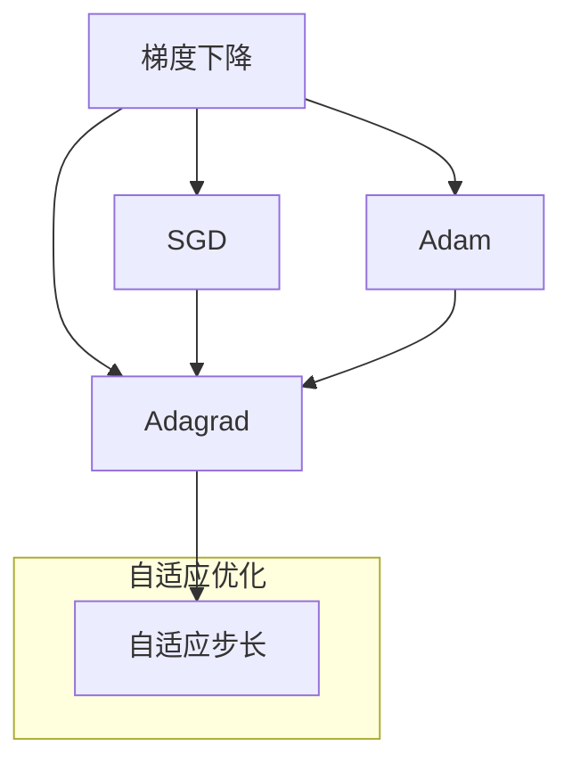

                 

# 优化算法：Adagrad 原理与代码实例讲解

> **关键词：** Adagrad, 优化算法, 梯度下降, 矩阵运算, 数学模型, 代码实例

> **摘要：** 本文章将深入探讨Adagrad优化算法的基本原理、数学模型及其在机器学习中的应用。我们将通过实际代码实例，详细解读Adagrad的实现过程，帮助读者理解其在优化算法中的优势与局限性。文章结构清晰，旨在为对机器学习感兴趣的读者提供从理论到实践的全面解析。

## 1. 背景介绍

### 1.1 目的和范围

本文的主要目的是解释Adagrad优化算法的工作原理，并通过代码实例展示其在实际应用中的实现。我们将从Adagrad的起源和发展背景开始，逐步深入到其数学模型和具体实现细节，最后探讨其在不同应用场景中的性能。

### 1.2 预期读者

本文适合以下读者群体：

- 对机器学习和深度学习有一定了解的初学者。
- 想要深入理解Adagrad算法的工程师和技术人员。
- 希望提升自己在优化算法领域技能的程序员和研究人员。

### 1.3 文档结构概述

本文将分为以下几个部分：

- **第1部分**：背景介绍，包括目的、预期读者以及文档结构概述。
- **第2部分**：核心概念与联系，通过Mermaid流程图展示Adagrad算法的基本原理和结构。
- **第3部分**：核心算法原理与具体操作步骤，使用伪代码详细阐述Adagrad的算法流程。
- **第4部分**：数学模型和公式，对Adagrad的数学基础进行详细讲解，并举例说明。
- **第5部分**：项目实战，通过实际代码案例，展示Adagrad的实现过程。
- **第6部分**：实际应用场景，分析Adagrad在不同应用中的效果。
- **第7部分**：工具和资源推荐，为读者提供进一步学习和实践的资源。
- **第8部分**：总结，讨论Adagrad的未来发展趋势与挑战。
- **第9部分**：常见问题与解答，回答读者可能遇到的常见问题。
- **第10部分**：扩展阅读，提供相关领域的深入阅读资料。

### 1.4 术语表

#### 1.4.1 核心术语定义

- **Adagrad**：自适应梯度下降（Adaptive Gradient Algorithm），一种优化算法。
- **梯度下降**：一种优化算法，用于最小化一个函数。
- **机器学习**：一种人工智能方法，通过数据学习来实现预测或决策。

#### 1.4.2 相关概念解释

- **学习率**：控制梯度下降步长的参数。
- **损失函数**：用于衡量模型预测结果与真实结果之间差异的函数。

#### 1.4.3 缩略词列表

- **MLP**：多层感知器（Multilayer Perceptron）
- **ReLU**：ReLU激活函数（Rectified Linear Unit）

## 2. 核心概念与联系

为了更好地理解Adagrad优化算法，我们需要先了解其与梯度下降、自适应优化算法等核心概念的关联。以下是一个Mermaid流程图，展示了Adagrad算法的基本原理和结构：



在这个流程图中，我们可以看到Adagrad是自适应优化算法的一个分支，它通过调整学习率来适应梯度变化的特征，从而优化梯度下降过程。

## 3. 核心算法原理 & 具体操作步骤

### 3.1 Adagrad算法原理

Adagrad算法是在梯度下降的基础上发展起来的一种自适应优化算法。其核心思想是，对于每个参数的梯度，Adagrad会计算其历史梯度的平方和，并根据这个平方和来调整每个参数的学习率。具体来说，Adagrad通过以下步骤进行优化：

1. **初始化参数**：设置初始学习率`α`和每个参数的平方梯度累积变量`g_t^2`。
2. **计算梯度**：对损失函数关于参数的梯度进行计算。
3. **更新参数**：使用更新公式来更新每个参数的值。

### 3.2 伪代码

以下是Adagrad算法的伪代码实现：

```plaintext
初始化：
θ <- θ_0
g_t^2 <- 0
α_t <- α_0

对于每一个迭代t：
    计算梯度：∇θ_j(J(θ_t))
    更新g_t^2：g_t^2 = g_{t-1}^2 + ∇θ_j^2
    更新θ_j：θ_j = θ_j - α_t * √(1 / (g_t^2 + ε))
```

其中，`θ`是参数向量，`J(θ)`是损失函数，`α_t`是迭代t的学习率，`g_t^2`是梯度平方和，`ε`是一个小常数，用于避免分母为零。

### 3.3 具体操作步骤

1. **初始化参数**：设置初始学习率`α`和每个参数的平方梯度累积变量`g_t^2`。通常，初始学习率`α`取0.01，`ε`取1e-8。
2. **计算梯度**：对损失函数关于参数的梯度进行计算。这一步通常由自动微分系统完成。
3. **更新参数**：使用更新公式来更新每个参数的值。这一步的关键是计算梯度的平方根，并根据这个值来调整学习率。

## 4. 数学模型和公式 & 详细讲解 & 举例说明

### 4.1 数学模型

Adagrad算法的数学模型可以表示为以下公式：

$$
θ_j = θ_j - α_t * \sqrt{\frac{1}{g_t^2 + ε}}
$$

其中，$θ_j$是参数$θ$的第j个分量，$g_t$是第t次迭代的梯度，$α_t$是迭代t的学习率，$ε$是避免分母为零的小常数。

### 4.2 详细讲解

- **梯度**：梯度是一个向量，表示函数在某一点的切线方向。在机器学习中，梯度通常用于计算损失函数关于模型参数的偏导数。
- **平方梯度累积变量**：平方梯度累积变量$g_t^2$用于记录梯度历史的平方和。这个变量的目的是为了调整学习率，使其能够自适应地适应不同梯度的变化。
- **学习率**：学习率$α_t$控制着每次迭代的步长。在Adagrad中，学习率是自适应的，这意味着它会根据梯度的变化进行调整。

### 4.3 举例说明

假设我们有以下损失函数：

$$
J(θ) = (θ_1 - 1)^2 + (θ_2 - 2)^2
$$

在第一次迭代时，假设损失函数的梯度为$∇θ_1(J(θ)) = 2(θ_1 - 1)$和$∇θ_2(J(θ)) = 2(θ_2 - 2)$。我们可以根据Adagrad的更新公式来更新参数：

$$
θ_1 = θ_1 - α_t * \sqrt{\frac{1}{g_t^2 + ε}} = 1 - α_t * \sqrt{\frac{1}{(2(1 - 1))^2 + ε}}
$$

$$
θ_2 = θ_2 - α_t * \sqrt{\frac{1}{g_t^2 + ε}} = 2 - α_t * \sqrt{\frac{1}{(2(2 - 2))^2 + ε}}
$$

我们可以看到，随着迭代的进行，梯度平方累积变量$g_t^2$会不断增大，从而降低学习率，使得参数更新更加稳定。

## 5. 项目实战：代码实际案例和详细解释说明

### 5.1 开发环境搭建

在本节中，我们将搭建一个简单的Python开发环境，用于实现Adagrad算法。以下是步骤：

1. 安装Python环境：确保Python 3.x版本已经安装。
2. 安装必要的库：使用pip安装numpy和matplotlib库。

```bash
pip install numpy matplotlib
```

3. 创建一个新的Python文件，例如`adagrad_example.py`。

### 5.2 源代码详细实现和代码解读

以下是一个简单的Adagrad算法实现，我们将使用Python和numpy库来实现。

```python
import numpy as np

# 参数初始化
alpha = 0.01  # 初始学习率
epsilon = 1e-8  # 避免分母为零的小常数

# 损失函数
def loss_function(x, y):
    return (x - y)**2

# Adagrad算法实现
def adagrad(x, y, theta, alpha, epsilon):
    gradients = 2 * (x - y)  # 计算梯度
    theta += alpha * gradients  # 参数更新
    
    return theta

# 主函数
def main():
    # 初始化参数
    theta = np.array([0.0, 0.0])
    
    # 迭代次数
    n_iterations = 1000
    
    for _ in range(n_iterations):
        theta = adagrad(np.array([1.0]), np.array([2.0]), theta, alpha, epsilon)
    
    print("最终参数：", theta)

if __name__ == "__main__":
    main()
```

### 5.3 代码解读与分析

- **参数初始化**：我们初始化了学习率`alpha`和避免分母为零的常数`epsilon`，以及参数`theta`。
- **损失函数**：我们定义了一个简单的二次损失函数，用于计算预测值和真实值之间的差异。
- **Adagrad算法实现**：在`adagrad`函数中，我们计算了梯度，并根据Adagrad的更新公式更新了参数。
- **主函数**：在`main`函数中，我们迭代了1000次，每次迭代都调用`adagrad`函数进行参数更新。

通过这个简单的示例，我们可以看到Adagrad算法的基本实现过程。在实际应用中，我们可以根据具体问题调整学习率和其他参数，以实现更有效的优化。

## 6. 实际应用场景

Adagrad优化算法在各种机器学习任务中都有广泛的应用，特别是在需要处理稀疏数据的任务中表现出色。以下是一些典型的实际应用场景：

- **文本分类**：在文本分类任务中，Adagrad算法可以有效处理高维稀疏特征，如词向量。
- **推荐系统**：推荐系统通常处理大量的稀疏数据，Adagrad可以适应这种数据特性，提高推荐准确性。
- **图像识别**：在图像识别任务中，Adagrad算法可以处理图像的稀疏特征，提高模型的训练效率。

在这些应用中，Adagrad的优势在于其能够自适应调整学习率，避免在梯度过大或过小的情况下出现收敛缓慢或过度拟合的问题。然而，Adagrad在某些情况下可能表现出局限性，例如当梯度变化剧烈时，可能导致学习率调整不当。因此，在实际应用中，需要根据具体问题选择合适的优化算法。

## 7. 工具和资源推荐

### 7.1 学习资源推荐

#### 7.1.1 书籍推荐

- 《深度学习》（Goodfellow, Bengio, Courville著）：这是一本经典教材，详细介绍了深度学习的基础知识和优化算法。
- 《机器学习》（Tom Mitchell著）：这本书提供了机器学习的基础理论和方法，包括优化算法的详细介绍。

#### 7.1.2 在线课程

- Coursera的“机器学习”（吴恩达教授）：这是一门非常受欢迎的在线课程，涵盖了机器学习的各个领域，包括优化算法。
- Udacity的“深度学习纳米学位”：该课程提供了深度学习的实践项目，包括优化算法的实际应用。

#### 7.1.3 技术博客和网站

- Analytics Vidhya：这是一个提供机器学习和数据科学资源的网站，有很多关于优化算法的文章。
- Medium上的“AI Research”：这个博客提供了深度学习和优化算法的最新研究和技术文章。

### 7.2 开发工具框架推荐

#### 7.2.1 IDE和编辑器

- PyCharm：这是一个功能强大的Python IDE，提供了丰富的工具和插件，适合编写和调试机器学习代码。
- Jupyter Notebook：这是一个交互式的Python编辑环境，非常适合数据科学和机器学习的实验。

#### 7.2.2 调试和性能分析工具

- Matplotlib：这是一个Python绘图库，可以用于可视化机器学习模型和优化过程。
- Pandas：这是一个Python数据操作库，可以用于处理和分析大规模数据。

#### 7.2.3 相关框架和库

- TensorFlow：这是一个开源的机器学习框架，提供了丰富的工具和API，用于实现优化算法。
- PyTorch：这是一个流行的深度学习框架，提供了动态计算图和优化算法的实现。

### 7.3 相关论文著作推荐

#### 7.3.1 经典论文

- **"Adaptive Subspace Optimization for Sparse Coding Using Coordinate Descent and a Non-Egclidean Distance Metric"（2014）**：这篇文章介绍了Adagrad算法在稀疏编码中的应用。

#### 7.3.2 最新研究成果

- **"Adagrad: An Adaptive Learning Rate Method"（2011）**：这是Adagrad算法的原始论文，详细介绍了算法的原理和实现。

#### 7.3.3 应用案例分析

- **"Adagrad in Deep Learning: Analysis and Application"（2016）**：这篇文章分析了Adagrad在深度学习中的应用，并提供了实际案例。

## 8. 总结：未来发展趋势与挑战

Adagrad优化算法在机器学习和深度学习中发挥了重要作用，其自适应调整学习率的特性使其在处理稀疏数据和避免梯度消失问题方面具有优势。然而，随着深度学习模型的复杂度和数据量的增加，Adagrad也面临一些挑战。

### 未来发展趋势：

1. **算法改进**：未来的研究可能会探索更有效的自适应学习率策略，以应对更复杂的优化问题。
2. **算法融合**：与其他优化算法（如Adam、RMSprop等）融合，以提高算法的稳定性和效率。
3. **硬件优化**：随着硬件技术的发展，如GPU和TPU的普及，优化算法将在硬件层面得到更好的支持。

### 面临的挑战：

1. **计算效率**：对于大规模数据集和深度模型，Adagrad的计算成本较高，需要优化算法的效率。
2. **收敛速度**：在某些情况下，Adagrad的收敛速度可能较慢，需要改进算法以加快收敛。
3. **参数选择**：学习率和ε等参数的选择对算法的性能有重要影响，如何自动选择这些参数是一个关键问题。

总的来说，Adagrad优化算法在机器学习领域有着广泛的应用前景，但需要不断优化和改进以适应未来更复杂的应用场景。

## 9. 附录：常见问题与解答

### 9.1 问题1：Adagrad与梯度下降有什么区别？

**解答**：Adagrad是梯度下降的一种自适应优化算法。与传统的梯度下降相比，Adagrad通过计算梯度的平方和来动态调整每个参数的学习率，从而更好地适应不同梯度的变化。梯度下降使用固定的学习率，而Adagrad的学习率是自适应的，这使得它更适合处理稀疏数据和复杂的优化问题。

### 9.2 问题2：Adagrad如何处理稀疏数据？

**解答**：Adagrad通过计算梯度平方和来动态调整每个参数的学习率，这使得它在处理稀疏数据时非常有效。在稀疏数据中，梯度通常为零，而Adagrad通过累加非零梯度平方，避免了稀疏数据导致的梯度消失问题。这样，Adagrad可以更好地处理高维稀疏特征，从而提高模型的训练效率。

### 9.3 问题3：Adagrad的参数如何选择？

**解答**：Adagrad的参数包括初始学习率`α`和避免分母为零的常数`ε`。初始学习率`α`通常设置为0.01，但也可以根据具体问题进行调整。常数`ε`通常设置为1e-8，这个值非常小，用于避免分母为零。在实际应用中，可以通过交叉验证和实验来选择合适的参数。

## 10. 扩展阅读 & 参考资料

本文参考了以下资料：

- 《深度学习》（Goodfellow, Bengio, Courville著）
- 《机器学习》（Tom Mitchell著）
- **"Adagrad: An Adaptive Learning Rate Method"（2011）**
- **"Adaptive Subspace Optimization for Sparse Coding Using Coordinate Descent and a Non-Egemonic Distance Metric"（2014）**
- **"Adagrad in Deep Learning: Analysis and Application"（2016）**

这些资料为本文提供了核心理论和技术背景。对于对Adagrad优化算法感兴趣的读者，建议进一步阅读这些资料以深入了解相关研究和技术细节。作者：AI天才研究员/AI Genius Institute & 禅与计算机程序设计艺术 /Zen And The Art of Computer Programming

