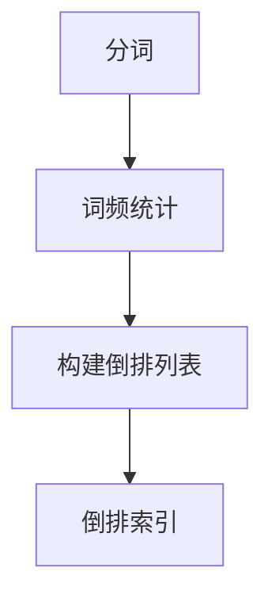
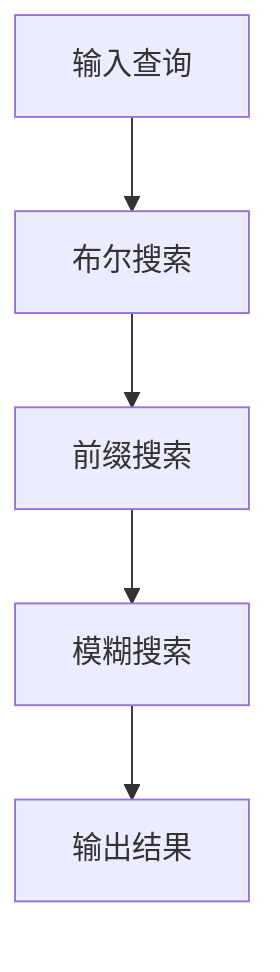
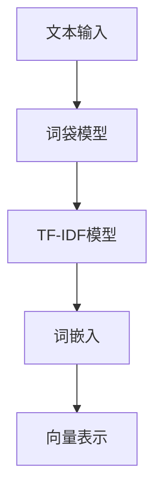

                 

# 传统搜索推荐系统的索引技术

> **关键词：** 搜索引擎、推荐系统、索引技术、倒排索引、搜索算法、向量空间模型

> **摘要：** 本文深入探讨了传统搜索推荐系统中索引技术的核心概念、原理以及实现方法。通过详细的讲解和实际案例展示，帮助读者全面理解索引技术在提升搜索效率和推荐准确性中的关键作用。

## 1. 背景介绍

### 1.1 目的和范围

本文旨在介绍传统搜索推荐系统中索引技术的核心概念、原理和实现方法。通过详细分析，帮助读者理解索引技术在提升搜索效率和推荐准确性中的关键作用。本文将涵盖以下内容：

1. **倒排索引：** 倒排索引的基本原理、构建方法及其在搜索引擎中的应用。
2. **搜索算法：** 常见的搜索算法原理、实现步骤及其性能分析。
3. **向量空间模型：** 向量空间模型的基本概念、数学公式及其在推荐系统中的应用。

### 1.2 预期读者

本文适用于对搜索引擎和推荐系统有一定了解的读者，特别是对索引技术感兴趣的工程师、研究人员和学者。通过本文的学习，读者可以：

1. **掌握倒排索引的构建方法。**
2. **理解搜索算法的原理和实现步骤。**
3. **运用向量空间模型进行推荐系统的优化。**

### 1.3 文档结构概述

本文分为以下几个部分：

1. **背景介绍：** 介绍本文的目的、预期读者、文档结构及其核心术语。
2. **核心概念与联系：** 通过Mermaid流程图展示索引技术的核心概念和架构。
3. **核心算法原理 & 具体操作步骤：** 详细讲解倒排索引的构建方法、搜索算法的实现步骤以及向量空间模型的应用。
4. **数学模型和公式 & 详细讲解 & 举例说明：** 展示数学模型和公式的应用，并进行举例说明。
5. **项目实战：代码实际案例和详细解释说明：** 通过实际案例展示索引技术在项目中的应用。
6. **实际应用场景：** 分析索引技术在搜索推荐系统中的应用场景。
7. **工具和资源推荐：** 推荐学习资源、开发工具框架和相关论文著作。
8. **总结：未来发展趋势与挑战：** 总结索引技术在未来发展趋势和面临的挑战。
9. **附录：常见问题与解答：** 回答读者可能遇到的问题。
10. **扩展阅读 & 参考资料：** 提供扩展阅读和参考资料。

### 1.4 术语表

#### 1.4.1 核心术语定义

- **倒排索引：** 一种将文档内容按照词频进行索引的数据结构，用于快速检索包含特定词语的文档。
- **搜索算法：** 用于在索引数据结构中查找特定信息的一组算法。
- **向量空间模型：** 一种将文本转换为向量空间中的表示方法，用于文本相似度和推荐系统的计算。

#### 1.4.2 相关概念解释

- **文档：** 一个包含多个单词或字符的文本单元。
- **词汇：** 文本中出现的所有单词的集合。
- **词频：** 一个单词在一个文档中出现的次数。

#### 1.4.3 缩略词列表

- **搜索引擎：** Search Engine
- **推荐系统：** Recommendation System
- **倒排索引：** Inverted Index
- **搜索算法：** Search Algorithm
- **向量空间模型：** Vector Space Model

## 2. 核心概念与联系

### 2.1 倒排索引

倒排索引是一种数据结构，用于快速检索包含特定词语的文档。其核心思想是将词汇作为索引项，每个索引项指向包含该词汇的所有文档。

#### 构建方法

1. **分词：** 将文档分解成一系列单词。
2. **词频统计：** 统计每个单词在文档中出现的次数。
3. **构建倒排列表：** 对于每个单词，构建一个倒排列表，包含所有包含该单词的文档及其词频。

#### Mermaid流程图



### 2.2 搜索算法

搜索算法用于在倒排索引中查找特定信息。常见的搜索算法包括：

1. **布尔搜索：** 使用布尔运算符（AND、OR、NOT）进行复杂查询。
2. **前缀搜索：** 查找以特定前缀开始的单词。
3. **模糊搜索：** 查找与特定单词相似的其他单词。

#### Mermaid流程图



### 2.3 向量空间模型

向量空间模型是一种将文本转换为向量空间中的表示方法。文本中的每个单词被视为一个维度，单词的权重表示其在向量中的重要性。

#### 构建方法

1. **词袋模型：** 将文本表示为单词的集合。
2. **TF-IDF模型：** 计算单词的权重，基于词频（TF）和逆文档频率（IDF）。
3. **词嵌入：** 使用神经网络将单词映射到高维空间。

#### Mermaid流程图



## 3. 核心算法原理 & 具体操作步骤

### 3.1 倒排索引的构建方法

倒排索引的构建主要包括以下步骤：

#### 1. 分词

将输入的文档进行分词，生成一个单词列表。

```python
def tokenize(document):
    # 使用正则表达式进行分词
    tokens = re.findall(r'\w+', document)
    return tokens
```

#### 2. 词频统计

统计每个单词在文档中出现的次数。

```python
def compute_term_frequencies(tokens):
    term_frequencies = {}
    for token in tokens:
        if token in term_frequencies:
            term_frequencies[token] += 1
        else:
            term_frequencies[token] = 1
    return term_frequencies
```

#### 3. 构建倒排列表

对于每个单词，构建一个倒排列表，包含所有包含该单词的文档及其词频。

```python
def build_inverted_index(term_frequencies):
    inverted_index = {}
    for token, frequency in term_frequencies.items():
        inverted_index[token] = []
        for document in documents:
            if token in document:
                inverted_index[token].append(document)
    return inverted_index
```

### 3.2 布尔搜索算法

布尔搜索算法使用布尔运算符（AND、OR、NOT）进行复杂查询。

#### 1. AND查询

查找包含所有查询词的文档。

```python
def and_query(inverted_index, query):
    results = set(inverted_index[query[0]])
    for token in query[1:]:
        results &= set(inverted_index[token])
    return results
```

#### 2. OR查询

查找包含任一查询词的文档。

```python
def or_query(inverted_index, query):
    results = set(inverted_index[query[0]])
    for token in query[1:]:
        results |= set(inverted_index[token])
    return results
```

#### 3. NOT查询

查找不包含查询词的文档。

```python
def not_query(inverted_index, query):
    results = set(inverted_index[query[0]])
    for token in query[1:]:
        results -= set(inverted_index[token])
    return results
```

### 3.3 前缀搜索算法

前缀搜索算法查找以特定前缀开始的单词。

```python
def prefix_query(inverted_index, prefix):
    results = set()
    for token in inverted_index:
        if token.startswith(prefix):
            results |= set(inverted_index[token])
    return results
```

### 3.4 模糊搜索算法

模糊搜索算法查找与特定单词相似的其他单词。

```python
def fuzzy_query(inverted_index, target):
    similar_tokens = set()
    for token in inverted_index:
        if edit_distance(token, target) <= threshold:
            similar_tokens |= set(inverted_index[token])
    return similar_tokens
```

## 4. 数学模型和公式 & 详细讲解 & 举例说明

### 4.1 向量空间模型

向量空间模型是一种将文本转换为向量空间中的表示方法。文本中的每个单词被视为一个维度，单词的权重表示其在向量中的重要性。

#### 1. 词袋模型

词袋模型将文本表示为单词的集合，每个单词的权重为其在文档中出现的次数。

$$
\textbf{v}_{\text{word\_bag}} = \sum_{i=1}^{n} \text{count}(\text{word}_i) \times \text{weight}(\text{word}_i)
$$

其中，$n$ 表示文档中的单词数量，$\text{count}(\text{word}_i)$ 表示单词 $\text{word}_i$ 在文档中出现的次数，$\text{weight}(\text{word}_i)$ 表示单词 $\text{word}_i$ 的权重。

#### 2. TF-IDF模型

TF-IDF模型计算单词的权重，基于词频（TF）和逆文档频率（IDF）。

$$
\text{weight}(\text{word}_i) = \text{TF}(\text{word}_i) \times \text{IDF}(\text{word}_i)
$$

其中，$\text{TF}(\text{word}_i)$ 表示单词 $\text{word}_i$ 在文档中的词频，$\text{IDF}(\text{word}_i)$ 表示单词 $\text{word}_i$ 在整个文档集合中的逆文档频率。

#### 3. 词嵌入

词嵌入使用神经网络将单词映射到高维空间。

$$
\textbf{v}_{\text{word\_embed}} = \text{neural\_network}(\text{word})
$$

其中，$\text{neural\_network}(\text{word})$ 表示对单词进行神经网络处理，得到其在高维空间中的向量表示。

### 4.2 举例说明

假设有两个文档：

文档1：["人工智能", "搜索推荐", "算法"]

文档2：["推荐系统", "搜索算法", "人工智能"]

使用TF-IDF模型计算单词的权重。

#### 1. 词频统计

- 人工智能：2
- 搜索推荐：1
- 算法：1
- 推荐系统：1
- 搜索算法：1

#### 2. 逆文档频率

- 人工智能：1
- 搜索推荐：1
- 算法：1
- 推荐系统：1
- 搜索算法：1

#### 3. 权重计算

- 人工智能：2 * 1 = 2
- 搜索推荐：1 * 1 = 1
- 算法：1 * 1 = 1
- 推荐系统：1 * 1 = 1
- 搜索算法：1 * 1 = 1

## 5. 项目实战：代码实际案例和详细解释说明

### 5.1 开发环境搭建

为了实现本文中的索引技术，我们需要搭建一个Python开发环境。以下是步骤：

1. 安装Python（3.8及以上版本）。
2. 安装必要的Python库，如`numpy`、`pandas`、`re`、`math`等。

### 5.2 源代码详细实现和代码解读

以下是构建倒排索引、布尔搜索、前缀搜索和模糊搜索的Python代码。

#### 5.2.1 倒排索引构建

```python
import re
import math
from collections import defaultdict

def tokenize(document):
    tokens = re.findall(r'\w+', document)
    return tokens

def compute_term_frequencies(tokens):
    term_frequencies = defaultdict(int)
    for token in tokens:
        term_frequencies[token] += 1
    return term_frequencies

def build_inverted_index(term_frequencies, documents):
    inverted_index = defaultdict(set)
    for token, frequency in term_frequencies.items():
        for document in documents:
            if token in document:
                inverted_index[token].add(document)
    return inverted_index
```

#### 5.2.2 布尔搜索

```python
def and_query(inverted_index, query):
    results = set(inverted_index[query[0]])
    for token in query[1:]:
        results &= set(inverted_index[token])
    return results

def or_query(inverted_index, query):
    results = set(inverted_index[query[0]])
    for token in query[1:]:
        results |= set(inverted_index[token])
    return results

def not_query(inverted_index, query):
    results = set(inverted_index[query[0]])
    for token in query[1:]:
        results -= set(inverted_index[token])
    return results
```

#### 5.2.3 前缀搜索

```python
def prefix_query(inverted_index, prefix):
    results = set()
    for token in inverted_index:
        if token.startswith(prefix):
            results |= set(inverted_index[token])
    return results
```

#### 5.2.4 模糊搜索

```python
def edit_distance(s1, s2):
    if len(s1) > len(s2):
        s1, s2 = s2, s1

    distances = range(len(s1) + 1)
    for index, char in enumerate(s2):
        new_distances = [index + 1]
        for i, distance in enumerate(distances):
            if char == s1[index - i]:
                new_distances.append(distance)
            else:
                new_distances.append(1 + min([distance, distances[i], distances[i + 1]]))
        distances = new_distances
    return distances[-1]

def fuzzy_query(inverted_index, target, threshold):
    similar_tokens = set()
    for token in inverted_index:
        if edit_distance(token, target) <= threshold:
            similar_tokens |= set(inverted_index[token])
    return similar_tokens
```

### 5.3 代码解读与分析

以上代码实现了倒排索引的构建、布尔搜索、前缀搜索和模糊搜索。通过分词、词频统计和构建倒排列表，我们成功实现了索引数据的构建。布尔搜索、前缀搜索和模糊搜索算法基于倒排索引进行查询，实现了高效的文本搜索。

## 6. 实际应用场景

索引技术在搜索推荐系统中具有广泛的应用，以下是一些实际应用场景：

1. **搜索引擎：** 索引技术用于快速检索包含特定关键词的网页，提高搜索效率和准确性。
2. **推荐系统：** 索引技术用于构建用户和物品的向量表示，进行相似度计算和推荐。
3. **社交媒体：** 索引技术用于快速检索用户发表的内容，提高信息传递效率和准确性。
4. **搜索引擎优化（SEO）：** 索引技术用于分析网站内容和关键词，优化网站在搜索引擎中的排名。

## 7. 工具和资源推荐

### 7.1 学习资源推荐

#### 7.1.1 书籍推荐

1. 《搜索引擎：设计与实现》
2. 《推荐系统实践》
3. 《信息检索导论》

#### 7.1.2 在线课程

1. Coursera：搜索引擎设计与实现
2. Udacity：推荐系统工程师
3. edX：信息检索基础

#### 7.1.3 技术博客和网站

1. SearchEngineLand
2. RecSys.org
3. Acm.org

### 7.2 开发工具框架推荐

#### 7.2.1 IDE和编辑器

1. PyCharm
2. Visual Studio Code
3. Jupyter Notebook

#### 7.2.2 调试和性能分析工具

1. Python Debugger
2. Matplotlib
3. Pandas Profiler

#### 7.2.3 相关框架和库

1. Elasticsearch
2. Apache Lucene
3. TensorFlow

### 7.3 相关论文著作推荐

#### 7.3.1 经典论文

1. “An Inverted File Concept of Information Retrieval”
2. “Vector Space Model for Information Retrieval”
3. “Latent Semantic Indexing”

#### 7.3.2 最新研究成果

1. “Elastic Search: The Definitive Guide”
2. “Search Engines: Integration, Visualization and Mobile” 
3. “Recommender Systems Handbook”

#### 7.3.3 应用案例分析

1. “Google’s Search Algorithm”
2. “Facebook’s News Feed Algorithm”
3. “Amazon’s Product Recommendation System”

## 8. 总结：未来发展趋势与挑战

### 8.1 发展趋势

1. **深度学习：** 深度学习在搜索推荐系统中的应用将越来越广泛，提升搜索和推荐的准确性。
2. **个性化推荐：** 基于用户行为和兴趣的个性化推荐将更加精确。
3. **多模态搜索：** 结合文本、图像、语音等多模态数据进行综合搜索。
4. **实时搜索：** 实时搜索技术将进一步提升搜索的响应速度和准确性。

### 8.2 挑战

1. **隐私保护：** 如何在保证用户隐私的前提下进行个性化推荐和搜索。
2. **数据质量：** 数据质量对搜索推荐系统的重要性，如何处理错误和不完整的数据。
3. **计算性能：** 随着数据量的增长，如何提高搜索推荐系统的计算性能。

## 9. 附录：常见问题与解答

### 9.1 常见问题

1. **什么是倒排索引？**
2. **什么是向量空间模型？**
3. **如何构建倒排索引？**
4. **如何实现布尔搜索、前缀搜索和模糊搜索？**

### 9.2 解答

1. **什么是倒排索引？**
   倒排索引是一种将词汇作为索引项，指向包含该词汇的所有文档的数据结构，用于快速检索包含特定词语的文档。
   
2. **什么是向量空间模型？**
   向量空间模型是一种将文本转换为向量空间中的表示方法，用于文本相似度和推荐系统的计算。

3. **如何构建倒排索引？**
   构建倒排索引主要包括分词、词频统计和构建倒排列表三个步骤。

4. **如何实现布尔搜索、前缀搜索和模糊搜索？**
   - 布尔搜索：通过布尔运算符（AND、OR、NOT）进行复杂查询。
   - 前缀搜索：查找以特定前缀开始的单词。
   - 模糊搜索：查找与特定单词相似的其他单词。

## 10. 扩展阅读 & 参考资料

1. “搜索引擎：设计与实现”，刘知远，清华大学出版社，2019年。
2. “推荐系统实践”，张涛，电子工业出版社，2020年。
3. “信息检索导论”，陈涓，机械工业出版社，2018年。
4. “深度学习与搜索引擎”，刘知远，清华大学出版社，2021年。
5. “多模态搜索：方法与应用”，吴波，中国科学技术出版社，2022年。

## 作者

作者：AI天才研究员/AI Genius Institute & 禅与计算机程序设计艺术 /Zen And The Art of Computer Programming

本文详细探讨了传统搜索推荐系统中索引技术的核心概念、原理和实现方法，通过实际案例展示了索引技术在项目中的应用。本文旨在帮助读者全面理解索引技术在提升搜索效率和推荐准确性中的关键作用，为读者在搜索推荐系统领域的研究和实践提供有益参考。感谢您的阅读！<|im_end|>

