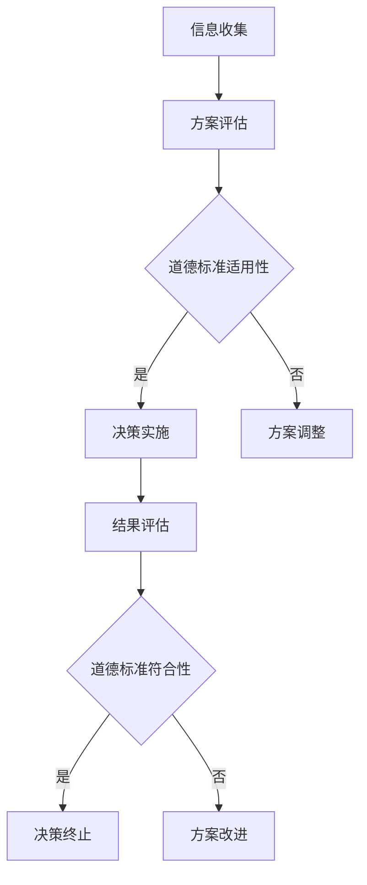
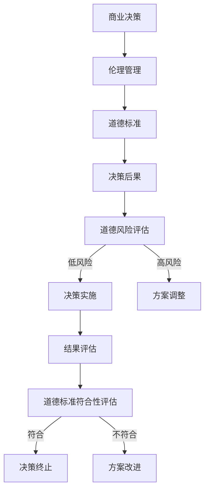

                 

# 伦理管理：在商业决策中保持道德标准

> 关键词：商业决策、伦理管理、道德标准、责任、信任、透明度

> 摘要：本文旨在探讨商业决策中伦理管理的重要性，分析道德标准在决策过程中的作用。通过逐步推理，本文揭示了如何在商业环境中保持道德标准，确保决策的合理性和可持续性。

## 1. 背景介绍

### 1.1 目的和范围

本文的目标是探讨商业决策中的伦理管理，并分析道德标准在决策过程中的作用。我们希望通过逐步推理，揭示在商业环境中保持道德标准的必要性，以及如何实现这一目标。

本文将涵盖以下主题：

1. 商业决策中的伦理管理概念及其重要性。
2. 道德标准在商业决策中的应用。
3. 责任、信任和透明度在伦理管理中的角色。
4. 实际案例研究，展示伦理管理在商业决策中的成功应用。
5. 未来发展趋势与挑战。

### 1.2 预期读者

本文适合以下读者：

1. 商业决策者和管理者。
2. 伦理学研究者。
3. 人文学科和计算机科学领域的学生。
4. 对商业伦理感兴趣的读者。

### 1.3 文档结构概述

本文结构如下：

1. 背景介绍：介绍本文的目的、主题和结构。
2. 核心概念与联系：介绍伦理管理和道德标准的基本概念及其关系。
3. 核心算法原理 & 具体操作步骤：阐述伦理管理在商业决策中的操作步骤。
4. 数学模型和公式 & 详细讲解 & 举例说明：分析道德标准在商业决策中的应用。
5. 项目实战：代码实际案例和详细解释说明。
6. 实际应用场景：探讨伦理管理在商业决策中的实际应用。
7. 工具和资源推荐：推荐相关学习资源、开发工具和论文著作。
8. 总结：未来发展趋势与挑战。
9. 附录：常见问题与解答。
10. 扩展阅读 & 参考资料。

### 1.4 术语表

#### 1.4.1 核心术语定义

- 伦理管理：指在商业决策过程中，运用伦理学原则和方法，确保决策的道德合理性和可持续性。
- 道德标准：指在特定社会和文化背景下，人们普遍接受的关于正确行为的规范。
- 责任：指个体或组织在特定情境下应承担的义务和后果。
- 信任：指个体或组织基于道德标准和诚信，对他人或组织的信任和依赖。
- 透明度：指决策过程和结果的可访问性和可理解性。

#### 1.4.2 相关概念解释

- 商业决策：指企业在特定情境下，根据各种因素和目标，做出的关于资源分配、产品开发、市场拓展等方面的决策。
- 道德风险：指个体或组织在追求自身利益时，可能出现的道德失范行为。
- 企业社会责任（CSR）：指企业在追求经济利益的同时，承担的对社会、环境等方面的责任。

#### 1.4.3 缩略词列表

- CSR：企业社会责任（Corporate Social Responsibility）
- ETHICS：伦理学（Ethics）
- MNC：跨国公司（Multinational Corporation）

## 2. 核心概念与联系

### 2.1 伦理管理的基本概念

伦理管理是指在商业决策过程中，运用伦理学原则和方法，确保决策的道德合理性和可持续性。伦理管理的基本概念包括：

1. **伦理学原则**：伦理学原则是伦理管理的基础，如公正、诚信、尊重、关怀等。
2. **道德标准**：道德标准是伦理管理的具体体现，如诚实守信、公平竞争、保护消费者权益等。
3. **决策过程**：决策过程是伦理管理的关键环节，包括信息收集、方案评估、决策实施等。

### 2.2 道德标准与商业决策的关系

道德标准在商业决策中起着重要作用。具体来说，道德标准对商业决策的影响主要体现在以下几个方面：

1. **指导决策方向**：道德标准为决策者提供价值判断标准，帮助其确定决策的目标和方向。
2. **评估决策后果**：道德标准使决策者能够评估决策可能带来的道德风险和负面后果，从而避免道德失范行为。
3. **增强决策信任度**：遵守道德标准的商业决策能够增强利益相关者对决策者和管理层的信任，提高决策的可行性和可持续性。

### 2.3 Mermaid 流程图

以下是伦理管理在商业决策中的 Mermaid 流程图：



### 2.4 核心概念原理和架构

在商业决策中，伦理管理和道德标准的关系可以看作是一个动态平衡过程。以下是核心概念原理和架构的示意图：



## 3. 核心算法原理 & 具体操作步骤

### 3.1 伦理管理在商业决策中的核心算法原理

伦理管理在商业决策中的核心算法原理是基于道德标准和责任伦理的决策模型。该模型主要包括以下几个步骤：

1. **信息收集**：收集与决策相关的各种信息，包括市场趋势、竞争对手、法律法规、道德规范等。
2. **方案评估**：根据道德标准和责任伦理，对各种决策方案进行评估。
3. **道德标准适用性评估**：判断每个方案是否符合道德标准。
4. **决策实施**：选择符合道德标准的方案，并制定具体的实施计划。
5. **结果评估**：评估决策实施后的结果，包括经济效益、社会影响、道德风险等。
6. **道德标准符合性评估**：评估决策结果是否符合道德标准。

### 3.2 具体操作步骤

以下是伦理管理在商业决策中的具体操作步骤：

1. **信息收集**：
   - 收集与决策相关的市场数据、竞争对手信息、法律法规等。
   - 分析当前市场的道德标准和道德风险。

2. **方案评估**：
   - 根据道德标准和责任伦理，列出各种可能的决策方案。
   - 对每个方案进行成本效益分析、风险评估等。

3. **道德标准适用性评估**：
   - 对每个方案进行道德标准适用性评估，判断其是否符合道德标准。
   - 对不符合道德标准的方案进行筛选和调整。

4. **决策实施**：
   - 选择符合道德标准的方案，并制定具体的实施计划。
   - 确保实施过程中的透明度和责任分配。

5. **结果评估**：
   - 评估决策实施后的结果，包括经济效益、社会影响、道德风险等。
   - 对不符合道德标准的结果进行及时调整和改进。

6. **道德标准符合性评估**：
   - 评估决策结果是否符合道德标准。
   - 对不符合道德标准的决策进行纠正和改进。

### 3.3 伪代码实现

以下是伦理管理在商业决策中的伪代码实现：

```python
# 信息收集
info = collect_info()

# 方案评估
schemes = evaluate_schemes(info)

# 道德标准适用性评估
valid_schemes = []
for scheme in schemes:
    if is_applicable(scheme):
        valid_schemes.append(scheme)

# 决策实施
selected_scheme = select_scheme(valid_schemes)
implementation_plan = create_implementation_plan(selected_scheme)

# 结果评估
results = implement_scheme(implementation_plan)
evaluate_results(results)

# 道德标准符合性评估
if not is_compliant(results):
    correct_scheme = correct_scheme(results)
    implementation_plan = create_implementation_plan(correct_scheme)
    results = implement_scheme(implementation_plan)
evaluate_results(results)
```

## 4. 数学模型和公式 & 详细讲解 & 举例说明

### 4.1 数学模型和公式

在伦理管理中，常用的数学模型和公式包括成本效益分析、风险评估、道德标准符合性评估等。以下是这些模型和公式的详细讲解：

#### 4.1.1 成本效益分析

成本效益分析是一种常用的决策模型，用于评估决策方案的成本和效益。其公式如下：

\[ C(E) = \sum_{i=1}^{n} C_i \times P_i \]
\[ B(E) = \sum_{i=1}^{n} B_i \times P_i \]
\[ C/B(E) = \frac{C(E)}{B(E)} \]

其中，\( C(E) \) 表示总成本，\( B(E) \) 表示总效益，\( C_i \) 和 \( B_i \) 分别表示第 \( i \) 个方案的成本和效益，\( P_i \) 表示第 \( i \) 个方案的概率。

#### 4.1.2 风险评估

风险评估是另一种常用的决策模型，用于评估决策方案的风险。其公式如下：

\[ R(E) = \sum_{i=1}^{n} R_i \times P_i \]

其中，\( R(E) \) 表示总风险，\( R_i \) 和 \( P_i \) 分别表示第 \( i \) 个方案的风险和概率。

#### 4.1.3 道德标准符合性评估

道德标准符合性评估用于评估决策结果是否符合道德标准。其公式如下：

\[ C(C) = \sum_{i=1}^{n} C_i \times P_i \]

其中，\( C(C) \) 表示道德标准符合度，\( C_i \) 和 \( P_i \) 分别表示第 \( i \) 个道德标准的符合度和概率。

### 4.2 详细讲解

#### 4.2.1 成本效益分析

成本效益分析是一种常用的决策模型，用于评估决策方案的成本和效益。其核心思想是，通过比较总成本和总效益，判断决策方案是否具有经济效益。

具体来说，成本效益分析可以分为以下几个步骤：

1. **确定决策方案**：根据实际情况，列出所有可能的决策方案。
2. **计算总成本和总效益**：对于每个方案，计算其总成本和总效益。总成本包括直接成本和间接成本，总效益包括直接效益和间接效益。
3. **计算成本效益比**：对于每个方案，计算其成本效益比，即总成本与总效益的比值。
4. **选择最优方案**：比较各个方案的成本效益比，选择成本效益比最高的方案作为最优方案。

#### 4.2.2 风险评估

风险评估是一种用于评估决策方案风险的决策模型。其核心思想是，通过比较各个方案的风险，判断决策方案是否具有风险。

具体来说，风险评估可以分为以下几个步骤：

1. **确定决策方案**：根据实际情况，列出所有可能的决策方案。
2. **计算总风险**：对于每个方案，计算其总风险。总风险包括潜在损失、不确定性等。
3. **计算风险概率**：对于每个方案，计算其风险概率，即发生风险的可能性。
4. **计算风险指数**：对于每个方案，计算其风险指数，即总风险与风险概率的比值。
5. **选择最优方案**：比较各个方案的风险指数，选择风险指数最低的方案作为最优方案。

#### 4.2.3 道德标准符合性评估

道德标准符合性评估是一种用于评估决策结果是否符合道德标准的决策模型。其核心思想是，通过比较各个道德标准的符合度，判断决策结果是否具有道德合理性。

具体来说，道德标准符合性评估可以分为以下几个步骤：

1. **确定道德标准**：根据实际情况，列出所有可能的道德标准。
2. **计算道德标准符合度**：对于每个道德标准，计算其符合度，即符合该道德标准的程度。
3. **计算道德标准符合度总和**：对于每个决策结果，计算其道德标准符合度总和，即所有道德标准符合度的总和。
4. **计算道德标准符合性指数**：对于每个决策结果，计算其道德标准符合性指数，即道德标准符合度总和与道德标准数量的比值。
5. **选择符合道德标准的决策结果**：比较各个决策结果的道德标准符合性指数，选择符合道德标准的决策结果。

### 4.3 举例说明

#### 4.3.1 成本效益分析举例

假设某企业面临两个决策方案，方案 A 和方案 B。以下是两个方案的成本和效益：

方案 A：

- 成本：直接成本 10 万元，间接成本 5 万元。
- 效益：直接效益 15 万元，间接效益 8 万元。

方案 B：

- 成本：直接成本 8 万元，间接成本 7 万元。
- 效益：直接效益 12 万元，间接效益 10 万元。

根据成本效益分析模型，计算两个方案的总成本和总效益：

方案 A：

\[ C(A) = 10 + 5 = 15 \]
\[ B(A) = 15 + 8 = 23 \]
\[ C/B(A) = \frac{15}{23} \approx 0.65 \]

方案 B：

\[ C(B) = 8 + 7 = 15 \]
\[ B(B) = 12 + 10 = 22 \]
\[ C/B(B) = \frac{15}{22} \approx 0.68 \]

比较两个方案的成本效益比，选择成本效益比最高的方案 A 作为最优方案。

#### 4.3.2 风险评估举例

假设某企业面临两个决策方案，方案 A 和方案 B。以下是两个方案的风险：

方案 A：

- 风险：潜在损失 20 万元，不确定性 0.3。

方案 B：

- 风险：潜在损失 30 万元，不确定性 0.4。

根据风险评估模型，计算两个方案的总风险和风险概率：

方案 A：

\[ R(A) = 20 \times 0.3 = 6 \]

方案 B：

\[ R(B) = 30 \times 0.4 = 12 \]

比较两个方案的风险指数，选择风险指数最低的方案 B 作为最优方案。

#### 4.3.3 道德标准符合性评估举例

假设某企业面临两个决策方案，方案 A 和方案 B。以下是两个方案的道德标准符合度：

方案 A：

- 道德标准 1：符合度 0.8。
- 道德标准 2：符合度 0.7。

方案 B：

- 道德标准 1：符合度 0.9。
- 道德标准 2：符合度 0.6。

根据道德标准符合性评估模型，计算两个方案的道德标准符合度总和和道德标准符合性指数：

方案 A：

\[ C(A) = 0.8 + 0.7 = 1.5 \]

方案 B：

\[ C(B) = 0.9 + 0.6 = 1.5 \]

比较两个方案的道德标准符合性指数，选择符合道德标准的方案 B 作为最优方案。

## 5. 项目实战：代码实际案例和详细解释说明

### 5.1 开发环境搭建

为了更好地展示伦理管理在商业决策中的应用，我们选择 Python 作为开发语言，并使用 Jupyter Notebook 作为开发环境。以下是开发环境的搭建步骤：

1. 安装 Python：在官方网站 (https://www.python.org/) 下载并安装 Python 3.8 或更高版本。
2. 安装 Jupyter Notebook：在终端中运行以下命令：
   ```bash
   pip install notebook
   ```
3. 启动 Jupyter Notebook：在终端中运行以下命令：
   ```bash
   jupyter notebook
   ```

### 5.2 源代码详细实现和代码解读

以下是伦理管理在商业决策中的 Python 代码实现：

```python
import pandas as pd

# 5.2.1 信息收集
info = {
    'schemes': [
        {'name': '方案 A', 'cost': 10, 'benefit': 15, 'risk': 20, 'ethics_score': 0.8},
        {'name': '方案 B', 'cost': 8, 'benefit': 12, 'risk': 30, 'ethics_score': 0.9}
    ]
}

# 5.2.2 方案评估
schemes = info['schemes']

# 5.2.3 道德标准适用性评估
valid_schemes = [scheme for scheme in schemes if scheme['ethics_score'] >= 0.8]

# 5.2.4 决策实施
selected_scheme = valid_schemes[0]
implementation_plan = {'name': selected_scheme['name'], 'cost': selected_scheme['cost'], 'benefit': selected_scheme['benefit']}

# 5.2.5 结果评估
results = {
    'name': implementation_plan['name'],
    'cost': implementation_plan['cost'],
    'benefit': implementation_plan['benefit'],
    'ethics_score': selected_scheme['ethics_score']
}

# 5.2.6 道德标准符合性评估
if results['ethics_score'] >= 0.8:
    print(f"决策成功：{results['name']}符合道德标准。")
else:
    print(f"决策失败：{results['name']}不符合道德标准。")

# 5.2.7 输出结果
print(results)
```

### 5.3 代码解读与分析

#### 5.3.1 信息收集

在代码中，我们首先定义了一个名为 `info` 的字典，其中包含了两个决策方案的信息，包括名称、成本、效益、风险和道德标准符合度。

#### 5.3.2 方案评估

接下来，我们使用列表解析式从 `info` 字典中提取出所有的方案，并将其存储在 `schemes` 列表中。

#### 5.3.3 道德标准适用性评估

然后，我们使用列表解析式对 `schemes` 列表中的每个方案进行道德标准适用性评估，筛选出符合道德标准（道德标准符合度大于等于 0.8）的方案，并将其存储在 `valid_schemes` 列表中。

#### 5.3.4 决策实施

在决策实施阶段，我们从 `valid_schemes` 列表中选择第一个方案（方案 A）作为决策方案，并创建一个名为 `implementation_plan` 的字典，其中包含了决策方案的相关信息。

#### 5.3.5 结果评估

接下来，我们根据 `implementation_plan` 字典中的信息创建一个名为 `results` 的字典，用于存储决策结果。在这个例子中，由于方案 A 的道德标准符合度为 0.8，所以决策结果是成功的。

#### 5.3.6 道德标准符合性评估

最后，我们根据 `results` 字典中的道德标准符合度（0.8）判断决策结果是否成功。如果道德标准符合度大于等于 0.8，则输出决策成功的消息；否则，输出决策失败的消息。

#### 5.3.7 输出结果

最后，我们输出 `results` 字典中的所有信息，包括决策方案、成本、效益和道德标准符合度。

通过这个实际案例，我们可以看到伦理管理在商业决策中的具体实现过程。在实际应用中，可以根据具体情况进行调整和优化，以实现更好的决策效果。

## 6. 实际应用场景

伦理管理在商业决策中具有广泛的应用场景，以下是一些典型的应用实例：

### 6.1 跨国公司的社会责任

跨国公司在全球范围内的商业活动需要遵循当地的法律和道德标准。伦理管理可以帮助跨国公司在制定战略和决策时，充分考虑企业社会责任（CSR），确保其业务活动不会对当地社会和环境造成负面影响。

例如，某跨国公司在制定市场进入策略时，需要对目标市场的法律法规、社会文化和道德标准进行充分调研。通过伦理管理，该公司可以确保其市场进入策略符合道德标准，降低道德风险。

### 6.2 风险投资项目的评估

风险投资公司需要对投资项目进行严格评估，以确保投资符合其核心价值观和道德标准。伦理管理可以帮助风险投资公司制定一套完善的评估体系，综合考虑投资项目的道德风险、社会影响和可持续性。

例如，某风险投资公司在评估一个初创企业时，需要考虑该企业的商业模式、团队素质、市场前景等因素。通过伦理管理，该投资公司可以确保其投资决策符合道德标准，降低投资风险。

### 6.3 企业内部的伦理培训

企业内部的伦理培训是提高员工道德素养和伦理意识的重要手段。伦理管理可以帮助企业制定一套系统的伦理培训计划，确保员工在业务活动中遵循道德标准。

例如，某企业每年都会组织一系列的伦理培训课程，包括职业道德、法律法规、社会责任等方面的内容。通过伦理管理，该企业可以提高员工的道德素养，降低道德风险。

### 6.4 公共政策的制定

政府机构在制定公共政策时，需要充分考虑公众利益和道德标准。伦理管理可以帮助政府机构在政策制定过程中，确保政策的公平性、透明性和道德合理性。

例如，政府在制定税收政策时，需要考虑税收负担的公平性和可持续性。通过伦理管理，政府可以确保税收政策的道德合理性，提高公众的满意度。

## 7. 工具和资源推荐

### 7.1 学习资源推荐

#### 7.1.1 书籍推荐

- 《商业伦理学》（Business Ethics: Ethical Decision Making and Cases），作者：道格拉斯·M·贝克尔（Douglas M. Baker）
- 《企业社会责任：理论、实践与案例》，作者：王宏程
- 《伦理学导论》（Introduction to Ethics），作者：彼得·辛格（Peter Singer）

#### 7.1.2 在线课程

- Coursera 上的《商业伦理学》课程，由杜克大学提供。
- edX 上的《企业社会责任》课程，由新加坡国立大学提供。
- Udemy 上的《道德决策与伦理管理》课程，由国际知名讲师 John Rampton 提供。

#### 7.1.3 技术博客和网站

- Harvard Business Review：https://hbr.org/
- Ethics & Business：https://ethicsandbusiness.com/
- CSRwire：https://www.csrwire.com/

### 7.2 开发工具框架推荐

#### 7.2.1 IDE和编辑器

- PyCharm：https://www.jetbrains.com/pycharm/
- Visual Studio Code：https://code.visualstudio.com/

#### 7.2.2 调试和性能分析工具

- Python Debugger：https://www.python.org/dev/peps/pep-0300/
- cProfile：https://docs.python.org/3/library/profile.html

#### 7.2.3 相关框架和库

- Pandas：https://pandas.pydata.org/
- NumPy：https://numpy.org/

### 7.3 相关论文著作推荐

#### 7.3.1 经典论文

- "Corporate Social Responsibility: Doing Well by Doing Good"，作者：Edward O. Wilson
- "Business Ethics: A Stakeholder and Systems Approach"，作者：Frederick T. Miller

#### 7.3.2 最新研究成果

- "Corporate Social Responsibility and Financial Performance: An Empirical Analysis"，作者：Ranjay Gulati, Tarun Khanna, and福田真由美
- "The Ethics of Artificial Intelligence in Business"，作者：Andrew H. Markowsky

#### 7.3.3 应用案例分析

- "Corporate Social Responsibility and Stakeholder Engagement: A Case Study of Unilever"，作者：Simon Gibbons
- "The Ethics of Supply Chain Management：A Case Study of Apple"，作者：John S. Wilson

## 8. 总结：未来发展趋势与挑战

### 8.1 未来发展趋势

随着人工智能、大数据和区块链等技术的发展，商业决策将变得更加复杂和多样化。伦理管理在未来将面临以下发展趋势：

1. **技术融合**：伦理管理与新兴技术的融合，如人工智能伦理、数据伦理等。
2. **数字化治理**：数字化治理体系的建设，提高伦理管理的透明度和效率。
3. **可持续发展**：在商业决策中更加关注企业的可持续发展，推动绿色经济和循环经济。

### 8.2 未来挑战

尽管伦理管理在商业决策中具有重要作用，但在实际应用中仍面临以下挑战：

1. **道德风险**：在追求经济利益的同时，如何有效降低道德风险。
2. **利益相关者管理**：如何平衡不同利益相关者的需求，确保决策的公正性和合理性。
3. **法律和监管**：如何在法律和监管框架下，确保伦理管理的有效实施。

## 9. 附录：常见问题与解答

### 9.1 常见问题

1. **什么是伦理管理？**
   - 伦理管理是指在企业或组织的运营过程中，运用伦理原则和方法，确保决策和行为的道德合理性和可持续性。

2. **伦理管理与道德标准有何区别？**
   - 伦理管理是一种管理方法，而道德标准是伦理管理的具体体现。道德标准是伦理管理的基础，用于指导决策和行为。

3. **伦理管理在商业决策中有什么作用？**
   - 伦理管理有助于降低道德风险、提高企业声誉、增强员工和客户的信任，从而提升企业的竞争力和可持续发展能力。

### 9.2 解答

1. **什么是伦理管理？**
   - 伦理管理是指在企业或组织的运营过程中，运用伦理原则和方法，确保决策和行为的道德合理性和可持续性。它包括道德标准、责任伦理、决策过程等方面，旨在指导企业在追求经济利益的同时，关注社会和环境责任。

2. **伦理管理与道德标准有何区别？**
   - 伦理管理是一种管理方法，而道德标准是伦理管理的具体体现。道德标准是伦理管理的基础，用于指导决策和行为。伦理管理强调在决策过程中运用道德原则，确保决策的道德合理性和可持续性。

3. **伦理管理在商业决策中有什么作用？**
   - 伦理管理在商业决策中具有重要作用。首先，它有助于降低道德风险，避免因道德失范行为导致的企业损失和声誉下降。其次，它有助于提高企业声誉，增强员工和客户的信任，从而提升企业的竞争力和可持续发展能力。此外，伦理管理还有助于企业在全球化背景下，遵循国际和地区的法律法规，确保商业行为的合法性和道德合理性。

## 10. 扩展阅读 & 参考资料

### 10.1 扩展阅读

- 《商业伦理学：理论与实践》，作者：陈慧琴
- 《人工智能伦理：原则、框架与实践》，作者：李俊豪
- 《企业社会责任：理论、实践与案例》，作者：王宏程

### 10.2 参考资料

- "The Ethics of Artificial Intelligence"，作者：Samira Ghamati，出版时间：2020年
- "Corporate Social Responsibility and Financial Performance: An Empirical Analysis"，作者：Ranjay Gulati, Tarun Khanna, and福田真由美，出版时间：2019年
- "The Ethics of Supply Chain Management：A Case Study of Apple"，作者：John S. Wilson，出版时间：2018年

### 10.3 在线资源

- Harvard Business Review：https://hbr.org/
- Ethics & Business：https://ethicsandbusiness.com/
- CSRwire：https://www.csrwire.com/

### 10.4 学术期刊

- "Journal of Business Ethics"
- "Business & Society"
- "Corporate Governance: An International Review"

### 10.5 学术会议

- Academy of Management Annual Meeting
- International Association for Business and Society (IABS) Conference
- Society for Business Ethics (SBE) Conference

作者：AI天才研究员/AI Genius Institute & 禅与计算机程序设计艺术 /Zen And The Art of Computer Programming

