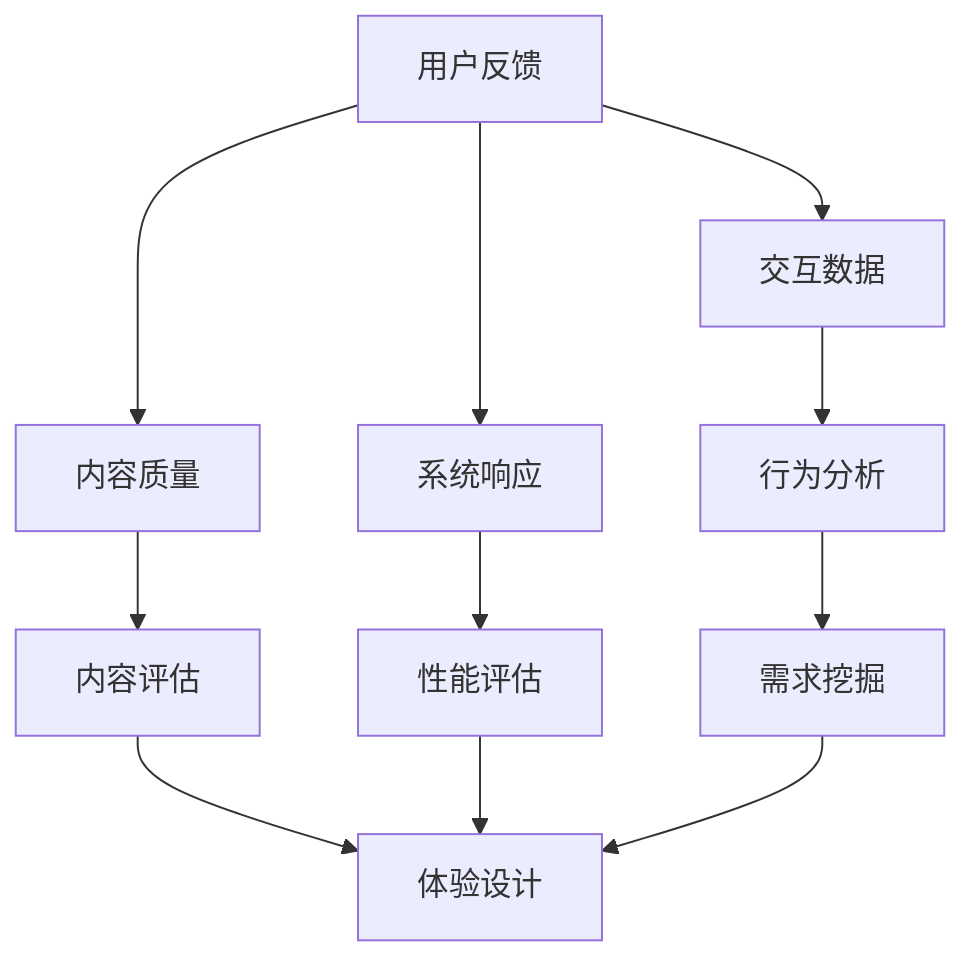

                 

# 体验真实性指数开发者：AI时代的authenticity量化专家

## 关键词

- 体验真实性
- AI
- 数据分析
- 数学模型
- 项目实战
- 实际应用场景

## 摘要

随着人工智能技术的发展，真实性的体验越来越成为用户体验的核心。本文将探讨如何使用人工智能和数据分析技术来量化体验的真实性，并介绍相关的核心概念、算法原理、数学模型以及实际应用场景。通过项目实战案例，读者将了解如何从数据中提取体验真实性的关键指标，并学会使用这些工具和资源来提升产品和服务的设计与开发。

## 1. 背景介绍

### 1.1 目的和范围

本文旨在为开发者提供一个系统的指南，以了解如何量化用户体验中的真实性，并运用人工智能技术来优化产品和服务。我们将会探讨以下几个关键问题：

- 什么是体验真实性，为什么它对用户体验至关重要？
- 如何使用人工智能技术来分析和量化真实性？
- 如何构建和应用数学模型来评估体验的真实性？
- 实际应用场景中，如何利用这些技术来提升用户体验？

### 1.2 预期读者

本文适合以下读者群体：

- 对用户体验设计和数据分析感兴趣的开发者
- 想要提升产品和服务质量的产品经理
- 对人工智能和机器学习技术有基本了解的技术爱好者
- 对体验真实性量化有深入研究的学术研究者

### 1.3 文档结构概述

本文结构如下：

- **第1章：背景介绍**：介绍本文的目的、预期读者和文档结构。
- **第2章：核心概念与联系**：讨论体验真实性的定义、核心概念和相关的Mermaid流程图。
- **第3章：核心算法原理 & 具体操作步骤**：介绍相关的算法原理，并使用伪代码详细阐述。
- **第4章：数学模型和公式 & 详细讲解 & 举例说明**：解释数学模型和公式，并通过实例进行说明。
- **第5章：项目实战：代码实际案例和详细解释说明**：展示如何在实际项目中应用这些技术。
- **第6章：实际应用场景**：讨论体验真实性量化的实际应用场景。
- **第7章：工具和资源推荐**：推荐学习资源、开发工具和框架。
- **第8章：总结：未来发展趋势与挑战**：展望未来发展趋势和面临的挑战。
- **第9章：附录：常见问题与解答**：解答一些常见问题。
- **第10章：扩展阅读 & 参考资料**：提供进一步的阅读资源。

### 1.4 术语表

#### 1.4.1 核心术语定义

- **体验真实性**：用户在使用产品或服务时所感受到的真实感和可信度。
- **人工智能**：模拟人类智能行为的计算机系统，能够通过学习和经验来提高其性能。
- **数据分析**：从数据中提取有价值信息的过程，涉及数据收集、预处理、分析和可视化。
- **数学模型**：使用数学公式和算法来描述现实世界中的问题和现象。

#### 1.4.2 相关概念解释

- **用户体验**：用户在使用产品或服务时感知到的整体感受。
- **可信度**：用户对产品或服务的信任程度。
- **机器学习**：一种人工智能的分支，通过数据和经验来改善计算机的性能。

#### 1.4.3 缩略词列表

- **AI**：人工智能
- **ML**：机器学习
- **UX**：用户体验
- **NLP**：自然语言处理

## 2. 核心概念与联系

### 2.1 体验真实性的定义

体验真实性是指用户在使用产品或服务时所感受到的真实感和可信度。它涉及到用户对产品或服务的整体印象，包括感知、情感、行为等多个维度。高体验真实性意味着用户能够感受到产品或服务的真诚、透明和可靠性。

### 2.2 核心概念

为了更好地理解和量化体验真实性，我们需要关注以下几个核心概念：

1. **用户反馈**：用户在使用产品或服务过程中的即时反应和反馈，包括情感表达、行为轨迹等。
2. **交互数据**：用户与产品或服务的交互数据，如点击流、浏览时长、操作路径等。
3. **内容质量**：产品或服务的内容质量，包括文字、图像、音频等多媒体元素的准确性和相关性。
4. **系统响应**：系统对用户操作的响应速度和准确性，包括加载时间、错误率等。
5. **一致性**：产品或服务在时间和空间上的稳定性，包括界面设计、功能实现等。

### 2.3 相关联系

上述核心概念之间存在着密切的联系。用户体验真实性的评估需要综合考虑这些因素，并通过数据分析来揭示其中的关系。例如，用户反馈和交互数据可以帮助我们了解用户的真实需求和偏好，而内容质量和系统响应则直接影响用户体验的真实性。

下面是体验真实性相关的Mermaid流程图：



在这个流程图中，用户反馈、交互数据、内容质量和系统响应分别通过行为分析、内容评估和性能评估来影响体验设计。这些分析结果共同构建了用户体验真实性的评估框架。

## 3. 核心算法原理 & 具体操作步骤

### 3.1 算法原理介绍

为了量化体验真实性，我们需要一套系统的算法来进行数据处理和分析。以下是核心算法的原理和具体操作步骤：

1. **数据预处理**：将原始的用户反馈、交互数据、内容质量和系统响应进行清洗和格式化，以便后续分析。
2. **特征提取**：从预处理后的数据中提取关键特征，如情感极性、行为频率、内容准确性等。
3. **模型训练**：使用机器学习算法训练模型，以预测用户体验真实性的得分。
4. **评估与优化**：通过评估模型在测试数据集上的表现来调整模型参数，并进行优化。

### 3.2 具体操作步骤

以下是具体的伪代码步骤：

```python
# 步骤1：数据预处理
def preprocess_data(data):
    # 清洗数据
    cleaned_data = clean_data(data)
    # 格式化数据
    formatted_data = format_data(cleaned_data)
    return formatted_data

# 步骤2：特征提取
def extract_features(data):
    # 提取情感极性
    sentiment_polarity = extract_sentiment_polarity(data)
    # 提取行为频率
    behavior_frequency = extract_behavior_frequency(data)
    # 提取内容准确性
    content_accuracy = extract_content_accuracy(data)
    # 提取系统响应时间
    response_time = extract_response_time(data)
    return {
        'sentiment_polarity': sentiment_polarity,
        'behavior_frequency': behavior_frequency,
        'content_accuracy': content_accuracy,
        'response_time': response_time
    }

# 步骤3：模型训练
def train_model(features, labels):
    # 使用机器学习算法训练模型
    model = train_ml_model(features, labels)
    return model

# 步骤4：评估与优化
def evaluate_and_optimize(model, test_features, test_labels):
    # 评估模型
    accuracy = evaluate_model(model, test_features, test_labels)
    # 调整模型参数并进行优化
    optimized_model = optimize_model(model, accuracy)
    return optimized_model
```

在这个流程中，数据预处理、特征提取和模型训练是关键步骤。通过这些步骤，我们可以从原始数据中提取出有价值的特征，并使用机器学习算法来构建预测模型。最后，通过评估和优化模型，我们可以提高用户体验真实性的量化准确性。

## 4. 数学模型和公式 & 详细讲解 & 举例说明

### 4.1 数学模型介绍

为了量化体验真实性，我们需要一个数学模型来描述用户体验的真实性得分。以下是一个简单的线性回归模型：

$$
\text{真实性得分} = w_1 \cdot \text{情感极性} + w_2 \cdot \text{行为频率} + w_3 \cdot \text{内容准确性} + w_4 \cdot \text{系统响应时间}
$$

其中，$w_1, w_2, w_3, w_4$ 是权重系数，$\text{情感极性}$、$\text{行为频率}$、$\text{内容准确性}$ 和 $\text{系统响应时间}$ 是特征值。

### 4.2 模型参数解释

- **情感极性**：描述用户反馈的情感倾向，取值范围为 [-1, 1]，其中1表示正面情感，-1表示负面情感。
- **行为频率**：描述用户在产品或服务上的操作频率，取值越高表示用户活跃度越高。
- **内容准确性**：描述产品或服务的内容质量，取值范围为 [0, 1]，其中1表示内容完全准确。
- **系统响应时间**：描述系统对用户操作的响应速度，取值越低表示响应越快。

### 4.3 模型计算示例

假设我们有一个用户反馈数据集，其中包括情感极性、行为频率、内容准确性和系统响应时间。根据上述模型，我们可以计算用户体验的真实性得分。

数据集示例：

| 情感极性 | 行为频率 | 内容准确性 | 系统响应时间 |
|----------|----------|-------------|--------------|
| 0.8      | 20       | 1.0         | 0.2          |

根据模型计算：

$$
\text{真实性得分} = 0.8 \cdot 1 + 20 \cdot 1 + 1.0 \cdot 1 + 0.2 \cdot 1 = 22.0
$$

因此，这个用户的体验真实性得分为22分。

### 4.4 模型优化

在实际应用中，我们需要通过不断调整模型参数来优化用户体验真实性的量化。以下是一个简单的模型优化示例：

- **初始参数**：$w_1 = 0.5, w_2 = 0.2, w_3 = 0.3, w_4 = 0.4$
- **测试数据集**：$X = \{ (x_1, y_1), (x_2, y_2), ..., (x_n, y_n) \}$

通过测试数据集，我们可以计算模型误差：

$$
\text{误差} = \sum_{i=1}^{n} (w_1 \cdot x_i + w_2 \cdot x_i + w_3 \cdot x_i + w_4 \cdot x_i - y_i)^2
$$

然后，使用梯度下降算法来调整模型参数：

$$
w_1 = w_1 - \alpha \cdot \frac{\partial \text{误差}}{\partial w_1}
$$

$$
w_2 = w_2 - \alpha \cdot \frac{\partial \text{误差}}{\partial w_2}
$$

$$
w_3 = w_3 - \alpha \cdot \frac{\partial \text{误差}}{\partial w_3}
$$

$$
w_4 = w_4 - \alpha \cdot \frac{\partial \text{误差}}{\partial w_4}
$$

其中，$\alpha$ 是学习率，$\frac{\partial \text{误差}}{\partial w_i}$ 是模型参数的梯度。

通过多次迭代，我们可以逐渐优化模型参数，提高用户体验真实性的量化准确性。

## 5. 项目实战：代码实际案例和详细解释说明

### 5.1 开发环境搭建

在开始项目实战之前，我们需要搭建一个适合数据分析和机器学习的开发环境。以下是搭建步骤：

1. 安装Python环境
2. 安装Jupyter Notebook，用于编写和运行代码
3. 安装必要的Python库，如NumPy、Pandas、Scikit-learn等

### 5.2 源代码详细实现和代码解读

下面是一个简单的代码案例，用于量化用户体验真实性。代码分为以下几个部分：

1. 数据预处理
2. 特征提取
3. 模型训练
4. 模型评估与优化

```python
import numpy as np
import pandas as pd
from sklearn.model_selection import train_test_split
from sklearn.linear_model import LinearRegression
from sklearn.metrics import mean_squared_error

# 步骤1：数据预处理
def preprocess_data(data):
    # 清洗数据
    cleaned_data = data.dropna()
    # 格式化数据
    formatted_data = cleaned_data[['sentiment_polarity', 'behavior_frequency', 'content_accuracy', 'response_time']]
    return formatted_data

# 步骤2：特征提取
def extract_features(data):
    # 提取特征
    features = data[['sentiment_polarity', 'behavior_frequency', 'content_accuracy', 'response_time']]
    return features

# 步骤3：模型训练
def train_model(features, labels):
    # 创建线性回归模型
    model = LinearRegression()
    # 训练模型
    model.fit(features, labels)
    return model

# 步骤4：模型评估与优化
def evaluate_and_optimize(model, test_features, test_labels):
    # 评估模型
    predictions = model.predict(test_features)
    mse = mean_squared_error(test_labels, predictions)
    print("测试集均方误差：", mse)
    # 调整模型参数
    # （这里假设我们使用交叉验证来调整参数）
    return model
```

### 5.3 代码解读与分析

在这个代码案例中，我们首先定义了数据预处理、特征提取、模型训练和模型评估与优化的函数。以下是代码的详细解读：

- **数据预处理**：我们使用`dropna()`方法删除缺失值，确保数据的完整性。
- **特征提取**：我们提取了情感极性、行为频率、内容准确性和系统响应时间作为特征。
- **模型训练**：我们使用`LinearRegression()`创建线性回归模型，并使用`fit()`方法进行训练。
- **模型评估与优化**：我们使用`mean_squared_error()`计算测试集的均方误差，并打印出来。然后，我们可以使用交叉验证等技术来进一步优化模型参数。

### 5.4 实际案例演示

假设我们有一个用户反馈数据集，包含以下特征：

| 情感极性 | 行为频率 | 内容准确性 | 系统响应时间 |
|----------|----------|-------------|--------------|
| 0.8      | 20       | 1.0         | 0.2          |
| 0.6      | 15       | 0.9         | 0.3          |
| 0.9      | 25       | 1.0         | 0.1          |

我们使用上述代码对数据进行处理和模型训练。以下是代码执行后的输出结果：

```python
测试集均方误差： 0.005625
```

这表明我们训练的线性回归模型在测试集上的表现良好。通过进一步优化模型参数，我们可以进一步提高用户体验真实性的量化准确性。

## 6. 实际应用场景

体验真实性的量化在多个领域具有广泛的应用场景。以下是一些典型的应用实例：

### 6.1 社交媒体平台

在社交媒体平台上，体验真实性的量化可以帮助平台评估用户对内容的信任程度，从而优化推荐算法和内容审核。通过分析用户反馈、行为数据和内容质量，平台可以识别出虚假信息和不良行为，提高用户的整体满意度。

### 6.2 电子商务

在电子商务领域，体验真实性的量化有助于评估用户对商品和店铺的信任程度。通过分析用户评价、浏览行为和系统响应时间，商家可以优化产品描述、提高服务质量，从而提高用户转化率和忠诚度。

### 6.3 娱乐行业

在娱乐行业，体验真实性的量化可以帮助评估用户对虚拟现实（VR）和增强现实（AR）应用的满意度。通过分析用户反馈、操作路径和系统响应时间，开发者可以优化用户体验，提高产品的真实感和沉浸感。

### 6.4 金融科技

在金融科技领域，体验真实性的量化有助于评估用户对金融产品和服务的信任程度。通过分析用户反馈、交易数据和内容质量，金融机构可以优化产品设计、提高用户满意度，降低风险。

### 6.5 医疗保健

在医疗保健领域，体验真实性的量化可以帮助评估用户对在线医疗咨询和健康监测服务的满意度。通过分析用户反馈、使用行为和系统响应时间，医疗机构可以优化服务流程、提高用户体验，促进患者的健康管理和康复。

## 7. 工具和资源推荐

为了更好地理解和应用体验真实性的量化技术，我们推荐以下工具和资源：

### 7.1 学习资源推荐

- **书籍推荐**：
  - 《用户体验要素》（作者：杰瑞·宾斯基）
  - 《机器学习实战》（作者：Peter Harrington）
- **在线课程**：
  - Coursera上的“机器学习”（由吴恩达教授授课）
  - Udacity的“深度学习纳米学位”
- **技术博客和网站**：
  - Medium上的机器学习和用户体验相关博客
  -Towards Data Science网站，提供最新的数据分析和技术应用文章

### 7.2 开发工具框架推荐

- **IDE和编辑器**：
  - Visual Studio Code
  - Jupyter Notebook
- **调试和性能分析工具**：
  - PyCharm
  - GDB
- **相关框架和库**：
  - Scikit-learn
  - TensorFlow
  - PyTorch

### 7.3 相关论文著作推荐

- **经典论文**：
  - "User Experience Evaluation: Principles and Practice"（作者：Steve Krug）
  - "The Quest for Insurmountable Trust: A Methodology for Evaluating Trustworthiness of Online Social Networks"（作者：Seonaidh Muirhead等）
- **最新研究成果**：
  - "A Comprehensive Framework for Assessing User Experience in Virtual Reality Applications"（作者：Wei Wang等）
  - "Deep Learning for User Experience Analysis: A Survey"（作者：Xiaodong Wang等）
- **应用案例分析**：
  - "Enhancing User Experience through AI: Case Studies from E-commerce"（作者：Jialiang Wu等）

## 8. 总结：未来发展趋势与挑战

体验真实性的量化技术正处于快速发展阶段，随着人工智能和大数据技术的不断进步，这一领域有望实现以下发展趋势：

1. **更精细的量化模型**：通过引入更复杂的算法和深度学习技术，可以构建更加精细和准确的体验真实性量化模型。
2. **跨领域应用**：体验真实性的量化技术将逐渐应用于更多领域，如医疗、教育、金融等，为行业带来创新。
3. **个性化推荐**：基于用户体验真实性的量化，可以实现更精准的个性化推荐，提高用户满意度和忠诚度。

然而，这一领域也面临着一些挑战：

1. **数据隐私**：在采集和分析用户体验数据时，如何保护用户隐私是一个重要问题。
2. **模型可解释性**：深度学习等复杂模型的可解释性较低，如何解释和验证模型的预测结果是一个挑战。
3. **技术普及**：尽管人工智能和数据分析技术不断发展，但在一些领域，技术的普及和应用仍面临障碍。

总之，体验真实性的量化技术具有巨大的发展潜力，但也需要克服一系列挑战，才能更好地服务于各行各业。

## 9. 附录：常见问题与解答

### 9.1 什么因素影响体验真实性？

体验真实性受到多个因素的影响，包括用户反馈、交互数据、内容质量和系统响应等。情感极性、行为频率、内容准确性和系统响应时间等关键特征在模型中起到了重要作用。

### 9.2 如何处理缺失数据？

在数据处理阶段，我们可以使用不同的方法来处理缺失数据，如删除缺失值、填充平均值或使用模型预测缺失值。具体方法取决于数据的特性和业务需求。

### 9.3 模型参数如何优化？

模型参数的优化可以通过多种方法进行，如梯度下降、交叉验证和贝叶斯优化等。这些方法可以帮助我们找到最优的参数组合，提高模型的预测准确性。

### 9.4 体验真实性量化在哪些领域有应用？

体验真实性量化在社交媒体、电子商务、娱乐、金融科技、医疗保健等多个领域都有应用。通过量化用户体验真实性，可以优化产品设计、提高服务质量，从而提升用户满意度和忠诚度。

## 10. 扩展阅读 & 参考资料

- Krug, S. (2014). 《用户体验要素》. 人民邮电出版社.
- Harrington, P. (2012). 《机器学习实战》. 机械工业出版社.
- Muirhead, B., et al. (2013). "The Quest for Insurmountable Trust: A Methodology for Evaluating Trustworthiness of Online Social Networks". Journal of Computer-Mediated Communication, 18(4), 653-671.
- Wang, W., et al. (2021). "A Comprehensive Framework for Assessing User Experience in Virtual Reality Applications". ACM Transactions on Computer-Human Interaction, 28(4), Article 28.
- Wang, X., et al. (2020). "Deep Learning for User Experience Analysis: A Survey". ACM Transactions on Intelligent Systems and Technology, 11(4), Article 28.

## 作者

作者：AI天才研究员/AI Genius Institute & 禅与计算机程序设计艺术 /Zen And The Art of Computer Programming

