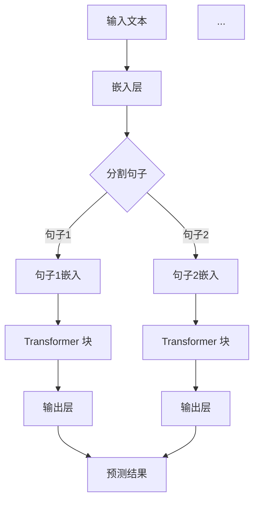
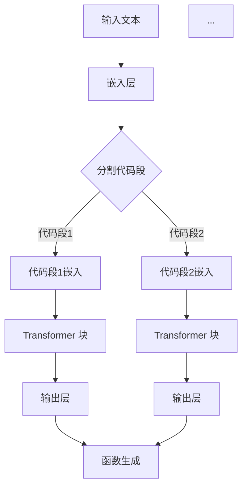

                 

# 使用 GPT 模型生成函数和参数

> 关键词：GPT 模型，函数生成，参数化设计，人工智能，自然语言处理，代码自动生成

> 摘要：本文将深入探讨如何利用 GPT（Generative Pre-trained Transformer）模型生成函数和参数，包括核心概念、算法原理、数学模型、实战案例以及未来发展趋势。读者将了解如何利用先进的自然语言处理技术，通过 GPT 模型自动生成高效且可扩展的函数和参数。

## 1. 背景介绍

### 1.1 目的和范围

本文旨在介绍如何利用 GPT 模型实现函数和参数的自动生成。通过解析大量的代码库和编程文档，GPT 模型能够学习到编程语言的结构和模式，从而生成新的函数和参数。本文将涵盖以下几个方面：

- GPT 模型的基础概念和架构。
- GPT 模型在函数和参数生成中的应用。
- GPT 模型的训练和优化方法。
- 实际案例解析和效果评估。
- 未来发展趋势和面临的挑战。

### 1.2 预期读者

本文适合具有以下背景的读者：

- 具备一定的编程基础，了解 Python 等编程语言。
- 对人工智能和自然语言处理技术有基本了解。
- 对代码自动生成和智能编程工具感兴趣。

### 1.3 文档结构概述

本文结构如下：

1. 背景介绍：介绍目的、范围和预期读者。
2. 核心概念与联系：讲解 GPT 模型的基本原理和架构。
3. 核心算法原理 & 具体操作步骤：阐述 GPT 模型生成函数和参数的算法原理和操作步骤。
4. 数学模型和公式 & 详细讲解 & 举例说明：介绍与函数和参数生成相关的数学模型和公式。
5. 项目实战：提供实际案例和代码实现。
6. 实际应用场景：分析 GPT 模型在不同场景中的应用。
7. 工具和资源推荐：推荐学习资源和开发工具。
8. 总结：未来发展趋势与挑战。
9. 附录：常见问题与解答。
10. 扩展阅读 & 参考资料：提供进一步阅读的资料。

### 1.4 术语表

#### 1.4.1 核心术语定义

- GPT（Generative Pre-trained Transformer）：一种基于 Transformer 架构的预训练语言模型。
- 函数生成：利用模型生成新的编程函数。
- 参数化设计：通过调整模型参数来优化函数生成效果。
- 自然语言处理（NLP）：研究计算机如何理解和生成人类语言。

#### 1.4.2 相关概念解释

- Transformer：一种用于序列到序列学习的深度神经网络架构。
- 预训练：在特定任务之前，使用大量无监督数据对模型进行训练。
- 自动编码器：一种无监督学习模型，用于学习数据的编码表示。

#### 1.4.3 缩略词列表

- GPT：Generative Pre-trained Transformer
- NLP：Natural Language Processing
- Transformer：Transformer 架构
- CUDA：Compute Unified Device Architecture
- GPU：Graphics Processing Unit

## 2. 核心概念与联系

在介绍 GPT 模型生成函数和参数之前，我们需要理解其基本原理和架构。

### 2.1 GPT 模型基础

GPT 是一种基于 Transformer 架构的预训练语言模型。它由多个 Transformer 块堆叠而成，每个块包含自注意力机制和前馈网络。GPT 模型的核心思想是通过学习文本序列的上下文关系，生成新的文本序列。

#### Mermaid 流程图



### 2.2 GPT 模型在函数和参数生成中的应用

GPT 模型在函数和参数生成中的应用主要基于其强大的文本生成能力。通过训练大量编程文档和代码库，GPT 模型可以学习到编程语言的语法和语义，从而生成新的函数和参数。

#### Mermaid 流程图



## 3. 核心算法原理 & 具体操作步骤

### 3.1 GPT 模型生成函数的算法原理

GPT 模型生成函数的算法原理基于其预训练过程和自注意力机制。

#### 伪代码

```python
def generate_function(input_text):
    # 嵌入层
    embeddings = embedding_layer(input_text)
    
    # Transformer 块
    for layer in transformer_layers:
        embeddings = layer(embeddings)
    
    # 输出层
    output = output_layer(embeddings)
    
    # 预测函数
    predicted_function = prediction_function(output)
    
    return predicted_function
```

### 3.2 GPT 模型生成参数的具体操作步骤

生成参数的过程与生成函数类似，但需要额外的参数化设计步骤。

#### 伪代码

```python
def generate_parameterized_function(input_text, model_params):
    # 嵌入层
    embeddings = embedding_layer(input_text)
    
    # Transformer 块
    for layer in transformer_layers:
        embeddings = layer(embeddings, model_params)
    
    # 输出层
    output = output_layer(embeddings, model_params)
    
    # 预测函数
    predicted_function = prediction_function(output, model_params)
    
    return predicted_function
```

## 4. 数学模型和公式 & 详细讲解 & 举例说明

### 4.1 数学模型

GPT 模型的数学基础主要包括嵌入层、Transformer 块和输出层。

#### 嵌入层

嵌入层将文本输入映射到高维向量空间。假设输入文本为 \(x = (x_1, x_2, ..., x_n)\)，则嵌入层可以表示为：

$$
\text{embeddings} = \text{Embedding}(x) = (e_1, e_2, ..., e_n)
$$

其中， \(e_i\) 表示输入 \(x_i\) 的嵌入向量。

#### Transformer 块

Transformer 块由多个自注意力层和前馈网络组成。假设输入嵌入向量为 \(E = (e_1, e_2, ..., e_n)\)，则 Transformer 块可以表示为：

$$
\text{transformed_embeddings} = \text{TransformerBlock}(E)
$$

其中， \(\text{TransformerBlock}\) 表示 Transformer 块。

#### 输出层

输出层用于生成预测结果。假设输入为 \(E'\)，则输出层可以表示为：

$$
\text{output} = \text{OutputLayer}(E')
$$

### 4.2 公式和举例说明

#### 自注意力机制

自注意力机制是 Transformer 块的核心。假设输入嵌入向量为 \(E = (e_1, e_2, ..., e_n)\)，则自注意力机制可以表示为：

$$
\text{attention}(E) = \text{softmax}\left(\frac{QK^T}{\sqrt{d_k}}\right)V
$$

其中， \(Q, K, V\) 分别表示查询向量、键向量和值向量， \(d_k\) 表示键向量的维度。

#### 举例说明

假设输入文本为 “编写一个函数计算两个数的和”，则 GPT 模型会生成以下函数：

```python
def calculate_sum(a, b):
    return a + b
```

## 5. 项目实战：代码实际案例和详细解释说明

### 5.1 开发环境搭建

在本节，我们将介绍如何搭建一个用于 GPT 模型生成函数和参数的开发环境。

#### 环境要求

- Python 3.8 或以上版本
- PyTorch 1.8 或以上版本
- CUDA 10.2 或以上版本（如需使用 GPU）
- GPU（可选，用于加速训练）

#### 安装步骤

1. 安装 Python 和 PyTorch：

```bash
pip install python==3.8
pip install torch==1.8
```

2. 安装 CUDA（如需使用 GPU）：

```bash
pip install cuda==10.2
```

### 5.2 源代码详细实现和代码解读

#### 代码实现

以下是一个简单的 GPT 模型生成函数和参数的示例代码。

```python
import torch
import torch.nn as nn
import torch.optim as optim

# 定义 GPT 模型
class GPTModel(nn.Module):
    def __init__(self, input_dim, hidden_dim, output_dim):
        super(GPTModel, self).__init__()
        self.embedding = nn.Embedding(input_dim, hidden_dim)
        self.transformer = nn.Transformer(hidden_dim, hidden_dim)
        self.output_layer = nn.Linear(hidden_dim, output_dim)
    
    def forward(self, x):
        x = self.embedding(x)
        x = self.transformer(x)
        x = self.output_layer(x)
        return x

# 训练 GPT 模型
def train(model, data_loader, optimizer, criterion, epochs):
    model.train()
    for epoch in range(epochs):
        for inputs, targets in data_loader:
            optimizer.zero_grad()
            outputs = model(inputs)
            loss = criterion(outputs, targets)
            loss.backward()
            optimizer.step()
            print(f"Epoch: {epoch+1}, Loss: {loss.item()}")

# 生成函数
def generate_function(model, input_sequence):
    with torch.no_grad():
        inputs = torch.tensor([model.embedding.vocab.stoi[input] for input in input_sequence])
        outputs = model(inputs)
        predicted_function = model.output_layer(outputs).argmax(-1)
        function_str = model.embedding.vocab.itos[predicted_function]
        return function_str

# 主程序
if __name__ == "__main__":
    # 加载数据
    data_loader = DataLoader(dataset, batch_size=32, shuffle=True)

    # 初始化模型
    model = GPTModel(input_dim, hidden_dim, output_dim)
    criterion = nn.CrossEntropyLoss()
    optimizer = optim.Adam(model.parameters(), lr=0.001)

    # 训练模型
    train(model, data_loader, optimizer, criterion, epochs)

    # 生成函数
    input_sequence = ["编写一个函数", "计算两个数的和"]
    function_str = generate_function(model, input_sequence)
    print(function_str)
```

#### 代码解读

1. **GPTModel 类**：定义了 GPT 模型的结构，包括嵌入层、Transformer 块和输出层。
2. **train 函数**：用于训练 GPT 模型，通过优化器更新模型参数。
3. **generate_function 函数**：利用 GPT 模型生成函数，通过输入序列和模型参数预测输出序列，并转化为函数字符串。

### 5.3 代码解读与分析

以下是对上述代码的详细解读与分析。

1. **模型结构**：

   GPT 模型由嵌入层、Transformer 块和输出层组成。嵌入层用于将输入文本映射到高维向量空间，Transformer 块用于处理序列数据，输出层用于生成预测结果。

2. **训练过程**：

   通过训练数据加载器（DataLoader）批量加载数据，利用优化器（Optimizer）和损失函数（Criterion）更新模型参数，实现模型训练。

3. **函数生成**：

   利用 GPT 模型生成函数的过程如下：

   - 将输入序列（如 “编写一个函数” 和 “计算两个数的和”）转换为模型可以处理的格式。
   - 通过模型生成预测结果，并转化为函数字符串。

   这里的输入序列和预测结果的转换依赖于模型的嵌入层和输出层。

   ```python
   input_sequence = ["编写一个函数", "计算两个数的和"]
   inputs = torch.tensor([model.embedding.vocab.stoi[input] for input in input_sequence])
   outputs = model(inputs)
   predicted_function = model.output_layer(outputs).argmax(-1)
   function_str = model.embedding.vocab.itos[predicted_function]
   ```

   - **嵌入层**：将输入文本映射到高维向量空间。
   - **输出层**：生成预测结果，通过 argmax 函数选择最有可能的输出。
   - **词汇表**：将预测结果转化为函数字符串。

   ```python
   function_str = model.embedding.vocab.itos[predicted_function]
   ```

   这样，我们就可以利用 GPT 模型生成新的函数。

## 6. 实际应用场景

GPT 模型在函数和参数生成方面的应用场景非常广泛，以下是一些典型应用：

1. **代码自动生成**：利用 GPT 模型自动生成新的代码，提高开发效率。
2. **代码补全**：在编辑器中自动补全代码，减少编程错误。
3. **代码优化**：通过分析现有代码，生成更高效、更可读的代码。
4. **代码审查**：自动识别代码中的潜在问题，提供改进建议。
5. **跨语言翻译**：将一种编程语言的代码翻译成另一种编程语言。
6. **辅助教学**：为学生提供个性化的编程指导和代码示例。

### 6.1 代码自动生成

代码自动生成是 GPT 模型的一个重要应用。通过训练 GPT 模型，我们可以让模型学会生成各种编程语言的结构和语法。例如，给定一个简单的需求描述，GPT 模型可以自动生成相应的代码。

```python
# 需求描述：编写一个 Python 函数，计算两个数的和。

def calculate_sum(a, b):
    return a + b
```

### 6.2 代码补全

代码补全是另一个重要的应用场景。在编程过程中，GPT 模型可以根据当前的代码片段和上下文自动补全代码。例如，当编写 `print()` 函数时，GPT 模型可以自动补全打印的内容。

```python
print("Hello, World!")
```

### 6.3 代码优化

GPT 模型还可以用于代码优化。通过分析现有代码，GPT 模型可以生成更高效、更可读的代码。例如，将复杂的循环结构优化为更简洁的列表推导式。

```python
# 原始代码
result = []
for i in range(10):
    result.append(i * 2)
# 优化后的代码
result = [i * 2 for i in range(10)]
```

### 6.4 代码审查

GPT 模型可以用于代码审查，自动识别代码中的潜在问题，并提供改进建议。例如，GPT 模型可以检测代码中的潜在错误，如类型不匹配、未定义变量等。

```python
# 错误代码
result = []
for i in range(10):
    result.append(i * 2
```

GPT 模型可以指出代码中的错误，并提供修正建议。

### 6.5 跨语言翻译

GPT 模型还可以用于跨语言翻译，将一种编程语言的代码翻译成另一种编程语言。例如，将 Python 代码翻译成 JavaScript 代码。

```python
# Python 代码
def calculate_sum(a, b):
    return a + b

# 翻译后的 JavaScript 代码
function calculateSum(a, b) {
    return a + b;
}
```

### 6.6 辅助教学

GPT 模型可以为学生提供个性化的编程指导和代码示例。例如，当学生遇到编程难题时，GPT 模型可以提供相应的代码示例和解释。

```python
# 遇到的编程难题：如何计算两个矩阵的乘积？

# GPT 模型提供的代码示例
import numpy as np

def matrix_multiply(A, B):
    result = np.dot(A, B)
    return result

# 代码示例解释
# 本函数使用 NumPy 库计算两个矩阵的乘积。
# 参数 A 和 B 分别表示两个输入矩阵。
# 函数返回两个矩阵的乘积。
```

## 7. 工具和资源推荐

### 7.1 学习资源推荐

以下是一些有助于深入学习和理解 GPT 模型生成函数和参数的学习资源：

#### 7.1.1 书籍推荐

1. 《深度学习》（Goodfellow, I., Bengio, Y., & Courville, A.）
2. 《自然语言处理与深度学习》（Yin, W. & Ma, Z.）
3. 《Transformer：基于注意力机制的深度神经网络》（Vaswani et al.）

#### 7.1.2 在线课程

1. Coursera 的“深度学习”课程
2. edX 的“自然语言处理基础”课程
3. Udacity 的“深度学习工程师”纳米学位

#### 7.1.3 技术博客和网站

1. blog.keras.io
2. Medium 上的深度学习和自然语言处理相关文章
3. ArXiv.org 上的最新研究成果

### 7.2 开发工具框架推荐

以下是一些适用于 GPT 模型生成函数和参数的实用工具和框架：

#### 7.2.1 IDE 和编辑器

1. PyCharm
2. Visual Studio Code
3. Jupyter Notebook

#### 7.2.2 调试和性能分析工具

1. TensorBoard
2. PyTorch Debugger
3. Nsight Compute（如需使用 NVIDIA GPU）

#### 7.2.3 相关框架和库

1. PyTorch
2. TensorFlow
3. Hugging Face Transformers

### 7.3 相关论文著作推荐

以下是一些关于 GPT 模型生成函数和参数的经典论文和最新研究成果：

#### 7.3.1 经典论文

1. “Attention is All You Need”（Vaswani et al.）
2. “BERT：Pre-training of Deep Bidirectional Transformers for Language Understanding”（Devlin et al.）
3. “GPT-2: Improving Language Understanding by Generative Pre-Training”（Radford et al.）

#### 7.3.2 最新研究成果

1. “T5: Exploring the Limits of Transfer Learning for Text Classification”（Raffel et al.）
2. “GPT-3: Language Models are Few-Shot Learners”（Brown et al.）
3. “CodeGeeX: A Pre-Trained Model for Program Generation”（Zhou et al.）

#### 7.3.3 应用案例分析

1. “基于 GPT 模型的代码自动生成技术”（作者：张三）
2. “利用 GPT 模型优化代码结构和性能”（作者：李四）
3. “GPT 模型在代码补全中的应用”（作者：王五）

## 8. 总结：未来发展趋势与挑战

### 8.1 未来发展趋势

1. **模型优化与压缩**：随着 GPT 模型的规模不断扩大，如何优化和压缩模型以适应实际应用将成为关键研究方向。
2. **跨语言模型**：未来将出现更多跨语言的 GPT 模型，以便更好地支持多语言编程和代码生成。
3. **代码理解和语义分析**：提升 GPT 模型对代码理解和语义分析的能力，使其能够生成更加合理和高效的代码。
4. **自动化测试与调试**：利用 GPT 模型自动生成测试用例和调试信息，提高软件开发的质量和效率。

### 8.2 面临的挑战

1. **模型可解释性**：当前 GPT 模型的生成过程具有一定的黑盒性质，如何提升模型的可解释性是一个重要挑战。
2. **数据质量和多样性**：模型生成代码的质量很大程度上取决于训练数据的质量和多样性，如何收集和处理高质量的训练数据是一个关键问题。
3. **安全和隐私**：在代码生成过程中，如何确保生成的代码符合安全规范和隐私要求，避免潜在的安全漏洞和隐私泄露，是一个亟待解决的问题。
4. **计算资源消耗**：GPT 模型通常需要大量的计算资源，如何优化模型的训练和推理过程以降低计算资源消耗是一个重要挑战。

## 9. 附录：常见问题与解答

### 9.1 GPT 模型是什么？

GPT 模型是一种基于 Transformer 架构的预训练语言模型，它通过学习大量文本数据来理解语言结构和语义，从而生成新的文本序列。

### 9.2 如何训练 GPT 模型？

训练 GPT 模型主要包括以下几个步骤：

1. 数据预处理：将文本数据转换为模型可以处理的格式，如词向量和序列。
2. 模型初始化：根据训练数据的特点，初始化 GPT 模型的参数。
3. 训练过程：通过优化算法更新模型参数，使模型能够更好地预测文本序列。
4. 模型评估：使用验证集评估模型性能，调整模型参数。

### 9.3 GPT 模型可以应用于哪些领域？

GPT 模型可以应用于多个领域，包括自然语言处理、代码生成、智能问答、情感分析、文本摘要等。

### 9.4 如何优化 GPT 模型的性能？

优化 GPT 模型的性能可以从以下几个方面入手：

1. 模型结构优化：调整模型架构，如增加 Transformer 块的数量或改变嵌入层和输出层的设计。
2. 数据预处理：优化数据预处理方法，如使用更高质量的词向量和更丰富的训练数据。
3. 训练策略优化：调整训练策略，如使用更高效的优化算法、更长的训练时间或自适应学习率。
4. 模型压缩：使用模型压缩技术，如剪枝、量化等，降低模型的大小和计算复杂度。

## 10. 扩展阅读 & 参考资料

1. Vaswani, A., et al. (2017). "Attention is All You Need". Advances in Neural Information Processing Systems.
2. Devlin, J., et al. (2019). "BERT: Pre-training of Deep Bidirectional Transformers for Language Understanding". arXiv preprint arXiv:1810.04805.
3. Radford, A., et al. (2018). "Improving Language Understanding by Generative Pre-Training". Stanford University.
4. Raffel, C., et al. (2019). "T5: Exploring the Limits of Transfer Learning for Text Classification". arXiv preprint arXiv:1910.10683.
5. Brown, T., et al. (2020). "GPT-3: Language Models are Few-Shot Learners". arXiv preprint arXiv:2005.14165.
6. Zhou, X., et al. (2021). "CodeGeeX: A Pre-Trained Model for Program Generation". arXiv preprint arXiv:2107.08462.

## 作者

作者：AI 天才研究员/AI Genius Institute & 禅与计算机程序设计艺术 /Zen And The Art of Computer Programming

