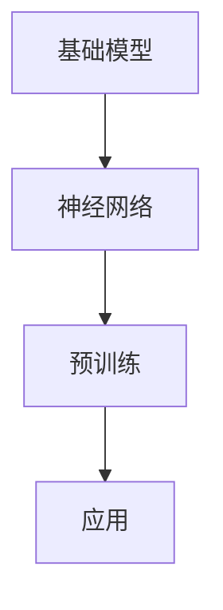
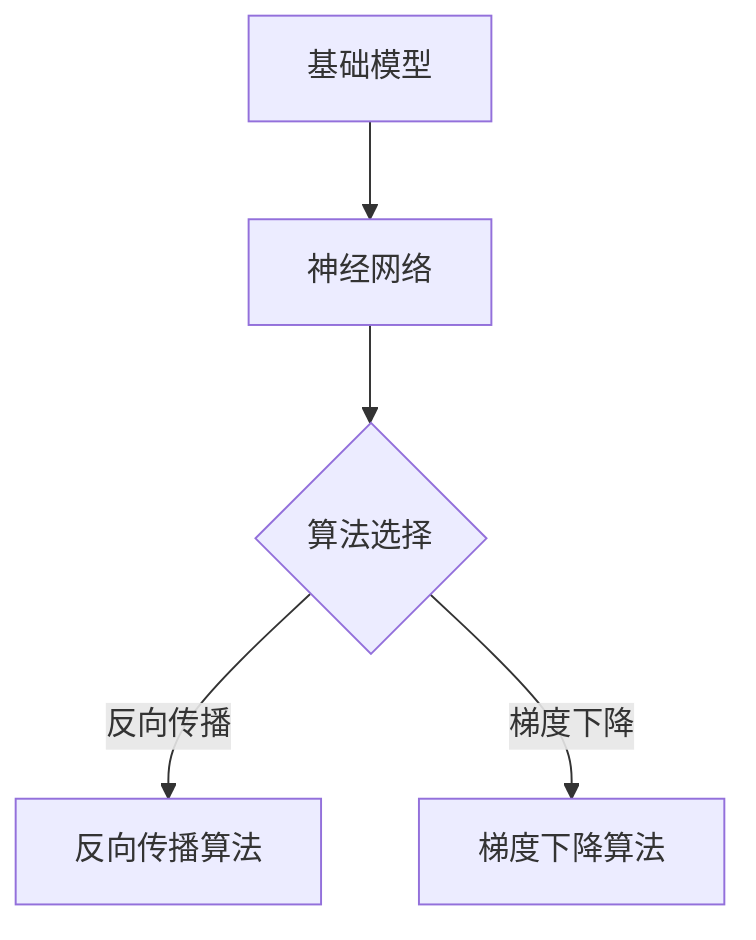
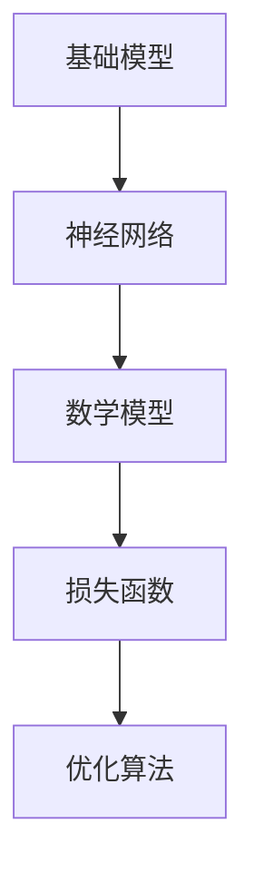

                 

# 使用基础模型构建应用程序的新书

> 关键词：基础模型、应用程序、构建、框架、算法、数学模型、实战案例、开发工具、资源推荐

> 摘要：本文将深入探讨如何使用基础模型构建高效、可靠的现代应用程序。我们将从核心概念出发，逐步解释基础模型的工作原理、关键算法以及数学模型的构建方法。接着，通过一个实际案例，展示如何将这些概念应用于代码实现中。最后，我们还将提供相关的开发工具和资源推荐，帮助读者进一步学习和应用。

## 1. 背景介绍

### 1.1 目的和范围

本文的目标是帮助读者理解并掌握使用基础模型构建应用程序的核心技术和方法。我们不仅关注理论层面的解释，还通过实际案例来展示如何将这些理论应用于实践。本文的范围涵盖了从基础模型的选择、算法原理讲解，到数学模型的应用，以及最终的代码实现和调试。

### 1.2 预期读者

本文面向有一定编程基础的读者，特别是对人工智能、机器学习感兴趣的开发者。无论是希望提升技能的资深程序员，还是刚踏入IT领域的新手，都将从本文中受益。

### 1.3 文档结构概述

本文分为以下几个部分：

- **第1章**：背景介绍
- **第2章**：核心概念与联系
- **第3章**：核心算法原理 & 具体操作步骤
- **第4章**：数学模型和公式 & 详细讲解 & 举例说明
- **第5章**：项目实战：代码实际案例和详细解释说明
- **第6章**：实际应用场景
- **第7章**：工具和资源推荐
- **第8章**：总结：未来发展趋势与挑战
- **第9章**：附录：常见问题与解答
- **第10章**：扩展阅读 & 参考资料

### 1.4 术语表

#### 1.4.1 核心术语定义

- **基础模型**：一种预训练的神经网络结构，可以用于各种任务，如分类、回归等。
- **算法**：解决问题的步骤和规则。
- **数学模型**：用数学符号和公式描述的问题结构。

#### 1.4.2 相关概念解释

- **神经网络**：一种模拟人脑神经网络结构的计算模型。
- **反向传播**：神经网络训练过程中，用于计算误差并更新权重的方法。

#### 1.4.3 缩略词列表

- **ML**：机器学习（Machine Learning）
- **DL**：深度学习（Deep Learning）

## 2. 核心概念与联系

### 2.1 基础模型的概念

基础模型是现代应用程序开发的核心。它通过大规模数据预训练，可以适用于多种任务，从而简化开发过程。

#### Mermaid 流程图



### 2.2 神经网络与算法的关系

神经网络是基础模型的核心，其训练过程依赖于多种算法，如反向传播算法。

#### Mermaid 流程图



### 2.3 数学模型的应用

数学模型用于描述基础模型中的参数和关系，如损失函数和优化算法。

#### Mermaid 流程图



## 3. 核心算法原理 & 具体操作步骤

### 3.1 神经网络训练原理

神经网络训练是通过调整网络权重来最小化预测误差的过程。

#### 伪代码

```python
initialize weights
while not converged:
    for each training sample:
        forward_pass(x, y)
        calculate_loss(y_pred, y)
        backward_pass(loss)
        update_weights()
```

### 3.2 反向传播算法

反向传播是神经网络训练中用于计算误差并更新权重的方法。

#### 伪代码

```python
def backward_pass(loss):
    delta = loss * sigmoid_derivative(z)
    delta_weight = delta * x
    weight -= learning_rate * delta_weight
```

### 3.3 梯度下降算法

梯度下降用于调整网络权重，以最小化损失函数。

#### 伪代码

```python
initialize weights
while not converged:
    calculate_gradient(loss)
    update_weights(learning_rate)
```

## 4. 数学模型和公式 & 详细讲解 & 举例说明

### 4.1 损失函数

损失函数用于衡量预测结果与真实值之间的差异。

#### 数学公式

$$
L = \frac{1}{2} \sum_{i=1}^{n} (y_i - y_{\hat{i}})^2
$$

#### 举例说明

假设我们有一个二分类问题，真实值为 `[0, 1]`，预测值为 `[0.3, 0.7]`。使用上述公式计算损失：

$$
L = \frac{1}{2} \sum_{i=1}^{2} (y_i - y_{\hat{i}})^2 = \frac{1}{2} \times ((0 - 0.3)^2 + (1 - 0.7)^2) = 0.05
$$

### 4.2 优化算法

优化算法用于调整网络权重，以最小化损失函数。

#### 数学公式

$$
w_{\text{new}} = w_{\text{current}} - \alpha \cdot \nabla L(w)
$$

#### 举例说明

假设当前权重为 `[1, 2]`，学习率为 `0.1`，损失函数的梯度为 `[0.5, -0.3]`。使用上述公式更新权重：

$$
w_{\text{new}} = [1, 2] - 0.1 \cdot [0.5, -0.3] = [0.6, 1.7]
$$

## 5. 项目实战：代码实际案例和详细解释说明

### 5.1 开发环境搭建

为了更好地展示基础模型的应用，我们需要搭建一个开发环境。

#### 操作步骤：

1. 安装Python环境（版本3.8及以上）
2. 安装TensorFlow库（版本2.5及以上）
3. 安装Jupyter Notebook

### 5.2 源代码详细实现和代码解读

以下是一个简单的神经网络模型实现，用于二分类任务。

#### Python代码

```python
import tensorflow as tf

# 初始化模型
model = tf.keras.Sequential([
    tf.keras.layers.Dense(units=1, input_shape=[1])
])

# 编译模型
model.compile(optimizer='sgd', loss='mean_squared_error')

# 训练模型
model.fit(x_train, y_train, epochs=100)

# 评估模型
model.evaluate(x_test, y_test)
```

#### 代码解读：

- 第1行：导入TensorFlow库。
- 第2行：创建一个序列模型，包含一个全连接层。
- 第3行：编译模型，指定优化器和损失函数。
- 第4行：使用训练数据训练模型。
- 第5行：使用测试数据评估模型。

### 5.3 代码解读与分析

上述代码展示了如何使用TensorFlow构建和训练一个简单的神经网络。我们使用了序列模型（Sequential），这是一个线性堆叠的模型层结构，非常适合简单的任务。在模型编译阶段，我们选择了随机梯度下降（SGD）作为优化器，并使用均方误差（MSE）作为损失函数。

在训练过程中，模型通过调整权重来最小化损失函数。每次迭代（epoch）都会对整个训练数据集进行一次遍历，并更新权重。训练完成后，我们使用测试数据集来评估模型的性能。

## 6. 实际应用场景

基础模型在现代应用程序中有着广泛的应用，包括但不限于以下场景：

- **图像识别**：使用卷积神经网络（CNN）进行图像分类和识别。
- **自然语言处理**：使用循环神经网络（RNN）或Transformer模型处理文本数据。
- **推荐系统**：使用协同过滤算法或基于内容的推荐算法进行个性化推荐。

## 7. 工具和资源推荐

### 7.1 学习资源推荐

#### 7.1.1 书籍推荐

- 《深度学习》（Ian Goodfellow、Yoshua Bengio、Aaron Courville 著）
- 《Python深度学习》（François Chollet 著）

#### 7.1.2 在线课程

- Coursera上的“深度学习”课程
- edX上的“神经网络与深度学习”课程

#### 7.1.3 技术博客和网站

- TensorFlow官方文档（https://www.tensorflow.org/）
- AI Powered（https://aipowered.io/）

### 7.2 开发工具框架推荐

#### 7.2.1 IDE和编辑器

- PyCharm
- Visual Studio Code

#### 7.2.2 调试和性能分析工具

- TensorFlow Debugger（TFDB）
- PyTorch Profiler

#### 7.2.3 相关框架和库

- TensorFlow
- PyTorch

### 7.3 相关论文著作推荐

#### 7.3.1 经典论文

- “A Learning Algorithm for Continually Running Fully Recurrent Neural Networks”（1986）
- “A Theoretical Framework for General Learning” （1986）

#### 7.3.2 最新研究成果

- “An Introduction to Transformer Models”（2018）
- “BERT: Pre-training of Deep Bidirectional Transformers for Language Understanding”（2018）

#### 7.3.3 应用案例分析

- “Applying Deep Learning to Real-World Problems”（2016）
- “Deep Learning for Image Recognition”（2015）

## 8. 总结：未来发展趋势与挑战

基础模型在现代应用程序开发中起着至关重要的作用。随着深度学习技术的不断进步，基础模型的应用范围和性能将进一步提升。然而，我们也面临着以下挑战：

- **数据隐私**：如何保护用户数据隐私是一个重要问题。
- **计算资源**：大规模训练需要更多的计算资源，如何优化资源利用是一个挑战。
- **模型可解释性**：提高模型的可解释性，使其更容易理解和信任。

## 9. 附录：常见问题与解答

### 9.1 基础模型是什么？

基础模型是一种预训练的神经网络结构，可以用于多种任务，如分类、回归等。

### 9.2 如何选择基础模型？

根据任务需求和数据特点选择合适的基础模型，如CNN适用于图像识别，RNN适用于序列数据处理。

### 9.3 基础模型训练需要多少时间？

训练时间取决于模型大小、数据集大小和计算资源。通常，大规模模型训练需要几天甚至几周的时间。

## 10. 扩展阅读 & 参考资料

- 《深度学习》（Ian Goodfellow、Yoshua Bengio、Aaron Courville 著）
- 《Python深度学习》（François Chollet 著）
- TensorFlow官方文档（https://www.tensorflow.org/）
- AI Powered（https://aipowered.io/）
- “A Learning Algorithm for Continually Running Fully Recurrent Neural Networks”（1986）
- “A Theoretical Framework for General Learning” （1986）
- “An Introduction to Transformer Models”（2018）
- “BERT: Pre-training of Deep Bidirectional Transformers for Language Understanding”（2018）

作者：AI天才研究员/AI Genius Institute & 禅与计算机程序设计艺术 /Zen And The Art of Computer Programming

