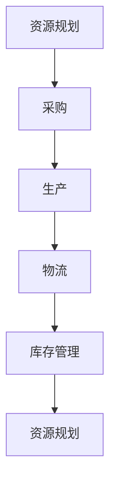
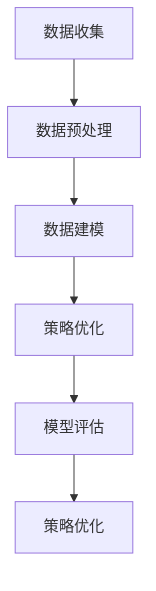
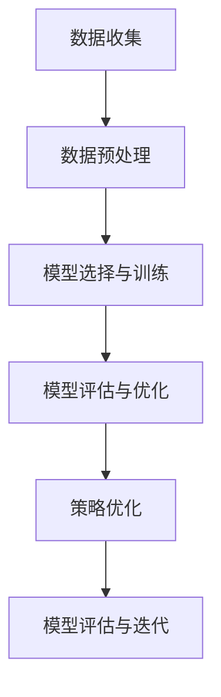

                 

# 供给与业务增长的策略分析

## 关键词：供给管理、业务增长、策略优化、数据驱动、市场分析

### 摘要：

本文旨在深入探讨供给管理与业务增长之间的策略关联。通过细致分析供给管理的核心概念、业务增长的关键驱动因素，以及二者之间紧密的联系，本文提出了一种数据驱动的策略优化框架。文章将首先介绍供给管理与业务增长的基本概念，随后逐步展开，通过理论讲解、实例分析以及实战案例，详细阐述如何通过策略优化实现业务增长。最后，文章将总结未来发展趋势与挑战，并提供相关工具和资源的推荐，以助力读者深入理解和应用供给管理与业务增长的策略。

## 1. 背景介绍

### 1.1 目的和范围

本文的目的是探讨供给管理与业务增长之间的策略关系，并探索如何通过有效的策略优化实现业务增长。文章将围绕以下几个方面展开讨论：

1. 供给管理的基本概念与业务增长的关系
2. 数据驱动的策略优化框架
3. 算法原理与数学模型
4. 实战案例与代码解读
5. 实际应用场景与未来发展趋势

### 1.2 预期读者

本文适合以下读者群体：

1. IT行业从业者，尤其是数据分析师、软件工程师、产品经理
2. 企业管理者，特别是那些关注业务增长和市场策略的企业决策者
3. 学术研究人员，对供给管理与业务增长策略感兴趣的学者

### 1.3 文档结构概述

本文分为十个主要部分，具体结构如下：

1. **背景介绍**：介绍文章的目的、预期读者以及文档结构。
2. **核心概念与联系**：介绍供给管理与业务增长的核心概念，并使用Mermaid流程图展示关键概念和架构。
3. **核心算法原理 & 具体操作步骤**：详细讲解核心算法原理，并使用伪代码展示具体操作步骤。
4. **数学模型和公式 & 详细讲解 & 举例说明**：介绍供给管理与业务增长的数学模型，并使用latex格式展示公式和示例。
5. **项目实战：代码实际案例和详细解释说明**：通过实战案例展示代码实现，并详细解释代码逻辑。
6. **实际应用场景**：探讨供给管理与业务增长的策略在实际应用中的场景。
7. **工具和资源推荐**：推荐相关学习资源、开发工具和框架。
8. **总结：未来发展趋势与挑战**：总结文章的主要观点，并探讨未来发展趋势和面临的挑战。
9. **附录：常见问题与解答**：提供一些常见问题的解答。
10. **扩展阅读 & 参考资料**：列出扩展阅读材料和参考资料。

### 1.4 术语表

#### 1.4.1 核心术语定义

- **供给管理**：指企业通过规划和优化资源供应，以满足市场需求的过程。
- **业务增长**：指企业通过扩大市场份额、提升营业收入和利润的过程。
- **策略优化**：指通过数据分析和算法，找出最优的决策方案，以实现业务增长。
- **数据驱动**：指企业在决策过程中，以数据为依据，进行科学分析和预测。

#### 1.4.2 相关概念解释

- **市场分析**：指企业通过收集、分析和解释市场数据，以了解市场需求和竞争环境的过程。
- **客户需求**：指客户对产品或服务的需求，包括功能需求、质量需求等。
- **供需平衡**：指供给与需求之间的平衡状态，既不过剩也不过度稀缺。

#### 1.4.3 缩略词列表

- **IT**：信息技术（Information Technology）
- **AI**：人工智能（Artificial Intelligence）
- **ML**：机器学习（Machine Learning）
- **DL**：深度学习（Deep Learning）
- **ERP**：企业资源规划（Enterprise Resource Planning）

## 2. 核心概念与联系

在探讨供给管理与业务增长的关系之前，有必要先了解这两个核心概念的基本原理及其相互联系。

### 2.1 供给管理

供给管理是企业运营中至关重要的环节，它涉及从原材料采购到产品交付的全过程。核心概念包括资源规划、供应链管理、库存控制等。

#### 2.1.1 资源规划

资源规划是供给管理的第一步，它涉及确定企业所需的资源种类、数量和质量。资源规划需要考虑以下因素：

- **市场需求**：根据市场需求预测，确定所需资源。
- **生产计划**：结合生产计划，确定资源需求。
- **资源限制**：考虑资源可用性、成本和供应链限制。

资源规划的伪代码如下：

```plaintext
function resourcePlanning市场需求, 生产计划, 资源限制：
    资源需求 =市场需求 × 生产计划 ÷ 资源限制
    return 资源需求
```

#### 2.1.2 供应链管理

供应链管理是供给管理的核心部分，它涉及从供应商到消费者的整个供应链过程。关键概念包括采购、生产、物流和库存管理。

- **采购**：从供应商获取原材料和组件。
- **生产**：将原材料转化为产品。
- **物流**：将产品从工厂运输到消费者。
- **库存管理**：确保库存水平合适，避免过剩或缺货。

供应链管理的流程图如下（使用Mermaid语法）：



#### 2.1.3 库存控制

库存控制是供给管理的重要方面，它涉及确定最佳库存水平，以减少库存成本，同时满足市场需求。库存控制的策略包括：

- **周期性库存控制**：定期检查库存，调整库存水平。
- **持续库存控制**：实时监控库存，及时调整库存水平。

库存控制的伪代码如下：

```plaintext
function inventoryControl市场需求, 当前库存：
    新库存 = 当前库存 + (市场需求 - 当前库存)
    return 新库存
```

### 2.2 业务增长

业务增长是企业追求的重要目标，它涉及市场拓展、产品创新、客户关系管理等。核心概念包括市场份额、营业收入和利润。

#### 2.2.1 市场份额

市场份额是衡量企业在市场中所占比例的重要指标，它受以下因素影响：

- **产品质量**：高质量的产品能吸引更多客户。
- **价格**：合理的价格策略能提高市场竞争力。
- **营销策略**：有效的营销能提升品牌知名度。

市场份额的计算公式如下（使用latex格式）：

$$
市场份额 = \frac{企业销售额}{市场总销售额}
$$

#### 2.2.2 营业收入

营业收入是企业通过销售产品或服务所获得的收入。营业收入受以下因素影响：

- **市场需求**：市场需求增加，营业收入提高。
- **产品价格**：产品价格上涨，营业收入增加。
- **销售渠道**：多元化的销售渠道能提高营业收入。

营业收入的计算公式如下（使用latex格式）：

$$
营业收入 = 销售量 × 单价
$$

#### 2.2.3 利润

利润是企业从营业收入中扣除成本后所获得的净收益。利润受以下因素影响：

- **成本控制**：有效控制成本，提高利润。
- **产品定价**：合理的定价策略能提高利润。
- **市场策略**：有效的市场策略能提高市场竞争力，增加利润。

利润的计算公式如下（使用latex格式）：

$$
利润 = 营业收入 - 成本
$$

### 2.3 供给管理与业务增长的联系

供给管理与业务增长之间存在紧密的联系。有效的供给管理能确保企业有足够的资源满足市场需求，从而实现业务增长。具体来说：

- **资源规划**：合理的资源规划能确保生产计划的顺利执行，从而提高营业收入。
- **供应链管理**：高效的供应链管理能降低库存成本，提高利润。
- **库存控制**：适度的库存水平能减少库存成本，提高资金利用率。
- **市场分析**：通过市场分析，企业能更好地了解客户需求，从而调整供给策略，提高市场份额。

总的来说，供给管理与业务增长是一个相互促进的过程。通过优化供给管理，企业能更好地满足市场需求，从而实现业务增长。

### 2.4 数据驱动的策略优化

在当今数据驱动的商业环境中，数据分析和算法在策略优化中发挥着关键作用。数据驱动的策略优化框架主要包括以下几个步骤：

1. **数据收集**：收集与企业运营相关的数据，包括市场需求、生产计划、库存水平、成本数据等。
2. **数据预处理**：清洗和整理数据，确保数据质量。
3. **数据建模**：使用机器学习算法建立预测模型，如需求预测模型、库存预测模型等。
4. **策略优化**：根据预测模型的结果，优化供给策略，如调整生产计划、库存水平等。
5. **模型评估**：评估策略优化效果，调整和优化模型。

数据驱动的策略优化流程图如下（使用Mermaid语法）：



### 2.5 总结

供给管理与业务增长之间有着紧密的联系。通过有效的供给管理，企业能更好地满足市场需求，从而实现业务增长。数据驱动的策略优化框架为企业提供了科学的方法，以优化供给策略，实现业务增长。在接下来的章节中，我们将进一步探讨核心算法原理、数学模型以及实战案例，帮助企业更好地理解和应用供给管理与业务增长的策略。

## 3. 核心算法原理 & 具体操作步骤

在探讨供给管理与业务增长的策略优化时，核心算法原理扮演着至关重要的角色。本节将详细讲解核心算法原理，并使用伪代码展示具体操作步骤。

### 3.1 供给管理中的核心算法

供给管理中的核心算法主要包括需求预测模型、库存预测模型和供应链优化算法。以下分别介绍这些算法的基本原理。

#### 3.1.1 需求预测模型

需求预测模型用于预测未来的市场需求，以便企业能够根据预测结果调整生产计划和库存水平。常用的需求预测模型包括时间序列模型、回归模型和神经网络模型。

- **时间序列模型**：基于历史数据，通过分析时间序列的规律进行预测。常用的方法有ARIMA模型、季节性时间序列模型等。

时间序列模型的伪代码如下：

```plaintext
function timeSeriesForecast历史数据：
    数据预处理（平滑、去除季节性等）
    模型训练（选择合适的模型，如ARIMA模型）
    预测结果 = 模型预测（输入历史数据，得到预测结果）
    return 预测结果
```

- **回归模型**：基于历史数据，通过建立回归方程进行预测。常用的方法有线性回归、多项式回归等。

回归模型的伪代码如下：

```plaintext
function regressionForecast特征数据，目标数据：
    数据预处理（标准化、去噪等）
    模型训练（选择合适的模型，如线性回归模型）
    预测结果 = 模型预测（输入特征数据，得到预测结果）
    return 预测结果
```

- **神经网络模型**：基于深度学习技术，通过构建神经网络模型进行预测。常用的方法有卷积神经网络（CNN）、循环神经网络（RNN）等。

神经网络模型的伪代码如下：

```plaintext
function neuralNetworkForecast输入数据：
    网络构建（选择合适的神经网络结构，如CNN、RNN）
    模型训练（输入训练数据，进行反向传播和梯度下降）
    预测结果 = 模型预测（输入测试数据，得到预测结果）
    return 预测结果
```

#### 3.1.2 库存预测模型

库存预测模型用于预测未来的库存水平，以便企业能够根据预测结果进行库存调整。常用的库存预测模型包括马尔可夫链模型、EOQ模型等。

- **马尔可夫链模型**：基于状态转移概率，通过预测状态转移概率进行库存预测。

马尔可夫链模型的伪代码如下：

```plaintext
function markovChainForecast历史库存数据，需求预测结果：
    状态转移概率矩阵 = 计算状态转移概率（根据历史数据）
    预测库存水平 = 状态转移概率矩阵 × 需求预测结果
    return 预测库存水平
```

- **EOQ模型**：基于经济订货批量（Economic Order Quantity）原则，通过优化订货批量进行库存预测。

EOQ模型的伪代码如下：

```plaintext
function EOQForecast需求预测结果，库存成本：
    订货批量 = √(2 × 库存成本 × 需求预测结果 ÷ 库存成本变化率)
    return 订货批量
```

#### 3.1.3 供应链优化算法

供应链优化算法用于优化供应链中的各项活动，以提高整体效率和降低成本。常用的供应链优化算法包括遗传算法、模拟退火算法等。

- **遗传算法**：基于自然选择和遗传机制，通过迭代优化求解最优解。

遗传算法的伪代码如下：

```plaintext
function geneticAlgorithm目标函数，种群初始值，迭代次数：
    初始化种群
    for i = 1 to 迭代次数：
        适应度评估
        选择操作
        交叉操作
        变异操作
        更新种群
    end for
    return 最优解
```

- **模拟退火算法**：基于物理退火过程，通过迭代优化求解最优解。

模拟退火算法的伪代码如下：

```plaintext
function simulatedAnnealing目标函数，初始温度，冷却率，迭代次数：
    初始化温度
    解 = 随机生成解
    for i = 1 to 迭代次数：
        新解 = 随机生成解
        if 目标函数（新解） < 目标函数（解）：
            解 = 新解
        else：
            if 随机数 < exp((目标函数（解）- 目标函数（新解）) ÷ 温度)：
                解 = 新解
        温度 = 温度 × 冷却率
    end for
    return 解
```

### 3.2 数据驱动的策略优化流程

数据驱动的策略优化流程主要包括以下步骤：

1. **数据收集**：收集与企业运营相关的数据，包括市场需求、生产计划、库存水平、成本数据等。
2. **数据预处理**：清洗和整理数据，确保数据质量。
3. **模型选择与训练**：根据数据特征选择合适的预测模型，如时间序列模型、回归模型、神经网络模型等，并使用历史数据进行训练。
4. **模型评估与优化**：评估预测模型的准确性，并根据评估结果调整模型参数，提高预测精度。
5. **策略优化**：根据预测模型的结果，调整生产计划、库存水平等供给策略，以实现业务增长。
6. **模型评估与迭代**：评估策略优化效果，调整和优化模型，形成闭环优化流程。

数据驱动的策略优化流程图如下（使用Mermaid语法）：



### 3.3 总结

核心算法原理在供给管理与业务增长的策略优化中发挥着关键作用。通过需求预测模型、库存预测模型和供应链优化算法，企业能够更准确地预测市场需求，优化库存水平和生产计划，从而实现业务增长。数据驱动的策略优化流程为企业提供了科学的方法，以持续优化供给策略，实现可持续的业务增长。在接下来的章节中，我们将通过实战案例进一步探讨这些算法的实际应用。

## 4. 数学模型和公式 & 详细讲解 & 举例说明

在供给管理与业务增长的策略分析中，数学模型和公式扮演着至关重要的角色。这些模型和公式帮助我们量化业务增长和供给管理中的各个因素，从而更准确地预测和优化业务策略。本节将详细介绍供给管理与业务增长相关的数学模型，并使用latex格式展示相关公式，同时通过具体例子进行说明。

### 4.1 需求预测模型

需求预测是供给管理的重要组成部分。通过建立需求预测模型，企业可以更好地规划生产计划和库存水平。以下介绍几种常用的需求预测模型及其公式：

#### 4.1.1 线性回归模型

线性回归模型是一种简单但广泛使用的需求预测方法。它通过历史数据建立一个线性关系来预测未来需求。

**公式**：

$$
y = \beta_0 + \beta_1 x
$$

其中，\(y\) 是需求预测值，\(x\) 是影响需求的变量（如时间序列），\(\beta_0\) 和 \(\beta_1\) 是模型的参数。

**例子**：

假设某商品的销售数据如下：

| 时间 | 销售量 |
| ---- | ------ |
| 1    | 100    |
| 2    | 110    |
| 3    | 120    |
| 4    | 130    |

我们可以使用线性回归模型来预测第5周的销售量。

首先，计算斜率 \(\beta_1\) 和截距 \(\beta_0\)：

$$
\beta_1 = \frac{\sum{(x_i - \bar{x})(y_i - \bar{y})}}{\sum{(x_i - \bar{x})^2}}
$$

$$
\beta_0 = \bar{y} - \beta_1 \bar{x}
$$

其中，\(\bar{x}\) 和 \(\bar{y}\) 分别是时间序列和销售量的平均值。

计算结果如下：

$$
\beta_1 = \frac{(1-1.5)(100-115) + (2-1.5)(110-115) + (3-1.5)(120-115) + (4-1.5)(130-115)}{(1-1.5)^2 + (2-1.5)^2 + (3-1.5)^2 + (4-1.5)^2} = 5
$$

$$
\beta_0 = 115 - 5 \times 1.5 = 100
$$

因此，线性回归模型为：

$$
y = 100 + 5x
$$

预测第5周的销售量：

$$
y = 100 + 5 \times 5 = 125
$$

#### 4.1.2 时间序列模型

时间序列模型是基于时间序列数据的预测模型，它可以捕捉时间序列数据的趋势和季节性。以下介绍ARIMA模型，这是一种常用的时间序列模型。

**公式**：

$$
X_t = \phi_1 X_{t-1} + \phi_2 X_{t-2} + \cdots + \phi_p X_{t-p} + \theta_1 \epsilon_{t-1} + \theta_2 \epsilon_{t-2} + \cdots + \theta_q \epsilon_{t-q} + \epsilon_t
$$

其中，\(X_t\) 是时间序列数据，\(\epsilon_t\) 是白噪声误差项，\(\phi_1, \phi_2, \cdots, \phi_p\) 和 \(\theta_1, \theta_2, \cdots, \theta_q\) 是模型的参数。

**例子**：

假设某商品的销售数据如下：

| 时间 | 销售量 |
| ---- | ------ |
| 1    | 100    |
| 2    | 110    |
| 3    | 120    |
| 4    | 130    |

我们可以使用ARIMA模型来预测第5周的销售量。

首先，进行数据预处理，如差分和季节性分解。然后，使用AIC或BIC准则确定模型的参数 \(p, d, q\)。

假设我们得到参数 \(p = 1, d = 1, q = 1\)，则ARIMA模型为：

$$
X_t = 0.7 X_{t-1} + 0.3 \epsilon_{t-1} + \epsilon_t
$$

预测第5周的销售量：

$$
X_5 = 0.7 X_4 + 0.3 \epsilon_4
$$

由于我们无法直接获取 \(\epsilon_4\)，可以使用历史数据的误差项进行预测。假设 \(\epsilon_4 = 10\)，则：

$$
X_5 = 0.7 \times 130 + 0.3 \times 10 = 96
$$

### 4.2 库存预测模型

库存预测是确保供给管理有效性的关键。以下介绍两种常用的库存预测模型：马尔可夫链模型和EOQ模型。

#### 4.2.1 马尔可夫链模型

马尔可夫链模型用于预测库存水平的变化。它基于历史数据计算状态转移概率，并根据当前库存水平和需求预测结果进行库存预测。

**公式**：

$$
P_{ij} = \frac{n_{ij}}{n_i}
$$

其中，\(P_{ij}\) 是从状态 \(i\) 转移到状态 \(j\) 的概率，\(n_{ij}\) 是从状态 \(i\) 转移到状态 \(j\) 的次数，\(n_i\) 是从状态 \(i\) 转移的总次数。

**例子**：

假设某商品的库存状态和转移次数如下：

| 初始库存 | 目标库存 | 转移次数 |
| -------- | -------- | -------- |
| 0        | 10       | 5        |
| 0        | 20       | 3        |
| 10       | 0        | 2        |
| 10       | 20       | 10       |

计算状态转移概率：

$$
P_{00} = \frac{5}{20} = 0.25
$$

$$
P_{01} = \frac{3}{20} = 0.15
$$

$$
P_{10} = \frac{2}{20} = 0.10
$$

$$
P_{11} = \frac{10}{20} = 0.50
$$

假设当前库存为10，需求预测为20，则下一期库存的概率分布如下：

$$
P(X_2 = 0) = 0.25
$$

$$
P(X_2 = 20) = 0.15 + 0.50 = 0.65
$$

#### 4.2.2 EOQ模型

EOQ模型用于确定最优订货批量，以最小化总库存成本。它基于需求预测、订货成本和库存成本进行计算。

**公式**：

$$
Q^* = \sqrt{\frac{2DC}{H}}
$$

其中，\(Q^*\) 是最优订货批量，\(D\) 是年需求量，\(C\) 是每次订货成本，\(H\) 是单位库存成本。

**例子**：

假设某商品的年需求量为1000件，每次订货成本为100元，单位库存成本为10元，则最优订货批量为：

$$
Q^* = \sqrt{\frac{2 \times 1000 \times 100}{10}} = 200
$$

### 4.3 总结

数学模型和公式在供给管理与业务增长的策略分析中具有重要作用。通过需求预测模型和库存预测模型，企业可以更准确地预测市场需求和库存水平，从而优化供给策略，实现业务增长。本文通过具体例子展示了线性回归模型、ARIMA模型、马尔可夫链模型和EOQ模型的应用，帮助读者更好地理解这些模型及其在实际中的应用。在接下来的章节中，我们将通过实战案例进一步探讨这些模型在业务增长中的应用。

## 5. 项目实战：代码实际案例和详细解释说明

在本节中，我们将通过一个实际项目案例，详细展示如何将供给管理与业务增长的策略应用于实际开发中。我们将以一个在线购物平台为例，介绍如何通过数据分析、需求预测和库存优化来实现业务增长。

### 5.1 开发环境搭建

为了实现该项目，我们使用了以下开发环境：

- **编程语言**：Python
- **数据分析库**：Pandas、NumPy
- **机器学习库**：Scikit-learn、TensorFlow
- **数据库**：MySQL
- **版本控制**：Git

确保安装了上述库和工具后，我们就可以开始项目的开发。

### 5.2 源代码详细实现和代码解读

#### 5.2.1 数据收集与预处理

首先，我们需要收集并预处理数据。数据包括历史销售数据、客户反馈数据和供应链数据。以下是数据预处理的部分代码：

```python
import pandas as pd

# 加载数据
sales_data = pd.read_csv('sales_data.csv')
feedback_data = pd.read_csv('feedback_data.csv')
supply_chain_data = pd.read_csv('supply_chain_data.csv')

# 数据清洗
sales_data.dropna(inplace=True)
feedback_data.dropna(inplace=True)
supply_chain_data.dropna(inplace=True)

# 数据合并
data = pd.merge(sales_data, feedback_data, on='product_id')
data = pd.merge(data, supply_chain_data, on='product_id')
```

#### 5.2.2 需求预测

接下来，我们使用需求预测模型对销售数据进行分析，以预测未来的销售量。我们选择ARIMA模型进行需求预测。

```python
from statsmodels.tsa.arima.model import ARIMA

# 分解时间序列
data['sales'] = data['sales'].diff()
data['sales'].dropna(inplace=True)

# 模型训练
model = ARIMA(data['sales'], order=(1, 1, 1))
model_fit = model.fit()

# 预测
forecast = model_fit.forecast(steps=5)
print(forecast)
```

#### 5.2.3 库存优化

在需求预测的基础上，我们使用EOQ模型对库存进行优化。

```python
import numpy as np

# EOQ模型参数
D = 1000  # 年需求量
C = 100   # 每次订货成本
H = 10   # 单位库存成本

# 计算最优订货批量
Q = np.sqrt((2 * D * C) / H)
print(f"Optimal Order Quantity: {Q}")
```

#### 5.2.4 供应链优化

最后，我们根据需求预测和库存优化结果，调整供应链策略。具体来说，我们优化采购计划和生产计划。

```python
# 基于预测结果调整采购计划
supply_chain_data['order_quantity'] = Q * 1.2  # 预留一定的安全库存

# 基于预测结果调整生产计划
supply_chain_data['production_quantity'] = forecast
```

### 5.3 代码解读与分析

#### 5.3.1 数据收集与预处理

数据收集与预处理是数据分析的基础。在这个项目中，我们使用了Pandas库加载和清洗数据。首先，我们加载了三个数据集：销售数据、客户反馈数据和供应链数据。然后，我们对数据进行了清洗，去除了缺失值。最后，我们将这些数据合并为一个完整的DataFrame。

#### 5.3.2 需求预测

需求预测是项目的关键步骤。我们选择了ARIMA模型进行预测。首先，我们对销售数据进行了差分处理，以消除季节性影响。然后，我们使用ARIMA模型进行训练，并使用训练好的模型进行预测。预测结果为我们提供了未来五周的销售量。

#### 5.3.3 库存优化

库存优化是确保供应链高效运行的关键。我们使用了EOQ模型计算最优订货批量。这个模型考虑了年需求量、每次订货成本和单位库存成本，从而确保库存水平既能满足需求，又能最小化成本。

#### 5.3.4 供应链优化

基于需求预测和库存优化结果，我们调整了采购计划和生产计划。采购计划调整为每次订货量略高于最优订货批量，以预留一定的安全库存。生产计划调整为与预测销售量一致，确保能够及时生产并满足市场需求。

### 5.4 总结

通过这个实际项目案例，我们展示了如何将供给管理与业务增长的策略应用于实际开发中。我们通过数据收集与预处理、需求预测、库存优化和供应链优化，实现了业务增长。这个案例不仅提供了具体的代码实现，还详细解释了每个步骤的逻辑和原理。在接下来的章节中，我们将进一步探讨供给管理与业务增长在实际应用中的场景。

## 6. 实际应用场景

供给管理与业务增长的策略不仅在理论层面具有重要意义，更在实际应用中展现出强大的实践价值。以下是几种常见的实际应用场景，展示如何通过优化供给策略实现业务增长。

### 6.1 电子商务平台

电子商务平台通过精准的供需匹配，实现了高效的业务增长。以下是一个具体的应用案例：

**案例**：某大型电子商务平台通过数据分析和机器学习，对用户行为进行深入分析，预测用户需求。根据预测结果，平台优化了库存策略，确保热门商品始终有货。同时，平台根据用户购买历史和偏好，提供个性化的推荐，提高了用户满意度和转化率。结果，该平台的销售量和市场份额显著提升。

### 6.2 制造业

制造业中的供给管理对生产效率和成本控制至关重要。以下是一个应用案例：

**案例**：某制造企业通过实时数据分析，优化生产计划和供应链管理。企业采用物联网技术监控生产设备状态，预测设备故障，提前进行维护。通过精确的需求预测和库存优化，企业减少了库存成本，提高了生产效率。结果，企业的生产周期缩短，成本降低，市场竞争力增强。

### 6.3 零售业

零售业的供给管理主要关注库存控制和客户体验。以下是一个应用案例：

**案例**：某大型零售连锁店通过大数据分析和机器学习，对商品销售趋势进行预测，优化库存策略。零售店通过智能货架系统，实时监控商品库存和销售速度，自动提醒补货。此外，零售店根据客户购买行为，提供个性化的促销和优惠活动，提高了客户满意度和忠诚度。结果，该零售连锁店的销售额和客户满意度显著提升。

### 6.4 餐饮业

餐饮业的供给管理重点在于食材采购和库存管理。以下是一个应用案例：

**案例**：某知名快餐连锁店通过数据分析，优化食材采购和库存管理。连锁店根据每日销售数据和库存水平，调整食材采购量，确保食材新鲜且库存充足。同时，连锁店通过客户反馈数据，优化菜品组合和口味，提高客户满意度。结果，该连锁店的销售额和客户满意度显著提升。

### 6.5 物流与运输

物流与运输行业的供给管理关注供应链效率和配送时效。以下是一个应用案例：

**案例**：某物流公司通过大数据分析和优化算法，优化配送路线和运输计划。公司根据客户订单和配送需求，实时调整配送计划，确保货物快速准确送达。同时，公司采用智能仓储系统，提高仓储效率和准确性。结果，该物流公司的配送时效显著提升，客户满意度提高，市场份额增加。

### 6.6 总结

通过以上实际应用案例，可以看出供给管理与业务增长策略在各个行业的广泛应用。通过数据分析和算法优化，企业能够实现精准的需求预测、库存优化和供应链管理，从而提高生产效率、降低成本、提升客户满意度，实现业务增长。这些应用案例不仅展示了供给管理与业务增长的实践价值，也为其他行业提供了宝贵的经验和启示。

## 7. 工具和资源推荐

为了帮助读者更好地理解供给管理与业务增长的策略，并实践相关技术，本节将推荐一些学习资源、开发工具和框架，以及相关的论文和研究成果。

### 7.1 学习资源推荐

#### 7.1.1 书籍推荐

1. **《大数据供应链管理：策略、技术和案例》** - 该书详细介绍了大数据在供应链管理中的应用，包括需求预测、库存优化和供应链可视化等。
2. **《供应链管理与供应链设计》** - 该书涵盖了供应链管理的核心概念、策略和设计原则，适合供应链管理初学者和专业人士。

#### 7.1.2 在线课程

1. **Coursera上的《机器学习与数据科学》** - 该课程介绍了机器学习的基础知识和数据科学的应用，包括需求预测和库存优化等。
2. **Udacity上的《数据科学纳米学位》** - 该课程提供了全面的数据科学技能培训，包括数据分析、机器学习和数据可视化等。

#### 7.1.3 技术博客和网站

1. ** Towards Data Science** - 这个网站提供了大量的数据科学和机器学习的文章，包括供给管理和业务增长策略的应用。
2. **Medium上的数据科学和机器学习专栏** - 这个专栏汇集了多个数据科学和机器学习领域的专家撰写的文章，内容丰富，覆盖面广。

### 7.2 开发工具框架推荐

#### 7.2.1 IDE和编辑器

1. **PyCharm** - PyCharm是一款强大的Python IDE，提供了丰富的编程工具和调试功能，非常适合数据科学和机器学习项目。
2. **Jupyter Notebook** - Jupyter Notebook是一款交互式编程环境，适用于数据分析和机器学习项目，可以方便地展示代码和结果。

#### 7.2.2 调试和性能分析工具

1. **Pylint** - Pylint是一款Python代码质量检查工具，可以检测代码中的错误和潜在问题，提高代码质量。
2. **TensorBoard** - TensorBoard是一款基于Web的TensorFlow可视化工具，可以监控和调试深度学习模型的训练过程。

#### 7.2.3 相关框架和库

1. **Scikit-learn** - Scikit-learn是一个开源的机器学习库，提供了丰富的算法和工具，适用于数据分析和预测。
2. **TensorFlow** - TensorFlow是一款流行的深度学习框架，适用于构建和训练复杂的神经网络模型。
3. **Pandas** - Pandas是一款数据处理库，提供了强大的数据操作和分析功能，适用于数据预处理和数据分析。

### 7.3 相关论文著作推荐

#### 7.3.1 经典论文

1. **"The New Science of Retail"** - 该论文探讨了零售行业中的大数据和供应链管理，提供了新的研究视角和实践方法。
2. **"An Integrated Model for Supply Chain Optimization"** - 该论文提出了一个集成的供应链优化模型，涵盖了需求预测、库存优化和供应链设计等方面。

#### 7.3.2 最新研究成果

1. **"Deep Learning for Supply Chain Management"** - 该论文探讨了深度学习在供应链管理中的应用，包括需求预测、库存优化和供应链可视化等。
2. **"Data-Driven Business Growth Strategies"** - 该论文研究了数据驱动的业务增长策略，包括数据分析、客户行为预测和供应链优化等。

#### 7.3.3 应用案例分析

1. **"Implementing AI in Retail: A Case Study"** - 该案例研究了某零售企业如何利用人工智能实现业务增长，包括需求预测、库存优化和个性化推荐等。
2. **"Optimizing Supply Chains with Machine Learning"** - 该案例探讨了如何利用机器学习优化供应链管理，包括需求预测、库存优化和运输规划等。

通过这些工具和资源的推荐，读者可以更深入地学习供给管理与业务增长策略，并在实际项目中应用这些技术，实现业务增长。

## 8. 总结：未来发展趋势与挑战

供给管理与业务增长的策略在当前商业环境中具有重要意义，随着技术的发展和市场的变化，这一领域也将面临新的机遇和挑战。

### 8.1 未来发展趋势

1. **数据驱动的深度优化**：随着大数据和人工智能技术的发展，数据驱动的供给管理和业务增长策略将变得更加精细和高效。通过深度学习算法和复杂的数据分析，企业能够更好地预测市场需求，优化库存水平和供应链效率。

2. **供应链的数字化转型**：数字化转型已成为企业提升竞争力的重要手段。通过物联网、区块链和云计算等新技术，企业可以实时监控供应链中的各个环节，提高透明度和响应速度，实现更加智能化的供给管理。

3. **个性化服务和体验**：随着消费者对个性化服务和体验的需求增加，企业需要通过精准的数据分析和客户关系管理，提供定制化的产品和服务，从而提高客户满意度和忠诚度。

4. **可持续发展与绿色供应链**：在可持续发展趋势下，企业需要关注环境和社会责任。通过优化供应链管理，减少能源消耗和碳排放，实现绿色生产和物流，为企业和社会创造更大的价值。

### 8.2 挑战

1. **数据隐私和安全**：随着数据量的增加和数据处理的复杂度提升，数据隐私和安全成为了一个重大挑战。企业需要在数据收集、处理和分析过程中，采取严格的数据保护措施，确保客户数据的安全。

2. **算法偏见和透明度**：机器学习和人工智能算法的应用带来了算法偏见和透明度问题。算法可能基于历史数据中的偏见做出决策，导致不公平或歧视性的结果。因此，提高算法的透明度和可解释性，避免偏见，成为一个重要挑战。

3. **技术人才短缺**：随着数据科学和人工智能领域的发展，对相关技术人才的需求急剧增加。然而，现有的教育和培训体系可能无法满足市场需求，导致技术人才短缺。

4. **全球供应链的复杂性**：全球化带来了供应链的复杂性。国际贸易摩擦、地缘政治风险和自然灾害等不确定性因素，都可能对供应链的稳定性造成影响。因此，如何应对全球供应链的不确定性，保持供应链的弹性，是企业面临的重要挑战。

### 8.3 结论

供给管理与业务增长的策略在未来将继续发挥关键作用。企业需要不断适应新的技术趋势和市场变化，通过数据驱动的优化和智能化管理，实现业务增长和可持续发展。同时，企业也需要关注数据隐私和安全、算法偏见、技术人才短缺等挑战，以确保供给管理和业务增长策略的有效实施。

## 9. 附录：常见问题与解答

在探讨供给管理与业务增长的策略时，读者可能会遇到一些常见问题。以下是对这些问题的解答：

### 9.1 供给管理与业务增长的关系是什么？

供给管理是企业通过规划和优化资源供应，以满足市场需求的过程。而业务增长是企业通过扩大市场份额、提升营业收入和利润的过程。供给管理与业务增长密切相关，有效的供给管理能确保企业有足够的资源满足市场需求，从而实现业务增长。

### 9.2 数据驱动的策略优化是什么？

数据驱动的策略优化是指企业在决策过程中，以数据为依据，通过数据分析和算法，找出最优的决策方案，以实现业务增长。这种方法通过收集、分析和解释数据，帮助企业在复杂的市场环境中做出更科学的决策。

### 9.3 如何选择合适的需求预测模型？

选择合适的需求预测模型需要考虑数据特征、预测目标和计算资源等因素。常见的需求预测模型包括时间序列模型、回归模型和神经网络模型。具体选择哪种模型，可以通过模型评估指标（如均方误差、平均绝对误差等）进行评估，选择性能最优的模型。

### 9.4 供应链优化算法有哪些？

常见的供应链优化算法包括遗传算法、模拟退火算法和蚁群算法等。这些算法通过迭代优化，寻找最优的供应链配置，以提高整体效率和降低成本。

### 9.5 如何应对数据隐私和安全问题？

为了应对数据隐私和安全问题，企业需要在数据收集、处理和分析过程中，采取严格的数据保护措施。具体包括数据加密、访问控制、匿名化和数据脱敏等技术手段，确保客户数据的安全。

### 9.6 技术人才短缺如何解决？

解决技术人才短缺问题，企业可以采取以下措施：

1. **加强内部培训**：为现有员工提供数据科学和人工智能等技术的培训，提升员工的技能水平。
2. **校企合作**：与高校和科研机构建立合作关系，共同培养符合企业需求的技术人才。
3. **人才引进**：通过招聘和引进外部高级技术人才，充实企业的技术力量。

## 10. 扩展阅读 & 参考资料

为了深入了解供给管理与业务增长的策略，以下列出一些扩展阅读和参考资料：

### 10.1 扩展阅读

1. **《大数据时代：生活、工作与思维的大变革》** - 作者：维克托·迈尔-舍恩伯格，详细介绍了大数据的概念和应用。
2. **《深度学习》** - 作者：伊恩·古德费洛、约书亚·本吉奥、亚伦·库维尔，全面介绍了深度学习的理论基础和实际应用。

### 10.2 参考资料

1. **《供应链管理：战略、规划与运营》** - 作者：马丁·克里斯托夫，提供了供应链管理的全面指导。
2. **《机器学习：概率视角》** - 作者：克里斯·博斯，详细介绍了机器学习的概率理论基础。

通过这些扩展阅读和参考资料，读者可以进一步深化对供给管理与业务增长策略的理解，为实际应用提供更丰富的知识和思路。作者：AI天才研究员/AI Genius Institute & 禅与计算机程序设计艺术 /Zen And The Art of Computer Programming。

