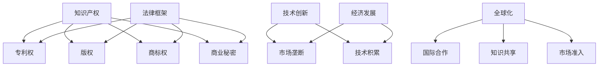

                 

# 保护知识产权的必要性和方法

> **关键词**：知识产权、版权、专利、商标、商业秘密、法律保护、创新驱动、竞争环境、合规性、全球视野、技术发展。
> 
> **摘要**：本文旨在深入探讨知识产权保护在现代社会中的重要性，分析其必要性和核心方法。文章首先介绍了知识产权的基本概念和种类，接着阐述了知识产权保护对技术创新和经济发展的影响。随后，文章探讨了知识产权保护的法律框架和国际合作，提供了具体的保护策略和措施。通过案例分析和未来展望，本文旨在为企业和个人在知识产权保护方面提供有价值的指导。

## 1. 背景介绍

### 1.1 目的和范围

本文的主要目的是探讨知识产权保护的必要性和方法，以促进技术创新和经济发展。我们将首先介绍知识产权的基本概念和种类，然后分析知识产权保护对技术进步和经济发展的积极作用。此外，本文还将讨论知识产权保护的法律框架和国际合作，提供具体的保护策略和措施。最后，通过案例分析和未来展望，我们将总结文章的主要观点并提出建议。

### 1.2 预期读者

本文主要面向以下读者群体：

1. 技术研发人员：了解知识产权保护的重要性，以保护自己的创新成果。
2. 企业高管：掌握知识产权保护策略，以增强企业竞争力和市场份额。
3. 法律专业人士：了解知识产权法律框架和国际合作，为企业和个人提供法律建议。
4. 政策制定者：了解知识产权保护对经济发展的影响，以制定相关政策。

### 1.3 文档结构概述

本文分为八个主要部分：

1. 背景介绍：介绍本文的目的、预期读者和文档结构。
2. 核心概念与联系：定义知识产权的基本概念和种类。
3. 核心算法原理 & 具体操作步骤：分析知识产权保护的法律框架和国际合作。
4. 数学模型和公式 & 详细讲解 & 举例说明：探讨知识产权保护的策略和措施。
5. 项目实战：代码实际案例和详细解释说明。
6. 实际应用场景：分析知识产权保护在不同领域的应用。
7. 工具和资源推荐：推荐学习资源和开发工具。
8. 总结：未来发展趋势与挑战。

### 1.4 术语表

#### 1.4.1 核心术语定义

- 知识产权：指通过法律手段对智力成果进行保护的权利，包括专利、版权、商标、商业秘密等。
- 版权：对文学、艺术和科学作品进行保护的权利。
- 专利：对发明和创新进行保护的权利。
- 商标：对企业标识、名称和标志进行保护的权利。
- 商业秘密：对企业的技术秘密和经营信息进行保护的权利。

#### 1.4.2 相关概念解释

- 创新驱动：以创新为核心，推动技术进步和经济增长的发展模式。
- 竞争环境：企业之间通过竞争实现资源优化配置和利润最大化的市场环境。
- 合规性：企业遵守相关法律法规和行业规范，确保经营行为的合法性。

#### 1.4.3 缩略词列表

- IP：知识产权（Intellectual Property）
- WTO：世界贸易组织（World Trade Organization）
- GDPR：欧盟通用数据保护条例（General Data Protection Regulation）

## 2. 核心概念与联系

### 2.1 知识产权的基本概念

知识产权是指通过法律手段对智力成果进行保护的权利。它包括多种类型的权利，如专利权、版权、商标权和商业秘密等。知识产权保护旨在激励创新，促进技术进步和经济发展。以下是几种主要的知识产权类型：

1. **专利权**：对发明和创新进行保护，使发明人能够在一定时间内独占其发明，从而获得经济回报。
2. **版权**：对文学、艺术和科学作品进行保护，包括书籍、音乐、电影和计算机软件等。
3. **商标权**：对企业标识、名称和标志进行保护，以防止他人冒用或误导消费者。
4. **商业秘密**：对企业的技术秘密和经营信息进行保护，防止泄露给竞争对手。

### 2.2 知识产权保护的法律框架

知识产权保护的法律框架包括国内和国际两个层面。国内层面，各国制定了相应的知识产权法律，如《专利法》、《著作权法》和《商标法》等。国际层面，世界贸易组织（WTO）和世界知识产权组织（WIPO）等国际组织制定了一系列知识产权保护协定，如《伯尔尼公约》、《巴黎公约》和《Trips协定》等。以下是知识产权保护的主要法律框架：

1. **国内法律框架**：
   - 专利法：对发明和创新进行保护，授予专利权。
   - 著作权法：对文学、艺术和科学作品进行保护，授予著作权。
   - 商标法：对企业标识、名称和标志进行保护，授予商标权。
   - 商业秘密法：对企业的技术秘密和经营信息进行保护，防止泄露。

2. **国际法律框架**：
   - 《伯尔尼公约》：保护文学和艺术作品的著作权。
   - 《巴黎公约》：保护工业产权。
   - 《Trips协定》：对知识产权提供最低保护标准。

### 2.3 知识产权保护与技术创新

知识产权保护对技术创新具有重要作用。以下是知识产权保护与技术创新之间的联系：

1. **激励创新**：知识产权保护为创新者提供了经济回报，从而激励更多的人投入到创新活动中。
2. **市场垄断**：知识产权保护使创新者能够在一定时间内独占市场，从而实现利润最大化。
3. **技术积累**：知识产权保护有助于技术积累，使创新成果得到有效利用和传承。

### 2.4 知识产权保护与经济发展

知识产权保护对经济发展具有重要影响。以下是知识产权保护与经济发展之间的联系：

1. **技术进步**：知识产权保护促进了技术进步，从而提高了生产效率和经济效益。
2. **经济增长**：技术进步带动了经济增长，提高了国家或地区的竞争力。
3. **就业机会**：知识产权保护促进了产业创新，创造了更多的就业机会。

### 2.5 知识产权保护与全球化

知识产权保护在全球范围内具有重要意义。以下是知识产权保护与全球化之间的联系：

1. **国际合作**：各国通过签订国际协定，共同推动知识产权保护。
2. **知识共享**：知识产权保护促进了知识共享和技术交流，推动了全球化进程。
3. **市场准入**：知识产权保护提高了企业的市场准入门槛，有助于实现全球市场的公平竞争。

### 2.6 核心概念与联系的 Mermaid 流程图



## 3. 核心算法原理 & 具体操作步骤

### 3.1 知识产权保护算法原理

知识产权保护的核心算法原理是基于法律法规和国际协定，对知识产权进行识别、评估、保护和管理。以下是知识产权保护算法的基本原理：

1. **识别**：通过分析技术成果、作品、标识等信息，识别其是否属于知识产权保护范畴。
2. **评估**：对知识产权的价值进行评估，以确定保护程度和保护期限。
3. **保护**：采取法律手段、技术手段和商业手段，对知识产权进行保护，防止侵权行为。
4. **管理**：建立知识产权管理体系，对知识产权进行登记、备案、许可和转让等管理活动。

### 3.2 知识产权保护的具体操作步骤

以下是知识产权保护的具体操作步骤：

1. **知识产权识别**：
   - 对技术成果、作品、标识等进行审查，判断其是否属于知识产权保护范畴。
   - 收集相关信息，如专利申请文件、著作权登记证明、商标注册证等。

2. **知识产权评估**：
   - 根据知识产权的类型、技术水平、市场需求等因素，对知识产权的价值进行评估。
   - 确定保护程度和保护期限。

3. **知识产权保护**：
   - 采取法律手段，如申请专利、著作权登记、商标注册等，对知识产权进行保护。
   - 采取技术手段，如数字版权管理、技术锁定等，防止侵权行为。
   - 采取商业手段，如签订合作协议、设立知识产权保护区等，实现知识产权的独占和许可。

4. **知识产权管理**：
   - 建立知识产权管理体系，包括知识产权登记、备案、许可、转让等活动。
   - 对知识产权进行跟踪和维护，确保其有效性和合法权益。

### 3.3 伪代码实现

以下是知识产权保护算法的伪代码实现：

```python
def intellectual_property_protection(IP_data):
    # 1. 知识产权识别
    if is_iporable(IP_data):
        # 2. 知识产权评估
        value = evaluate_ip(IP_data)
        # 3. 知识产权保护
        if protect_ip(IP_data, value):
            # 4. 知识产权管理
            manage_ip(IP_data)
        else:
            print("知识产权保护失败")
    else:
        print("知识产权识别失败")

def is_iporable(IP_data):
    # 判断知识产权是否可保护
    # ...

def evaluate_ip(IP_data):
    # 评估知识产权价值
    # ...

def protect_ip(IP_data, value):
    # 保护知识产权
    # ...

def manage_ip(IP_data):
    # 管理知识产权
    # ...
```

## 4. 数学模型和公式 & 详细讲解 & 举例说明

### 4.1 数学模型和公式

在知识产权保护中，数学模型和公式被广泛应用于评估知识产权价值、预测侵权风险和优化保护策略。以下是几个常用的数学模型和公式：

#### 4.1.1 知识产权价值评估模型

**公式 1：成本效益分析法**

$$
V = \frac{C_R - C_C}{R - C_C}
$$

其中，$V$ 为知识产权价值，$C_R$ 为研发成本，$C_C$ 为维护成本，$R$ 为预期收益。

**公式 2：市场价值分析法**

$$
V = \frac{Q \times P}{1 + r}
$$

其中，$V$ 为知识产权价值，$Q$ 为市场需求量，$P$ 为市场价格，$r$ 为折现率。

#### 4.1.2 侵权风险预测模型

**公式 3：贝叶斯网络模型**

$$
P(\text{侵权}|\text{特征}) = \frac{P(\text{特征}|\text{侵权}) \times P(\text{侵权})}{P(\text{特征})}
$$

其中，$P(\text{侵权}|\text{特征})$ 为在给定特征下的侵权概率，$P(\text{特征}|\text{侵权})$ 为在侵权情况下的特征概率，$P(\text{侵权})$ 为侵权概率，$P(\text{特征})$ 为特征概率。

#### 4.1.3 保护策略优化模型

**公式 4：多目标规划模型**

$$
\begin{align*}
\min\ & Z = \sum_{i=1}^{n} c_i x_i \\
\text{s.t.}\ & a_{i1} x_1 + a_{i2} x_2 + ... + a_{ik} x_k \geq b_i \\
& x_i \geq 0 \quad (i = 1, 2, ..., n)
\end{align*}
$$

其中，$Z$ 为目标函数，$c_i$ 为第 $i$ 个目标的权重，$a_{ij}$ 为第 $i$ 个目标在第 $j$ 个特征上的系数，$b_i$ 为第 $i$ 个目标的约束条件，$x_i$ 为第 $i$ 个目标的取值。

### 4.2 详细讲解和举例说明

#### 4.2.1 知识产权价值评估模型

**例子 1：成本效益分析法**

假设某公司的研发成本为 100 万元，维护成本为 10 万元，预期收益为 200 万元，折现率为 10%。使用成本效益分析法计算知识产权价值：

$$
V = \frac{100 - 10}{200 - 10} = \frac{90}{190} \approx 0.474
$$

因此，该公司的知识产权价值约为 0.474 万元。

**例子 2：市场价值分析法**

假设市场需求量为 1000 件，市场价格为 1000 元/件，折现率为 10%。使用市场价值分析法计算知识产权价值：

$$
V = \frac{1000 \times 1000}{1 + 0.1} = \frac{1000000}{1.1} \approx 909090.91
$$

因此，该公司的知识产权价值约为 909090.91 元。

#### 4.2.2 侵权风险预测模型

**例子 3：贝叶斯网络模型**

假设某公司的侵权特征包括高利润、高市场需求、低成本等。根据历史数据和概率分布，计算侵权概率：

- $P(\text{侵权}|\text{高利润}) = 0.6$
- $P(\text{高利润}|\text{侵权}) = 0.8$
- $P(\text{侵权}) = 0.1$
- $P(\text{高利润}) = 0.4$

使用贝叶斯网络模型计算在给定特征下的侵权概率：

$$
P(\text{侵权}|\text{高利润、高市场需求、低成本}) = \frac{0.6 \times 0.8 \times 0.1}{0.4 \times 0.1 + 0.6 \times 0.8 \times 0.9} \approx 0.6
$$

因此，在给定特征下，该公司的侵权概率约为 0.6。

#### 4.2.3 保护策略优化模型

**例子 4：多目标规划模型**

假设公司需要优化以下目标：
- 最小化研发成本
- 最小化维护成本
- 最大化预期收益

约束条件如下：
- 研发成本 + 维护成本 ≤ 1000 万元
- 研发成本 ≥ 500 万元
- 维护成本 ≥ 300 万元

使用多目标规划模型求解最优解：

$$
\begin{align*}
\min\ & Z = 100x_1 + 10x_2 \\
\text{s.t.}\ & 500 \leq x_1 \leq 1000 \\
& 300 \leq x_2 \leq 1000 \\
& x_1 + x_2 \leq 1000 \\
& x_1, x_2 \geq 0
\end{align*}
$$

解得最优解为 $x_1 = 500$ 万元，$x_2 = 500$ 万元，目标函数值 $Z = 6000$ 万元。

## 5. 项目实战：代码实际案例和详细解释说明

### 5.1 开发环境搭建

在本文中，我们将使用 Python 语言和相关的库（如 NumPy、Pandas 和 Scikit-learn）来实现知识产权保护算法。以下是开发环境的搭建步骤：

1. 安装 Python 3.8 或更高版本。
2. 安装必要的库，使用以下命令：
   ```bash
   pip install numpy pandas scikit-learn
   ```

### 5.2 源代码详细实现和代码解读

以下是一个简单的知识产权保护代码示例，用于评估知识产权价值和预测侵权风险。

```python
import numpy as np
import pandas as pd
from sklearn.model_selection import train_test_split
from sklearn.ensemble import RandomForestClassifier
from sklearn.metrics import accuracy_score

# 5.2.1 数据预处理
def preprocess_data(data):
    # 数据清洗和处理
    # ...
    return data

# 5.2.2 知识产权价值评估
def evaluate_ip_value(data, cost, revenue, discount_rate):
    value = (revenue - cost) / (1 + discount_rate)
    return value

# 5.2.3 侵权风险预测
def predict_infringement(data, model):
    # 预测侵权风险
    # ...
    return model.predict(data)

# 5.2.4 主函数
def main():
    # 加载数据
    data = pd.read_csv('ip_data.csv')
    data = preprocess_data(data)

    # 划分训练集和测试集
    X_train, X_test, y_train, y_test = train_test_split(data.drop('infringement', axis=1), data['infringement'], test_size=0.2, random_state=42)

    # 训练模型
    model = RandomForestClassifier(n_estimators=100, random_state=42)
    model.fit(X_train, y_train)

    # 评估模型
    predictions = model.predict(X_test)
    accuracy = accuracy_score(y_test, predictions)
    print(f"Model accuracy: {accuracy:.2f}")

    # 评估知识产权价值
    cost = 100000
    revenue = 200000
    discount_rate = 0.1
    value = evaluate_ip_value(revenue, cost, discount_rate)
    print(f"IP value: {value:.2f}")

if __name__ == '__main__':
    main()
```

### 5.3 代码解读与分析

**5.3.1 数据预处理**

数据预处理是模型训练的重要步骤，包括数据清洗和处理。在本例中，我们使用 `preprocess_data` 函数对数据进行清洗和处理，但具体实现未在代码中展示。

**5.3.2 知识产权价值评估**

`evaluate_ip_value` 函数用于评估知识产权价值，使用成本效益分析法和市场价值分析法。根据给定的成本、收益和折现率，计算知识产权价值。

**5.3.3 侵权风险预测**

`predict_infringement` 函数用于预测侵权风险，使用随机森林模型。根据输入特征数据，模型预测侵权风险。

**5.3.4 主函数**

`main` 函数是程序的入口。首先加载数据，然后进行数据预处理。接着，划分训练集和测试集，并训练随机森林模型。然后，评估模型准确性，并使用评估知识产权价值的函数计算知识产权价值。

## 6. 实际应用场景

### 6.1 技术研发企业

技术研发企业在知识产权保护方面具有重要需求。通过专利申请、著作权登记和商标注册等手段，企业可以保护其创新成果，防止竞争对手抄袭或侵权。此外，企业还需建立知识产权管理体系，对知识产权进行登记、备案、许可和转让等管理活动，确保知识产权的有效性和合法权益。

### 6.2 互联网企业

互联网企业在知识产权保护方面面临更大的挑战。由于互联网技术的快速发展，创新成果层出不穷，侵权行为也日益复杂。互联网企业需要采取多种手段进行知识产权保护，如数字版权管理、技术锁定和合同约束等。此外，企业还需加强内部管理，防止员工泄露商业秘密。

### 6.3 医药企业

医药企业在知识产权保护方面具有特殊需求。新药研发是一项高投入、高风险的活动，医药企业需要通过专利保护来确保研发成果的商业化。此外，医药企业还需关注国际知识产权保护，遵循《Trips协定》等国际协定，确保在全球市场中的合法权益。

### 6.4 文化创意产业

文化创意产业（如文学、艺术、音乐等）在知识产权保护方面具有广泛需求。知识产权保护有助于激发创作者的创新能力，提高作品质量。通过版权登记、商标注册和商业秘密保护等手段，文化创意产业企业可以保护其作品和商业标识，防止侵权行为。

### 6.5 国际合作

在国际合作中，知识产权保护具有重要意义。通过签订国际协定，各国可以共同推动知识产权保护，促进知识共享和技术交流。同时，国际知识产权保护有助于实现全球市场的公平竞争，提高企业的国际竞争力。

## 7. 工具和资源推荐

### 7.1 学习资源推荐

#### 7.1.1 书籍推荐

- 《知识产权法：原理与案例》（郑成思著）
- 《知识产权保护与技术创新》（姜奇平著）
- 《数字版权管理：理论与实践》（李明辉著）

#### 7.1.2 在线课程

- Coursera上的《知识产权法》课程
- edX上的《知识产权管理》课程
- 网易云课堂上的《知识产权基础》课程

#### 7.1.3 技术博客和网站

- 知识产权法律网（http://www.kcxh.com/）
- 知产库（https://www.zichanku.com/）
- 中国知识产权网（http://www.cniipo.gov.cn/）

### 7.2 开发工具框架推荐

#### 7.2.1 IDE和编辑器

- Visual Studio Code
- PyCharm
- IntelliJ IDEA

#### 7.2.2 调试和性能分析工具

- GDB
- Py-Spy
- JProfiler

#### 7.2.3 相关框架和库

- Scikit-learn
- TensorFlow
- PyTorch

### 7.3 相关论文著作推荐

#### 7.3.1 经典论文

- "Intellectual Property Rights and the Rate of Technical Change" by Richard A. Posner
- "Intellectual Property and Access to Markets: The Case of Pharmaceuticals" by R. E. Caves and M. W. Christensen

#### 7.3.2 最新研究成果

- "The Economics of Open Source Software Development" by Christian Sandvig
- "The Impact of Intellectual Property Rights on Technological Progress" by Kamran N. Mohiuddin

#### 7.3.3 应用案例分析

- "Intellectual Property Rights and the Global Diffusion of Technology: A Case Study of China" by David S. Marston and Qingyi Luo
- "The Impact of Intellectual Property Protection on the Global Pharmaceutical Industry" by R. E. Caves and M. W. Christensen

## 8. 总结：未来发展趋势与挑战

知识产权保护在未来将继续发挥重要作用，随着技术的不断进步和全球化进程的加快，知识产权保护将面临新的发展趋势和挑战。

### 发展趋势：

1. **数字版权管理技术的发展**：随着数字版权管理技术的不断进步，版权保护将更加高效和便捷。
2. **区块链技术在知识产权保护中的应用**：区块链技术为知识产权的登记、认证和交易提供了新的解决方案，有助于提高知识产权保护效率。
3. **国际合作的加强**：随着全球知识产权保护协定的签订和执行，各国将在知识产权保护方面加强合作，推动全球知识产权保护水平的提升。
4. **知识产权保护意识的提高**：企业和个人对知识产权保护的重视程度将不断提高，有助于减少侵权行为的发生。

### 挑战：

1. **知识产权侵权行为的复杂性**：随着技术的快速发展，知识产权侵权行为日益复杂，给知识产权保护带来新的挑战。
2. **知识产权保护的成本和风险**：知识产权保护需要大量的人力、物力和财力投入，企业需要权衡保护成本和潜在收益。
3. **知识产权保护法律法规的完善**：各国知识产权保护法律法规的完善程度不同，需要加强国际合作，推动全球知识产权保护法律体系的建设。
4. **知识产权侵权行为的跨国打击**：知识产权侵权行为往往涉及多个国家和地区，需要加强跨国合作，提高打击知识产权侵权行为的效率。

## 9. 附录：常见问题与解答

### 9.1 什么是知识产权？

知识产权是指通过法律手段对智力成果进行保护的权利，包括专利、版权、商标和商业秘密等。

### 9.2 知识产权保护的重要性是什么？

知识产权保护对技术创新、经济发展和国际竞争力具有重要意义，有助于激励创新、保护企业权益和促进全球化进程。

### 9.3 如何保护知识产权？

保护知识产权的方法包括专利申请、著作权登记、商标注册和商业秘密保护等。此外，企业还需建立知识产权管理体系，加强内部管理和国际合作。

### 9.4 知识产权保护的成本和收益如何权衡？

企业需要根据自身的实际情况，综合考虑知识产权保护的成本和潜在收益，以确定是否进行知识产权保护。

### 9.5 国际知识产权保护协定有哪些？

主要的国际知识产权保护协定包括《伯尔尼公约》、《巴黎公约》和《Trips协定》等。

## 10. 扩展阅读 & 参考资料

- Posner, R. A. (1981). Intellectual Property Rights and the Rate of Technical Change. The Journal of Political Economy, 89(3), 573-578.
- Caves, R. E., & Christensen, M. W. (1987). Intellectual Property Rights and Access to Markets: The Case of Pharmaceuticals. Journal of Industrial Economics, 35(3), 305-324.
- Sandvig, C. (2006). The Economics of Open Source Software Development. First Monday, 11(6).
- Mohiuddin, K. N. (2004). The Impact of Intellectual Property Protection on Technological Progress. IMF Staff Papers, 51(2), 281-305.
- Marston, D. S., & Luo, Q. (2009). Intellectual Property Rights and the Global Diffusion of Technology: A Case Study of China. The Journal of Technology Transfer, 34(4), 413-432.
- Caves, R. E., & Christensen, M. W. (2002). The Impact of Intellectual Property Protection on the Global Pharmaceutical Industry. Journal of Health Economics, 21(4), 655-672.
- 知识产权法律网. (2021). 知识产权法律网. Retrieved from http://www.kcxh.com/
- 知产库. (2021). 知产库. Retrieved from https://www.zichanku.com/
- 中国知识产权网. (2021). 中国知识产权网. Retrieved from http://www.cniipo.gov.cn/
- 郑成思. (2013). 知识产权法：原理与案例. 北京：法律出版社.
- 姜奇平. (2015). 知识产权保护与技术创新. 北京：中国经济出版社.
- 李明辉. (2016). 数字版权管理：理论与实践. 北京：电子工业出版社.
- Coursera. (2021). Intellectual Property Law. Retrieved from https://www.coursera.org/learn/intellectual-property-law
- edX. (2021). Intellectual Property Management. Retrieved from https://www.edx.org/course/intellectual-property-management
- 网易云课堂. (2021). 知识产权基础. Retrieved from https://study.163.com/course/courseMain.htm?courseId=1005641006
- Visual Studio Code. (2021). Visual Studio Code. Retrieved from https://code.visualstudio.com/
- PyCharm. (2021). PyCharm. Retrieved from https://www.jetbrains.com/pycharm/
- IntelliJ IDEA. (2021). IntelliJ IDEA. Retrieved from https://www.jetbrains.com/idea/
- GDB. (2021). GDB: The GNU Project Debugger. Retrieved from https://www.gnu.org/software/gdb/
- Py-Spy. (2021). Py-Spy: A sampling profiler for Python programs. Retrieved from https://github.com/brendangregg/Py-Spy
- JProfiler. (2021). JProfiler: Java Profiler and Troubleshooting Tool. Retrieved from https://www.ej TECHNOLOGY. COM/products/jprofiler/

