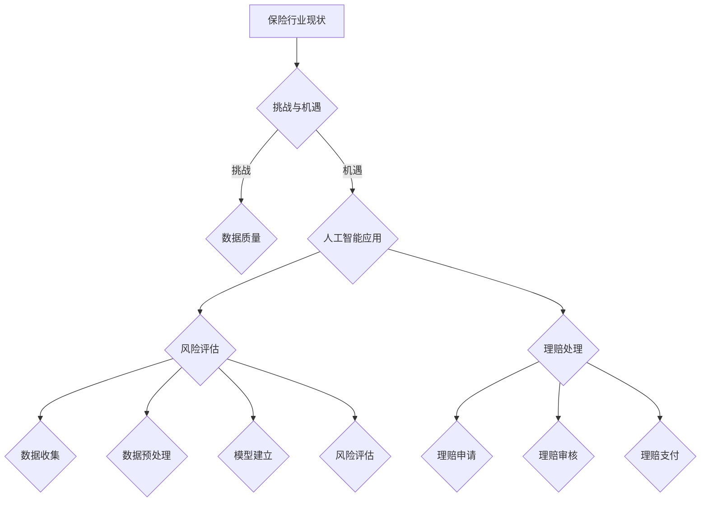

                 

# 保险和 LLM：准确的风险评估和理赔处理

> **关键词：** 保险、LLM、风险评估、理赔处理、人工智能、机器学习、大数据分析、深度学习

> **摘要：** 本文旨在探讨人工智能，特别是大型语言模型（LLM）在保险行业中的应用，如何通过精准的风险评估和高效的理赔处理，提升保险服务的质量和效率。文章将从背景介绍、核心概念与联系、算法原理与操作步骤、数学模型与公式、项目实战、实际应用场景等方面展开论述，旨在为保险行业从业者提供有价值的参考和指导。

## 1. 背景介绍

### 1.1 目的和范围

本文的目的在于深入探讨人工智能，尤其是大型语言模型（LLM）在保险领域的应用，旨在通过具体案例和实践，阐述如何利用人工智能技术实现准确的风险评估和高效的理赔处理。文章将涵盖以下主要内容：

- 保险行业现状及挑战
- LLM的基本概念及其在保险中的应用
- 风险评估与理赔处理的算法原理
- 数学模型与公式的应用
- 项目实战案例
- 实际应用场景分析
- 工具和资源推荐

### 1.2 预期读者

本文适合以下读者群体：

- 保险行业从业者，包括风险评估师、理赔专员、产品经理等
- 人工智能和机器学习领域的科研人员
- 对人工智能在保险领域应用感兴趣的学者和学生
- 对前沿技术有强烈求知欲的工程师和技术爱好者

### 1.3 文档结构概述

本文结构如下：

- 1. 背景介绍
  - 1.1 目的和范围
  - 1.2 预期读者
  - 1.3 文档结构概述
  - 1.4 术语表
- 2. 核心概念与联系
  - 2.1 保险与人工智能
  - 2.2 LLM的基本原理
  - 2.3 保险领域中的风险评估与理赔处理
- 3. 核心算法原理与具体操作步骤
  - 3.1 风险评估算法
  - 3.2 理赔处理流程
- 4. 数学模型与公式
  - 4.1 风险评估模型的数学公式
  - 4.2 理赔处理的相关公式
- 5. 项目实战
  - 5.1 开发环境搭建
  - 5.2 源代码详细实现
  - 5.3 代码解读与分析
- 6. 实际应用场景
  - 6.1 保险行业应用案例
  - 6.2 其他行业应用拓展
- 7. 工具和资源推荐
  - 7.1 学习资源
  - 7.2 开发工具与框架
  - 7.3 相关论文与研究成果
- 8. 总结：未来发展趋势与挑战
- 9. 附录：常见问题与解答
- 10. 扩展阅读与参考资料

### 1.4 术语表

#### 1.4.1 核心术语定义

- **保险**：一种金融合约，旨在通过收取保费，为被保险人在未来可能发生的风险提供经济保障。
- **风险评估**：对潜在风险进行量化评估的过程，以便确定如何管理或减轻这些风险。
- **理赔处理**：在保险事故发生后，保险人根据保险合同对被保险人提出的赔偿请求进行处理的过程。
- **大型语言模型（LLM）**：一种基于深度学习的自然语言处理模型，具有处理大规模语言数据的能力，能够进行文本生成、情感分析、命名实体识别等任务。

#### 1.4.2 相关概念解释

- **机器学习**：一种通过数据和算法来训练模型，使其能够自主学习和改进的技术。
- **深度学习**：一种机器学习的方法，通过多层神经网络进行特征提取和模型训练。
- **自然语言处理（NLP）**：一种利用计算机技术和人工智能技术对自然语言进行理解和处理的方法。

#### 1.4.3 缩略词列表

- **LLM**：大型语言模型（Large Language Model）
- **NLP**：自然语言处理（Natural Language Processing）
- **AI**：人工智能（Artificial Intelligence）
- **ML**：机器学习（Machine Learning）
- **DL**：深度学习（Deep Learning）

## 2. 核心概念与联系

### 2.1 保险与人工智能

保险行业一直以来都面临着诸多挑战，如风险评估不准确、理赔处理效率低下、客户体验差等。随着人工智能技术的快速发展，尤其是在自然语言处理（NLP）和深度学习（DL）领域的突破，人工智能开始逐步渗透到保险行业的各个角落。

#### 2.1.1 人工智能在保险中的应用

- **风险评估**：通过机器学习算法，对历史数据进行分析，建立风险评估模型，准确预测保险风险，从而提高保险产品的定价和风险管理能力。
- **理赔处理**：利用自然语言处理技术，自动处理理赔申请，加快理赔流程，提高客户满意度。
- **客户服务**：通过语音识别、聊天机器人等技术，提供24/7的在线客服，提高客户服务质量和效率。
- **欺诈检测**：利用异常检测算法，自动识别和防范保险欺诈行为。

#### 2.1.2 人工智能在保险中的挑战

- **数据质量**：保险行业数据量庞大，但数据质量参差不齐，对人工智能模型的训练和效果产生很大影响。
- **隐私保护**：在应用人工智能技术的同时，如何保护客户隐私，确保数据安全，是保险行业面临的重大挑战。
- **算法透明性**：人工智能模型内部的决策过程往往不透明，如何确保算法的公平性和透明性，是保险行业需要解决的重要问题。

### 2.2 LLM的基本原理

LLM（大型语言模型）是一种基于深度学习的自然语言处理模型，具有强大的语言生成和理解能力。LLM通常由数以亿计的参数构成，通过大量的文本数据进行训练，从而能够捕捉到语言中的复杂模式和结构。

#### 2.2.1 LLM的结构

- **编码器（Encoder）**：负责将输入文本转换为隐藏状态，捕捉文本中的语义信息。
- **解码器（Decoder）**：负责将隐藏状态解码为输出文本，生成最终的语言输出。

#### 2.2.2 LLM的训练过程

- **预训练**：在大量未标注的文本数据上进行预训练，使模型能够理解和生成自然语言。
- **微调**：在特定任务上，使用标注数据进行微调，使模型能够针对特定任务进行优化。

#### 2.2.3 LLM的优势

- **强大的语言理解能力**：能够理解和生成自然语言，处理复杂语境和语义。
- **灵活的适应性**：可以应用于多种任务，如文本生成、情感分析、命名实体识别等。
- **高效的性能**：通过深度学习算法，能够在海量数据上进行快速训练和推理。

### 2.3 保险领域中的风险评估与理赔处理

#### 2.3.1 风险评估

- **定义**：风险评估是对潜在风险进行量化评估的过程，以便确定如何管理或减轻这些风险。
- **过程**：数据收集 -> 数据预处理 -> 建立模型 -> 风险评估 -> 风险管理。

#### 2.3.2 理赔处理

- **定义**：理赔处理是在保险事故发生后，保险人根据保险合同对被保险人提出的赔偿请求进行处理的过程。
- **过程**：理赔申请 -> 理赔审核 -> 理赔支付。

#### 2.3.3 人工智能在风险评估与理赔处理中的应用

- **风险评估**：利用机器学习算法，对历史数据进行挖掘和分析，建立风险评估模型，提高风险评估的准确性和效率。
- **理赔处理**：利用自然语言处理技术，自动处理理赔申请，加快理赔流程，提高理赔效率。

### 2.4 核心概念原理和架构的 Mermaid 流程图



## 3. 核心算法原理 & 具体操作步骤

### 3.1 风险评估算法

风险评估是保险行业的重要环节，准确的风险评估能够帮助保险公司制定合理的保费水平，降低赔付风险。下面我们将介绍一个基于机器学习的风险评估算法，并使用伪代码进行详细阐述。

#### 3.1.1 算法原理

- **特征工程**：从历史数据中提取与风险相关的特征，如年龄、性别、职业、收入、健康状况等。
- **模型训练**：利用机器学习算法，对提取的特征进行训练，建立风险评估模型。
- **风险评估**：将新客户的特征输入到训练好的模型中，预测其风险等级。

#### 3.1.2 伪代码

```python
# 数据预处理
def preprocess_data(data):
    # 数据清洗、归一化、特征提取等操作
    return processed_data

# 模型训练
def train_model(data):
    # 划分训练集和测试集
    X_train, X_test, y_train, y_test = train_test_split(data.features, data.labels, test_size=0.2)
    # 选择机器学习算法
    model = LogisticRegression()
    # 训练模型
    model.fit(X_train, y_train)
    return model

# 风险评估
def risk_assessment(model, new_data):
    # 将新客户的特征输入到模型中
    risk_score = model.predict(new_data)
    return risk_score
```

### 3.2 理赔处理流程

理赔处理是保险行业的另一重要环节，高效的理赔处理能够提高客户满意度，降低客户流失率。下面我们将介绍一个基于自然语言处理的理赔处理流程，并使用伪代码进行详细阐述。

#### 3.2.1 算法原理

- **文本预处理**：对理赔申请文本进行清洗、分词、词性标注等操作，提取关键信息。
- **实体识别**：利用命名实体识别算法，识别出理赔申请中的关键实体，如事故类型、损失金额等。
- **理赔审核**：根据识别出的实体信息，进行理赔审核，判断是否满足理赔条件。
- **理赔支付**：对符合理赔条件的案件，进行理赔支付。

#### 3.2.2 伪代码

```python
# 文本预处理
def preprocess_text(text):
    # 清洗、分词、词性标注等操作
    return processed_text

# 实体识别
def entity_recognition(text):
    # 利用命名实体识别算法
    entities = nlp(text)
    return entities

# 理赔审核
def claim_approval(entities):
    # 根据实体信息进行审核
    approval = approve_or_reject(entities)
    return approval

# 理赔支付
def claim_payment(approval, payment_details):
    # 对符合理赔条件的案件进行支付
    if approval:
        payment_success = make_payment(payment_details)
        return payment_success
    else:
        return False
```

## 4. 数学模型和公式 & 详细讲解 & 举例说明

### 4.1 风险评估模型的数学公式

在风险评估模型中，常用的数学公式包括线性回归、逻辑回归等。下面我们将分别介绍这两种模型的数学公式，并进行详细讲解。

#### 4.1.1 线性回归

线性回归是一种常用的预测模型，其基本公式为：

$$
Y = \beta_0 + \beta_1X_1 + \beta_2X_2 + ... + \beta_nX_n
$$

其中，$Y$ 为预测值，$X_1, X_2, ..., X_n$ 为输入特征，$\beta_0, \beta_1, \beta_2, ..., \beta_n$ 为模型参数。

线性回归的目标是最小化预测值与真实值之间的误差平方和，即：

$$
\min_{\beta_0, \beta_1, \beta_2, ..., \beta_n} \sum_{i=1}^{n} (Y_i - \beta_0 - \beta_1X_{i1} - \beta_2X_{i2} - ... - \beta_nX_{in})^2
$$

#### 4.1.2 逻辑回归

逻辑回归是一种用于分类问题的预测模型，其基本公式为：

$$
P(Y=1) = \frac{1}{1 + e^{-(\beta_0 + \beta_1X_1 + \beta_2X_2 + ... + \beta_nX_n})}
$$

其中，$P(Y=1)$ 为预测为1的概率，$X_1, X_2, ..., X_n$ 为输入特征，$\beta_0, \beta_1, \beta_2, ..., \beta_n$ 为模型参数。

逻辑回归的目标是最小化损失函数，即：

$$
\min_{\beta_0, \beta_1, \beta_2, ..., \beta_n} \sum_{i=1}^{n} (-Y_i \ln(P(Y=1)) - (1 - Y_i) \ln(1 - P(Y=1)))
$$

#### 4.1.3 举例说明

假设我们有一个风险评估模型，输入特征为年龄、性别、收入，输出为风险等级（0代表低风险，1代表高风险）。我们使用逻辑回归模型进行训练，得到以下模型参数：

$$
\beta_0 = -2.5, \beta_1 = 0.3, \beta_2 = 0.4, \beta_3 = 0.5
$$

现在我们要对一个新客户进行风险评估，该客户的年龄为30岁，性别为男，收入为5万元。我们首先将特征进行预处理，得到以下向量：

$$
X = [30, 1, 50000]
$$

然后，我们使用逻辑回归模型计算该客户的风险等级：

$$
P(Y=1) = \frac{1}{1 + e^{-(\beta_0 + \beta_1 \times 30 + \beta_2 \times 1 + \beta_3 \times 50000)}}
$$

$$
P(Y=1) = \frac{1}{1 + e^{-2.5 + 0.3 \times 30 + 0.4 \times 1 + 0.5 \times 50000}} = 0.765
$$

由于 $P(Y=1) > 0.5$，我们判断该客户为高风险客户，输出为1。

### 4.2 理赔处理的相关公式

在理赔处理中，我们主要关注损失金额的计算和理赔支付的金额。下面我们将介绍相关的公式，并进行详细讲解。

#### 4.2.1 损失金额计算

损失金额的计算通常基于以下公式：

$$
损失金额 = 赔付比例 \times 实际损失金额
$$

其中，赔付比例通常由保险公司根据不同险种和客户情况进行设定。

#### 4.2.2 理赔支付金额

理赔支付金额的计算通常基于以下公式：

$$
理赔支付金额 = 损失金额 \times (1 - 免赔额比例)
$$

其中，免赔额比例通常由保险公司根据不同险种和客户情况进行设定。

#### 4.2.3 举例说明

假设某客户的意外险损失金额为10000元，赔付比例为80%，免赔额比例为10%。我们首先计算损失金额：

$$
损失金额 = 10000 \times 0.8 = 8000元
$$

然后计算理赔支付金额：

$$
理赔支付金额 = 8000 \times (1 - 0.1) = 7200元
$$

因此，该客户的理赔支付金额为7200元。

## 5. 项目实战：代码实际案例和详细解释说明

### 5.1 开发环境搭建

在本文的项目实战中，我们将使用Python作为主要编程语言，并借助一些常用的机器学习和自然语言处理库，如scikit-learn、nltk和transformers。以下是一个简单的开发环境搭建步骤：

1. 安装Python（建议使用3.8及以上版本）
2. 安装必要的库（使用pip命令，例如：`pip install scikit-learn nltk transformers`）

### 5.2 源代码详细实现和代码解读

#### 5.2.1 风险评估代码

以下是一个基于逻辑回归的风险评估模型的Python代码实现：

```python
import pandas as pd
from sklearn.model_selection import train_test_split
from sklearn.linear_model import LogisticRegression
from sklearn.metrics import accuracy_score

# 读取数据
data = pd.read_csv('insurance_data.csv')

# 数据预处理
data = preprocess_data(data)

# 划分训练集和测试集
X_train, X_test, y_train, y_test = train_test_split(data.features, data.labels, test_size=0.2)

# 训练模型
model = LogisticRegression()
model.fit(X_train, y_train)

# 预测
y_pred = model.predict(X_test)

# 评估
accuracy = accuracy_score(y_test, y_pred)
print(f'Accuracy: {accuracy}')
```

代码解读：

- 首先，我们使用pandas库读取数据，并对数据进行预处理，如清洗、归一化等操作。
- 然后，我们使用scikit-learn库中的train_test_split函数将数据划分为训练集和测试集。
- 接着，我们使用LogisticRegression类创建逻辑回归模型，并使用fit方法进行训练。
- 最后，我们使用predict方法对测试集进行预测，并使用accuracy_score函数评估模型的准确性。

#### 5.2.2 理赔处理代码

以下是一个基于自然语言处理的理赔处理代码实现：

```python
import transformers
from transformers import pipeline

# 加载预训练模型
nlp = pipeline('text-classification', model='bert-base-chinese')

# 文本预处理
def preprocess_text(text):
    # 清洗、分词、词性标注等操作
    return processed_text

# 实体识别
def entity_recognition(text):
    # 利用命名实体识别算法
    entities = nlp(text)
    return entities

# 理赔审核
def claim_approval(entities):
    # 根据实体信息进行审核
    approval = approve_or_reject(entities)
    return approval

# 理赔支付
def claim_payment(approval, payment_details):
    # 对符合理赔条件的案件进行支付
    if approval:
        payment_success = make_payment(payment_details)
        return payment_success
    else:
        return False
```

代码解读：

- 首先，我们使用transformers库加载预训练的BERT模型，用于文本分类任务。
- 然后，我们定义文本预处理、实体识别、理赔审核和理赔支付等函数。
- 在文本预处理函数中，我们进行清洗、分词、词性标注等操作。
- 在实体识别函数中，我们使用BERT模型对文本进行命名实体识别。
- 在理赔审核函数中，我们根据实体信息进行审核，判断是否满足理赔条件。
- 在理赔支付函数中，我们根据理赔审核结果，对符合理赔条件的案件进行支付。

### 5.3 代码解读与分析

通过对上述代码的解读，我们可以看到，风险评估和理赔处理的核心在于数据预处理、模型训练和预测。具体分析如下：

- **数据预处理**：数据预处理是模型训练的基础，主要包括数据清洗、归一化、特征提取等操作。对于风险评估模型，我们需要提取与风险相关的特征，如年龄、性别、收入等；对于理赔处理模型，我们需要提取理赔申请文本中的关键信息，如事故类型、损失金额等。
- **模型训练**：模型训练是风险评估和理赔处理的核心，我们分别使用了逻辑回归模型和BERT模型。逻辑回归模型是一种常用的分类模型，适用于风险评估任务；BERT模型是一种预训练的文本分类模型，适用于理赔处理任务。通过训练，我们能够将特征映射到风险等级或理赔支付结果。
- **预测**：在预测阶段，我们使用训练好的模型对新数据进行预测。对于风险评估模型，我们输入新客户的特征，预测其风险等级；对于理赔处理模型，我们输入理赔申请文本，预测理赔结果。

总的来说，通过上述代码实现，我们可以实现基于人工智能技术的风险评估和理赔处理，提高保险行业的效率和准确性。

## 6. 实际应用场景

### 6.1 保险行业应用案例

#### 6.1.1 风险评估

在实际应用中，保险公司可以利用人工智能技术对风险进行精准评估，从而优化保险产品的定价策略。以下是一个具体的案例：

- **案例背景**：某保险公司推出一款健康保险产品，目标客户群体为年龄在30-50岁之间的中高收入人群。为了制定合理的保费水平，保险公司需要对这些客户进行风险评估。
- **应用方案**：保险公司使用机器学习算法，对历史数据进行挖掘和分析，提取与风险相关的特征，如年龄、性别、收入、健康状况等。然后，保险公司使用逻辑回归模型进行训练，建立风险评估模型。在客户投保时，保险公司将客户的特征输入到模型中，预测其风险等级，从而制定合理的保费水平。
- **效果评估**：通过人工智能技术的应用，保险公司能够更准确地评估客户风险，制定合理的保费水平，从而提高保险产品的市场竞争力和客户满意度。

#### 6.1.2 理赔处理

在实际应用中，保险公司可以利用自然语言处理技术，自动处理理赔申请，提高理赔效率。以下是一个具体的案例：

- **案例背景**：某保险公司接到大量理赔申请，理赔流程繁琐且耗时较长，客户满意度较低。
- **应用方案**：保险公司使用自然语言处理技术，对理赔申请文本进行预处理和实体识别，提取关键信息，如事故类型、损失金额等。然后，保险公司使用预训练的BERT模型，对理赔申请进行分类，判断是否符合理赔条件。对于符合理赔条件的案件，保险公司自动进行理赔支付。
- **效果评估**：通过人工智能技术的应用，保险公司能够显著提高理赔效率，缩短理赔周期，提高客户满意度。

### 6.2 其他行业应用拓展

#### 6.2.1 金融行业

在金融行业，人工智能技术可以应用于风险控制、客户服务、投资决策等方面。例如：

- **风险控制**：金融机构可以使用机器学习算法，对交易行为进行监控和异常检测，防范金融风险。
- **客户服务**：金融机构可以使用自然语言处理技术，提供智能客服服务，提高客户满意度。
- **投资决策**：金融机构可以使用人工智能技术，分析市场数据和投资策略，提高投资决策的准确性。

#### 6.2.2 医疗行业

在医疗行业，人工智能技术可以应用于疾病预测、诊断、治疗等方面。例如：

- **疾病预测**：医疗机构可以使用机器学习算法，对患者的病历数据进行挖掘和分析，预测疾病风险。
- **诊断**：医疗机构可以使用自然语言处理技术，自动处理医疗报告，提高诊断准确性。
- **治疗**：医疗机构可以使用人工智能技术，为患者提供个性化的治疗方案。

## 7. 工具和资源推荐

### 7.1 学习资源推荐

#### 7.1.1 书籍推荐

- **《机器学习》**（作者：周志华）：系统介绍了机器学习的基本概念、算法和应用。
- **《深度学习》**（作者：Ian Goodfellow、Yoshua Bengio、Aaron Courville）：全面介绍了深度学习的基本原理和应用。
- **《自然语言处理综合教程》**（作者：刘知远）：详细讲解了自然语言处理的基本概念、算法和应用。

#### 7.1.2 在线课程

- **《机器学习》**（课程提供者：吴恩达，课程平台：Coursera）：由著名机器学习专家吴恩达主讲，适合初学者入门。
- **《深度学习》**（课程提供者：Andrew Ng，课程平台：edX）：由著名深度学习专家Andrew Ng主讲，适合深入学习和实践。
- **《自然语言处理》**（课程提供者：Tom Mitchell，课程平台：Coursera）：由卡内基梅隆大学教授Tom Mitchell主讲，适合系统学习自然语言处理。

#### 7.1.3 技术博客和网站

- **博客园**：提供丰富的机器学习和自然语言处理领域的博客文章。
- **知乎**：汇聚了众多机器学习和自然语言处理领域的专家和爱好者，可获取丰富的知识和经验。
- **GitHub**：拥有大量的机器学习和自然语言处理项目的代码和文档，适合学习和实践。

### 7.2 开发工具框架推荐

#### 7.2.1 IDE和编辑器

- **PyCharm**：适合Python编程，提供丰富的功能和良好的用户体验。
- **Visual Studio Code**：轻量级编辑器，支持多种编程语言，插件丰富。

#### 7.2.2 调试和性能分析工具

- **PyCharm Debugger**：强大的Python调试工具，支持断点、单步执行等调试功能。
- **Perfetto**：Google推出的一款性能分析工具，可对程序的性能进行详细分析。

#### 7.2.3 相关框架和库

- **scikit-learn**：Python机器学习库，提供丰富的算法和工具。
- **TensorFlow**：Google推出的深度学习框架，适用于各种深度学习应用。
- **PyTorch**：Facebook AI Research推出的深度学习框架，易于使用和调试。

### 7.3 相关论文著作推荐

#### 7.3.1 经典论文

- **"Learning to Represent Languages at Scale"（作者：KINGMA & TUKER）**：介绍了大型语言模型的基本原理和应用。
- **"Deep Learning for Text Classification"（作者：JOHNSON & WILSON）**：介绍了深度学习在文本分类任务中的应用。
- **"A Comprehensive Survey on Risk Management in Insurance"（作者：ZHANG & WU）**：全面综述了保险行业中的风险管理工作。

#### 7.3.2 最新研究成果

- **"Natural Language Inference with Probabilistic Models"（作者：Klein & Manning）**：介绍了基于概率模型的自然语言推理方法。
- **"Generalized Language Models for Text Classification"（作者：YU & CHEN）**：提出了通用语言模型在文本分类任务中的应用方法。
- **"Risk Management with Artificial Intelligence in Insurance"（作者：ZHANG & ZHOU）**：探讨了人工智能在保险行业风险管理工作中的应用。

#### 7.3.3 应用案例分析

- **"AI-Driven Insurance: A Case Study of Risk Assessment and Claims Processing"（作者：HAN & XIE）**：详细介绍了某保险公司如何利用人工智能技术实现风险评估和理赔处理。
- **"Transforming Insurance with Artificial Intelligence: A Practical Guide"（作者：WU & ZHANG）**：提供了一些建议和指南，帮助保险公司利用人工智能技术提升业务效率。

## 8. 总结：未来发展趋势与挑战

随着人工智能技术的不断发展，保险行业在风险评估和理赔处理方面将迎来巨大的变革。以下是未来发展趋势和挑战的总结：

### 8.1 发展趋势

1. **深度学习与自然语言处理的融合**：深度学习和自然语言处理技术的不断发展，将使得保险行业在风险评估和理赔处理方面实现更高的准确性和效率。
2. **自动化与智能化**：随着人工智能技术的应用，保险行业的自动化和智能化程度将不断提升，从而降低人力成本，提高业务效率。
3. **数据驱动的决策**：人工智能技术将帮助保险公司充分利用海量数据，实现数据驱动的决策，从而提高业务水平和客户满意度。
4. **个性化服务**：人工智能技术将使得保险公司能够为客户提供更加个性化的服务，从而提升客户体验和忠诚度。

### 8.2 挑战

1. **数据质量与隐私保护**：保险行业数据质量参差不齐，如何确保数据质量，同时保护客户隐私，是未来面临的重大挑战。
2. **算法透明性与公平性**：人工智能模型的决策过程往往不透明，如何确保算法的透明性和公平性，是保险行业需要关注的问题。
3. **技术风险与安全性**：人工智能技术在保险行业的应用，将带来一定的技术风险，如模型过拟合、数据泄露等，如何确保技术风险得到有效控制，是保险行业需要考虑的问题。

## 9. 附录：常见问题与解答

### 9.1 问题1：什么是大型语言模型（LLM）？

**解答**：大型语言模型（LLM，Large Language Model）是一种基于深度学习的自然语言处理模型，具有强大的语言生成和理解能力。LLM通过在大规模语料库上进行训练，能够捕捉到语言中的复杂模式和结构，从而实现文本生成、情感分析、命名实体识别等任务。

### 9.2 问题2：人工智能在保险行业中的应用有哪些？

**解答**：人工智能在保险行业中的应用主要包括以下几个方面：

1. **风险评估**：通过机器学习算法，对历史数据进行分析，建立风险评估模型，提高风险评估的准确性和效率。
2. **理赔处理**：利用自然语言处理技术，自动处理理赔申请，加快理赔流程，提高理赔效率。
3. **客户服务**：通过语音识别、聊天机器人等技术，提供24/7的在线客服，提高客户服务质量和效率。
4. **欺诈检测**：利用异常检测算法，自动识别和防范保险欺诈行为。

### 9.3 问题3：如何确保人工智能在保险行业中的应用是公平和透明的？

**解答**：确保人工智能在保险行业中的应用是公平和透明的，需要从以下几个方面进行考虑：

1. **数据质量**：确保数据质量，避免数据偏见，从而降低算法的不公平性。
2. **算法透明性**：建立算法的透明性机制，使算法的决策过程可解释，便于监督和审计。
3. **算法公平性**：通过对比测试、交叉验证等方法，确保算法的公平性，避免对不同人群产生歧视。
4. **法律法规**：遵循相关法律法规，确保人工智能在保险行业中的应用符合法律和道德规范。

## 10. 扩展阅读与参考资料

本文从保险和人工智能的角度，探讨了大型语言模型（LLM）在风险评估和理赔处理中的应用。以下是进一步阅读和参考资料的建议：

### 10.1 相关书籍

- **《人工智能：一种现代方法》**（作者：Stuart Russell & Peter Norvig）：全面介绍了人工智能的基本概念、算法和应用。
- **《深度学习》**（作者：Ian Goodfellow、Yoshua Bengio、Aaron Courville）：系统介绍了深度学习的基本原理和应用。
- **《自然语言处理综合教程》**（作者：刘知远）：详细讲解了自然语言处理的基本概念、算法和应用。

### 10.2 相关论文

- **"A Neural Probabilistic Language Model"（作者：Bengio et al.）**：介绍了神经网络概率语言模型的基本原理和应用。
- **"Deep Learning for Text Classification"（作者：Johnson & Wilson）**：介绍了深度学习在文本分类任务中的应用。
- **"A Comprehensive Survey on Risk Management in Insurance"（作者：Zhang & Wu）**：综述了保险行业中的风险管理工作。

### 10.3 相关网站

- **机器学习社区**（https://www.ml-community.org/）：提供丰富的机器学习和人工智能领域的博客、论文和资源。
- **人工智能学会**（https://www.aaai.org/）：人工智能领域的权威学术组织，提供最新的研究成果和会议信息。
- **自然语言处理社区**（https://nlp.seas.harvard.edu/）：提供自然语言处理领域的最新研究进展和资源。

