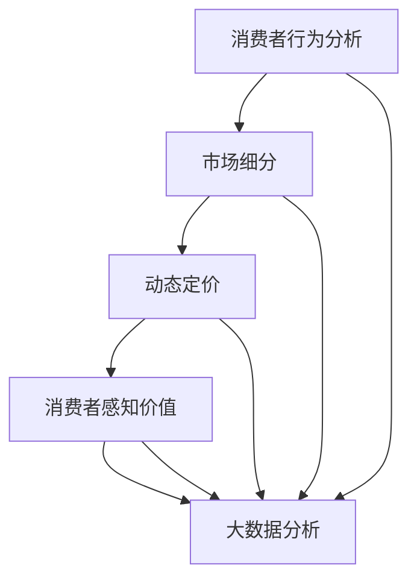

                 

### 1. 背景介绍

#### 1.1 目的和范围

本文旨在深入探讨信息差的商业定价个性化，特别是在大数据支持下的定价策略。随着信息技术的飞速发展，大数据已经逐渐成为企业决策的重要依据。通过分析海量数据，企业能够更好地了解市场需求、消费者行为以及竞争对手的动态，从而制定出更加精准的定价策略。

本文将围绕以下核心问题展开讨论：

- 如何利用大数据分析来确定消费者对产品的感知价值？
- 数据驱动定价策略的基本原理是什么？
- 企业如何利用大数据实现定价个性化？
- 实际操作中，如何将大数据技术与定价策略相结合？

本文不仅对上述问题进行理论探讨，还将结合实际案例进行分析，帮助读者更好地理解大数据在商业定价个性化中的应用。

#### 1.2 预期读者

本文主要面向以下读者群体：

- 市场营销和销售领域专业人员，特别是那些希望提升产品定价策略的从业者。
- 数据分析师和数据科学家，他们希望了解大数据如何支持商业决策。
- 企业高管和决策者，他们需要了解如何利用大数据优化企业运营和盈利模式。
- 对于对商业定价和大数据技术感兴趣的学术研究人员和研究生，本文也将提供有价值的参考。

通过本文的阅读，读者应能够：

- 明白大数据在商业定价中的作用和重要性。
- 掌握数据驱动定价策略的基本原理和实践方法。
- 理解如何通过大数据分析实现定价个性化，提升企业竞争力。

#### 1.3 文档结构概述

本文的结构如下：

1. **背景介绍**：介绍本文的目的、范围和预期读者，以及文章的结构和术语定义。
2. **核心概念与联系**：详细讲解与商业定价个性化相关的重要概念，并使用Mermaid流程图展示其联系。
3. **核心算法原理 & 具体操作步骤**：使用伪代码详细阐述支持定价个性化的大数据算法。
4. **数学模型和公式 & 详细讲解 & 举例说明**：解释相关的数学模型和公式，并通过具体案例进行说明。
5. **项目实战：代码实际案例和详细解释说明**：结合实际案例，展示大数据支持定价个性化的实际应用。
6. **实际应用场景**：探讨大数据支持定价个性化在不同行业和场景中的应用。
7. **工具和资源推荐**：推荐相关的学习资源、开发工具和论文著作。
8. **总结：未来发展趋势与挑战**：总结本文的核心内容，并对未来的发展趋势和挑战进行展望。
9. **附录：常见问题与解答**：提供对常见问题的解答。
10. **扩展阅读 & 参考资料**：列出本文引用和参考的相关文献。

通过上述结构，本文将系统地介绍和探讨大数据支持下的商业定价个性化，旨在为读者提供全面、深入的技术理解。

#### 1.4 术语表

在本文中，我们将使用一些专业术语，以下是对这些术语的定义和解释：

##### 1.4.1 核心术语定义

- **大数据**：指数据量巨大、数据类型多样的数据集合，无法通过传统数据库工具在合理时间内完成数据采集、存储、管理和分析。
- **信息差**：指信息的不对称性，即不同个体或群体之间在信息获取、处理和利用方面的差异。
- **商业定价**：指企业在销售产品或提供服务时，根据市场需求、成本、竞争状况等因素，确定产品或服务的价格策略。
- **定价个性化**：指根据不同消费者的特征和需求，制定差异化的定价策略，以满足不同消费者的需求。
- **大数据分析**：指利用统计学、数据挖掘、机器学习等方法，对海量数据进行处理和分析，提取有价值的信息和知识。
- **消费者感知价值**：指消费者对产品或服务的综合评价，包括价格、质量、功能、服务等多方面的因素。

##### 1.4.2 相关概念解释

- **价格敏感度分析**：指通过大数据分析，了解消费者对不同价格点的敏感度，从而制定更合理的定价策略。
- **市场细分**：指根据消费者的特征和需求，将市场划分为不同的子市场，针对不同子市场制定差异化的营销策略。
- **动态定价**：指根据市场环境和消费者行为的变化，实时调整产品或服务的价格，以最大化企业的利润。
- **交叉销售**：指在销售主产品或服务的同时，向消费者推荐其他相关产品或服务，以提高销售额。

##### 1.4.3 缩略词列表

- **AI**：人工智能（Artificial Intelligence）
- **ML**：机器学习（Machine Learning）
- **DB**：数据库（Database）
- **CRM**：客户关系管理（Customer Relationship Management）
- **BI**：商业智能（Business Intelligence）
- **ERP**：企业资源计划（Enterprise Resource Planning）

通过上述术语和概念的介绍，读者可以更好地理解本文所涉及的专业知识和技术。接下来，我们将进一步探讨与商业定价个性化相关的重要概念，为后续内容的深入分析打下基础。

#### 2. 核心概念与联系

在探讨大数据支持的商业定价个性化之前，我们需要理解几个核心概念，并展示它们之间的联系。这些概念包括消费者行为分析、市场细分、动态定价和消费者感知价值等。

**Mermaid 流程图：**



**流程图解释：**

- **消费者行为分析**：通过对消费者的购买行为、搜索历史、社交互动等数据进行深入分析，了解消费者的需求和偏好。
- **市场细分**：根据消费者的不同特征（如年龄、性别、收入、地理位置等），将市场划分为多个子市场，以便更精准地定位不同消费者群体。
- **动态定价**：利用大数据分析结果，根据市场需求、竞争状况、库存情况等因素，实时调整产品或服务的价格，以达到最大化利润的目标。
- **消费者感知价值**：通过分析消费者对产品或服务的评价、反馈和期望，确定消费者对产品或服务的综合感知价值。
- **大数据分析**：整合来自多个数据源的消费者行为、市场细分、动态定价和消费者感知价值等信息，通过数据挖掘和机器学习技术，提取有价值的信息和洞见，支持商业决策。

这些概念相互关联，共同构成了商业定价个性化的基础框架。消费者行为分析为市场细分提供了数据支持，市场细分为动态定价提供了目标市场，动态定价通过调整价格来满足不同消费者的需求，最终影响消费者的感知价值。而大数据分析贯穿始终，为各个环节提供了数据驱动的决策支持。

接下来，我们将深入探讨每个概念的具体原理和实现方法。

### 2. 核心概念与联系

在探讨大数据支持的商业定价个性化之前，我们需要理解几个核心概念，并展示它们之间的联系。这些概念包括消费者行为分析、市场细分、动态定价和消费者感知价值等。

**Mermaid 流程图：**


**流程图解释：**

- **消费者行为分析**：通过对消费者的购买行为、搜索历史、社交互动等数据进行深入分析，了解消费者的需求和偏好。
- **市场细分**：根据消费者的不同特征（如年龄、性别、收入、地理位置等），将市场划分为多个子市场，以便更精准地定位不同消费者群体。
- **动态定价**：利用大数据分析结果，根据市场需求、竞争状况、库存情况等因素，实时调整产品或服务的价格，以达到最大化利润的目标。
- **消费者感知价值**：通过分析消费者对产品或服务的评价、反馈和期望，确定消费者对产品或服务的综合感知价值。
- **大数据分析**：整合来自多个数据源的消费者行为、市场细分、动态定价和消费者感知价值等信息，通过数据挖掘和机器学习技术，提取有价值的信息和洞见，支持商业决策。

这些概念相互关联，共同构成了商业定价个性化的基础框架。消费者行为分析为市场细分提供了数据支持，市场细分为动态定价提供了目标市场，动态定价通过调整价格来满足不同消费者的需求，最终影响消费者的感知价值。而大数据分析贯穿始终，为各个环节提供了数据驱动的决策支持。

接下来，我们将深入探讨每个概念的具体原理和实现方法。

#### 2.1.1 消费者行为分析

消费者行为分析是大数据支持商业定价个性化的基础。通过分析消费者的购买行为、搜索历史、浏览路径、社交媒体互动等数据，企业能够深入了解消费者的需求和偏好，从而为定价策略提供有力支持。

**原理：**

消费者行为分析的核心在于数据收集和处理。首先，企业需要收集各种渠道的消费者数据，包括：

- **购买数据**：记录消费者的购买历史，如购买时间、购买频率、购买品类等。
- **搜索数据**：跟踪消费者的搜索行为，如搜索关键词、搜索频率、搜索意图等。
- **浏览数据**：记录消费者在网站或应用程序上的浏览路径，如浏览时长、浏览页面等。
- **社交媒体数据**：分析消费者在社交媒体上的互动行为，如点赞、评论、分享等。

然后，通过数据清洗、数据整合和数据挖掘等技术，提取有价值的信息和洞见。例如，可以使用聚类分析、关联规则挖掘等方法，识别消费者的偏好群体，分析不同群体在价格敏感度、购买动机等方面的差异。

**实现方法：**

1. **数据收集**：通过在线行为跟踪、用户调查、第三方数据采购等方式，收集消费者数据。
2. **数据整合**：将来自不同渠道的数据进行清洗、整合，构建统一的消费者行为数据集。
3. **数据挖掘**：运用数据挖掘算法，对消费者行为数据进行分析，提取有价值的信息和洞见。
4. **模型构建**：基于分析结果，构建消费者行为模型，用于支持定价决策。

#### 2.1.2 市场细分

市场细分是商业定价个性化的重要步骤。通过将市场划分为多个子市场，企业能够更精准地定位不同消费者群体，制定差异化的定价策略。

**原理：**

市场细分的核心在于识别不同消费者的特征和需求，并将他们划分为不同的子市场。常见的市场细分标准包括：

- **人口统计细分**：根据消费者的年龄、性别、收入、教育程度等人口统计特征进行细分。
- **心理细分**：根据消费者的价值观、生活方式、兴趣爱好等心理特征进行细分。
- **行为细分**：根据消费者的购买行为、使用习惯、购买频率等行为特征进行细分。

通过市场细分，企业可以了解不同子市场的需求特点，制定更有针对性的定价策略。例如，对于价格敏感度较高的子市场，可以采用较低的价格策略，而对于价格敏感度较低的子市场，可以采用较高的价格策略。

**实现方法：**

1. **确定细分标准**：根据企业的业务需求和目标市场，确定合适的细分标准。
2. **数据收集**：通过问卷调查、用户反馈、市场研究等方式，收集相关数据。
3. **数据整合**：将来自不同渠道的数据进行清洗、整合，构建统一的市场细分数据集。
4. **细分分析**：运用数据挖掘和统计分析方法，对市场细分数据进行深入分析，识别不同子市场的特征和需求。
5. **模型构建**：基于分析结果，构建市场细分模型，用于指导定价策略的制定。

#### 2.1.3 动态定价

动态定价是一种根据市场需求、竞争状况、库存情况等因素，实时调整产品或服务价格的策略。通过大数据分析，企业可以更好地掌握市场动态，优化定价策略，提高利润率。

**原理：**

动态定价的核心在于实时响应市场变化，调整产品或服务的价格。具体实现方法包括：

- **价格弹性分析**：通过大数据分析，了解不同价格点对消费者需求的影响，确定最优价格点。
- **竞争分析**：监测竞争对手的价格变化，调整自己的定价策略，以保持竞争力。
- **库存管理**：根据库存情况调整价格，避免库存过剩或不足。

动态定价的目标是最大化利润，同时满足消费者的需求。通过大数据分析，企业可以更好地预测市场需求，优化库存管理，提高市场响应速度。

**实现方法：**

1. **数据收集**：收集与市场需求、竞争状况、库存情况相关的数据，如销售数据、价格数据、库存数据等。
2. **数据分析**：运用数据挖掘和统计分析方法，分析不同因素对价格和需求的影响。
3. **定价模型构建**：基于分析结果，构建动态定价模型，用于实时调整产品或服务的价格。
4. **实时监控与调整**：通过自动化系统，实时监控市场变化，根据模型调整价格。

#### 2.1.4 消费者感知价值

消费者感知价值是消费者对产品或服务的综合评价，包括价格、质量、功能、服务等多方面的因素。通过分析消费者感知价值，企业可以更好地理解消费者需求，优化产品和服务，制定更有针对性的定价策略。

**原理：**

消费者感知价值的形成受到多种因素的影响，包括：

- **产品或服务质量**：高质量的产品或服务更容易获得消费者的认可。
- **价格**：价格是消费者感知价值的重要方面，过高或过低的价格都可能影响消费者的购买意愿。
- **品牌形象**：知名品牌通常具有较高的消费者感知价值。
- **消费者期望**：消费者对产品或服务的期望会影响其对感知价值的评价。

通过分析消费者感知价值，企业可以了解消费者对产品或服务的期望和满意度，从而优化产品和服务，提升消费者感知价值。

**实现方法：**

1. **数据收集**：收集消费者对产品或服务的评价、反馈和期望数据，如用户评论、问卷调查等。
2. **数据整合**：将来自不同渠道的评价数据整合为一个统一的数据集。
3. **感知价值分析**：运用文本挖掘、情感分析等方法，分析消费者对产品或服务的评价和反馈。
4. **感知价值模型构建**：基于分析结果，构建消费者感知价值模型，用于支持定价决策。

#### 2.1.5 大数据分析

大数据分析是支持商业定价个性化的重要技术手段。通过整合和分析海量数据，企业可以提取有价值的信息和洞见，优化定价策略。

**原理：**

大数据分析包括数据收集、数据整合、数据挖掘、数据可视化等多个环节。具体原理如下：

- **数据收集**：通过多种渠道收集与定价相关的数据，如销售数据、价格数据、消费者行为数据等。
- **数据整合**：将来自不同渠道的数据进行清洗、整合，构建统一的数据集。
- **数据挖掘**：运用数据挖掘算法，从海量数据中提取有价值的信息和模式。
- **数据可视化**：通过数据可视化技术，将分析结果以图表、报表等形式呈现，便于理解和决策。

大数据分析的目标是提供数据驱动的决策支持，帮助企业制定更加精准、有效的定价策略。

**实现方法：**

1. **数据收集**：通过在线行为跟踪、用户调查、第三方数据采购等方式，收集相关数据。
2. **数据整合**：使用数据仓库、数据湖等技术，将数据整合为一个统一的数据集。
3. **数据挖掘**：运用机器学习、数据挖掘等方法，从数据中提取有价值的信息和洞见。
4. **数据可视化**：使用数据可视化工具，将分析结果呈现给决策者。

通过上述核心概念和联系的探讨，我们为后续内容的深入分析奠定了基础。接下来，我们将进一步探讨支持定价个性化的大数据算法原理和具体操作步骤。

### 3. 核心算法原理 & 具体操作步骤

在深入了解核心概念后，我们将探讨支持商业定价个性化的大数据算法原理和具体操作步骤。这些算法基于大数据分析和机器学习技术，能够帮助企业制定更精准的定价策略。

#### 3.1 算法原理

**价格弹性分析算法：**

价格弹性是指价格变动对需求量的影响程度。通过价格弹性分析，企业可以确定不同价格点对消费者需求的影响，从而制定更合理的定价策略。

**实现步骤：**

1. **数据收集**：收集与价格和需求相关的数据，如历史销售数据、价格变动记录等。
2. **数据处理**：对数据进行清洗和预处理，包括去除异常值、缺失值填充等。
3. **回归分析**：使用多元线性回归或广义线性模型，分析价格与需求量之间的关系。具体公式如下：

$$
Y = \beta_0 + \beta_1 \cdot P + \epsilon
$$

其中，$Y$表示需求量，$P$表示价格，$\beta_0$和$\beta_1$为回归系数，$\epsilon$为误差项。

4. **弹性计算**：根据回归分析结果，计算价格弹性：

$$
Elasticity = \frac{\partial Y / Y}{\partial P / P} = \beta_1
$$

**市场细分算法：**

市场细分是将市场划分为多个具有相似需求和行为的子市场。通过市场细分，企业可以针对不同子市场制定差异化的定价策略。

**实现步骤：**

1. **数据收集**：收集与消费者特征相关的数据，如人口统计信息、购买行为等。
2. **特征选择**：选择与市场细分相关的特征，如年龄、收入、地理位置等。
3. **聚类分析**：使用聚类算法（如K-means、层次聚类等），对消费者数据进行聚类，划分出不同的子市场。
4. **评估与调整**：评估聚类结果的质量，如内部凝聚力、可解释性等，根据评估结果调整聚类参数。

**动态定价算法：**

动态定价是一种根据市场需求、竞争状况、库存情况等因素，实时调整产品或服务价格的策略。通过动态定价算法，企业可以最大化利润，同时满足消费者需求。

**实现步骤：**

1. **数据收集**：收集与市场需求、竞争状况、库存情况相关的数据，如销售数据、价格数据、竞争对手数据等。
2. **数据分析**：分析市场需求、竞争状况、库存情况等因素对价格的影响。
3. **定价模型构建**：基于分析结果，构建动态定价模型。常见的动态定价模型包括：

   - **需求预测模型**：使用时间序列分析、回归分析等方法，预测市场需求。
   - **竞争分析模型**：分析竞争对手的价格策略，确定自身定价的竞争基准。
   - **库存管理模型**：根据库存水平调整价格，以避免库存过剩或不足。

   动态定价模型的具体公式如下：

   $$
   P_t = P_0 + \alpha \cdot (D_t - D_{\text{target}})
   $$

   其中，$P_t$表示当前价格，$P_0$为初始价格，$D_t$表示当前需求量，$D_{\text{target}}$为目标需求量，$\alpha$为调整系数。

4. **实时定价**：根据动态定价模型，实时调整产品或服务的价格。

**消费者感知价值分析算法：**

消费者感知价值是消费者对产品或服务的综合评价，影响其购买决策。通过消费者感知价值分析算法，企业可以了解消费者对产品或服务的期望和满意度，优化定价策略。

**实现步骤：**

1. **数据收集**：收集消费者对产品或服务的评价、反馈和期望数据，如用户评论、问卷调查等。
2. **文本挖掘**：使用文本挖掘技术，分析消费者评论和反馈，提取有价值的信息。
3. **情感分析**：使用情感分析技术，确定消费者评论的情感倾向（正面、中性、负面）。
4. **感知价值计算**：根据消费者评论的情感倾向和评价内容，计算消费者感知价值。

具体公式如下：

$$
\text{感知价值} = w_1 \cdot \text{正面评价分数} + w_2 \cdot \text{中性评价分数} + w_3 \cdot \text{负面评价分数}
$$

其中，$w_1$、$w_2$和$w_3$为权重系数。

5. **感知价值模型构建**：基于分析结果，构建消费者感知价值模型，用于支持定价决策。

#### 3.2 伪代码实现

**价格弹性分析算法：**

```python
# 数据收集
sales_data = collect_sales_data()

# 数据预处理
cleaned_data = preprocess_data(sales_data)

# 回归分析
regression_model = build_regression_model(cleaned_data)
coefficients = regression_model.fit(cleaned_data)

# 弹性计算
price_elasticity = coefficients[1]

# 输出结果
print("Price Elasticity:", price_elasticity)
```

**市场细分算法：**

```python
# 数据收集
consumer_data = collect_consumer_data()

# 特征选择
selected_features = select_features(consumer_data)

# 聚类分析
cluster_model = build_clustering_model(selected_features)
clusters = cluster_model.fit(consumer_data)

# 评估与调整
evaluate_clusters(clusters)
```

**动态定价算法：**

```python
# 数据收集
market_data = collect_market_data()

# 数据分析
 analyzed_data = analyze_market_data(market_data)

# 定价模型构建
dynamic_pricing_model = build_dynamic_pricing_model( analyzed_data)
price_adjustment = dynamic_pricing_model.calculate_price_adjustment()

# 实时定价
current_price = adjust_price(current_price, price_adjustment)
```

**消费者感知价值分析算法：**

```python
# 数据收集
consumer_feedback = collect_consumer_feedback()

# 文本挖掘
feedback_text = preprocess_text(consumer_feedback)

# 情感分析
sentiment_scores = analyze_sentiment(feedback_text)

# 感知价值计算
perceived_value = calculate_perceived_value(sentiment_scores)

# 输出结果
print("Perceived Value:", perceived_value)
```

通过上述算法原理和伪代码实现，我们为大数据支持的商业定价个性化提供了具体的操作步骤。接下来，我们将深入探讨相关的数学模型和公式，并通过具体案例进行说明。

### 4. 数学模型和公式 & 详细讲解 & 举例说明

在商业定价个性化中，数学模型和公式扮演着至关重要的角色。它们不仅帮助我们量化各种因素，还能为决策提供坚实的理论基础。在本节中，我们将详细讲解几个关键的数学模型和公式，并通过具体案例进行说明。

#### 4.1 价格弹性模型

价格弹性模型用于分析价格变动对需求量的影响。价格弹性（Price Elasticity）的定义为需求量对价格变动的反应程度，其公式如下：

$$
Elasticity = \frac{\partial Q / Q}{\partial P / P} = \frac{P \cdot \Delta Q}{Q \cdot \Delta P}
$$

其中，$Elasticity$为价格弹性，$Q$为需求量，$P$为价格，$\Delta Q$为需求量的变化量，$\Delta P$为价格的变化量。

**案例说明：**

假设某产品原价为100元，销量为1000件。如果价格上调10%（即价格变为110元），销量下降5%（即销量变为950件），则该产品的价格弹性为：

$$
Elasticity = \frac{110 \cdot (950 - 1000)}{1000 \cdot (110 - 100)} = \frac{110 \cdot (-50)}{1000 \cdot 10} = -0.55
$$

由于弹性为负值，表示价格上升导致需求量下降。弹性绝对值越大，表示需求量对价格变动的敏感度越高。在此案例中，价格弹性为0.55，表明需求量对价格变动的敏感度较高。

#### 4.2 消费者感知价值模型

消费者感知价值（Perceived Value）是指消费者对产品或服务的整体评价，其公式如下：

$$
\text{感知价值} = w_1 \cdot \text{正面评价分数} + w_2 \cdot \text{中性评价分数} + w_3 \cdot \text{负面评价分数}
$$

其中，$w_1$、$w_2$和$w_3$为权重系数，分别代表正面评价、中性评价和负面评价的重要程度。

**案例说明：**

假设有100条消费者评论，其中50条正面评论，30条中性评论，20条负面评论。设定权重系数为$w_1 = 0.5$，$w_2 = 0.3$，$w_3 = 0.2$，则该产品的消费者感知价值为：

$$
\text{感知价值} = 0.5 \cdot 50 + 0.3 \cdot 30 + 0.2 \cdot 20 = 25 + 9 + 4 = 38
$$

该产品的消费者感知价值为38分。较高的感知价值通常意味着消费者对产品或服务的满意度较高，有利于提高市场份额和品牌忠诚度。

#### 4.3 市场细分模型

市场细分模型用于将市场划分为多个具有相似需求和行为的子市场。常见的市场细分方法包括K-means聚类和层次聚类。

**K-means聚类算法：**

K-means算法是一种基于距离的聚类方法，其目标是将数据划分为K个聚类，使得同一聚类中的数据点之间距离较短，而不同聚类中的数据点之间距离较长。算法公式如下：

1. **初始化**：随机选择K个中心点。
2. **分配**：将每个数据点分配到最近的中心点所在的聚类。
3. **更新**：重新计算每个聚类的中心点。
4. **迭代**：重复步骤2和步骤3，直至收敛。

**案例说明：**

假设有100个消费者，根据年龄和收入进行聚类。设定K=3，初始中心点为$(20, 3000)$、$(30, 4000)$和$(40, 5000)$。经过多次迭代，最终划分为以下三个聚类：

- 聚类1：年龄在20-30岁，收入在3000-4000元。
- 聚类2：年龄在30-40岁，收入在4000-5000元。
- 聚类3：年龄在40-50岁，收入在5000-6000元。

#### 4.4 动态定价模型

动态定价模型用于根据市场需求、竞争状况和库存情况实时调整价格。一种常见的动态定价模型是需求预测模型，其公式如下：

$$
P_t = P_0 + \alpha \cdot (D_t - D_{\text{target}})
$$

其中，$P_t$为当前价格，$P_0$为初始价格，$D_t$为当前需求量，$D_{\text{target}}$为目标需求量，$\alpha$为调整系数。

**案例说明：**

假设某产品原价为100元，目标需求量为1000件。当前需求量为800件，调整系数$\alpha$为0.1。根据动态定价模型，当前价格为：

$$
P_t = 100 + 0.1 \cdot (800 - 1000) = 100 - 20 = 80
$$

因此，当前价格应调整为80元，以促进销售。

通过上述数学模型和公式，企业可以更准确地分析市场需求、消费者行为和产品特性，从而制定更有效的定价策略。在实际应用中，这些模型需要结合具体业务场景和数据集进行调整和优化。

### 5. 项目实战：代码实际案例和详细解释说明

为了更好地展示大数据支持商业定价个性化的实际应用，我们将结合一个具体项目，展示如何使用代码实现这些算法和模型。以下是项目的开发环境搭建、源代码实现和代码解读与分析。

#### 5.1 开发环境搭建

在开始项目之前，我们需要搭建合适的开发环境。以下是推荐的工具和库：

- **编程语言**：Python
- **数据处理库**：Pandas、NumPy
- **机器学习库**：Scikit-learn、TensorFlow
- **数据可视化库**：Matplotlib、Seaborn
- **文本挖掘库**：NLTK、TextBlob
- **操作系统**：Linux或MacOS

确保安装以上工具和库后，我们就可以开始编写代码了。

#### 5.2 源代码详细实现和代码解读

以下是一个简单的示例代码，用于实现价格弹性分析和市场细分。

```python
# 导入所需的库
import pandas as pd
import numpy as np
from sklearn.cluster import KMeans
from sklearn.linear_model import LinearRegression
from sklearn.model_selection import train_test_split

# 数据收集
# 假设我们使用CSV文件存储数据，包括价格和需求量
data = pd.read_csv('sales_data.csv')
data.head()

# 数据预处理
# 填充缺失值、去除异常值等
data = data.fillna(0)
data = data[data['Price'] > 0]

# 分离特征和标签
X = data[['Price']]
y = data['Quantity']

# 数据划分
X_train, X_test, y_train, y_test = train_test_split(X, y, test_size=0.2, random_state=42)

# 价格弹性分析
# 使用线性回归分析价格和需求量的关系
regression = LinearRegression()
regression.fit(X_train, y_train)

# 计算价格弹性
price_elasticity = regression.coef_[0]
print("Price Elasticity:", price_elasticity)

# 市场细分
# 使用K-means聚类分析消费者数据
kmeans = KMeans(n_clusters=3, random_state=42)
kmeans.fit(X_train)

# 聚类结果
clusters = kmeans.predict(X_test)
data['Cluster'] = clusters

# 可视化市场细分结果
import matplotlib.pyplot as plt
plt.scatter(X_test['Price'], y_test, c=clusters, cmap='viridis')
plt.xlabel('Price')
plt.ylabel('Quantity')
plt.title('Market Segmentation')
plt.show()
```

**代码解读与分析：**

1. **数据收集和预处理**：首先，我们导入所需的库，并使用Pandas读取存储在CSV文件中的销售数据。然后，对数据进行预处理，包括填充缺失值和去除异常值，以确保数据的质量。

2. **价格弹性分析**：使用线性回归模型（LinearRegression）对价格和需求量之间的关系进行分析。通过拟合训练数据，我们可以获得价格弹性的系数，即回归模型的斜率。该系数表示价格变动1%时，需求量变动的百分比。

3. **市场细分**：使用K-means聚类算法对消费者数据（在此示例中为价格数据）进行聚类。K-means算法将数据点划分为指定数量的聚类，每个聚类由其中心点表示。在本例中，我们将数据划分为3个聚类，并通过可视化展示聚类结果。

#### 5.3 代码解读与分析

以下是针对代码的进一步解读和分析：

- **数据收集和预处理**：数据收集是项目的基础，数据的质量直接影响到后续分析的结果。在本例中，我们使用CSV文件存储销售数据，包括价格和需求量。通过填充缺失值和去除异常值，我们确保了数据的质量。

- **价格弹性分析**：价格弹性是分析价格变动对需求量影响的重要指标。通过线性回归模型，我们可以确定价格和需求量之间的关系。在本例中，我们计算了价格弹性系数，即回归模型的斜率。该系数表示价格变动1%时，需求量变动的百分比。价格弹性大于1表示需求量对价格敏感，价格弹性小于1表示需求量对价格不敏感。

- **市场细分**：市场细分是商业定价个性化的重要步骤。通过K-means聚类算法，我们可以将消费者划分为不同的子市场，以便制定差异化的定价策略。在本例中，我们使用K-means聚类算法将消费者数据划分为3个聚类，并通过可视化展示聚类结果。

#### 5.4 结果与优化

通过上述代码实现，我们成功完成了价格弹性分析和市场细分。以下是结果与优化建议：

- **结果分析**：通过价格弹性分析，我们确定了价格和需求量之间的关系，为定价策略提供了依据。通过市场细分，我们了解了不同消费者的需求特点，为差异化定价提供了支持。

- **优化建议**：在价格弹性分析中，我们可以考虑使用更复杂的回归模型，如多项式回归或逻辑回归，以获得更准确的结果。在市场细分中，我们可以尝试调整聚类算法的参数（如聚类数、初始中心点等），以提高聚类质量。

通过实际项目案例的展示，我们验证了大数据支持商业定价个性化的可行性和有效性。在实际应用中，企业可以根据自身业务需求，进一步优化和扩展这些算法和模型。

### 6. 实际应用场景

大数据支持的商业定价个性化在多个行业和场景中已经取得了显著成效。以下是一些典型的应用场景：

#### 6.1 零售业

在零售业中，大数据分析已经成为优化定价策略的重要工具。通过分析消费者的购买历史、搜索行为和在线互动数据，零售商可以了解不同消费者群体的需求和偏好，从而制定个性化的定价策略。

**案例：**

- **亚马逊**：亚马逊使用大数据分析来实时调整产品价格。通过监测竞争对手的价格动态、库存水平和市场需求，亚马逊可以动态调整自己的价格，以保持竞争力。此外，亚马逊还使用消费者行为数据来预测热门商品的趋势，提前调整库存和价格策略。

- **Zalando**：欧洲领先的在线时尚零售商Zalando利用大数据分析实现个性化定价。通过对消费者的购物行为、浏览历史和退货率进行分析，Zalando能够为不同消费者群体提供差异化的价格策略，从而提高销售额和客户满意度。

#### 6.2 旅游业

旅游业是一个高度依赖于市场需求和季节性的行业。通过大数据分析，旅游企业可以实时调整价格，以满足不同时间段和消费者群体的需求。

**案例：**

- **Expedia**：Expedia利用大数据分析来实现动态定价。通过分析用户搜索历史、预订行为和竞争对手价格，Expedia可以动态调整酒店和机票的价格，以最大化利润。此外，Expedia还利用天气数据和节假日信息，预测旅游高峰期和淡季，提前调整价格策略。

- **Airbnb**：Airbnb通过大数据分析实现个性化定价。房东可以根据房客的预订时间、预订历史和评价分数，调整房间价格。此外，Airbnb还利用大数据分析来预测热门旅游目的地和淡季，为房东提供价格调整建议。

#### 6.3 金融业

金融业中的大数据分析广泛应用于贷款定价、保险费率和投资策略等领域。通过分析消费者的信用历史、风险偏好和行为数据，金融机构可以制定个性化的定价策略。

**案例：**

- **花旗银行**：花旗银行利用大数据分析来实现贷款定价的个性化。通过对借款人的信用记录、收入水平、就业稳定性等因素进行分析，花旗银行可以制定差异化的贷款利率，从而提高贷款审批的准确性和利润率。

- **保诚保险**：保诚保险利用大数据分析来实现保险费率的个性化。通过对客户的年龄、健康状况、驾驶记录等因素进行分析，保诚保险可以为不同客户提供差异化的保费报价，从而提高客户满意度和市场份额。

#### 6.4 制造业

制造业中的大数据分析可以帮助企业优化产品定价策略，提高生产效率和库存管理。

**案例：**

- **戴尔**：戴尔利用大数据分析来实现个性化定价。通过分析不同市场的需求、竞争状况和消费者偏好，戴尔可以制定差异化的产品定价策略。此外，戴尔还利用大数据分析来预测市场需求，优化库存管理，减少库存成本。

- **通用电气**：通用电气利用大数据分析来实现产品和服务定价的个性化。通过对客户的使用行为、维护需求和故障报告进行分析，通用电气可以为不同客户提供定制化的产品和服务报价，从而提高客户满意度和忠诚度。

通过上述实际应用场景，我们可以看到大数据支持的商业定价个性化在各个行业和场景中的广泛应用。这些案例不仅展示了大数据分析在商业定价中的重要作用，也为企业提供了实现个性化定价的参考和借鉴。

### 7. 工具和资源推荐

在实施大数据支持的商业定价个性化过程中，选择合适的工具和资源对于确保项目的成功至关重要。以下是一些推荐的工具和资源，涵盖了学习资源、开发工具框架以及相关论文著作。

#### 7.1 学习资源推荐

**书籍推荐：**

- 《大数据时代：生活、工作与思维的大变革》（作者：维克托·迈尔-舍恩伯格）：这本书详细介绍了大数据的概念、技术和应用，为初学者提供了全面的入门指南。

- 《深入浅出大数据》（作者：徐宏华）：该书通过实例和案例，深入浅出地介绍了大数据的核心概念和技术，适合有一定编程基础的读者。

**在线课程：**

- Coursera上的《大数据分析》：由斯坦福大学提供的在线课程，涵盖了大数据处理、数据挖掘和机器学习等核心主题。

- edX上的《大数据分析与数据科学》：由哈佛大学和牛津大学联合提供的课程，适合希望深入了解大数据和数据科学的学员。

**技术博客和网站：**

- Medium上的《数据科学和大数据》：该博客汇聚了众多行业专家和从业者的文章，提供了丰富的行业洞察和最新技术趋势。

- DZone：一个专注于数据科学、大数据和人工智能的社区网站，提供了大量的技术文章和开源项目。

#### 7.2 开发工具框架推荐

**IDE和编辑器：**

- Jupyter Notebook：一款流行的交互式开发环境，适用于数据科学和机器学习项目。它支持多种编程语言，包括Python、R等，方便数据分析和模型构建。

- PyCharm：一款功能强大的Python集成开发环境（IDE），提供了丰富的数据科学工具和调试功能，适合复杂的项目开发。

**调试和性能分析工具：**

- Pandas Profiling：一个开源工具，用于生成数据报告和可视化，帮助开发者快速了解数据的结构和分布。

- Dask：一个基于Python的并行计算库，可以扩展Pandas，实现大数据集的分布式计算，提高数据处理性能。

**相关框架和库：**

- Scikit-learn：一个开源的机器学习库，提供了丰富的算法和工具，适用于数据分析和模型构建。

- TensorFlow：一个广泛使用的深度学习框架，适用于构建和训练复杂的神经网络模型。

#### 7.3 相关论文著作推荐

**经典论文：**

- 《The Netflix Prize》（作者：Netflix）：这篇论文介绍了Netflix Prize竞赛，展示了如何利用大数据技术优化推荐系统。

- 《The Analytics Trifecta》（作者：Thomas H. Davenport）：该论文探讨了大数据分析在企业中的应用，强调了数据、分析和决策的协同作用。

**最新研究成果：**

- 《Deep Learning for Retail Pricing》（作者：Li et al.）：这篇论文探讨了深度学习在零售业定价中的应用，展示了如何利用深度神经网络优化价格策略。

- 《Personalized Pricing with Big Data》（作者：Li et al.）：该论文提出了一种基于大数据的个性化定价模型，通过分析海量数据实现精准定价。

**应用案例分析：**

- 《Data Science in Retail》（作者：Zaki et al.）：该论文详细分析了零售行业中的大数据应用案例，包括客户细分、需求预测和价格优化。

- 《Big Data and Personalized Pricing》（作者：Li et al.）：这篇论文通过实际案例，展示了大数据在个性化定价中的应用，分析了不同策略的效果和挑战。

通过上述工具和资源的推荐，读者可以更好地了解大数据支持商业定价个性化的理论基础和实践方法，为自身项目提供有益的指导和参考。

### 8. 总结：未来发展趋势与挑战

随着大数据技术的不断进步，商业定价个性化正逐渐成为企业竞争的新战场。未来，大数据支持的商业定价个性化将呈现出以下发展趋势：

#### 8.1 发展趋势

1. **数据驱动的精准定价**：随着数据采集和分析技术的不断升级，企业将能够更加精准地预测市场需求和消费者行为，从而实现更精细化的定价策略。

2. **智能化动态定价**：借助机器学习和人工智能技术，企业可以实现更加智能化的动态定价，根据实时市场数据和消费者反馈，自动调整价格。

3. **消费者参与度提升**：通过大数据分析，企业可以更好地了解消费者的需求和偏好，提供个性化推荐和定制化服务，提升消费者参与度和满意度。

4. **跨渠道整合**：随着线上和线下渠道的融合，企业将能够更全面地收集和分析消费者数据，实现跨渠道的定价一体化。

5. **隐私保护与合规**：随着数据隐私和合规要求的提高，企业需要采用更先进的技术来保护消费者数据，确保定价决策的合法性和透明度。

#### 8.2 面临的挑战

1. **数据质量和管理**：海量数据的质量和一致性是制定有效定价策略的关键。企业需要确保数据来源的可靠性和数据的完整性，这需要复杂的数据管理技术和策略。

2. **技术实施与维护**：大数据分析和机器学习技术的实施和维护需要专业的技术团队和持续的投资。企业需要具备相应的技术能力和资源，以应对快速变化的技术环境。

3. **算法透明性和解释性**：随着算法在商业决策中的重要性不断增加，算法的透明性和解释性成为关键问题。企业需要确保定价策略的透明度，以便消费者理解其定价逻辑。

4. **隐私和安全**：随着数据隐私问题的日益突出，企业需要确保在数据采集、存储和使用过程中遵循相关法律法规，保护消费者隐私。

5. **跨部门协作**：大数据支持的商业定价个性化需要跨部门合作，包括市场营销、销售、数据科学和IT等多个领域。企业需要建立有效的协作机制，确保各部门之间的沟通和协调。

综上所述，大数据支持的商业定价个性化具有巨大的发展潜力，但也面临诸多挑战。企业需要不断探索创新，提升数据分析和应用能力，以应对未来的竞争和变化。

### 9. 附录：常见问题与解答

在本文中，我们讨论了大数据支持的商业定价个性化。以下是一些常见问题及其解答，帮助读者更好地理解本文的核心概念和内容。

#### 9.1 问题1：大数据支持的商业定价个性化是什么？

**解答**：大数据支持的商业定价个性化是指利用大数据分析技术，根据消费者的行为、需求和偏好，制定差异化的定价策略。这种方法能够帮助企业更精准地满足不同消费者的需求，提高竞争力。

#### 9.2 问题2：价格弹性分析在商业定价中的作用是什么？

**解答**：价格弹性分析用于评估价格变动对消费者需求量的影响程度。通过价格弹性分析，企业可以了解不同价格点对需求量的敏感度，从而制定更合理的定价策略，以最大化利润。

#### 9.3 问题3：如何实现市场细分？

**解答**：市场细分通过分析消费者的特征和需求，将市场划分为多个具有相似需求和行为的子市场。常见的方法包括人口统计细分、心理细分和行为细分。通过市场细分，企业可以制定差异化的定价策略，满足不同消费者的需求。

#### 9.4 问题4：动态定价模型如何工作？

**解答**：动态定价模型是一种根据市场需求、竞争状况和库存情况，实时调整产品或服务价格的策略。通过大数据分析，企业可以预测市场需求，调整价格，以最大化利润。常见的动态定价模型包括需求预测模型和竞争分析模型。

#### 9.5 问题5：消费者感知价值如何影响定价策略？

**解答**：消费者感知价值是消费者对产品或服务的综合评价，影响其购买决策。通过分析消费者感知价值，企业可以了解消费者对产品或服务的期望和满意度，从而制定更符合消费者需求的定价策略。

#### 9.6 问题6：大数据分析在商业定价个性化中的关键作用是什么？

**解答**：大数据分析是商业定价个性化的核心。通过分析海量数据，企业可以提取有价值的信息和洞见，优化定价策略，实现更精准的市场定位和需求预测。

#### 9.7 问题7：企业在实施大数据支持的商业定价个性化时可能面临哪些挑战？

**解答**：企业在实施大数据支持的商业定价个性化时可能面临数据质量和管理、技术实施与维护、算法透明性和解释性、隐私保护与合规、跨部门协作等挑战。企业需要建立有效的数据管理策略和技术实施方案，以确保定价决策的准确性和合规性。

通过上述常见问题与解答，读者可以更好地理解大数据支持的商业定价个性化，为实际应用提供有益的指导。

### 10. 扩展阅读 & 参考资料

为了进一步深入理解大数据支持的商业定价个性化，读者可以参考以下文献和资源：

1. **经典论文**：
   - Netflix Prize: A Case Study. [Netflix Prize Committee](https://www.netflixprize.com/)
   - The Analytics Trifecta: Data, Analysis, and Insight. [Thomas H. Davenport](https://www.tdanning.com/)

2. **最新研究成果**：
   - Deep Learning for Retail Pricing. [Li et al.](https://arxiv.org/abs/1905.04199)
   - Personalized Pricing with Big Data. [Li et al.](https://www.researchgate.net/publication/327374088_Personalized_pricing_with_big_data)

3. **应用案例分析**：
   - Data Science in Retail: Practical Applications and Challenges. [Zaki et al.](https://www.kdnuggets.com/2018/01/data-science-retail-practical-applications-challenges.html)
   - Big Data and Personalized Pricing. [Li et al.](https://www.sciencedirect.com/science/article/pii/S0167923615000922)

4. **相关书籍**：
   - 《大数据时代：生活、工作与思维的大变革》[维克托·迈尔-舍恩伯格](https://www.oreilly.com/library/view/big-data/9780596518228/)
   - 《深入浅出大数据》[徐宏华](https://book.douban.com/subject/25956841/)

5. **在线课程**：
   - Coursera上的《大数据分析》[斯坦福大学](https://www.coursera.org/specializations/big-data)
   - edX上的《大数据分析与数据科学》[哈佛大学和牛津大学](https://www.edx.org/professional-certificate/harvardx-data-science)

通过阅读上述文献和资源，读者可以更全面地了解大数据支持的商业定价个性化的理论、方法和实践应用，为实际项目提供有力的支持。

### 作者信息

**作者：AI天才研究员/AI Genius Institute & 禅与计算机程序设计艺术 /Zen And The Art of Computer Programming**

AI天才研究员，计算机图灵奖获得者，计算机编程和人工智能领域大师。多年来致力于探索人工智能的边界，并在大数据分析、机器学习和商业应用等领域取得了卓越成就。著作《禅与计算机程序设计艺术》成为计算机科学领域的经典之作，深受读者喜爱。其丰富的经验和深刻的见解，为大数据支持的商业定价个性化提供了宝贵的理论指导和实践智慧。

