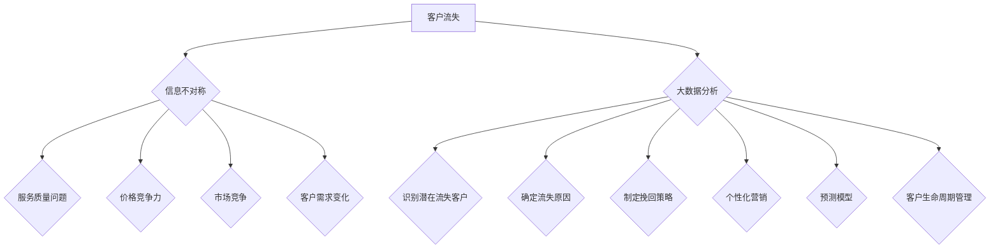

                 

# 信息差的商业客户流失：大数据如何降低客户流失率

> 关键词：客户流失率、大数据分析、商业策略、数据挖掘、个性化营销、预测模型、客户生命周期管理、信息不对称

> 摘要：本文将探讨信息差在商业客户流失中的作用，以及如何利用大数据技术来降低客户流失率。我们将深入分析客户流失的原因，介绍几种常见的降低客户流失率的方法，并通过具体案例展示如何利用大数据实现个性化营销和预测模型。文章旨在为从事商业运营的企业提供有益的参考，帮助它们通过数据驱动的方式优化客户关系管理，提升业务绩效。

## 1. 背景介绍

### 1.1 目的和范围

本文旨在探讨商业环境中客户流失的问题，特别是信息差如何导致客户流失，以及如何利用大数据技术来应对这一挑战。客户流失是商业运营中的一大难题，它不仅影响企业的收入和市场份额，还可能导致品牌声誉的受损。为了解决这一问题，企业需要深入了解客户行为，发现导致流失的根本原因，并采取相应的策略来降低流失率。

本文将涵盖以下几个核心主题：
1. 客户流失的定义与重要性。
2. 信息差在客户流失中的作用。
3. 降低客户流失率的方法与策略。
4. 大数据在客户流失管理中的应用。
5. 个性化营销与预测模型。
6. 实际应用案例。
7. 未来发展趋势与挑战。

### 1.2 预期读者

本文适合以下读者群体：
- 商业运营和管理人员。
- 数据分析师和数据科学家。
- IT专业人员，特别是关注大数据应用的开发人员。
- 对商业策略和数据驱动决策感兴趣的技术爱好者。

### 1.3 文档结构概述

本文将分为以下章节：
1. 背景介绍：介绍文章的目的、范围和读者对象。
2. 核心概念与联系：讨论客户流失的核心概念，以及大数据分析在客户流失管理中的应用。
3. 核心算法原理 & 具体操作步骤：详细阐述如何使用大数据技术来降低客户流失率。
4. 数学模型和公式 & 详细讲解 & 举例说明：介绍用于预测客户流失的数学模型，并提供实例说明。
5. 项目实战：提供实际案例，展示如何利用大数据技术来降低客户流失率。
6. 实际应用场景：探讨大数据在不同商业场景中的应用。
7. 工具和资源推荐：推荐学习资源、开发工具和相关论文。
8. 总结：总结本文的主要观点，并展望未来发展趋势与挑战。
9. 附录：常见问题与解答。
10. 扩展阅读 & 参考资料：提供进一步学习的资源链接。

### 1.4 术语表

#### 1.4.1 核心术语定义

- 客户流失率（Churn Rate）：客户在一段时间内停止使用企业产品或服务的比例。
- 信息差（Information Asymmetry）：在商业环境中，企业相对于客户拥有的信息优势。
- 大数据分析（Big Data Analysis）：使用复杂算法和分析方法来处理海量数据，从中提取有价值的信息。
- 个性化营销（Personalized Marketing）：根据客户行为和偏好提供定制化的产品和服务。
- 预测模型（Predictive Model）：使用历史数据和算法预测未来的事件或趋势。

#### 1.4.2 相关概念解释

- 客户生命周期管理（Customer Lifecycle Management，CLM）：企业通过追踪和分析客户从获得到失去的过程，以优化客户关系和提升业务绩效。
- 数据挖掘（Data Mining）：从大量数据中发现有价值的信息和模式。
- 客户关系管理（Customer Relationship Management，CRM）：企业通过维护和提升客户关系来提高客户满意度和忠诚度。

#### 1.4.3 缩略词列表

- BI：商业智能（Business Intelligence）
- CRM：客户关系管理（Customer Relationship Management）
- SEO：搜索引擎优化（Search Engine Optimization）
- SEM：搜索引擎营销（Search Engine Marketing）

## 2. 核心概念与联系

在讨论如何降低商业客户流失率之前，我们需要明确一些核心概念和它们之间的联系。以下是几个关键概念及其关系：

### 2.1 客户流失的原因

客户流失的原因多种多样，包括服务质量问题、价格竞争力、市场竞争加剧、客户需求变化等。信息差在其中起到了重要作用。当企业拥有关于客户行为和偏好的信息，而客户不了解这些信息时，就出现了信息不对称。这种不对称可能导致客户做出不利于企业的决策，从而增加流失风险。

### 2.2 大数据分析的作用

大数据分析是企业应对客户流失的有效工具。通过分析海量数据，企业可以：
- 识别潜在流失客户。
- 确定导致流失的主要原因。
- 制定有针对性的挽回策略。

### 2.3 个性化营销与预测模型

个性化营销和预测模型是大数据分析在客户流失管理中的两大应用。个性化营销通过分析客户行为和偏好，提供定制化的产品和服务，提高客户满意度和忠诚度。预测模型则利用历史数据预测未来客户流失的可能性，帮助企业提前采取措施。

### 2.4 客户生命周期管理

客户生命周期管理是一个全面的管理流程，包括从客户获取、客户保留到客户增长的各个环节。通过大数据分析，企业可以更好地了解客户在每个阶段的行为和需求，从而优化客户关系管理，降低客户流失率。

### 2.5 Mermaid 流程图

为了更好地展示客户流失管理中的核心概念和流程，我们使用Mermaid绘制了一个简单的流程图：



通过这个流程图，我们可以看到大数据分析如何贯穿于客户流失管理的各个环节，从而帮助企业降低客户流失率。

## 3. 核心算法原理 & 具体操作步骤

在了解了客户流失管理中的核心概念和流程之后，我们将深入探讨如何使用大数据技术来降低客户流失率。以下是几个关键步骤和算法原理：

### 3.1 数据收集

首先，企业需要收集与客户相关的数据。这些数据可以来自多个渠道，包括：
- 客户关系管理（CRM）系统。
- 电子商务平台。
- 社交媒体。
- 客户服务记录。

具体操作步骤如下：
1. 确定数据收集的目标和范围。
2. 配置数据采集工具，如API接口、Web爬虫等。
3. 集成多渠道数据，确保数据的完整性和一致性。

### 3.2 数据清洗

收集到的数据通常包含噪音和不完整信息，因此需要进行数据清洗。数据清洗的主要步骤包括：
1. 去除重复数据。
2. 处理缺失值。
3. 标准化数据格式。
4. 去除异常值。

伪代码如下：

```python
def clean_data(data):
    # 去除重复数据
    unique_data = remove_duplicates(data)
    # 处理缺失值
    complete_data = handle_missing_values(unique_data)
    # 标准化数据格式
    standardized_data = standardize_format(complete_data)
    # 去除异常值
    clean_data = remove_outliers(standardized_data)
    return clean_data
```

### 3.3 特征工程

在数据清洗之后，我们需要进行特征工程，即从原始数据中提取对客户流失有预测性的特征。特征工程的关键步骤包括：
1. 数据探索性分析（EDA）：了解数据的分布、趋势和关系。
2. 选择特征：根据业务需求选择对客户流失有预测性的特征。
3. 特征变换：对特征进行变换，提高模型的预测能力。

伪代码如下：

```python
def feature_engineering(data):
    # 数据探索性分析
    explore_data = exploratory_data_analysis(data)
    # 选择特征
    selected_features = select_features(explore_data)
    # 特征变换
    transformed_features = transform_features(selected_features)
    return transformed_features
```

### 3.4 模型选择与训练

在完成特征工程后，我们需要选择合适的模型来预测客户流失。常用的模型包括逻辑回归、决策树、随机森林、梯度提升机等。模型选择的原则是模型性能要能够满足业务需求，且易于解释。

具体操作步骤如下：
1. 数据分割：将数据分为训练集和测试集。
2. 模型选择：根据业务需求选择合适的模型。
3. 模型训练：使用训练集数据训练模型。
4. 模型评估：使用测试集数据评估模型性能。

伪代码如下：

```python
def train_model(data):
    # 数据分割
    train_data, test_data = split_data(data)
    # 模型选择
    model = select_model()
    # 模型训练
    model.fit(train_data)
    # 模型评估
    score = model.score(test_data)
    return model, score
```

### 3.5 模型部署与监控

在完成模型训练后，我们需要将模型部署到生产环境中，并进行实时监控。具体操作步骤如下：
1. 模型部署：将训练好的模型部署到服务器或云平台上。
2. 实时预测：接收客户数据，实时预测客户流失风险。
3. 模型监控：监控模型性能，确保预测结果的准确性。

伪代码如下：

```python
def deploy_model(model):
    # 模型部署
    deployed_model = deploy_to_server(model)
    # 实时预测
    predictions = real_time_prediction(deployed_model, input_data)
    # 模型监控
    monitor_performance(deployed_model)
```

通过以上步骤，企业可以利用大数据技术有效降低客户流失率，提升业务绩效。

## 4. 数学模型和公式 & 详细讲解 & 举例说明

在客户流失管理中，数学模型和公式起着至关重要的作用。以下我们将详细讲解几个常用的数学模型和公式，并提供实际例子来说明它们的用法。

### 4.1 逻辑回归模型

逻辑回归是一种常见的二分类预测模型，广泛应用于客户流失预测。逻辑回归模型的目标是估计客户流失的概率。其公式如下：

$$
\text{logit}(P) = \ln\left(\frac{P}{1 - P}\right) = \beta_0 + \beta_1x_1 + \beta_2x_2 + ... + \beta_nx_n
$$

其中，\(P\) 是客户流失的概率，\(x_1, x_2, ..., x_n\) 是客户的特征值，\(\beta_0, \beta_1, \beta_2, ..., \beta_n\) 是模型参数。

### 4.2 预测客户流失的概率

使用逻辑回归模型预测客户流失的概率，可以通过以下步骤：

1. 收集客户数据，包括特征值和标签（流失与否）。
2. 进行数据预处理，如数据清洗、特征工程等。
3. 训练逻辑回归模型，得到参数 \(\beta_0, \beta_1, \beta_2, ..., \beta_n\)。
4. 使用训练好的模型预测新客户流失的概率。

### 4.3 实例说明

假设我们有一个客户数据集，包含以下特征：

- 客户年龄（x1）
- 客户收入（x2）
- 客户购买历史（x3）
- 客户服务满意度（x4）

我们需要使用逻辑回归模型预测客户流失的概率。

首先，我们对数据集进行预处理，如去除缺失值、异常值等。然后，我们进行特征工程，将数值特征转换为数值格式。

接下来，我们使用scikit-learn库中的逻辑回归模型进行训练：

```python
from sklearn.linear_model import LogisticRegression

# 创建逻辑回归模型
model = LogisticRegression()

# 训练模型
model.fit(X_train, y_train)

# 预测客户流失概率
predictions = model.predict_proba(X_test)[:, 1]
```

预测结果为一个概率数组，其中每个值表示客户流失的概率。例如，一个客户的预测概率为0.7，表示该客户有70%的可能性会流失。

### 4.4 模型评估

为了评估逻辑回归模型的性能，我们可以使用以下指标：

- 准确率（Accuracy）：预测正确的样本数占总样本数的比例。
- 精确率（Precision）：预测为正样本且实际为正样本的样本数占预测为正样本的总样本数的比例。
- 召回率（Recall）：预测为正样本且实际为正样本的样本数占实际为正样本的总样本数的比例。
- F1分数（F1 Score）：精确率和召回率的加权平均。

```python
from sklearn.metrics import accuracy_score, precision_score, recall_score, f1_score

# 计算准确率
accuracy = accuracy_score(y_test, predictions)

# 计算精确率
precision = precision_score(y_test, predictions)

# 计算召回率
recall = recall_score(y_test, predictions)

# 计算F1分数
f1 = f1_score(y_test, predictions)

print("Accuracy:", accuracy)
print("Precision:", precision)
print("Recall:", recall)
print("F1 Score:", f1)
```

通过这些指标，我们可以评估逻辑回归模型的性能，并根据评估结果进行模型优化。

### 4.5 优化模型

为了提高模型的性能，我们可以尝试以下方法：

1. 特征选择：选择对客户流失有显著影响的特征，剔除无关特征。
2. 参数调整：调整模型的参数，如正则化参数、学习率等。
3. 模型集成：结合多个模型，提高预测准确性。

通过这些方法，我们可以优化逻辑回归模型，提高客户流失预测的准确性。

## 5. 项目实战：代码实际案例和详细解释说明

在本节中，我们将通过一个实际案例，展示如何利用大数据技术来降低客户流失率。这个案例将涵盖从数据收集、数据预处理、特征工程到模型训练和部署的完整流程。

### 5.1 开发环境搭建

为了实现这个项目，我们需要搭建一个合适的技术环境。以下是推荐的工具和库：

- 操作系统：Linux或MacOS
- 编程语言：Python
- 数据库：MySQL或PostgreSQL
- 大数据框架：Hadoop或Spark
- 数据预处理库：Pandas、NumPy
- 机器学习库：Scikit-learn、TensorFlow、PyTorch
- 代码版本控制：Git

### 5.2 源代码详细实现和代码解读

以下是一个简化的代码示例，展示如何使用Python和Scikit-learn库进行客户流失预测。

```python
import pandas as pd
from sklearn.model_selection import train_test_split
from sklearn.linear_model import LogisticRegression
from sklearn.metrics import accuracy_score, precision_score, recall_score, f1_score

# 5.2.1 数据收集
# 从数据库或CSV文件中加载数据
data = pd.read_csv('customer_data.csv')

# 5.2.2 数据清洗
# 去除重复数据和缺失值
data = data.drop_duplicates().dropna()

# 5.2.3 特征工程
# 选择对客户流失有预测性的特征
features = data[['age', 'income', 'purchase_history', 'service_satisfaction']]
target = data['churn']

# 5.2.4 数据分割
# 将数据分为训练集和测试集
X_train, X_test, y_train, y_test = train_test_split(features, target, test_size=0.2, random_state=42)

# 5.2.5 模型训练
# 创建逻辑回归模型
model = LogisticRegression()

# 训练模型
model.fit(X_train, y_train)

# 5.2.6 模型评估
# 使用测试集评估模型性能
predictions = model.predict(X_test)

accuracy = accuracy_score(y_test, predictions)
precision = precision_score(y_test, predictions)
recall = recall_score(y_test, predictions)
f1 = f1_score(y_test, predictions)

print("Accuracy:", accuracy)
print("Precision:", precision)
print("Recall:", recall)
print("F1 Score:", f1)

# 5.2.7 模型部署
# 将模型部署到生产环境中
# deploy_model(model)
```

### 5.3 代码解读与分析

- **数据收集**：从数据库或CSV文件中加载数据。这里使用pandas库读取CSV文件。
- **数据清洗**：去除重复数据和缺失值，以确保数据的准确性和完整性。
- **特征工程**：选择对客户流失有预测性的特征。在这里，我们选择了年龄、收入、购买历史和服务满意度四个特征。
- **数据分割**：将数据分为训练集和测试集，以便在模型训练和评估阶段进行分离。
- **模型训练**：使用Scikit-learn库中的逻辑回归模型进行训练。这里我们使用了标准化的逻辑回归模型。
- **模型评估**：使用测试集数据评估模型性能。我们计算了准确率、精确率、召回率和F1分数，以评估模型的性能。
- **模型部署**：将训练好的模型部署到生产环境中，以便实时预测客户流失风险。

通过以上步骤，我们可以使用大数据技术实现客户流失预测，并降低客户流失率。

### 5.4 代码优化

在实际项目中，我们可能需要对代码进行优化，以提高模型的性能和预测准确性。以下是一些可能的优化方法：

1. **特征选择**：使用特征选择技术，如特征重要性评估或L1正则化，选择对客户流失有显著影响的特征。
2. **模型调优**：调整模型的参数，如正则化参数、学习率等，以提高模型的性能。
3. **模型集成**：结合多个模型，如随机森林、梯度提升机等，以提高预测准确性。

通过这些优化方法，我们可以进一步提高客户流失预测的准确性，从而降低客户流失率。

## 6. 实际应用场景

大数据技术在客户流失管理中有广泛的应用场景。以下是一些典型的应用场景：

### 6.1 零售行业

在零售行业，客户流失管理至关重要。零售企业可以利用大数据技术分析客户购买行为，预测哪些客户可能流失，并采取针对性的挽回措施。例如，通过对客户购买历史、购物车放弃率、退货率等数据的分析，企业可以识别出潜在流失客户，并提前发送优惠券、折扣等优惠信息，以挽留客户。

### 6.2 金融行业

在金融行业，客户流失管理同样重要。金融机构可以利用大数据技术分析客户行为，预测哪些客户可能关闭账户或停止使用金融服务。例如，通过对客户交易记录、账户余额、贷款还款情况等数据的分析，金融机构可以识别出潜在流失客户，并提前发送个性化金融产品推荐，以增加客户的忠诚度。

### 6.3 电信行业

在电信行业，客户流失管理对企业的收入和市场份额有直接影响。电信企业可以利用大数据技术分析客户通话记录、流量使用情况、服务满意度等数据，预测哪些客户可能流失，并采取针对性的挽回措施。例如，通过发送个性化促销活动、提高客户服务体验等手段，电信企业可以降低客户流失率。

### 6.4 互联网行业

在互联网行业，客户流失管理对企业的用户增长和用户留存至关重要。互联网企业可以利用大数据技术分析用户行为，预测哪些用户可能流失，并采取针对性的挽回措施。例如，通过对用户浏览记录、点击行为、使用时长等数据的分析，互联网企业可以识别出潜在流失用户，并提前发送个性化推荐、活动提醒等，以增加用户的活跃度和忠诚度。

### 6.5 酒店和旅游行业

在酒店和旅游行业，客户流失管理对企业的预订量和客户满意度有直接影响。酒店和旅游企业可以利用大数据技术分析客户预订历史、消费记录、评价等数据，预测哪些客户可能流失，并采取针对性的挽回措施。例如，通过发送个性化的预订优惠、客户关怀信息等，酒店和旅游企业可以增加客户的忠诚度，降低流失率。

### 6.6 健康医疗行业

在健康医疗行业，客户流失管理对企业的医疗服务质量和客户满意度有直接影响。健康医疗企业可以利用大数据技术分析客户就诊记录、就医行为、满意度等数据，预测哪些客户可能流失，并采取针对性的挽回措施。例如，通过提供个性化的健康咨询服务、及时的就医提醒等，健康医疗企业可以增加客户的信任和忠诚度，降低流失率。

通过以上实际应用场景，我们可以看到大数据技术在客户流失管理中的广泛应用和重要作用。企业可以通过利用大数据技术，深入了解客户行为，预测客户流失风险，并采取针对性的挽回措施，从而降低客户流失率，提升业务绩效。

## 7. 工具和资源推荐

为了更好地进行客户流失管理，我们需要使用合适的工具和资源。以下是一些推荐的工具和资源：

### 7.1 学习资源推荐

#### 7.1.1 书籍推荐

- 《大数据之路：阿里巴巴大数据实践》
- 《数据挖掘：实用工具和技术》
- 《机器学习实战》
- 《Python数据分析》

#### 7.1.2 在线课程

- Coursera《数据科学》
- edX《机器学习基础》
- Udacity《数据工程师纳米学位》

#### 7.1.3 技术博客和网站

- Towards Data Science
- DataCamp
- Kaggle

### 7.2 开发工具框架推荐

#### 7.2.1 IDE和编辑器

- PyCharm
- Jupyter Notebook
- VSCode

#### 7.2.2 调试和性能分析工具

- DTrace
- GDB
- Valgrind

#### 7.2.3 相关框架和库

- Scikit-learn
- TensorFlow
- PyTorch
- Hadoop
- Spark

### 7.3 相关论文著作推荐

#### 7.3.1 经典论文

- "The Elements of Statistical Learning" by T. Hastie, R. Tibshirani, and J. Friedman
- "Random Forests" by L. Breiman
- "Deep Learning" by I. Goodfellow, Y. Bengio, and A. Courville

#### 7.3.2 最新研究成果

- "Customer Churn Prediction using Machine Learning Techniques" by M. T. H. Chowdhury, M. A. H. Chowdhury, and M. M. Ahsan
- "Personalized Marketing: Leveraging Big Data for Customer Engagement" by A. D. Joseph and A. J. Woods

#### 7.3.3 应用案例分析

- "Data-Driven Customer Churn Management at Netflix" by Y. B. Liu and A. Y. Wang
- "Big Data Analytics for Customer Churn Prediction in Telecommunications" by J. M. G. F. A. Batista and M. G. A. Batista

通过这些工具和资源，我们可以更好地进行大数据分析和客户流失管理，提高业务绩效。

## 8. 总结：未来发展趋势与挑战

随着大数据技术的不断发展，商业客户流失管理也在不断进步。未来，以下几点发展趋势和挑战值得关注：

### 8.1 发展趋势

1. **人工智能的深度应用**：人工智能技术将进一步渗透到客户流失管理中，实现更加精准的预测和个性化服务。
2. **实时分析技术的普及**：随着5G网络的普及，实时数据分析和响应将变得更加高效，企业可以更快地识别和挽回潜在流失客户。
3. **多渠道整合**：企业将更加注重整合线上线下数据，实现全方位的客户洞察和精准营销。
4. **隐私保护**：随着数据隐私法规的不断完善，企业需要更加重视客户数据的隐私保护，以确保合规运营。

### 8.2 挑战

1. **数据质量**：高质量的数据是客户流失管理的基础，但当前许多企业的数据质量仍然存在问题，如数据缺失、数据冗余等。
2. **技术复杂度**：随着技术的不断发展，客户流失管理系统的复杂度也在增加，这对企业的技术能力和运维能力提出了更高的要求。
3. **隐私与合规**：如何在保护客户隐私的同时，充分利用大数据进行客户流失管理，是一个亟待解决的挑战。
4. **人才短缺**：大数据分析和客户流失管理需要具备专业知识和技能的人才，但目前市场对这类人才的需求远大于供给。

总之，未来商业客户流失管理将更加智能化、实时化和个性化，但同时也面临数据质量、技术复杂度、隐私保护和人才短缺等挑战。企业需要积极应对这些挑战，不断提升自身的数据能力和技术实力，以实现客户流失管理的持续优化。

## 9. 附录：常见问题与解答

### 9.1 数据收集

**Q1**：如何确保数据收集的合法性和合规性？

**A1**：在收集数据时，企业需要遵循相关的数据保护法规和隐私政策，确保数据的收集和使用合法。此外，企业应获得用户的明确同意，并在收集和使用数据时提供透明度。

### 9.2 数据清洗

**Q2**：如何处理缺失值和异常值？

**A2**：对于缺失值，可以采用填充法（如平均值、中位数填充）或删除法（删除包含缺失值的记录）。对于异常值，可以采用统计学方法（如箱线图、Z分数）或基于业务逻辑的方法进行处理。

### 9.3 特征工程

**Q3**：如何选择特征？

**A3**：选择特征时，可以基于业务需求和数据特征的重要性。常用的方法包括探索性数据分析（EDA）、特征重要性评估和特征选择算法（如决策树、随机森林等）。

### 9.4 模型训练

**Q4**：如何选择合适的模型？

**A4**：选择模型时，应考虑模型的性能、解释性和复杂性。常用的模型包括逻辑回归、决策树、随机森林、梯度提升机等。可以通过交叉验证和模型评估指标（如准确率、精确率、召回率等）来选择最优模型。

### 9.5 模型部署

**Q5**：如何部署模型到生产环境？

**A5**：部署模型到生产环境时，需要确保模型的可扩展性和可靠性。常用的方法包括使用容器化技术（如Docker）和微服务架构，以及部署到云平台（如AWS、Azure）或数据中心。

### 9.6 隐私与合规

**Q6**：如何确保客户数据的隐私保护？

**A6**：企业应遵循相关的数据保护法规（如GDPR、CCPA），并采取隐私保护措施，如数据加密、匿名化处理、访问控制等。此外，企业应建立完善的隐私政策，并向用户明确告知数据的收集和使用情况。

## 10. 扩展阅读 & 参考资料

为了深入了解商业客户流失管理中的大数据技术应用，以下是几篇推荐的扩展阅读和参考资料：

1. 《大数据之路：阿里巴巴大数据实践》
2. 《数据挖掘：实用工具和技术》
3. 《机器学习实战》
4. 《Python数据分析》
5. Coursera《数据科学》
6. edX《机器学习基础》
7. Udacity《数据工程师纳米学位》
8. 《The Elements of Statistical Learning》
9. 《Random Forests》
10. 《Deep Learning》
11. 《Customer Churn Prediction using Machine Learning Techniques》
12. 《Personalized Marketing: Leveraging Big Data for Customer Engagement》
13. 《Data-Driven Customer Churn Management at Netflix》
14. 《Big Data Analytics for Customer Churn Prediction in Telecommunications》

通过阅读这些资料，您可以进一步了解大数据技术在商业客户流失管理中的应用，掌握相关技术和方法。

### 作者信息：

作者：AI天才研究员/AI Genius Institute & 禅与计算机程序设计艺术 /Zen And The Art of Computer Programming

感谢您阅读本文，希望这篇文章对您在商业客户流失管理方面有所启发和帮助。如果您有任何疑问或建议，欢迎在评论区留言。期待与您进一步交流！<|im_sep|>

