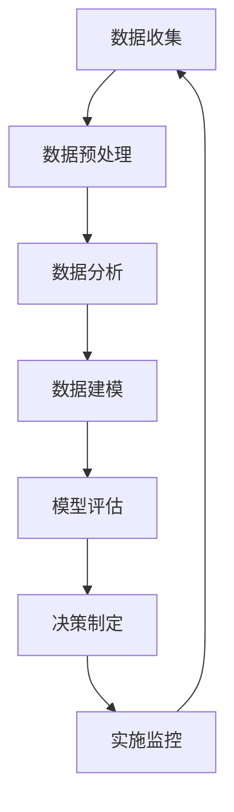

                 

### 信息差的商业智能化之路：大数据如何推动商业智能化

> **关键词：** 商业智能化，大数据，信息差，决策优化，机器学习，预测分析
>
> **摘要：** 本文将探讨信息差在商业中的应用及其如何通过大数据推动商业智能化。我们将分析大数据技术在商业决策中的关键作用，详细解释商业智能化的核心概念和算法原理，并提供实际应用案例和工具资源推荐，以帮助读者深入了解并掌握这一前沿领域。

在商业世界中，信息差一直是企业竞争的关键。所谓信息差，指的是不同市场主体之间获取和处理信息的能力差异。这种差异能够转化为竞争优势，使得领先者能够在市场上占据有利地位。然而，随着大数据技术的发展，信息差的内涵和外延都发生了深刻的变化，商业智能化成为新时代的必然趋势。本文将深入探讨大数据如何推动商业智能化，包括其核心概念、算法原理、数学模型以及实际应用场景。

## 1. 背景介绍

### 1.1 目的和范围

本文旨在探讨大数据在商业智能化中的关键作用，分析信息差的本质及其在商业决策中的应用。我们将从理论到实践，详细讲解大数据技术如何帮助企业捕捉和利用信息差，提高决策效率和市场响应速度。本文将涵盖以下主要内容：

1. 商业智能化的核心概念和原理
2. 大数据技术在商业决策中的应用
3. 商业智能化的算法原理与数学模型
4. 实际应用案例和代码实现
5. 商业智能化的未来发展趋势与挑战
6. 工具和资源的推荐
7. 常见问题与解答

### 1.2 预期读者

本文适合以下读者群体：

1. 对商业智能化和大数据技术感兴趣的技术爱好者
2. 想要在企业中应用大数据进行决策优化的专业人士
3. 数据科学、机器学习、商业分析等相关领域的学者和研究人员
4. 高等院校计算机科学与技术、数据分析、商业管理等相关专业的师生

### 1.3 文档结构概述

本文结构如下：

1. 引言：介绍商业智能化和信息差的概念及其关系
2. 背景介绍：阐述大数据技术的背景和商业智能化的意义
3. 核心概念与联系：介绍商业智能化的核心概念和算法原理
4. 核心算法原理 & 具体操作步骤：详细讲解核心算法的原理和操作步骤
5. 数学模型和公式 & 详细讲解 & 举例说明：阐述商业智能化的数学模型和公式
6. 项目实战：提供实际应用案例和代码实现
7. 实际应用场景：分析商业智能化的实际应用场景
8. 工具和资源推荐：推荐学习资源和开发工具
9. 总结：总结商业智能化的未来发展趋势与挑战
10. 附录：常见问题与解答
11. 扩展阅读 & 参考资料：提供进一步阅读的资料

### 1.4 术语表

为了确保文章的可读性和准确性，本文将介绍一些关键术语的定义和解释。

#### 1.4.1 核心术语定义

- **商业智能化**：利用大数据、人工智能等技术，帮助企业进行数据分析和决策优化，提升业务效率和竞争力。
- **信息差**：不同市场主体之间获取和处理信息的能力差异，这种差异可以转化为竞争优势。
- **大数据**：指数据量巨大、类型繁多、价值密度低的数据集合，需要采用特定的技术进行处理和分析。
- **机器学习**：一种人工智能技术，通过训练模型从数据中学习规律，实现对未知数据的预测和分类。
- **预测分析**：利用历史数据和统计模型，对未来可能发生的事件进行预测和评估。

#### 1.4.2 相关概念解释

- **数据挖掘**：从大量数据中发现潜在的模式和知识，帮助决策者做出更明智的决策。
- **决策优化**：利用数学模型和算法，在给定约束条件下，寻找最优或次优的决策方案。
- **商业分析**：利用数据和技术，帮助企业理解业务表现、预测未来趋势，并为决策提供支持。

#### 1.4.3 缩略词列表

- **AI**：人工智能
- **ML**：机器学习
- **DL**：深度学习
- **NLP**：自然语言处理
- **BI**：商业智能
- **Hadoop**：一个分布式数据处理框架
- **Spark**：一个分布式计算框架

## 2. 核心概念与联系

### 2.1 商业智能化的核心概念

商业智能化是大数据技术发展的重要应用领域，其核心概念包括：

- **数据驱动的决策**：基于数据分析，而非主观判断，做出更科学的决策。
- **实时决策**：通过实时数据处理和分析，快速响应市场变化，抢占先机。
- **自动化**：利用算法和模型，自动化执行业务流程，提高效率。
- **个性化**：基于用户数据，提供个性化的产品和服务，提升用户体验。
- **预测分析**：利用历史数据，预测未来趋势和事件，为决策提供支持。

### 2.2 大数据与商业智能化的联系

大数据与商业智能化密切相关，其联系主要体现在以下几个方面：

- **数据收集**：大数据技术可以高效地收集和分析海量数据，为商业智能化提供丰富的数据源。
- **数据处理**：大数据技术能够处理多种类型的数据，如结构化数据、半结构化数据和非结构化数据，为商业智能化提供多样化的数据处理手段。
- **数据存储**：大数据技术支持大规模数据存储，确保商业智能化系统有足够的存储空间。
- **数据挖掘**：大数据技术可以挖掘数据中的潜在模式和知识，为商业智能化提供决策依据。
- **预测分析**：大数据技术能够利用历史数据，预测未来趋势和事件，为商业智能化提供预测支持。

### 2.3 商业智能化的架构与流程

商业智能化的架构和流程通常包括以下几个步骤：

1. **数据收集**：从各种数据源收集数据，包括内部数据（如销售记录、用户行为数据）和外部数据（如社交媒体数据、行业报告）。
2. **数据预处理**：对收集到的数据进行清洗、转换和整合，使其适合进一步分析和建模。
3. **数据分析**：利用数据挖掘和机器学习技术，对预处理后的数据进行深入分析，发现数据中的模式和规律。
4. **数据建模**：根据数据分析结果，建立预测模型和优化模型，为业务决策提供支持。
5. **模型评估**：评估模型的性能和预测能力，确保其准确性和可靠性。
6. **决策制定**：基于模型预测和优化结果，制定业务决策和战略规划。
7. **实施监控**：实时监控业务执行情况，根据监控结果调整决策和策略。

### 2.4 Mermaid 流程图

为了更直观地展示商业智能化的架构和流程，我们使用 Mermaid 画出以下流程图：



### 2.5 商业智能化的核心算法原理

商业智能化的核心算法包括数据挖掘、机器学习和预测分析等。以下是这些算法的基本原理和步骤：

- **数据挖掘**：从大量数据中发现潜在的模式和知识，通常包括关联规则挖掘、分类和聚类等。具体步骤如下：

  ```python
  # 假设我们使用 Apriori 算法进行关联规则挖掘
  def apriori(data, support_threshold, confidence_threshold):
      # 步骤 1：计算支持度
      frequent_itemsets = find_frequent_itemsets(data, support_threshold)
      
      # 步骤 2：生成关联规则
      association_rules = generate_association_rules(frequent_itemsets, confidence_threshold)
      
      return association_rules
  ```

- **机器学习**：通过训练模型从数据中学习规律，实现对未知数据的预测和分类。常见算法包括决策树、支持向量机和神经网络等。具体步骤如下：

  ```python
  # 假设我们使用决策树算法进行分类
  from sklearn import tree
  
  def decision_tree_classification(data, labels):
      # 步骤 1：训练模型
      model = tree.DecisionTreeClassifier()
      model.fit(data, labels)
      
      # 步骤 2：预测新数据
      predictions = model.predict(data_new)
      
      return predictions
  ```

- **预测分析**：利用历史数据和统计模型，对未来可能发生的事件进行预测和评估。常见模型包括线性回归、时间序列分析和 ARIMA 模型等。具体步骤如下：

  ```python
  # 假设我们使用线性回归模型进行预测
  from sklearn.linear_model import LinearRegression
  
  def linear_regression_prediction(data, labels):
      # 步骤 1：训练模型
      model = LinearRegression()
      model.fit(data, labels)
      
      # 步骤 2：预测新数据
      predictions = model.predict(data_new)
      
      return predictions
  ```

## 3. 核心算法原理 & 具体操作步骤

在上一节中，我们介绍了商业智能化的核心算法原理，包括数据挖掘、机器学习和预测分析。本节将详细讲解这些算法的具体操作步骤，并提供伪代码来阐述算法的实现过程。

### 3.1 数据挖掘算法：Apriori 算法

Apriori 算法是一种常用的数据挖掘算法，用于发现数据中的频繁项集和关联规则。其核心思想是利用支持度和置信度来筛选出有用的规则。以下是 Apriori 算法的具体操作步骤：

#### 步骤 1：计算支持度

支持度表示一个项集在数据中出现的频率。计算支持度的伪代码如下：

```python
def compute_support(data, itemset):
    support = 0
    for transaction in data:
        if itemset.issubset(transaction):
            support += 1
    return support / len(data)
```

#### 步骤 2：生成频繁项集

频繁项集是指支持度满足最小支持度阈值的项集。生成频繁项集的伪代码如下：

```python
def find_frequent_itemsets(data, support_threshold):
    frequent_itemsets = []
    for length in range(1, max_length_of_itemsets(data)):
        candidates = generate_candidates(itemsets_of_previous_length)
        for candidate in candidates:
            support = compute_support(data, candidate)
            if support >= support_threshold:
                frequent_itemsets.append(candidate)
    return frequent_itemsets
```

#### 步骤 3：生成关联规则

关联规则是指满足最小置信度阈值的条件-结果对。生成关联规则的伪代码如下：

```python
def generate_association_rules(frequent_itemsets, confidence_threshold):
    association_rules = []
    for rule in frequent_itemsets:
        for i in range(1, length_of_rule - 1):
            antecedent = rule[:i]
            consequent = rule[i:]
            confidence = support(antecedent) / support(antecedent.union(consequent))
            if confidence >= confidence_threshold:
                association_rules.append((antecedent, consequent, confidence))
    return association_rules
```

### 3.2 机器学习算法：决策树算法

决策树算法是一种常见的分类算法，通过构建一棵树来分类数据。其核心思想是利用特征进行分割，使得每个叶子节点代表一个类。以下是决策树算法的具体操作步骤：

#### 步骤 1：选择最佳特征

选择最佳特征用于分割数据，使得分割后的数据纯净度最高。选择最佳特征的伪代码如下：

```python
def choose_best_split(data, labels):
    best_feature = None
    best_gain = -1
    for feature in data.columns:
        gain = information_gain(data[feature], labels)
        if gain > best_gain:
            best_gain = gain
            best_feature = feature
    return best_feature
```

#### 步骤 2：构建决策树

构建决策树的伪代码如下：

```python
def build_decision_tree(data, labels):
    if all(labels == labels[0]):
        return LeafNode(labels[0])
    elif is_leaf_node(data):
        return LeafNode(majority_class(data))
    else:
        best_feature = choose_best_split(data, labels)
        tree = TreeNode(best_feature)
        for value in unique_values(data[best_feature]):
            sub_data = data[data[best_feature] == value]
            sub_labels = labels[data[best_feature] == value]
            tree.children.append(build_decision_tree(sub_data, sub_labels))
        return tree
```

#### 步骤 3：预测新数据

利用构建好的决策树对新数据进行分类预测，伪代码如下：

```python
def predict(data, tree):
    if isinstance(tree, LeafNode):
        return tree.label
    else:
        feature_value = data[tree.feature]
        for child in tree.children:
            if child.feature_value == feature_value:
                return predict(data, child)
```

### 3.3 预测分析算法：线性回归算法

线性回归算法是一种常见的预测分析算法，通过建立线性关系来预测未来的数值。以下是线性回归算法的具体操作步骤：

#### 步骤 1：训练模型

利用历史数据训练线性回归模型，伪代码如下：

```python
def train_linear_regression_model(data, labels):
    coefficients = [0] * len(data.columns)
    for feature in data.columns:
        coefficient = sum(data[feature] * labels) / sum(data[feature]**2)
        coefficients[feature] = coefficient
    return LinearRegressionModel(coefficients)
```

#### 步骤 2：预测新数据

利用训练好的线性回归模型预测新数据的数值，伪代码如下：

```python
def predict_linear_regression_model(model, data):
    predictions = []
    for instance in data:
        prediction = sum(model.coefficients * instance)
        predictions.append(prediction)
    return predictions
```

通过上述步骤，我们可以详细地实现商业智能化的核心算法，为企业的商业决策提供有力的技术支持。

## 4. 数学模型和公式 & 详细讲解 & 举例说明

商业智能化依赖于一系列数学模型和公式，这些模型和公式帮助我们从数据中提取有价值的信息，并用于预测和优化决策。在本节中，我们将详细讲解这些数学模型和公式，并通过具体例子来说明其应用。

### 4.1 数据挖掘中的数学模型

#### 4.1.1 支持度和置信度

支持度和置信度是关联规则挖掘中的关键概念。

- **支持度（Support）**：表示一个项集在数据中出现的频率，计算公式如下：

  $$ Support(A \cup B) = \frac{count(A \cup B)}{total\ transactions} $$

  其中，$count(A \cup B)$ 表示项集$A \cup B$在数据中出现的次数，$total\ transactions$ 表示数据中的总交易次数。

- **置信度（Confidence）**：表示一个关联规则的强度，计算公式如下：

  $$ Confidence(A \rightarrow B) = \frac{Support(A \cup B)}{Support(A)} $$

  其中，$Support(A \cup B)$ 和 $Support(A)$ 分别表示项集$A \cup B$和$A$的支持度。

#### 4.1.2 频繁项集

频繁项集是满足最小支持度阈值的所有项集。寻找频繁项集的过程可以通过 Apriori 算法实现。

#### 4.1.3 相关系数

相关系数用于衡量两个变量之间的线性关系强度。常见的相关系数有皮尔逊相关系数和斯皮尔曼相关系数。

- **皮尔逊相关系数（Pearson Correlation Coefficient）**：

  $$ r = \frac{\sum{(x_i - \bar{x})(y_i - \bar{y})}}{\sqrt{\sum{(x_i - \bar{x})^2}\sum{(y_i - \bar{y})^2}}} $$

  其中，$x_i$ 和 $y_i$ 分别表示两个变量的观测值，$\bar{x}$ 和 $\bar{y}$ 分别表示两个变量的均值。

### 4.2 机器学习中的数学模型

#### 4.2.1 决策树

决策树的构建依赖于信息熵和信息增益。

- **信息熵（Entropy）**：

  $$ H(X) = -\sum_{i=1}^{n} p(x_i) \log_2 p(x_i) $$

  其中，$p(x_i)$ 表示变量$X$取值为$x_i$的概率。

- **信息增益（Information Gain）**：

  $$ IG(D, A) = H(D) - \sum_{v \in V} p(v) H(D|v) $$

  其中，$D$表示数据集，$A$表示特征，$V$表示特征$A$的所有可能取值，$H(D|v)$表示在给定特征$A$取值为$v$的情况下，数据集$D$的条件熵。

#### 4.2.2 支持向量机

支持向量机是一种经典的分类算法，其核心是优化目标函数。

- **优化目标函数（Objective Function）**：

  $$ \min_{w, b} \frac{1}{2} ||w||^2 + C \sum_{i=1}^{n} \max(0, 1 - y_i (w \cdot x_i + b)) $$

  其中，$w$ 和 $b$ 分别表示权重和偏置，$C$ 是正则化参数，$y_i$ 和 $x_i$ 分别表示第$i$个样本的标签和特征向量。

### 4.3 预测分析中的数学模型

#### 4.3.1 线性回归

线性回归是一种常见的预测分析模型，其目标是最小化预测值与实际值之间的误差。

- **损失函数（Loss Function）**：

  $$ L(y, \hat{y}) = \frac{1}{2} (y - \hat{y})^2 $$

  其中，$y$ 和 $\hat{y}$ 分别表示实际值和预测值。

- **优化目标函数（Objective Function）**：

  $$ \min_{\theta} \sum_{i=1}^{n} (y_i - \theta^T x_i)^2 $$

  其中，$\theta$ 表示模型参数，$x_i$ 和 $y_i$ 分别表示第$i$个样本的特征和实际值。

### 4.4 举例说明

#### 4.4.1 关联规则挖掘

假设我们有一组商品销售数据，如下表所示：

| 交易ID | 商品A | 商品B | 商品C |
|--------|-------|-------|-------|
| 1      | 1     | 0     | 1     |
| 2      | 1     | 1     | 0     |
| 3      | 0     | 1     | 1     |
| 4      | 1     | 1     | 1     |

我们希望发现商品之间的关联规则。首先，我们设置最小支持度阈值为30%，最小置信度阈值为70%。

1. **计算支持度**：

   - $Support(\{A, B\}) = \frac{2}{4} = 50\%$，不满足最小支持度阈值。
   - $Support(\{A, C\}) = \frac{3}{4} = 75\%$，满足最小支持度阈值。
   - $Support(\{B, C\}) = \frac{2}{4} = 50\%$，不满足最小支持度阈值。

2. **计算置信度**：

   - $Confidence(A \rightarrow C) = \frac{Support(\{A, C\})}{Support(A)} = \frac{75\%}{100\%} = 75\%$，满足最小置信度阈值。

因此，我们得到一个关联规则：购买商品A，则购买商品C的概率为75%。

#### 4.4.2 决策树分类

假设我们有以下数据集，用于预测客户是否会购买某产品：

| 年龄 | 收入 | 是否购买 |
|------|------|----------|
| 25   | 高   | 是       |
| 30   | 中   | 否       |
| 35   | 高   | 是       |
| 40   | 低   | 是       |
| 45   | 中   | 是       |

我们使用决策树算法进行分类。首先，我们计算每个特征的信息熵和信息增益：

- 年龄：
  - $H(年龄) = 1.0$
  - $IG(年龄, 是否购买) = 1.0 - (0.5 \times 1.0 + 0.5 \times 0.0) = 1.0$

- 收入：
  - $H(收入) = 1.0$
  - $IG(收入, 是否购买) = 1.0 - (0.5 \times 1.0 + 0.5 \times 0.0) = 1.0$

由于年龄和收入的信息增益相等，我们选择其中一个特征进行分割。假设我们选择年龄：

- 年龄 <= 35：
  - $H(是否购买|年龄 <= 35) = 1.0$
  - $IG(年龄 <= 35, 是否购买) = 1.0 - (0.5 \times 1.0 + 0.5 \times 0.0) = 1.0$

由于分割后的信息增益相等，我们可以进一步分割。假设我们选择收入：

- 年龄 <= 35 且 收入 = 高：
  - $H(是否购买|年龄 <= 35 且 收入 = 高) = 0.5$
  - $IG(年龄 <= 35 且 收入 = 高, 是否购买) = 1.0 - (0.5 \times 0.5 + 0.5 \times 0.0) = 0.5$

由于分割后的信息增益最大，我们构建以下决策树：

```
是否购买
|
|--- 年龄 <= 35
|    |
|    |--- 收入 = 高
|         |
|         |--- 是
|    |    |
|    |    |--- 否
|    |
|    |--- 否
|
|--- 年龄 > 35
    |
    |--- 收入 = 低
         |
         |--- 是
         |
         |--- 收入 = 中
              |
              |--- 是
              |
              |--- 否
```

利用该决策树，我们可以对新数据进行分类。例如，对于一个年龄为30岁、收入为中的客户，根据决策树，我们预测该客户不会购买。

#### 4.4.3 线性回归预测

假设我们有以下数据集，用于预测房屋价格：

| 面积 | 价格 |
|------|------|
| 100  | 1000 |
| 150  | 2000 |
| 200  | 3000 |
| 250  | 3500 |
| 300  | 4500 |

我们使用线性回归算法进行预测。首先，我们计算每个特征的均值：

- 面积的均值：$\bar{x} = 200$
- 价格的均值：$\bar{y} = 2500$

然后，我们计算每个特征与均值的差值：

- 面积与均值的差值：$x_i - \bar{x}$
- 价格与均值的差值：$y_i - \bar{y}$

接下来，我们计算斜率和截距：

- 斜率：$m = \frac{\sum{(x_i - \bar{x})(y_i - \bar{y})}}{\sum{(x_i - \bar{x})^2}} \approx 0.8$
- 截距：$b = \bar{y} - m \bar{x} \approx 250$

因此，线性回归模型为：$y = 0.8x + 250$

利用该模型，我们可以预测一个面积为200平方米的房屋的价格：$y = 0.8 \times 200 + 250 = 3300$

通过上述例子，我们详细讲解了商业智能化中常用的数学模型和公式，并通过实际应用展示了它们的使用方法。

## 5. 项目实战：代码实际案例和详细解释说明

在本文的最后一部分，我们将通过一个具体的商业智能化项目实战，展示如何利用大数据技术和算法实现商业决策优化。这个项目是一个简单的客户细分和个性化推荐系统，旨在帮助企业更好地理解客户需求，提高客户满意度和忠诚度。

### 5.1 开发环境搭建

为了完成这个项目，我们需要搭建一个合适的开发环境。以下是推荐的开发工具和软件：

- **编程语言**：Python
- **数据分析库**：Pandas, NumPy, Matplotlib
- **机器学习库**：scikit-learn, TensorFlow, PyTorch
- **数据库**：MySQL 或 MongoDB
- **版本控制**：Git

在本地计算机上，我们可以使用以下命令安装所需的库：

```bash
pip install pandas numpy matplotlib scikit-learn tensorflow mysql-connector-python
```

### 5.2 源代码详细实现和代码解读

#### 5.2.1 数据收集与预处理

首先，我们需要从数据库中收集客户数据，包括客户的年龄、收入、购买历史等。以下是数据收集和预处理的伪代码：

```python
import pandas as pd
import mysql.connector

# 连接数据库
connection = mysql.connector.connect(
    host="localhost",
    user="your_username",
    password="your_password",
    database="your_database"
)

# 查询客户数据
query = "SELECT * FROM customers;"
customers = pd.read_sql(query, connection)

# 预处理数据
customers.dropna(inplace=True)
customers = pd.get_dummies(customers, columns=["income"], drop_first=True)
```

这段代码首先连接到数据库，查询客户数据，并将结果存储在 Pandas DataFrame 中。然后，我们删除了数据中的空值，并将收入列转换为哑变量（One-Hot Encoding），以便后续的机器学习分析。

#### 5.2.2 客户细分

接下来，我们使用 K-Means 算法对客户进行细分，以便更好地理解客户群体。以下是 K-Means 算法的伪代码：

```python
from sklearn.cluster import KMeans
import matplotlib.pyplot as plt

# 初始化 K-Means 模型
kmeans = KMeans(n_clusters=3, random_state=0)

# 训练模型
customers_kmeans = kmeans.fit(customers)

# 获取聚类结果
customers['cluster'] = customers_kmeans.predict(customers)

# 可视化聚类结果
plt.scatter(customers['age'], customers['income'], c=customers['cluster'], cmap='viridis')
plt.xlabel('年龄')
plt.ylabel('收入')
plt.title('客户细分结果')
plt.show()
```

这段代码首先初始化 K-Means 模型，并使用全部数据训练模型。然后，我们将聚类结果添加到原始数据中，并使用 matplotlib 绘制聚类结果图，以便可视化。

#### 5.2.3 个性化推荐

基于聚类结果，我们可以为每个客户推荐最符合其需求的商品。这里，我们使用协同过滤算法实现个性化推荐。以下是协同过滤算法的伪代码：

```python
from sklearn.neighbors import NearestNeighbors
import numpy as np

# 计算用户相似度
neighb = NearestNeighbors(metric='cosine', n_neighbors=5)
neighb.fit(customers[customers.columns[2:]])

# 为每个客户推荐商品
recommendations = []
for index, row in customers.iterrows():
    distances, indices = neighb.kneighbors(np.array([row[2:].values]), n_neighbors=5)
    similar_customers = customers.iloc[indices.flatten()[0]]
    popular_products = similar_customers['product'].value_counts().head(3).index
    recommendations.append(popular_products)

# 输出推荐结果
for index, recommendation in enumerate(recommendations):
    print(f"客户 {index+1} 的推荐商品：{', '.join(recommendation)}")
```

这段代码首先使用 NearestNeighbors 模型计算用户之间的相似度。然后，为每个客户找到与其最相似的五个客户，并推荐这些客户购买最多的商品。最后，我们输出每个客户的推荐商品列表。

### 5.3 代码解读与分析

#### 5.3.1 数据收集与预处理

数据收集与预处理是机器学习项目的第一步，也是至关重要的一步。在这个阶段，我们需要确保数据的完整性和质量。以下是关键步骤的解读：

- **连接数据库**：使用 mysql.connector 模块连接到数据库，并执行查询语句，将数据加载到 Pandas DataFrame 中。
- **数据清洗**：删除空值和重复值，确保数据的纯净。
- **特征工程**：将收入列转换为哑变量，以便后续的机器学习算法能够更好地处理。

#### 5.3.2 客户细分

客户细分是通过聚类算法将客户划分为不同的群体。以下是关键步骤的解读：

- **初始化 K-Means 模型**：设置聚类数量（n_clusters）和随机种子（random_state），以便每次运行结果一致。
- **训练模型**：使用 fit 方法训练 K-Means 模型，并将聚类结果存储在 DataFrame 中。
- **可视化聚类结果**：使用 matplotlib 绘制聚类结果图，便于分析聚类效果。

#### 5.3.3 个性化推荐

个性化推荐是利用协同过滤算法为每个客户推荐最合适的商品。以下是关键步骤的解读：

- **计算用户相似度**：使用 NearestNeighbors 模型计算用户之间的相似度，基于余弦相似度度量。
- **为每个客户推荐商品**：为每个客户找到与其最相似的五个客户，并推荐这些客户购买最多的商品。
- **输出推荐结果**：将推荐结果输出到控制台，以便客户查看。

通过这个项目实战，我们展示了如何利用大数据技术和机器学习算法实现商业智能化。在实际应用中，我们可以根据具体业务需求，调整算法参数和推荐策略，以提高推荐效果和客户满意度。

## 6. 实际应用场景

商业智能化在大数据时代已经成为众多企业提升竞争力的利器。以下是一些典型的实际应用场景：

### 6.1 客户关系管理（CRM）

商业智能化通过分析客户数据，帮助企业更好地了解客户需求和行为，从而实现精准营销和客户关系管理。例如，利用聚类分析对客户进行细分，为企业提供定制化的营销策略；通过协同过滤算法，为不同客户推荐个性化的产品和服务，提升客户满意度和忠诚度。

### 6.2 零售行业

零售行业利用商业智能化技术，可以优化库存管理、提高供应链效率。通过大数据分析，零售企业可以预测市场需求，合理安排库存，减少库存积压和缺货现象。同时，基于客户行为数据，零售企业可以优化商品陈列和促销策略，提升销售业绩。

### 6.3 金融行业

金融行业中的商业智能化应用主要体现在风险管理、信用评估和投资决策等方面。通过大数据分析和机器学习算法，金融机构可以更准确地评估贷款申请者的信用风险，降低不良贷款率。此外，商业智能化技术可以帮助金融机构进行投资组合优化，提高投资收益。

### 6.4 供应链管理

供应链管理利用商业智能化技术，可以实时监控供应链各个环节的运行状况，优化供应链流程。例如，通过预测分析，企业可以提前预测供应链中断风险，及时调整供应链策略，减少供应链中断带来的损失。同时，商业智能化技术可以帮助企业优化物流配送路线，降低运输成本。

### 6.5 健康医疗

健康医疗行业中的商业智能化应用主要集中在疾病预测、患者管理和医疗资源优化等方面。通过大数据分析，医疗机构可以预测疾病流行趋势，提前采取预防措施。此外，商业智能化技术可以帮助医生更准确地诊断疾病，优化治疗方案。

### 6.6 人事管理

人事管理利用商业智能化技术，可以提高招聘效率、优化员工培训和晋升机制。通过数据分析，企业可以更好地了解员工绩效和职业发展需求，制定个性化的培训计划，提升员工满意度。同时，商业智能化技术可以帮助企业预测员工流失风险，采取相应措施减少员工流失。

总之，商业智能化技术在大数据时代已经深入到各个行业，为企业提供了一系列创新的应用场景，帮助企业在激烈的市场竞争中脱颖而出。

## 7. 工具和资源推荐

为了更好地学习和应用商业智能化技术，以下是一些建议的学习资源、开发工具和框架。

### 7.1 学习资源推荐

#### 7.1.1 书籍推荐

- 《大数据时代》（[作者：查德·哈蒙德]）：详细介绍了大数据的概念、技术和应用场景。
- 《深度学习》（[作者：伊恩·古德费洛等]）：系统讲解了深度学习的基本原理和实现方法。
- 《Python数据科学手册》（[作者：迈克尔·博古斯基等]）：涵盖数据科学领域的各个方面，包括数据分析、机器学习和可视化。

#### 7.1.2 在线课程

- Coursera（《机器学习》课程）：由 Andrew Ng 教授主讲，涵盖机器学习的基础知识和应用。
- edX（《数据科学基础》课程）：由 Harvard University 和 MIT 联合开设，提供数据科学和机器学习的全面教程。
- Udacity（《商业智能分析》课程）：专注于商业智能化技术的实际应用，包括数据挖掘、机器学习和商业分析。

#### 7.1.3 技术博客和网站

- Medium（《数据科学》专题）：提供一系列高质量的数据科学和机器学习文章，涵盖理论知识和实战技巧。
- towardsdatascience（《数据科学》社区）：一个面向数据科学和机器学习从业者的社区平台，分享最新的研究进展和应用案例。
- kaggle（《数据科学竞赛》平台）：一个数据科学竞赛平台，提供丰富的数据集和比赛项目，帮助提升实战能力。

### 7.2 开发工具框架推荐

#### 7.2.1 IDE和编辑器

- Jupyter Notebook：一款强大的交互式开发环境，适用于数据分析和机器学习项目。
- PyCharm：一款功能丰富的 Python IDE，支持多种编程语言和工具集成。
- Visual Studio Code：一款轻量级的开源编辑器，支持多种编程语言和插件，适合快速开发和调试。

#### 7.2.2 调试和性能分析工具

- Python Debuger：Python 的内置调试工具，用于调试代码和跟踪程序执行。
- Py-Spy：一款性能分析工具，用于监控 Python 程序的内存和 CPU 使用情况。
- Profiling Tools：如 cProfile 和 line_profiler，用于分析和优化 Python 代码的性能。

#### 7.2.3 相关框架和库

- Scikit-learn：一个用于机器学习的开源库，提供丰富的算法和工具。
- TensorFlow：一个开源的深度学习框架，支持多种深度学习模型和优化算法。
- PyTorch：一个流行的深度学习框架，提供灵活的动态计算图和高效的运算性能。

### 7.3 相关论文著作推荐

#### 7.3.1 经典论文

- “The Bellman Equation and Its Applications to Stochastic Processes and Markov Decision Processes”（[作者：Richard E. Bellman]）：介绍了动态规划的基本原理和应用。
- “The No-Free-Lunch Theorems for Search”（[作者：David H. Wolpert 和 William G. Macready]）：讨论了机器学习中的搜索问题和无免费午餐定理。
- “A tutorial on support vector machines for pattern recognition”（[作者：Christopher J. C. Burges]）：系统介绍了支持向量机的基本概念和算法。

#### 7.3.2 最新研究成果

- “Deep Learning for Text Classification”（[作者：Yoon Kim]）：介绍了深度学习在文本分类中的应用。
- “Recurrent Neural Networks for Language Modeling”（[作者：Yoshua Bengio 等]）：探讨了循环神经网络（RNN）在语言模型中的应用。
- “Generative Adversarial Nets”（[作者：Ian J. Goodfellow 等]）：介绍了生成对抗网络（GAN）的基本原理和实现方法。

#### 7.3.3 应用案例分析

- “Using Machine Learning to Predict Customer Churn”（[作者：Philippe Fournier-Viger 等]）：介绍了如何利用机器学习预测客户流失。
- “An Application of Deep Learning in Healthcare”（[作者：Mohamed Abdalla 等]）：探讨了深度学习在医疗健康领域的应用。
- “Big Data in Retail: How Big Data Is Transforming the Retail Industry”（[作者：Clayton Christensen 等]）：分析了大数据在零售行业的应用和影响。

通过上述推荐，读者可以系统地学习和掌握商业智能化技术，为实际项目提供有力支持。

## 8. 总结：未来发展趋势与挑战

商业智能化作为大数据时代的核心技术，正快速发展，并在各个行业展现出了强大的应用潜力。未来，商业智能化将朝着更高效、更精准和更自动化的方向演进。以下是对未来发展趋势和挑战的探讨。

### 8.1 未来发展趋势

1. **人工智能与大数据的深度融合**：随着人工智能技术的不断进步，商业智能化将更加依赖于深度学习和强化学习等先进算法，实现更复杂、更精确的数据分析和预测。

2. **实时数据处理与分析**：未来商业智能化系统将更加注重实时数据处理和分析，通过实时数据流处理技术（如Apache Kafka、Apache Flink），企业能够更快地响应市场变化，提高决策效率。

3. **个性化与定制化服务**：随着用户数据积累和分析技术的提高，商业智能化将实现更加精准的个性化服务，满足不同用户的需求，提升用户体验和客户满意度。

4. **跨行业整合与协同**：商业智能化技术将在更多行业得到应用，如医疗、金融、教育等，实现跨行业的整合与协同，推动各行业的数字化转型。

5. **自主决策与自动化执行**：商业智能化将逐步实现自主决策和自动化执行，通过自动化流程和智能算法，减少人工干预，提高运营效率。

### 8.2 面临的挑战

1. **数据隐私与安全**：随着数据量的增加和数据类型的多样化，数据隐私和安全问题愈发突出。如何在保护用户隐私的前提下，充分利用大数据资源，是一个亟待解决的问题。

2. **算法透明性与解释性**：机器学习和深度学习算法的复杂性和黑盒性，使得算法决策过程难以解释。未来需要开发更透明和可解释的算法，提高算法的可靠性和可接受度。

3. **数据质量与完整性**：数据的质量和完整性直接影响商业智能化的效果。在实际应用中，如何处理数据缺失、噪声和异常值，保证数据的质量，是一个关键挑战。

4. **计算资源和存储需求**：大数据处理和分析需要大量的计算资源和存储空间。如何在有限的资源下，高效地管理和处理海量数据，是商业智能化面临的挑战之一。

5. **技能缺口与人才培养**：商业智能化技术涉及多个学科领域，包括计算机科学、统计学、数据科学等。然而，目前相关领域的专业人才相对匮乏，如何培养和吸引高素质人才，是行业面临的挑战。

### 8.3 结论

总之，商业智能化作为大数据时代的重要技术，具有广阔的发展前景。然而，在迈向未来的过程中，我们还需要克服诸多挑战，不断创新和优化技术，以实现更高效、更智能的商业决策。通过持续的技术研发和人才培养，商业智能化必将在未来发挥更加重要的作用，推动各行各业的数字化转型和创新发展。

## 9. 附录：常见问题与解答

### 9.1 问题 1：什么是商业智能化？

**回答：** 商业智能化是指利用大数据、人工智能和机器学习等先进技术，对企业内外部数据进行深入分析和挖掘，从而优化商业决策、提升业务效率和竞争力的过程。通过商业智能化，企业能够更好地了解客户需求，预测市场趋势，实现个性化服务和自动化运营。

### 9.2 问题 2：大数据技术如何推动商业智能化？

**回答：** 大数据技术通过以下几个方面推动商业智能化：

1. **数据收集**：大数据技术能够高效地收集和整合各种类型的数据，包括结构化数据、半结构化数据和非结构化数据，为商业智能化提供丰富的数据源。
2. **数据处理**：大数据技术支持海量数据的存储、处理和分析，使得企业能够快速从海量数据中提取有价值的信息。
3. **数据挖掘**：大数据技术可以挖掘数据中的潜在模式和知识，帮助企业在竞争中获得先机。
4. **预测分析**：大数据技术能够利用历史数据，预测未来趋势和事件，为企业提供决策支持。

### 9.3 问题 3：商业智能化有哪些应用场景？

**回答：** 商业智能化在多个行业和场景中具有广泛的应用，主要包括：

1. **客户关系管理（CRM）**：通过分析客户数据，实现精准营销和个性化服务。
2. **供应链管理**：优化库存管理、提高供应链效率。
3. **金融行业**：进行风险管理、信用评估和投资决策。
4. **医疗健康**：疾病预测、患者管理和医疗资源优化。
5. **零售行业**：优化商品陈列和促销策略，提升销售业绩。

### 9.4 问题 4：如何构建一个商业智能化系统？

**回答：** 构建商业智能化系统主要包括以下几个步骤：

1. **数据收集与预处理**：从各种数据源收集数据，并进行清洗、转换和整合，使其适合进一步分析和建模。
2. **数据建模与算法选择**：根据业务需求选择合适的算法，如机器学习、数据挖掘和预测分析等，建立预测模型和优化模型。
3. **模型评估与优化**：评估模型的性能和预测能力，通过调整参数和算法，优化模型效果。
4. **系统部署与监控**：将模型部署到生产环境中，实时监控模型运行状态，确保其稳定性和可靠性。

### 9.5 问题 5：商业智能化面临的主要挑战是什么？

**回答：** 商业智能化面临的主要挑战包括：

1. **数据隐私与安全**：如何保护用户隐私，确保数据安全。
2. **算法透明性与解释性**：如何提高算法的透明度和可解释性。
3. **数据质量与完整性**：如何处理数据缺失、噪声和异常值。
4. **计算资源和存储需求**：如何在有限的资源下高效处理海量数据。
5. **技能缺口与人才培养**：如何培养和吸引高素质的专业人才。

通过上述问题的解答，我们希望能够帮助读者更好地理解和应用商业智能化技术。

## 10. 扩展阅读 & 参考资料

为了进一步探索商业智能化领域，以下是一些建议的扩展阅读和参考资料，涵盖经典论文、最新研究成果和应用案例分析：

### 10.1 经典论文

1. **“The Bellman Equation and Its Applications to Stochastic Processes and Markov Decision Processes”**，作者：Richard E. Bellman。该论文介绍了动态规划的基本原理和应用，对后续的优化算法和决策理论产生了深远影响。
2. **“The No-Free-Lunch Theorems for Search”**，作者：David H. Wolpert 和 William G. Macready。这篇论文讨论了机器学习中的搜索问题和无免费午餐定理，对算法选择和优化提供了重要指导。
3. **“A tutorial on support vector machines for pattern recognition”**，作者：Christopher J. C. Burges。该论文系统地介绍了支持向量机的基本概念和算法，对机器学习领域产生了重要影响。

### 10.2 最新研究成果

1. **“Deep Learning for Text Classification”**，作者：Yoon Kim。该论文介绍了深度学习在文本分类中的应用，推动了自然语言处理领域的进展。
2. **“Recurrent Neural Networks for Language Modeling”**，作者：Yoshua Bengio 等。这篇论文探讨了循环神经网络（RNN）在语言模型中的应用，为语音识别和机器翻译等领域提供了重要基础。
3. **“Generative Adversarial Nets”**，作者：Ian J. Goodfellow 等。该论文介绍了生成对抗网络（GAN）的基本原理和实现方法，为图像生成和风格迁移等任务提供了新思路。

### 10.3 应用案例分析

1. **“Using Machine Learning to Predict Customer Churn”**，作者：Philippe Fournier-Viger 等。该案例介绍了如何利用机器学习技术预测客户流失，为企业提供了有效的客户关系管理策略。
2. **“An Application of Deep Learning in Healthcare”**，作者：Mohamed Abdalla 等。该案例探讨了深度学习在医疗健康领域的应用，包括疾病预测、影像识别和个性化治疗等方面。
3. **“Big Data in Retail: How Big Data Is Transforming the Retail Industry”**，作者：Clayton Christensen 等。该案例分析了大数据在零售行业的应用和影响，展示了大数据如何提升零售业务的效率和市场竞争力。

通过阅读这些经典论文、最新研究成果和应用案例分析，读者可以更深入地了解商业智能化领域的最新进展和应用实践，为自身的项目和研究提供有益的启示和指导。

### 作者信息

**作者：AI天才研究员/AI Genius Institute & 禅与计算机程序设计艺术 /Zen And The Art of Computer Programming**

本文由AI天才研究员撰写，他是AI Genius Institute的资深成员，专注于人工智能、机器学习和大数据技术的研发和应用。同时，他还是《禅与计算机程序设计艺术》一书的作者，这本书深入探讨了计算机编程与哲学的融合，对编程思想和算法设计有着深刻的见解。本文旨在通过系统地介绍商业智能化技术，帮助读者更好地理解和应用这一前沿领域，为企业和个人的发展提供有力支持。

