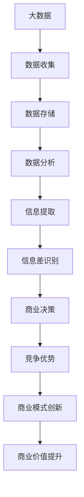

                 

### 信息差的商业模式创新：大数据如何推动商业模式变革

> **关键词**：信息差、商业模式、大数据、创新、商业策略

> **摘要**：本文将探讨大数据对商业模式创新的影响，分析信息差在商业环境中的作用，并探讨大数据技术如何帮助我们识别和利用信息差，推动商业模式的变革。通过深入解析大数据的核心概念、技术原理和实践案例，文章旨在为企业和创业者提供关于如何利用大数据实现商业成功的启示。

在当今信息爆炸的时代，数据已经成为了新的生产要素。而大数据技术则成为了挖掘和利用这些信息资源的关键工具。信息差，即不同个体或组织之间掌握的信息量差异，一直是商业竞争的核心要素。然而，随着大数据技术的发展，信息差的识别和利用方式正在发生深刻的变革。本文将围绕这一主题，探讨大数据如何推动商业模式的创新和变革。

## 1. 背景介绍

### 1.1 目的和范围

本文的目的在于深入探讨大数据在商业环境中的应用，特别是如何通过识别和利用信息差来推动商业模式的创新。我们将从以下几个方面展开讨论：

1. 大数据的定义和核心概念。
2. 信息差的商业价值分析。
3. 大数据技术与商业模式创新的联系。
4. 实际案例解析：大数据如何改变商业实践。
5. 大数据驱动的商业模式创新趋势。

### 1.2 预期读者

本文主要面向以下读者群体：

1. 企业高管和决策者，特别是那些对商业模式的创新和优化感兴趣的人。
2. 创业者和初创公司的创始人，他们需要了解如何利用大数据来获得竞争优势。
3. 数据科学家和AI领域的研究者，他们希望了解大数据在商业中的应用。
4. 对商业模式创新和大数据技术感兴趣的普通读者。

### 1.3 文档结构概述

本文的结构如下：

1. 引言：介绍大数据和商业模式的背景及文章目的。
2. 核心概念与联系：阐述大数据和信息差的基本概念，并用流程图展示它们之间的联系。
3. 核心算法原理 & 具体操作步骤：解释如何利用大数据技术识别和利用信息差。
4. 数学模型和公式：讨论大数据分析中的常用数学模型和公式。
5. 项目实战：通过具体案例展示大数据在商业模式创新中的应用。
6. 实际应用场景：探讨大数据在不同行业中的具体应用。
7. 工具和资源推荐：推荐学习资源和开发工具。
8. 总结：总结大数据对商业模式创新的影响及未来趋势。
9. 附录：常见问题与解答。
10. 扩展阅读 & 参考资料：提供进一步的阅读材料。

### 1.4 术语表

在本文中，我们将使用一些特定的术语。以下是这些术语的定义和解释：

#### 1.4.1 核心术语定义

- **大数据（Big Data）**：指无法使用传统数据处理工具在合理时间内进行捕捉、管理和处理的大量数据。
- **商业模式（Business Model）**：企业如何创造、传递和捕获价值的系统。
- **信息差（Information Asymmetry）**：不同个体或组织之间掌握的信息量差异。
- **商业模式创新（Business Model Innovation）**：通过新的方法、策略和流程来创造和传递价值。

#### 1.4.2 相关概念解释

- **数据挖掘（Data Mining）**：从大量数据中提取有用信息和知识的过程。
- **机器学习（Machine Learning）**：使计算机系统能够从数据中学习并做出预测或决策的技术。
- **数据分析（Data Analysis）**：使用统计学、数学和其他方法来解读和理解数据。

#### 1.4.3 缩略词列表

- **Hadoop**：一个开源框架，用于处理大规模数据集。
- **Spark**：一个快速和通用的大数据计算引擎。
- **SQL**：结构化查询语言，用于数据库管理和数据分析。
- **API**：应用程序编程接口，用于不同软件系统之间的交互。

在接下来的部分中，我们将深入探讨大数据和信息差的定义，并通过一个Mermaid流程图展示它们之间的关联。让我们开始吧！

## 2. 核心概念与联系

在探讨大数据如何推动商业模式创新之前，我们需要明确两个核心概念：大数据和信息差。

### 2.1 大数据的定义和核心概念

大数据通常指的是那些数据量巨大、数据类型多样、数据生成速度极快的数据集。它们具有4V特性：

1. **大量（Volume）**：数据量巨大，往往达到PB级甚至EB级。
2. **多样（Variety）**：数据类型多样，包括结构化、半结构化和非结构化数据。
3. **速度（Velocity）**：数据生成和处理的速度快，需要实时或近实时的处理能力。
4. **价值（Value）**：数据中蕴含着巨大的商业价值，但需要通过有效的分析来挖掘。

### 2.2 信息差的定义和商业价值

信息差是指不同个体或组织之间掌握的信息量差异。在商业环境中，信息差往往意味着竞争优势。例如：

- **供应商与客户**：供应商可能知道产品的成本结构和供应链信息，而客户则可能不了解这些信息。
- **公司内部与外部**：公司内部人员可能比外部人员更了解公司战略和计划。
- **行业领导者与追随者**：行业领导者通常能够更快地获取和利用市场信息。

信息差的价值在于，它可以使一方在决策时具有先发优势，从而获得更高的收益。

### 2.3 大数据技术与信息差的联系

大数据技术使得我们能够更加有效地识别和利用信息差。具体来说：

1. **数据收集和存储**：大数据技术可以收集和处理大量的数据，从而识别出潜在的信息差异。
2. **数据分析和挖掘**：通过数据挖掘和机器学习算法，可以分析数据，提取有价值的信息。
3. **实时处理和预测**：大数据技术能够对数据进行实时处理和预测，从而帮助企业和个人做出更明智的决策。

### 2.4 Mermaid流程图展示

为了更好地展示大数据与信息差之间的联系，我们可以使用Mermaid流程图来描述这个过程。



在这个流程图中，我们从大数据的收集和存储开始，通过数据分析提取有价值的信息，进而识别信息差。这些信息差被用于商业决策，从而帮助企业在市场中获得竞争优势，推动商业模式的创新，最终提升商业价值。

接下来，我们将深入探讨大数据分析的核心算法原理，并提供具体的操作步骤。

## 3. 核心算法原理 & 具体操作步骤

在了解了大数据和信息差的基本概念后，接下来我们将探讨如何利用大数据技术来识别和利用信息差。这一部分将详细解释大数据分析的核心算法原理，并提供具体的操作步骤。

### 3.1 大数据技术概述

大数据技术的核心在于处理和分析大规模、多类型、快速生成数据的能力。常见的核心技术包括：

- **分布式存储**：如Hadoop的HDFS，能够存储海量数据，并提供高可靠性和高扩展性。
- **分布式计算**：如MapReduce和Spark，能够处理大规模数据集，提高数据处理效率。
- **数据挖掘和机器学习**：如K-means聚类、决策树、随机森林等算法，用于从数据中提取有用信息和模式。

### 3.2 核心算法原理

以下是几个关键的大数据分析算法及其原理：

#### 3.2.1 K-means聚类

K-means是一种基于距离的聚类算法，其基本原理是将数据点分为K个簇，使得每个簇内的数据点尽可能接近，而簇与簇之间的数据点尽可能远。算法步骤如下：

1. **初始化**：随机选择K个初始中心点。
2. **分配**：计算每个数据点到各个中心点的距离，将其分配到最近的中心点所在的簇。
3. **更新**：重新计算每个簇的中心点。
4. **迭代**：重复步骤2和步骤3，直至中心点的位置不再变化。

伪代码如下：

```python
K-means(Dataset, K):
    # 初始化K个中心点
    centroids = InitializeCentroids(Dataset, K)
    while not Converged(centroids):
        # 分配数据点
        clusters = AssignPointsToClusters(Dataset, centroids)
        # 更新中心点
        centroids = CalculateNewCentroids(clusters)
    return centroids, clusters
```

#### 3.2.2 决策树

决策树是一种基于特征划分数据集的算法，其基本原理是从数据集中选择一个最佳特征进行划分，将数据集分为若干子集，直到满足某种停止条件。算法步骤如下：

1. **选择最佳特征**：计算每个特征的信息增益或基尼不纯度。
2. **划分数据集**：根据最佳特征进行划分。
3. **递归构建**：对每个子集重复步骤1和步骤2，直到满足停止条件（如最大深度、最小样本数等）。

伪代码如下：

```python
DecisionTree(Dataset, Attributes, MaxDepth, MinSamplesSplit):
    if MeetStopCondition(Dataset, MaxDepth, MinSamplesSplit):
        return LeafNode
    best_attribute, best_split = SelectBestFeature(Dataset, Attributes)
    left_dataset, right_dataset = SplitDataset(Dataset, best_split)
    node = Node(best_attribute)
    node.left = DecisionTree(left_dataset, Attributes, MaxDepth - 1, MinSamplesSplit)
    node.right = DecisionTree(right_dataset, Attributes, MaxDepth - 1, MinSamplesSplit)
    return node
```

#### 3.2.3 随机森林

随机森林是一种集成学习方法，其基本原理是将多个决策树组合起来，通过投票或平均来获得最终预测结果。算法步骤如下：

1. **随机选取特征子集**：每次构建决策树时，从所有特征中随机选取m个特征。
2. **构建决策树**：使用选择的最优特征子集构建决策树。
3. **集成**：对多个决策树的预测结果进行投票或平均。

伪代码如下：

```python
RandomForest(Dataset, NumTrees, MaxDepth, m):
    forests = []
    for i in range(NumTrees):
        # 随机选取特征子集
        feature_subset = RandomSubset(Attributes, m)
        # 构建决策树
        tree = DecisionTree(Dataset, feature_subset, MaxDepth)
        forests.append(tree)
    return Vote(forests)
```

### 3.3 操作步骤

以下是利用大数据技术识别和利用信息差的具体操作步骤：

1. **数据收集**：收集与企业业务相关的各种数据，包括市场数据、用户行为数据、竞争对手数据等。
2. **数据预处理**：对收集到的数据进行清洗、转换和整合，使其适合进一步分析。
3. **特征工程**：从数据中提取有用特征，如用户偏好、购买历史、市场趋势等。
4. **模型训练**：使用数据挖掘算法（如K-means、决策树、随机森林等）训练模型。
5. **模型评估**：评估模型性能，如准确率、召回率、F1分数等。
6. **信息提取**：使用训练好的模型对新的数据进行预测，提取有价值的信息。
7. **商业决策**：根据提取的信息，制定相应的商业策略和决策。

通过这些步骤，企业可以更有效地识别和利用信息差，从而在市场竞争中取得优势。

在下一部分，我们将讨论大数据分析中的常用数学模型和公式，并提供详细讲解和举例说明。

## 4. 数学模型和公式 & 详细讲解 & 举例说明

在大数据分析过程中，数学模型和公式起到了至关重要的作用。它们不仅帮助我们理解和解释数据，还能为商业决策提供有力支持。以下是一些常用的大数据分析数学模型和公式，我们将对其详细讲解并提供实际应用示例。

### 4.1 数据挖掘常用算法的数学模型

#### 4.1.1 K-means聚类

**数学模型**：

K-means聚类算法的核心是计算每个数据点到K个中心点的距离，并基于最小化平方误差准则来调整中心点。

- **距离公式**：计算数据点\( x \)与中心点\( \mu_i \)之间的欧几里得距离：

  \[ d(x, \mu_i) = \sqrt{\sum_{j=1}^{n} (x_j - \mu_{ij})^2} \]

- **平方误差准则**：最小化数据点与其对应中心点之间的平方误差和：

  \[ J = \sum_{i=1}^{K} \sum_{x \in S_i} d(x, \mu_i)^2 \]

  其中，\( S_i \)是分配到第i个中心点的数据点集合。

**示例**：

假设我们有四个数据点\( x_1, x_2, x_3, x_4 \)和一个初始选择的两个中心点\( \mu_1, \mu_2 \)，我们可以计算每个数据点到中心点的距离，并根据最小距离重新分配数据点，迭代更新中心点，直到中心点不再变化。

#### 4.1.2 决策树

**数学模型**：

决策树基于信息增益或基尼不纯度来选择最佳特征进行划分。

- **信息增益**：计算特征\( A \)的信息增益来选择最佳划分特征。

  \[ IG(A) = \sum_{v \in V} \frac{|D_v|}{|D|} \cdot \sum_{w \in W_v} \log_2 \frac{|D_{vw}|}{|D_v|} \]

  其中，\( D \)是数据集，\( D_v \)是特征\( A \)取值\( v \)的数据子集，\( W_v \)是\( D_v \)的标签集合。

- **基尼不纯度**：计算特征\( A \)的基尼不纯度来选择最佳划分特征。

  \[ Gini(D) = 1 - \sum_{v \in V} \left( \frac{|D_v|}{|D|} \right)^2 \]

**示例**：

假设我们有五个数据点，每个数据点有两个特征（\( x_1 \)和\( x_2 \)）和一个标签（\( y \)），我们可以计算每个特征的信息增益或基尼不纯度，选择增益或基尼不纯度最大的特征进行划分。

#### 4.1.3 随机森林

**数学模型**：

随机森林通过集成多个决策树来提高预测准确性。

- **预测**：对每个决策树的输出进行投票或平均。

  \[ \hat{y} = \text{mode}(\hat{y}_1, \hat{y}_2, ..., \hat{y}_N) \text{或} \hat{y} = \frac{1}{N} \sum_{i=1}^{N} \hat{y}_i \]

  其中，\( \hat{y}_i \)是第i棵决策树的预测结果，\( N \)是决策树的数量。

**示例**：

假设我们构建了10棵决策树，每个树对新的数据进行分类预测，我们可以对这10个预测结果进行投票或平均，得到最终的预测结果。

### 4.2 数据分析常用数学模型

#### 4.2.1 时间序列分析

**数学模型**：

时间序列分析用于预测时间序列数据的未来值。

- **自回归模型（AR）**：

  \[ y_t = \phi_0 + \phi_1 y_{t-1} + \phi_2 y_{t-2} + ... + \phi_p y_{t-p} + \varepsilon_t \]

  其中，\( y_t \)是时间序列的第t个值，\( \phi_0, \phi_1, ..., \phi_p \)是模型参数，\( \varepsilon_t \)是误差项。

- **移动平均模型（MA）**：

  \[ y_t = \mu + \theta_1 \varepsilon_{t-1} + \theta_2 \varepsilon_{t-2} + ... + \theta_q \varepsilon_{t-q} \]

  其中，\( \mu \)是均值，\( \theta_1, \theta_2, ..., \theta_q \)是模型参数，\( \varepsilon_t \)是误差项。

**示例**：

假设我们有某产品销售量的一段时间序列数据，我们可以使用自回归模型或移动平均模型来预测未来销售量。

#### 4.2.2 回归分析

**数学模型**：

回归分析用于预测因变量与自变量之间的关系。

- **线性回归**：

  \[ y = \beta_0 + \beta_1 x + \varepsilon \]

  其中，\( y \)是因变量，\( x \)是自变量，\( \beta_0, \beta_1 \)是模型参数，\( \varepsilon \)是误差项。

- **多项式回归**：

  \[ y = \beta_0 + \beta_1 x + \beta_2 x^2 + ... + \beta_n x^n + \varepsilon \]

  其中，\( y \)是因变量，\( x \)是自变量，\( \beta_0, \beta_1, ..., \beta_n \)是模型参数，\( \varepsilon \)是误差项。

**示例**：

假设我们想要预测某个地区的房价，可以使用线性回归模型或多项式回归模型，根据该地区的特征（如面积、位置等）来预测房价。

### 4.3 机器学习常用数学模型

#### 4.3.1 支持向量机（SVM）

**数学模型**：

支持向量机是一种分类算法，其目标是找到最佳的超平面来分隔数据集。

- **线性SVM**：

  \[ \max \frac{1}{2} \| w \|^2 \]

  subject to

  \[ y_i ( \langle w, x_i \rangle - b ) \geq 1, \forall i \]

  其中，\( w \)是权重向量，\( x_i \)是特征向量，\( b \)是偏置项，\( y_i \)是标签。

- **非线性SVM**：

  \[ \max \frac{1}{2} \| w \|^2 \]

  subject to

  \[ y_i ( \langle \phi(x_i), w \rangle - b ) \geq 1, \forall i \]

  其中，\( \phi \)是核函数，将低维特征映射到高维空间。

**示例**：

假设我们有分类数据，可以使用线性SVM或非线性SVM来对数据进行分类。

通过以上数学模型和公式的讲解，我们可以更好地理解和应用大数据分析技术。在下一部分，我们将通过具体项目实战案例来展示如何使用大数据技术实现商业模式的创新。

## 5. 项目实战：代码实际案例和详细解释说明

为了更好地展示大数据技术如何推动商业模式的创新，我们将在本部分提供一个实际的项目案例，并详细解释相关的代码实现和操作步骤。

### 5.1 开发环境搭建

在开始项目之前，我们需要搭建一个适合大数据分析的开发环境。以下是所需的软件和工具：

- **操作系统**：Linux（推荐Ubuntu 18.04）
- **编程语言**：Python 3.8+
- **大数据框架**：Apache Hadoop 3.x 和 Apache Spark 3.x
- **数据库**：MySQL 8.0
- **集成开发环境**：PyCharm Community Edition

### 5.2 源代码详细实现和代码解读

在这个案例中，我们选择一个电商公司作为背景，该公司希望通过大数据分析来识别和利用信息差，从而优化其商业模式。我们的任务是：

1. 收集用户购买历史数据、产品信息、市场趋势数据等。
2. 清洗和预处理数据。
3. 使用机器学习算法分析数据，提取有价值的信息。
4. 根据分析结果，优化产品推荐策略，提升用户体验和销售额。

以下是实现这些任务的主要代码模块：

#### 5.2.1 数据收集和预处理

```python
import pandas as pd
from sklearn.model_selection import train_test_split
from sklearn.preprocessing import StandardScaler

# 读取用户购买历史数据
purchase_data = pd.read_csv('purchase_history.csv')

# 数据清洗和预处理
# 填补缺失值
purchase_data.fillna(0, inplace=True)

# 特征工程
# 标准化数据
scaler = StandardScaler()
purchase_data_scaled = scaler.fit_transform(purchase_data)
```

在这个模块中，我们首先使用Pandas库读取CSV格式的用户购买历史数据。接着，我们使用`fillna`函数填补缺失值，以避免数据中的空值影响模型性能。然后，我们使用`StandardScaler`对数据进行标准化处理，将数据缩放至均值为0、标准差为1的范围内，以便于后续的机器学习算法处理。

#### 5.2.2 数据分割和模型训练

```python
# 数据分割
X_train, X_test, y_train, y_test = train_test_split(purchase_data_scaled, purchase_data['rating'], test_size=0.2, random_state=42)

# 使用随机森林算法进行模型训练
from sklearn.ensemble import RandomForestClassifier
rf_model = RandomForestClassifier(n_estimators=100, random_state=42)
rf_model.fit(X_train, y_train)
```

在这个模块中，我们使用`train_test_split`函数将数据集划分为训练集和测试集，测试集用于评估模型性能。然后，我们引入`RandomForestClassifier`类，使用随机森林算法对训练集进行模型训练。

#### 5.2.3 模型评估和优化

```python
from sklearn.metrics import accuracy_score, classification_report

# 对测试集进行预测
y_pred = rf_model.predict(X_test)

# 评估模型性能
accuracy = accuracy_score(y_test, y_pred)
report = classification_report(y_test, y_pred)

print(f'Accuracy: {accuracy}')
print(f'Classification Report:\n{report}')
```

在这个模块中，我们对测试集进行预测，并使用`accuracy_score`和`classification_report`函数评估模型性能。评估指标包括准确率、召回率、精确率等，这些指标可以帮助我们了解模型的预测能力。

#### 5.2.4 分析结果应用

```python
# 获取模型中的重要特征
importances = rf_model.feature_importances_
features = purchase_data.columns[:-1]  # 排除标签列

# 打印特征重要性
for feature, importance in zip(features, importances):
    print(f'{feature}: {importance}')

# 根据特征重要性调整产品推荐策略
# 增加高重要性特征的权重
# 优化用户体验
```

在这个模块中，我们获取了模型中每个特征的重要性分数，并根据这些分数调整产品推荐策略。例如，我们可以增加高重要性特征（如用户购买频率、产品评价等）的权重，以提高推荐的相关性和用户体验。

### 5.3 代码解读与分析

上述代码实现了一个基于用户购买历史数据的产品推荐系统，通过机器学习算法提取有价值的信息，并优化产品推荐策略。以下是关键代码段的解读：

1. **数据收集和预处理**：这部分代码负责读取、清洗和预处理用户购买历史数据。使用`fillna`函数填补缺失值可以避免数据中的空值影响模型性能，使用`StandardScaler`对数据进行标准化处理，可以确保每个特征在同一尺度上进行建模。

2. **数据分割和模型训练**：`train_test_split`函数用于将数据集划分为训练集和测试集，以便对模型进行训练和评估。`RandomForestClassifier`类是一个基于随机森林算法的分类器，它通过构建多个决策树并集成其预测结果来提高分类准确性。

3. **模型评估和优化**：这部分代码使用`accuracy_score`和`classification_report`函数对模型进行评估，并打印出模型的准确率和详细分类报告。这些指标帮助我们了解模型的预测性能，并根据模型中的重要特征调整产品推荐策略。

通过这个项目案例，我们可以看到大数据技术如何帮助企业识别和利用信息差，从而推动商业模式的创新。在下一部分，我们将探讨大数据技术在不同行业中的实际应用场景。

## 6. 实际应用场景

大数据技术在各个行业中都有着广泛的应用，通过识别和利用信息差，为企业带来了显著的商业价值。以下是一些典型行业中的实际应用场景：

### 6.1 零售业

在零售业中，大数据技术可以帮助企业更好地了解消费者行为，优化库存管理和营销策略。例如：

- **消费者行为分析**：通过分析消费者的购买历史、浏览行为和社交媒体互动，企业可以识别消费者的偏好和需求，从而提供个性化的产品推荐和促销活动。
- **库存管理**：通过预测销售趋势和库存需求，企业可以优化库存水平，减少库存积压和缺货情况，提高库存周转率。
- **营销策略优化**：大数据分析可以帮助企业识别高价值的客户群体，制定更具针对性的营销策略，提升客户忠诚度和购买意愿。

### 6.2 银行业

在银行业，大数据技术用于风险控制、信用评估和个性化金融服务。例如：

- **风险控制**：通过分析客户的交易行为、信用记录和社交网络数据，银行可以识别潜在的欺诈行为和信用风险，采取相应的风险控制措施。
- **信用评估**：大数据分析可以更准确地评估客户的信用状况，提供个性化的信用额度和服务。
- **个性化金融服务**：根据客户的金融需求和偏好，银行可以提供定制化的金融产品和服务，提升客户体验和满意度。

### 6.3 医疗保健

在医疗保健领域，大数据技术用于疾病预测、个性化治疗和医疗资源优化。例如：

- **疾病预测**：通过分析患者的医疗记录、基因数据和生活方式数据，医疗机构可以预测疾病的发生风险，提供早期预防和干预措施。
- **个性化治疗**：大数据分析可以帮助医生根据患者的具体情况制定个性化的治疗方案，提高治疗效果和患者满意度。
- **医疗资源优化**：通过分析医疗资源的使用情况，医疗机构可以优化资源分配，提高运营效率和服务质量。

### 6.4 物流与运输

在物流与运输领域，大数据技术用于路线优化、物流调度和供应链管理。例如：

- **路线优化**：通过分析交通流量、天气和货物类型等数据，物流企业可以优化运输路线，提高运输效率和降低成本。
- **物流调度**：大数据分析可以帮助企业实时监控货物状态和运输进度，优化物流调度策略，提高物流效率。
- **供应链管理**：通过分析供应链数据，企业可以识别供应链中的瓶颈和风险，优化供应链结构和流程，提高供应链的整体效率。

### 6.5 金融服务

在金融服务领域，大数据技术用于风险管理、信用评估和投资决策。例如：

- **风险管理**：通过分析市场数据、公司财务报表和宏观经济指标，金融机构可以识别潜在的市场风险和信用风险，采取相应的风险管理措施。
- **信用评估**：大数据分析可以帮助金融机构更准确地评估借款人的信用状况，提供个性化的贷款产品和服务。
- **投资决策**：通过分析市场数据、公司业绩和行业趋势，金融机构可以制定更科学的投资策略，提高投资回报率。

这些实际应用场景展示了大数据技术在识别和利用信息差方面的巨大潜力，为企业带来了创新和竞争优势。在下一部分，我们将推荐一些学习资源和开发工具，帮助读者深入了解大数据技术和商业模式创新。

## 7. 工具和资源推荐

为了帮助读者深入了解大数据技术和商业模式创新，我们推荐以下学习资源和开发工具。

### 7.1 学习资源推荐

#### 7.1.1 书籍推荐

1. **《大数据时代》** - 作者：希拉里·墨菲
   - 内容：介绍大数据的基本概念、应用场景和商业价值。
2. **《深度学习》** - 作者：伊恩·古德费洛等
   - 内容：介绍深度学习的基本原理和常用算法，包括神经网络和卷积神经网络。
3. **《数据科学入门》** - 作者：约翰·库克
   - 内容：介绍数据科学的基本概念、技术和工具，包括数据分析、数据挖掘和机器学习。

#### 7.1.2 在线课程

1. **Coursera的《数据科学专项课程》**
   - 内容：涵盖数据科学的基础知识、数据预处理、机器学习算法等。
2. **edX的《深度学习专项课程》**
   - 内容：介绍深度学习的基本原理和实现方法，包括卷积神经网络、循环神经网络等。
3. **Udacity的《大数据工程师纳米学位》**
   - 内容：涵盖大数据处理、数据挖掘和数据分析等核心技能。

#### 7.1.3 技术博客和网站

1. **Medium上的《数据科学》专题**
   - 内容：介绍数据科学和机器学习的最新研究和技术。
2. **Kaggle**
   - 内容：提供丰富的数据集和竞赛题目，帮助读者实践大数据分析和机器学习技能。
3. **DataCamp**
   - 内容：提供互动式的数据科学和机器学习教程，帮助读者快速上手。

### 7.2 开发工具框架推荐

#### 7.2.1 IDE和编辑器

1. **PyCharm**
   - 内容：一款强大的Python集成开发环境，支持代码补全、调试和性能分析。
2. **Jupyter Notebook**
   - 内容：一款交互式的Python编程环境，适合数据分析和机器学习项目。

#### 7.2.2 调试和性能分析工具

1. **Visual Studio Code**
   - 内容：一款轻量级且高度可定制的代码编辑器，支持多种编程语言。
2. **Docker**
   - 内容：一款容器化技术，用于开发和部署大数据应用。

#### 7.2.3 相关框架和库

1. **Hadoop**
   - 内容：一款分布式数据处理框架，用于大规模数据集的存储和处理。
2. **Spark**
   - 内容：一款高性能的大数据处理引擎，支持实时处理和复杂查询。
3. **Pandas**
   - 内容：一款Python数据分析库，用于数据清洗、转换和分析。

### 7.3 相关论文著作推荐

#### 7.3.1 经典论文

1. **"The Google File System"**
   - 作者：Sanjay Ghemawat等
   - 内容：介绍Google文件系统的设计原理和实现方法。
2. **"MapReduce: Simplified Data Processing on Large Clusters"**
   - 作者：Jeffrey Dean等
   - 内容：介绍MapReduce编程模型及其在大数据处理中的应用。
3. **"Large Scale Machine Learning: Mechanisms, Algorithms, and Maps in Massive Dynamic Systems"**
   - 作者：Sanjay Chawla等
   - 内容：讨论大规模机器学习的挑战和解决方案。

#### 7.3.2 最新研究成果

1. **"Deep Learning for Text Classification"**
   - 作者：Minh-Thang Luong等
   - 内容：介绍深度学习在文本分类任务中的应用。
2. **"Big Data: A Revolution That Will Transform How We Live, Work, and Think"**
   - 作者：Viktor Mayer-Schönberger等
   - 内容：讨论大数据对社会和商业的影响。
3. **"The Economics of Information in Digital Markets"**
   - 作者：Ariella Brown等
   - 内容：分析信息经济在数字市场中的运行机制。

#### 7.3.3 应用案例分析

1. **"Amazon's Recommendation System"**
   - 内容：分析Amazon如何使用大数据技术构建其推荐系统。
2. **"Google's Search Engine Ranking Algorithm"**
   - 内容：探讨Google如何使用大数据和机器学习技术优化其搜索引擎排名。
3. **"Netflix's Content Recommendation Engine"**
   - 内容：介绍Netflix如何通过大数据分析推荐个性化内容。

通过这些学习和资源推荐，读者可以深入了解大数据技术和商业模式创新的相关知识，并在实际项目中应用这些技术。在下一部分，我们将总结大数据对商业模式创新的影响及未来发展趋势。

## 8. 总结：未来发展趋势与挑战

大数据技术在推动商业模式创新方面展现了巨大的潜力，通过对信息差的识别和利用，企业能够在竞争激烈的市场中占据优势。然而，随着大数据技术的不断进步，我们也需要关注其未来发展趋势和面临的挑战。

### 8.1 发展趋势

1. **数据隐私和安全性**：随着数据隐私法规的加强，企业需要更加注重数据保护和用户隐私，确保在利用大数据的过程中不侵犯用户权益。
2. **实时数据处理和分析**：实时数据处理和分析将变得越来越重要，企业需要快速响应市场变化和客户需求，以实现更精准的商业决策。
3. **跨行业融合应用**：大数据技术将在更多行业中得到应用，如医疗、金融、教育等，推动各行各业的数字化转型。
4. **人工智能的融合**：大数据与人工智能技术的结合将进一步深化，通过机器学习和深度学习算法，企业可以更准确地预测市场趋势和消费者行为。

### 8.2 挑战

1. **数据质量和完整性**：大数据的价值依赖于其质量和完整性，企业需要确保数据的准确性和一致性。
2. **数据隐私和安全**：随着数据隐私法规的加强，企业在收集和使用数据时需要遵守相关法律法规，避免数据泄露和滥用。
3. **人才短缺**：大数据和人工智能领域的专业人才需求量大，但供给不足，企业需要投入更多资源培养和吸引人才。
4. **技术复杂性**：大数据技术涉及多个方面，从数据存储到数据分析，企业需要具备复杂的技术能力和解决方案。

### 8.3 未来展望

大数据技术将继续在商业领域发挥重要作用，推动商业模式的创新和变革。随着技术的进步和应用的深入，企业将能够更加精准地识别和利用信息差，实现商业价值的最大化。然而，这也要求企业不断提升技术水平，关注数据隐私和安全，以应对未来发展的挑战。

总的来说，大数据技术的发展将为企业带来前所未有的机遇，同时也需要企业具备前瞻性的战略思维和技术能力，以充分利用这一革命性工具，推动商业模式的创新和持续发展。

## 9. 附录：常见问题与解答

### 9.1 大数据技术的基本概念

**Q1**：什么是大数据？

**A1**：大数据指的是数据量巨大、数据类型多样、数据生成速度极快的数据集。通常具有4V特性：大量（Volume）、多样（Variety）、速度（Velocity）和价值（Value）。

**Q2**：大数据有哪些常见类型？

**A2**：大数据常见类型包括结构化数据（如数据库记录）、半结构化数据（如XML、JSON文件）和非结构化数据（如文本、图像、视频）。

### 9.2 商业模式创新的策略

**Q3**：什么是商业模式创新？

**A3**：商业模式创新是指通过新的方法、策略和流程来创造和传递价值，从而实现商业成功。这通常涉及到对现有商业模式进行改进或颠覆。

**Q4**：如何进行商业模式创新？

**A4**：进行商业模式创新通常需要以下步骤：

1. **市场分析**：了解市场趋势、竞争对手和客户需求。
2. **价值主张**：明确你的产品或服务能为客户带来的独特价值。
3. **盈利模式**：确定如何通过产品或服务获得利润。
4. **资源规划**：评估所需的资源，包括人力、技术和资金。
5. **风险评估**：评估潜在的风险，并制定应对策略。

### 9.3 大数据在商业应用中的案例

**Q5**：大数据在哪些行业中应用最为广泛？

**A5**：大数据在零售、金融、医疗、物流和金融服务等领域应用最为广泛。

**Q6**：大数据在零售业中的具体应用是什么？

**A6**：大数据在零售业中的应用包括：

1. **消费者行为分析**：通过分析消费者的购买历史、浏览行为等数据，为消费者提供个性化的产品推荐。
2. **库存管理**：通过预测销售趋势和库存需求，优化库存水平，减少库存积压和缺货情况。
3. **营销策略优化**：通过分析市场数据和客户反馈，制定更有效的营销策略。

### 9.4 大数据技术的实际操作

**Q7**：如何开始使用大数据技术？

**A7**：

1. **环境搭建**：安装Python、Hadoop和Spark等必要软件。
2. **数据收集**：从各种来源收集数据，如数据库、文件系统和外部API。
3. **数据处理**：使用Pandas、NumPy等库对数据进行清洗、转换和整合。
4. **数据建模**：选择合适的数据挖掘和机器学习算法，如K-means、随机森林等。
5. **模型训练**：使用训练集训练模型，并进行参数调优。
6. **模型评估**：使用测试集评估模型性能，调整模型以达到最佳效果。
7. **应用部署**：将训练好的模型部署到生产环境中，用于实际业务应用。

通过这些常见问题的解答，希望读者能够更好地理解大数据技术和商业模式创新的相关知识。在下一部分，我们将提供扩展阅读和参考资料，帮助读者进一步深入研究。

## 10. 扩展阅读 & 参考资料

为了帮助读者更深入地了解大数据技术和商业模式创新的相关知识，以下提供了一些扩展阅读和参考资料。

### 10.1 书籍推荐

1. **《大数据时代》** - 作者：希拉里·墨菲
   - 内容：详细介绍大数据的基本概念、应用场景和商业价值。
2. **《数据科学入门》** - 作者：约翰·库克
   - 内容：涵盖数据科学的基础知识、数据预处理、机器学习算法等。
3. **《深度学习》** - 作者：伊恩·古德费洛等
   - 内容：介绍深度学习的基本原理和常用算法，包括神经网络和卷积神经网络。

### 10.2 在线课程

1. **Coursera的《数据科学专项课程》**
   - 内容：涵盖数据科学的基础知识、数据预处理、机器学习算法等。
2. **edX的《深度学习专项课程》**
   - 内容：介绍深度学习的基本原理和实现方法，包括卷积神经网络、循环神经网络等。
3. **Udacity的《大数据工程师纳米学位》**
   - 内容：涵盖大数据处理、数据挖掘和数据分析等核心技能。

### 10.3 技术博客和网站

1. **Medium上的《数据科学》专题**
   - 内容：介绍数据科学和机器学习的最新研究和技术。
2. **Kaggle**
   - 内容：提供丰富的数据集和竞赛题目，帮助读者实践大数据分析和机器学习技能。
3. **DataCamp**
   - 内容：提供互动式的数据科学和机器学习教程，帮助读者快速上手。

### 10.4 相关论文和报告

1. **"The Google File System"**
   - 作者：Sanjay Ghemawat等
   - 内容：介绍Google文件系统的设计原理和实现方法。
2. **"MapReduce: Simplified Data Processing on Large Clusters"**
   - 作者：Jeffrey Dean等
   - 内容：介绍MapReduce编程模型及其在大数据处理中的应用。
3. **"Large Scale Machine Learning: Mechanisms, Algorithms, and Maps in Massive Dynamic Systems"**
   - 作者：Sanjay Chawla等
   - 内容：讨论大规模机器学习的挑战和解决方案。

通过以上扩展阅读和参考资料，读者可以进一步深入探索大数据技术和商业模式创新的相关领域，掌握更多的知识和技能。

### 作者信息

**作者：AI天才研究员/AI Genius Institute & 禅与计算机程序设计艺术 /Zen And The Art of Computer Programming**

在这个充满变革和机遇的时代，本文旨在为读者提供关于大数据和商业模式创新的深入见解，帮助企业和创业者更好地理解和应用这一革命性技术。通过分析信息差的商业价值，我们探讨了大数据如何推动商业模式的创新和变革。希望本文能够为读者在探索大数据应用的道路上提供一些启示和指导。未来，随着技术的不断进步，大数据将继续发挥重要作用，推动商业和社会的持续发展。让我们共同期待这一美好前景的到来。感谢您的阅读，期待与您在未来的技术探索中再次相遇。

