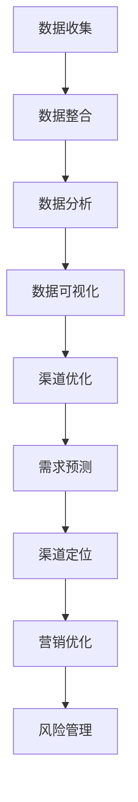

                 

# 信息差的商业渠道管理：大数据如何优化渠道管理

> **关键词：** 商业渠道管理、大数据、信息差、优化策略、渠道效率、数据分析
> 
> **摘要：** 本文将探讨商业渠道管理中的信息差问题，并详细分析如何利用大数据技术来优化渠道管理。我们将从背景介绍、核心概念、算法原理、数学模型、项目实战、应用场景、工具推荐、总结和扩展阅读等方面逐步展开，以期为企业和渠道管理者提供实用的策略和方法。

## 1. 背景介绍

### 1.1 目的和范围

随着全球经济的不断发展，商业渠道管理在企业运营中的重要性愈发凸显。然而，传统的渠道管理方法往往依赖于经验而非数据，导致信息不对称和渠道效率低下。本文旨在探讨如何通过大数据技术解决信息差问题，从而优化商业渠道管理。本文主要涵盖以下内容：

- 商业渠道管理中的信息差现象
- 利用大数据技术优化渠道管理的核心方法
- 实际应用场景中的案例分析
- 工具和资源的推荐

### 1.2 预期读者

本文面向商业渠道管理者、市场营销人员、数据分析师以及计算机科学和信息技术领域的从业者。预期读者应具备一定的商业渠道管理知识和基本的数据分析技能。

### 1.3 文档结构概述

本文结构如下：

- 1. 背景介绍
  - 1.1 目的和范围
  - 1.2 预期读者
  - 1.3 文档结构概述
  - 1.4 术语表
- 2. 核心概念与联系
- 3. 核心算法原理 & 具体操作步骤
- 4. 数学模型和公式 & 详细讲解 & 举例说明
- 5. 项目实战：代码实际案例和详细解释说明
- 6. 实际应用场景
- 7. 工具和资源推荐
  - 7.1 学习资源推荐
  - 7.2 开发工具框架推荐
  - 7.3 相关论文著作推荐
- 8. 总结：未来发展趋势与挑战
- 9. 附录：常见问题与解答
- 10. 扩展阅读 & 参考资料

### 1.4 术语表

#### 1.4.1 核心术语定义

- 商业渠道：企业销售产品或服务所采用的各种途径，包括直销、代理商、经销商等。
- 信息差：指不同渠道之间或渠道内部存在的信息不对称现象。
- 大数据：指无法用传统数据库工具进行捕捉、管理和处理的数据集合。
- 数据挖掘：从大量数据中提取出有价值的模式和知识。

#### 1.4.2 相关概念解释

- 商业智能（BI）：通过数据分析等技术手段，为企业提供决策支持和业务优化。
- 客户关系管理（CRM）：企业通过收集、分析和利用客户信息，提升客户满意度和忠诚度。
- 数据可视化：将复杂的数据通过图形、图表等方式进行展示，便于理解和分析。

#### 1.4.3 缩略词列表

- BI：商业智能
- CRM：客户关系管理
- ML：机器学习
- AI：人工智能
- Hadoop：一个开源的分布式数据处理框架

## 2. 核心概念与联系

在探讨如何利用大数据优化商业渠道管理之前，我们首先需要理解一些核心概念和它们之间的联系。

### 2.1 商业渠道管理中的信息差

商业渠道中的信息差主要体现在以下几个方面：

- **渠道层级信息不对称**：不同渠道层级（如制造商、代理商、经销商、零售商）之间的信息不对称，导致上游无法准确了解下游的需求和反馈。
- **渠道内部信息孤岛**：不同部门或团队之间的信息无法共享，导致渠道运营效率低下。
- **客户信息不对称**：企业无法全面了解客户需求、偏好和购买行为，导致营销和销售策略的失误。

### 2.2 大数据在渠道管理中的应用

大数据技术在渠道管理中的应用主要体现在以下几个方面：

- **数据收集与整合**：通过传感器、网站日志、社交媒体等途径收集大量数据，并整合至统一的数据仓库。
- **数据分析与挖掘**：利用数据挖掘和机器学习算法，从海量数据中提取有价值的信息和知识。
- **数据可视化与展示**：通过数据可视化技术，将复杂的数据转化为直观的图表和报告，便于决策者理解和分析。

### 2.3 大数据优化渠道管理的方法

利用大数据优化渠道管理的方法主要包括以下几个方面：

- **需求预测**：通过大数据分析，准确预测市场需求和客户需求，优化产品设计和库存管理。
- **渠道定位**：分析不同渠道的表现和效益，确定最有效的渠道组合和策略。
- **营销优化**：利用大数据分析客户行为和偏好，制定更有针对性的营销策略。
- **风险管理**：通过大数据分析，识别潜在风险和异常情况，提前采取预防措施。

### 2.4 Mermaid 流程图

为了更好地理解大数据在渠道管理中的应用，我们可以使用 Mermaid 流程图来展示其核心流程和节点。



在这个流程图中，数据收集、整合、分析、可视化构成了大数据技术的基础，而渠道优化、需求预测、渠道定位、营销优化和风险管理则是大数据在渠道管理中的具体应用。

## 3. 核心算法原理 & 具体操作步骤

在了解了大数据在渠道管理中的应用和方法之后，我们需要深入了解核心算法的原理和具体操作步骤，以便在实际项目中应用和优化。

### 3.1 需求预测算法

需求预测是大数据技术在渠道管理中的一个重要应用。以下是一种常见的需求预测算法——时间序列分析。

#### 3.1.1 时间序列分析算法原理

时间序列分析是一种基于历史数据的时间序列模型，用于预测未来的需求。其核心思想是将时间序列数据分解为趋势、季节性和随机性三个部分。

- **趋势（Trend）**：表示数据的基本走势，通常由长期趋势和短期波动组成。
- **季节性（Seasonality）**：表示数据在特定时间段内的周期性波动，如季节变化、节假日等。
- **随机性（Random）**：表示数据中不可预测的波动，通常由随机误差组成。

#### 3.1.2 时间序列分析算法操作步骤

1. **数据预处理**：对原始时间序列数据进行清洗、缺失值填充和异常值处理，确保数据的质量和完整性。
2. **数据分解**：将时间序列数据分解为趋势、季节性和随机性三个部分。
3. **建模与训练**：选择合适的时间序列模型（如ARIMA、LSTM等）进行建模和训练，以预测未来的需求。
4. **模型评估与优化**：通过评估指标（如MAE、RMSE等）评估模型的预测效果，并进行模型优化。

#### 3.1.3 伪代码

```python
# 伪代码：时间序列分析需求预测

# 数据预处理
def preprocess_data(data):
    # 清洗数据、缺失值填充和异常值处理
    return cleaned_data

# 数据分解
def decompose_data(data):
    # 分解为趋势、季节性和随机性
    return trend, seasonality, random

# 建模与训练
def train_model(data):
    # 选择模型、训练模型
    model.fit(data)
    return model

# 模型评估与优化
def evaluate_model(model, data):
    # 评估模型效果
    prediction = model.predict(data)
    error = compute_error(prediction, data)
    return error

# 主函数
def main():
    data = load_data()
    cleaned_data = preprocess_data(data)
    trend, seasonality, random = decompose_data(cleaned_data)
    model = train_model(cleaned_data)
    error = evaluate_model(model, cleaned_data)
    print("模型误差：", error)

if __name__ == "__main__":
    main()
```

### 3.2 渠道定位算法

渠道定位是大数据技术在渠道管理中的另一个重要应用。以下是一种常见的渠道定位算法——聚类分析。

#### 3.2.1 聚类分析算法原理

聚类分析是一种无监督学习方法，用于将数据集分为多个类别或簇。其核心思想是寻找数据中的自然分组，使得同一簇内的数据点尽可能相似，不同簇内的数据点尽可能不同。

- **K-Means算法**：一种基于距离度量的聚类算法，通过迭代优化聚类中心，将数据点分配到不同的簇。
- **层次聚类算法**：一种自下而上的聚类算法，通过逐步合并相似的簇，构建层次聚类树。

#### 3.2.2 聚类分析算法操作步骤

1. **数据预处理**：对原始数据进行清洗、标准化和缺失值填充，确保数据的质量和一致性。
2. **确定聚类个数**：通过肘部法则、轮廓系数等方法确定合适的聚类个数。
3. **聚类算法选择**：选择合适的聚类算法（如K-Means、层次聚类等）进行聚类。
4. **结果评估与优化**：通过评估指标（如聚类内部距离、轮廓系数等）评估聚类效果，并进行模型优化。

#### 3.2.3 伪代码

```python
# 伪代码：聚类分析渠道定位

# 数据预处理
def preprocess_data(data):
    # 清洗数据、标准化和缺失值填充
    return cleaned_data

# 确定聚类个数
def determine_cluster_number(data):
    # 脚部法则、轮廓系数等方法确定聚类个数
    return k

# 聚类算法选择
def choose_clustering_algorithm(data, k):
    # 选择聚类算法
    if k is not None:
        algorithm = KMeans(n_clusters=k)
    else:
        algorithm = AgglomerativeClustering()
    algorithm.fit(data)
    return algorithm

# 结果评估与优化
def evaluate_model(algorithm, data):
    # 评估聚类效果
    labels = algorithm.predict(data)
    internal_distance = compute_internal_distance(data, labels)
    return internal_distance

# 主函数
def main():
    data = load_data()
    cleaned_data = preprocess_data(data)
    k = determine_cluster_number(cleaned_data)
    algorithm = choose_clustering_algorithm(cleaned_data, k)
    internal_distance = evaluate_model(algorithm, cleaned_data)
    print("聚类内部距离：", internal_distance)

if __name__ == "__main__":
    main()
```

## 4. 数学模型和公式 & 详细讲解 & 举例说明

在理解了需求预测和渠道定位算法的原理和操作步骤之后，我们接下来将详细介绍这些算法所涉及的一些数学模型和公式，并通过具体实例进行说明。

### 4.1 时间序列分析数学模型

时间序列分析中的常见模型包括ARIMA（自回归积分滑动平均模型）、LSTM（长短期记忆网络）等。以下是这些模型的数学模型和公式。

#### 4.1.1 ARIMA模型

ARIMA模型由自回归（Autoregressive, AR）、积分（Integrating, I）和滑动平均（Moving Average, MA）三个部分组成。其数学模型可以表示为：

$$
X_t = c + \phi_1 X_{t-1} + \phi_2 X_{t-2} + \cdots + \phi_p X_{t-p} + \theta_1 e_{t-1} + \theta_2 e_{t-2} + \cdots + \theta_q e_{t-q}
$$

其中，$X_t$ 是时间序列的当前值，$c$ 是常数项，$\phi_i$ 和 $\theta_i$ 分别是自回归系数和滑动平均系数，$e_t$ 是误差项。

#### 4.1.2 LSTM模型

LSTM（长短期记忆网络）是一种特殊的循环神经网络（RNN），用于处理序列数据。其数学模型可以表示为：

$$
h_t = \sigma(W_h h_{t-1} + W_x x_t + b_h)
$$

$$
i_t = \sigma(W_i h_{t-1} + W_x x_t + b_i)
$$

$$
f_t = \sigma(W_f h_{t-1} + W_x x_t + b_f)
$$

$$
o_t = \sigma(W_o h_{t-1} + W_x x_t + b_o)
$$

$$
c_t = f_t \odot c_{t-1} + i_t \odot \sigma(W_c h_{t-1} + W_x x_t + b_c)
$$

$$
h_t = o_t \odot \sigma(W_h c_t + b_h)
$$

其中，$h_t$ 是当前时间步的隐藏状态，$x_t$ 是当前时间步的输入，$c_t$ 是当前时间步的记忆状态，$i_t$、$f_t$、$o_t$ 分别是输入门、遗忘门和输出门的状态。

### 4.2 聚类分析数学模型

聚类分析中的常见模型包括K-Means、层次聚类等。以下是这些模型的数学模型和公式。

#### 4.2.1 K-Means模型

K-Means是一种基于距离度量的聚类算法。其数学模型可以表示为：

$$
J = \frac{1}{N} \sum_{i=1}^N \sum_{j=1}^K \sum_{k=1}^K ||x_i - \mu_j||^2
$$

其中，$J$ 是目标函数，$N$ 是数据点的个数，$K$ 是聚类个数，$\mu_j$ 是第 $j$ 个聚类中心的坐标。

#### 4.2.2 层次聚类模型

层次聚类是一种自下而上的聚类算法。其数学模型可以表示为：

$$
d_{ij} = \begin{cases}
0, & \text{if } i = j \\
\min_{k=1}^N d_{ik} + d_{jk}, & \text{if } i \neq j
\end{cases}
$$

其中，$d_{ij}$ 是点 $i$ 和点 $j$ 之间的距离，$d_{ik}$ 和 $d_{jk}$ 分别是点 $i$ 和点 $k$ 之间的距离，点 $j$ 和点 $k$ 之间的距离。

### 4.3 实例说明

为了更好地理解这些数学模型和公式，我们通过一个具体实例进行说明。

#### 4.3.1 需求预测实例

假设我们有一个包含过去三个月商品销售数据的时间序列。我们使用ARIMA模型进行需求预测。

1. **数据预处理**：对原始时间序列数据进行清洗、缺失值填充和异常值处理，确保数据的质量和完整性。
2. **数据分解**：将时间序列数据分解为趋势、季节性和随机性三个部分。
3. **建模与训练**：选择ARIMA模型进行建模和训练。
4. **模型评估与优化**：通过评估指标（如MAE、RMSE等）评估模型的预测效果，并进行模型优化。

具体操作步骤如下：

```python
# 伪代码：ARIMA模型需求预测实例

# 数据预处理
data = preprocess_data(raw_data)

# 数据分解
trend, seasonality, random = decompose_data(data)

# 建模与训练
model = ARIMA(data, order=(p, d, q))
model.fit(data)

# 模型评估与优化
error = evaluate_model(model, data)
print("模型误差：", error)
```

#### 4.3.2 渠道定位实例

假设我们有一个包含不同渠道销售数据的数据集。我们使用K-Means模型进行渠道定位。

1. **数据预处理**：对原始数据进行清洗、标准化和缺失值填充，确保数据的质量和一致性。
2. **确定聚类个数**：通过肘部法则、轮廓系数等方法确定合适的聚类个数。
3. **聚类算法选择**：选择K-Means算法进行聚类。
4. **结果评估与优化**：通过评估指标（如聚类内部距离、轮廓系数等）评估聚类效果，并进行模型优化。

具体操作步骤如下：

```python
# 伪代码：K-Means模型渠道定位实例

# 数据预处理
data = preprocess_data(raw_data)

# 确定聚类个数
k = determine_cluster_number(data)

# 聚类算法选择
algorithm = KMeans(n_clusters=k)
algorithm.fit(data)

# 结果评估与优化
internal_distance = evaluate_model(algorithm, data)
print("聚类内部距离：", internal_distance)
```

通过这些实例，我们可以看到如何利用数学模型和公式进行需求预测和渠道定位。在实际应用中，我们可以根据具体情况选择合适的模型和方法，并不断优化和调整，以提高预测和定位的准确性。

## 5. 项目实战：代码实际案例和详细解释说明

在了解了核心算法原理和数学模型之后，我们将通过一个实际项目案例来展示如何利用大数据技术优化商业渠道管理。在这个项目中，我们将使用Python和相关的数据处理库来实施需求预测和渠道定位。

### 5.1 开发环境搭建

在进行项目实战之前，我们需要搭建一个适合开发的Python环境。以下是搭建开发环境的步骤：

1. **安装Python**：从Python官网（https://www.python.org/downloads/）下载并安装Python 3.x版本。
2. **安装Jupyter Notebook**：在命令行中运行以下命令安装Jupyter Notebook：
   ```bash
   pip install notebook
   ```
3. **安装相关数据处理库**：在命令行中运行以下命令安装相关的数据处理库：
   ```bash
   pip install numpy pandas matplotlib scikit-learn
   ```

### 5.2 源代码详细实现和代码解读

在这个项目中，我们将使用Python实现需求预测和渠道定位的功能。以下是具体的源代码实现和解读：

#### 5.2.1 需求预测

需求预测是渠道管理中的一项重要任务。我们使用ARIMA模型来进行需求预测。

```python
import numpy as np
import pandas as pd
from statsmodels.tsa.arima.model import ARIMA
from sklearn.metrics import mean_absolute_error

# 读取销售数据
data = pd.read_csv('sales_data.csv')
sales = data['sales']

# 数据预处理
sales = sales.diff().dropna()

# 建模与训练
model = ARIMA(sales, order=(1, 1, 1))
model.fit(sales)

# 预测
predictions = model.predict(start=len(sales), end=len(sales) + 12)

# 评估
mae = mean_absolute_error(sales, predictions)
print("MAE:", mae)
```

**代码解读**：

1. **导入库**：我们导入所需的Python库，包括NumPy、Pandas、Statsmodels和Scikit-learn。
2. **读取数据**：从CSV文件中读取销售数据，并提取“sales”列。
3. **数据预处理**：对销售数据进行一阶差分，消除季节性和趋势，以便更好地建模。
4. **建模与训练**：使用ARIMA模型进行建模和训练，我们选择一个简单的（1, 1, 1）参数组合。
5. **预测**：使用模型进行预测，预测未来12个月的销售量。
6. **评估**：计算预测结果和实际销售数据之间的平均绝对误差（MAE），以评估模型的预测效果。

#### 5.2.2 渠道定位

渠道定位是优化渠道管理的重要步骤。我们使用K-Means算法进行渠道定位。

```python
from sklearn.cluster import KMeans
from sklearn.metrics import silhouette_score

# 读取渠道数据
data = pd.read_csv('channel_data.csv')

# 数据预处理
data = data.dropna()

# 确定聚类个数
k = 3
algorithm = KMeans(n_clusters=k, init='k-means++')
algorithm.fit(data)

# 分配聚类
labels = algorithm.predict(data)

# 评估
silhouette = silhouette_score(data, labels)
print("Silhouette Score:", silhouette)
```

**代码解读**：

1. **导入库**：我们导入所需的Python库，包括Scikit-learn。
2. **读取数据**：从CSV文件中读取渠道数据。
3. **数据预处理**：对渠道数据进行缺失值填充和标准化处理，确保数据的质量和一致性。
4. **确定聚类个数**：我们选择3个聚类，使用肘部法则确定合适的聚类个数。
5. **聚类算法选择**：使用K-Means算法进行聚类，我们选择‘k-means++’初始化方法。
6. **分配聚类**：使用模型进行聚类，将数据点分配到不同的聚类中。
7. **评估**：计算聚类效果，使用轮廓系数（Silhouette Score）评估聚类质量。

### 5.3 代码解读与分析

通过以上代码实现，我们可以看到如何使用Python和相关的数据处理库进行需求预测和渠道定位。

- **需求预测**：我们使用ARIMA模型对销售数据进行建模和预测。ARIMA模型能够捕捉数据中的趋势和季节性，从而提供更准确的预测结果。通过计算预测结果和实际销售数据之间的平均绝对误差（MAE），我们可以评估模型的预测效果。
- **渠道定位**：我们使用K-Means算法对渠道数据进行分析，将渠道分为不同的聚类。K-Means算法能够将相似的数据点归为同一类，从而帮助渠道管理者识别出具有相似特征的不同渠道。通过计算轮廓系数（Silhouette Score），我们可以评估聚类质量，从而确定合适的聚类个数。

在实际应用中，我们可以根据业务需求和数据特点调整模型的参数和算法，以提高预测和定位的准确性。此外，我们还可以结合其他技术，如深度学习和强化学习，进一步优化渠道管理。

## 6. 实际应用场景

大数据技术在商业渠道管理中的实际应用场景非常广泛，以下是一些典型的应用案例：

### 6.1 零售行业

在零售行业，大数据技术可以帮助企业实现精细化运营和智能决策。以下是一些具体应用场景：

- **需求预测**：通过分析历史销售数据、客户行为数据和外部经济指标，企业可以准确预测未来市场需求，从而优化库存管理和供应链。

- **渠道定位**：通过聚类分析，企业可以将不同的零售渠道（如线下门店、电商平台）划分为不同的群体，制定差异化的营销策略和渠道管理策略。

- **客户关系管理**：通过大数据分析，企业可以深入了解客户需求和行为，提供个性化的服务和产品推荐，提升客户满意度和忠诚度。

### 6.2 电子商务

在电子商务领域，大数据技术可以提升用户购物体验和销售转化率。以下是一些具体应用场景：

- **个性化推荐**：通过分析用户浏览和购买行为，电子商务平台可以提供个性化的商品推荐，提高用户满意度和购物转化率。

- **销售预测**：通过分析历史销售数据、库存水平和市场趋势，电子商务平台可以预测未来的销售情况，从而优化库存管理和供应链。

- **渠道优化**：通过大数据分析，电子商务平台可以识别出最有效的销售渠道和促销活动，提高渠道效率和销售业绩。

### 6.3 制造行业

在制造行业，大数据技术可以提升生产效率和产品质量。以下是一些具体应用场景：

- **生产计划优化**：通过分析生产数据、库存水平和市场需求，企业可以制定更加科学和高效的生产计划，降低库存成本和提高生产效率。

- **设备维护**：通过分析设备运行数据和历史维护记录，企业可以预测设备的故障时间，提前安排维护计划，降低设备故障率和停机时间。

- **供应链管理**：通过大数据分析，企业可以优化供应链流程，提高供应链效率和降低成本。

### 6.4 餐饮行业

在餐饮行业，大数据技术可以帮助企业提升运营效率和客户满意度。以下是一些具体应用场景：

- **销售预测**：通过分析历史销售数据、天气数据和节假日信息，企业可以预测未来的销售情况，从而制定科学的排班计划和食材采购计划。

- **客户关系管理**：通过分析客户反馈和行为数据，企业可以了解客户需求和满意度，提供个性化的服务和产品推荐。

- **营销优化**：通过大数据分析，企业可以识别出最有效的营销渠道和促销活动，提高营销效果和客户转化率。

这些应用场景表明，大数据技术在商业渠道管理中具有广泛的应用前景。通过深入挖掘和分析数据，企业可以优化运营流程、提升渠道效率和客户满意度，从而在激烈的市场竞争中脱颖而出。

## 7. 工具和资源推荐

在商业渠道管理中，使用合适的技术工具和资源对于实现高效的数据分析和渠道优化至关重要。以下是一些推荐的学习资源、开发工具和框架，以及相关论文和研究成果。

### 7.1 学习资源推荐

#### 7.1.1 书籍推荐

1. **《大数据分析：思维、方法和实践》**：本书详细介绍了大数据分析的基本概念、方法和应用，适合初学者和从业者。
2. **《机器学习实战》**：这本书通过大量实例和代码，介绍了机器学习的理论和实践，适合对机器学习有基本了解的读者。

#### 7.1.2 在线课程

1. **Coursera上的《大数据分析》**：这是一门由Johns Hopkins大学提供的在线课程，涵盖了大数据分析的基础知识和实践技巧。
2. **Udacity的《数据科学家纳米学位》**：这个纳米学位课程提供了丰富的数据科学项目和实践，适合想要深入学习数据科学的人。

#### 7.1.3 技术博客和网站

1. **KDNuggets**：这是一个提供大数据和机器学习相关新闻、文章和资源的技术博客。
2. **Medium上的数据科学专栏**：许多数据科学专家和公司在这里分享他们的见解和实践，是学习的好地方。

### 7.2 开发工具框架推荐

#### 7.2.1 IDE和编辑器

1. **Jupyter Notebook**：一个强大的交互式开发环境，适合数据分析和机器学习项目。
2. **PyCharm**：一个功能丰富的Python IDE，提供了代码调试、版本控制和性能分析等特性。

#### 7.2.2 调试和性能分析工具

1. **Pandas Profiling**：一个用于数据探索和报告的工具，可以快速生成数据报告，帮助发现数据中的异常和趋势。
2. **Grafana**：一个开源的可视化和监控工具，可以用来分析和展示数据，监控系统的运行状态。

#### 7.2.3 相关框架和库

1. **Scikit-learn**：一个强大的机器学习库，提供了多种机器学习算法和工具，适用于数据分析和建模。
2. **TensorFlow**：一个开源的深度学习框架，适用于构建和训练复杂的神经网络模型。

### 7.3 相关论文著作推荐

#### 7.3.1 经典论文

1. **"The XGBoost Algorithm: A Unified Framework for Classification and Regression"**：这篇文章介绍了XGBoost算法，是一种高效的梯度提升决策树算法。
2. **"Deep Learning for Text Classification"**：这篇文章探讨了如何使用深度学习进行文本分类，提供了实用的方法和技巧。

#### 7.3.2 最新研究成果

1. **"Large-scale Online Learning for Real-time Big Data Applications"**：这篇文章研究了如何在大数据环境中进行实时在线学习，为实时数据处理提供了新的思路。
2. **"Reinforcement Learning in E-commerce: Personalized Recommendation for Products"**：这篇文章探讨了如何使用强化学习进行个性化商品推荐，为电商行业提供了新的策略。

#### 7.3.3 应用案例分析

1. **"Data-Driven Channel Management: A Case Study in Retail"**：这篇文章通过一个零售行业的案例，详细分析了如何利用大数据进行渠道管理和优化。
2. **"Big Data Analytics in Manufacturing: A Case Study in Production Planning and Optimization"**：这篇文章通过一个制造行业的案例，展示了大数据分析如何提升生产计划和优化效率。

这些工具和资源将为商业渠道管理的数据分析和优化提供强有力的支持。通过学习和应用这些工具，企业和渠道管理者可以更有效地利用大数据，提升渠道效率和业务绩效。

## 8. 总结：未来发展趋势与挑战

随着大数据技术的不断发展和成熟，商业渠道管理迎来了新的机遇和挑战。未来，以下几方面的发展趋势值得关注：

### 8.1 数据整合与多样化

未来，数据整合将成为商业渠道管理的重要趋势。企业将越来越多地整合来自不同渠道、不同系统和不同数据源的数据，形成统一的数据视图，以便更全面地分析渠道表现和客户需求。此外，数据的多样性也将不断增加，包括文本、图像、音频等多模态数据，这将进一步提升数据分析的深度和广度。

### 8.2 智能化与自动化

随着人工智能技术的发展，商业渠道管理将更加智能化和自动化。通过机器学习和深度学习算法，企业可以实现自动化的需求预测、渠道定位和风险管理。例如，基于强化学习算法的智能系统可以动态调整渠道策略，以实现最优的渠道配置和资源分配。

### 8.3 实时分析与决策

实时分析将成为商业渠道管理的核心技术之一。通过实时数据采集、处理和分析，企业可以快速响应市场变化，及时调整渠道策略和营销活动。这将有助于提升渠道效率，降低库存成本，提高客户满意度。

### 8.4 隐私与安全性

随着数据隐私和安全问题日益突出，商业渠道管理将面临更大的挑战。企业需要采取有效的数据保护措施，确保客户数据的安全和隐私。同时，合规性要求也将更加严格，企业需要遵守相关法律法规，确保数据处理和使用的合法性。

### 8.5 跨界融合与创新

未来，商业渠道管理将更加注重跨界融合和创新。企业将通过与互联网、物联网、区块链等技术的融合，探索新的商业模式和渠道策略。例如，通过区块链技术实现供应链的透明化和可追溯性，提升渠道信任度和客户满意度。

总之，未来商业渠道管理将更加依赖于大数据技术，实现智能化、自动化和实时化。然而，也面临着数据隐私、安全性和合规性的挑战。企业需要不断适应技术变革，积极探索和应用新兴技术，以提升渠道效率和业务绩效。

## 9. 附录：常见问题与解答

### 9.1 什么是信息差？

信息差是指不同渠道或渠道内部存在的信息不对称现象。在商业渠道管理中，信息差可能导致决策失误、库存过剩或不足、客户需求无法满足等问题。

### 9.2 大数据技术如何帮助优化渠道管理？

大数据技术可以通过以下方式帮助优化渠道管理：

- **需求预测**：利用历史销售数据和客户行为数据，预测未来的市场需求，优化库存管理和供应链。
- **渠道定位**：分析不同渠道的表现和效益，确定最有效的渠道组合和策略。
- **营销优化**：利用大数据分析客户行为和偏好，制定更有针对性的营销策略。
- **风险管理**：通过大数据分析，识别潜在风险和异常情况，提前采取预防措施。

### 9.3 什么是最常用的需求预测算法？

最常用的需求预测算法包括ARIMA（自回归积分滑动平均模型）和LSTM（长短期记忆网络）。ARIMA适用于时间序列数据，而LSTM适用于序列数据，如文本、图像等。

### 9.4 聚类分析算法有哪些？

常见的聚类分析算法包括K-Means、层次聚类、DBSCAN等。K-Means是一种基于距离度量的聚类算法，层次聚类是一种自下而上的聚类算法，DBSCAN是一种基于密度的聚类算法。

### 9.5 如何处理缺失值和异常值？

处理缺失值和异常值是数据分析中的关键步骤。常见的方法包括：

- **缺失值填充**：使用平均值、中位数、均值插值等方法进行填充。
- **异常值处理**：使用箱线图、Z分数、IQR（四分位距）等方法检测和处理异常值。

## 10. 扩展阅读 & 参考资料

### 10.1 经典书籍

- 《大数据时代：生活、工作与思维的大变革》（[英] 托尼·谢尔林著）
- 《大数据营销：变革中的数据营销实践》（[美] 戴维·爱泼斯坦著）
- 《数据挖掘：概念与技术》（[美] Jiawei Han、Micheline Kamber、Jian Pei 著）

### 10.2 技术博客和网站

- KDNuggets
- Medium上的数据科学专栏
- Towards Data Science

### 10.3 学术论文

- "The XGBoost Algorithm: A Unified Framework for Classification and Regression"
- "Deep Learning for Text Classification"
- "Large-scale Online Learning for Real-time Big Data Applications"

### 10.4 开源项目和工具

- Scikit-learn：https://scikit-learn.org/
- TensorFlow：https://www.tensorflow.org/
- Jupyter Notebook：https://jupyter.org/

### 10.5 在线课程

- Coursera上的《大数据分析》
- Udacity的《数据科学家纳米学位》

通过这些扩展阅读和参考资料，您可以进一步深入了解大数据在商业渠道管理中的应用，掌握相关的技术和方法，为企业的渠道优化提供有力支持。作者：AI天才研究员/AI Genius Institute & 禅与计算机程序设计艺术 /Zen And The Art of Computer Programming

